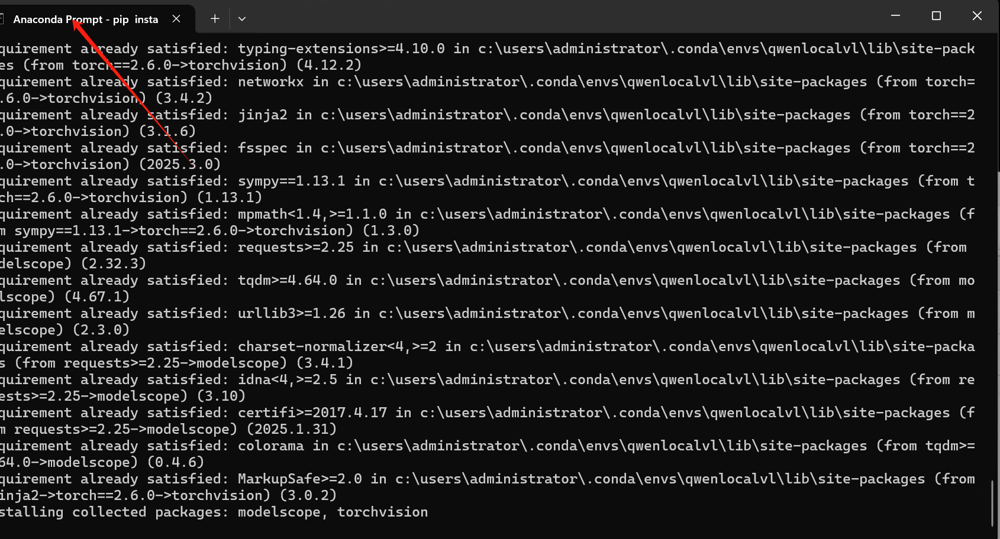

# 本地安装Qwen2.5-VL

### 创建虚拟环境
```python
conda create -n QwenLocalVL python=3.11
```

### 激活虚拟环境
```python
conda activate QwenLocalVL
```

### 安装依赖
```python
pip install git+https://github.com/huggingface/transformers accelerate
pip install qwen-vl-utils

```




> 更新: 2025-03-19 09:50:23  
> 原文: <https://www.yuque.com/lixinsi/vnere7/nmys1py8bszkq665>