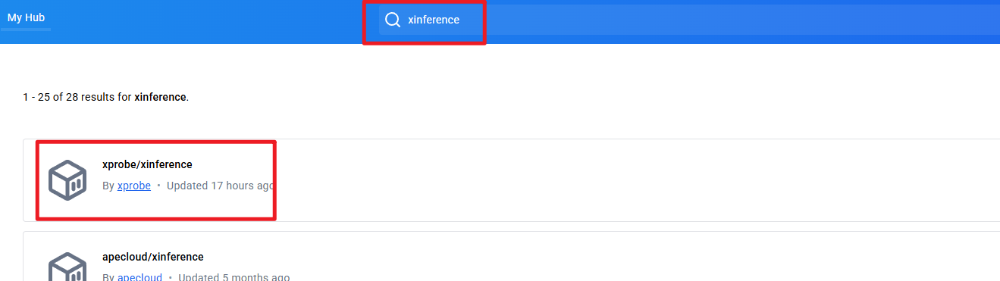
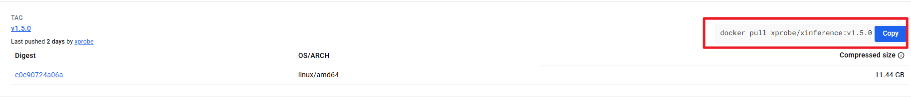
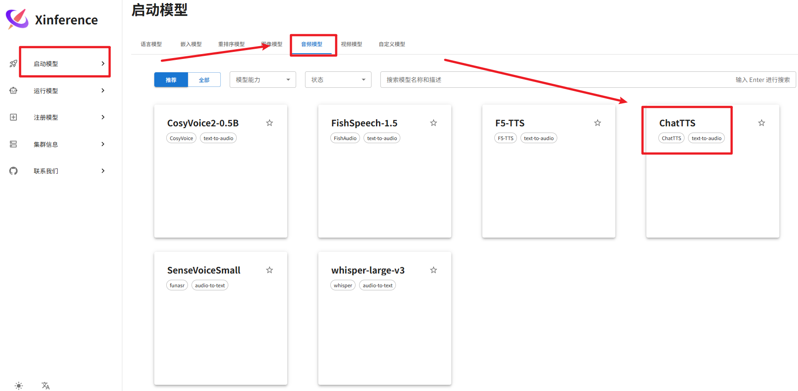
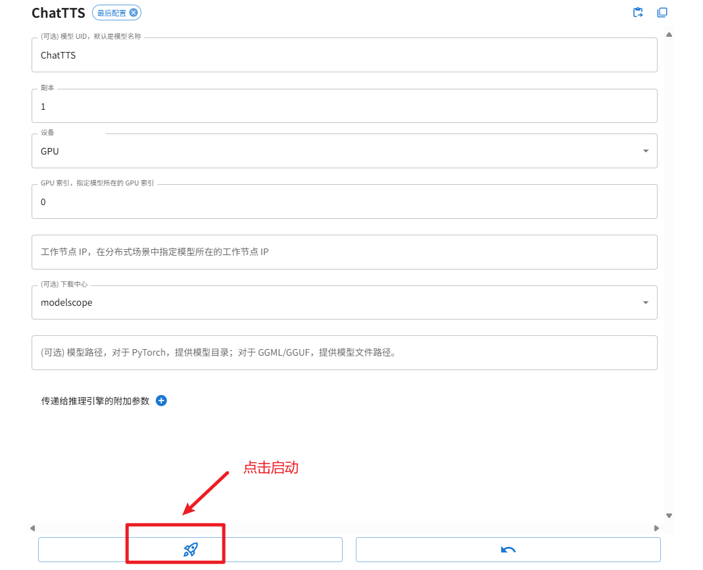
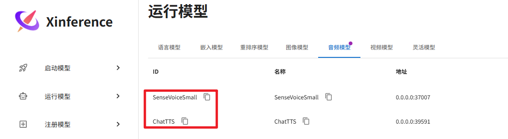
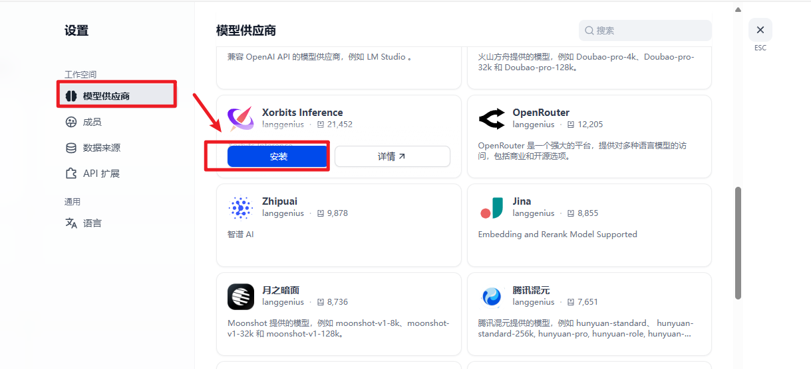
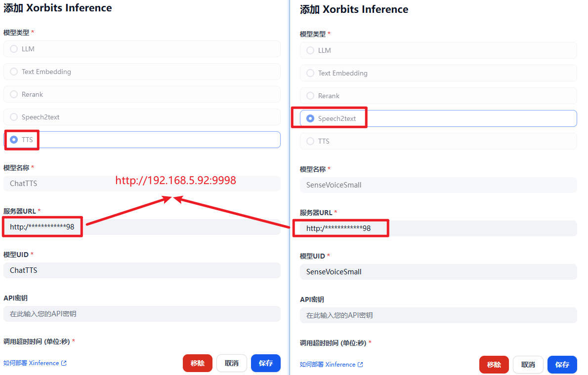

# 本地搭建语音聊天应用

我们要实现的效果是基于 dify + xinference + ChatTTS + SenseVoiceSmall 实现语音聊天助手：

1. 语音输入
2. 聊天内容生成
3. 语音输出

具体效果如下：

在这个过程中，我们需要做以下几件事情：

1. 使用 xinference 在本地部署两个语音模型，一个用于将输入语音转换为文本的 SenseVoiceSmall 模型，另一个是用于将文本转换为语音的 ChatTTS 模型
2. 在 dify 搭建一个简单的多轮聊天应用（云模型 API），配置使用本地部署的语音模型进行输入语音识别，以及语音输出

# 1. 语音模型部署

我们通过官方 docker 的方式安装 xinference 镜像。首先打开 docker hub，搜索 xinference，如下图：

[https://hub.docker.com/r/xprobe/xinference/tags](https://hub.docker.com/r/xprobe/xinference/tags)

然后，下载 v1.5.0 xinference 镜像版本，拷贝右侧的 docker pull 命令，在本地终端拉取该镜像，如下图所示：

docker pull xprobe/xinference:v1.5.0

最后，在终端执行如下命令启动 xinference：

docker run -v C:/Users/china/Documents/xinference\_models:/container/models -e XINFERENCE\_HOME=/container/models -e LD\_LIBRARY\_PATH=/opt/conda/envs/ffmpeg-env/lib:$LD\_LIBRARY\_PATH -p 9998:9997 --gpus all xprobe/xinference:v1.5.0 xinference-local -H 0.0.0.0

在浏览器输入 [http://localhost:9998/](http://192.168.5.24:9998/) 打开 xinference web 操作界面。接下来，下载、启动 SenseVoiceSmall 、ChattTTS 模型。具体操作为：在启动模型标签下，选择音频模型，并选择 ChatTTS、SenseVoiceSmall 模型分别下载并自动在本地部署该模型，过程如下面几张图所示：

**注意**：上图首次启动时，需要下载模型，在 cmd 界面可以看到下载进度。按照同样的方法下载和启动 SenseVoiceSmall 语音转文本模型。

2025-04-2105:10:17,535 xinference.core.worker38 INFO \[request 96b6ceac-1ea9-11f0-a80d-da53e7ccdb2e] Enter launch\_builtin\_model, args: <xinference.core.worker.WorkerActor object at 0x798c3f8f0630>, kwargs: model\_uid=ChatTTS-0,model\_name=ChatTTS,model\_size\_in\_billions=None,model\_format=None,quantization=None,model\_engine=None,model\_type=audio,n\_gpu=auto,request\_limits=None,peft\_model\_config=None,gpu\_idx=\[0],download\_hub=modelscope,model\_path=None,xavier\_config=None

2025-04-2105:10:17,538 xinference.core.worker38 INFO You specify to launch the model: ChatTTS on GPU index: \[0]**of** the worker: 0.0.0.0:57820, xinference will automatically ignore the `n_gpu` option.

2025-04-2105:10:19,387 - modelscope - WARNING - Using branch: master as version is unstable, use with caution

Downloading: 100%|██████████| 762/762\[00:00<00:00, 1.62kB/s]

Downloading: 100%|██████████| 71.0/71.0\[00:00<00:00, 212B/s]

Downloading: 100%|██████████| 98.9M/98.9M \[00:05<00:00, 18.1MB/s]

Downloading: 100%|██████████| 98.9M/98.9M \[00:12<00:00, 8.02MB/s]

Downloading: 100%|██████████| 117/117\[00:00<00:00, 400B/s]

Downloading: 100%|██████████| 26.5M/26.5M \[00:01<00:00, 17.0MB/s]

Downloading: 100%|██████████| 57.6M/57.6M \[00:02<00:00, 22.3MB/s]

Downloading: 100%|██████████| 143/143\[00:00<00:00, 475B/s]

Downloading: 100%|██████████| 57.6M/57.6M \[00:05<00:00, 10.5MB/s]

Downloading: 100%|██████████| 139M/139M \[00:06<00:00, 24.1MB/s]

Downloading: 100%|██████████| 859M/859M \[00:25<00:00, 35.9MB/s]

Downloading: 100%|██████████| 346/346\[00:00<00:00, 1.23kB/s]

Downloading: 100%|██████████| 814M/814M \[00:40<00:00, 21.3MB/s]

Downloading: 100%|██████████| 309/309\[00:00<00:00, 1.03kB/s]

Downloading: 100%|██████████| 1.88k/1.88k \[00:00<00:00, 7.06kB/s]

Downloading: 100%|██████████| 7.66k/7.66k \[00:00<00:00, 31.4kB/s]

Downloading: 100%|██████████| 4.16k/4.16k \[00:00<00:00, 16.9kB/s]

Downloading: 100%|██████████| 438k/438k \[00:00<00:00, 1.10MB/s]

Downloading: 100%|██████████| 329k/329k \[00:00<00:00, 781kB/s]

Downloading: 100%|██████████| 10.8k/10.8k \[00:00<00:00, 33.8kB/s]

Downloading: 100%|██████████| 51.8M/51.8M \[00:03<00:00, 16.5MB/s]

Downloading: 100%|██████████| 51.8M/51.8M \[00:07<00:00, 7.52MB/s]

Downloading: 100%|██████████| 460/460\[00:00<00:00, 1.74kB/s]

至此，ChatTTS、SenseVoiceSmall 在本地就部署完毕。

# 2. 语音模型使用

语音部署完毕之后，接下来打开 dify web 操作页面（我使用的是 1.0.1 版本），先增加模型提供商 Xorbits Inference 用于对接 xinference 部署的模型，如下图所示：

# 注意下面命令操作需要切换到下载的 dify 的 docker 目录下操作

# 启动 dify

docker compose up -d

# 停止 dify

docker compose down

接下来点击 Xorbits Inference，添加模型，配置两个语音模型，如下图所示：

接下来，创建一个默认的 ChatFlow 项目，如下图所示：

创建完成之后，不需要额外的工作流设计，默认就行，然后配置用于输入和输出语音模型。

点击发布按钮（注意：一定要先点击发布），接下来点击预览，输入聊天内容，当模型回复时，自动调用 ChatTTS、SenseVoiceSmall 模型进行语音的输入和输出。

> 更新: 2025-10-04 09:25:53  
> 原文: <https://www.yuque.com/lixinsi/vnere7/cos3ktxr3zi7wiba>