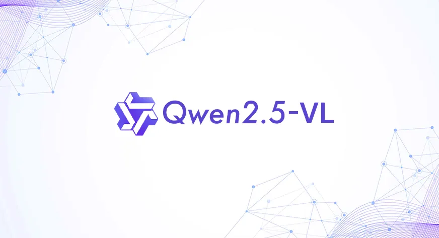
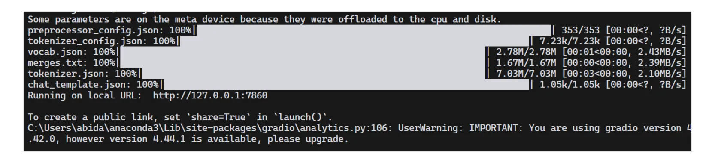
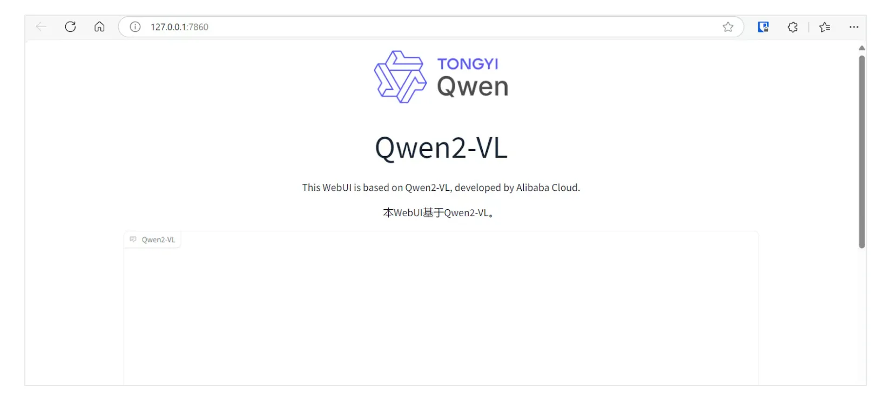
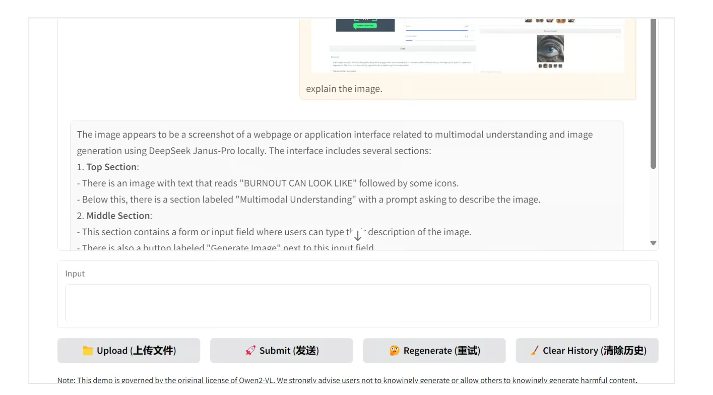
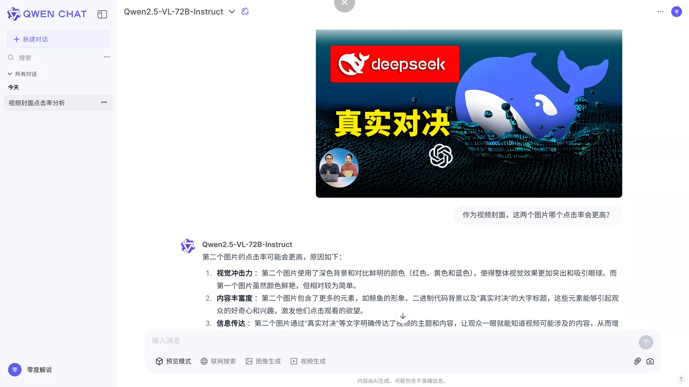
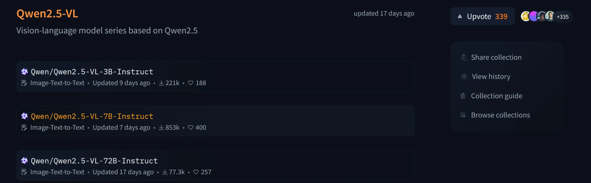

# 本地部署 Qwen2.5-VL 最强的开源视觉大模型！完全免费，相当的给力！！

<font style="color:rgb(78, 83, 88);">Qwen2.5-VL 是 Qwen 推出的全新旗舰视觉语言模型，较其前身 Qwen2-VL 有了重大飞跃。该模型不仅能够掌握花、鸟、鱼和昆虫等常见物体的识别，还能分析图像中的复杂文本、图表、图标、图形和布局，为多模态 AI 树立了新标准。</font>

<font style="color:rgb(78, 83, 88);"></font>

<font style="color:rgb(78, 83, 88);">此外，Qwen2.5-VL 被设计为高度代理，并且能够进行动态推理和工具指导——无论是在计算机还是手机上使用。</font>



<font style="color:rgb(78, 83, 88);">该模型的高级功能包括能够理解长度超过一小时的视频、精确定位其中的特定事件，并通过生成边界框或点来准确定位图像中的对象。它还为坐标和属性提供稳定的 JSON 输出，确保需要结构化数据的任务的准确性。</font>

<font style="color:rgb(78, 83, 88);">此外，Qwen2.5-VL 支持扫描文档（如发票、表格和表格）的结构化输出，这对金融和商业等行业非常有益。</font>


<font style="color:rgb(78, 83, 88);">旗舰模型 Qwen2.5-VL-72B-Instruct 在各种基准测试中均表现出色，展现了其处理各种领域和任务的多功能性。它的表现优于Gemini 2 Flash、GPT-4o和Claude 3.5 Sonnet等领先模型，巩固了其作为顶级视觉语言模型的地位。</font>

### <font style="color:rgb(78, 83, 88);">本地部署 Qwen2.5-VL ：</font>
<font style="color:rgb(78, 83, 88);">电脑上先安装好</font><font style="color:rgb(78, 83, 88);"> </font>[Git](https://git-scm.com/)<font style="color:rgb(78, 83, 88);"> </font><font style="color:rgb(78, 83, 88);">和</font><font style="color:rgb(78, 83, 88);"> </font>[Python](https://www.python.org/downloads/release/python-3106/)<font style="color:rgb(78, 83, 88);"> </font><font style="color:rgb(78, 83, 88);">环境，没有的可以自行先去安装， 我用的是Python 3.10.6 版本【</font>[**点击下载**](https://www.python.org/downloads/release/python-3106/)<font style="color:rgb(78, 83, 88);">】</font>

<font style="color:rgb(78, 83, 88);">1.首先克隆 Qwen2.5-VL GitHub 存储库并导航到项目目录：</font>

```plain
git clone https://github.com/QwenLM/Qwen2.5-VL


cd Qwen2.5-VL
```

<font style="color:rgb(78, 83, 88);">2.使用以下命令安装 Web 应用程序所需的依赖项：</font>

```plain
pip install -r requirements_web_demo.txt
```

<font style="color:rgb(78, 83, 88);">3. 为确保与 GPU 兼容，请安装支持 CUDA 的最新版本的 PyTorch、TorchVision 和 TorchAudio。即使已经安装了 PyTorch，您在运行 Web 应用程序时也可能会遇到问题，因此最好更新：</font>

```plain
pip install torch torchvision torchaudio --index-url https://download.pytorch.org/whl/cu124
```

<font style="color:rgb(78, 83, 88);">4. 更新 Gradio 和 Gradio Client 以避免连接和 UI 相关的错误，因为旧版本可能会导致问题：</font>

```plain
pip install -U gradio gradio_client
```

**<font style="color:rgb(0, 0, 255);">5.下方是模型的下载安装，总共有3个选项：</font>**

<font style="color:rgb(78, 83, 88);">较小的 3B 模型，建议在 GPU 内存有限的笔记本电脑（例如 8GB VRAM）上使用。</font>

```plain
python web_demo_mm.py --checkpoint-path "Qwen/Qwen2.5-VL-3B-Instruct"
```

<font style="color:rgb(78, 83, 88);">显存高于8G的可以选择7B模型，性能更强、效果更好！</font>

```plain
python web_demo_mm.py --checkpoint-path "Qwen/Qwen2.5-VL-7B-Instruct"
```

<font style="color:rgb(78, 83, 88);">如果是土豪，手里有专业级别的GPU，那么可以直接上72B的最大模型，性能直冲天花板！</font>

```plain
python web_demo_mm.py --checkpoint-path "Qwen/Qwen2.5-VL-72B-Instruct"
```

<font style="color:rgb(78, 83, 88);">我们可以看到，它首先下载了模型，然后加载了处理器和模型，</font>



<font style="color:rgb(78, 83, 88);">现在只需在浏览器上打开本地链接 http://127.0.0.1:7860 就可以正常使用！</font>




<font style="color:rgb(78, 83, 88);">6. 您可以上传带有文本和多个图形的图像，并让模型对其进行解释。即使是较小的 3B 模型也表现出令人印象深刻的性能，可以识别图像中的复杂细节。</font>



<font style="color:rgb(78, 83, 88);">当然如果你的电脑硬件不支持，那么可以直接使用官方的免费平台来使用，当然免费平台是共享GPU，有额度限制。唯一的好处可以直接免费使用</font><font style="color:rgb(78, 83, 88);"> </font>**<font style="color:rgb(78, 83, 88);">Qwen 2.5 VL 最强的78B模型！</font>****<font style="color:rgb(78, 83, 88);"> </font>****<font style="color:rgb(78, 83, 88);">Qwen 2.5 VL 免费官方平台</font>**<font style="color:rgb(78, 83, 88);"> </font><font style="color:rgb(78, 83, 88);">【</font>[点击前往](https://chat.qwenlm.ai/)<font style="color:rgb(78, 83, 88);">】</font>

<font style="color:rgb(78, 83, 88);">下方是我的实测效果，非常给力:</font>



<font style="color:rgb(78, 83, 88);">Qwen2.5-VL 3个完整开源版本已经托管在hugging face上，需要的可以自行去下载</font>

**<font style="color:rgb(78, 83, 88);">开源模型：【</font>**[**点击前往**](https://huggingface.co/collections/Qwen/qwen25-vl-6795ffac22b334a837c0f9a5)**<font style="color:rgb(78, 83, 88);"> </font>****<font style="color:rgb(78, 83, 88);">】</font>**



<font style="color:rgb(78, 83, 88);"></font>

**<font style="color:rgb(255, 0, 0);">如果关闭后下次打开的话，只需通过下方的命令即可重新启动：</font>**

<font style="color:rgb(78, 83, 88);">注意替换自己的模型</font>

```plain
cd Qwen2.5-VL

python web_demo_mm.py --checkpoint-path "Qwen/Qwen2.5-VL-7B-Instruct"
```


> 更新: 2025-03-22 12:18:30  
> 原文: <https://www.yuque.com/lixinsi/vnere7/vom8xsu6il0avwti>