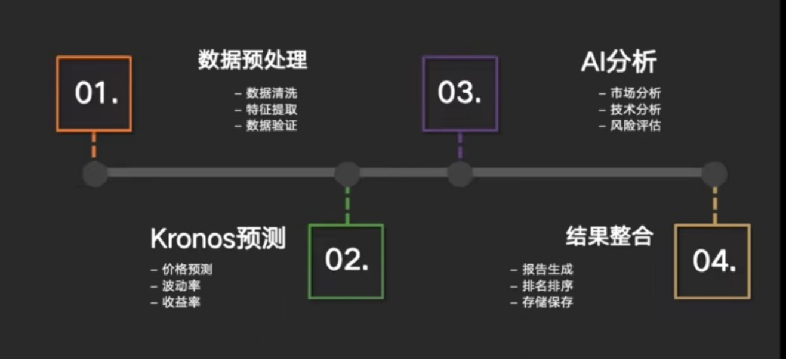

# 股票预测系统



根据您提供的图片和需求，我们将构建一个基于 **akshare** 的股票预测系统。该系统将遵循图中所示的四个阶段流程：数据预处理、Kronos预测、AI分析、结果整合。

以下是具体的技术架构和技术栈建议：

***

### ✅ 一、整体技术架构

| 阶段 | 技术实现 |
| --- | --- |
| **01. 数据预处理** | 使用 `akshare` 获取股票数据 → 数据清洗（pandas）→ 特征提取（技术指标如MA、RSI等）→ 数据验证 |
| **02. Kronos预测** | 使用时间序列模型（如LSTM、Prophet、ARIMA）进行价格、波动率、收益率预测 |
| **03. AI分析** | 使用机器学习模型（如XGBoost、LightGBM）做市场趋势判断、风险评估 |
| **04. 结果整合** | 生成可视化报告（matplotlib/seaborn/plotly），排序推荐，保存至数据库或CSV |

***

### ✅ 二、所需依赖库

```bash
pip install akshare pandas numpy scikit-learn matplotlib seaborn plotly tensorflow xgboost lightgbm
```

> 推荐使用 `Jupyter Notebook` 或 `VS Code + Python` 进行开发，便于调试与可视化。

***

### ✅ 三、详细步骤规划

#### 🔹 步骤 1：获取数据（akshare）

使用 `akshare` 获取沪深A股、美股等历史行情数据。

```python
import akshare as ak
import pandas as pd

# 示例：获取贵州茅台（600519.SH）的历史数据
stock_info = ak.stock_zh_a_hist(symbol="600519", period="daily", start_date="20200101", end_date="20251016")
print(stock_info.head())
```

#### 🔹 步骤 2：数据预处理

清洗数据、计算技术指标（如移动平均线、RSI、MACD）

```python
import ta  # Technical Analysis library

# 添加技术指标
stock_info['MA5'] = stock_info['收盘'].rolling(5).mean()
stock_info['MA10'] = stock_info['收盘'].rolling(10).mean()
stock_info['RSI'] = ta.trend.RSIIndicator(close=stock_info['收盘'], window=14).rsi()
```

#### 🔹 步骤 3：Kronos预测（以LSTM为例）

使用深度学习模型预测未来价格。

```python
from sklearn.preprocessing import MinMaxScaler
import numpy as np
from tensorflow.keras.models import Sequential
from tensorflow.keras.layers import LSTM, Dense

# 数据归一化
scaler = MinMaxScaler(feature_range=(0, 1))
scaled_data = scaler.fit_transform(stock_info[['收盘']].values)

# 构建训练集
def create_dataset(data, time_step=60):
    X, y = [], []
    for i in range(time_step, len(data)):
        X.append(data[i-time_step:i])
        y.append(data[i, 0])
    return np.array(X), np.array(y)

X, y = create_dataset(scaled_data, 60)

# 模型搭建
model = Sequential([
    LSTM(50, return_sequences=True, input_shape=(X.shape[1], X.shape[2])),
    LSTM(50),
    Dense(25),
    Dense(1)
])
model.compile(optimizer='adam', loss='mse')
model.fit(X, y, epochs=50, batch_size=32, verbose=1)
```

#### 🔹 步骤 4：AI分析（风险评估）

使用分类模型判断涨跌趋势。

```python
from sklearn.ensemble import RandomForestClassifier

# 标签：上涨为1，下跌为0
stock_info['target'] = (stock_info['收盘'] > stock_info['收盘'].shift(1)).astype(int)

# 特征选择
features = ['MA5', 'MA10', 'RSI']
X_train = stock_info[features].dropna().values
y_train = stock_info['target'].dropna().values

clf = RandomForestClassifier()
clf.fit(X_train, y_train)
```

#### 🔹 步骤 5：结果整合与可视化

```python
import plotly.graph_objects as go

fig = go.Figure()
fig.add_trace(go.Scatter(x=stock_info.index, y=stock_info['收盘'], mode='lines', name='收盘价'))
fig.add_trace(go.Scatter(x=stock_info.index, y=stock_info['MA5'], mode='lines', name='MA5'))
fig.show()
```

***

### ✅ 四、项目结构建议

```plain
stock_prediction_system/
│
├── data/
│   └── raw_data.csv          # 原始数据
│   └── processed_data.csv    # 处理后的数据
│
├── models/
│   ├── lstm_model.h5         # 保存的LSTM模型
│   └── rf_classifier.pkl     # 保存的随机森林模型
│
├── utils/
│   ├── data_preprocess.py    # 数据清洗与特征工程
│   └── prediction.py         # 预测逻辑
│
├── analysis/
│   └── risk_assessment.py    # 风险评估模块
│
├── visualize/
│   └── report_generator.py   # 报告生成与图表
│
└── main.py                   # 主程序入口
```

***

### ✅ 五、下一步行动建议

我将为您创建一个完整的项目框架，并逐步实现每个模块。是否需要我现在：

1. 创建项目目录？
2. 编写 `main.py` 入口文件？
3. 实现第一个功能：从 `akshare` 获取数据并保存？

请告诉我您的偏好，我可以立即开始执行。


> 更新: 2025-10-16 10:36:34  
> 原文: <https://www.yuque.com/lixinsi/vnere7/icdgzgf2gxo0ceay>