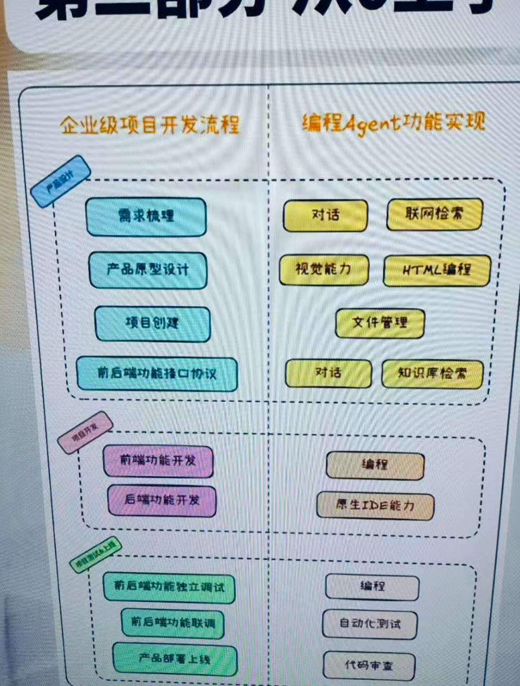
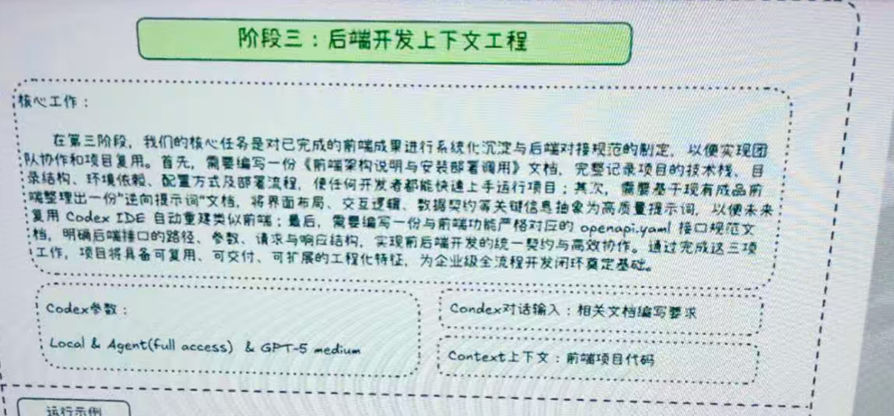
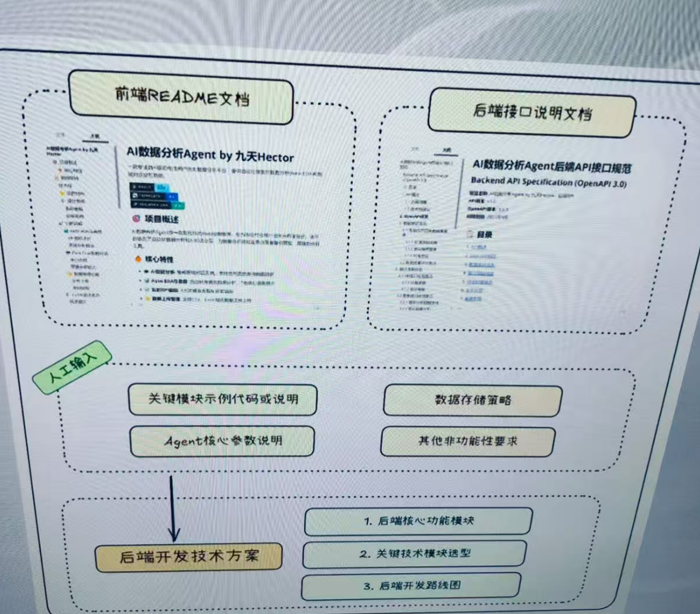
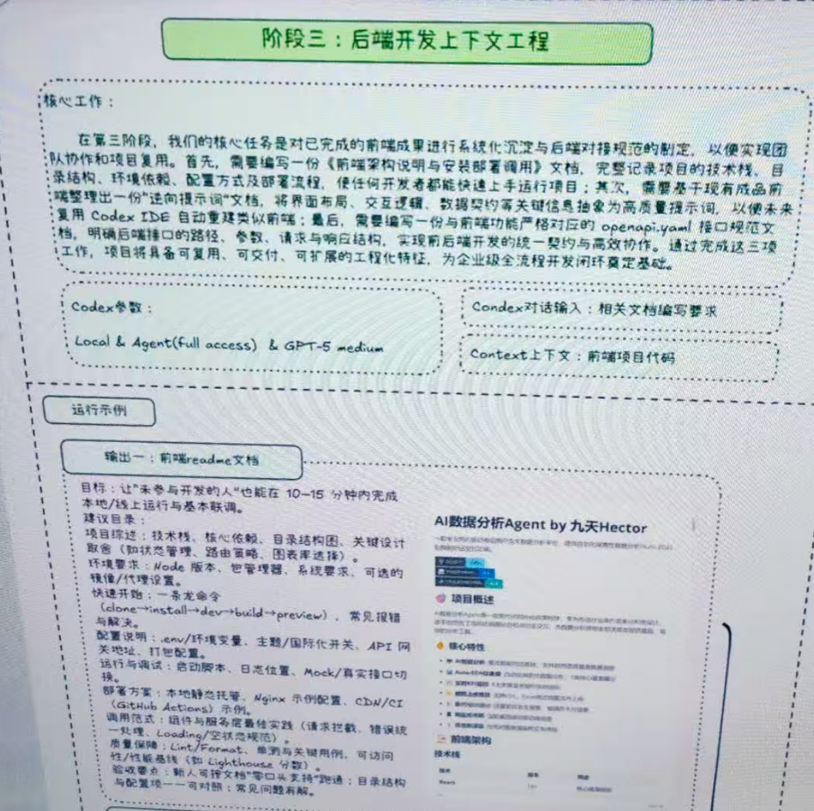
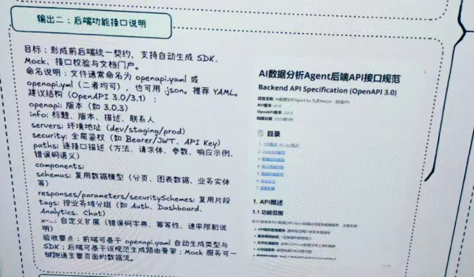
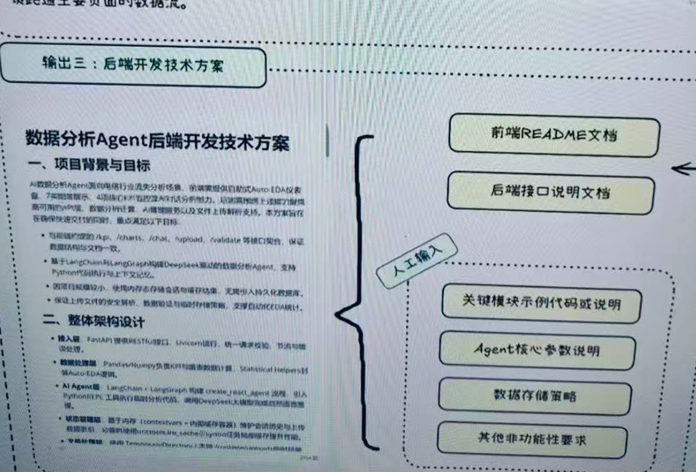
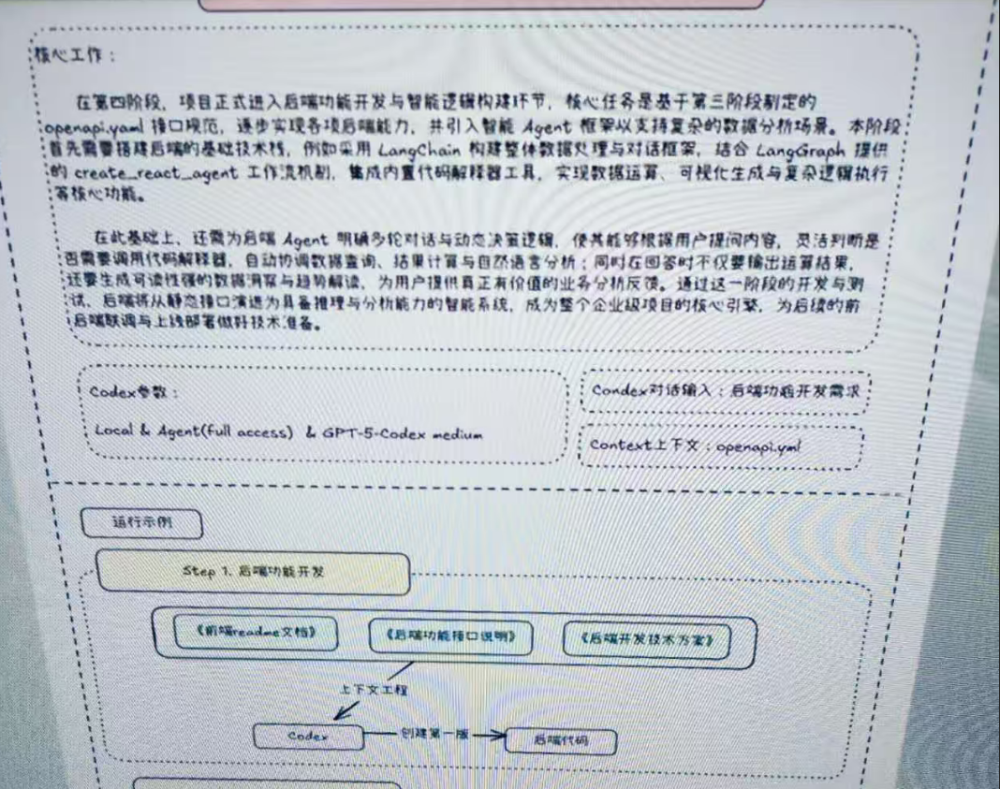

# 20251003codex开发总结

### 第一阶段交互式需求梳理
#### 核心工作
在这个阶段，我们的核心目标完成需求从零撒想法到系统化规则的梳理过程。企业级项目往往起始于用户的片段化设想与业务诉求，这些内容通常缺乏逻辑结构，优先级和实现边界，无法直接进入开发环节，因此这一阶段的工作重点，是引导用户以自然语言的不断描述，补充，澄清他们的设想，并通过与 codex 的多轮对话，让其主动提出问题，识别缺漏，整合要点，逐步将要结构化的想法提炼为一份条理清晰，边界明确，可执行的前端功能需求文档提示词。


```markdown
一.接下来请你帮找完善需求:我想要创建一个教学使用的简易A数据分析Agent(但是名字中不能包含简易两个字，名字就是数据分析Agenr)，是一个电脑Web请的应用(不考虑移动端功能)，该应用主要是包会两个功能，其一是教据可视化分析、其二是数据对话，具体功能如下:
1.允许用户上传csv或者excel数据，一旦用户上传数据，系统就会自动进行简单的数据处理，主要是采用众数对离散变量缺失值进行增补、以及采用均值对连续交量缺失值进行填补，从而形成一份完整的数据集。
2.一旦数据集处理完，就调用内部的Agent功能，自动生成一份简易的可规化分析报告，这个报告是全自动生成的，要求图文并茂，并合理的排布在一个16:9页面左侧2/3空间内，选择什么字段、绘制什么图片，都由当前的Agent来决定(这部分稍后我们再确定一下具体规则)。
3.允许用户单独选择一些数据集的字段，然后点击按钮即可这些选中的字段生成一份可视化分析报告，这里允许分开选择离散变量和连续变量，并目可以选择多个离散变量或者连续变量，然后同样生成那些图，也都是根据Agenl(以及包含一些生型的规则)来创建图片:
4.而无论用户是否上传了数据，都可以正常的和大模型进行聊天，在当前页面的右侧是实现1/3的位置，可以自动的agent进行对话，如果用户上传了数据，用户也可以在右侧是实现chat data功能。
5.无论是数据可视化分还是数据对话，背后都有一个Agent负贵进行功能实现，请基于我上面跟你说的那些功能，帮我进行更加完善的文字梳理，编写一份更加详细完整的ai数据分析agent功能需求文档（注事此时不涉及技术栈的说明，只是梳理需求）

二.明白了，那如果假设现在需求进一步简化，假设现在这个系统是定制化开发的一个数据分析系统，就是围绕咱们之前说的那个电信用户流失预测的数据集进行每月的分析，也就是可以选择不同的月份，然后就是围绕固定的那些字段进行分析，此时是不是就可以把
左侧的Auto-EDA这部分功能给确定下来（也说就是确定就是那几张图，然后选择不同的月份就带入不同的数据进行绘图）

三.我觉得你定的这个固定仪表盘的结构非常棒，现在我为了给codex进行更好的提示，我需要告诉codex现在数据集的基本情况，
我现在把这个数据集又再次发给你，为了让coedx更好的进行前端设计，你觉得需要告诉codex关于当前数据集的
那些信息呀？比如有那些字段？不同字段分别有那些取值么？不过我又觉得这个好像应该是后端传输给前端的信息，
这里我有点模糊。

四.非常棒，你看我现在打算使用codex来问陈这个web前端设计，你可以帮我梳理生成以及前端文档
```

```markdown
阶段一:调整前端风格样式
阶段二:调整前端核心功能
阶段三:对前端样式和功能进行精修
```

#### 调整前端风格样式提示词
```markdown
非常棒，现在整体功能框架是基本实现了，不过具体展示效果还需要进一步进行调整。首先让我们来调整下整体的色调如何?现在的配色是白底黑字，
我希望更加商务、现代一些，例如采用深色主题设计，同时具有紫色渐变背景和玻璃态卡片效果，请修改当前前端展示效果。
```

#### 调整前端核心功能
```markdown
第一排:KPI指标卡片-4个横向排列的 KPI卡片，内容
**Active Customers**:当前月活跃用户数(大字显示数值，下方小字显示同比/环比变化)
**Churned Customers**当前月流失人数(同样有同比/环比)
**Churn Rate**:流失率
**Monthly Sales**本月总销售额(美元)同比环比分两行，其中增加了用红字，下降了用绿字，同比和环比两个词用白色字#
**第二排:趋势分析*Churn Rate 趋势折线图**月份(最近6个月)Churn Rate (%%)显示波动趋势和拐点m要e分布雄营条形围"interetservice, onlinesecurityOnlineBackup,DeviceProtection,TechSupport, StreamingTVStreamingMovies“已购买 vs 未购买”拌井流失驱动因素(Top3)**张并列的堆叠桂状图每张图展示个离散变量 vs Churn变量取值(例如Contract: Month-to-month/One year/Two-横轴:
year_纵轴:人娽诀镈”ｾ妨咆-堆警Churn=Yes vs Churn=No变量选择:当月影响流失率德怣霜要李弱素00易高警青得合同流失率远高于年付在国表标题下方附合同”两张图表井列:
#“*第四排;流失用户画像*流关用卢雷达图(Radar Chart)**-维度:SeniorCiizen,Partner,Dependents, OnlineSecurity,Techsupport StreamingTV流关用户 vs 全体用户口统计堆条形自
-对比
2.人口统计堆叠条形图
横轴:性别、老年用户、是否有配偶、是否有赡养人
纵轴：人数占比
堆叠：流失 vs 未流失
(Mock Data)模拟数据
ukpis":"labe!":"Active Customers", "value": 6300, "yoy": "+2.1%","momu.1_0 5964{"labe!":"Churned Customers", "value": 743, "'yoy": "-10.2%","mam":"-2.0%""label''."Churn Rate", "value":"11.8%","yoy":"1.1%","mom":"-0.3%"{"{abé!": "Monthly Sales", "value": "$456,700", "'yoy": "+4.5%","mom':"+1.2%
Rchurn trend":{"months":['2024-08","2024-09","2024 10","2024 11","2024-12"2025-01'1"churn rate":[12.1,11.5,12.8,11.3,10.9,11.8]
product_distribution": {categories":"PhoneSerice""InternetService"."OnlineSecurity"
ronineBackup
ieViceProrewiio
```

#### 一、应用定位
设计一款 A1 數齪分析 Agant 的 扇面 Web 应用。应用分力 左在商部分:

。左侧213 区域:AtO·EDA仪表盘(国表+KP1卡片+可视化报街)

。右侧 1/3 区威:Data Chat(自然语言对话框)

目标:用户上作教量(电信用户流失数据类)，或遇择开份，即可在左两目动生成分术仪表盘，同时有倒幅与 M1 对过，进行数据问兽

#### 二、布局结构
页面整体

。顶栏:应用标题(A1数据分析 Agent)，右上角”选择月份“下拉框,

。主区镇:

。左傚(宽度 213):AutO·EDA 仪表盘

右侧(宽度 1/3):Duta Chat看p

三、左侧:Auto-EDA仪表盘

1.KP1 指标卡片(第一行，4 个卡片横向排列)

，Activecustomers;当月在网用户数例:6300

。小字:刚比2.1%，环比.0.5%。Churned Customers:当前月流失人数例:73

#### 优化后的提示词
```python
以下是对您的 Web 端需求文档进行的优化，考虑到现代产品经理的需求，增强了交互性、用户体验以及技术实现的可行性。

---

### 一、应用定位

**目标：**
设计一款 **A1 数据分析 Agent** 的扇面 Web 应用，帮助电信行业用户流失数据的分析。应用结合了**Auto-EDA 仪表盘**和**Data Chat 自然语言交互**功能，用户可以通过简单的操作实时查看关键指标和趋势，或通过自然语言提问获取定制化的数据分析结果。

---

### 二、布局结构

**页面整体：**

* **顶栏**：

  * 应用标题：`A1 数据分析 Agent`
  * 右上角：`选择月份` 下拉框（用户选择分析的月份，支持多个月份查看历史数据）。

**主区布局：**

* **左侧区域（宽度 213px）**：Auto-EDA 仪表盘

  * 显示 KPI 指标卡片、趋势图、环比数据等重要数据。
* **右侧区域（宽度 1/3）**：Data Chat 自然语言对话框

  * 用户可以通过自然语言输入问题，系统自动生成和返回数据分析结果。

---

### 三、左侧：Auto-EDA 仪表盘

1. **KPI 指标卡片**（第一行，4 个卡片横向排列）：

   * 每个卡片清晰展示重要数据并附带环比/同比对比。
   * **Active Customers**：当前月在网用户数（例如：6300）

     * 小字：同比增长2.1%，环比增长0.5%
   * **Churned Customers**：当前月流失用户数（例如：73）

     * 小字：同比减少1.2%，环比增加5%
   * **Customer Acquisition**：新增用户数（例如：120）

     * 小字：同比增长0.8%，环比增长1.5%
   * **ARPU (Average Revenue Per User)**：每用户平均收入（例如：15.3元）

     * 小字：同比减少0.3%，环比增长1.0%

2. **趋势图**：

   * 显示过去几个月关键指标的趋势图，例如：用户流失率、ARPU 等，支持平滑过渡的动画效果，提升交互体验。

3. **数据比较功能**：

   * 提供用户切换环比和同比视图，显示数据变化，并允许用户在不同时间区间内进行对比，支持时间轴控制，提升灵活性。

---

### 四、右侧：Data Chat

1. **自然语言输入框**：

   * 用户可以输入自然语言问题，系统自动识别并解析。
   * 提供简洁的指引，例如：`请输入数据问题（如：本月流失率）`，帮助用户更好地理解如何提问。

2. **智能聊天对话框**：

   * 显示用户的提问和系统的回应。
   * 系统通过自然语言处理（NLP）技术，解析并返回相关分析数据或图表，如：

     * “本月流失率是多少？” → 返回当前月流失率及环比同比变化。
     * “在过去三个月 ARPU 是否有增长？” → 返回 ARPU 趋势图。

3. **智能推荐**：

   * 基于用户历史提问和行为，系统自动推荐相关数据分析。例如：查看完“新增用户数”后，系统推荐“流失率”或“用户留存率”等指标。
   * **智能问答提示**：若用户输入不规范或未找到数据，系统提供常见问题的建议，进一步指导用户。

---

### 五、交互设计

1. **卡片式设计**：

   * KPI 卡片呈现方式清晰、简洁，用户可以点击每个卡片查看详细数据或图表。
   * 鼠标悬停在卡片上时，可以显示数据详情或提示信息，进一步增强交互性。

2. **动态数据更新**：

   * 页面自动刷新显示用户选择的月份或数据类别的最新数据。通过无缝的用户体验，确保数据更新时页面不会中断。

3. **数据筛选与搜索功能**：

   * 提供数据筛选功能（如按月份、地区、用户类型筛选数据）。
   * 支持模糊搜索，帮助用户快速查找特定指标或数据。

4. **响应式设计**：

   * 页面布局和元素自动适配不同屏幕大小，确保在桌面、平板、手机上均能提供优质的使用体验。

5. **数据导出功能**：

   * 用户可以导出所选的 KPI 数据、趋势图等为 Excel、CSV 或 PDF 格式，便于离线分析和报告生成。导出时允许选择数据范围和格式定制，满足不同需求。

---

### 六、智能分析与建议

1. **异常数据提醒**：

   * 系统实时检测关键指标的异常波动（如流失率激增），并主动提醒用户。通过可视化方式突出显示异常数据，并提供相关分析报告建议。

2. **智能报告生成**：

   * 系统根据用户的历史查询和数据变化，自动生成周期性报告，用户可以直接下载报告或通过邮件获取。这些报告包含流失分析、用户增长趋势、ARPU 等内容。

3. **趋势预测功能**（可选）：

   * 基于历史数据和机器学习算法，系统能够为未来几个月的关键指标提供预测数据，帮助用户进行前瞻性决策。

---

### 七、技术架构与实现

1. **前端技术栈**：

   * 使用 **React** 或 **Vue** 构建页面，确保高效的组件化开发。
   * 使用 **Chart.js** 或 **D3.js** 渲染趋势图、柱状图、折线图等可视化图表。
   * 利用 **TensorFlow.js** 或 **spaCy** 实现自然语言处理功能。

2. **后端技术栈**：

   * 后端使用 **Python + Flask/Django** 提供数据处理与 API 支持。
   * 使用 **pandas** 处理 Excel 文件，生成动态数据和趋势分析。

3. **数据存储**：

   * 使用 **SQL/NoSQL 数据库** 存储用户数据、历史记录和分析结果，确保高效的数据查询与管理。

---

通过优化设计，您的 Web 应用在增强数据分析功能的同时，也提升了用户交互体验和系统智能化水平。希望这个优化版能够满足现代产品经理的需求，帮助您实现更高效的产品交付！

```

#### 
### 第二阶段生成式前端开发


```python
接下来请帮我创建一个单html的简单桌面端web页面，需求如下:请为一项服务生成一个精美、逼真的着陆页(LandingPage)。这项服务旨在为终极咖啡爱好者提供每月200美元的订阅，内容包括咖啡烘焙和制作极致意式浓缩咖啡的设备租赁和指导。目标受众是湾区(Bay Area)的中年人士，他们可能从事科技行业，受过良好教育，拥有可支配收入，并且对咖啡的艺术和科学充满热情。请优化设计以促成6个月订阅的转化，请直接创建相关代码文件并自行命名。
```

```markdown
前端README文档前
后端接口说明文档
后端开发技术方案
```

#### 前端 readme 文档
```markdown
非常棒，现在这个页面功能已经很完善了，你能在不修改现有功能的情况下，帮我创建一个前端项目的readme文档嘛?
详细说明前端架构、功能、以及部署方法(也需要尽量拓展一些其他说明，需要尽量写详细一些)
```


#### 后端接口说明文档
```markdown
这一版功能设计的非常棒，然后你看现在我们还是一个单独的前端应用接下来我想继续开发后端功能，
不过需要根据咱们前端的功能需求来编写后端功能，所以请你帮我根据围绕目前前端的功能实现，
来编写一份后端功能接口说明(OpenAPI规范)，要求详细完整，能满足目前前端的全部功能，
由于当前咱们这个项目只允许对特定格式的数据集进行处理，所以后端在读取数据的时候会进行数据检查，
只有满足要求的数据才能进行展示，现在请你来编写一份后端功能接口说明(OpenAPI规范)
```


#### 后端开发技术方案
```markdown
非常棒，现在请根据关联的当前项目的《前端README》文档中的项目功能描述、以及《后端接口功能说明》，编写一份详细完整的《后端开发技术方案》，其中必须要包含以下内容:
1.详细梳理即将要进行开发的功能模块;
2.每个功能模块需要围绕核心技术点进行技术选型;
3.根据各功能模块划分，明确基本的开发路线;同时需要注意的是，本次后端整体是一个数据分析Agent，整体功能并不算特别复杂但有以下几点注意事项:
1.【数据分析Agent功能实现】，需要使用LangChain&LangGraph技术框架进行开发，建议使用LangChain内置的PythonREPL库完成Python代码运行，并通过LangGraph的create react agent快速完成Agent搭建;
2.【数据分析Agent核心参数说明】，使用DeepSeek模型作为基座模型，DeepSeek的API-KEY保存在项目根目录下的.env文件中的DEEPSEEK_APILKEY变量中;
3.【后端数据存储策略】，本次开发的项目较为简单，不需要设置额外的数据库存储历史对话和用户信息，可以直接将历史对话保存在内存中，也不需要保存历史用户上传的请根据以上要求，编写这份《后端开发技术方案》，并将其保存在项目根目录下。数据集信息;
```

### 第三阶段后端开发上下文工程




```markdown
Step 1.后端功能开发
Step 2.后端功能测试与debug
Step 3.前后端联调
```







### 第四阶段后端功能开发与测试
```markdown
Step 1.后端功能开发
Step 2.后端功能测试与debug
Step 3.前后端联调
```

#### 后端开发
```markdown
在我正在进行一项AI数据分析Agent开发，接下来请你帮我完成这个项目的后端功能开发，项目情况和具体能要求如下:目前项目已经完成前端的全部功能开发，
前端代码在,/ai-data-agent-frontend文件夹内，前端功能完整码正常，可以通过npm run dev直接运行，
目前通过mock数据支撑各项功能;当前项目的完整功能请参考《前端README》文档
，前后端接口请参考《后端接口功能说明》文档;请你参考《后端开发技术方案》里面的内容，
完成后端开发。由于当前项目较为复杂，
所以请严格按照《后开发技术方案》中的说明进行开发;.
对于不同的功能模块，尤其是Agent功能模块，请自行进行测试以确保功能完整;,请设置后端服务端口默认为8002
;根据上述要求进行当前项目的后端功能开发。
```

#### 前后端联调
```markdown
现在我正在进行一项AI数据分析Agent开发，目前前后端都已经完成了开发，
前端代码在./ai-data-agent-frontend文件夹内，前端功能完整、代码正常，
可以通过npm run dev直接运行，目前通过mock数据支撑各项功能;后端代码在./backend文件夹中。
当前项目的完整功能请参考《前端README》文档前后端接口请参考《后端接口功能说明》文档;目前后端服务端口默认为8002;
现在可以开始前后端联调了对吧?请你现在再帮我检查系下前后端功能是否正确，重点关注前端的各状态后端能否支持，
包括首次打开页面时不带入任何数据集的对话状态、以及上传数据时等待的状态页面展示、以及如果数据集格式不对，是否有弹窗提示需要更换数据集?请再进行检查并进行必要的修改，
需要注意非必要不要额外新增前后端功能，调试完成后，请告诉我前后端开启方法，我将进行最后的联调测试。需要注意不要轻易修改前后端的功能以及各种按钮，首次打开页面的时候左侧页面(也就是可视化部分页面)应该是显示蒙版并提示上传数据集。
```




> 更新: 2025-10-04 10:58:43  
> 原文: <https://www.yuque.com/lixinsi/srnvya/lisfbrr1g2zeibu3>