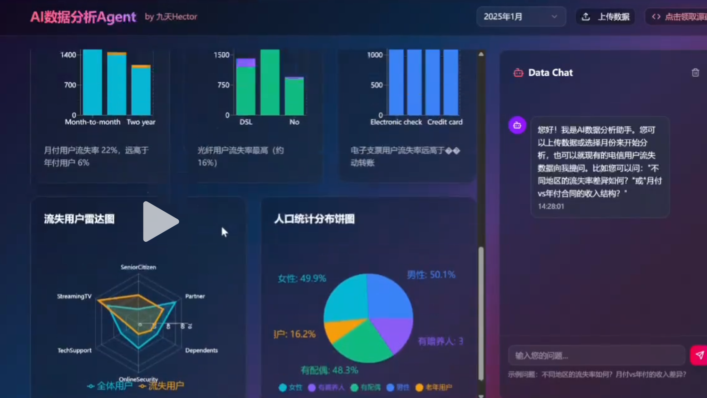
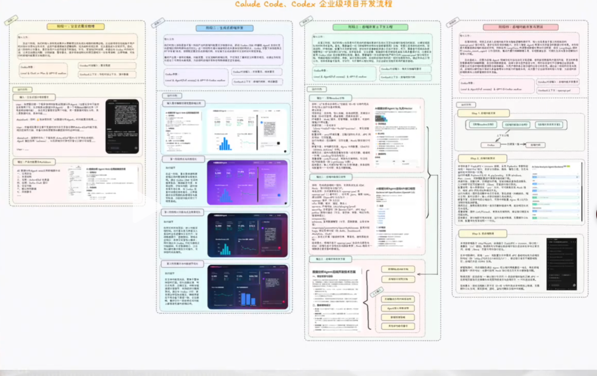

# codex完整开发总结

#### 前后端完整的数据分析 agent




### 前端
#### 功能
```python
我想要创建一个教学使用的简易A数据分析
Agent（但是名字中不能包含简易两个字，
名字就是Al数据分析Agent），是一个电脑
Web端的应用（不考虑移动端功能），该应用
主要是包含两个功能，其一是数据可视化分
析、其二是数据对话，具体功能如下：1.允
许用户上传csv或者excel数据，一旦用户上
传数据，系统就会自动进行简单的数据处
理，主要是采用众数对离散变量缺失值进行
填补、以及采用均值对连续变量缺失值进行
填补，从而形成一份完整的数据集；2.一旦
数据集处理完，就调用内部的Agent功能，
自动生成一份简易的可视化分析报告，这个
报告是全自动生成的，要求图文并茂，并合
理的排布在一个16：9页面左侧2/3空间内，
选择什么字段、绘制什么图片，都由当前的
字段，然后点击按钮即可围绕这些选中的字
段生成一份可视化分析报告，这里允许分开
选择离散变量和连续变量，并且可以选择多
个离散变量或者连续变量，然后同样生成哪
些图、如何生成这些图，也都是根据Agent
（以及包含一些生图的规则）来创建图片；
4.而无论用户是否上传了数据，都可以正常
的和大模型进行聊天。在当前页面的右侧1/3
的位置，可以自动的和Agent进行对话，如
果用户上传了数据，用户也可以在右侧是实
现ChatData功能。5无论是数据可视化分析
还是数据对话，背后都由一个Agent负责进
行功能实现；请基于我上面跟你说的这些功
能，帮我进行更加完善的文字梳理，请注
意，只需要帮我梳理下需求即可哦

```


> 更新: 2025-10-01 12:52:40  
> 原文: <https://www.yuque.com/lixinsi/srnvya/ymht5yt3427dnw83>