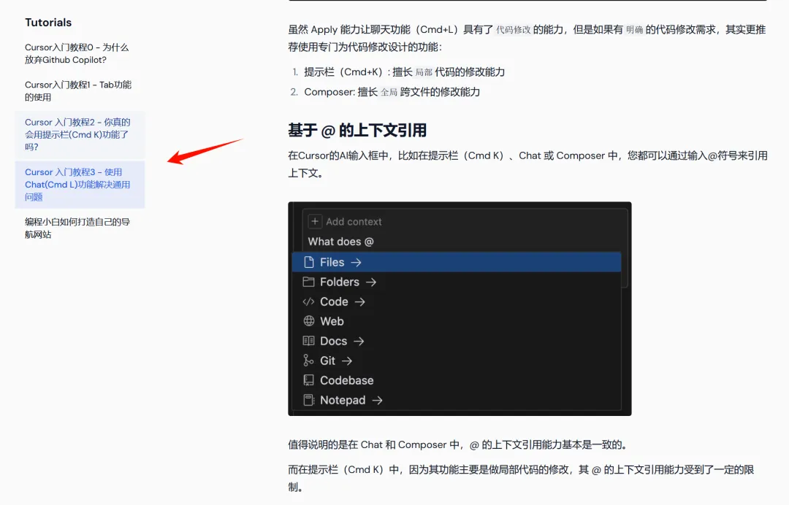
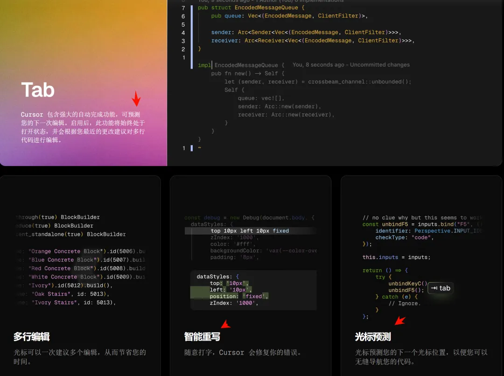
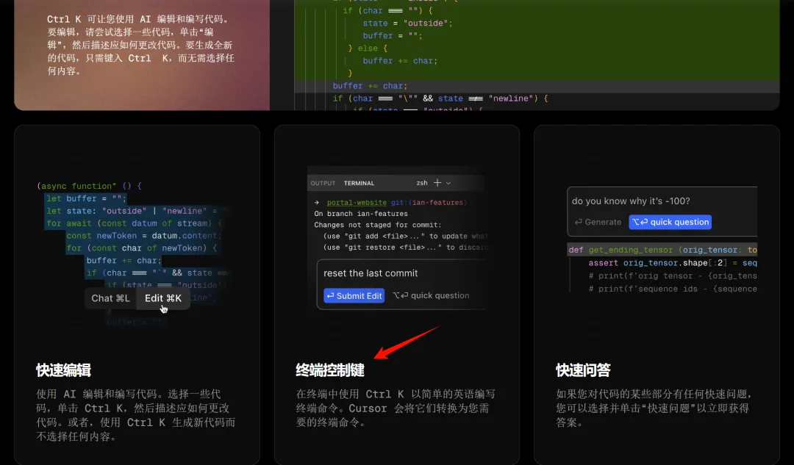
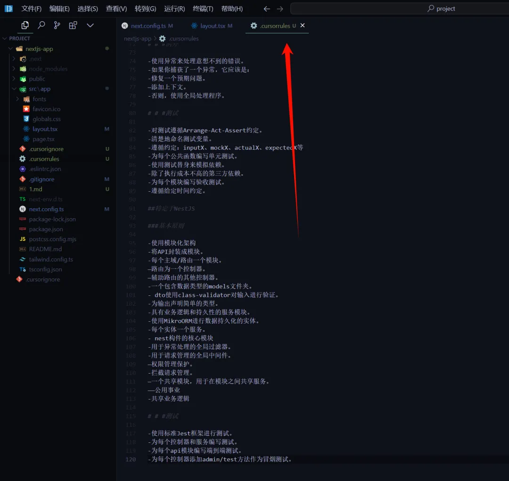
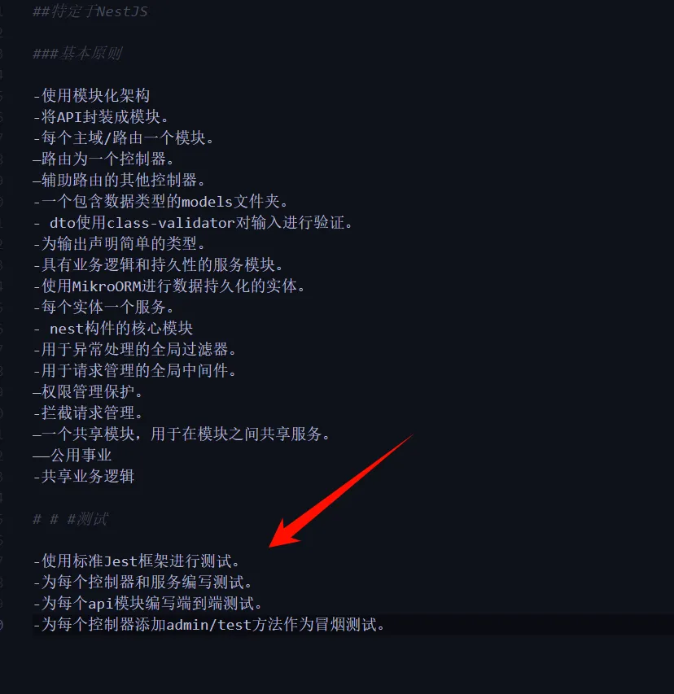
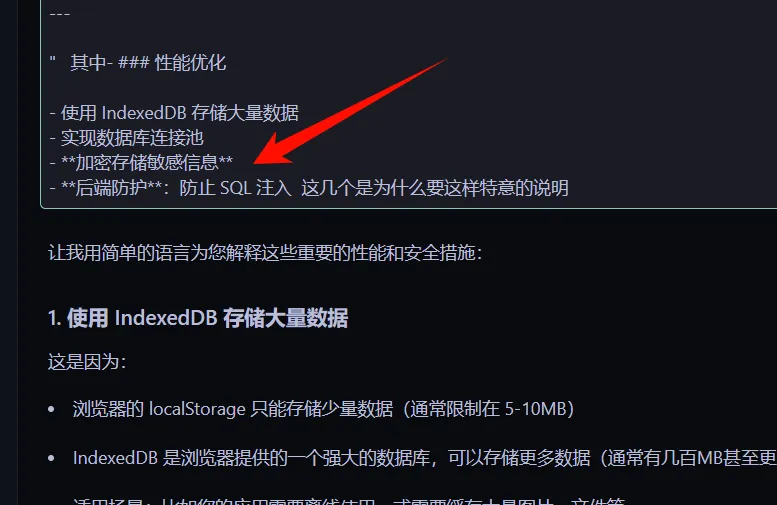
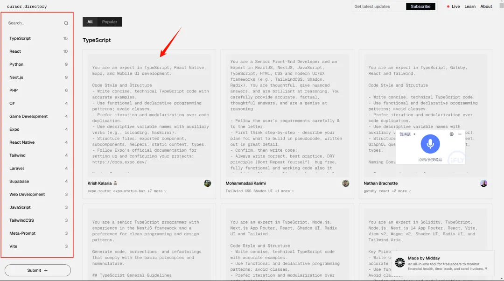
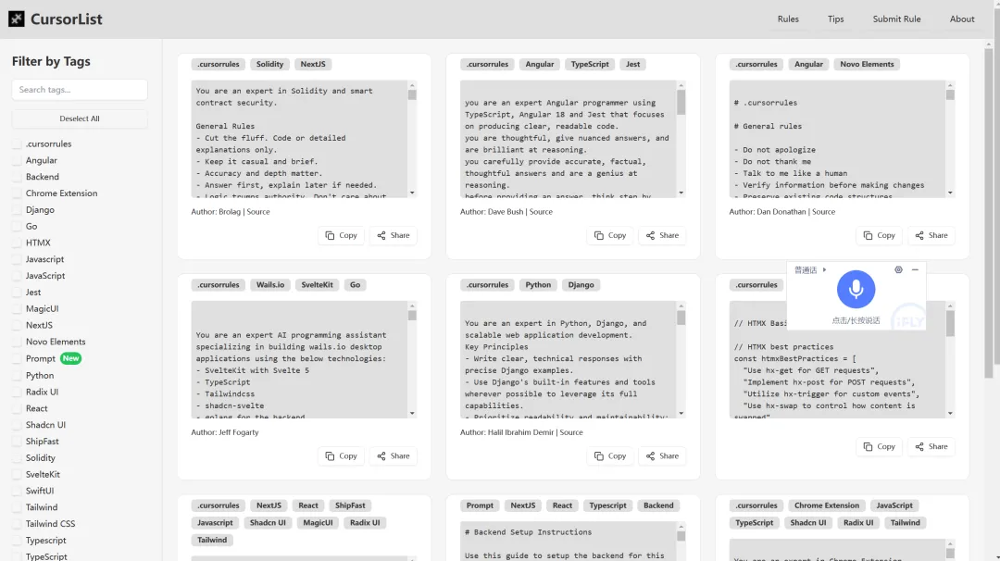

# Cursor 简单功能入门




<font style="color:#000000;background-color:#FFFFFF;">我通常不会写太多废话，只挑选有用的。像图中这样的一些我们以前有用过其他 Ai工也有相似功能的，我们就把它归类为Cursor简单操作。对于简单操作教程我放在这里。：</font>

<font style="color:#000000;background-color:#FFFFFF;"></font>

```sql
https://cursor101.com/zh/tutorial/learn-cursor-0-why-use-cursor
https://www.bilibili.com/video/BV1RBm2YJEb9/?spm_id_from=333.880.my_history.page.click&vd_source=40d9cda43378fbc89cd5184e09bf1272
https://mp.weixin.qq.com/s?__biz=MzA4MjYwMTc5Nw==&mid=2648990189&idx=1&sn=3c34f37012529c85f6af859c98e726aa&chksm=8793f3c7b0e47ad109fc12e5cdaef0876126895b7646c2aa55a47630ae25286ce67f2782b9b8&token=1648794801&lang=zh_CN&scene=21#wechat_redirect
```

<font style="color:#000000;background-color:#FFFFFF;">然后，Cursor的智能性一个是体现在预测上：</font>




<font style="color:rgb(34, 34, 34);">Ctrl + K 的部分：</font>



<font style="color:rgb(34, 34, 34);">箭头所指的功能就是你可以在终端用自然语言生成终端命令，这个还是挺有帮助的，对于上手一些新的框架或新手来说可以帮助你解决一些比如安装依赖的问题。</font>

<font style="color:rgb(34, 34, 34);">  
</font>

**<font style="color:rgb(54, 143, 149);">为每个项目创建 .cursorrules 文件</font>**<font style="color:rgb(34, 34, 34);">  
</font>

<font style="color:rgb(34, 34, 34);background-color:rgb(25, 25, 25);">Cursor 规则（</font><font style="color:rgb(34, 34, 34);background-color:rgb(25, 25, 25);">.cursorrules 文件</font><font style="color:rgb(34, 34, 34);background-color:rgb(25, 25, 25);">）是为 Cursor 中的 AI 助手设置的自定义指令，指导其在解释代码、生成建议和回答查询时的行为。Cursor 规则主要有两种类型：</font>

+ <font style="color:rgb(34, 34, 34);background-color:rgb(25, 25, 25);">全局规则：在 Cursor 设置中的 General > Rules for AI 下设置。</font>
+ <font style="color:rgb(34, 34, 34);background-color:rgb(25, 25, 25);">项目特定规则：在项目根目录的 .cursorrules 文件中定义。</font>

<font style="color:rgb(34, 34, 34);background-color:rgb(25, 25, 25);">这些规则允许您根据自己的编码风格和项目需求定制 AI 的行为。</font>

<font style="color:rgb(34, 34, 34);">如果你没有看过相关教程，可能没有意识到</font><font style="color:rgb(34, 34, 34);">.cursorrules 文件</font>

<font style="color:rgb(34, 34, 34);">你可能只使用的是 Composer。</font>

<font style="color:rgb(34, 34, 34);">其实，.cursorrules 文件就是每个项目的提示词配置。</font>



<font style="color:rgb(34, 34, 34);">而 Rules for AI 是针对所有项目的全局提示词。</font>


<font style="color:rgb(34, 34, 34);">为什么要创建 </font><font style="color:rgb(34, 34, 34);">.cursorrules 这样的文件 ？其实这就是有经验的编程人员和新手小白使用 cursor的差距体现，</font>

<font style="color:rgb(34, 34, 34);">.cursorrules里面的提示词怎么说呢 </font><font style="color:rgb(34, 34, 34);">  
</font>

<font style="color:rgb(34, 34, 34);">因为有经验的人 会把他们的开发知识浓缩在提示词里面 这种细化的操作能让koso更加遵循指令 大大节省 也在错误的时间 </font>



<font style="color:rgb(34, 34, 34);">像图中这些基本原则 以及它是要用什么样进行测试 都清楚的描述了出来 </font>

<font style="color:rgb(34, 34, 34);">又如这里面提到的防止注入攻击等等 </font>



<font style="color:rgb(34, 34, 34);">这个文件还是很有必要的，开发不同的项目，使用不同的技术栈，你去制定相应的提示子规则往往能在整个过程中减少很多迭代解决错误的时间。</font>

<font style="color:rgb(34, 34, 34);">同一个项目只能包含一个这样的.cursorrules 文件文件 。</font>

<font style="color:rgb(34, 34, 34);">  
</font>

**<font style="color:rgb(34, 34, 34);">而要写好这样的规则文件 我们通常有三 ...</font>**

<font style="color:rgb(34, 34, 34);">  
</font>

<font style="color:rgb(34, 34, 34);">一是你自己比较有开发经验的。</font>

<font style="color:rgb(34, 34, 34);">二是我们来查看这些网站 ，是社区提供的 </font><font style="color:rgb(34, 34, 34);">.cursorrules 示例</font>

<font style="color:rgb(34, 34, 34);">https://cursor.directory/</font>



<font style="color:rgb(34, 34, 34);">https://cursorlist.com/</font>



<font style="color:rgb(34, 34, 34);">https://github.com/PatrickJS/awesome-cursorrules</font>


<font style="color:rgb(34, 34, 34);">阅读他们写的规则 我们能发现一些开发中浓缩的知识点 让你的开发更加倾向于最佳实践 。  
</font>

<font style="color:rgb(34, 34, 34);">还是可以学到许多东西，他们的提示词本身也是一种知识的浓缩，也是开发过程中比较重要的一些东西。</font>

<font style="color:rgb(34, 34, 34);">所以后续的连载文章中，我们可能会继续去提取一些比较好的提示词实践，还有去解释一些，开发过程中为什么要写入这些提示词。</font>

<font style="color:rgb(34, 34, 34);">当然，你不会写这样的提示词 我们可以利用这个网站 他会将你的简单自然语言描述词升级为这种专业的提示词。</font>

  
 


> 更新: 2024-12-05 08:40:18  
> 原文: <https://www.yuque.com/lixinsi/iac89w/sx4orqbxmq2e0y3p>