# WindSurf+Bolt+Cursor+Sealos：构建AI播客应用程序，前后端分离、对象存储、数据库存储、部署、K8S

# <font style="color:#000000;background-color:#FFFFFF;"></font>
##### 
<font style="color:#000000;background-color:#FFFFFF;">Hi，这里是Aitrainee，欢迎阅读本期新文章。</font>

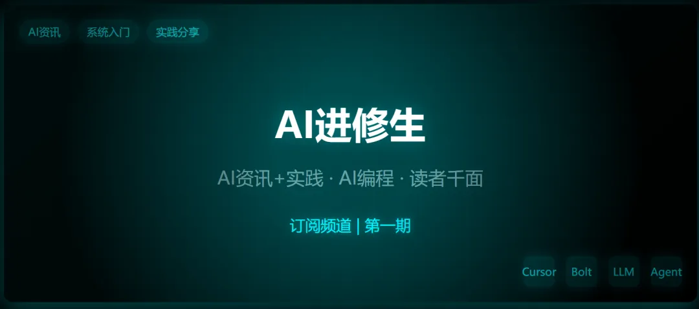

<font style="color:#000000;background-color:#FFFFFF;">后台小伙伴问知识星球和系统性课程（如Ai编程），我可能不想弄什么知识付费社群，还是喜欢Youtube频道订阅的形式，能专注内容不脱离平台，大家有兴趣可订阅本合集，第一期可能会连载许多AI编程的内容。</font>

<font style="color:#000000;background-color:#FFFFFF;">公众号合集如同Youtube订阅频道，</font><font style="color:#000000;background-color:#FFFFFF;">每一期的内容可包含</font><font style="color:#000000;background-color:#FFFFFF;">AI编程、LLM微调部署、Agent 以及AI各渠道源内容，洞见有用之物。</font>

<font style="color:#000000;background-color:#FFFFFF;">有些小伙伴或因为公众号一篇文章，后续想要入门的、系统的；如AI编程（Cursor等）</font>

<font style="color:#000000;background-color:#FFFFFF;">或进阶的+实时的：想看国内外最新实践，AI变化比较快，需要一直跟进并汇集最佳实践。</font>

<font style="color:#000000;background-color:#FFFFFF;">知识库搭建、Agent编排、大模型的微调和部署、AI视觉我以前在做，以往的文章有提到但不多。</font>

<font style="color:#000000;background-color:#FFFFFF;">文章可包含录制的视频，有用资源的整合，文末</font><font style="color:#000000;background-color:#FFFFFF;">会</font><font style="color:#000000;background-color:#FFFFFF;">有合</font><font style="color:#000000;background-color:#FFFFFF;">集群聊，以存放整理的资源，也起</font><font style="color:#000000;background-color:#FFFFFF;">沟通分享之用。</font>

<font style="color:#000000;background-color:#FFFFFF;">启发、资讯、实践、沉淀，读者千面。</font>

<font style="color:#000000;background-color:#FFFFFF;">好了，充电频道，动力动力力力......</font>

<font style="color:#000000;background-color:#FFFFFF;">这期15篇，每一期可能需要一个多月连载，下期合集包含上期好的内容方便全览，未按频率更新，读者可退订。  
</font>

<font style="color:#000000;background-color:#FFFFFF;">>/ 引言完，本文内容开始：</font>

<font style="color:#000000;background-color:#FFFFFF;">因为有小伙伴后台</font><font style="color:#000000;background-color:#FFFFFF;">@</font><font style="color:#000000;background-color:#FFFFFF;">讲讲Ai播客使用 Cursor / Bolt构建流程，所以这是今天这篇文章的主要内容。  
</font>

<font style="color:#000000;background-color:#FFFFFF;">这个应用构建我们分 前后端不分离，和前后端分离来讲（对</font><font style="color:#000000;background-color:#FFFFFF;">前后端</font><font style="color:#000000;background-color:#FFFFFF;">不熟悉的话，文末有）。</font>

<font style="color:#000000;background-color:#FFFFFF;">你说为什么要分，那是因为最开始构建这个程序的时候给它提示词它是直接按前后端不分离构建完的，后面想想再重做一遍给他搞搞前后端分离的。</font>

<font style="color:#000000;background-color:#FFFFFF;">这篇偏主框架，一些基础细节可能会在后续连载文章，也有可能换用构建其他东西的表现形式来提供。</font>

<font style="color:#000000;background-color:#FFFFFF;">我们以</font>**<font style="color:#000000;background-color:#FFFFFF;">使用AI工具的角度</font>**<font style="color:#000000;background-color:#FFFFFF;">来构建这样的前后端应用、也包括数据库的连接、服务化的部署、最后生产环境的应用发布等等。</font>

<font style="color:#000000;background-color:#FFFFFF;">既然是使用AI的角度，我们就更多的是去说提示词和工作流的逻辑（AI 驱动的开发思想）。</font>

<font style="color:#000000;background-color:#FFFFFF;">Ai编程这个东西肯定本身对于编程越有经验的用起来越好。</font>

<font style="color:#000000;background-color:#FFFFFF;">另外很大的一头就是编程领域初学者能和ai配合构建项目，更好的学习。</font>

<font style="color:#000000;background-color:#FFFFFF;">而其他没有太多经验的人群也比较可以快速入门，毕竟这正是 AI 的核心价值之一：</font>**<font style="color:#000000;background-color:#FFFFFF;">降低专业门槛。</font>**

<font style="color:#000000;background-color:#FFFFFF;">本文我们就</font><font style="color:#000000;background-color:#FFFFFF;">是无代码自然语言解决编程的问题，再加上点点按钮（指的是使用Sealos 这些）解决部署维护的问题，</font><font style="color:#000000;background-color:#FFFFFF;">这样我们就能完成应用从构建到发布的整个流程。我们也能更专注于创意和核心功能。</font>

<font style="color:#000000;background-color:#FFFFFF;">所以我们不会讲那些细节的代码什么的，因为也没什么太大的价值，AI播客本来也是作为使用这些AI工具的演示应用，最主要是这些</font>**<font style="color:#000000;background-color:#FFFFFF;">AI 驱动的开发思想</font>**<font style="color:#000000;background-color:#FFFFFF;">可以用在其他的应用构建上，</font><font style="color:#000000;background-color:#FFFFFF;">又或者我们介绍的这个Sealos 又会对你未来的一些实践很有帮助。</font>

<font style="color:#000000;background-color:#FFFFFF;">  
</font>

**<font style="color:#000000;background-color:#FFFFFF;">预先了解</font>**

<font style="color:#000000;background-color:#FFFFFF;">介绍本文要用到的东西：</font>**<font style="color:#000000;background-color:#FFFFFF;">Sealos</font>****<font style="color:#000000;background-color:#FFFFFF;"> </font>**<font style="color:#000000;background-color:#FFFFFF;">——</font>

<font style="color:#000000;background-color:#FFFFFF;">Sealos 是一个无需云计算专业知识即可快速部署、管理和扩展应用的云操作系统，其操作体验简单直观，就像使用个人电脑一样！它为开发者和团队提供了以下核心优势：</font>

+ <font style="color:#000000;background-color:#FFFFFF;">快速部署：几秒钟内完成云端环境的搭建，即开即用，无需复杂配置。</font>
+ <font style="color:#000000;background-color:#FFFFFF;">高效便捷：支持按量付费模式，灵活使用公有云资源，极大地降低了开发成本。</font>
+ <font style="color:#000000;background-color:#FFFFFF;">强大的 Kubernetes 能力：内置弹性伸缩、负载均衡等特性，充分利用 K8S 的分布式管理优势。</font>
+ <font style="color:#000000;background-color:#FFFFFF;">轻松管理与发布：能够快速管理和发布分布式应用，适用于各类实际生产环境。</font>

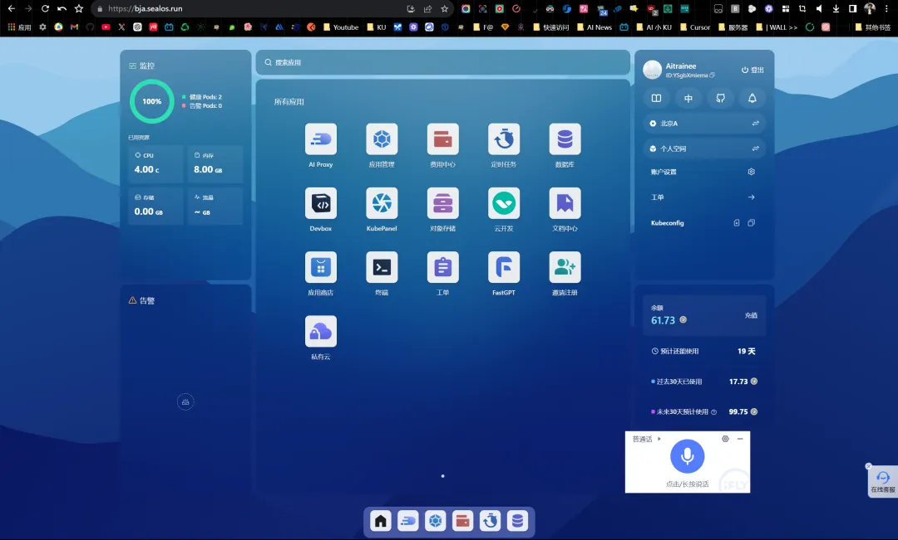

<font style="color:#000000;background-color:#FFFFFF;">https://bja.sealos.run/</font>

<font style="color:#000000;background-color:#FFFFFF;">  
</font>

<font style="color:#000000;background-color:#FFFFFF;">Cursor这些教程主要讲讲提示词和工作流就行了，</font><font style="color:#000000;background-color:#FFFFFF;">其他无非是迭代解决错误。</font>

<font style="color:#000000;background-color:#FFFFFF;">这些提示词既是预构建也是参考，后续可以自己优化。</font>

<font style="color:#000000;background-color:#FFFFFF;">  
</font>

**<font style="color:#000000;background-color:#FFFFFF;">前后端不分离</font>**

<font style="color:#000000;background-color:#FFFFFF;">前后端不分离这种类型的项目使用Cursor来按照你的需求改起来其实比分离的快很多。</font>

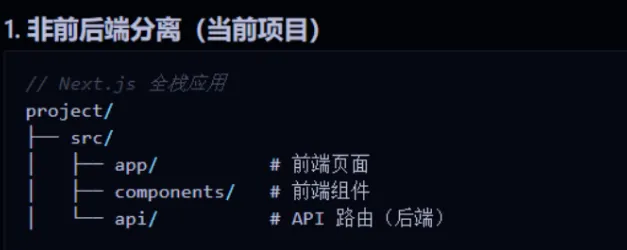

<font style="color:#000000;background-color:#FFFFFF;">因为搞半天就是在一个文件夹下快速修改嘛，他直接联动了。  
</font>

<font style="color:#000000;background-color:#FFFFFF;">感觉小需求的项目这样做比较好，Bolt这些就是快速构建这些类型的。</font>

<font style="color:#000000;background-color:#FFFFFF;">再加上那些Bass（如Supbase），直接后端即服务，前端 = 全栈了。  
</font>

<font style="color:#000000;background-color:#FFFFFF;">当然你要是把前端和后端写成两个文件夹再塞到工作空间子目录那也是差不多的。  
</font>

<font style="color:#000000;background-color:#FFFFFF;">然后就是前后端分离的，那就相当于两个文件夹分别用Cursor改了。  
</font>

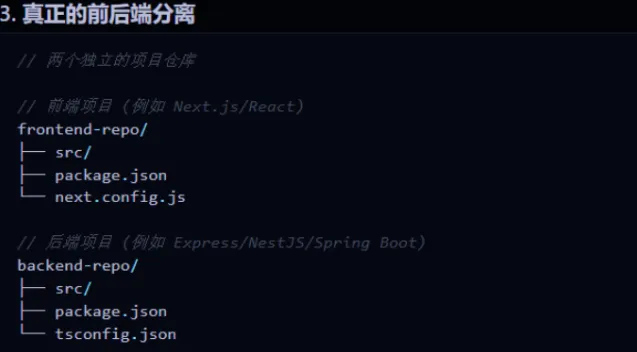

<font style="color:#000000;background-color:#FFFFFF;">后端让他写api然后再自动化测试，最后让他生成api文档交给前端，让他再按照api文档生成前端。。。  
</font>

<font style="color:#000000;background-color:#FFFFFF;">这种后端写完了上线服务器了，你前端可以用很多工具去写，Bolt、V0、Cursor、Windsurf 等等。</font>

<font style="color:#000000;background-color:#FFFFFF;">Bolt、V0 </font><font style="color:#000000;background-color:#FFFFFF;">两者你提供了公网后端API他还直接可以实时预览最终的效果，并且</font><font style="color:#000000;background-color:#FFFFFF;">还自带一键部署的。</font>

<font style="color:#000000;background-color:#FFFFFF;">  
</font>

**<font style="color:#000000;background-color:#FFFFFF;">所以我们现在正式开始看一下前后端不分离的吧：</font>**<font style="color:#000000;background-color:#FFFFFF;">  
</font>

<font style="color:#000000;background-color:#FFFFFF;">  
</font>

<font style="color:#000000;background-color:#FFFFFF;">下面提示词涉及到的</font><font style="color:#000000;background-color:#FFFFFF;">参考项目是：</font><font style="color:#000000;background-color:#FFFFFF;">https://github.com/lihuithe/podlm-public，需要把这个项目下载下来作为文件夹放进我们开发AI播客的工作空间中。</font>

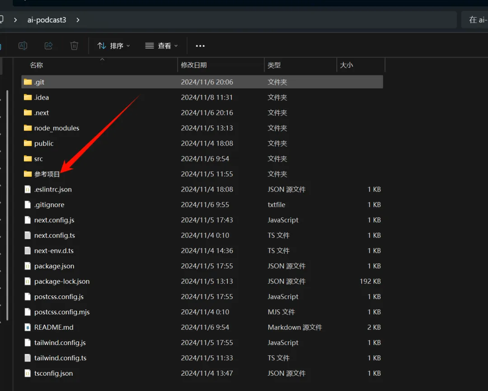

<font style="color:#000000;background-color:#FFFFFF;">然后我们提示词是这样：  
</font>

```plain
@参考项目 @Codebase 现在你正在nextjs初始化项目中，我想开发一个类似 NotebookLM 的中文播客生成系统，主要功能包括：
### 核心功能：1. 用户粘贴任意文本内容。2. 系统将文本转换成主持人和嘉宾的对话形式。3. 使用大模型服务将文本转为播客对话。4. 使用 TTS 服务将对话转换成音频。5. 合并所有音频片段生成完整的播客节目。
### 技术要求：- 使用 Next.js 框架开发前后端。
我会提供一个项目作为参考（即参考项目），该项目实现了 AI 播客功能，可以借鉴如何：- 使用大模型服务将文本转为播客对话。- 使用 TTS 服务将对话转换成音频。
```

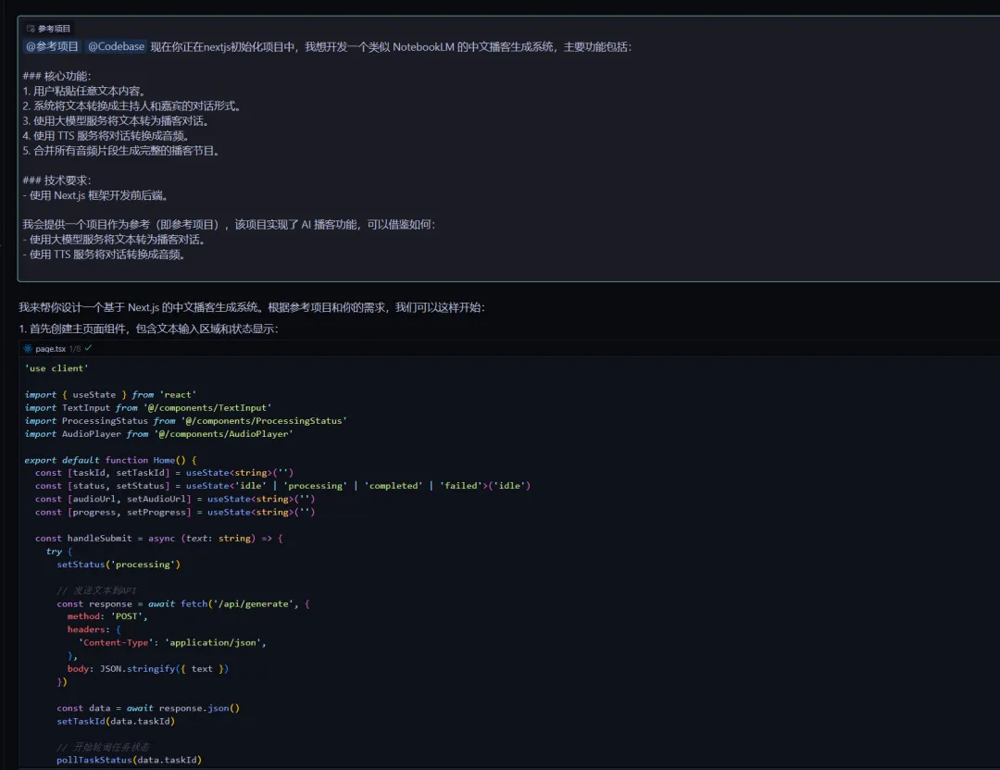

<font style="color:#000000;background-color:#FFFFFF;">输完这个主要提示之后你就是迭代改错了。  
</font>

<font style="color:#000000;background-color:#FFFFFF;">Ai播客主要是利用LLM将用户输入的文本转为主持人和嘉宾对话的文案脚本，这里是转脚本的核心提示词：  
</font>

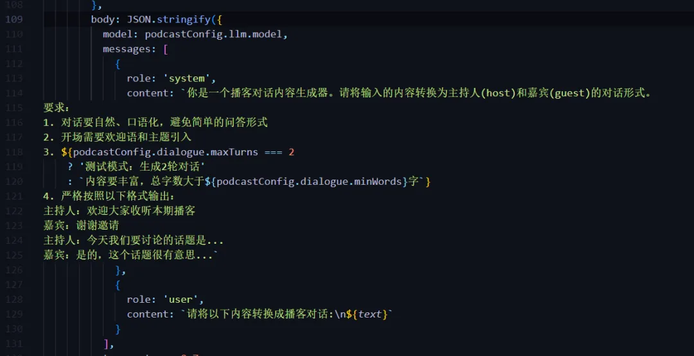

<font style="color:#000000;background-color:#FFFFFF;">然后</font><font style="color:#000000;background-color:#FFFFFF;">再用TTS模型服务转为音频然后再合并成一段播客。</font>

<font style="color:#000000;background-color:#FFFFFF;">我写的这个项目是用openai 模型进行文案转写，然后 openai tts 继续文本转语音。  
</font>

<font style="color:#000000;background-color:#FFFFFF;">当然，你也可以用那些F5、MaskGCT TTS项目，自己本地部署成api提供TTS服务。</font>

<font style="color:#000000;background-color:#FFFFFF;">你想要附加任何其他模型，可以直接去相应的模型提供商api文档那里把它丢给Cursor，举例：</font>

```plain
这是一个AI播客项目，现在需要添加tts服务器地址，我给你的tts api文档为https://platform.minimaxi.com/document/T2A%20Large%20v2?key=66b3559f290299a26b2347d2；api密钥为123（我模拟的）
```

<font style="color:#000000;background-color:#FFFFFF;">  
</font>

<font style="color:#000000;background-color:#FFFFFF;">在进行第1次提示词之后，AI它可能会分步骤的来实现，那么你就每一步去跟着走就行了，然后持续迭代解决错误就行了：</font>

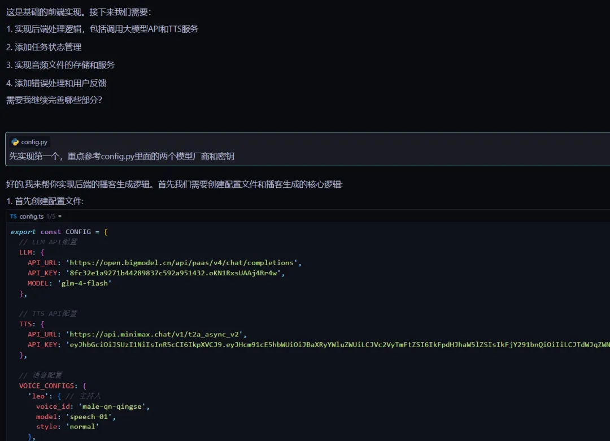

<font style="color:#000000;background-color:#FFFFFF;">比如提示他合成音频时日志中给一些输出，方便代码逻辑调试</font>

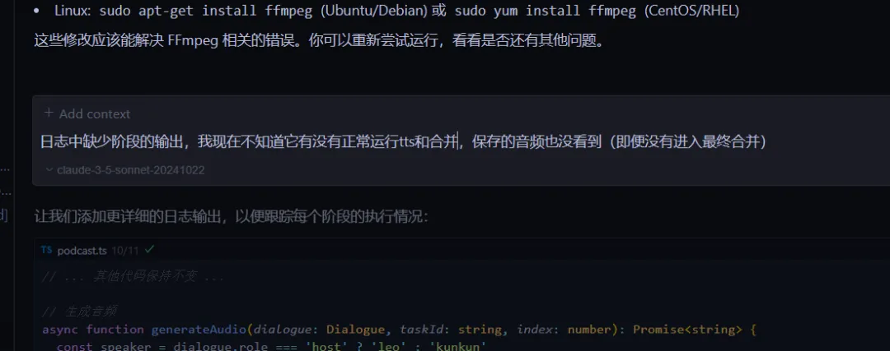

<font style="color:#000000;background-color:#FFFFFF;">这里列举一些迭代中的提示词</font>

```plain
1、前端排版太丑了，请用谷歌和苹果界面设计原则；采用毛玻璃效果，总之大大的修改界面！还有合成的音频应该在前端给用户下载
2、 **UI 优化**- 参考 **Material Design** 和 **Human Interface Guidelines**，优化界面简洁性与一致性。- 调整配色与字体，确保视觉简约优雅- 支持响应式设计，适配不同设备和屏幕尺寸。
```

<font style="color:#000000;background-color:#FFFFFF;">  
</font>

<font style="color:#000000;background-color:#FFFFFF;">有</font><font style="color:#000000;background-color:#FFFFFF;">时候他前端怎么改都不太好，我就把文件上传到Bolt，</font>

<font style="color:#000000;background-color:#FFFFFF;">给Bolt的时候，你把Cursor写过的前端部分代码单独提取出来上传给他，然后你结合一些提示词比如参考 **Material Design** 和 **Human Interface Guidelines**，优化界面简洁性与一致性。</font>

<font style="color:#000000;background-color:#FFFFFF;">这两个是Google和苹果公司发布的设计指导原则。</font>

<font style="color:#000000;background-color:#FFFFFF;">Material Design 是由 Google 在 2014 年发布的一套设计语言，旨在为 Google 产品（如 Android、Web 应用等）提供统一的设计规则。它的核心理念是模拟现实世界的物理世界，包括光线、阴影、层次、动画等，以创造一种富有深度感和直观的界面。</font>

<font style="color:#000000;background-color:#FFFFFF;">Material Design 强调的是“纸和墨水”的概念，界面</font><font style="color:#000000;background-color:#FFFFFF;">元素看起来像是实际存在的物体，有层次感和触感。界面通过阴影、动效和响应来传达物理世界中的物理特性。</font>

<font style="color:#000000;background-color:#FFFFFF;">Human Interface Guidelines (HIG) 设计原则：HIG 强调简洁、直观和一致性，鼓励使用清晰的视觉层次和易于理解的界面。苹果的设计注重“隐形设计”，让用户的操作尽可能直观，无需过多思考。</font>

<font style="color:#000000;background-color:#FFFFFF;">或者你去找一个和音乐酷炫相关的网站截图给他一个参考，Bolt他自己甚至知道你的项目叫AI播客就适配了这种紫色律动风格的界面。</font>

<font style="color:#000000;background-color:#FFFFFF;">，时长</font><font style="color:#000000;background-color:#FFFFFF;">00:30</font>

<font style="color:#000000;background-color:#FFFFFF;">>/：视频中那个高级功能、文件上传和链接上传以及其他的一些标签是点不了的，因为没有去实现后端api，只有文本转播客是可以正常工作的。</font>

<font style="color:#000000;background-color:#FFFFFF;">这篇文章主要是讲Cursor+Bolt+Devbox这些流程， Ai编程开发和部署这些，授的是渔，很多基础后续会在本合集连载，也有合集群聊。</font>

<font style="color:#000000;background-color:#FFFFFF;">本质上去弄AI播客也就是看一下这些 ai编程助手会有什么样的效果，用ai播客来替代做to do list这样的演示。</font>

<font style="color:#000000;background-color:#FFFFFF;">总的来说这东西有用后续再费时间了。</font>

<font style="color:#000000;background-color:#FFFFFF;">然后再把Bolt写好的的下载下来作为参考项目集成：</font>

<font style="color:#000000;background-color:#FFFFFF;">@参考项目通过增量开发方式在现有前端代码上实现了多个功能，逻辑与现有前端保持一致，即使部分后端API尚未提供也要能正常运行。现在的任务是基于该参考项目生成新的前端，并确保与现有后端系统兼容适配。后续我会逐步为新前端增加相应的后端API支持。Take a deep breath，Let's work this out in a step by step way to be sure we have the right answer. If there's a perfect solution, I'll tip $200! Please answer in Chinese。</font>

<font style="color:#000000;background-color:#FFFFFF;">我们这些提示词工作流，往往都是从0~1构建一个项目的，你可以使用Bolt免费额度，因为它构建前端Web比用Cursor好多了。</font>

<font style="color:#000000;background-color:#FFFFFF;">当然最近我发现一个和Cursor结合的辅助工具（C</font><font style="color:#000000;background-color:#FFFFFF;">opycoder AI</font><font style="color:#000000;background-color:#FFFFFF;">）它可以很大程度提高Cursor构建前端的能力。</font>

<font style="color:#000000;background-color:#FFFFFF;">  
</font>

**<font style="color:#000000;background-color:#FFFFFF;">所以，我们前后端不分离的就结束了，</font>**<font style="color:#000000;background-color:#FFFFFF;">  
</font>

<font style="color:#000000;background-color:#FFFFFF;">核心生成音频的逻辑代码在这  
</font>

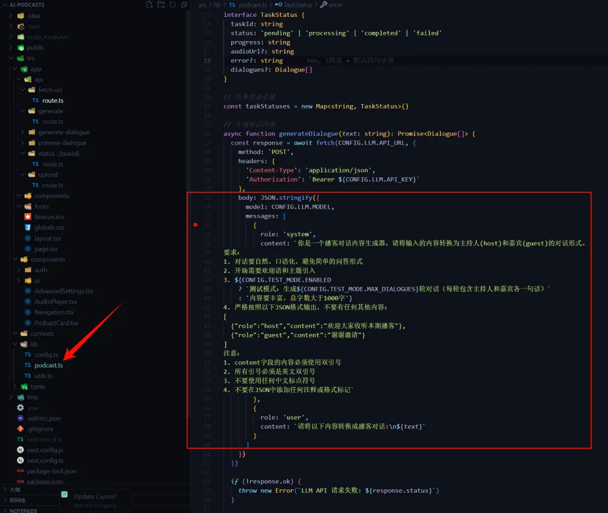

<font style="color:#000000;background-color:#FFFFFF;">逻辑是一段文本转播课结构化内容的LLM输出，其他的比如LLM的配置，Readme文件会提到。</font>

<font style="color:#000000;background-color:#FFFFFF;">  
</font>

**<font style="color:#000000;background-color:#FFFFFF;">前后端分离</font>**

**<font style="color:#000000;background-color:#FFFFFF;">后端开始：</font>**<font style="color:#000000;background-color:#FFFFFF;">  
</font>

<font style="color:#000000;background-color:#FFFFFF;">1、写用户登录、鉴权逻辑</font>

<font style="color:#000000;background-color:#FFFFFF;">先初始化一个Node.js 和Express 框架的 后端项目</font>

<font style="color:#000000;background-color:#FFFFFF;">在Windsurf中直接输入这行提示词，直接给你自动初始化好了，Windsurf他就是比Cursor用起来更像一个和你实时协作的结对编程员，它更智能体轻松很多。总之同一个项目分别用</font><font style="color:#000000;background-color:#FFFFFF;">Cursor、</font><font style="color:#000000;background-color:#FFFFFF;">Windsurf打开，切换着切换着你可能就发现这两个东西不同的优点了。</font>

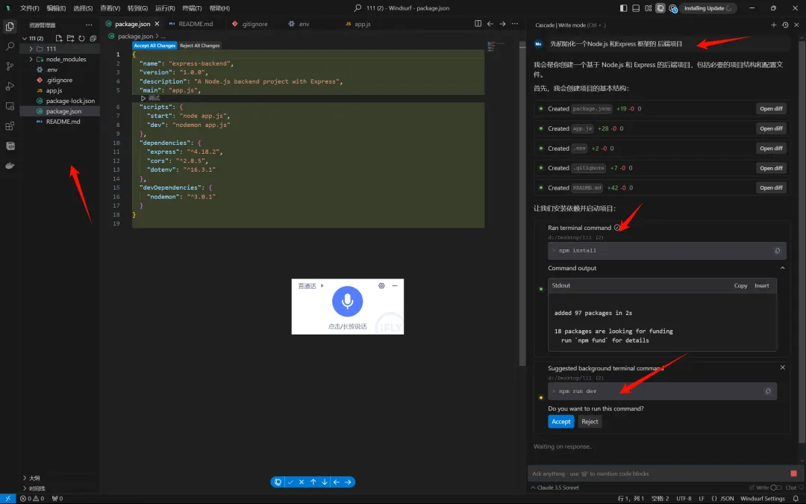

<font style="color:#000000;background-color:#FFFFFF;">继续，完成登录和注册以及数据库逻辑：</font>

```plain
请为我开发一个 Node.js 和Express 框架的  后端项目。先完成下面的功能需要的api让我们在本地mysql数据库中添加授权和存储数据：1. 如果用户没有登录，他们不应该看到主应用程序Ul2. 身份验证将基于用户名密码3. 为我提供创建数据库表的查询4. 将敏感配置存储在.env文件中
以下是数据库连接方式：localhost3306root密码 1234
1. 直接以当前目录作为项目根目。注意 此目录已经初始化完了nodejs项目 直接修改即可2. 我们一步步来执行所有操作，需要暂停的地方，告诉我我给你反馈
```

<font style="color:#000000;background-color:#FFFFFF;">这个时候ai会提供创建数据表的SQL，本地的话你去终端或者数据库GUI界面，你复制执行SQL创建即可，不当然你点击Windsurf Accept他会给你自己创建数据库，一般Linux MAC会正常执行的，Windows也可以但不会那么顺利，</font><font style="color:#000000;background-color:#FFFFFF;">如果他执行不成功他就会换一种方法继续执行，他都不要你动手了他自己会解决问题，Windsurf 这一点很强很好用。</font>

<font style="color:#000000;background-color:#FFFFFF;">其实Windows来 和 </font><font style="color:#000000;background-color:#FFFFFF;">Windsurf搭配的时候有些东西你要配置比如Curl，安装Git Bash等等</font><font style="color:#000000;background-color:#FFFFFF;">，不过你也可以使连接Sealos远程的Linux环境，云端开发嘛。</font>

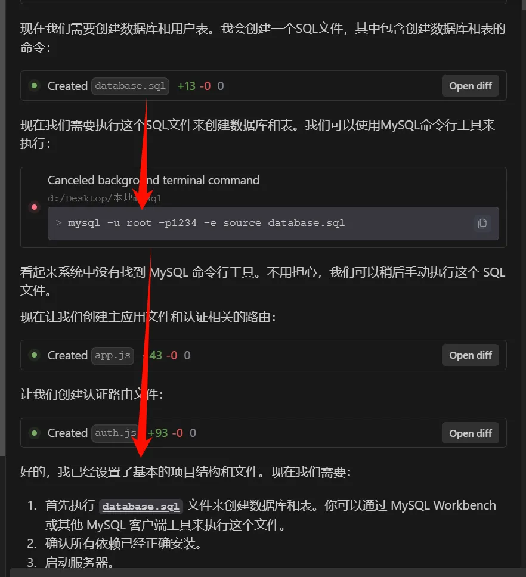

<font style="color:#000000;background-color:#FFFFFF;">▲ Windsurf自动创建数据表</font>

<font style="color:#000000;background-color:#FFFFFF;">继续：编写自动化测试脚本并提供单个api测试的api文档：</font>


> 更新: 2024-12-05 08:52:16  
> 原文: <https://www.yuque.com/lixinsi/iac89w/are0scyzmt4r0n0f>