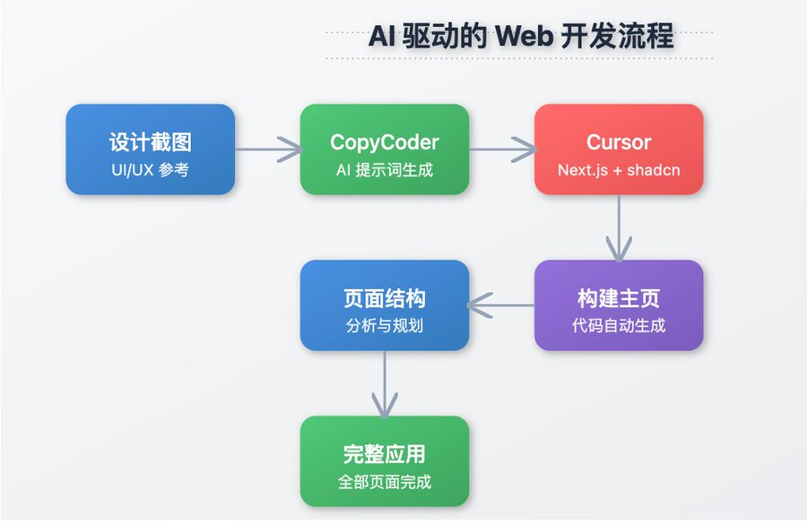

# cursor提示词

### cursor 通用提示词模板
```markdown
我想创建一个web应用的UI/UX设计原型，使用html，css和基本的javascript来模拟这个应用的节目和交互，
我希望最终所有web应用的页面都能在index.html中平铺展示，便于整体查看和比较。

为了避免生成内容过长导致中断，请按照以下步骤分批次生成代码

第一步：基础结构和主计时器界面
以下是图片中内容的总结：

---

### **项目核心需求**
1. **目标**：  
   创建一个名为"重要时钟"的计时器应用原型，需包含主计时器、任务管理、设置和统计四大界面，所有界面需在单页平铺展示以便对比。

2. **技术实现**：  
   - 使用 `HTML` + `CSS` + 基础 `JavaScript`  
   - 分5步开发：基础结构 → 任务界面 → 设置界面 → 统计界面 → 交互优化  

---

### **关键设计规范**
- **视觉风格**：  
  ✅ 符合iOS设计语言  
  ✅ 主色调：温暖红色（需避免刺眼，搭配中性色）  
  ✅ 柔和色彩过渡，适当留白  
  ❌ 禁止高对比度生硬配色  

- **功能要求**：  
  - 主计时器界面：图形化计时显示 + 控制按钮（开始/暂停/重置）  
  - 任务列表：支持添加/查看任务，带完成状态指示  
  - 设置界面：时间自定义、主题切换（深色/浅色）、声音设置  
  - 统计界面：数据可视化图表  

- **技术细节**：  
  ✅ 移动端优先：适配不同设备尺寸  
  ✅ 界面切换动效  
  ✅ 实时交互响应（按钮点击、任务操作）  

---

### **开发流程分解**
| 步骤 | 重点内容 | 关联文件 |
|------|----------|----------|
| 1️⃣ 基础结构 | 响应式布局、计时器核心UI | `index.html` `styles.css` |
| 2️⃣ 任务界面 | 动态列表渲染、状态标记 | `script.js` |
| 3️⃣ 设置界面 | 表单控件、主题切换逻辑 | `styles.css` `script.js` |
| 4️⃣ 统计界面 | 图表集成（如Chart.js） | `script.js` |
| 5️⃣ 交互优化 | 触摸事件处理、动画效果 | 全文件联动 |

---

### **特别注意事项**
- 所有界面需在单页(`index.html`)中并存，通过网格布局平铺展示  
- 图片资源需标注占位符（如示例中的"#8 图片"需替换为实际素材）  
- 优先实现核心功能逻辑，再逐步完善视觉细节  


```


### CopyCoder 用于生成提示词
```markdown

「通过结合 CopyCoder 的提示词生成和 Cursor 的代码实现能力，开发者可以将任意 Web 设计稿快速转化为基于 Next.js 和 shadcn UI 的完整应用，实现了从设计到代码的 AI 驱动自动化开发流程」

主要技术架构：
- CopyCoder 用于生成提示词
- Next.js 作为框架
- shadcn UI 作为组件库
- Cursor 作为开发环境

第一步 - 获取参考设计
- 可以截图任何现有的网页应用
- 或者从 Dribbble 等设计网站找到喜欢的设计
- 将截图上传到 copycoder 
@CopyCoderAI
 

第二步 - 生成初始提示词
- 在 CopyCoder 中选择"Web applications"选项
- 让 CopyCoder 为您生成重现该页面的初始提示词

第三步 - 搭建初始页面
- 打开 Cursor 编辑器
- 设置 Next.js + shadcn UI 的基础框架
- 将生成的提示词粘贴到 Composer 中

第四步 - 构建主页
- Cursor 会根据提示词构建应用的初始页面
- 如果遇到构建错误,可以截图让它修复
- 遇到询问是否继续时输入"yes"

第五步 - 页面结构分析
- 回到 CopyCoder 生成页面结构的提示词
- 将这个提示词粘贴到 Cursor 中

最后一步 - 构建其他页面
- 使用多个提示词来完成其他页面的构建
- CopyCoder 的提示词已经奠定了基础架构
- 持续确认直到 Cursor 显示"completed"
```




> 更新: 2025-03-17 18:00:35  
> 原文: <https://www.yuque.com/lixinsi/iac89w/lf5dyv5gonkzs0ki>