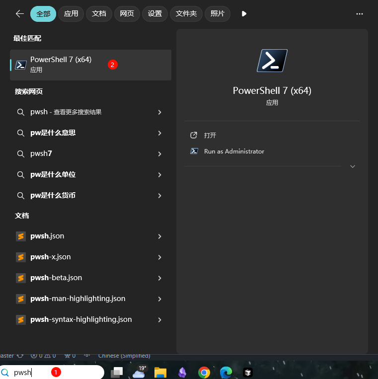
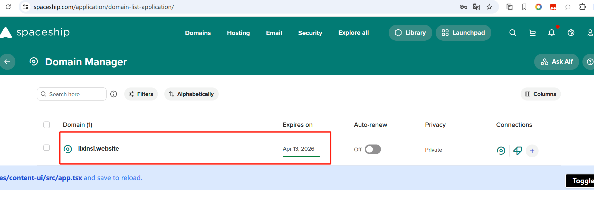

# cursor无限续杯以及最新的无限方法

### 1.免费 cursor 编写前端提示词
```markdown
我想要编写一个web appcotion，使用vue3框架
要能够登入，注册，有输入用户名，密码登入后跳到导航页面。界面要能够自己定义跳转页面
当我按下页面按钮时，可以跳转到定义得网址
他得文件在此：https://element-plus.org/zh-CN/
```


## <font style="color:rgb(34, 34, 34);">1 利用 ChatGPT 进行项目规划</font>
```sql
创建完整PRD、定义数据库结构、选择配色方案，规划所有页面的 UI 布局。这些准备工作确保我在开始使用 V0 之前有清晰愿景。
```

## <font style="color:rgb(34, 34, 34);">2 使用 V0 设计 UI</font>
<font style="color:rgb(23, 35, 63);">有了详细的布局和概念后，将其导入 V0 开始构建 UI。附上 Dribbble上的灵感截图可以帮助 V0 准确理解我想要的美感。在这种指导下，我让 V0 为项目生成 UI基础。</font>

## <font style="color:rgb(34, 34, 34);">3 不断优化</font>
<font style="color:rgb(23, 35, 63);">为获得最佳效果，持续提示 V0 参考附带的截图来优化每个页面。这种迭代式的提示可以调整布局和设计，确保 V0 每次都能更接近我的设想。</font>

## <font style="color:rgb(34, 34, 34);">4 使用 Cursor 进行开发</font>
<font style="color:rgb(23, 35, 63);">在 V0 生成基础 UI 代码后，我会将所有内容导入 Cursor 开始搭建核心功能。这包括集成 Supabase 作为后端，添加认证、路由保护和数据库连接等基本功能。</font>

<font style="color:rgb(23, 35, 63);">不要用 v0, 效果一般. 用这个</font>[<font style="color:rgb(23, 35, 63);">https://bolt.new/~/sb1-1gtqxp</font>](https://bolt.new/~/sb1-1gtqxp)<font style="color:rgb(23, 35, 63);"> </font><font style="color:rgb(23, 35, 63);">作为v0三个月的订阅用户, 表示</font><font style="color:rgb(23, 35, 63);"> </font>[<font style="color:rgb(23, 35, 63);">http://bolt.new</font>](https://t.co/QzgqQpNlx0)<font style="color:rgb(23, 35, 63);"> </font><font style="color:rgb(23, 35, 63);">效果是最好的. 昨天用它写了一个界面. 然后用cursor 匹配一下我的代码风格, 整个过程1小时. 如果用v0 + cursor 可能就要一天了.</font>

## <font style="color:rgb(34, 34, 34);">5 在 Cursor 中将核心项目文档组织为 .md 文件</font>
<font style="color:rgb(23, 35, 63);">为了保持所有阶段的一致性，我将 PRD、数据库架构、用户旅程等关键文档直接保存为 Cursor 中的 .md 文件。这样的设置让我在开发过程中能快速查阅核心细节，确保与初始计划保持一致。</font>

## <font style="color:rgb(34, 34, 34);">6 标记官方文档以获取准确信息</font>
<font style="color:rgb(23, 35, 63);">在使用特定框架或服务时，我会在 Cursor 中同步它们的官方文档。这样，我的提示总能获取最新最准确的信息，最大限度地减少错误并提高准确性。</font>

## <font style="color:rgb(34, 34, 34);">7 使用 cursor.directory 获取专业提示</font>
<font style="color:rgb(23, 35, 63);">Cursor 的提示目录是技术项目的宝藏。我会自定义这些提示并将其存储在 .cursorrules 文件中，调整 Cursor 的响应使其完全符合我的技术栈。</font>

## <font style="color:rgb(34, 34, 34);">8 将可用代码保存为 .md 文件</font>
<font style="color:rgb(23, 35, 63);">当 Cursor 生成完美契合的代码时，我会将其作为可重用示例保存在 Cursor 的 .md 文件中。这个习惯对未来的项目来说是巨大的时间节省，让 Cursor 能够提供一致且可靠的代码片段。</font>

## <font style="color:rgb(34, 34, 34);">9 从代码模板开始</font>
<font style="color:rgb(23, 35, 63);">不要浪费时间重复造轮子。使用样板代码来处理认证、数据库和支付等常见元素。在经过验证的基础上构建可以节省时间。</font>

# Cursor 免费试用重置工具
  

[🌟 English](https://github.com/yuaotian/go-cursor-help/blob/master/README.md) | [🌏 中文](https://github.com/yuaotian/go-cursor-help/blob/master/README_CN.md)


⚠️ **重要提示**

本工具当前支持版本：

+ ✅ Cursor v0.44.11 及以下版本
+ ✅ Windows: 最新的 0.45.x 版本（已支持）
+ ✅ Mac/Linux: 最新的 0.45.x 版本（已支持，欢迎测试并反馈问题）

使用前请确认您的 Cursor 版本。

**📦**** 版本历史与下载**

### 🌟 最新版本
+ v0.45.11 (2025-02-07) - 最新发布
+ v0.44.11 (2025-01-03) - 最稳定版本

[查看完整版本历史](https://github.com/yuaotian/go-cursor-help/blob/master/CursorHistoryDown.md)

### 📥 直接下载链接
**v0.44.11 (推荐稳定版)**

+ Windows: [官方下载](https://downloader.cursor.sh/builds/250103fqxdt5u9z/windows/nsis/x64) | [镜像下载](https://download.todesktop.com/230313mzl4w4u92/Cursor%20Setup%200.44.11%20-%20Build%20250103fqxdt5u9z-x64.exe)
+ Mac: [Apple Silicon](https://dl.todesktop.com/230313mzl4w4u92/versions/0.44.11/mac/zip/arm64)

⚠️ **MAC地址修改警告**

Mac用户请注意: 本脚本包含MAC地址修改功能，将会:

+ 修改您的网络接口MAC地址
+ 在修改前备份原始MAC地址
+ 此修改可能会暂时影响网络连接
+ 执行过程中可以选择跳过此步骤

---

### 📝 问题描述
当您遇到以下任何消息时：

#### 问题 1: 试用账号限制


```plain
Too many free trial accounts used on this machine.
Please upgrade to pro. We have this limit in place
to prevent abuse. Please let us know if you believe
this is a mistake.
```

#### 问题 2: API密钥限制


```plain
[New Issue]

Composer relies on custom models that cannot be billed to an API key.
Please disable API keys and use a Pro or Business subscription.
Request ID: xxxxxxxx-xxxx-xxxx-xxxx-xxxxxxxxxxxx
```

#### 问题 3: 试用请求限制
这表明您在VIP免费试用期间已达到使用限制：

```plain
You've reached your trial request limit.
```

#### 问题 4: Claude 3.7 高负载 （High Load）


```plain
High Load 
We're experiencing high demand for Claude 3.7 Sonnet right now. Please upgrade to Pro, or switch to the
'default' model, Claude 3.5 sonnet, another model, or try again in a few moments.
```

  


#### 解决方案：完全卸载Cursor并重新安装（API密钥问题）
1. 下载 [Geek.exe 卸载工具[免费]](https://geekuninstaller.com/download)
2. 完全卸载Cursor应用
3. 重新安装Cursor应用
4. 继续执行解决方案1

  


临时解决方案：

#### 解决方案 1: 快速重置（推荐）
1. 关闭Cursor应用
2. 运行机器码重置脚本（见下方安装说明）
3. 重新打开Cursor继续使用

#### 解决方案 2: 切换账号
1. 文件 -> Cursor设置 -> 退出登录
2. 关闭Cursor
3. 运行机器码重置脚本
4. 使用新账号登录

#### 解决方案 3: 网络优化
如果上述解决方案不起作用，请尝试：

+ 切换到低延迟节点（推荐区域：日本、新加坡、美国、香港）
+ 确保网络稳定性
+ 清除浏览器缓存并重试

#### 解决方案 4: Claude 3.7 访问问题（High Load ）
如果您看到Claude 3.7 Sonnet的"High Load"（高负载）消息，这表明Cursor在一天中某些时段限制免费试用账号使用3.7模型。请尝试：

1. 使用Gmail邮箱创建新账号，可能需要通过不同IP地址连接
2. 尝试在非高峰时段访问（通常在早上5-10点或下午3-7点之间限制较少）
3. 考虑升级到Pro版本获取保证访问权限
4. 使用Claude 3.5 Sonnet作为备选方案

注意：随着Cursor调整资源分配策略，这些访问模式可能会发生变化。

### 🚀 系统支持
| **Windows** ✅<br/>+ x64 & x86 | **macOS** ✅<br/>+ Intel & M-series | **Linux** ✅<br/>+ x64 & ARM64 |
| --- | --- | --- |


### 🚀 一键解决方案
**国内用户（推荐）**

**macOS**

```python
curl -fsSL https://aizaozao.com/accelerate.php/https://raw.githubusercontent.com/yuaotian/go-cursor-help/refs/heads/master/scripts/run/cursor_mac_id_modifier.sh | sudo bash
```

**Linux**

```python
curl -fsSL https://aizaozao.com/accelerate.php/https://raw.githubusercontent.com/yuaotian/go-cursor-help/refs/heads/master/scripts/run/cursor_linux_id_modifier.sh | sudo bash
```

**Windows**

```python
irm https://aizaozao.com/accelerate.php/https://raw.githubusercontent.com/yuaotian/go-cursor-help/refs/heads/master/scripts/run/cursor_win_id_modifier.ps1 | iex
```


**Windows 管理员终端运行和手动安装**

#### Windows 系统打开管理员终端的方法：
##### 方法一：使用 Win + X 快捷键
```plain
1. 按下 Win + X 组合键
2. 在弹出的菜单中选择以下任一选项:
   - "Windows PowerShell (管理员)"
   - "Windows Terminal (管理员)" 
   - "终端(管理员)"
   (具体选项因Windows版本而异)
```

##### 方法二：使用 Win + R 运行命令
```plain
1. 按下 Win + R 组合键
2. 在运行框中输入 powershell 或 pwsh
3. 按 Ctrl + Shift + Enter 以管理员身份运行
   或在打开的窗口中输入: Start-Process pwsh -Verb RunAs
4. 在管理员终端中输入以下重置脚本:

irm https://aizaozao.com/accelerate.php/https://raw.githubusercontent.com/yuaotian/go-cursor-help/refs/heads/master/scripts/run/cursor_win_id_modifier.ps1 | iex
```

##### 方法三：通过搜索启动


在搜索框中输入 pwsh，右键选择"以管理员身份运行" 

在管理员终端中输入重置脚本:

irm https://aizaozao.com/accelerate.php/https://raw.githubusercontent.com/yuaotian/go-cursor-help/refs/heads/master/scripts/run/cursor_win_id_modifier.ps1 | iex

### 🔧 PowerShell 安装指南
如果您的系统没有安装 PowerShell,可以通过以下方法安装:

#### 方法一：使用 Winget 安装（推荐）
1. 打开命令提示符或 PowerShell
2. 运行以下命令:

winget install --id Microsoft.PowerShell --source winget

#### 方法二：手动下载安装
1. 下载对应系统的安装包:
    - [PowerShell-7.4.6-win-x64.msi](https://github.com/PowerShell/PowerShell/releases/download/v7.4.6/PowerShell-7.4.6-win-x64.msi) (64位系统)
    - [PowerShell-7.4.6-win-x86.msi](https://github.com/PowerShell/PowerShell/releases/download/v7.4.6/PowerShell-7.4.6-win-x86.msi) (32位系统)
    - [PowerShell-7.4.6-win-arm64.msi](https://github.com/PowerShell/PowerShell/releases/download/v7.4.6/PowerShell-7.4.6-win-arm64.msi) (ARM64系统)
2. 双击下载的安装包,按提示完成安装

💡 如果仍然遇到问题,可以参考 [Microsoft 官方安装指南](https://learn.microsoft.com/zh-cn/powershell/scripting/install/installing-powershell-on-windows)

#### Windows 安装特性:
+ 🔍 自动检测并使用 PowerShell 7（如果可用）
+ 🛡️ 通过 UAC 提示请求管理员权限
+ 📝 如果没有 PS7 则使用 Windows PowerShell
+ 💡 如果提权失败会提供手动说明

完成后，脚本将：

1. ✨ 自动安装工具
2. 🔄 立即重置 Cursor 试用期

### 📦 手动安装
从 [releases](https://github.com/yuaotian/go-cursor-help/releases/latest) 下载适合您系统的文件

Windows 安装包

macOS 安装包

Linux 安装包

### 🔧 技术细节
**注册表修改说明**

**配置文件**

**修改字段**

**手动禁用自动更新**

**安全特性**

## 联系方式
| **个人微信**      **微信：JavaRookie666** | **微信交流群**      7天内(3月10日前)有效，群满可以加公众号关注最新动态 | **公众号**      获取更多AI开发资源 | **微信赞赏**      要到饭咧？啊咧？啊咧？不给也没事~ 请随意打赏 | **支付宝赞赏**      如果觉得有帮助,来包辣条犒劳一下吧~ |
| --- | --- | --- | --- | --- |


---

### 📚 推荐阅读
+ [Cursor 异常问题收集和解决方案](https://mp.weixin.qq.com/s/pnJrH7Ifx4WZvseeP1fcEA)
+ [AI 通用开发助手提示词指南](https://mp.weixin.qq.com/s/PRPz-qVkFJSgkuEKkTdzwg)

---

## ⭐ 项目统计


## 📄 许可证
**MIT 许可证**

go-cursor-help/README_CN.md at master · yuaotian/go-cursor-help · GitHub

 

### <font style="color:rgb(23, 35, 63);">cursor 无限续费用管理员运行 powershell</font>
[https://github.com/yuaotian/go-cursor-help/blob/master/README_CN.md](https://github.com/yuaotian/go-cursor-help/blob/master/README_CN.md)

```python
irm https://aizaozao.com/accelerate.php/https://raw.githubusercontent.com/yuaotian/go-cursor-help/refs/heads/master/scripts/run/cursor_win_id_modifier.ps1 | iex
```

```python
irm https://raw.githubusercontent.com/yeongpin/cursor-free-vip/main/scripts/install.ps1 | iex
```

### 最新邮件转发 无限续杯 cursor 教程
#### cursor转发域名
域名网址：[https://www.spaceship.com/](https://www.spaceship.com/)




> 更新: 2025-05-03 21:48:45  
> 原文: <https://www.yuque.com/lixinsi/iac89w/ao5ucm3x3ghrykyt>