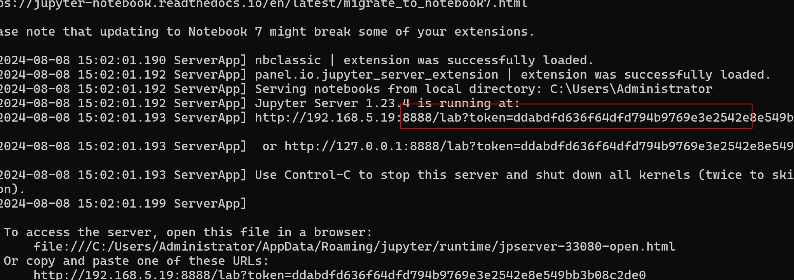
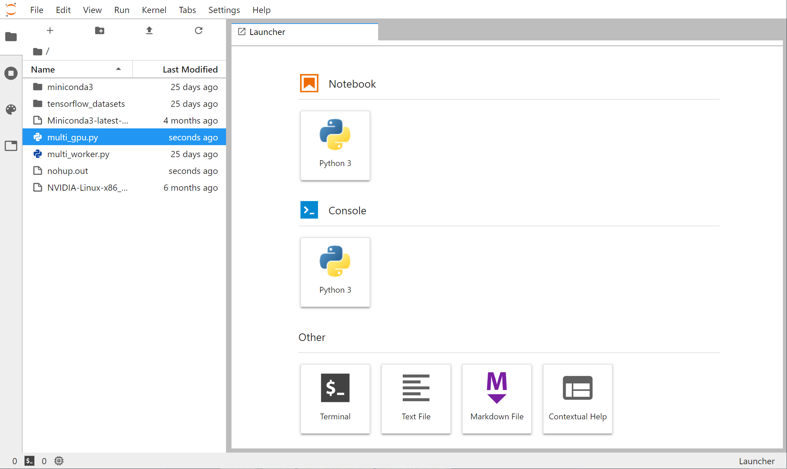
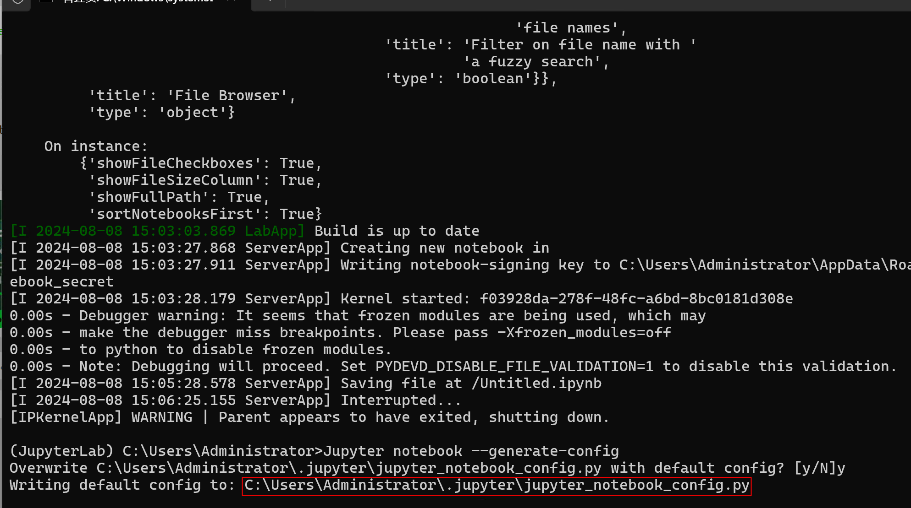
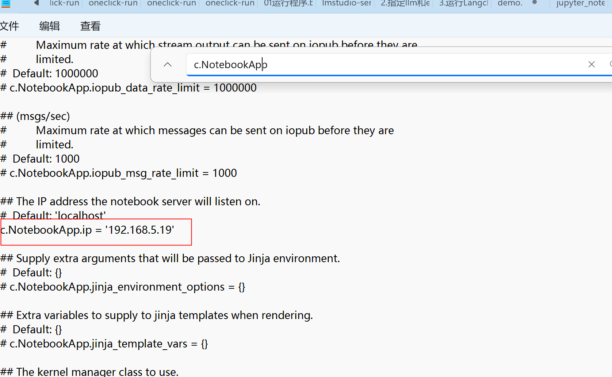
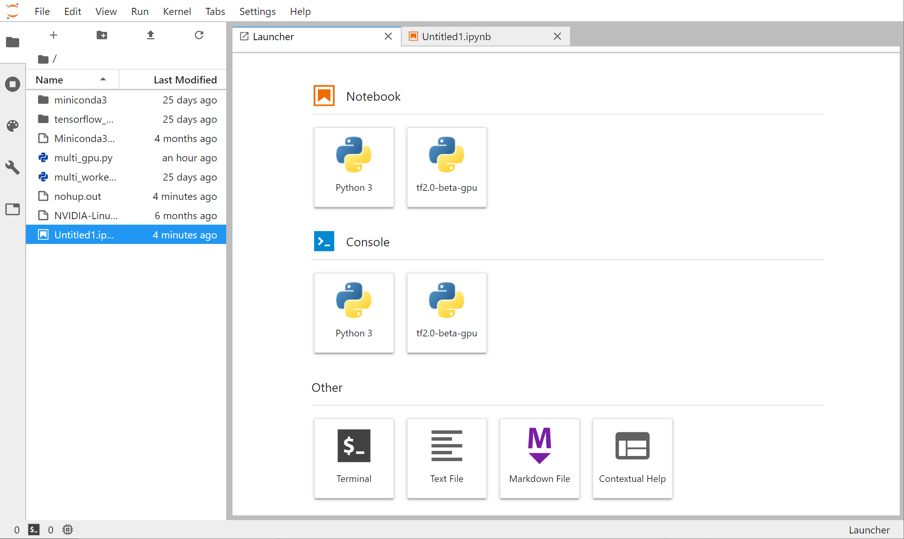
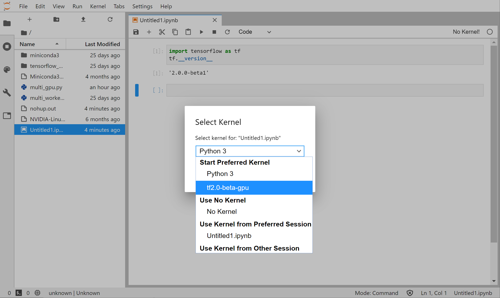

# jupyterlab

### Windows 安装jupyterlab

# <font style="color:rgb(64, 64, 64);background-color:rgb(252, 252, 252);">部署自己的交互式 Python 开发环境 JupyterLab</font>

<font style="color:rgb(64, 64, 64);background-color:rgb(252, 252, 252);">如果你既希望获得本地或云端强大的计算能力，又希望获得 Jupyter Notebook 或 Colab 中方便的在线 Python 交互式运行环境，可以自己为的本地服务器或云服务器安装 JupyterLab。JupyterLab 可以理解成升级版的 Jupyter Notebook/Colab，提供多标签页支持，在线终端和文件管理等一系列方便的功能，接近于一个在线的 Python IDE。</font>

**<font style="color:rgb(255, 255, 255);background-color:rgb(26, 188, 156);">小技巧</font>**

<font style="color:rgb(64, 64, 64);background-color:rgb(219, 250, 244);">部分云服务提供了开箱即用的 JupyterLab 环境，例如前章介绍的</font><font style="color:rgb(64, 64, 64);background-color:rgb(219, 250, 244);"> </font>[<font style="color:rgb(64, 64, 64);background-color:rgb(219, 250, 244);">GCP 中 AI Platform 的 Notebook</font>](https://tf.wiki/zh_hans/appendix/cloud.html#zh-hans-notebook)<font style="color:rgb(64, 64, 64);background-color:rgb(219, 250, 244);"> </font><font style="color:rgb(64, 64, 64);background-color:rgb(219, 250, 244);">，以及</font><font style="color:rgb(64, 64, 64);background-color:rgb(219, 250, 244);"> </font>[<font style="color:rgb(64, 64, 64);background-color:rgb(219, 250, 244);">FloydHub</font>](https://www.floydhub.com/)<font style="color:rgb(64, 64, 64);background-color:rgb(219, 250, 244);"> </font><font style="color:rgb(64, 64, 64);background-color:rgb(219, 250, 244);">。</font>

<font style="color:rgb(64, 64, 64);background-color:rgb(252, 252, 252);">在已经部署 Python 环境后，使用以下命令安装 JupyterLab：</font>

```python
pip install jupyter -i https://pypi.org/simple
pip install jupyterlab -i https://pypi.org/simple
```

报错没有 rpds\_py 库

```python
pip install rpds-py -i https://pypi.org/project/rpds-py/0.7.1/#files
```

```python
pip install pyyaml -i https://pypi.org/project/PyYAML/#file
pip install cffi -i https://pypi.org/project/cffi/#file
pip install PyYAML -i https://pypi.org/project/PyYAML/#file
```

清除缓存

```python
pip cache purge
```

<font style="color:rgb(64, 64, 64);background-color:rgb(252, 252, 252);">然后使用以下命令运行 JupyterLab：</font>

```python
jupyter lab --ip=0.0.0.0
```

```python
安装完后，简单运行一下，在命令提示符模式下输入：

jupyter lab --no-browser
jupyter-lab --no-browser --port 8889
```



<font style="color:rgb(64, 64, 64);background-color:rgb(252, 252, 252);">然后根据输出的提示，使用浏览器访问</font><font style="color:rgb(64, 64, 64);background-color:rgb(252, 252, 252);"> </font><code><font style="color:rgb(231, 76, 60);background-color:rgb(252, 252, 252);">http://服务器地址:8888</font></code><font style="color:rgb(64, 64, 64);background-color:rgb(252, 252, 252);"> </font><font style="color:rgb(64, 64, 64);background-color:rgb(252, 252, 252);">，并使用输出中提供的 token 直接登录（或设置密码后登录）即可。</font>

<font style="color:rgb(64, 64, 64);background-color:rgb(252, 252, 252);">JupyterLab 界面如下所示：</font>



<font style="color:rgb(34, 34, 34);">OK，虽然有点麻烦，但成功打开 Jupyter Lab，为了得到丝滑体验，接下来进行相关配置</font>

```python
from jupyter_server.auth import passwd
passwd()
```

**<font style="color:rgb(34, 34, 34);">二、配置 Jupyter Lab</font>**

<font style="color:rgb(34, 34, 34);">如何更改默认目录？</font>

<font style="color:rgb(34, 34, 34);">默认情况下，Jupyter Lab 将 c: / users / username 设置为默认目录。 我们可以更改默认目录，以便更容易地管理项目。</font>

<font style="color:rgb(34, 34, 34);">首先生成配置文件</font>

```python
Jupyter notebook --generate-config
```

<font style="color:rgb(34, 34, 34);">这会生成一个配置文件，路径终端会给出。</font>



配置路径

```python
C:\Users\Administrator\.jupyter\jupyter_notebook_config.py
```

配置 ip 地址



<font style="color:rgb(34, 34, 34);"></font>

**<font style="color:rgb(255, 255, 255);background-color:rgb(26, 188, 156);">提示</font>**

<font style="color:rgb(64, 64, 64);background-color:rgb(219, 250, 244);">可以使用</font><font style="color:rgb(64, 64, 64);background-color:rgb(219, 250, 244);"> </font><code><font style="color:rgb(231, 76, 60);background-color:rgb(219, 250, 244);">--port</font></code><font style="color:rgb(64, 64, 64);background-color:rgb(219, 250, 244);"> </font><font style="color:rgb(64, 64, 64);background-color:rgb(219, 250, 244);">参数指定端口号。</font>

<font style="color:rgb(64, 64, 64);background-color:rgb(219, 250, 244);">部分云服务（如 GCP）的实例默认不开放大多数网络端口。如果使用默认端口号，需要在防火墙设置中打开端口（例如 GCP 需要在 “虚拟机实例详情 - 网络接口 - 查看详情” 中新建防火墙规则，开放对应端口并应用到当前实例）。</font>

<font style="color:rgb(64, 64, 64);background-color:rgb(219, 250, 244);">如果需要在终端退出后仍然持续运行 JupyterLab，可以使用</font><font style="color:rgb(64, 64, 64);background-color:rgb(219, 250, 244);"> </font><code><font style="color:rgb(231, 76, 60);background-color:rgb(219, 250, 244);">nohup</font></code><font style="color:rgb(64, 64, 64);background-color:rgb(219, 250, 244);"> </font><font style="color:rgb(64, 64, 64);background-color:rgb(219, 250, 244);">命令及</font><font style="color:rgb(64, 64, 64);background-color:rgb(219, 250, 244);"> </font><code><font style="color:rgb(231, 76, 60);background-color:rgb(219, 250, 244);">&</font></code><font style="color:rgb(64, 64, 64);background-color:rgb(219, 250, 244);"> </font><font style="color:rgb(64, 64, 64);background-color:rgb(219, 250, 244);">放入后台运行，即：</font>

```plain
nohup jupyter lab --ip=0.0.0.0 &
```

<font style="color:rgb(64, 64, 64);background-color:rgb(219, 250, 244);">程序输出可以在当前目录下的</font><font style="color:rgb(64, 64, 64);background-color:rgb(219, 250, 244);"> </font><code><font style="color:rgb(231, 76, 60);background-color:rgb(219, 250, 244);">nohup.txt</font></code><font style="color:rgb(64, 64, 64);background-color:rgb(219, 250, 244);"> </font><font style="color:rgb(64, 64, 64);background-color:rgb(219, 250, 244);">找到。</font>

<font style="color:rgb(64, 64, 64);background-color:rgb(252, 252, 252);">为了在 JupyterLab 的 Notebook 中使用自己的 Conda 环境，需要使用以下命令：</font>

```plain
conda activate 环境名（比如在GCP章节建立的tf2.0-beta-gpu）
conda install ipykernel
ipython kernel install --name 环境名 --user
```

<font style="color:rgb(64, 64, 64);background-color:rgb(252, 252, 252);">然后重新启动 JupyterLab，即可在 Kernel 选项和启动器中建立 Notebook 的选项中找到自己的 Conda 环境。</font>



*<font style="color:rgb(64, 64, 64);background-color:rgb(252, 252, 252);">Notebook 中新增了 “tf2.0-beta-gpu” 选项</font>\_\_<font style="color:rgb(64, 64, 64);background-color:rgb(252, 252, 252);"> </font>*




> 更新: 2024-08-08 15:40:00  
> 原文: <https://www.yuque.com/lixinsi/yokfw6/edyx9tb542ecxapd>