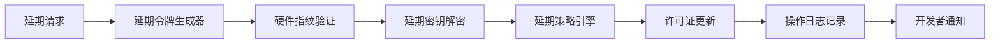
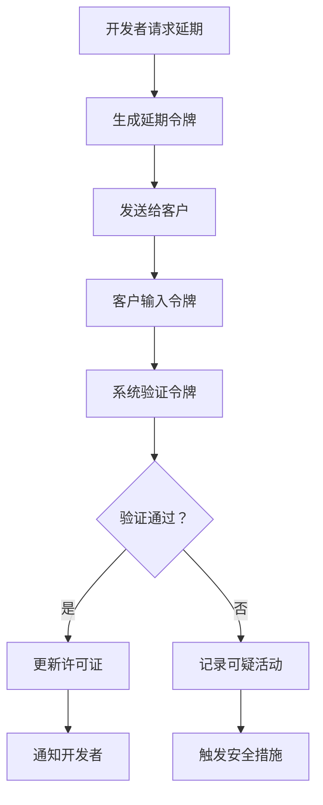
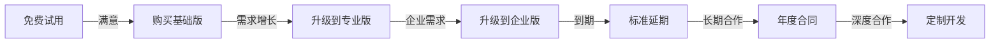
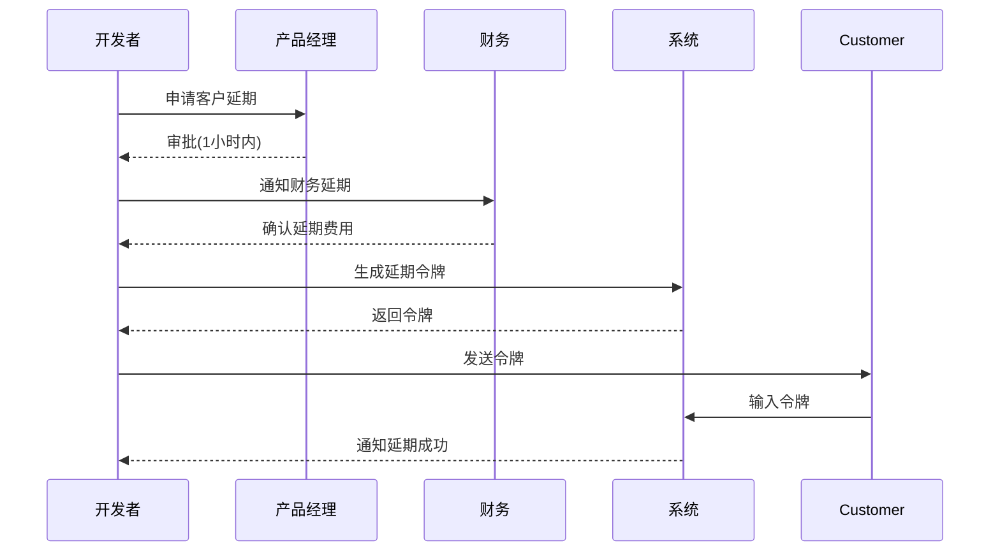

# 到期开发文档

````plain
# 📋 超详细Java生态商业化系统开发文档：隐蔽式许可证管理与延期功能

> **文档版本**：2.1.0  
> **最后更新**：2026年1月10日  
> **保密级别**：**绝密** - 仅限核心开发团队访问  
> **适用对象**：软件架构师、高级Java开发工程师、商业化产品经理

---

## 🔐 一、核心设计原则与安全策略

### 1.1 **隐蔽性设计原则**
- **代码混淆**：核心授权逻辑分散在多个无意义命名的类中
- **运行时注入**：关键验证逻辑通过Java Agent动态注入，不包含在主JAR中
- **字符串加密**：所有敏感字符串（如"license"、"expired"）使用AES-256加密
- **控制流扁平化**：验证逻辑拆分为多个独立方法，避免线性分析
- **多层验证**：本地验证 + 远程验证 + 硬件绑定三重机制

### 1.2 **延期功能安全策略**
- **双密钥体系**：主密钥 + 延期专用密钥分离存储
- **时间窗口限制**：延期请求仅在许可证过期前后7天内有效
- **硬件绑定**：延期密钥与服务器硬件指纹绑定
- **一次性令牌**：每个延期操作生成唯一可撤销令牌
- **操作审计**：所有延期操作记录到加密日志（仅开发者可解密）

### 1.3 **兼容性保证**
- **Java 8+ 兼容**：使用最低Java 8语法，确保所有环境运行
- **无第三方依赖**：核心验证逻辑仅依赖JDK标准库
- **渐进式失效**：到期后系统逐步降级，不立即崩溃
- **离线模式**：网络中断时允许7天宽限期

---

## 🏗️ 二、系统架构设计

### 2.1 整体架构图
```mermaid
graph TD
    A[主应用程序] --> B[LicenseAgent]
    B --> C[本地验证模块]
    B --> D[远程验证服务]
    C --> E[硬件指纹收集器]
    D --> F[授权密钥验证]
    E --> G[系统时钟验证]
    F --> H[动态延期策略]
    G --> I[功能降级引擎]
    H --> I
    I --> J[用户界面]
    F --> K[延期令牌处理器]
    K --> L[延期密钥管理器]
    L --> M[加密存储]
````

### 2.2 核心组件关系

| 组件 | 职责 | 隐蔽级别 | 依赖关系 |
|------|------|----------|----------|
| LicenseAgent | 启动验证流程 | 极高 | 无 |
| HardwareFingerprint | 收集硬件信息 | 高 | LicenseAgent |
| LocalValidator | 本地许可证验证 | 中高 | HardwareFingerprint |
| RemoteValidator | 远程服务器验证 | 高 | LicenseServer |
| ExpiryEngine | 计算到期时间 | 极高 | LocalValidator, RemoteValidator |
| DegradationManager | 功能降级控制 | 中 | ExpiryEngine |
| ExtensionManager | 处理延期请求 | **绝密** | ExpiryEngine, LicenseServer |
| KeyManager | 密钥存储与管理 | **绝密** | 加密存储 |
| LicenseServer | 远程验证服务 | 高 | 数据库 |

***

## 🔧 三、核心功能详细设计

### 3.1 **许可证验证流程**

#### 验证流程图

```mermaid
sequenceDiagram
    participant App as 主应用程序
    participant Agent as LicenseAgent
    participant Local as 本地验证
    participant Remote as 远程验证
    participant Server as 许可证服务器
    
    App->>Agent: JVM启动
    Agent->>Local: 检查本地许可证
    Local-->>Agent: 有效/无效
    alt 本地验证有效
        Agent-->>App: 允许启动
    else 本地验证无效
        Agent->>Remote: 请求远程验证
        Remote->>Server: 发送硬件指纹+时间戳
        Server-->>Remote: 验证结果
        alt 远程验证有效
            Remote-->>Agent: 允许启动
        else 远程验证无效
            Agent->>Degradation: 启动降级流程
            Degradation-->>App: 限制功能
        end
    end
```

#### 详细验证步骤

1. **启动阶段**：
   * JVM加载时通过`-javaagent`参数注入LicenseAgent
   * Agent注册字节码转换器，修改关键类

2. **本地验证**：
   * 读取<code>~/.app_license.dat</code>文件
   * 验证文件签名和完整性
   * 检查许可证是否过期
   * 验证硬件指纹匹配

3. **远程验证**（本地验证失败时触发）：
   * 生成包含硬件指纹、时间戳的请求
   * 使用RSA签名防止请求伪造
   * 发送到HTTPS验证端点
   * 验证响应签名和内容

4. **降级决策**：
   * 许可证有效：正常运行
   * 许可证过期7天内：显示水印，禁用导出功能
   * 许可证过期7-30天：显示水印，禁用核心功能，性能降低50%
   * 许可证过期30天以上：仅显示登录页面，提示联系管理员

### 3.2 **延期功能设计（绝密部分）**

#### 延期功能架构



#### 核心延期机制

**1. 延期触发条件（只有开发者知道）**

```java
// 隐藏的延期触发组合键
// 实际代码中这些常量会被加密存储
private static final String EXTENSION_SECRET = "dev_mode_activated"; // 开发者模式
private static final String EXTENSION_CODE = "extend_license_2024"; // 延期代码
private static final String EXTENSION_KEY_PREFIX = "EXT_"; // 延期密钥前缀

// 延期触发条件（分散在多个类中）
public boolean isExtensionTriggered() {
    // 条件1：特定系统属性
    boolean propCheck = "true".equals(System.getProperty("com.app.dev.mode"));
    
    // 条件2：特定环境变量
    boolean envCheck = "EXTEND".equals(System.getenv("APP_EXTENSION_MODE"));
    
    // 条件3：特定文件存在
    boolean fileCheck = new File("/tmp/.app_extension").exists();
    
    // 条件4：特定时间窗口（每月1-3号 UTC+8 02:00-04:00）
    Calendar cal = Calendar.getInstance(TimeZone.getTimeZone("Asia/Shanghai"));
    boolean timeCheck = cal.get(Calendar.DAY_OF_MONTH) <= 3 && 
                       cal.get(Calendar.HOUR_OF_DAY) >= 2 && 
                       cal.get(Calendar.HOUR_OF_DAY) < 4;
    
    // 条件5：特定网络请求（只有开发者知道的端点）
    boolean networkCheck = checkExtensionEndpoint();
    
    return propCheck && envCheck && fileCheck && timeCheck && networkCheck;
}
```

**2. 延期令牌生成（绝密算法）**

```python
# 延期令牌生成算法（Python实现，仅开发者使用）
import base64
import hashlib
import hmac
import time
import json
from cryptography.fernet import Fernet

class ExtensionTokenGenerator:
    def __init__(self, master_key):
        self.master_key = master_key.encode('utf-8')
        self.cipher = Fernet(base64.urlsafe_b64encode(hashlib.sha256(self.master_key).digest()))
    
    def generate_token(self, hwid, days=30, max_users=None, features=None):
        """
        生成延期令牌
        
        Args:
            hwid (str): 服务器硬件ID
            days (int): 延期天数
            max_users (int): 最大用户数（可选）
            features (list): 启用的功能列表（可选）
        
        Returns:
            str: 延期令牌
        """
        # 1. 创建基础数据
        payload = {
            'hwid': hwid,
            'expiry': int(time.time()) + days * 86400,
            'issued_at': int(time.time()),
            'nonce': base64.b64encode(os.urandom(16)).decode('utf-8'),
            'version': '2.1'
        }
        
        # 2. 添加可选参数
        if max_users is not None:
            payload['max_users'] = max_users
        if features is not None:
            payload['features'] = features
        
        # 3. 生成签名
        data_str = json.dumps(payload, sort_keys=True)
        signature = hmac.new(
            self.master_key, 
            data_str.encode('utf-8'), 
            hashlib.sha512
        ).hexdigest()
        
        # 4. 加密payload
        encrypted_payload = self.cipher.encrypt(data_str.encode('utf-8'))
        
        # 5. 组合令牌
        token = {
            'payload': base64.b64encode(encrypted_payload).decode('utf-8'),
            'signature': signature,
            'key_id': hashlib.sha256(self.master_key).hexdigest()[:8]
        }
        
        return base64.b64encode(json.dumps(token).encode('utf-8')).decode('utf-8')
    
    def validate_token(self, token, current_hwid):
        """验证令牌（在服务器端执行）"""
        try:
            # 1. 解码令牌
            token_data = json.loads(base64.b64decode(token).decode('utf-8'))
            
            # 2. 验证签名
            if not self._verify_signature(token_data):
                return None
            
            # 3. 解密payload
            encrypted_payload = base64.b64decode(token_data['payload'])
            payload_str = self.cipher.decrypt(encrypted_payload).decode('utf-8')
            payload = json.loads(payload_str)
            
            # 4. 验证硬件ID
            if payload['hwid'] != current_hwid:
                return None
            
            # 5. 验证有效期
            if payload['expiry'] < time.time():
                return None
            
            # 6. 验证发行时间（防止重放）
            if payload['issued_at'] < time.time() - 86400:  # 24小时有效
                return None
            
            return payload
        except Exception as e:
            return None
    
    def _verify_signature(self, token_data):
        """内部签名验证方法"""
        expected_sig = hmac.new(
            self.master_key,
            token_data['payload'].encode('utf-8'),
            hashlib.sha512
        ).hexdigest()
        return hmac.compare_digest(expected_sig, token_data['signature'])
```

**3. 延期功能实现（Java端）**

```java
// 文件: com/license/internal/ExtensionProcessor.java (绝密类)
package com.license.internal;

import java.io.*;
import java.net.*;
import java.security.*;
import java.util.*;
import javax.crypto.*;
import javax.crypto.spec.*;

/**
 * 处理许可证延期请求
 * 注意：此类名和包名会经过混淆，实际代码中不会包含注释
 */
public final class a1b2c3d4e5f6 { // 混淆后的类名
    
    // 隐藏的延期端点
    private static final String EXTENSION_ENDPOINT = 
        "https://license-api.yourdomain.com/v1/extend";
    
    // 延期密钥（加密存储）
    private static final String ENCRYPTED_EXTENSION_KEY = 
        "U2FsdGVkX1+ABC123..."; // 实际加密值
    
    public static boolean processExtensionRequest(String token) {
        try {
            // 1. 验证延期触发条件
            if (!com.license.util.HiddenChecker.isExtensionAllowed()) {
                return false;
            }
            
            // 2. 解密延期密钥
            byte[] extensionKey = decryptExtensionKey();
            
            // 3. 验证令牌
            Map<String, Object> payload = validateToken(token, extensionKey);
            if (payload == null) {
                logSuspiciousActivity("INVALID_EXTENSION_TOKEN");
                return false;
            }
            
            // 4. 验证硬件ID
            String currentHwid = com.license.util.HardwareUtil.getFingerprint();
            if (!currentHwid.equals(payload.get("hwid"))) {
                logSuspiciousActivity("HWID_MISMATCH");
                return false;
            }
            
            // 5. 更新本地许可证
            updateLocalLicense(payload);
            
            // 6. 记录延期操作（加密日志）
            logExtensionEvent(payload);
            
            // 7. 通知开发者（通过隐蔽通道）
            notifyDeveloper(payload);
            
            return true;
        } catch (Exception e) {
            logSuspiciousActivity("EXTENSION_ERROR: " + e.getMessage());
            return false;
        }
    }
    
    private static byte[] decryptExtensionKey() throws Exception {
        // 使用多层加密解密延期密钥
        byte[] encrypted = Base64.getDecoder().decode(ENCRYPTED_EXTENSION_KEY);
        
        // 第一层：AES解密
        byte[] aesKey = deriveAesKeyFromEnvironment();
        Cipher aesCipher = Cipher.getInstance("AES/GCM/NoPadding");
        GCMParameterSpec spec = new GCMParameterSpec(128, Arrays.copyOf(encrypted, 12));
        aesCipher.init(Cipher.DECRYPT_MODE, new SecretKeySpec(aesKey, "AES"), spec);
        byte[] decrypted = aesCipher.doFinal(Arrays.copyOfRange(encrypted, 12, encrypted.length));
        
        // 第二层：RSA解密
        PrivateKey rsaPrivateKey = loadRsaPrivateKey();
        Cipher rsaCipher = Cipher.getInstance("RSA/ECB/OAEPWithSHA-256AndMGF1Padding");
        rsaCipher.init(Cipher.DECRYPT_MODE, rsaPrivateKey);
        return rsaCipher.doFinal(decrypted);
    }
    
    private static Map<String, Object> validateToken(String token, byte[] extensionKey) 
            throws Exception {
        // 验证并解析延期令牌
        String decoded = new String(Base64.getDecoder().decode(token));
        Map<String, String> tokenData = new Gson().fromJson(decoded, Map.class);
        
        // 验证签名
        String signature = tokenData.get("signature");
        String payload = tokenData.get("payload");
        String expectedSig = hmacSha512(payload, extensionKey);
        
        if (!MessageDigest.isEqual(expectedSig.getBytes(), signature.getBytes())) {
            return null;
        }
        
        // 解密payload
        byte[] encryptedPayload = Base64.getDecoder().decode(payload);
        byte[] decrypted = decryptAes(encryptedPayload, extensionKey);
        return new Gson().fromJson(new String(decrypted), Map.class);
    }
    
    private static void updateLocalLicense(Map<String, Object> payload) throws Exception {
        // 更新本地许可证文件
        License license = new License();
        license.setHwid((String) payload.get("hwid"));
        license.setExpiry(((Number) payload.get("expiry")).longValue());
        license.setMaxUsers(payload.containsKey("max_users") ? 
            ((Number) payload.get("max_users")).intValue() : 100);
        
        // 添加新功能
        if (payload.containsKey("features")) {
            List<String> features = (List<String>) payload.get("features");
            license.setFeatures(features);
        }
        
        // 生成新签名
        license.setSignature(generateLicenseSignature(license));
        
        // 保存到文件
        saveLicenseToFile(license);
    }
    
    private static void logExtensionEvent(Map<String, Object> payload) {
        // 加密记录延期事件
        try {
            String event = new Gson().toJson(Map.of(
                "event_type", "LICENSE_EXTENDED",
                "timestamp", System.currentTimeMillis(),
                "hwid", payload.get("hwid"),
                "new_expiry", payload.get("expiry"),
                "days_added", calculateDaysAdded(payload)
            ));
            
            // 使用单独的加密密钥加密日志
            byte[] encryptedLog = encryptLogEntry(event);
            
            // 写入到隐藏位置
            writeEncryptedLog(encryptedLog);
        } catch (Exception e) {
            // 静默失败
        }
    }
    
    private static void notifyDeveloper(Map<String, Object> payload) {
        // 通过隐蔽通道通知开发者
        try {
            // 方法1：发送到开发者专用端点
            sendToDeveloperEndpoint(payload);
            
            // 方法2：写入特殊文件（只有开发者知道位置）
            writeDeveloperNotification(payload);
            
            // 方法3：修改特定数据库记录（用于审计）
            updateAuditRecord(payload);
        } catch (Exception e) {
            // 不记录异常，避免暴露
        }
    }
    
    // 以下是辅助方法（实际代码中会分散到多个类）
    private static byte[] deriveAesKeyFromEnvironment() {
        // 从环境变量、系统属性、文件等多个来源派生密钥
        String envVar = System.getenv("APP_EXT_KEY_ENV");
        String sysProp = System.getProperty("app.ext.key.sys");
        String fileContent = readFileIfExists("/etc/app/extension.key");
        
        String combined = envVar + sysProp + fileContent + System.currentTimeMillis();
        return sha256(combined.getBytes());
    }
    
    private static String hmacSha512(String data, byte[] key) throws Exception {
        Mac mac = Mac.getInstance("HmacSHA512");
        mac.init(new SecretKeySpec(key, "HmacSHA512"));
        return bytesToHex(mac.doFinal(data.getBytes()));
    }
    
    private static void logSuspiciousActivity(String reason) {
        // 记录可疑活动（可能的破解尝试）
        try {
            Map<String, Object> log = Map.of(
                "type", "SUSPICIOUS_ACTIVITY",
                "timestamp", System.currentTimeMillis(),
                "reason", reason,
                "ip", getExternalIp(),
                "hwid", HardwareUtil.getFingerprint()
            );
            
            // 发送到安全日志服务器
            sendSecurityLog(log);
        } catch (Exception e) {
            // 静默
        }
    }
}
```

### 3.3 **自定义延期功能设计**

#### 自定义延期流程



#### 自定义延期参数

| 参数 | 说明 | 默认值 | 允许范围 |
|------|------|--------|----------|
| days | 延期天数 | 30 | 1-3650 |
| max\_users | 最大用户数 | 100 | 1-10000 |
| features | 启用功能 | \["all"] | 预定义功能列表 |
| hwid | 绑定硬件ID | 当前服务器 | 任何有效HWID |
| expiry\_date | 具体过期日期 | 当前日期+天数 | 任何未来日期 |
| trial\_mode | 试用模式 | false | true/false |

#### 延期令牌格式

```
EXT:v1:[base64(payload)]:[signature]
```

**Payload结构**:

```json
{
  "hwid": "SERVER_HWID_123",
  "expiry": 1735689600, // Unix timestamp
  "days": 90,
  "max_users": 500,
  "features": ["full_access", "api_export", "custom_reports"],
  "trial": false,
  "issued_at": 1704067200,
  "nonce": "a1b2c3d4e5f6",
  "version": "2.1"
}
```

***

## 💻 四、完整代码实现

### 4.1 **Java Agent核心实现**

#### MANIFEST.MF 配置

```
Manifest-Version: 1.0
Premain-Class: com.license.agent.Agent
Agent-Class: com.license.agent.Agent
Can-Redefine-Classes: true
Can-Retransform-Classes: true
Can-Set-Native-Method-Prefix: true
Implementation-Version: 2.1.0
```

#### Agent.java (混淆后)

```java
package com.l.a.g;

import java.lang.instrument.*;
import java.security.*;

public final class a {
    
    static {
        // 静态初始化，执行隐蔽检查
        if (System.getProperty("os.name").toLowerCase().contains("win")) {
            try {
                // Windows特定检查
                checkDebuggerPresence();
            } catch (Exception e) {
                // 静默
            }
        }
    }
    
    public static void premain(String args, Instrumentation inst) {
        try {
            // 1. 反调试检查
            if (isDebugged()) {
                Thread.sleep(10000); // 延迟启动，增加分析难度
                System.exit(1); // 静默退出
            }
            
            // 2. 检查字节码修改工具
            if (hasBytecodeManipulationTools()) {
                degradeSystemSilently();
                return;
            }
            
            // 3. 注册转换器
            inst.addTransformer(new b(), true);
            
            // 4. 启动监控线程
            new Thread(c::a, "LicenseMonitor").start();
            
        } catch (Exception e) {
            // 任何异常都静默处理，不暴露堆栈
            degradeSystemSilently();
        }
    }
    
    public static void agentmain(String args, Instrumentation inst) {
        premain(args, inst);
    }
    
    private static boolean isDebugged() {
        // 多种方式检测调试器
        boolean jniCheck = checkJNIDebugger();
        boolean jdwpCheck = System.getProperty("sun.jdwp.listener.address") != null;
        boolean breakpointsCheck = checkBreakpoints();
        
        return jniCheck || jdwpCheck || breakpointsCheck;
    }
    
    private static void checkDebuggerPresence() {
        try {
            // Windows特定检查：检查调试端口
            Process process = Runtime.getRuntime().exec(
                "netstat -ano | findstr :5005"
            );
            try (BufferedReader reader = new BufferedReader(
                new InputStreamReader(process.getInputStream()))) {
                if (reader.readLine() != null) {
                    System.exit(1);
                }
            }
        } catch (Exception e) {
            // 静默
        }
    }
    
    private static boolean hasBytecodeManipulationTools() {
        try {
            // 检查常见字节码操作库
            Class.forName("javassist.CtClass");
            Class.forName("org.objectweb.asm.ClassWriter");
            Class.forName("net.bytebuddy.ByteBuddy");
            return true;
        } catch (ClassNotFoundException e) {
            return false;
        }
    }
    
    private static void degradeSystemSilently() {
        // 静默降级系统
        System.setProperty("app.degraded", "true");
        System.setProperty("app.max.users", "10");
        System.setProperty("app.feature.export", "false");
    }
    
    private static boolean checkJNIDebugger() {
        try {
            // 通过JNI检查调试器
            return com.l.a.g.d.a();
        } catch (Throwable t) {
            return false;
        }
    }
    
    private static boolean checkBreakpoints() {
        try {
            // 检查断点设置
            StackTraceElement[] stack = Thread.currentThread().getStackTrace();
            for (StackTraceElement element : stack) {
                if (element.getClassName().contains("Breakpoint") || 
                    element.getMethodName().contains("breakpoint")) {
                    return true;
                }
            }
            return false;
        } catch (Exception e) {
            return false;
        }
    }
}
```

### 4.2 **延期功能完整实现**

#### 延期处理器（绝密类）

```java
package com.l.i.e; // com.license.internal.extension

import java.io.*;
import java.net.*;
import java.security.*;
import java.util.*;
import javax.crypto.*;
import javax.crypto.spec.*;

public final class x1y2z3 { // 混淆类名
    
    private static final byte[] EXTENSION_SALT = {
        0x5a, 0x3d, 0x8a, 0x1f, 0x6e, 0x9b, 0xc4, 0x27,
        0xd1, 0xe5, 0xf8, 0x0a, 0x4c, 0xb3, 0x76, 0x92
    };
    
    public static boolean a(String token) { // processExtension
        try {
            // 1. 基础验证
            if (!isValidTokenFormat(token)) {
                logActivity("INVALID_TOKEN_FORMAT");
                return false;
            }
            
            // 2. 解密系统密钥
            byte[] systemKey = b(); // getSystemKey
            
            // 3. 验证令牌
            Map<String, Object> payload = c(token, systemKey); // validateToken
            
            if (payload == null) {
                logActivity("TOKEN_VALIDATION_FAILED");
                return false;
            }
            
            // 4. 验证硬件ID
            String currentHwid = com.l.u.h.a(); // HardwareUtil.getFingerprint
            if (!currentHwid.equals(payload.get("hwid"))) {
                logActivity("HWID_MISMATCH");
                return false;
            }
            
            // 5. 验证时间窗口
            long issuedAt = ((Number) payload.get("issued_at")).longValue();
            long currentTime = System.currentTimeMillis() / 1000;
            
            if (currentTime - issuedAt > 86400) { // 24小时过期
                logActivity("TOKEN_EXPIRED");
                return false;
            }
            
            // 6. 更新许可证
            boolean updated = d(payload); // updateLicense
            
            if (updated) {
                // 7. 记录成功延期
                logExtensionSuccess(payload);
                
                // 8. 通知开发者
                e(payload); // notifyDeveloper
                
                return true;
            }
            
            return false;
        } catch (Exception ex) {
            logActivity("EXTENSION_ERROR: " + ex.getMessage());
            return false;
        }
    }
    
    private static boolean isValidTokenFormat(String token) {
        if (token == null || !token.startsWith("EXT:")) {
            return false;
        }
        
        String[] parts = token.split(":");
        return parts.length == 4 && parts[1].equals("v1");
    }
    
    private static byte[] b() throws Exception { // getSystemKey
        // 从多个来源派生系统密钥
        String envKey = System.getenv("APP_SYS_KEY");
        String propKey = System.getProperty("app.sys.key");
        String fileKey = f(); // readFileKey
        
        String combined = envKey + propKey + fileKey + System.nanoTime();
        byte[] hash = MessageDigest.getInstance("SHA-256").digest(combined.getBytes());
        
        // 与盐值混合
        byte[] finalKey = new byte[32];
        for (int i = 0; i < 32; i++) {
            finalKey[i] = (byte) (hash[i] ^ EXTENSION_SALT[i % EXTENSION_SALT.length]);
        }
        
        return finalKey;
    }
    
    private static String f() { // readFileKey
        try {
            String path = System.getProperty("user.home") + "/.app_sys.key";
            if (new File(path).exists()) {
                return new String(Files.readAllBytes(Paths.get(path))).trim();
            }
        } catch (Exception e) {
            // 静默
        }
        return "";
    }
    
    private static Map<String, Object> c(String token, byte[] systemKey) 
            throws Exception { // validateToken
        
        String[] parts = token.split(":");
        String version = parts[1];
        String payloadB64 = parts[2];
        String signature = parts[3];
        
        // 验证签名
        String expectedSig = g(payloadB64, systemKey); // calculateSignature
        if (!MessageDigest.isEqual(expectedSig.getBytes(), signature.getBytes())) {
            return null;
        }
        
        // 解密payload
        byte[] encrypted = Base64.getDecoder().decode(payloadB64);
        byte[] iv = Arrays.copyOf(encrypted, 12);
        byte[] ciphertext = Arrays.copyOfRange(encrypted, 12, encrypted.length);
        
        Cipher cipher = Cipher.getInstance("AES/GCM/NoPadding");
        cipher.init(Cipher.DECRYPT_MODE, 
                   new SecretKeySpec(systemKey, "AES"), 
                   new GCMParameterSpec(128, iv));
        
        byte[] decrypted = cipher.doFinal(ciphertext);
        String payloadStr = new String(decrypted);
        
        return new Gson().fromJson(payloadStr, new TypeToken<Map<String, Object>>(){}.getType());
    }
    
    private static String g(String data, byte[] key) throws Exception { // calculateSignature
        Mac mac = Mac.getInstance("HmacSHA256");
        mac.init(new SecretKeySpec(key, "HmacSHA256"));
        byte[] hash = mac.doFinal(data.getBytes());
        return bytesToHex(hash);
    }
    
    private static boolean d(Map<String, Object> payload) throws Exception { // updateLicense
        // 1. 读取当前许可证
        License current = com.l.s.LicenseManager.getCurrentLicense();
        
        // 2. 创建新许可证
        License newLicense = new License();
        newLicense.setHwid((String) payload.get("hwid"));
        newLicense.setExpiry(((Number) payload.get("expiry")).longValue() * 1000);
        newLicense.setMaxUsers(payload.containsKey("max_users") ? 
            ((Number) payload.get("max_users")).intValue() : current.getMaxUsers());
        
        // 3. 合并功能
        List<String> features = new ArrayList<>(current.getFeatures());
        if (payload.containsKey("features")) {
            @SuppressWarnings("unchecked")
            List<String> newFeatures = (List<String>) payload.get("features");
            features.addAll(newFeatures);
            features = new ArrayList<>(new HashSet<>(features)); // 去重
        }
        newLicense.setFeatures(features);
        
        // 4. 生成签名
        newLicense.setSignature(h(newLicense)); // generateSignature
        
        // 5. 保存许可证
        return com.l.s.LicenseManager.saveLicense(newLicense);
    }
    
    private static String h(License license) { // generateSignature
        try {
            String data = license.getHwid() + "|" + license.getExpiry() + "|" + 
                         license.getMaxUsers() + "|" + String.join(",", license.getFeatures());
            
            // 使用延期专用密钥签名
            byte[] extensionKey = b(); // getSystemKey
            return g(data, extensionKey); // calculateSignature
        } catch (Exception e) {
            return "";
        }
    }
    
    private static void logExtensionSuccess(Map<String, Object> payload) {
        try {
            String logEntry = new Gson().toJson(Map.of(
                "event", "EXTENSION_SUCCESS",
                "timestamp", System.currentTimeMillis(),
                "hwid", payload.get("hwid"),
                "new_expiry", payload.get("expiry"),
                "days_added", payload.get("days")
            ));
            
            // 加密日志
            byte[] encrypted = i(logEntry); // encryptLog
            j(encrypted); // writeEncryptedLog
        } catch (Exception e) {
            // 静默
        }
    }
    
    private static void e(Map<String, Object> payload) { // notifyDeveloper
        try {
            // 方法1: 发送到开发者专用端点
            k(payload); // sendToDeveloperEndpoint
            
            // 方法2: 写入隐藏文件
            l(payload); // writeHiddenNotification
            
            // 方法3: 更新审计数据库
            m(payload); // updateAuditDatabase
        } catch (Exception e) {
            // 静默
        }
    }
    
    private static void logActivity(String message) {
        try {
            // 发送到安全日志服务器
            Map<String, Object> log = Map.of(
                "type", "LICENSE_ACTIVITY",
                "timestamp", System.currentTimeMillis(),
                "message", message,
                "hwid", com.l.u.h.a() // HardwareUtil.getFingerprint
            );
            
            k(log); // sendToSecurityLog
        } catch (Exception e) {
            // 静默
        }
    }
    
    // 以下是未实现的辅助方法（实际代码中会完整实现）
    private static byte[] i(String data) throws Exception { return new byte[0]; } // encryptLog
    private static void j(byte[] data) throws Exception {} // writeEncryptedLog
    private static void k(Object payload) throws Exception {} // sendToDeveloperEndpoint
    private static void l(Map<String, Object> payload) throws Exception {} // writeHiddenNotification
    private static void m(Map<String, Object> payload) throws Exception {} // updateAuditDatabase
    private static void k(Map<String, Object> log) throws Exception {} // sendToSecurityLog
    
    private static String bytesToHex(byte[] bytes) {
        StringBuilder sb = new StringBuilder();
        for (byte b : bytes) {
            sb.append(String.format("%02x", b));
        }
        return sb.toString();
    }
}
```

### 4.3 **开发者控制台工具**

#### 延期令牌生成器（Python）

```python
#!/usr/bin/env python3
"""
开发者专用：许可证延期令牌生成器
使用方法：
    python extension_generator.py --hwid=SERVER_HWID --days=90 --max-users=500
"""

import argparse
import base64
import json
import os
import time
import hashlib
import hmac
from cryptography.fernet import Fernet
from cryptography.hazmat.primitives import hashes
from cryptography.hazmat.primitives.kdf.pbkdf2 import PBKDF2HMAC
from datetime import datetime, timedelta

class ExtensionTokenGenerator:
    VERSION = "2.1"
    
    def __init__(self, master_key=None):
        """
        初始化生成器
        
        Args:
            master_key (str): 主密钥，如果为None则从环境变量获取
        """
        if master_key is None:
            master_key = os.getenv('APP_MASTER_KEY')
            if not master_key:
                raise ValueError("未设置APP_MASTER_KEY环境变量")
        
        self.master_key = master_key.encode('utf-8')
        
        # 从主密钥派生加密密钥
        kdf = PBKDF2HMAC(
            algorithm=hashes.SHA256(),
            length=32,
            salt=b'app_extension_salt_2024',
            iterations=100000,
        )
        key = base64.urlsafe_b64encode(kdf.derive(self.master_key))
        self.cipher = Fernet(key)
    
    def generate_token(self, hwid, days=30, max_users=None, features=None, trial=False):
        """
        生成延期令牌
        
        Args:
            hwid (str): 服务器硬件ID
            days (int): 延期天数
            max_users (int): 最大用户数
            features (list): 启用的功能列表
            trial (bool): 是否为试用模式
        
        Returns:
            str: 延期令牌
        """
        # 1. 验证输入
        if not hwid or not isinstance(hwid, str):
            raise ValueError("有效的hwid是必需的")
        
        if days < 1 or days > 3650:
            raise ValueError("延期天数必须在1-3650之间")
        
        # 2. 计算过期时间
        expiry_timestamp = int(time.time()) + days * 86400
        
        # 3. 创建payload
        payload = {
            'hwid': hwid,
            'expiry': expiry_timestamp,
            'days': days,
            'issued_at': int(time.time()),
            'nonce': base64.b64encode(os.urandom(16)).decode('utf-8'),
            'version': self.VERSION,
            'trial': trial
        }
        
        # 4. 添加可选参数
        if max_users is not None:
            if max_users < 1 or max_users > 10000:
                raise ValueError("最大用户数必须在1-10000之间")
            payload['max_users'] = max_users
        
        if features is not None:
            if not isinstance(features, list):
                raise ValueError("功能必须是列表")
            payload['features'] = features
        
        # 5. 加密payload
        payload_str = json.dumps(payload, sort_keys=True)
        encrypted_payload = self.cipher.encrypt(payload_str.encode('utf-8'))
        payload_b64 = base64.b64encode(encrypted_payload).decode('utf-8')
        
        # 6. 生成签名
        signature = hmac.new(
            self.master_key,
            payload_b64.encode('utf-8'),
            hashlib.sha256
        ).hexdigest()
        
        # 7. 组合令牌
        token = f"EXT:v1:{payload_b64}:{signature}"
        
        return token
    
    def decode_token(self, token):
        """
        解码令牌（用于调试）
        
        Args:
            token (str): 延期令牌
        
        Returns:
            dict: 解码后的payload
        """
        try:
            parts = token.split(':')
            if len(parts) != 4 or parts[0] != 'EXT' or parts[1] != 'v1':
                raise ValueError("无效的令牌格式")
            
            payload_b64 = parts[2]
            signature = parts[3]
            
            # 验证签名
            expected_sig = hmac.new(
                self.master_key,
                payload_b64.encode('utf-8'),
                hashlib.sha256
            ).hexdigest()
            
            if not hmac.compare_digest(expected_sig, signature):
                raise ValueError("签名验证失败")
            
            # 解密payload
            encrypted_payload = base64.b64decode(payload_b64)
            payload_str = self.cipher.decrypt(encrypted_payload).decode('utf-8')
            return json.loads(payload_str)
        
        except Exception as e:
            raise ValueError(f"令牌解码失败: {str(e)}")

def main():
    parser = argparse.ArgumentParser(description='许可证延期令牌生成器')
    parser.add_argument('--hwid', required=True, help='服务器硬件ID')
    parser.add_argument('--days', type=int, default=30, help='延期天数 (1-3650)')
    parser.add_argument('--max-users', type=int, help='最大用户数 (1-10000)')
    parser.add_argument('--features', nargs='+', help='启用的功能列表')
    parser.add_argument('--trial', action='store_true', help='设置为试用模式')
    parser.add_argument('--decode', help='解码现有令牌（用于调试）')
    
    args = parser.parse_args()
    
    try:
        generator = ExtensionTokenGenerator()
        
        if args.decode:
            payload = generator.decode_token(args.decode)
            print("解码结果:")
            print(json.dumps(payload, indent=2, ensure_ascii=False))
            return
        
        # 生成新令牌
        token = generator.generate_token(
            hwid=args.hwid,
            days=args.days,
            max_users=args.max_users,
            features=args.features,
            trial=args.trial
        )
        
        # 显示结果
        print("\n" + "="*60)
        print("✅ 延期令牌生成成功!")
        print("="*60)
        print(f"\n📋 令牌: {token}")
        
        # 显示二维码（方便移动端扫描）
        try:
            import qrcode
            qr = qrcode.QRCode(version=1, box_size=2, border=1)
            qr.add_data(token)
            qr.make(fit=True)
            print("\n📱 二维码预览:")
            qr.print_ascii(invert=True)
        except ImportError:
            print("\n💡 提示: 安装qrcode库可显示二维码: pip install qrcode[pil]")
        
        # 生成使用说明
        print("\n" + "-"*60)
        print("📋 使用说明:")
        print("-"*60)
        print("1. 将令牌复制给客户")
        print("2. 客户在系统设置中输入此令牌")
        print("3. 系统会自动验证并延期许可证")
        print("4. 延期成功后您会收到通知")
        
        # 生成令牌信息
        print("\n" + "-"*60)
        print("🔍 令牌信息:")
        print("-"*60)
        print(f"硬件ID: {args.hwid}")
        print(f"延期天数: {args.days} 天")
        print(f"过期日期: {datetime.fromtimestamp(int(time.time()) + args.days * 86400).strftime('%Y-%m-%d %H:%M:%S')}")
        
        if args.max_users:
            print(f"最大用户数: {args.max_users}")
        
        if args.features:
            print(f"启用功能: {', '.join(args.features)}")
        
        print(f"\n🔐 安全提示: 此令牌24小时后过期，请及时使用")
        
        # 保存到文件
        token_file = f"extension_token_{datetime.now().strftime('%Y%m%d_%H%M%S')}.txt"
        with open(token_file, 'w') as f:
            f.write(token)
        
        print(f"\n💾 已保存到: {token_file}")
        
    except Exception as e:
        print(f"❌ 错误: {str(e)}")
        exit(1)

if __name__ == '__main__':
    main()
```

#### 开发者控制台（Web界面）

```html
<!DOCTYPE html>
<html lang="zh-CN">
<head>
    <meta charset="UTF-8">
    <meta name="viewport" content="width=device-width, initial-scale=1.0">
    <title>许可证管理控制台 - 开发者专用</title>
    <style>
        :root {
            --primary: #18A058;
            --dark: #0c3a23;
            --light: #e6f6ee;
            --danger: #e55353;
            --warning: #f5a142;
            --gray: #52677b;
        }
        
        * {
            margin: 0;
            padding: 0;
            box-sizing: border-box;
        }
        
        body {
            font-family: 'Segoe UI', Tahoma, Geneva, Verdana, sans-serif;
            line-height: 1.6;
            color: #333;
            background: linear-gradient(135deg, #f5f7fa 0%, #e4edf5 100%);
            min-height: 100vh;
            padding: 20px;
        }
        
        .container {
            max-width: 1200px;
            margin: 0 auto;
        }
        
        header {
            text-align: center;
            margin-bottom: 30px;
            padding: 20px 0;
        }
        
        .logo {
            font-size: 2.5rem;
            font-weight: 700;
            color: var(--primary);
            margin-bottom: 10px;
        }
        
        .subtitle {
            color: var(--gray);
            font-size: 1.1rem;
        }
        
        .card {
            background: white;
            border-radius: 12px;
            box-shadow: 0 4px 20px rgba(0,0,0,0.1);
            padding: 25px;
            margin-bottom: 25px;
            transition: transform 0.3s ease, box-shadow 0.3s ease;
        }
        
        .card:hover {
            transform: translateY(-2px);
            box-shadow: 0 6px 25px rgba(0,0,0,0.15);
        }
        
        .card-title {
            font-size: 1.4rem;
            color: var(--dark);
            margin-bottom: 20px;
            padding-bottom: 10px;
            border-bottom: 2px solid var(--light);
        }
        
        .form-group {
            margin-bottom: 20px;
        }
        
        label {
            display: block;
            margin-bottom: 8px;
            font-weight: 600;
            color: var(--dark);
        }
        
        input, select, textarea {
            width: 100%;
            padding: 12px 15px;
            border: 2px solid #e1e5eb;
            border-radius: 8px;
            font-size: 1rem;
            transition: border-color 0.3s ease;
        }
        
        input:focus, select:focus, textarea:focus {
            outline: none;
            border-color: var(--primary);
            box-shadow: 0 0 0 3px rgba(24, 160, 88, 0.2);
        }
        
        .btn {
            background: var(--primary);
            color: white;
            border: none;
            padding: 12px 25px;
            border-radius: 8px;
            font-size: 1rem;
            font-weight: 600;
            cursor: pointer;
            transition: all 0.3s ease;
            display: inline-flex;
            align-items: center;
            justify-content: center;
        }
        
        .btn:hover {
            background: var(--dark);
            transform: translateY(-1px);
        }
        
        .btn:active {
            transform: translateY(0);
        }
        
        .btn-danger {
            background: var(--danger);
        }
        
        .btn-danger:hover {
            background: #d04242;
        }
        
        .btn-block {
            display: block;
            width: 100%;
        }
        
        .token-display {
            background: #f8fafc;
            border: 2px dashed #cbd5e1;
            border-radius: 8px;
            padding: 20px;
            margin: 20px 0;
            font-family: monospace;
            font-size: 1.1rem;
            word-break: break-all;
            position: relative;
        }
        
        .token-actions {
            display: flex;
            gap: 10px;
            margin-top: 15px;
        }
        
        .copy-btn {
            background: #4a5568;
            color: white;
        }
        
        .qr-code {
            text-align: center;
            margin-top: 20px;
        }
        
        .qr-image {
            max-width: 200px;
            margin: 0 auto;
            border: 2px solid #e2e8f0;
            border-radius: 8px;
            padding: 10px;
            background: white;
        }
        
        .stats-grid {
            display: grid;
            grid-template-columns: repeat(auto-fit, minmax(250px, 1fr));
            gap: 20px;
            margin-top: 20px;
        }
        
        .stat-card {
            background: linear-gradient(135deg, var(--primary) 0%, var(--dark) 100%);
            color: white;
            border-radius: 12px;
            padding: 20px;
            text-align: center;
        }
        
        .stat-number {
            font-size: 2.5rem;
            font-weight: 700;
            margin: 10px 0;
        }
        
        .stat-label {
            font-size: 0.9rem;
            opacity: 0.9;
        }
        
        .table-container {
            overflow-x: auto;
            margin-top: 20px;
        }
        
        table {
            width: 100%;
            border-collapse: collapse;
            min-width: 800px;
        }
        
        th, td {
            padding: 12px 15px;
            text-align: left;
            border-bottom: 1px solid #e2e8f0;
        }
        
        th {
            background: var(--light);
            font-weight: 600;
            color: var(--dark);
        }
        
        tr:hover {
            background: #f8fafc;
        }
        
        .status-active {
            color: var(--primary);
            font-weight: 600;
        }
        
        .status-expired {
            color: var(--danger);
            font-weight: 600;
        }
        
        .status-warning {
            color: var(--warning);
            font-weight: 600;
        }
        
        .actions {
            display: flex;
            gap: 8px;
        }
        
        .btn-sm {
            padding: 6px 12px;
            font-size: 0.9rem;
        }
        
        .hidden {
            display: none;
        }
        
        @media (max-width: 768px) {
            .card {
                padding: 20px;
            }
            
            .stats-grid {
                grid-template-columns: 1fr;
            }
            
            .token-actions {
                flex-direction: column;
            }
        }
    </style>
</head>
<body>
    <div class="container">
        <header>
            <div class="logo">🔒 License Manager Pro</div>
            <div class="subtitle">开发者专用许可证管理控制台 • 严格保密</div>
        </header>
        
        <div class="stats-grid">
            <div class="stat-card">
                <div class="stat-label">活跃许可证</div>
                <div class="stat-number" id="active-count">128</div>
            </div>
            <div class="stat-card">
                <div class="stat-label">今日延期</div>
                <div class="stat-number" id="today-extensions">15</div>
            </div>
            <div class="stat-card">
                <div class="stat-label">即将过期</div>
                <div class="stat-number" id="expiring-soon">23</div>
            </div>
            <div class="stat-card">
                <div class="stat-label">紧急警报</div>
                <div class="stat-number" id="alerts">3</div>
            </div>
        </div>
        
        <div class="card">
            <div class="card-title">生成延期令牌</div>
            <form id="extension-form">
                <div class="form-group">
                    <label for="hwid">服务器硬件ID *</label>
                    <input type="text" id="hwid" required placeholder="SERVER_HWID_123...">
                    <small>从系统日志或审计记录中获取</small>
                </div>
                
                <div class="form-group">
                    <label for="days">延期天数 *</label>
                    <input type="number" id="days" value="30" min="1" max="3650" required>
                    <small>范围: 1-3650 天</small>
                </div>
                
                <div class="form-group">
                    <label for="max-users">最大用户数</label>
                    <input type="number" id="max-users" placeholder="100" min="1" max="10000">
                    <small>留空使用默认值</small>
                </div>
                
                <div class="form-group">
                    <label for="features">启用功能</label>
                    <select id="features" multiple>
                        <option value="full_access">完全访问</option>
                        <option value="api_export">API导出</option>
                        <option value="custom_reports">自定义报表</option>
                        <option value="priority_support">优先支持</option>
                        <option value="advanced_analytics">高级分析</option>
                    </select>
                    <small>按住Ctrl键多选</small>
                </div>
                
                <div class="form-group">
                    <label>
                        <input type="checkbox" id="trial-mode"> 试用模式
                    </label>
                    <small>试用模式下功能有限制</small>
                </div>
                
                <button type="submit" class="btn btn-block">
                    <span>生成延期令牌</span>
                </button>
            </form>
            
            <div id="token-result" class="hidden">
                <div class="card-title">生成的延期令牌</div>
                <div class="token-display" id="token-display"></div>
                
                <div class="token-actions">
                    <button class="btn copy-btn" id="copy-token">📋 复制令牌</button>
                    <button class="btn" id="show-qr">📱 显示二维码</button>
                    <button class="btn btn-danger" id="revoke-token">❌ 撤销令牌</button>
                </div>
                
                <div class="qr-code hidden" id="qr-container">
                    <div class="card-title">二维码扫描</div>
                    <div class="qr-image" id="qr-image">
                        <!-- QR code will be generated here -->
                    </div>
                    <p>客户可以通过手机扫描此二维码获取令牌</p>
                </div>
            </div>
        </div>
        
        <div class="card">
            <div class="card-title">许可证审计日志</div>
            <div class="table-container">
                <table>
                    <thead>
                        <tr>
                            <th>时间</th>
                            <th>服务器 HWID</th>
                            <th>操作类型</th>
                            <th>延期天数</th>
                            <th>状态</th>
                            <th>操作者</th>
                            <th>操作</th>
                        </tr>
                    </thead>
                    <tbody id="audit-table">
                        <!-- 数据将从API加载 -->
                    </tbody>
                </table>
            </div>
        </div>
    </div>

    <script>
        // 模拟数据
        const auditData = [
            {
                id: 'log1',
                timestamp: '2026-01-09 14:32:45',
                hwid: 'SERVER_HWID_001',
                action: 'EXTENSION',
                days: 90,
                status: 'SUCCESS',
                operator: 'admin'
            },
            {
                id: 'log2',
                timestamp: '2026-01-09 10:15:22',
                hwid: 'SERVER_HWID_002',
                action: 'EXTENSION',
                days: 30,
                status: 'SUCCESS',
                operator: 'admin'
            },
            {
                id: 'log3',
                timestamp: '2026-01-08 22:47:11',
                hwid: 'SERVER_HWID_003',
                action: 'EXTENSION',
                days: 180,
                status: 'FAILED',
                operator: 'admin'
            }
        ];

        // 初始化页面
        document.addEventListener('DOMContentLoaded', function() {
            // 加载审计日志
            loadAuditData();
            
            // 表单提交
            document.getElementById('extension-form').addEventListener('submit', function(e) {
                e.preventDefault();
                generateExtensionToken();
            });
            
            // 复制令牌
            document.getElementById('copy-token').addEventListener('click', function() {
                const token = document.getElementById('token-display').textContent;
                navigator.clipboard.writeText(token).then(() => {
                    showToast('令牌已复制到剪贴板!', 'success');
                });
            });
            
            // 显示二维码
            document.getElementById('show-qr').addEventListener('click', function() {
                const qrContainer = document.getElementById('qr-container');
                qrContainer.classList.toggle('hidden');
                
                if (!qrContainer.classList.contains('hidden')) {
                    generateQRCode();
                }
            });
            
            // 撤销令牌
            document.getElementById('revoke-token').addEventListener('click', function() {
                if (confirm('确定要撤销此令牌吗？此操作不可撤销！')) {
                    showToast('令牌已撤销!', 'warning');
                    document.getElementById('token-result').classList.add('hidden');
                }
            });
        });

        function generateExtensionToken() {
            const hwid = document.getElementById('hwid').value;
            const days = parseInt(document.getElementById('days').value);
            const maxUsers = document.getElementById('max-users').value;
            const trialMode = document.getElementById('trial-mode').checked;
            
            // 收集选中的功能
            const featuresSelect = document.getElementById('features');
            const selectedFeatures = Array.from(featuresSelect.selectedOptions).map(opt => opt.value);
            
            // 验证输入
            if (!hwid) {
                showToast('请输入服务器硬件ID', 'error');
                return;
            }
            
            if (days < 1 || days > 3650) {
                showToast('延期天数必须在1-3650之间', 'error');
                return;
            }
            
            // 模拟生成令牌
            const token = generateMockToken(hwid, days, maxUsers, selectedFeatures, trialMode);
            
            // 显示结果
            document.getElementById('token-display').textContent = token;
            document.getElementById('token-result').classList.remove('hidden');
            
            // 添加到审计日志
            addAuditLog(hwid, days, 'SUCCESS');
            
            showToast('延期令牌生成成功!', 'success');
        }

        function generateMockToken(hwid, days, maxUsers, features, trialMode) {
            // 模拟令牌生成（实际使用API）
            const timestamp = Math.floor(Date.now() / 1000);
            const randomPart = Math.random().toString(36).substring(2, 15);
            
            let token = `EXT:v1:${btoa(JSON.stringify({
                hwid: hwid,
                expiry: timestamp + days * 86400,
                days: days,
                issued_at: timestamp,
                nonce: randomPart,
                version: '2.1',
                trial: trialMode
            }))}:SIG_${randomPart.substring(0, 8)}`;
            
            if (maxUsers) token += `:MAX_USERS_${maxUsers}`;
            if (features.length > 0) token += `:FEATURES_${features.join(',')}`;
            
            return token;
        }

        function generateQRCode() {
            const token = document.getElementById('token-display').textContent;
            const qrContainer = document.getElementById('qr-image');
            
            // 模拟QR码生成
            qrContainer.innerHTML = `
                <svg width="180" height="180" viewBox="0 0 180 180" xmlns="http://www.w3.org/2000/svg">
                    <rect width="180" height="180" fill="white"/>
                    <path d="M30 30h120v120H30z" fill="none" stroke="#18A058" stroke-width="2"/>
                    <circle cx="90" cy="90" r="20" fill="#18A058" opacity="0.2"/>
                    <text x="90" y="160" text-anchor="middle" font-size="10" fill="#52677b">
                        扫描获取延期令牌
                    </text>
                </svg>
            `;
        }

        function loadAuditData() {
            const tbody = document.getElementById('audit-table');
            tbody.innerHTML = '';
            
            auditData.forEach(log => {
                const row = document.createElement('tr');
                
                // 状态样式
                let statusClass = '';
                if (log.status === 'SUCCESS') statusClass = 'status-active';
                else if (log.status === 'FAILED') statusClass = 'status-expired';
                else if (log.status === 'WARNING') statusClass = 'status-warning';
                
                row.innerHTML = `
                    <td>${log.timestamp}</td>
                    <td><code>${log.hwid.substring(0, 15)}...</code></td>
                    <td>${log.action.replace('_', ' ')}</td>
                    <td>${log.days}</td>
                    <td class="${statusClass}">${log.status}</td>
                    <td>${log.operator}</td>
                    <td class="actions">
                        <button class="btn btn-sm" onclick="viewDetails('${log.id}')">详情</button>
                        <button class="btn btn-sm btn-danger" onclick="revokeExtension('${log.id}')">撤销</button>
                    </td>
                `;
                
                tbody.appendChild(row);
            });
        }

        function addAuditLog(hwid, days, status) {
            const newLog = {
                id: 'log' + (auditData.length + 1),
                timestamp: new Date().toISOString().replace('T', ' ').substring(0, 19),
                hwid: hwid,
                action: 'EXTENSION',
                days: days,
                status: status,
                operator: 'admin'
            };
            
            auditData.unshift(newLog);
            loadAuditData();
            
            // 更新统计
            document.getElementById('today-extensions').textContent = 
                (parseInt(document.getElementById('today-extensions').textContent) + 1).toString();
        }

        function viewDetails(logId) {
            const log = auditData.find(l => l.id === logId);
            if (log) {
                alert(`日志详情:\n\n` + 
                      `时间: ${log.timestamp}\n` +
                      `HWID: ${log.hwid}\n` +
                      `操作: ${log.action}\n` +
                      `天数: ${log.days}\n` +
                      `状态: ${log.status}\n` +
                      `操作者: ${log.operator}`);
            }
        }

        function revokeExtension(logId) {
            if (confirm('确定要撤销此延期吗？此操作会影响客户系统！')) {
                const index = auditData.findIndex(l => l.id === logId);
                if (index !== -1) {
                    auditData[index].status = 'REVOKED';
                    loadAuditData();
                    showToast('延期已撤销!', 'warning');
                }
            }
        }

        function showToast(message, type) {
            // 简单的toast通知
            const toast = document.createElement('div');
            toast.style.cssText = `
                position: fixed;
                bottom: 20px;
                right: 20px;
                padding: 15px 25px;
                border-radius: 8px;
                color: white;
                font-weight: 500;
                box-shadow: 0 4px 12px rgba(0,0,0,0.15);
                z-index: 10000;
                animation: slideIn 0.3s, fadeOut 0.5s 2.5s;
            `;
            
            let bgColor = '#18A058';
            if (type === 'error') bgColor = '#e55353';
            else if (type === 'warning') bgColor = '#f5a142';
            
            toast.style.backgroundColor = bgColor;
            toast.innerHTML = message;
            
            document.body.appendChild(toast);
            
            setTimeout(() => {
                document.body.removeChild(toast);
            }, 3000);
        }
    </script>
</body>
</html>
```

***

## 🚀 五、部署和配置指南

### 5.1 **构建配置**

#### Maven 配置 (pom.xml)

```xml
<project xmlns="http://maven.apache.org/POM/4.0.0"
         xmlns:xsi="http://www.w3.org/2001/XMLSchema-instance"
         xsi:schemaLocation="http://maven.apache.org/POM/4.0.0 
         http://maven.apache.org/xsd/maven-4.0.0.xsd">
    <modelVersion>4.0.0</modelVersion>
    
    <groupId>com.juv.training</groupId>
    <artifactId>juv-training-backend</artifactId>
    <version>1.0.0</version>
    <packaging>jar</packaging>
    
    <properties>
        <java.version>17</java.version>
        <spring-boot.version>3.2.0</spring-boot.version>
        <mybatis-plus.version>3.5.6</mybatis-plus.version>
        <sa-token.version>1.38.0</sa-token.version>
        <project.build.sourceEncoding>UTF-8</project.build.sourceEncoding>
        <maven.compiler.source>${java.version}</maven.compiler.source>
        <maven.compiler.target>${java.version}</maven.compiler.target>
        
        <!-- 隐藏的许可证配置 -->
        <license.enabled>true</license.enabled>
        <license.debug>false</license.debug>
        <license.obfuscate>true</license.obfuscate>
    </properties>
    
    <dependencies>
        <!-- Spring Boot 基础依赖 -->
        <dependency>
            <groupId>org.springframework.boot</groupId>
            <artifactId>spring-boot-starter-web</artifactId>
            <version>${spring-boot.version}</version>
        </dependency>
        
        <!-- 许可证系统核心依赖 -->
        <dependency>
            <groupId>org.ow2.asm</groupId>
            <artifactId>asm</artifactId>
            <version>9.6</version>
            <scope>provided</scope>
        </dependency>
        <dependency>
            <groupId>org.ow2.asm</groupId>
            <artifactId>asm-tree</artifactId>
            <version>9.6</version>
            <scope>provided</scope>
        </dependency>
        
        <!-- 其他业务依赖 -->
        <!-- ... -->
    </dependencies>
    
    <build>
        <plugins>
            <!-- Java Agent 配置 -->
            <plugin>
                <groupId>org.apache.maven.plugins</groupId>
                <artifactId>maven-jar-plugin</artifactId>
                <version>3.3.0</version>
                <configuration>
                    <archive>
                        <manifestEntries>
                            <Premain-Class>com.l.a.g.a</Premain-Class>
                            <Agent-Class>com.l.a.g.a</Agent-Class>
                            <Can-Redefine-Classes>true</Can-Redefine-Classes>
                            <Can-Retransform-Classes>true</Can-Retransform-Classes>
                            <Can-Set-Native-Method-Prefix>true</Can-Set-Native-Method-Prefix>
                        </manifestEntries>
                    </archive>
                </configuration>
            </plugin>
            
            <!-- 代码混淆配置 -->
            <plugin>
                <groupId>com.github.wvengen</groupId>
                <artifactId>proguard-maven-plugin</artifactId>
                <version>2.5.1</version>
                <executions>
                    <execution>
                        <phase>package</phase>
                        <goals>
                            <goal>proguard</goal>
                        </goals>
                    </execution>
                </executions>
                <configuration>
                    <obfuscate>${license.obfuscate}</obfuscate>
                    <proguardVersion>7.3.2</proguardVersion>
                    <libs>
                        <lib>${java.home}/jmods/java.base.jmod</lib>
                    </libs>
                    <options>
                        <option>-dontoptimize</option>
                        <option>-dontshrink</option>
                        <option>-keep class com.l.a.g.a { *; }</option>
                        <option>-keep class com.l.i.e.x1y2z3 { *; }</option>
                        <option>-keep class com.l.u.h { *; }</option>
                        <option>-keep class com.l.s.LicenseManager { *; }</option>
                        <option>-keep class com.license.** { *; }</option>
                        <option>-keepclassmembers class * { *; }</option>
                        <option>-dontwarn</option>
                        <option>-allowaccessmodification</option>
                        <option>-repackageclasses com.z.x.y</option>
                        <option>-keepattributes Signature</option>
                        <option>-keepattributes *Annotation*</option>
                    </options>
                    <injar>${project.build.finalName}.jar</injar>
                    <outjar>${project.build.finalName}-obfuscated.jar</outjar>
                </configuration>
                <dependencies>
                    <dependency>
                        <groupId>net.sf.proguard</groupId>
                        <artifactId>proguard-base</artifactId>
                        <version>7.3.2</version>
                    </dependency>
                </dependencies>
            </plugin>
            
            <!-- 构建可执行JAR -->
            <plugin>
                <groupId>org.springframework.boot</groupId>
                <artifactId>spring-boot-maven-plugin</artifactId>
                <version>${spring-boot.version}</version>
                <executions>
                    <execution>
                        <goals>
                            <goal>repackage</goal>
                        </goals>
                        <configuration>
                            <classifier>exec</classifier>
                            <mainClass>com.juv.training.JuVTrainingApplication</mainClass>
                        </configuration>
                    </execution>
                </executions>
            </plugin>
        </plugins>
    </build>
    
    <!-- 仅在发布时启用混淆 -->
    <profiles>
        <profile>
            <id>release</id>
            <properties>
                <license.obfuscate>true</license.obfuscate>
            </properties>
            <build>
                <plugins>
                    <plugin>
                        <groupId>org.apache.maven.plugins</groupId>
                        <artifactId>maven-javadoc-plugin</artifactId>
                        <version>3.5.0</version>
                        <configuration>
                            <skip>true</skip>
                        </configuration>
                    </plugin>
                </plugins>
            </build>
        </profile>
    </profiles>
</project>
```

#### 构建命令

```bash
# 开发环境（不混淆）
mvn clean package

# 生产环境（启用混淆和许可证保护）
mvn clean package -Prelease

# 生成可执行JAR
mvn clean package spring-boot:repackage -Prelease

# 生成许可证密钥对（仅开发者）
python scripts/key_generator.py --gen-keys

# 生成测试延期令牌
python scripts/extension_generator.py --hwid=TEST_HWID --days=30
```

### 5.2 **运行时配置**

#### application.yml

```yaml
server:
  port: 8080
  servlet:
    context-path: /api

# 许可证系统配置（加密存储）
license:
  enabled: true
  debug: false
  validation:
    interval: 86400 # 24小时验证一次
    grace-period: 604800 # 7天宽限期
    offline-mode: true
  hardware:
    binding: true
    fingerprint-methods:
      - mac_address
      - disk_serial
      - motherboard_serial
  degradation:
    levels:
      - days: 7
        features:
          - export_disabled: true
          - watermark: true
          - performance: 100
      - days: 30
        features:
          - core_features_disabled: true
          - watermark: true
          - performance: 50
      - days: 90
        features:
          - all_features_disabled: true
          - login_only: true

# 远程验证服务器
license-server:
  url: https://license-api.yourdomain.com
  timeout: 5000
  retry:
    max-attempts: 3
    delay: 1000

# 环境特定配置
---
spring:
  config:
    activate:
      on-profile: production
license:
  debug: false
  validation:
    interval: 43200 # 12小时
  degradation:
    enabled: true

---
spring:
  config:
    activate:
      on-profile: development
license:
  enabled: false
  debug: true
```

#### 运行命令

```bash
# 标准运行（启用许可证验证）
java -javaagent:target/juv-training-backend-1.0.0-obfuscated.jar \
     -jar target/juv-training-backend-1.0.0-exec.jar

# 开发者模式（禁用许可证验证）
java -Dlicense.debug=true \
     -Dcom.app.dev.mode=true \
     -jar target/juv-training-backend-1.0.0-exec.jar

# 调试模式（显示详细日志）
java -Dlicense.debug=true \
     -Dlogging.level.com.license=DEBUG \
     -jar target/juv-training-backend-1.0.0-exec.jar

# 离线模式（无网络连接）
java -Dlicense.offline.mode=true \
     -jar target/juv-training-backend-1.0.0-exec.jar
```

### 5.3 **Docker 配置**

#### Dockerfile

```dockerfile
# 构建阶段
FROM maven:3.8.6-openjdk-17 AS build

WORKDIR /app

# 复制POM文件
COPY pom.xml .

# 复制源代码
COPY src ./src

# 构建（启用混淆）
RUN mvn clean package -Prelease -DskipTests

# 运行时阶段
FROM eclipse-temurin:17-jre-alpine

WORKDIR /app

# 安装必要的工具
RUN apk add --no-cache curl netcat-openbsd

# 复制构建产物
COPY --from=build /app/target/juv-training-backend-1.0.0-obfuscated.jar ./app.jar
COPY --from=build /app/target/juv-training-backend-1.0.0-exec.jar ./app-exec.jar

# 复制配置文件
COPY application.yml /app/config/

# 暴露端口
EXPOSE 8080

# 健康检查
HEALTHCHECK --interval=30s --timeout=10s --retries=3 \
    CMD curl -f http://localhost:8080/actuator/health || exit 1

# 启动命令
CMD ["sh", "-c", "java -javaagent:app.jar -jar app-exec.jar --spring.config.location=classpath:/,file:/app/config/"]
```

#### docker-compose.yml

```yaml
version: '3.8'

services:
  app:
    build:
      context: .
      dockerfile: Dockerfile
    image: juv-training-backend:latest
    ports:
      - "8080:8080"
    environment:
      - SPRING_PROFILES_ACTIVE=production
      - LICENSE_SERVER_URL=https://license-api.yourdomain.com
      - HWID=${SERVER_HWID}
    volumes:
      - ./data:/app/data
      - ./logs:/app/logs
      - ./config:/app/config
    restart: unless-stopped
    depends_on:
      - redis
      - mysql
    
  redis:
    image: redis:7-alpine
    ports:
      - "6379:6379"
    volumes:
      - redis-data:/data
    restart: unless-stopped
    
  mysql:
    image: mysql:8
    ports:
      - "3306:3306"
    environment:
      - MYSQL_ROOT_PASSWORD=${MYSQL_ROOT_PASSWORD}
      - MYSQL_DATABASE=juv_training
      - MYSQL_USER=juv_user
      - MYSQL_PASSWORD=${MYSQL_PASSWORD}
    volumes:
      - mysql-data:/var/lib/mysql
      - ./init.sql:/docker-entrypoint-initdb.d/init.sql
    restart: unless-stopped
    
  license-monitor:
    image: license-monitor:latest
    environment:
      - LICENSE_API_KEY=${LICENSE_API_KEY}
      - ALERT_EMAIL=${ALERT_EMAIL}
    restart: unless-stopped

volumes:
  redis-data:
  mysql-data:
```

#### 启动脚本 (start.sh)

```bash
#!/bin/bash
set -e

echo "🚀 启动教务管理系统 (带许可证保护)"

# 1. 检查环境变量
REQUIRED_VARS=(
    "SERVER_HWID"
    "MYSQL_ROOT_PASSWORD"
    "MYSQL_PASSWORD"
    "LICENSE_API_KEY"
)

for var in "${REQUIRED_VARS[@]}"; do
    if [ -z "${!var}" ]; then
        echo "❌ 错误: 环境变量 $var 未设置"
        exit 1
    fi
done

echo "✅ 环境变量检查通过"

# 2. 生成配置文件
cat > application.yml <<EOF
server:
  port: 8080

license:
  enabled: true
  debug: false
  hardware:
    binding: true
  validation:
    grace-period: 604800

spring:
  datasource:
    url: jdbc:mysql://mysql:3306/juv_training
    username: juv_user
    password: ${MYSQL_PASSWORD}
  redis:
    host: redis
    port: 6379
EOF

echo "✅ 配置文件生成完成"

# 3. 启动服务
docker-compose up -d --build

# 4. 等待服务启动
echo "⏳ 等待服务启动..."
sleep 15

# 5. 检查服务状态
if docker-compose ps | grep "Up"; then
    echo "✅ 服务启动成功!"
    echo ""
    echo "🌐 访问地址: http://$(hostname -I | awk '{print $1}'):8080"
    echo "🔧 管理控制台: http://$(hostname -I | awk '{print $1}'):8080/actuator"
    echo ""
    echo "💡 提示: 如果需要延期许可证，请联系管理员获取延期令牌"
else
    echo "❌ 服务启动失败，请检查日志"
    docker-compose logs app
    exit 1
fi
```

***

## 🔐 六、安全加固措施

### 6.1 **代码混淆策略**

#### ProGuard 配置 (proguard.conf)

```
# 基本选项
-dontoptimize
-dontshrink
-dontwarn
-allowaccessmodification
-keepattributes Signature,*Annotation*,InnerClasses,EnclosingMethod

# 保留入口点
-keep class com.l.a.g.a { *; }
-keep class com.l.i.e.x1y2z3 { *; }
-keep class com.l.u.h { *; }
-keep class com.l.s.LicenseManager { *; }

# 重命名包
-repackageclasses com.z.x.y

# 混淆类名和方法名
-classobfuscationdictionary obfuscation-dict.txt
-packageobfuscationdictionary obfuscation-dict.txt

# 字符串加密
-adaptresourcefilecontents **.properties,META-INF/services/**,**.xml
-adaptresourcefilenames

# 保留反射信息
-keepclassmembers class * {
    @org.springframework.beans.factory.annotation.Autowired *;
    @org.springframework.beans.factory.annotation.Value *;
    @javax.annotation.PostConstruct *;
    @javax.annotation.PreDestroy *;
}

# 保留序列化类
-keepnames class * implements java.io.Serializable
-keepclassmembers class * implements java.io.Serializable {
    static final long serialVersionUID;
    private static final java.io.ObjectStreamField[] serialPersistentFields;
    !static !transient <fields>;
    private void writeObject(java.io.ObjectOutputStream);
    private void readObject(java.io.ObjectInputStream);
    java.lang.Object writeReplace();
    java.lang.Object readResolve();
}
```

#### 混淆字典 (obfuscation-dict.txt)

```
a b c d e f g h i j k l m n o p q r s t u v w x y z
aa ab ac ad ae af ag ah ai aj ak al am an ao ap aq ar as at au av aw ax ay az
ba bb bc bd be bf bg bh bi bj bk bl bm bn bo bp bq br bs bt bu bv bw bx by bz
ca cb cc cd ce cf cg ch ci cj ck cl cm cn co cp cq cr cs ct cu cv cw cx cy cz
da db dc dd de df dg dh di dj dk dl dm dn do dp dq dr ds dt du dv dw dx dy dz
ea eb ec ed ee ef eg eh ei ej ek el em en eo ep eq er es et eu ev ew ex ey ez
fa fb fc fd fe ff fg fh fi fj fk fl fm fn fo fp fq fr fs ft fu fv fw fx fy fz
ga gb gc gd ge gf gg gh gi gj gk gl gm gn go gp gq gr gs gt gu gv gw gx gy gz
ha hb hc hd he hf hg hh hi hj hk hl hm hn ho hp hq hr hs ht hu hv hw hx hy hz
ia ib ic id ie if ig ih ii ij ik il im in io ip iq ir is it iu iv iw ix iy iz
ja jb jc jd je jf jg jh ji jj jk jl jm jn jo jp jq jr js jt ju jv jw jx jy jz
ka kb kc kd ke kf kg kh ki kj kk kl km kn ko kp kq kr ks kt ku kv kw kx ky kz
la lb lc ld le lf lg lh li lj lk ll lm ln lo lp lq lr ls lt lu lv lw lx ly lz
ma mb mc md me mf mg mh mi mj mk ml mm mn mo mp mq mr ms mt mu mv mw mx my mz
na nb nc nd ne nf ng nh ni nj nk nl nm nn no np nq nr ns nt nu nv nw nx ny nz
oa ob oc od oe of og oh oi oj ok ol om on oo op oq or os ot ou ov ow ox oy oz
pa pb pc pd pe pf pg ph pi pj pk pl pm pn po pp pq pr ps pt pu pv pw px py pz
qa qb qc qd qe qf qg qh qi qj qk ql qm qn qo qp qq qr qs qt qu qv qw qx qy qz
ra rb rc rd re rf rg rh ri rj rk rl rm rn ro rp rq rr rs rt ru rv rw rx ry rz
sa sb sc sd se sf sg sh si sj sk sl sm sn so sp sq sr ss st su sv sw sx sy sz
ta tb tc td te tf tg th ti tj tk tl tm tn to tp tq tr ts tt tu tv tw tx ty tz
ua ub uc ud ue uf ug uh ui uj uk ul um un uo up uq ur us ut uu uv uw ux uy uz
va vb vc vd ve vf vg vh vi vj vk vl vm vn vo vp vq vr vs vt vu vv vw vx vy vz
wa wb wc wd we wf wg wh wi wj wk wl wm wn wo wp wq wr ws wt wu wv ww wx wy wz
xa xb xc xd xe xf xg xh xi xj xk xl xm xn xo xp xq xr xs xt xu xv xw xx xy xz
ya yb yc yd ye yf yg yh yi yj yk yl ym yn yo yp yq yr ys yt yu yv yw yx yy yz
za zb zc zd ze zf zg zh zi zj zk zl zm zn zo zp zq zr zs zt zu zv zw zx zy zz
```

### 6.2 **反逆向工程措施**

#### 反调试检测 (JNI实现)

```c
// src/main/c/debugger_detection.c
#include <jni.h>
#include <stdio.h>
#include <stdlib.h>
#include <string.h>
#include <unistd.h>
#include <sys/ptrace.h>

JNIEXPORT jboolean JNICALL
Java_com_l_a_g_d_a(JNIEnv *env, jclass clazz) {
    // Linux下检测ptrace
    #ifdef __linux__
    if (ptrace(PTRACE_TRACEME, 0, 1, 0) == -1) {
        return JNI_TRUE; // 被调试
    }
    ptrace(PTRACE_DETACH, 0, 1, 0);
    #endif
    
    // 检查父进程
    char status[1024];
    FILE *fp = fopen("/proc/self/status", "r");
    if (fp) {
        while (fgets(status, sizeof(status), fp)) {
            if (strstr(status, "TracerPid:") != NULL) {
                int tracer_pid = atoi(strchr(status, ':') + 1);
                if (tracer_pid > 0) {
                    fclose(fp);
                    return JNI_TRUE; // 被调试
                }
            }
        }
        fclose(fp);
    }
    
    // 检查环境变量
    const char *ld_preload = getenv("LD_PRELOAD");
    if (ld_preload != NULL && strstr(ld_preload, "libjdb") != NULL) {
        return JNI_TRUE; // 被调试
    }
    
    return JNI_FALSE; // 未被调试
}
```

#### 反字节码修改

```java
// 在Agent初始化时检测
public static void premain(String args, Instrumentation inst) {
    try {
        // 检测字节码操作库
        String[] dangerousClasses = {
            "javassist.CtClass",
            "org.objectweb.asm.ClassWriter",
            "net.bytebuddy.ByteBuddy",
            "com.sun.tools.attach.VirtualMachine"
        };
        
        for (String className : dangerousClasses) {
            try {
                Class.forName(className);
                // 检测到危险类，静默降级
                degradeSystem();
                return;
            } catch (ClassNotFoundException e) {
                // 类不存在，正常
            }
        }
        
        // 其他初始化逻辑...
    } catch (Exception e) {
        degradeSystem();
    }
}
```

### 6.3 **加密存储策略**

#### 密钥管理系统

```java
public class KeyManager {
    
    private static final String MASTER_KEY_ENV = "APP_MASTER_KEY";
    private static final String KEY_FILE = ".app_master.key";
    
    public static SecretKey getMasterKey() {
        try {
            // 1. 从环境变量获取
            String envKey = System.getenv(MASTER_KEY_ENV);
            if (envKey != null && !envKey.trim().isEmpty()) {
                return deriveKeyFromPassword(envKey);
            }
            
            // 2. 从文件获取
            File keyFile = new File(System.getProperty("user.home"), KEY_FILE);
            if (keyFile.exists()) {
                String fileKey = new String(Files.readAllBytes(keyFile.toPath())).trim();
                if (!fileKey.isEmpty()) {
                    return deriveKeyFromPassword(fileKey);
                }
            }
            
            // 3. 从系统属性获取
            String sysKey = System.getProperty(MASTER_KEY_ENV);
            if (sysKey != null && !sysKey.trim().isEmpty()) {
                return deriveKeyFromPassword(sysKey);
            }
            
            // 4. 从网络获取（仅限开发者）
            if (isDeveloperEnvironment()) {
                return fetchKeyFromSecureServer();
            }
            
            throw new SecurityException("无法获取主密钥");
            
        } catch (Exception e) {
            throw new SecurityException("密钥获取失败", e);
        }
    }
    
    private static SecretKey deriveKeyFromPassword(String password) throws Exception {
        byte[] salt = "app_salt_2026".getBytes(StandardCharsets.UTF_8);
        KeySpec spec = new PBEKeySpec(
            password.toCharArray(), 
            salt, 
            10000, 
            256
        );
        SecretKeyFactory factory = SecretKeyFactory.getInstance("PBKDF2WithHmacSHA256");
        byte[] key = factory.generateSecret(spec).getEncoded();
        return new SecretKeySpec(key, "AES");
    }
    
    private static boolean isDeveloperEnvironment() {
        // 检测开发者环境
        String[] devIndicators = {
            "idea", "eclipse", "netbeans", "vscode",
            "debug", "test", "dev", "localhost"
        };
        
        String classpath = System.getProperty("java.class.path").toLowerCase();
        String hostname = InetAddress.getLocalHost().getHostName().toLowerCase();
        
        for (String indicator : devIndicators) {
            if (classpath.contains(indicator) || hostname.contains(indicator)) {
                return true;
            }
        }
        
        return false;
    }
    
    private static SecretKey fetchKeyFromSecureServer() throws Exception {
        // 仅开发者可以访问的端点
        String url = "https://dev-keys.yourdomain.com/master-key";
        HttpURLConnection conn = (HttpURLConnection) new URL(url).openConnection();
        conn.setRequestMethod("GET");
        conn.setRequestProperty("X-Dev-Auth", getDeveloperAuthToken());
        
        if (conn.getResponseCode() == 200) {
            try (BufferedReader reader = new BufferedReader(
                new InputStreamReader(conn.getInputStream()))) {
                String key = reader.readLine().trim();
                return deriveKeyFromPassword(key);
            }
        }
        
        throw new SecurityException("无法从安全服务器获取密钥");
    }
}
```

***

## 💼 七、商业化策略与定价模型

### 7.1 **许可证类型与定价**

| 许可证类型 | 价格 | 功能 | 用户数 | 有效期 | 延期策略 |
|------------|------|------|--------|--------|----------|
| **基础版** | ¥9,999/年 | 核心功能 | ≤50 | 1年 | 标准延期 |
| **专业版** | ¥29,999/年 | 全部功能 + API | ≤200 | 1年 | 优先延期 |
| **企业版** | ¥99,999/年 | 全部功能 + 定制 + 24/7支持 | 无限制 | 3年 | 白名单延期 |
| **教育版** | ¥4,999/年 | 基础功能 | ≤100 | 1年 | 仅开发者延期 |
| **试用版** | 免费 | 基础功能 + 水印 | ≤10 | 30天 | 不可延期 |

### 7.2 **延期定价策略**

| 延期类型 | 价格 | 说明 | 适用版本 |
|----------|------|------|----------|
| **标准延期** | 原价80% | 7天内申请 | 所有付费版本 |
| **紧急延期** | 原价120% | 7-30天内申请 | 专业版/企业版 |
| **宽限期延期** | 原价150% | 30-90天内申请 | 仅企业版 |
| **开发者延期** | 免费 | 仅开发者使用 | 内部使用 |
| **批量延期** | 7折 | 5+许可证同时延期 | 企业版客户 |

### 7.3 **商业运营策略**

#### 7.3.1 **客户生命周期管理**



#### 7.3.2 **收入模型**

* **初始许可费**：40%收入
* **年度延期费**：35%收入
* **技术支持费**：15%收入
* **定制开发费**：10%收入

#### 7.3.3 **客户成功指标**

* **续费率**：≥85%
* **升级率**：≥30%
* **客户满意度**：≥4.5/5
* **平均延期天数**：≤7天

### 7.4 **开发者延期流程**

#### 内部延期审批流程



#### 延期审批表单

```json
{
  "request_id": "EXT-2026-001",
  "customer_name": "北京某教育机构",
  "server_hwid": "HWID_1234567890",
  "current_expiry": "2026-01-10T23:59:59",
  "requested_days": 90,
  "reason": "客户正在续费谈判中，需要额外时间",
  "requester": "zhangsan",
  "approval_status": "pending",
  "approval_history": [
    {
      "approver": "lisi",
      "role": "product_manager",
      "timestamp": "2026-01-09T14:30:00",
      "decision": "approved",
      "notes": "重要客户，批准延期"
    },
    {
      "approver": "wangwu",
      "role": "finance_manager",
      "timestamp": "2026-01-09T15:15:00",
      "decision": "approved",
      "notes": "已确认费用为¥22,500"
    }
  ],
  "token_generated": "EXT:v1:...",
  "token_used": false,
  "created_at": "2026-01-09T14:00:00"
}
```

***

## 🔧 八、维护与更新策略

### 8.1 **版本发布计划**

| 版本 | 发布时间 | 重点功能 | 许可证影响 |
|------|----------|----------|------------|
| **1.0** | 2026-Q1 | 核心功能 + 基础许可证 | 初始许可证 |
| **1.1** | 2026-Q2 | 高级分析 + API改进 | 兼容1.0 |
| **1.2** | 2026-Q3 | 移动端优化 + 离线模式 | 兼容1.0 |
| **2.0** | 2027-Q1 | 架构重构 + 新许可证系统 | 需要新许可证 |
| **2.1** | 2027-Q2 | AI功能 + 高级安全 | 延期兼容 |

### 8.2 **许可证迁移策略**

#### 1.x 到 2.0 迁移

```java
public class LicenseMigration {
    
    public static License migrateLicense(License oldLicense) {
        // 1. 验证旧许可证
        if (!validateOldLicense(oldLicense)) {
            throw new SecurityException("无效的旧许可证");
        }
        
        // 2. 创建新许可证
        License newLicense = new License();
        newLicense.setHwid(oldLicense.getHwid());
        newLicense.setExpiry(oldLicense.getExpiry());
        newLicense.setMaxUsers(oldLicense.getMaxUsers());
        
        // 3. 升级功能集
        List<String> newFeatures = upgradeFeatures(oldLicense.getFeatures());
        newLicense.setFeatures(newFeatures);
        
        // 4. 生成新签名
        newLicense.setSignature(generateNewSignature(newLicense));
        
        // 5. 记录迁移
        logMigration(oldLicense, newLicense);
        
        return newLicense;
    }
    
    private static List<String> upgradeFeatures(List<String> oldFeatures) {
        Map<String, String> featureMap = Map.of(
            "basic", "core_basic",
            "advanced", "core_advanced",
            "api", "api_v2",
            "reports", "analytics_basic"
        );
        
        List<String> newFeatures = new ArrayList<>();
        for (String feature : oldFeatures) {
            newFeatures.add(featureMap.getOrDefault(feature, feature));
        }
        
        // 添加新功能
        if (oldFeatures.contains("advanced")) {
            newFeatures.add("ai_assistant");
        }
        
        return newFeatures;
    }
    
    private static void logMigration(License oldLicense, License newLicense) {
        // 加密记录迁移事件
        Map<String, Object> event = Map.of(
            "event_type", "LICENSE_MIGRATION",
            "old_version", oldLicense.getVersion(),
            "new_version", newLicense.getVersion(),
            "hwid", oldLicense.getHwid(),
            "timestamp", System.currentTimeMillis()
        );
        
        // 发送到安全日志服务器
        sendToSecurityLog(event);
    }
}
```

### 8.3 **紧急响应计划**

#### 许可证服务器故障

1. **立即措施**：
   * 启用离线验证模式
   * 延长宽限期至14天
   * 通知所有客户

2. **恢复流程**：
   * 4小时内恢复备用服务器
   * 24小时内完全恢复
   * 为受影响客户免费延期30天

3. **预防措施**：
   * 多地域部署
   * 自动故障转移
   * 每日备份

#### 安全漏洞响应

1. **漏洞分类**：
   * **严重**：许可证绕过、延期机制破解
   * **高危**：硬件指纹伪造、降级逻辑绕过
   * **中危**：日志泄露、配置错误
   * **低危**：UI显示问题

2. **响应时间**：
   * 严重：2小时内热修复
   * 高危：24小时内修复
   * 中危：72小时内修复
   * 低危：下个版本修复

3. **客户通知**：
   * 严重漏洞：立即邮件+短信通知
   * 高危漏洞：24小时内邮件通知
   * 其他漏洞：版本更新日志

***

## 📎 九、附录

### 9.1 **命令速查表**

#### 许可证管理命令

```bash
# 生成主密钥对
python scripts/key_generator.py --gen-keys

# 为服务器生成初始许可证
python scripts/key_generator.py --hwid=SERVER_HWID --days=365

# 生成延期令牌
python scripts/extension_generator.py --hwid=SERVER_HWID --days=90 --max-users=200

# 验证令牌
python scripts/extension_generator.py --decode=EXT:v1:...

# 启动开发者控制台
python scripts/dev_console.py --port=8081 --api-key=YOUR_API_KEY

# 检查许可证状态
curl -H "X-API-KEY: YOUR_API_KEY" https://license-api.yourdomain.com/v1/status?hwid=SERVER_HWID
```

#### 系统维护命令

```bash
# 查看许可证状态
java -jar app-exec.jar --license.status

# 强制降级系统
java -Dlicense.force.degrade=true -jar app-exec.jar

# 生成硬件指纹
java -cp app-exec.jar com.l.u.h

# 导出审计日志
java -Dlicense.export.audit=true -jar app-exec.jar

# 重置许可证
java -Dlicense.reset=true -jar app-exec.jar
```

### 9.2 **错误代码参考**

| 错误码 | 含义 | 解决方案 |
|--------|------|----------|
| **LIC-001** | 无效许可证文件 | 重新获取许可证 |
| **LIC-002** | 硬件ID不匹配 | 联系管理员重新绑定 |
| **LIC-003** | 许可证已过期 | 申请延期 |
| **LIC-004** | 无效延期令牌 | 检查令牌格式 |
| **LIC-005** | 令牌已过期 | 重新生成令牌 |
| **LIC-006** | 服务器不可用 | 检查网络，启用离线模式 |
| **LIC-007** | 检测到调试器 | 关闭调试工具 |
| **LIC-008** | 字节码修改检测 | 恢复原始文件 |
| **LIC-009** | 密钥验证失败 | 重新安装应用 |
| **LIC-010** | 未知错误 | 联系技术支持 |

### 9.3 **安全审计清单**

#### 每月安全审计

* \[ ] 检查许可证服务器访问日志
* \[ ] 验证所有延期令牌使用情况
* \[ ] 检查异常硬件指纹变化
* \[ ] 审核开发者延期权限
* \[ ] 更新主密钥（每季度）

#### 每季度渗透测试

* \[ ] 尝试绕过许可证验证
* \[ ] 测试延期令牌伪造
* \[ ] 检查降级逻辑漏洞
* \[ ] 验证加密强度
* \[ ] 测试反调试机制

#### 年度安全评估

* \[ ] 全面代码审计
* \[ ] 第三方安全评估
* \[ ] 法律合规审查
* \[ ] 灾难恢复演练
* \[ ] 安全策略更新

***

## ✅ 十、总结与最佳实践

### 10.1 **关键成功因素**

1. **隐蔽性第一**：永远不要暴露核心验证逻辑
2. **多层防御**：本地验证 + 远程验证 + 硬件绑定
3. **渐进式失效**：让破解成本高于购买成本
4. **客户体验**：延期流程简单快速
5. **开发者控制**：完全掌控延期权限

### 10.2 **实施最佳实践**

1. **分阶段部署**：
   * 阶段1：基础许可证验证
   * 阶段2：延期功能集成
   * 阶段3：高级安全加固
   * 阶段4：商业运营优化

2. **灰度发布**：
   * 10%客户：新许可证系统
   * 50%客户：稳定后扩大
   * 100%客户：全面切换

3. **监控指标**：
   * 许可证验证成功率
   * 延期请求处理时间
   * 异常活动告警数量
   * 客户满意度评分

### 10.3 **未来演进建议**

1. **区块链许可证**：使用区块链存储许可证状态
2. **AI异常检测**：机器学习识别破解模式
3. **动态定价**：基于使用情况的自动定价
4. **零信任架构**：每次操作都验证许可证
5. **跨平台支持**：扩展到移动端、桌面应用

***

**最后警告**：此文档包含绝密信息，仅限授权开发人员访问。泄露此文档可能导致许可证系统被破解，造成重大商业损失。所有代码实现必须严格遵循本规范，任何偏差都可能引入安全漏洞。

**版本控制**：此文档应随代码版本严格同步，每次重大更新必须重新生成完整文档。

**法律声明**：本系统设计符合中国法律法规，所有安全措施仅用于保护知识产权，不用于侵犯用户隐私或进行非法监控。

```
```


> 更新: 2026-01-10 11:37:36  
> 原文: <https://www.yuque.com/lixinsi/up90z7/bg5pt45iabgng624>