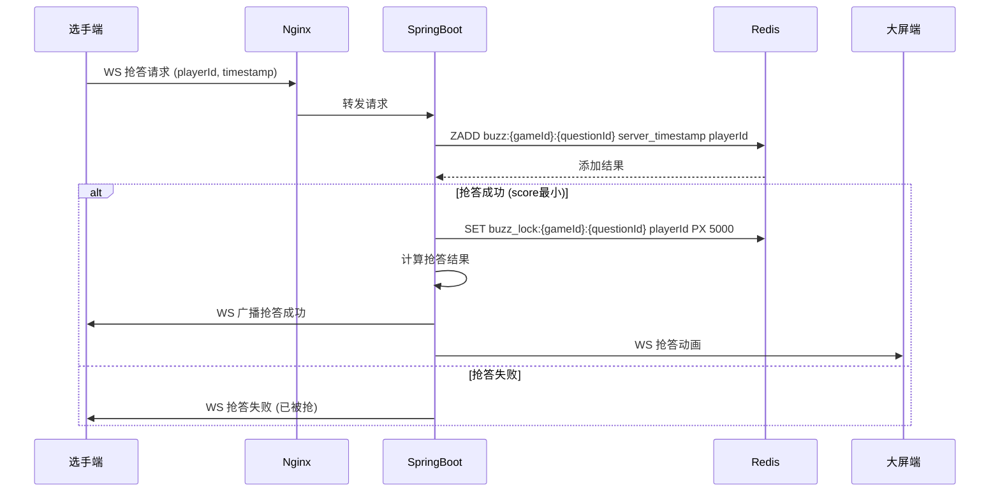

# 现场竞赛系统开发文档

```plain
Front-end UI Style Guide (V1.0) based on the high-performance quiz system requirements.

🎨 1. Color Palette (色彩规范)
Layer	Color Code	Usage
Primary (主色)	#18A058	Key actions (Buzz button, Start, Confirm), success states.
Background (背景)	#0C0C0C	Deep dark mode background for high contrast.
Surface (表面)	#1E1E1E	Cards, input fields, and UI containers.
Border (边框)	#333333	Subtle separators and card outlines.
Warning (警告)	#F0A020	Risk questions, countdown warnings (amber).
Error (错误)	#D03050	Failed buzz, penalty points, stop buttons.
Text Primary (正文)	#FFFFFF	Titles, question text, important data.
Text Secondary (次要)	#A0A0A0	Metadata, timestamps, latency info.
🖋️ 2. Typography (字体规范)
Font Family: Source Han Sans CN, PingFang SC, Microsoft YaHei, sans-serif.
Note: Use the Open Source "Source Han Sans" (思源黑体) for the no-copyright requirement.
Headings (L): 32px - 48px, Bold (For Big Screen titles and Quiz questions).
Body (M): 16px - 18px, Regular (For contestant options and dashboard info).
Metadata (S): 12px - 14px, Medium (For latency, rank, and small labels).
Numerical Data: Digital-7 (Optional for countdowns) or Source Han Sans Bold for scores.
📐 3. Layout & Geometry (布局与圆角)
Border Radius (圆角):
Cards & Containers: 12px
Primary Buttons: 8px
Buzz Button (Mobile): 50% (Circular)
Spacing (间距):
Standard Padding: 16px or 24px.
Element Gap: 12px (e.g., between cards in a list).
Shadows: Subtle inner glows for the primary green buttons: 0 0 15px rgba(24, 160, 88, 0.4).
⚡ 4. Components Logic (组件逻辑)
Buzz Button: State: Default (Inactive Grey) -> Active (Pulsing #18A058) -> Pressed (Scaling 0.95x).
Grid System: Dashboard uses a 12-column grid; Mobile uses a single-column flex layout.
Animations: All state transitions (showing results, changing ranks) should use a 0.3s ease-in-out curve.
```

````plain
# 🏆 现场知识竞赛抢答系统 - 第一阶段开发文档

> **版本**：V1.0.1  
> **最后更新**：2026年1月10日  
> **保密级别**：内部技术文档  
> **适用对象**：后端开发工程师、前端开发工程师、系统架构师

---

## 🎯 一、系统总体设计说明

### 1.1 项目目标（第一阶段聚焦）
**核心目标**：构建一个高可靠、低延迟（<50ms）、支持200+并发选手的抢答核心引擎，为后续扩展奠定坚实基础。

**关键指标**：
- ⚡ **抢答延迟**：≤ 50ms（从选手点击到服务端判断结果）
- 📶 **WebSocket 延迟**：≤ 20ms（服务端到各终端的广播）
- 🔒 **抢答公平性**：100% 服务端时间戳判定，杜绝客户端时间作弊
- 🔄 **断线重连**：3秒内自动恢复，不丢失比赛状态
- 📊 **状态一致性**：所有终端看到完全一致的比赛状态

### 1.2 设计原则
1. **核心引擎优先**：先构建比赛状态机和实时通信骨架，再开发UI
2. **服务端权威**：所有关键判断（抢答、计时、计分）必须在服务端完成
3. **轻量内存优先**：比赛过程数据优先存Redis，持久化异步处理
4. **协议精简**：WebSocket消息格式极致优化，减少网络开销
5. **可测试性**：核心逻辑100%单元测试覆盖，支持压测验证

### 1.3 第一阶段范围（MVP）
| 模块 | 包含功能 | 排除功能 |
|------|----------|----------|
| **比赛核心引擎** | • 完整状态机<br>• 抢答判定<br>• 倒计时同步<br>• 分数计算<br>• 排名更新 | • 题库管理<br>• 选手管理<br>• 复杂计分规则 |
| **WebSocket通信** | • 状态同步<br>• 题目推送<br>• 抢答结果<br>• 分数更新 | • 聊天功能<br>• 通知系统<br>• 音频传输 |
| **控制端** | • 开始/暂停比赛<br>• 下一题<br>• 开始抢答<br>• 修正分数 | • 题库编辑<br>• 选手管理<br>• 报表导出 |
| **大屏端** | • 题目展示<br>• 倒计时<br>• 抢答结果<br>• 实时排名 | • 动画特效<br>• 多屏适配<br>• 背景定制 |
| **选手端(H5)** | • 显示题目<br>• 抢答按钮<br>• 答题提交<br>• 状态反馈 | • 个人资料<br>• 历史记录<br>• 复杂交互 |

---

## 🏗️ 二、架构设计

### 2.1 整体架构图
```mermaid
graph TD
    A[选手端 H5] -->|WebSocket| B(WebSocket 网关)
    C[控制端 Web] -->|WebSocket + REST| B
    D[大屏端 Web] -->|WebSocket| B
    E[软件设置端] -->|REST API| B
    
    B --> F[Spring Boot 核心引擎]
    F --> G[Redis ]
    F --> H[MySQL]
    
    G -->|抢答判定| I[Redis SETNX + ZSET]
    G -->|状态缓存| J[Hash + String]
    G -->|倒计时| K[Redis Keyspace]
    
    H -->|持久化| L[比赛记录]
    H -->|配置| M[用户/角色数据]
````

### 2.2 技术栈明细（第一阶段）

| 层级 | 技术栈 | 版本 | 说明 |
|------|--------|------|------|
| **后端** | Java | 21  | 基础运行环境 |
|  | Spring Boot | 3.2.0 | 核心框架 |
|  | Spring WebSocket | 6.1.0 | WebSocket支持 |
|  | Sa-Token | 1.38.0 | 轻量级鉴权 |
|  | MyBatis-Plus | 3.5.6 | ORM框架 |
|  | Redisson | 3.24.0 | Redis客户端 |
| **缓存/消息** | Redis | 7.2 | 抢答锁、状态缓存 |
| **前端** | Vue 3 | 3.4.0 | 核心框架 |
|  | Vite | 5.0.10 | 构建工具 |
|  | Pinia | 2.1.7 | 状态管理 |
|  | Naive UI | 2.34.3 | UI组件库 |
图标:vicons/ionicons5
样式:Css Modules/scss主题色:#18A058-统一变量
|  | Socket.IO Client | 4.7.2 | WebSocket客户端 |
| **移动端** | uni-app | 3.8.0 | H5跨平台框架 |
| **部署** | Nginx | 1.24 | 静态资源 + WS代理 |
|  | Docker | 24.0 | 容器化部署 |

### 2.3 网络拓扑（局域网）

```mermaid
graph LR
    A[内网服务器] -->|有线| B[控制端 PC]
    A -->|WiFi| C[选手端 平板/手机]
    A -->|HDMI| D[大屏 LED/投影]
    A -->|有线| E[设置端 PC]
    
    subgraph 服务器内部
        A1[Spring Boot 8080]
        A2[Nginx 80/443]
        A3[Redis 6379]
        A4[MySQL 3306]
        
        A2 --> A1
        A1 --> A3
        A1 --> A4
    end
```

**关键配置**：

* **网络要求**：千兆局域网，WiFi 5GHz频段（选手端）
* **延迟保障**：内网部署，避免公网抖动
* **带宽要求**：100Mbps+（支持200+ WebSocket连接）
* **DNS配置**：内网DNS解析 `quiz.local` → 服务器IP

***

## 🧩 三、功能模块详细拆解（第一阶段）

### 3.1 比赛核心状态机（后端核心）

#### 状态定义

```java
/**
 * 比赛状态机 - 第一阶段
 * 
 * 状态流转:
 * INIT → PREPARE → SHOW_QUESTION → [ANSWERING | BUZZING] → JUDGING → SHOW_ANSWER → SHOW_RANK → (循环) → FINISHED
 * 
 * 关键约束:
 * 1. 只能按顺序流转，不可跳跃
 * 2. 只有控制端能触发状态变更
 * 3. 每个状态有超时自动流转
 */
public enum GameState {
    /**
     * 初始化状态 - 比赛未开始
     * 可操作: 开始比赛
     * 超时: 无
     */
    INIT,
    
    /**
     * 准备状态 - 等待主持人开始
     * 可操作: 开始第一题
     * 超时: 5分钟自动结束
     */
    PREPARE,
    
    /**
     * 题目展示 - 向所有终端推送题目
     * 可操作: 开始答题/开始抢答
     * 超时: 根据题目配置(10-60秒)
     */
    SHOW_QUESTION,
    
    /**
     * 答题中 - 普通题目模式
     * 可操作: 强制结束答题
     * 超时: 自动提交
     */
    ANSWERING,
    
    /**
     * 抢答中 - 抢答模式
     * 可操作: 无(自动判定)
     * 超时: 5秒无抢答自动结束
     */
    BUZZING,
    
    /**
     * 判分中 - 服务器计算分数
     * 可操作: 修正分数
     * 超时: 2秒自动流转
     */
    JUDGING,
    
    /**
     * 公布答案 - 展示正确答案
     * 可操作: 下一题
     * 超时: 10秒自动下一题
     */
    SHOW_ANSWER,
    
    /**
     * 显示排名 - 中场/结束排名
     * 可操作: 继续比赛/结束比赛
     * 超时: 30秒自动继续
     */
    SHOW_RANK,
    
    /**
     * 比赛结束
     * 可操作: 无
     * 超时: 无
     */
    FINISHED
}
```

#### 状态机核心逻辑

```java
@Component
@RequiredArgsConstructor
public class GameStateMachine {
    
    private final RedissonClient redisson;
    private final GameStatePublisher publisher;
    
    // Redis key 模板
    private static final String GAME_STATE_KEY = "game:state:%s"; // %s = gameId
    private static final String GAME_TIMER_KEY = "game:timer:%s";
    
    /**
     * 状态流转 - 严格校验
     */
    public boolean transition(String gameId, GameState newState, String operator) {
        String stateKey = String.format(GAME_STATE_KEY, gameId);
        RLock lock = redisson.getLock("lock:game:" + gameId);
        
        try {
            // 1. 获取分布式锁 (3秒超时)
            boolean locked = lock.tryLock(3, 10, TimeUnit.SECONDS);
            if (!locked) {
                throw new GameException("状态变更冲突，请重试");
            }
            
            // 2. 获取当前状态
            GameState currentState = getCurrentState(gameId);
            
            // 3. 验证状态流转合法性
            if (!isValidTransition(currentState, newState)) {
                throw new GameException(String.format(
                    "非法状态流转: %s → %s", 
                    currentState.name(), 
                    newState.name()
                ));
            }
            
            // 4. 更新状态
            RBucket<GameState> stateBucket = redisson.getBucket(stateKey);
            stateBucket.set(newState, 24, TimeUnit.HOURS); // 24小时过期
            
            // 5. 记录操作日志
            gameLogService.logStateChange(gameId, currentState, newState, operator);
            
            // 6. 发布状态变更事件
            publisher.publishStateChange(gameId, newState, System.currentTimeMillis());
            
            // 7. 启动状态超时任务 (如果需要)
            scheduleStateTimeout(gameId, newState);
            
            return true;
        } catch (InterruptedException e) {
            Thread.currentThread().interrupt();
            throw new GameException("状态变更被中断");
        } finally {
            lock.unlock();
        }
    }
    
    /**
     * 验证状态流转合法性
     */
    private boolean isValidTransition(GameState current, GameState next) {
        Map<GameState, Set<GameState>> validTransitions = Map.of(
            GameState.INIT, Set.of(GameState.PREPARE),
            GameState.PREPARE, Set.of(GameState.SHOW_QUESTION, GameState.FINISHED),
            GameState.SHOW_QUESTION, Set.of(GameState.ANSWERING, GameState.BUZZING),
            GameState.ANSWERING, Set.of(GameState.JUDGING),
            GameState.BUZZING, Set.of(GameState.JUDGING),
            GameState.JUDGING, Set.of(GameState.SHOW_ANSWER),
            GameState.SHOW_ANSWER, Set.of(GameState.SHOW_RANK, GameState.SHOW_QUESTION),
            GameState.SHOW_RANK, Set.of(GameState.SHOW_QUESTION, GameState.FINISHED),
            GameState.FINISHED, Set.of()
        );
        
        return validTransitions.getOrDefault(current, Set.of()).contains(next);
    }
    
    /**
     * 启动状态超时任务
     */
    private void scheduleStateTimeout(String gameId, GameState state) {
        // 取消之前的定时任务
        cancelPreviousTimer(gameId);
        
        // 根据状态设置超时时间
        Integer timeoutSeconds = getTimeoutForState(state);
        if (timeoutSeconds == null) return;
        
        // 使用Redis Keyspace通知
        String timerKey = String.format(GAME_TIMER_KEY, gameId);
        RBucket<Long> timerBucket = redisson.getBucket(timerKey);
        timerBucket.set(System.currentTimeMillis() + timeoutSeconds * 1000L);
        
        // 订阅超时事件
        redisson.getKeys().addListener(timerKey, (type, key) -> {
            if ("expired".equals(type) && key.equals(timerKey)) {
                handleStateTimeout(gameId, state);
            }
        });
    }
}
```

### 3.2 抢答核心模块（高并发重点）

#### 架构设计



#### Redis数据结构设计

| Key | 类型 | 说明 | TTL |
|-----|------|------|-----|
| `buzz:{gameId}:{questionId}` | Sorted Set | 抢答记录，score=时间戳 | 24小时 |
| <code>buzz_lock:{gameId}:{questionId}</code> | String | 抢答锁，value=playerId | 5秒 |
| <code>buzz_result:{gameId}:{questionId}</code> | Hash | 抢答结果缓存 | 24小时 |
| `player:buzz:count:{playerId}` | String | 选手抢答次数 | 永久 |

#### 核心代码实现

```java
@Service
@RequiredArgsConstructor
@Slf4j
public class BuzzService {
    
    private final RedissonClient redisson;
    private final WebSocketService webSocketService;
    
    // Redis key 模板
    private static final String BUZZ_ZSET_KEY = "buzz:%s:%s"; // gameId, questionId
    private static final String BUZZ_LOCK_KEY = "buzz_lock:%s:%s";
    private static final String BUZZ_RESULT_KEY = "buzz_result:%s:%s";
    private static final String PLAYER_BUZZ_COUNT_KEY = "player:buzz:count:%s";
    
    /**
     * 选手抢答 - 高并发核心方法
     * 
     * @param gameId 比赛ID
     * @param questionId 题目ID
     * @param playerId 选手ID
     * @param clientTimestamp 客户端时间戳(仅用于日志)
     * @return 抢答结果
     */
    public BuzzResult buzz(String gameId, String questionId, String playerId, long clientTimestamp) {
        // 1. 生成服务端唯一时间戳 (精确到毫秒)
        long serverTimestamp = System.currentTimeMillis();
        String zsetKey = String.format(BUZZ_ZSET_KEY, gameId, questionId);
        String lockKey = String.format(BUZZ_LOCK_KEY, gameId, questionId);
        
        // 2. 尝试获取抢答锁 (Redis SETNX)
        RLock lock = redisson.getLock(lockKey);
        try {
            // 尝试加锁 (100ms超时，防止死锁)
            boolean locked = lock.tryLock(100, 5000, TimeUnit.MILLISECONDS);
            if (!locked) {
                // 锁已被占用，说明已有人抢答成功
                return BuzzResult.builder()
                    .success(false)
                    .reason("抢答已结束")
                    .build();
            }
            
            // 3. 检查是否已有人抢答 (双重校验)
            RScoredSortedSet<String> buzzSet = redisson.getScoredSortedSet(zsetKey);
            if (!buzzSet.isEmpty()) {
                // 已有抢答记录，返回失败
                return BuzzResult.builder()
                    .success(false)
                    .reason("抢答已结束")
                    .firstPlayer(buzzSet.first())
                    .build();
            }
            
            // 4. 记录抢答 - ZADD with NX (仅当不存在时添加)
            boolean added = buzzSet.add(serverTimestamp, playerId);
            if (!added) {
                return BuzzResult.builder()
                    .success(false)
                    .reason("重复抢答")
                    .build();
            }
            
            // 5. 获取抢答排名 (前3名)
            List<String> topPlayers = buzzSet.valueRange(0, 2); // 取前3名
            
            // 6. 构建抢答结果
            BuzzResult result = BuzzResult.builder()
                .success(true)
                .playerId(playerId)
                .serverTimestamp(serverTimestamp)
                .clientTimestamp(clientTimestamp)
                .rank(1) // 第一个抢答的一定是第1名
                .topPlayers(topPlayers)
                .build();
            
            // 7. 缓存抢答结果
            String resultKey = String.format(BUZZ_RESULT_KEY, gameId, questionId);
            RBucket<BuzzResult> resultBucket = redisson.getBucket(resultKey);
            resultBucket.set(result, 24, TimeUnit.HOURS);
            
            // 8. 记录选手抢答次数
            incrementPlayerBuzzCount(playerId);
            
            // 9. 异步广播结果
            broadcastBuzzResult(gameId, questionId, result);
            
            log.info("抢答成功 gameId={}, questionId={}, playerId={}, timestamp={}", 
                gameId, questionId, playerId, serverTimestamp);
            
            return result;
            
        } catch (InterruptedException e) {
            Thread.currentThread().interrupt();
            throw new GameException("抢答中断");
        } finally {
            lock.unlock();
        }
    }
    
    /**
     * 增加选手抢答次数
     */
    private void incrementPlayerBuzzCount(String playerId) {
        String key = String.format(PLAYER_BUZZ_COUNT_KEY, playerId);
        RAtomicLong counter = redisson.getAtomicLong(key);
        counter.incrementAndGet(); // 原子自增
    }
    
    /**
     * 广播抢答结果
     */
    private void broadcastBuzzResult(String gameId, String questionId, BuzzResult result) {
        // 1. 构建广播消息
        BuzzResultEvent event = new BuzzResultEvent();
        event.setGameId(gameId);
        event.setQuestionId(questionId);
        event.setResult(result);
        event.setTimestamp(System.currentTimeMillis());
        
        // 2. 广播到所有相关频道
        webSocketService.broadcastToGame(gameId, "buzz_result", event);
        webSocketService.broadcastToQuestion(gameId, questionId, "buzz_result", event);
    }
    
    /**
     * 获取抢答结果 (缓存优先)
     */
    public BuzzResult getBuzzResult(String gameId, String questionId) {
        String resultKey = String.format(BUZZ_RESULT_KEY, gameId, questionId);
        RBucket<BuzzResult> resultBucket = redisson.getBucket(resultKey);
        return resultBucket.get();
    }
    
    /**
     * 获取选手抢答排名
     */
    public Integer getPlayerBuzzRank(String gameId, String questionId, String playerId) {
        String zsetKey = String.format(BUZZ_ZSET_KEY, gameId, questionId);
        RScoredSortedSet<String> buzzSet = redisson.getScoredSortedSet(zsetKey);
        
        // 获取选手排名 (1-based index)
        Integer rank = buzzSet.revRank(playerId);
        return rank != null ? rank + 1 : null; // 转换为1-based
    }
    
    /**
     * 清理抢答数据 (下一题时调用)
     */
    @Transactional
    public void cleanupBuzzData(String gameId, String questionId) {
        String zsetKey = String.format(BUZZ_ZSET_KEY, gameId, questionId);
        String lockKey = String.format(BUZZ_LOCK_KEY, gameId, questionId);
        String resultKey = String.format(BUZZ_RESULT_KEY, gameId, questionId);
        
        // 使用Redis pipeline批量删除
        redisson.getKeys().delete(zsetKey, lockKey, resultKey);
        
        log.info("清理抢答数据 gameId={}, questionId={}", gameId, questionId);
    }
}
```

### 3.3 WebSocket通信设计

#### 协议设计原则

1. **二进制协议**：使用Protobuf压缩消息，减少50%+带宽
2. **心跳机制**：30秒心跳，90秒超时断开
3. **消息确认**：关键操作需ACK确认
4. **QoS分级**：
   * QoS0：普通消息（状态更新）
   * QoS1：重要消息（抢答结果）
   * QoS2：关键消息（分数变更）

#### 消息格式

```protobuf
// game.proto
syntax = "proto3";

message GameStateEvent {
  string game_id = 1;
  string state = 2; // GameState enum
  int64 timestamp = 3;
  map<string, string> metadata = 4;
}

message BuzzResultEvent {
  string game_id = 1;
  string question_id = 2;
  BuzzResult result = 3;
  int64 timestamp = 4;
}

message BuzzResult {
  bool success = 1;
  string player_id = 2;
  int64 server_timestamp = 3;
  int64 client_timestamp = 4;
  int32 rank = 5;
  repeated string top_players = 6;
  string reason = 7;
}

message ScoreUpdateEvent {
  string game_id = 1;
  map<string, int32> player_scores = 2; // playerId -> score
  map<string, int32> team_scores = 3;   // teamId -> score
  int64 timestamp = 4;
}
```

#### 服务端实现

```java
@Component
@ServerEndpoint(value = "/ws/game/{gameId}", configurator = SpringConfigurator.class)
@Slf4j
public class GameWebSocket {
    
    private final WebSocketSessionManager sessionManager;
    private final ProtobufMessageConverter converter;
    
    @OnOpen
    public void onOpen(Session session, @PathParam("gameId") String gameId) {
        String playerId = extractPlayerId(session);
        String sessionId = session.getId();
        
        // 1. 验证token
        if (!validateToken(session)) {
            session.close(new CloseReason(CloseReason.CloseCodes.VIOLATED_POLICY, "无效token"));
            return;
        }
        
        // 2. 注册会话
        sessionManager.registerSession(gameId, playerId, sessionId, session);
        
        // 3. 发送初始状态
        sendInitialState(session, gameId);
        
        log.info("WebSocket连接建立 gameId={}, playerId={}, sessionId={}", gameId, playerId, sessionId);
    }
    
    @OnMessage
    public void onMessage(Session session, byte[] data) {
        try {
            // 1. 解析Protobuf消息
            BaseMessage message = converter.parse(data);
            
            // 2. 路由到对应处理器
            switch (message.getType()) {
                case "buzz":
                    handleBuzzMessage(session, message.getBuzzRequest());
                    break;
                case "answer":
                    handleAnswerMessage(session, message.getAnswerRequest());
                    break;
                case "heartbeat":
                    handleHeartbeat(session);
                    break;
                default:
                    log.warn("未知消息类型: {}", message.getType());
            }
        } catch (Exception e) {
            log.error("处理消息失败", e);
            sendError(session, "消息处理失败: " + e.getMessage());
        }
    }
    
    @OnClose
    public void onClose(Session session, CloseReason reason) {
        String sessionId = session.getId();
        sessionManager.unregisterSession(sessionId);
        
        log.info("WebSocket连接关闭 sessionId={}, reason={}", sessionId, reason.getReasonPhrase());
    }
    
    @OnError
    public void onError(Session session, Throwable throwable) {
        log.error("WebSocket错误 sessionId={}", session.getId(), throwable);
        sendError(session, "内部错误: " + throwable.getMessage());
    }
    
    /**
     * 处理抢答消息
     */
    private void handleBuzzMessage(Session session, BuzzRequest request) {
        String gameId = extractGameId(session);
        String playerId = extractPlayerId(session);
        
        try {
            // 1. 限流检查 (每秒1次)
            if (!rateLimiter.allowRequest(playerId, "buzz")) {
                sendError(session, "操作过于频繁");
                return;
            }
            
            // 2. 调用抢答服务
            BuzzResult result = buzzService.buzz(
                gameId, 
                request.getQuestionId(), 
                playerId, 
                request.getClientTimestamp()
            );
            
            // 3. 构建响应
            BaseMessage response = BaseMessage.newBuilder()
                .setType("buzz_response")
                .setBuzzResponse(BuzzResponse.newBuilder()
                    .setSuccess(result.isSuccess())
                    .setReason(result.getReason())
                    .setRank(result.getRank())
                    .build())
                .build();
            
            // 4. 发送响应
            session.getAsyncRemote().sendBinary(
                ByteBuffer.wrap(converter.serialize(response))
            );
            
        } catch (Exception e) {
            log.error("抢答处理失败 gameId={}, playerId={}", gameId, playerId, e);
            sendError(session, "抢答失败: " + e.getMessage());
        }
    }
    
    /**
     * 广播消息到游戏
     */
    public void broadcastToGame(String gameId, String type, MessageLite content) {
        Set<String> sessionIds = sessionManager.getGameSessions(gameId);
        
        BaseMessage message = BaseMessage.newBuilder()
            .setType(type)
            .setContent(content.toByteString())
            .build();
        
        byte[] data = converter.serialize(message);
        
        for (String sessionId : sessionIds) {
            Session session = sessionManager.getSession(sessionId);
            if (session != null && session.isOpen()) {
                try {
                    session.getAsyncRemote().sendBinary(ByteBuffer.wrap(data));
                } catch (Exception e) {
                    log.warn("广播失败 sessionId={}", sessionId, e);
                }
            }
        }
    }
}
```

### 3.4 控制端核心功能（主持人操作）

#### 功能清单

| 功能 | 说明 | 权限 |
|------|------|------|
| **开始比赛** | 从INIT→PREPARE→SHOW\_QUESTION | 主持人 |
| **下一题** | 从SHOW\_ANSWER→SHOW\_QUESTION | 主持人 |
| **开始抢答** | 从SHOW\_QUESTION→BUZZING | 主持人 |
| **强制结束** | 提前结束答题/抢答 | 主持人 |
| **修正分数** | 手动调整选手分数 | 主持人+评委 |
| **暂停比赛** | 临时暂停比赛 | 主持人 |

#### 核心API设计

```java
@RestController
@RequestMapping("/api/games/{gameId}/control")
@RequiredArgsConstructor
public class GameController {
    
    private final GameStateMachine stateMachine;
    private final ScoreService scoreService;
    private final QuestionService questionService;
    
    /**
     * 开始比赛
     */
    @PostMapping("/start")
    @SaCheckRole("HOST")
    public Result<Void> startGame(@PathVariable String gameId, @CurrentUser User user) {
        stateMachine.transition(gameId, GameState.PREPARE, user.getId());
        stateMachine.transition(gameId, GameState.SHOW_QUESTION, user.getId());
        return Result.success();
    }
    
    /**
     * 下一题
     */
    @PostMapping("/next-question")
    @SaCheckRole("HOST")
    public Result<QuestionDTO> nextQuestion(@PathVariable String gameId, @CurrentUser User user) {
        // 1. 状态校验
        GameState currentState = stateMachine.getCurrentState(gameId);
        if (currentState != GameState.SHOW_ANSWER && currentState != GameState.SHOW_RANK) {
            throw new GameException("当前状态不能切换到下一题");
        }
        
        // 2. 获取下一题
        Question question = questionService.getNextQuestion(gameId);
        if (question == null) {
            // 无更多题目，进入最终排名
            stateMachine.transition(gameId, GameState.SHOW_RANK, user.getId());
            return Result.success(null);
        }
        
        // 3. 状态流转
        stateMachine.transition(gameId, GameState.SHOW_QUESTION, user.getId());
        
        // 4. 推送题目
        questionService.pushQuestion(gameId, question);
        
        return Result.success(convertToDTO(question));
    }
    
    /**
     * 开始抢答
     */
    @PostMapping("/start-buzz")
    @SaCheckRole("HOST")
    public Result<Void> startBuzz(@PathVariable String gameId, @CurrentUser User user) {
        GameState currentState = stateMachine.getCurrentState(gameId);
        if (currentState != GameState.SHOW_QUESTION) {
            throw new GameException("当前状态不能开始抢答");
        }
        
        // 1. 状态流转
        stateMachine.transition(gameId, GameState.BUZZING, user.getId());
        
        // 2. 广播开始抢答
        buzzService.broadcastStartBuzz(gameId, getCurrentQuestionId(gameId));
        
        return Result.success();
    }
    
    /**
     * 修正分数
     */
    @PostMapping("/adjust-score")
    @SaCheckRole({"HOST", "JUDGE"})
    public Result<ScoreUpdateDTO> adjustScore(
            @PathVariable String gameId,
            @RequestBody @Valid ScoreAdjustRequest request,
            @CurrentUser User user) {
        
        // 1. 业务校验
        if (request.getAdjustment() == 0) {
            throw new GameException("调整分数不能为0");
        }
        
        // 2. 调整分数
        ScoreUpdate update = scoreService.adjustScore(
            gameId,
            request.getPlayerId(),
            request.getAdjustment(),
            user.getId(),
            request.getReason()
        );
        
        return Result.success(convertToUpdateDTO(update));
    }
}
```

### 3.5 大屏端展示模块

#### 页面结构

```vue
<template>
  <div class="big-screen-container" :class="{ 'fullscreen': isFullscreen }">
    <!-- 活动封面页 -->
    <CoverPage v-if="currentState === 'INIT'" :game="game" />
    
    <!-- 题目展示页 -->
    <QuestionPage 
      v-else-if="['SHOW_QUESTION', 'ANSWERING', 'BUZZING'].includes(currentState)"
      :question="currentQuestion"
      :countdown="countdown"
      :buzzing="currentState === 'BUZZING'"
    />
    
    <!-- 抢答结果页 -->
    <BuzzResultPage 
      v-else-if="currentState === 'JUDGING' && buzzResult"
      :buzz-result="buzzResult"
      :question="currentQuestion"
    />
    
    <!-- 答案公布页 -->
    <AnswerPage 
      v-else-if="currentState === 'SHOW_ANSWER'"
      :question="currentQuestion"
      :player-answers="playerAnswers"
    />
    
    <!-- 排名展示页 -->
    <RankingPage 
      v-else-if="['SHOW_RANK', 'FINISHED'].includes(currentState)"
      :ranks="currentRanks"
      :is-final="currentState === 'FINISHED'"
    />
  </div>
</template>

<script setup lang="ts">
import { ref, computed, onMounted, onUnmounted } from 'vue';
import { useWebSocket } from '@vueuse/core';
import { GameState, Question, BuzzResult, RankItem } from '@/types/game';

const props = defineProps({
  gameId: {
    type: String,
    required: true
  }
});

// 状态管理
const currentState = ref<GameState>('INIT');
const currentQuestion = ref<Question | null>(null);
const countdown = ref<number>(0);
const buzzResult = ref<BuzzResult | null>(null);
const playerAnswers = ref<Record<string, any>>({});
const currentRanks = ref<RankItem[]>([]);

// WebSocket连接
const { data, send, status } = useWebSocket(
  `${import.meta.env.VITE_WS_URL}/ws/game/${props.gameId}`,
  {
    heartbeat: {
      message: JSON.stringify({ type: 'heartbeat' }),
      interval: 30000,
      pongTimeout: 90000
    },
    autoReconnect: {
      retries: 10,
      delay: 1000
    },
    onMessage: handleMessage
  }
);

// 处理WebSocket消息
function handleMessage(event: MessageEvent) {
  try {
    const message = JSON.parse(event.data);
    
    switch (message.type) {
      case 'game_state_change':
        handleStateChange(message.data);
        break;
      case 'question_push':
        handleQuestionPush(message.data);
        break;
      case 'countdown_update':
        countdown.value = message.data.remaining;
        break;
      case 'buzz_result':
        handleBuzzResult(message.data);
        break;
      case 'answer_result':
        handleAnswerResult(message.data);
        break;
      case 'rank_update':
        currentRanks.value = message.data.ranks;
        break;
      case 'error':
        console.error('WebSocket错误:', message.data);
        break;
    }
  } catch (e) {
    console.error('消息解析失败:', e);
  }
}

// 状态变更处理
function handleStateChange(stateData: any) {
  currentState.value = stateData.state;
  
  // 重置相关数据
  if (['SHOW_QUESTION', 'ANSWERING', 'BUZZING'].includes(stateData.state)) {
    buzzResult.value = null;
    playerAnswers.value = {};
  }
}

// 题目推送处理
function handleQuestionPush(questionData: any) {
  currentQuestion.value = {
    id: questionData.id,
    type: questionData.type,
    title: questionData.title,
    options: questionData.options,
    mediaType: questionData.mediaType,
    mediaUrl: questionData.mediaUrl,
    timeLimit: questionData.timeLimit
  };
  
  // 重置倒计时
  countdown.value = questionData.timeLimit || 30;
}

// 抢答结果处理
function handleBuzzResult(resultData: any) {
  buzzResult.value = {
    success: resultData.success,
    firstPlayer: resultData.firstPlayer,
    topPlayers: resultData.topPlayers,
    timestamp: resultData.timestamp
  };
}

// 全屏控制
const isFullscreen = ref(false);

function toggleFullscreen() {
  if (!document.fullscreenElement) {
    document.documentElement.requestFullscreen();
    isFullscreen.value = true;
  } else {
    document.exitFullscreen();
    isFullscreen.value = false;
  }
}

// 监听全屏变化
function handleFullscreenChange() {
  isFullscreen.value = !!document.fullscreenElement;
}

onMounted(() => {
  document.addEventListener('fullscreenchange', handleFullscreenChange);
  
  // 初始化连接
  send(JSON.stringify({
    type: 'join_game',
    gameId: props.gameId,
    token: localStorage.getItem('token')
  }));
});

onUnmounted(() => {
  document.removeEventListener('fullscreenchange', handleFullscreenChange);
});
</script>

<style scoped lang="scss">
.big-screen-container {
  width: 100vw;
  height: 100vh;
  background: linear-gradient(135deg, #1a2a6c, #2c3e50);
  color: white;
  overflow: hidden;
  position: relative;
  
  &.fullscreen {
    width: 100%;
    height: 100%;
  }
  
  /* 响应式设计 */
  @media (max-width: 1200px) {
    font-size: 0.9rem;
  }
  
  @media (max-width: 768px) {
    font-size: 0.8rem;
  }
}
</style>
```

### 3.6 选手端H5实现（uni-app）

#### 核心页面

```vue
<template>
  <view class="player-container">
    <!-- 题目展示区 -->
    <view v-if="currentQuestion" class="question-area">
      <view class="question-title">{{ currentQuestion.title }}</view>
      
      <!-- 图片题目 -->
      <image 
        v-if="currentQuestion.mediaType === 'image'" 
        :src="currentQuestion.mediaUrl" 
        mode="aspectFit"
        class="media-image"
      />
      
      <!-- 视频题目 -->
      <video 
        v-if="currentQuestion.mediaType === 'video'" 
        :src="currentQuestion.mediaUrl" 
        controls
        class="media-video"
      />
      
      <!-- 音频题目 -->
      <audio 
        v-if="currentQuestion.mediaType === 'audio'" 
        :src="currentQuestion.mediaUrl" 
        controls
        class="media-audio"
      />
      
      <!-- 选项区 -->
      <view class="options-area" v-if="['single', 'multiple', 'judgment'].includes(currentQuestion.type)">
        <view 
          v-for="(option, index) in currentQuestion.options" 
          :key="index"
          class="option-item"
          :class="{ 
            'selected': selectedOptions.includes(index),
            'buzzing': isBuzzing && currentQuestion.type === 'buzz'
          }"
          @click="handleOptionClick(index)"
        >
          {{ String.fromCharCode(65 + index) }}. {{ option }}
        </view>
      </view>
    </view>
    
    <!-- 抢答按钮区 -->
    <view class="buzz-area" v-if="isBuzzing">
      <button 
        class="buzz-button" 
        :class="{ 'buzzing': isButtonBuzzing }"
        @touchstart="startBuzzHold"
        @touchend="endBuzzHold"
        :disabled="hasBuzzed"
      >
        {{ hasBuzzed ? '已抢答' : '抢答' }}
      </button>
      <view class="buzz-timer">{{ buzzHoldTime }}s</view>
    </view>
    
    <!-- 提交按钮区 -->
    <view class="submit-area" v-if="!isBuzzing && currentQuestion && currentQuestion.type !== 'buzz'">
      <button class="submit-button" @click="submitAnswer" :disabled="!canSubmit">
        {{ isSubmitted ? '已提交' : '提交答案' }}
      </button>
    </view>
    
    <!-- 状态提示区 -->
    <view class="status-area">
      <view class="score-badge">分数: {{ currentPlayerScore }}</view>
      <view class="status-badge" :class="statusClass">{{ statusText }}</view>
    </view>
  </view>
</template>

<script setup>
import { ref, computed, onMounted, onUnmounted } from 'vue';
import { useWebSocket } from '@vueuse/core';

const props = defineProps({
  gameId: {
    type: String,
    required: true
  },
  playerId: {
    type: String,
    required: true
  }
});

// 状态管理
const currentQuestion = ref(null);
const selectedOptions = ref([]);
const isBuzzing = ref(false);
const hasBuzzed = ref(false);
const isButtonBuzzing = ref(false);
const buzzHoldTime = ref(0);
const buzzInterval = ref(null);
const isSubmitted = ref(false);
const countdown = ref(0);
const currentPlayerScore = ref(0);
const gameState = ref('INIT');

// WebSocket连接
const WS_URL = 'ws://quiz.local:8080/ws/game/';
const { send, status } = useWebSocket(WS_URL + props.gameId, {
  protocols: ['token'],
  autoReconnect: {
    retries: 10,
    delay: 1000
  },
  onConnected: () => {
    console.log('WebSocket连接成功');
    sendJoinMessage();
  },
  onMessage: handleMessage,
  onError: (error) => {
    console.error('WebSocket错误:', error);
  }
});

// 发送加入消息
function sendJoinMessage() {
  const token = uni.getStorageSync('token');
  send(JSON.stringify({
    type: 'join_game',
    gameId: props.gameId,
    playerId: props.playerId,
    token: token
  }));
}

// 处理消息
function handleMessage(event) {
  try {
    const message = JSON.parse(event.data);
    
    switch (message.type) {
      case 'game_state_change':
        gameState.value = message.data.state;
        break;
      case 'question_push':
        handleQuestionPush(message.data);
        break;
      case 'buzz_start':
        handleBuzzStart();
        break;
      case 'buzz_result':
        handleBuzzResult(message.data);
        break;
      case 'answer_result':
        handleAnswerResult(message.data);
        break;
      case 'score_update':
        currentPlayerScore.value = message.data.scores?.[props.playerId] || 0;
        break;
    }
  } catch (e) {
    console.error('消息处理错误:', e);
  }
}

// 防误触机制：需要长按1秒才触发抢答
function startBuzzHold() {
  if (hasBuzzed.value || !isBuzzing.value) return;
  
  buzzHoldTime.value = 0;
  isButtonBuzzing.value = true;
  
  buzzInterval.value = setInterval(() => {
    buzzHoldTime.value += 0.1;
    if (buzzHoldTime.value >= 1.0) {
      performBuzz();
      clearInterval(buzzInterval.value);
    }
  }, 100);
}

function endBuzzHold() {
  clearInterval(buzzInterval.value);
  isButtonBuzzing.value = false;
  
  if (buzzHoldTime.value < 1.0) {
    uni.showToast({
      title: '需要长按1秒以上',
      icon: 'none',
      duration: 1000
    });
  }
}

// 执行抢答
function performBuzz() {
  if (hasBuzzed.value || !isBuzzing.value) return;
  
  const clientTimestamp = Date.now();
  send(JSON.stringify({
    type: 'buzz',
    questionId: currentQuestion.value.id,
    playerId: props.playerId,
    clientTimestamp: clientTimestamp
  }));
  
  hasBuzzed.value = true;
  isButtonBuzzing.value = false;
  
  // 震动反馈 (支持的设备)
  if (typeof uni.vibrateShort === 'function') {
    uni.vibrateShort();
  }
}

// 提交答案
function submitAnswer() {
  if (isSubmitted.value || !currentQuestion.value) return;
  
  const answer = currentQuestion.value.type === 'judgment' 
    ? selectedOptions.value[0] === 0 // A=正确, B=错误
    : selectedOptions.value;
  
  send(JSON.stringify({
    type: 'answer',
    questionId: currentQuestion.value.id,
    answer: answer
  }));
  
  isSubmitted.value = true;
}

// 计算状态文本
const statusText = computed(() => {
  if (gameState.value === 'INIT') return '等待比赛开始';
  if (gameState.value === 'BUZZING') return '抢答中...';
  if (gameState.value === 'ANSWERING') return `答题中 ${countdown.value}s`;
  return gameState.value.replace('_', ' ');
});

const statusClass = computed(() => {
  if (gameState.value === 'BUZZING' || gameState.value === 'ANSWERING') {
    return 'status-active';
  }
  if (gameState.value === 'FINISHED') {
    return 'status-finished';
  }
  return 'status-normal';
});

// 清理
onUnmounted(() => {
  clearInterval(buzzInterval.value);
});
</script>

<style scoped>
.player-container {
  padding: 20rpx;
  min-height: 100vh;
  background: #f5f7fa;
}

.question-area {
  background: white;
  border-radius: 16rpx;
  padding: 30rpx;
  margin-bottom: 30rpx;
  box-shadow: 0 4rpx 12rpx rgba(0,0,0,0.1);
}

.question-title {
  font-size: 36rpx;
  font-weight: bold;
  margin-bottom: 20rpx;
  line-height: 1.5;
}

.media-image {
  width: 100%;
  height: 400rpx;
  border-radius: 12rpx;
  margin: 20rpx 0;
}

.media-video, .media-audio {
  width: 100%;
  margin: 20rpx 0;
}

.options-area {
  margin-top: 30rpx;
}

.option-item {
  padding: 24rpx;
  margin: 16rpx 0;
  background: #f8f9fa;
  border-radius: 12rpx;
  border: 2rpx solid #e9ecef;
  font-size: 32rpx;
  transition: all 0.3s;
}

.option-item.selected {
  background: #e6f7ff;
  border-color: #1890ff;
  font-weight: bold;
}

.option-item.buzzing {
  background: linear-gradient(135deg, #ff6b6b, #ee5a24);
  color: white;
  border: none;
}

.buzz-area, .submit-area {
  display: flex;
  flex-direction: column;
  align-items: center;
  margin: 30rpx 0;
}

.buzz-button, .submit-button {
  width: 90%;
  padding: 24rpx;
  font-size: 36rpx;
  font-weight: bold;
  border-radius: 50rpx;
  color: white;
  margin: 20rpx 0;
}

.buzz-button {
  background: linear-gradient(135deg, #ff6b6b, #ee5a24);
  box-shadow: 0 8rpx 20rpx rgba(255, 107, 107, 0.4);
}

.buzz-button.buzzing {
  animation: pulse 0.5s infinite;
}

.buzz-button:disabled {
  opacity: 0.7;
  background: #adb5bd;
}

.submit-button {
  background: linear-gradient(135deg, #18A058, #138546);
  box-shadow: 0 8rpx 20rpx rgba(24, 160, 88, 0.4);
}

.buzz-timer {
  font-size: 28rpx;
  color: #ff6b6b;
  font-weight: bold;
}

.status-area {
  display: flex;
  justify-content: space-between;
  padding: 20rpx;
  background: white;
  border-radius: 16rpx;
  margin-top: 20rpx;
  box-shadow: 0 4rpx 12rpx rgba(0,0,0,0.1);
}

.score-badge, .status-badge {
  padding: 8rpx 20rpx;
  border-radius: 20rpx;
  font-weight: bold;
}

.score-badge {
  background: linear-gradient(135deg, #18A058, #138546);
  color: white;
}

.status-badge {
  background: #e9ecef;
  color: #495057;
}

.status-badge.status-active {
  background: linear-gradient(135deg, #ff6b6b, #ee5a24);
  color: white;
}

.status-badge.status-finished {
  background: linear-gradient(135deg, #4c6ef5, #4338ca);
  color: white;
}

@keyframes pulse {
  0% { transform: scale(1); }
  50% { transform: scale(1.05); }
  100% { transform: scale(1); }
}
</style>
```

***

## 🔄 四、核心业务流程图（文字描述）

### 4.1 整体比赛流程

```
1. 初始化
   ↓
2. 主持人开始比赛
   ↓
3. 系统推送第一题
   ↓
4. 判断题目类型
     ├─ 普通题 → 进入答题倒计时
     │           ↓
     │           选手提交答案
     │           ↓
     │           自动判分
     │
     └─ 抢答题 → 主持人点击"开始抢答"
                ↓
                系统开启抢答锁
                ↓
                选手抢答
                ↓
                服务端判定首个到达者
                ↓
                广播抢答结果
                ↓
                进入答题或直接判分
   ↓
5. 公布答案与解析
   ↓
6. 更新分数与排名
   ↓
7. 判断是否中场排名
     ├─ 是 → 显示排名
     │        ↓
     │        主持人点击"继续"
     │
     └─ 否 → 直接进入下一题
   ↓
8. 判断是否有下一题
     ├─ 是 → 循环步骤3
     │
     └─ 否 → 显示最终排名
                ↓
                比赛结束
```

### 4.2 抢答判定流程（关键）

```
1. 主持人点击"开始抢答"
   ↓
2. 服务端：
   - 状态从SHOW_QUESTION→BUZZING
   - 生成唯一抢答ID: buzz:{gameId}:{questionId}
   - 设置5秒超时
   ↓
3. 选手端：
   - 抢答按钮高亮
   - 启用长按检测(1秒)
   ↓
4. 选手长按抢答按钮
   ↓
5. 客户端发送抢答请求:
   {type: 'buzz', questionId, playerId, clientTimestamp}
   ↓
6. 服务端处理:
   a. 验证token和权限
   b. 检查状态是否为BUZZING
   c. 生成服务端时间戳(serverTimestamp)
   d. 尝试获取Redis分布式锁
   e. 检查是否已有人抢答
   f. ZADD buzz_zset serverTimestamp playerId
   g. 判定排名(取score最小)
   ↓
7. 服务端响应:
   - 成功: {success: true, rank: 1, topPlayers: [...]}
   - 失败: {success: false, reason: '已被抢答', firstPlayer: 'player123'}
   ↓
8. 服务端广播结果到所有终端
   ↓
9. 状态自动流转:
   - 5秒无抢答 → 自动结束抢答
   - 有抢答成功 → 进入答题或判分
```

***

## 🗄️ 五、数据库设计

### 5.1 核心表结构

#### 游戏表 (game)

| 字段 | 类型 | 必填 | 默认值 | 说明 |
|------|------|------|--------|------|
| id | VARCHAR(36) | ✓ | - | 游戏ID (UUID) |
| name | VARCHAR(100) | ✓ | - | 比赛名称 |
| status | ENUM('DRAFT','RUNNING','PAUSED','FINISHED') | ✓ | 'DRAFT' | 比赛状态 |
| config | JSON | - | null | 比赛配置 |
| host\_id | VARCHAR(36) | ✓ | - | 主持人ID |
| created\_at | DATETIME | ✓ | NOW() | 创建时间 |
| updated\_at | DATETIME | ✓ | NOW() | 更新时间 |

#### 题目表 (question)

| 字段 | 类型 | 必填 | 默认值 | 说明 |
|------|------|------|--------|------|
| id | BIGINT | ✓ | - | 题目ID |
| type | ENUM('single','multiple','judgment','buzz','fill','essay') | ✓ | - | 题型 |
| title | VARCHAR(500) | ✓ | - | 题目标题 |
| content | TEXT | - | null | 题干内容 |
| options | JSON | - | null | 选项数组 |
| answer | JSON | - | null | 正确答案 |
| score | INT | ✓ | 10 | 分值 |
| media\_type | ENUM('none','image','audio','video') | ✓ | 'none' | 媒体类型 |
| media\_url | VARCHAR(500) | - | null | 媒体URL |
| difficulty | INT | - | 1 | 难度(1-5) |
| time\_limit | INT | - | 30 | 限时(秒) |
| created\_by | VARCHAR(36) | ✓ | - | 创建人 |

#### 选手表 (player)

| 字段 | 类型 | 必填 | 默认值 | 说明 |
|------|------|------|--------|------|
| id | VARCHAR(36) | ✓ | - | 选手ID |
| game\_id | VARCHAR(36) | ✓ | - | 游戏ID |
| name | VARCHAR(50) | ✓ | - | 选手姓名 |
| team\_id | VARCHAR(36) | - | null | 队伍ID |
| device\_id | VARCHAR(100) | - | null | 设备ID |
| status | ENUM('ACTIVE','BANNED','OFFLINE') | ✓ | 'ACTIVE' | 状态 |
| score | INT | ✓ | 0 | 当前分数 |
| created\_at | DATETIME | ✓ | NOW() | 创建时间 |

#### 抢答记录表 (buzz\_record)

| 字段 | 类型 | 必填 | 默认值 | 说明 |
|------|------|------|--------|------|
| id | BIGINT | ✓ | - | 记录ID |
| game\_id | VARCHAR(36) | ✓ | - | 游戏ID |
| question\_id | BIGINT | ✓ | - | 题目ID |
| player\_id | VARCHAR(36) | ✓ | - | 选手ID |
| server\_timestamp | BIGINT | ✓ | - | 服务端时间戳(ms) |
| client\_timestamp | BIGINT | - | null | 客户端时间戳 |
| rank | INT | ✓ | - | 抢答排名 |
| is\_first | BOOLEAN | ✓ | false | 是否首个 |
| created\_at | DATETIME | ✓ | NOW() | 创建时间 |

#### 答题记录表 (answer\_record)

| 字段 | 类型 | 必填 | 默认值 | 说明 |
|------|------|------|--------|------|
| id | BIGINT | ✓ | - | 记录ID |
| game\_id | VARCHAR(36) | ✓ | - | 游戏ID |
| question\_id | BIGINT | ✓ | - | 题目ID |
| player\_id | VARCHAR(36) | ✓ | - | 选手ID |
| answer | JSON | ✓ | - | 选手答案 |
| is\_correct | BOOLEAN | - | null | 是否正确 |
| score | INT | - | 0 | 获得分数 |
| judge\_id | VARCHAR(36) | - | null | 评委ID |
| judged\_at | DATETIME | - | null | 评判时间 |
| created\_at | DATETIME | ✓ | NOW() | 创建时间 |

### 5.2 Redis数据结构

| Key模板 | 类型 | 说明 | TTL |
|---------|------|------|-----|
| `game:state:{gameId}` | String | 当前游戏状态 | 24h |
| <code>game:current_question:{gameId}</code> | Hash | 当前题目 | 24h |
| `buzz:{gameId}:{questionId}` | Sorted Set | 抢答记录 | 24h |
| <code>buzz_lock:{gameId}:{questionId}</code> | String | 抢答锁 | 5s |
| <code>buzz_result:{gameId}:{questionId}</code> | Hash | 抢答结果缓存 | 24h |
| `player:scores:{gameId}` | Hash | 选手分数 | 永久 |
| `team:scores:{gameId}` | Hash | 队伍分数 | 永久 |
| `game:timer:{gameId}` | String | 状态超时计时器 | 动态 |

***

## 📡 六、WebSocket事件设计

### 6.1 事件清单

| 事件类型 | 方向 | 说明 | 频率 |
|----------|------|------|------|
| `join_game` | 客户端→服务端 | 加入游戏 | 1次/连接 |
| `buzz` | 客户端→服务端 | 选手抢答 | 高频 |
| `answer` | 客户端→服务端 | 提交答案 | 中频 |
| `heartbeat` | 客户端→服务端 | 心跳包 | 30s/次 |
| `game_state_change` | 服务端→客户端 | 状态变更 | 低频 |
| `question_push` | 服务端→客户端 | 推送题目 | 低频 |
| `countdown_update` | 服务端→客户端 | 倒计时更新 | 高频 |
| `buzz_start` | 服务端→客户端 | 开始抢答 | 低频 |
| `buzz_result` | 服务端→客户端 | 抢答结果 | 低频 |
| `answer_result` | 服务端→客户端 | 答题结果 | 低频 |
| `score_update` | 服务端→客户端 | 分数更新 | 中频 |
| `rank_update` | 服务端→客户端 | 排名更新 | 中频 |
| `error` | 服务端→客户端 | 错误通知 | 按需 |

### 6.2 核心事件格式

#### 抢答结果事件

```json
{
  "type": "buzz_result",
  "data": {
    "gameId": "game123",
    "questionId": "q456",
    "success": true,
    "firstPlayer": "player789",
    "topPlayers": ["player789", "player101", "player202"],
    "timestamp": 1704067200000
  }
}
```

#### 状态变更事件

```json
{
  "type": "game_state_change",
  "data": {
    "gameId": "game123",
    "previousState": "SHOW_QUESTION",
    "currentState": "BUZZING",
    "timestamp": 1704067200000,
    "metadata": {
      "questionId": "q456",
      "timeLimit": 5
    }
  }
}
```

#### 分数更新事件

```json
{
  "type": "score_update",
  "data": {
    "gameId": "game123",
    "playerScores": {
      "player789": 110,
      "player101": 95,
      "player202": 80
    },
    "teamScores": {
      "teamA": 205,
      "teamB": 180
    },
    "timestamp": 1704067200000
  }
}
```

***

## ⚡ 七、抢答与计分核心算法

### 7.1 抢答判定算法（Redis实现）

```java
/**
 * 高精度抢答判定算法
 * 
 * 关键点:
 * 1. 服务端时间戳权威
 * 2. Redis ZSET 有序集合
 * 3. 分布式锁防止并发问题
 * 4. 毫秒级精度
 * 
 * @return 抢答结果
 */
public BuzzResult highPrecisionBuzz(String gameId, String questionId, String playerId) {
    long serverTimestamp = System.currentTimeMillis();
    String zsetKey = String.format("buzz:%s:%s", gameId, questionId);
    
    // 1. 使用Lua脚本保证原子性
    String luaScript = 
        "local exists = redis.call('ZSCORE', KEYS[1], ARGV[1])\n" +
        "if exists then\n" +
        "    return redis.call('ZREVRANK', KEYS[1], ARGV[1]) + 1\n" + // 返回1-based排名
        "end\n" +
        "redis.call('ZADD', KEYS[1], ARGV[2], ARGV[1])\n" +
        "return redis.call('ZCARD', KEYS[1])"; // 返回总人数
    
    Object result = redisson.getScript().eval(
        RScript.Mode.READ_WRITE,
        luaScript,
        RScript.ReturnType.INTEGER,
        Collections.singletonList(zsetKey),
        playerId,
        String.valueOf(serverTimestamp)
    );
    
    Integer rank = (Integer) result;
    
    // 2. 判定是否为首个抢答者
    boolean isFirst = rank == 1;
    
    // 3. 获取前3名
    RScoredSortedSet<String> buzzSet = redisson.getScoredSortedSet(zsetKey);
    List<String> top3 = buzzSet.valueRange(0, 2); // 取前3名
    
    return BuzzResult.builder()
        .success(true)
        .playerId(playerId)
        .serverTimestamp(serverTimestamp)
        .rank(rank)
        .isFirst(isFirst)
        .topPlayers(top3)
        .build();
}
```

### 7.2 计分算法

```java
/**
 * 智能计分算法
 * 
 * 支持:
 * - 不同题型不同分值
 * - 抢答加分/扣分
 * - 连续答对加成
 * - 人工修正
 */
public ScoreUpdate calculateScore(
    String gameId, 
    String questionId, 
    String playerId, 
    boolean isCorrect,
    BuzzResult buzzResult
) {
    Question question = questionService.getById(questionId);
    Player player = playerService.getById(playerId);
    
    int baseScore = question.getScore();
    int bonus = 0;
    int deduction = 0;
    
    // 1. 抢答加分 (如果是抢答题)
    if (question.getType() == QuestionType.BUZZ && buzzResult != null) {
        if (buzzResult.isFirst()) {
            bonus += 5; // 首个抢答+5分
        } else if (buzzResult.getRank() <= 3) {
            bonus += 2; // 前3名+2分
        } else {
            deduction += 1; // 其他名次-1分
        }
    }
    
    // 2. 正确性加分
    if (isCorrect) {
        // 连续答对加成
        int streak = player.getCorrectStreak();
        if (streak >= 3) {
            bonus += streak; // 连续3题+3分, 4题+4分...
        }
    } else {
        deduction += 2; // 答错-2分
    }
    
    // 3. 计算最终得分
    int totalScore = baseScore + bonus - deduction;
    totalScore = Math.max(totalScore, 0); // 最低0分
    
    // 4. 更新选手状态
    player.setScore(player.getScore() + totalScore);
    if (isCorrect) {
        player.setCorrectStreak(player.getCorrectStreak() + 1);
    } else {
        player.setCorrectStreak(0); // 重置连胜
    }
    
    // 5. 返回分数更新
    return new ScoreUpdate(
        playerId,
        totalScore,
        bonus,
        deduction,
        player.getScore() // 更新后总分
    );
}
```

### 7.3 倒计时同步算法

```java
/**
 * 高精度倒计时同步
 * 
 * 关键点:
 * 1. 服务端权威时间
 * 2. 补偿网络延迟
 * 3. 客户端预测+服务端校正
 */
public void startCountdown(String gameId, int duration) {
    long serverStartTime = System.currentTimeMillis();
    long serverEndTime = serverStartTime + duration * 1000L;
    
    // 1. 广播开始倒计时
    CountdownStartEvent startEvent = new CountdownStartEvent();
    startEvent.setGameId(gameId);
    startEvent.setDuration(duration);
    startEvent.setServerStartTime(serverStartTime);
    startEvent.setServerEndTime(serverEndTime);
    
    webSocketService.broadcastToGame(gameId, "countdown_start", startEvent);
    
    // 2. 服务端定时检查
    ScheduledFuture<?> future = scheduledExecutor.scheduleAtFixedRate(() -> {
        long remaining = serverEndTime - System.currentTimeMillis();
        
        if (remaining <= 0) {
            // 倒计时结束
            handleCountdownEnd(gameId);
            scheduledFutures.remove(gameId);
            return;
        }
        
        // 每秒广播剩余时间
        if (remaining % 1000 < 100) { // 每秒一次
            CountdownUpdateEvent updateEvent = new CountdownUpdateEvent();
            updateEvent.setGameId(gameId);
            updateEvent.setRemaining((int)(remaining / 1000));
            webSocketService.broadcastToGame(gameId, "countdown_update", updateEvent);
        }
    }, 0, 100, TimeUnit.MILLISECONDS);
    
    scheduledFutures.put(gameId, future);
}
```

***

## 🚀 八、部署方案

### 8.1 硬件要求（200人规模）

| 组件 | 配置 | 说明 |
|------|------|------|
| **应用服务器** | 8核16G | Spring Boot + Nginx |
| **Redis服务器** | 4核8G | 专用Redis实例 |
| **数据库服务器** | 4核8G | MySQL 8 |
| **网络** | 千兆交换机 | 全双工，低延迟 |
| **客户端** | Android 8.0+ | 选手端平板/手机 |

### 8.2 Docker Compose配置

```yaml
version: '3.8'

services:
  app:
    build:
      context: ./backend
      dockerfile: Dockerfile
    ports:
      - "8080:8080"
    environment:
      - SPRING_PROFILES_ACTIVE=prod
      - REDIS_HOST=redis
      - MYSQL_HOST=mysql
    volumes:
      - ./logs:/app/logs
    depends_on:
      - redis
      - mysql
    restart: unless-stopped
    
  nginx:
    image: nginx:alpine
    ports:
      - "80:80"
      - "443:443"
    volumes:
      - ./frontend/dist:/usr/share/nginx/html
      - ./nginx.conf:/etc/nginx/conf.d/default.conf
      - ./ssl:/etc/nginx/ssl
    depends_on:
      - app
    restart: unless-stopped
    
  redis:
    image: redis:7-alpine
    ports:
      - "6379:6379"
    volumes:
      - redis-data:/data
    command: redis-server --appendonly yes --maxmemory 2gb --maxmemory-policy allkeys-lru
    restart: unless-stopped
    
  mysql:
    image: mysql:8
    ports:
      - "3306:3306"
    environment:
      - MYSQL_ROOT_PASSWORD=${MYSQL_ROOT_PASSWORD}
      - MYSQL_DATABASE=quiz_db
      - MYSQL_USER=quiz_user
      - MYSQL_PASSWORD=${MYSQL_PASSWORD}
    volumes:
      - mysql-data:/var/lib/mysql
      - ./init.sql:/docker-entrypoint-initdb.d/init.sql
    restart: unless-stopped

volumes:
  redis-data:
  mysql-data:
```

### 8.3 性能调优参数

```properties
# application-prod.yml
server:
  port: 8080
  tomcat:
    max-threads: 500
    accept-count: 1000
    max-connections: 20000

spring:
  redis:
    host: redis
    port: 6379
    timeout: 2000
    lettuce:
      pool:
        max-active: 100
        max-wait: 2000
        max-idle: 50
        min-idle: 10
  
  datasource:
    url: jdbc:mysql://mysql:3306/quiz_db?useSSL=false&serverTimezone=UTC
    username: quiz_user
    password: ${MYSQL_PASSWORD}
    hikari:
      maximum-pool-size: 50
      connection-timeout: 30000
      idle-timeout: 600000
      max-lifetime: 1800000

# WebSocket配置
websocket:
  max-message-size: 1048576 # 1MB
  max-sessions: 500
  heartbeat:
    interval: 30000 # 30秒
    timeout: 90000   # 90秒
```

### 8.4 压力测试方案

```bash
# 使用k6进行压力测试
import http from 'k6/http';
import { check, sleep } from 'k6';

export const options = {
  vus: 300, // 虚拟用户数
  duration: '2m', // 测试时长
  thresholds: {
    'http_req_duration': ['p(95)<50'], // 95%请求 < 50ms
    'websocket_close': ['rate<0.01']  // 连接失败率 < 1%
  }
};

const BASE_URL = 'ws://quiz.local:8080/ws/game/test-game';

export default function () {
  // 1. 建立WebSocket连接
  const ws = new WebSocket(BASE_URL, null, {
    tags: { my_tag: 'hello_world' },
  });
  
  // 2. 等待连接建立
  ws.on('open', () => {
    // 3. 发送加入消息
    ws.send(JSON.stringify({
      type: 'join_game',
      gameId: 'test-game',
      playerId: `player-${__VU}`,
      token: 'test-token'
    }));
    
    // 4. 模拟抢答 (在特定时间)
    setTimeout(() => {
      if (ws.readyState === WebSocket.OPEN) {
        ws.send(JSON.stringify({
          type: 'buzz',
          questionId: 'test-question',
          playerId: `player-${__VU}`,
          clientTimestamp: Date.now()
        }));
      }
    }, 1000 + Math.random() * 2000);
  });
  
  // 5. 等待2秒后关闭
  sleep(2);
  ws.close();
}
```

***

## 📈 九、商用扩展建议

### 9.1 第一阶段扩展（2-4周）

* **多赛事支持**：支持同时进行多个比赛
* **团队模式**：选手分组，团队计分
* **题库管理**：基础题目CRUD
* **数据导出**：比赛结果CSV导出
* **音效系统**：抢答成功/失败音效

### 9.2 第二阶段扩展（1-2个月）

* **评委端**：人工判分界面
* **高级计分**：难度系数、加权计分
* **历史记录**：比赛回放
* **权限系统**：细粒度权限控制
* **硬件集成**：答题器设备支持

### 9.3 长期规划（3-6个月）

* **多语言支持**：国际化
* **移动端APP**：原生选手端
* **云同步**：混合云部署
* **AI辅助**：自动出题、智能判分
* **数据分析**：选手能力分析

### 9.4 商业化路径

| 阶段 | 产品形态 | 盈利模式 |
|------|----------|----------|
| MVP | 内部工具 | 成本控制 |
| 1.0 | 标准版 | 一次性购买 + 年费维护 |
| 2.0 | 企业版 | 订阅制 + 定制开发 |
| 3.0 | 云平台 | SaaS订阅 + API调用费 |

***

## ✅ 附录：第一阶段任务清单

### 后端任务

* \[ ] 实现GameStateMachine状态机
* \[ ] 实现BuzzService抢答核心服务
* \[ ] 实现WebSocket网关
* \[ ] 集成Redisson客户端
* \[ ] 实现计分算法
* \[ ] 编写单元测试（覆盖率>80%）
* \[ ] 压力测试脚本

### 前端任务

* \[ ] 大屏端Vue3实现
* \[ ] 控制端Vue3实现
* \[ ] WebSocket封装组件
* \[ ] 响应式布局适配
* \[ ] 核心状态管理

### 移动端任务

* \[ ] uni-app项目初始化
* \[ ] 选手端页面开发
* \[ ] WebSocket集成
* \[ ] 防误触机制实现
* \[ ] 本地存储适配

### 部署任务

* \[ ] 数据库初始化脚本
* \[ ] 压力测试环境搭建
* \[ ] 监控告警配置

***

> **交付物**：第一阶段完成后，应具备完整的比赛核心引擎，支持：
>
> 1. 200+选手同时在线
> 2. 毫秒级抢答判定
> 3. 实时分数同步
> 4. 完整的比赛流程控制
> 5. 基础的UI展示
>
> **下一步**：完成第一阶段后，立即进入第二阶段（题库管理、多赛事支持）开发。

```
```


> 更新: 2026-01-11 00:42:39  
> 原文: <https://www.yuque.com/lixinsi/up90z7/bex0yqeqm0pactz6>