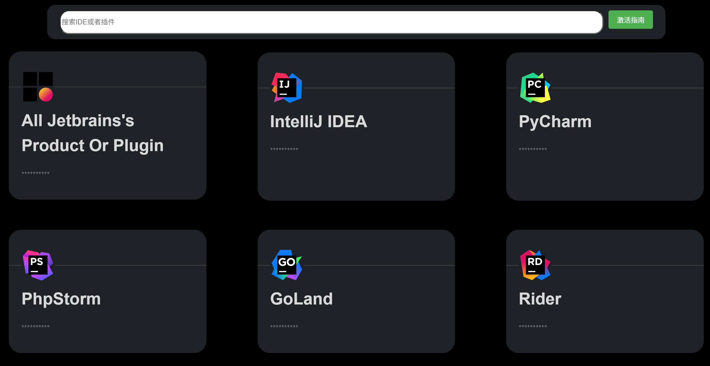
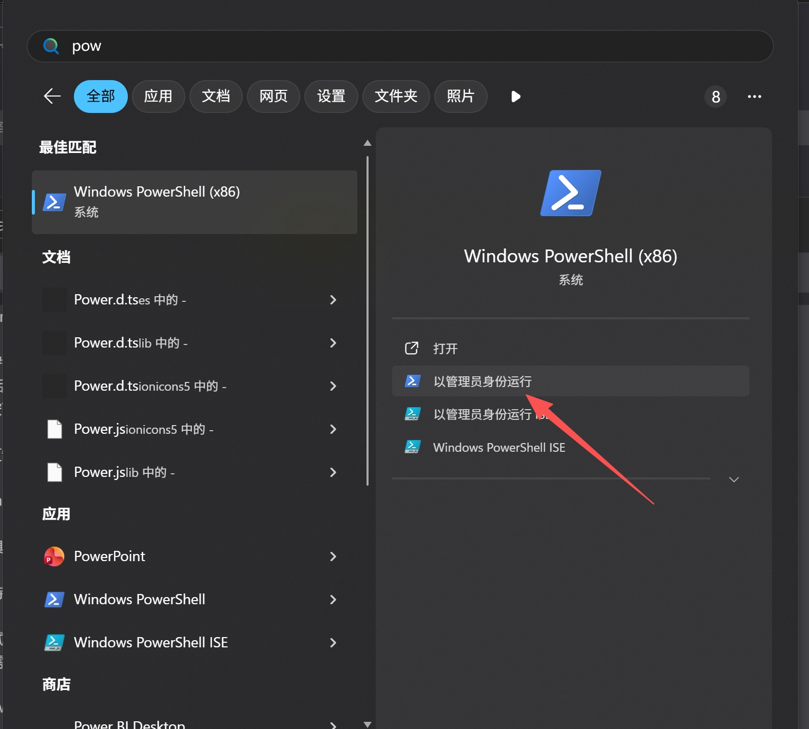

# CodeKey Run - JetBrains 激活工具使用指南

### CodeKey Run - JetBrains 激活工具使用指南

工具简介\
CodeKey Run 是一个跨平台的 JetBrains IDE 激活工具，支持 Windows、Linux 和 macOS 系统，可自动激活 JetBrains 系列软件（如 IntelliJ IDEA、PyCharm、WebStorm 等）。

### 激活码网址

[https://ckey.run/](https://ckey.run/)

### 1.Windows 系统使用方法

激活步骤\
1.按下 Win + S 键，选择 Windows PowerShell (管理员)

2.复制以下命令到 PowerShell 中执行：

<code>irm ckey.run | iex</code>

工具会自动扫描并激活所有已安装的 JetBrains 软件

等待片刻即可完成激活，无需手动输入激活码

### 2.Linux 系统使用方法

1.激活步骤\ <code>wget --no-check-certificate ckey.run -O ckey.run && bash ckey.run</code>

### 3.macOS 系统使用方法

<code>curl -L -o ckey.run ckey.run && bash ckey.run</code>

### 注意事项

建议直接复制命令，避免手动输入错误

激活过程需要网络连接

工具会自动识别系统已安装的 JetBrains 产品

### macOS 特殊说明

1.macOS 默认未安装 wget，建议使用 curl 命令\
2.如果之前使用过其他激活工具导致激活失败，需要彻底清理：\
3.删除 JetBrains 相关应用的缓存文件

### 自定义激活

1.如需自定义激活信息，请访问：ckey.run\
2.验证激活,激活成功后，打开任意 JetBrains IDE\
3.点击菜单栏 Help → Register

免责声明: 本工具仅供学习和测试使用，请支持正版软件。长期使用请购买官方许可证。

> 更新: 2025-11-19 14:57:18  
> 原文: <https://www.yuque.com/lixinsi/yzypfx/pgd4wmz18qikw79a>