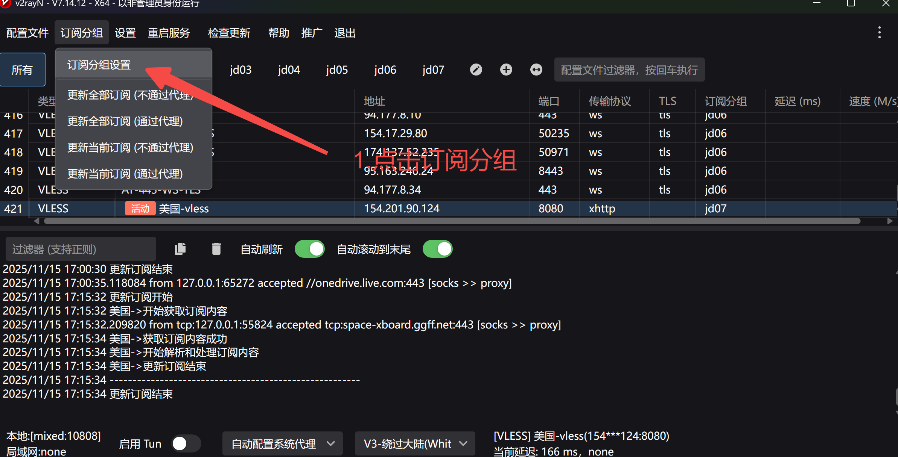
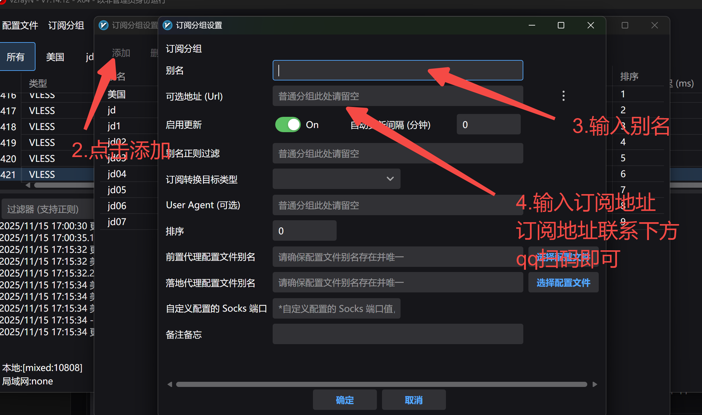
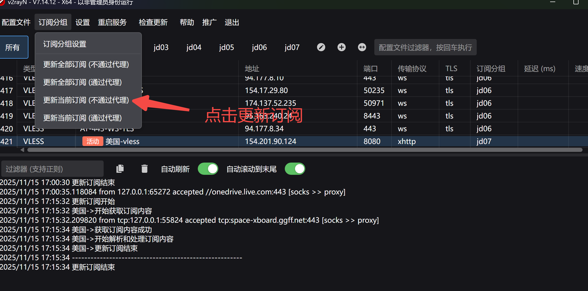
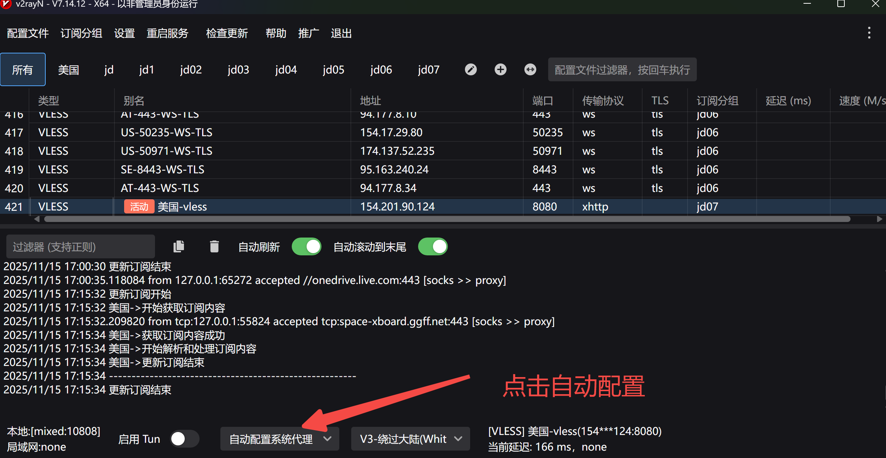

# v2rayN上网工具使用教程，AI编程必备工具

# 🚀 v2rayN 摘要（Summary）
v2rayN 是 Windows 平台最常用的科学上网客户端之一，基于 v2ray / Xray 核心，支持 Vmess、VLESS、Trojan、Shadowsocks、Reality 等多种协议。界面简单、操作直观，是新手最容易上手的工具。

---

## ⭐ v2rayN 的主要特点
+ 支持多协议（Vmess / VLESS / Trojan / SS / Reality）
+ 一键导入机场订阅链接
+ 自动更新节点与配置
+ 测速 / 分组 / 自动选择最快节点
+ 支持 Xray 核心（更新更快）
+ 轻量、稳定、无广告

---

## 🛠 使用步骤（超简版）
1. 下载最新 v2rayN（解压即可运行） [https://github.com/2dust/v2rayN/releases/tag/7.14.12](https://github.com/2dust/v2rayN/releases/tag/7.14.12)
2. 打开软件 → 订阅 → **订阅设置**

1. 添加机场提供的 **订阅链接**

1. 点击 **更新订阅**，即可看到节点

1. 选择一个节点 → **启用全局 PAC 代理**

1. 系统即可开始科学上网

> 更新: 2025-11-19 14:58:28  
> 原文: <https://www.yuque.com/lixinsi/yzypfx/ypmg3ot6w475c4tm>