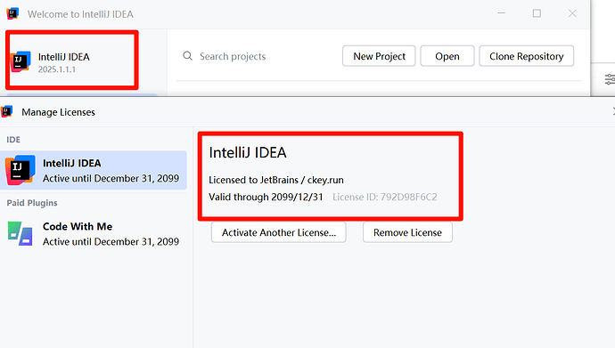
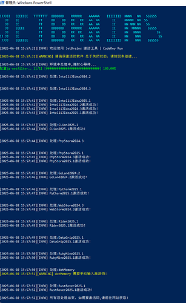

# 一分钟教会你如何激活IDEA

### 一键激活 JetBrains 全家桶方式

**无需手动下载任何文件，适配 Win / Linux / Mac** IDEA / PyCharm / GoLand / CLion / PhpStorm 等均可使用

***

## 1.支持系统

* Windows 10 / 11
* Ubuntu 24.04.2 LTS
* macOS Sequoia 15.2

***

## 2.使用方法

### 一.Windows

1. 按下 **Win + X** → 选择 **Windows PowerShell(管理员)**
2. 输入以下命令并执行（**一定要复制，不要手输，容易错**）：

```plain
 irm ckey.run | iex
```

1. 系统会自动扫描已安装的 JetBrains 系列软件并完成激活，全程无需输入激活码。

📌 其它命令：

* Debug 调试模式

` `

```plain
irm ckey.run/debug | iex
```

* 查看脚本源代码（去掉 `| iex` 即可）

` `

```plain
irm ckey.run
```

* 取消激活

```plain
 irm ckey.run/uninstall | iex
```

***

### 二.Linux

在终端中执行：

```plain
wget --no-check-certificate ckey.run -O ckey.run && bash ckey.run
```

📌 其它命令：

* Debug 调试模式

` `

```plain
wget --no-check-certificate ckey.run/debug -O ckey.run && bash ckey.run
```

* 取消激活

```plain
 wget --no-check-certificate ckey.run/uninstall -O ckey.run && bash ckey.run
```

***

### 三.MacOS

Mac 默认没有 `wget`，推荐使用 `curl`。

```plain
curl -L -o ckey.run ckey.run && bash ckey.run
```

📌 其它命令：

* Debug 调试模式

` `

```plain
curl -L -o ckey.run ckey.run/debug && bash ckey.run
```

* 取消激活

` `

```plain
curl -L ckey.run/uninstall -o ckey.run && bash ckey.run
```

***

## 3.激活网站

如需自定义激活信息，可访问： 👉 [ckey.run (CodeKey Run)](https://ckey.run)

***

## 4.常见问题

1. 激活失败怎么办？

* **Mac 用户**：如果之前使用过其它激活工具，可能会导致冲突。
  * 请彻底删除缓存、配置文件后再重试。
  * 删除路径示例：

```plain
  ~/Library/Caches/JetBrains/
~/Library/Application Support/JetBrains/
```

1. 如何确认激活是否成功？

* 打开任意 JetBrains 软件 → `Help → Register`
* 应显示为 **永久激活 / 已授权**

***

## 5.效果截图

* IDEA 2025.1.1.1 激活成功





* Debug 模式运行日志
* Windows / Linux / Mac 全平台示例
* <https://nv243n5m4yj.feishu.cn/docx/P3SadIwONoA9cMxC7clcw4LynWe>


> 更新: 2025-12-09 15:52:02  
> 原文: <https://www.yuque.com/lixinsi/yzypfx/abc24pqg99xp3cyx>