# 漏洞扫描▸Nessus(主机扫描)

***

*<font style="background-color:rgb(240, 247, 255);">→ 信息收集</font>*

***<font style="background-color:rgb(240, 247, 255);">→ 漏洞检测▸漏洞扫描▸</font>******<font style="color:rgb(255, 0, 0);background-color:rgb(240, 247, 255);">Nessus主机扫描</font>******<font style="background-color:rgb(240, 247, 255);">-----我们在这儿~</font>****<font style="background-color:rgb(240, 247, 255);"> </font>**<font style="background-color:rgb(240, 247, 255);">🔥🔥🔥</font>*

*<font style="background-color:rgb(240, 247, 255);">→ 初始立足点</font>*

*<font style="background-color:rgb(240, 247, 255);">→ </font>*[*<font style="color:rgb(102, 102, 102);background-color:rgb(240, 247, 255);">权限提升</font>*](https://so.csdn.net/so/search?q=%E6%9D%83%E9%99%90%E6%8F%90%E5%8D%87\&spm=1001.2101.3001.7020)*<font style="background-color:rgb(240, 247, 255);"> </font>*

*<font style="background-color:rgb(240, 247, 255);">→ 横向移动</font>*

*<font style="background-color:rgb(240, 247, 255);">→ 报告/分析</font>*

*<font style="background-color:rgb(240, 247, 255);">→ 教训/修复  </font>*

***

**<font style="color:rgb(51, 51, 51);">目录</font>**

[<font style="color:rgb(102, 102, 102);">1.2 Nessus漏洞扫描（基础功能）</font>](https://mars-coder.cn/blog/131212#1.2%20Nessus%E6%BC%8F%E6%B4%9E%E6%89%AB%E6%8F%8F%EF%BC%88%E5%9F%BA%E7%A1%80%E5%8A%9F%E8%83%BD%EF%BC%89)

[<font style="color:rgb(102, 102, 102);">1.2.1 部署Nessus</font>](https://mars-coder.cn/blog/131212#1.2.1%20%E9%83%A8%E7%BD%B2Nessus)

[<font style="color:rgb(102, 102, 102);">1.2.1.1 下载与验证安装包</font>](https://mars-coder.cn/blog/131212#1.2.1.1%20%E4%B8%8B%E8%BD%BD%E4%B8%8E%E9%AA%8C%E8%AF%81%E5%AE%89%E8%A3%85%E5%8C%85)

[<font style="color:rgb(102, 102, 102);">1.2.1.2 安装Nessus</font>](https://mars-coder.cn/blog/131212#1.2.1.2%20%E5%AE%89%E8%A3%85Nessus)

[<font style="color:rgb(102, 102, 102);">1.2.2 Nessus核心组件解析</font>](https://mars-coder.cn/blog/131212#1.2.2%20Nessus%E6%A0%B8%E5%BF%83%E7%BB%84%E4%BB%B6%E8%A7%A3%E6%9E%90)

[<font style="color:rgb(102, 102, 102);">1.2.2.1 仪表板选项卡</font>](https://mars-coder.cn/blog/131212#%C2%A01.2.2.1%20%E4%BB%AA%E8%A1%A8%E6%9D%BF%E9%80%89%E9%A1%B9%E5%8D%A1)

[<font style="color:rgb(102, 102, 102);">1.2.2.2 扫描插件模板分类</font>](https://mars-coder.cn/blog/131212#1.2.2.2%20%E6%89%AB%E6%8F%8F%E6%8F%92%E4%BB%B6%E6%A8%A1%E6%9D%BF%E5%88%86%E7%B1%BB)

[<font style="color:rgb(102, 102, 102);">1.2.3 Nessus漏洞扫描全流程</font>](https://mars-coder.cn/blog/131212#1.2.3%20Nessus%E6%BC%8F%E6%B4%9E%E6%89%AB%E6%8F%8F%E5%85%A8%E6%B5%81%E7%A8%8B)

[<font style="color:rgb(102, 102, 102);">1.2.3.1 新建<基本网络扫描></font>](https://mars-coder.cn/blog/131212#1.2.3.1%20%E6%96%B0%E5%BB%BA%3C%E5%9F%BA%E6%9C%AC%E7%BD%91%E7%BB%9C%E6%89%AB%E6%8F%8F%3E)

[<font style="color:rgb(102, 102, 102);">1.2.3.2 添加扫描目标</font>](https://mars-coder.cn/blog/131212#1.2.3.2%20%E6%B7%BB%E5%8A%A0%E6%89%AB%E6%8F%8F%E7%9B%AE%E6%A0%87)

[<font style="color:rgb(102, 102, 102);">1.2.3.3 扫描设置优化</font>](https://mars-coder.cn/blog/131212#1.2.3.3%C2%A0%E6%89%AB%E6%8F%8F%E8%AE%BE%E7%BD%AE%E4%BC%98%E5%8C%96)

[<font style="color:rgb(102, 102, 102);">1.2.3.4 启动扫描</font>](https://mars-coder.cn/blog/131212#1.2.3.4%C2%A0%E5%90%AF%E5%8A%A8%E6%89%AB%E6%8F%8F)

[<font style="color:rgb(102, 102, 102);">1.2.4 分析扫描结果</font>](https://mars-coder.cn/blog/131212#1.2.4%C2%A0%E5%88%86%E6%9E%90%E6%89%AB%E6%8F%8F%E7%BB%93%E6%9E%9C)

[<font style="color:rgb(102, 102, 102);">1.2.4.1 漏洞结果分析流程</font>](https://mars-coder.cn/blog/131212#1.2.4.1%20%E6%BC%8F%E6%B4%9E%E7%BB%93%E6%9E%9C%E5%88%86%E6%9E%90%E6%B5%81%E7%A8%8B)

[<font style="color:rgb(102, 102, 102);">1.2.4.2 生成漏扫PDF报告</font>](https://mars-coder.cn/blog/131212#1.2.4.2%20%E7%94%9F%E6%88%90%E6%BC%8F%E6%89%ABPDF%E6%8A%A5%E5%91%8A)

[<font style="color:rgb(102, 102, 102);">1.3 Nessus漏洞扫描（进阶功能）</font>](https://mars-coder.cn/blog/131212#1.3%20Nessus%E6%BC%8F%E6%B4%9E%E6%89%AB%E6%8F%8F%EF%BC%88%E8%BF%9B%E9%98%B6%E5%8A%9F%E8%83%BD%EF%BC%89)

[<font style="color:rgb(102, 102, 102);">1.3.1 执行经过身份验证的漏洞扫描</font>](https://mars-coder.cn/blog/131212#1.3.1%20%E6%89%A7%E8%A1%8C%E7%BB%8F%E8%BF%87%E8%BA%AB%E4%BB%BD%E9%AA%8C%E8%AF%81%E7%9A%84%E6%BC%8F%E6%B4%9E%E6%89%AB%E6%8F%8F)

[<font style="color:rgb(102, 102, 102);">1.3.1.1 扫描模板选择</font>](https://mars-coder.cn/blog/131212#1.3.1.1%20%E6%89%AB%E6%8F%8F%E6%A8%A1%E6%9D%BF%E9%80%89%E6%8B%A9)

[<font style="color:rgb(102, 102, 102);">1.3.1.2 凭证配置流程</font>](https://mars-coder.cn/blog/131212#1.3.1.2%20%E5%87%AD%E8%AF%81%E9%85%8D%E7%BD%AE%E6%B5%81%E7%A8%8B)

[<font style="color:rgb(102, 102, 102);">1.3.1.3 分析漏扫结果</font>](https://mars-coder.cn/blog/131212#1.3.1.3%C2%A0%E5%88%86%E6%9E%90%E6%BC%8F%E6%89%AB%E7%BB%93%E6%9E%9C)

[<font style="color:rgb(102, 102, 102);">1.3.2 使用Nessus插件精准检测</font>](https://mars-coder.cn/blog/131212#1.3.2%20%E4%BD%BF%E7%94%A8Nessus%E6%8F%92%E4%BB%B6%E7%B2%BE%E5%87%86%E6%A3%80%E6%B5%8B)

[<font style="color:rgb(102, 102, 102);">1.3.2.1 创建高级动态扫描</font>](https://mars-coder.cn/blog/131212#1.3.2.1%20%E5%88%9B%E5%BB%BA%E9%AB%98%E7%BA%A7%E5%8A%A8%E6%80%81%E6%89%AB%E6%8F%8F)

[<font style="color:rgb(102, 102, 102);">1.3.2.2 使用单一插件过滤器</font>](https://mars-coder.cn/blog/131212#1.3.2.2%20%E4%BD%BF%E7%94%A8%E5%8D%95%E4%B8%80%E6%8F%92%E4%BB%B6%E8%BF%87%E6%BB%A4%E5%99%A8)

[<font style="color:rgb(102, 102, 102);">1.3.2.3 多过滤器组合</font>](https://mars-coder.cn/blog/131212#1.3.2.3%20%E5%A4%9A%E8%BF%87%E6%BB%A4%E5%99%A8%E7%BB%84%E5%90%88)

[<font style="color:rgb(102, 102, 102);">1.3.2.4 扫描结果分析</font>](https://mars-coder.cn/blog/131212#1.3.2.4%20%E6%89%AB%E6%8F%8F%E7%BB%93%E6%9E%9C%E5%88%86%E6%9E%90)

[<font style="color:rgb(102, 102, 102);">创作不易~感谢您的点赞、关注、收藏、分享~</font>](https://mars-coder.cn/blog/131212#%E5%88%9B%E4%BD%9C%E4%B8%8D%E6%98%93~%E6%84%9F%E8%B0%A2%E6%82%A8%E7%9A%84%E7%82%B9%E8%B5%9E%E3%80%81%E5%85%B3%E6%B3%A8%E3%80%81%E6%94%B6%E8%97%8F%E3%80%81%E5%88%86%E4%BA%AB~)

***

## **<font style="color:rgb(79, 79, 79);">1.2 Nessus漏洞扫描（基础功能）</font>**

***<font style="background-color:rgb(240, 247, 255);">说明：</font>****<font style="background-color:rgb(240, 247, 255);">本文侧重介绍</font>****<u><font style="background-color:rgb(240, 247, 255);">Nessus的安装、了解其组件和配置、介绍功能等</font></u>**\_\_<font style="background-color:rgb(240, 247, 255);">内容。想用好Nessus扫描器需要经常实践。</font>*

* **工具定位**：行业主流漏洞扫描器（支持67,000+ CVE，168,000+插件）
* **版本对比**：

| **<font style="color:rgb(34, 34, 34);">版本</font>** | **<font style="color:rgb(34, 34, 34);">Nessus Essentials</font>** | **<font style="color:rgb(34, 34, 34);">Nessus Professional</font>** |
| :--- | :--- | :--- |
| **<font style="color:rgb(79, 79, 79);">IP扫描限制</font>** | <font style="color:rgb(79, 79, 79);">❗️</font><font style="color:rgb(79, 79, 79);">限制16个IP</font> | <font style="color:rgb(79, 79, 79);">无限制</font> |
| **<font style="color:rgb(79, 79, 79);">功能完整性</font>** | <font style="color:rgb(79, 79, 79);">基础功能</font> | <font style="color:rgb(79, 79, 79);">高级模板/功能</font> |
| **<font style="color:rgb(79, 79, 79);">适用场景</font>** | <font style="color:rgb(79, 79, 79);">学习/测试</font> | <font style="color:rgb(79, 79, 79);">企业生产环境</font> |

***

### **<font style="color:rgb(79, 79, 79);">1.2.1 部署Nessus</font>**

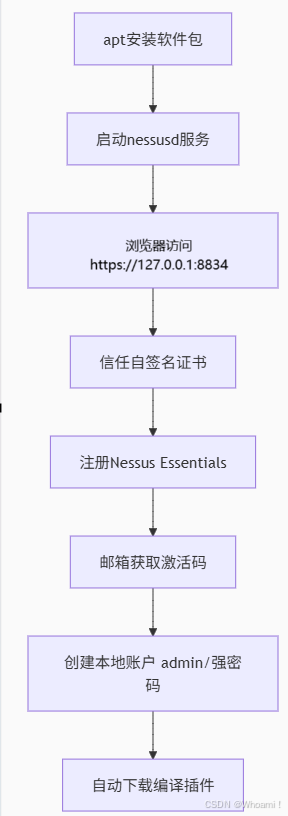

#### **<font style="color:rgb(79, 79, 79);">1.2.1.1 下载与验证安装包</font>**

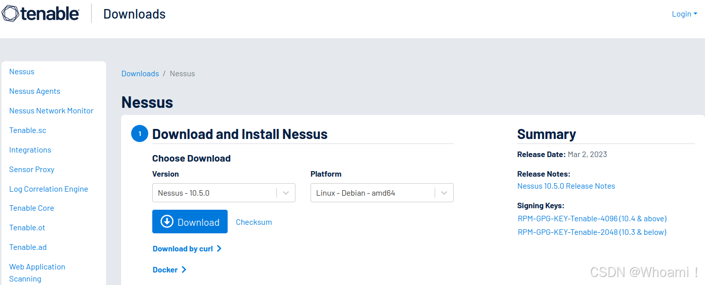

1. **下载安装包**\
   → [<font style="color:rgb(102, 102, 102);">Tenable官方下载页</font>](https://www.tenable.com/downloads/nessus?loginAttempted=true)\
   → **平台选择**：<code>**<font style="color:rgb(199, 37, 78);background-color:rgb(245, 245, 245);">Linux-Debian-amd64</font>**<font style="color:rgb(199, 37, 78);background-color:rgb(245, 245, 245);">（如在Windows下安装则选择Windows相关版本）</font></code>\
   → 在Kali Linux虚拟机上安装Nessus，下载和激活Nessus需要互联网连接和电子邮件地址。\
   → 最低硬件要求：2核CPU、4GB RAM。
2. **校验文件完整性**：

```bash
kali@kali:~/Downloads$ echo "4987776fef98bb2a72515abc0529e90572778b1d7aeeb1939179ff1f4de1440d Nessus-10.5.0-
debian10_amd64.deb" > sha256sum_nessus                 # 创建校验文件
kali@kali:~/Downloads$ sha256sum -c sha256sum_nessus   # 校验
Nessus-10.5.0-debian10_amd64.deb: OK                   # 校验成功，可以使用
```

*<font style="background-color:rgb(240, 247, 255);">✅</font>**<font style="background-color:rgb(240, 247, 255);"> </font>****<font style="background-color:rgb(240, 247, 255);">关键提示</font>**\_\_<font style="background-color:rgb(240, 247, 255);">：校验失败需重新下载！</font>*

***

#### **<font style="color:rgb(79, 79, 79);">1.2.1.2 安装Nessus</font>**

**<font style="color:rgb(51, 51, 51);">1.安装与启动</font>**

```bash
$ sudo apt install ./Nessus-10.5.0-debian10_amd64.deb   # 在命令行安装Nessus
$ sudo systemctl start nessusd      # 安装完毕后，启动nessusd服务
```

**<font style="color:rgb(51, 51, 51);">2.浏览器配置</font>**

<font style="color:rgb(51, 51, 51);">启动服务后，使用浏览器访问：</font>**<u><font style="color:rgb(51, 51, 51);">https://127.0.0.1:8834</font></u>**

*<font style="background-color:rgb(240, 247, 255);">⚠️</font>\_\_<font style="background-color:rgb(240, 247, 255);"> 遇到证书警告时：</font>*<code>_<font style="color:rgb(199, 37, 78);background-color:rgb(245, 245, 245);">高级</font>_</code>*<font style="background-color:rgb(240, 247, 255);"> → </font>*<code>_<font style="color:rgb(199, 37, 78);background-color:rgb(245, 245, 245);">接受风险并继续</font>_</code>

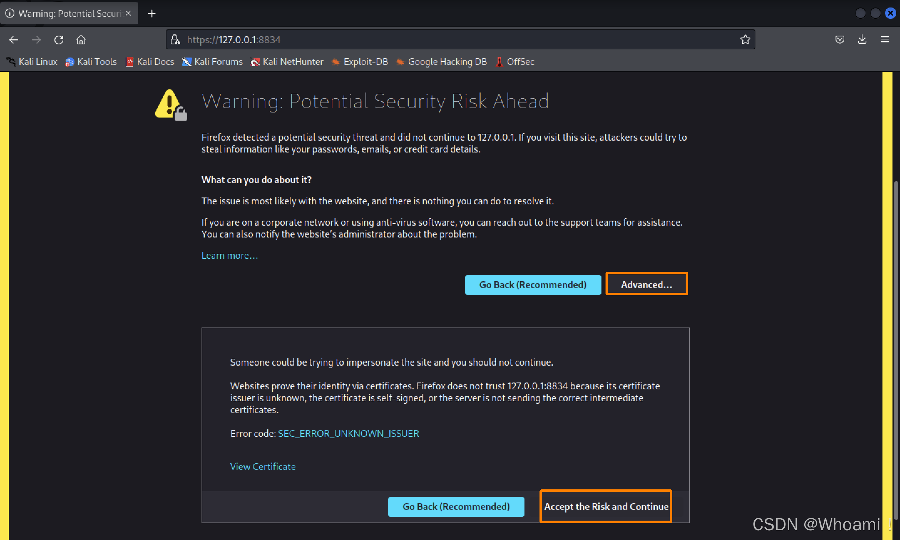

<font style="color:rgb(51, 51, 51);">页面加载完成后，将被提示配置预安装设置。点击</font>**<font style="color:rgb(51, 51, 51);">“继续”</font>**<font style="color:rgb(51, 51, 51);">以默认设置开始安装：</font>

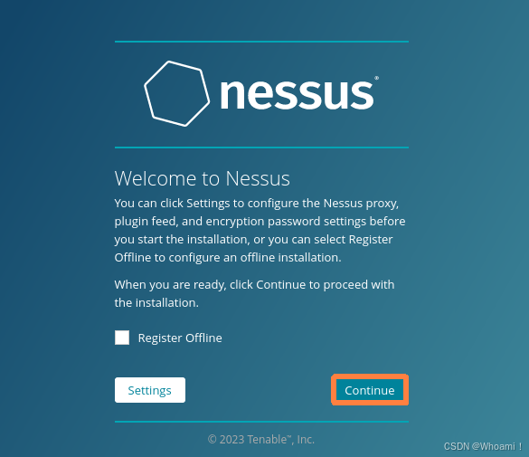

**<font style="color:rgb(51, 51, 51);">3.产品注册</font>**

<font style="color:rgb(51, 51, 51);">现在可以选择一个Nessus产品。若仅是捣鼓的目的，选择注册</font>**<font style="color:rgb(51, 51, 51);">Nessus Essentials（Free）</font>**<font style="color:rgb(51, 51, 51);">并点击继续。</font>

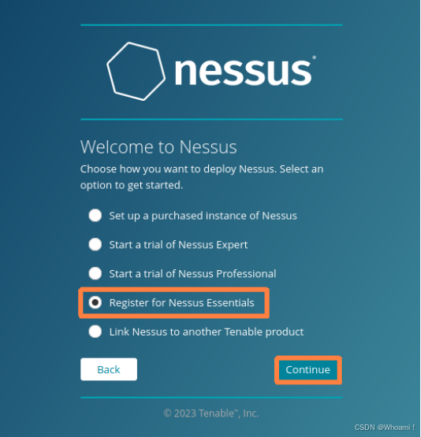

<font style="color:rgb(51, 51, 51);">填写姓名+邮箱 → </font>**<font style="color:rgb(51, 51, 51);">激活码发送至邮箱，</font>**<font style="color:rgb(51, 51, 51);">然后到邮箱点击“</font>**<font style="color:rgb(51, 51, 51);">邮箱验证</font>**<font style="color:rgb(51, 51, 51);">”即可。</font>

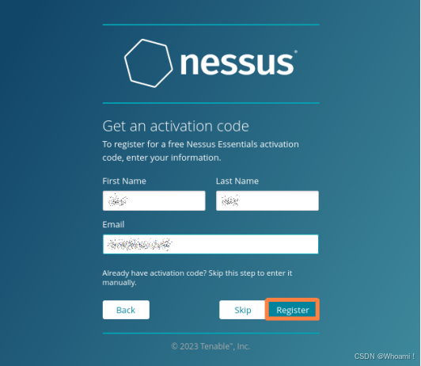

<font style="color:rgb(51, 51, 51);">一旦我们注册成功，激活码将显示在下一个窗口中（需要等待一段时间）。</font>

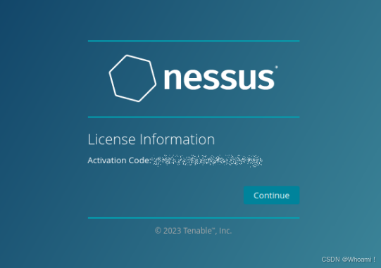

**<font style="color:rgb(51, 51, 51);">4.本地账户创建</font>**

<font style="color:rgb(51, 51, 51);">→ 用户名：admin（好记）</font>

<font style="color:rgb(51, 51, 51);">→ 密码：</font>**<font style="color:rgb(51, 51, 51);">高强度密码</font>**<font style="color:rgb(51, 51, 51);">（学习用途，使用好记密码即可。）</font>

<font style="color:rgb(51, 51, 51);">→ 用途：用于页面登录。</font>

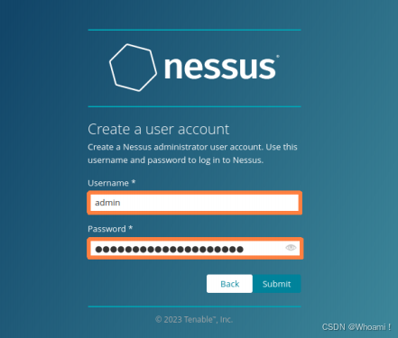

**<font style="color:rgb(51, 51, 51);">5.Nessus自动下载并编译插件</font>**

<font style="color:rgb(51, 51, 51);">⏳</font><font style="color:rgb(51, 51, 51);"> 耗时较长（务必确保网速和稳定，容易出现编译失败，需要返工。）</font>

<font style="color:rgb(51, 51, 51);">成功编译后即可使用，等了页面、输入用户名密码后方可开始使用Nessus Essentials实例。</font>

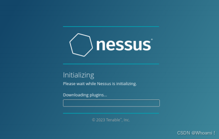

***

### **<font style="color:rgb(79, 79, 79);">1.2.2 Nessus核心组件解析</font>**

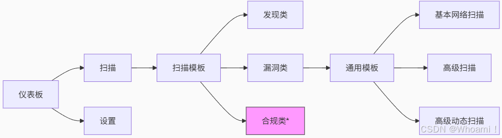

***<font style="background-color:rgb(240, 247, 255);">注</font>****<font style="background-color:rgb(240, 247, 255);">：带\*的</font>****<font style="background-color:rgb(240, 247, 255);">合规类模板</font>**\_\_<font style="background-color:rgb(240, 247, 255);">仅限企业版使用</font>*

#### <font style="color:rgb(79, 79, 79);"></font>**<font style="color:rgb(79, 79, 79);">1.2.2.1 仪表板选项卡</font>**

<font style="color:rgb(51, 51, 51);">在Nessus Essentials版本中有两个选项卡，分别是</font>**<font style="color:rgb(51, 51, 51);">扫描</font>**<font style="color:rgb(51, 51, 51);">和</font>**<font style="color:rgb(51, 51, 51);">设置。</font>**

**<font style="color:rgb(51, 51, 51);">设置选项卡：</font>**<font style="color:rgb(51, 51, 51);">系统配置/用户管理。例如，输入SMTP服务器来通过电子邮件获取扫描结果。Advanced菜单：允许配置全局设置，包括用户界面、扫描和日志行为、安全性和性能相关选项。下图所示，关于菜单列出了Nessus的基本信息、许可证以及剩余的主机数量。</font>

**<font style="color:rgb(51, 51, 51);">扫描选项卡</font>**<font style="color:rgb(51, 51, 51);">：点击策略policies。策略：是在Nessus扫描的上下文中预定义的配置选项集。当我们保存一个策略时，可以将其用作新扫描的模板。</font>

| **<font style="color:rgb(34, 34, 34);">选项卡</font>** | **<font style="color:rgb(34, 34, 34);">功能说明</font>** | **<font style="color:rgb(34, 34, 34);">Essentials版可用性</font>** |
| :--- | :--- | :--- |
| **<font style="color:rgb(79, 79, 79);">扫描</font>** | <font style="color:rgb(79, 79, 79);">创建/管理扫描任务</font> | <font style="color:rgb(79, 79, 79);">✅</font> |
| **<font style="color:rgb(79, 79, 79);">设置</font>** | <font style="color:rgb(79, 79, 79);">系统配置/用户管理</font> | <font style="color:rgb(79, 79, 79);">✅</font> |
| **<font style="color:rgb(79, 79, 79);">报告</font>** | <font style="color:rgb(79, 79, 79);">扫描结果分析</font> | <font style="color:rgb(79, 79, 79);">❌</font><font style="color:rgb(79, 79, 79);"> (仅企业版)</font> |
| **<font style="color:rgb(79, 79, 79);">资产</font>** | <font style="color:rgb(79, 79, 79);">目标资产管理</font> | <font style="color:rgb(79, 79, 79);">❌</font><font style="color:rgb(79, 79, 79);"> (仅企业版)</font> |

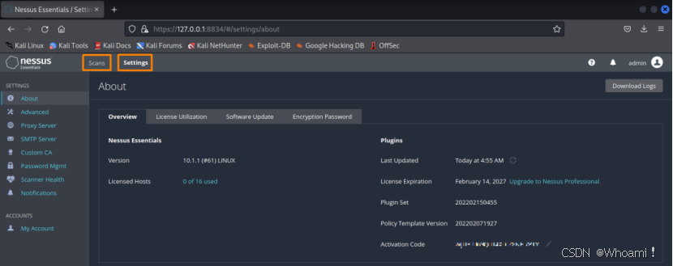

***

#### **<font style="color:rgb(79, 79, 79);">1.2.2.2 扫描插件模板分类</font>**

**<font style="color:rgb(51, 51, 51);">三大模板类别：</font>**

| **<font style="color:rgb(34, 34, 34);">类别</font>** | **<font style="color:rgb(34, 34, 34);">核心功能</font>** | **<font style="color:rgb(34, 34, 34);">代表模板</font>** | **<font style="color:rgb(34, 34, 34);">免费版支持</font>** |
| :--- | :--- | :--- | :--- |
| **<font style="color:rgb(79, 79, 79);">🔍</font>\*\*\*\*<font style="color:rgb(79, 79, 79);"> 发现类</font>** | <font style="color:rgb(79, 79, 79);">网络资产探测</font> | <font style="color:rgb(79, 79, 79);">• 主机发现   </font><font style="color:rgb(79, 79, 79);">（识别活动主机+开放端口）</font> | <font style="color:rgb(79, 79, 79);">✅</font> |
| **<font style="color:rgb(79, 79, 79);">🛡️</font>\*\*\*\*<font style="color:rgb(79, 79, 79);"> 漏洞类</font>** | <font style="color:rgb(79, 79, 79);">安全缺陷检测</font> | <font style="color:rgb(79, 79, 79);">• 基本网络扫描   </font><font style="color:rgb(79, 79, 79);">• 高级扫描   </font><font style="color:rgb(79, 79, 79);">• 高级动态扫描   </font><font style="color:rgb(79, 79, 79);">• 专项漏洞模板(如PrintNightmare)</font> | <font style="color:rgb(79, 79, 79);">✅</font> |
| **<font style="color:rgb(79, 79, 79);">📝</font>\*\*\*\*<font style="color:rgb(79, 79, 79);"> 合规类</font>**<font style="color:rgb(79, 79, 79);">\*</font> | <font style="color:rgb(79, 79, 79);">策略符合性审计</font> | <font style="color:rgb(79, 79, 79);">• PCI DSS审计   </font><font style="color:rgb(79, 79, 79);">• HIPAA合规检查</font> | <font style="color:rgb(79, 79, 79);">❌</font> |

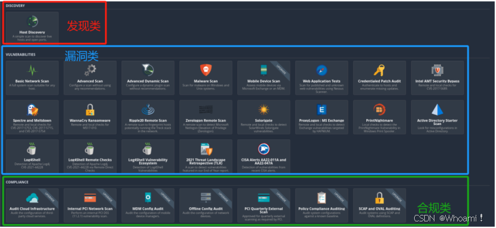

*<font style="background-color:rgb(240, 247, 255);">💡</font>**<font style="background-color:rgb(240, 247, 255);"> </font>**<font style="background-color:rgb(240, 247, 255);">专项漏洞模板示例：Web应用测试、恶意软件扫描、Zerologon检测等</font>*

**<font style="color:rgb(51, 51, 51);">Nessus插件的关键特性</font>**<font style="color:rgb(51, 51, 51);">：</font>

1. **NASL语言**：Nessus插件是专用脚本语言编写检测逻辑
2. **插件族**：按漏洞类型/系统分类（如Windows漏洞族、Web服务族）
3. **动态更新**：每小时自动同步最新漏洞检测规则
4. **智能过滤**：

* <font style="color:rgb(51, 51, 51);">基础扫描：自动启用相关插件</font>
* <font style="color:rgb(51, 51, 51);">动态扫描：实时激活匹配插件</font>

***

<font style="color:rgb(51, 51, 51);">⚙️</font><font style="color:rgb(51, 51, 51);"> </font>**<font style="color:rgb(51, 51, 51);">三大通用漏洞扫描模板对比</font>**<font style="color:rgb(51, 51, 51);">（分别是漏洞类的前三个模版）</font>

| **<font style="color:rgb(34, 34, 34);">特性</font>** | **<font style="color:rgb(34, 34, 34);">基本网络扫描</font>** | **<font style="color:rgb(34, 34, 34);">高级扫描</font>** | **<font style="color:rgb(34, 34, 34);">高级动态扫描</font>** |
| :--- | :--- | :--- | :--- |
| **<font style="color:rgb(79, 79, 79);">预设配置</font>** | <font style="color:rgb(79, 79, 79);">✅</font><font style="color:rgb(79, 79, 79);"> 完整预定义设置</font> | <font style="color:rgb(79, 79, 79);">❌</font><font style="color:rgb(79, 79, 79);"> 无预设</font> | <font style="color:rgb(79, 79, 79);">❌</font><font style="color:rgb(79, 79, 79);"> 无预设</font> |
| **<font style="color:rgb(79, 79, 79);">推荐级别</font>** | <font style="color:rgb(79, 79, 79);">⭐⭐⭐⭐⭐</font><font style="color:rgb(79, 79, 79);"> (官方推荐)</font> | <font style="color:rgb(79, 79, 79);">⭐⭐</font> | <font style="color:rgb(79, 79, 79);">⭐⭐⭐</font> |
| **<font style="color:rgb(79, 79, 79);">插件管理</font>** | <font style="color:rgb(79, 79, 79);">自动选择</font> | <font style="color:rgb(79, 79, 79);">手动选择插件</font> | <font style="color:rgb(79, 79, 79);">动态插件过滤器</font> |
| **<font style="color:rgb(79, 79, 79);">使用场景</font>** | <font style="color:rgb(79, 79, 79);">• 常规全面扫描   </font><font style="color:rgb(79, 79, 79);">• 快速漏洞评估</font> | <font style="color:rgb(79, 79, 79);">• 高度定制化扫描   </font><font style="color:rgb(79, 79, 79);">• 特定需求测试</font> | <font style="color:rgb(79, 79, 79);">• 智能漏洞检测   </font><font style="color:rgb(79, 79, 79);">• 避免插件过载</font> |
| **<font style="color:rgb(79, 79, 79);">操作复杂度</font>** | <font style="color:rgb(79, 79, 79);">初级</font> | <font style="color:rgb(79, 79, 79);">高级</font> | <font style="color:rgb(79, 79, 79);">中级</font> |

**<font style="color:rgb(51, 51, 51);">💎</font>****<font style="color:rgb(51, 51, 51);"> </font>****<font style="color:rgb(51, 51, 51);">操作建议</font>**

1. **新手首选** → 使用**基本网络扫描**模板
2. **专项检测** → 选择特定漏洞模板（如<code><font style="color:rgb(199, 37, 78);background-color:rgb(245, 245, 245);">PrintNightmare检测</font></code>）
3. **深度定制** → 启用**高级扫描**+手动配置插件族
4. **高效扫描** → **高级动态扫描**+智能过滤器避免资源浪费

*<font style="background-color:rgb(240, 247, 255);">⚠️</font>**<font style="background-color:rgb(240, 247, 255);"> </font>****<font style="background-color:rgb(240, 247, 255);">版本限制提示</font>**\_\_<font style="background-color:rgb(240, 247, 255);">：移动设备扫描、合规审计等高级功能需Nessus Professional版本</font>*

***

### **<font style="color:rgb(79, 79, 79);">1.2.3 Nessus漏洞扫描全流程</font>**

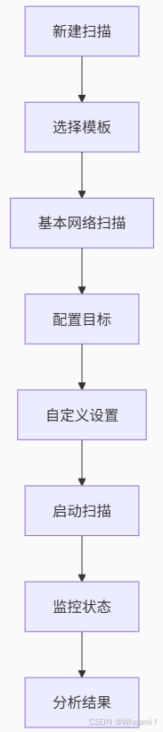

| **<font style="color:rgb(34, 34, 34);">配置模块</font>** | **<font style="color:rgb(34, 34, 34);">功能说明</font>** | **<font style="color:rgb(34, 34, 34);">默认值</font>** | **<font style="color:rgb(34, 34, 34);">关键操作</font>** |
| :--- | :--- | :--- | :--- |
| **<font style="color:rgb(79, 79, 79);">基本设置</font>** | <font style="color:rgb(79, 79, 79);">定义扫描基础参数</font> | <font style="color:rgb(79, 79, 79);">无</font> | <font style="color:rgb(79, 79, 79);">• 输入扫描名称   </font><font style="color:rgb(79, 79, 79);">• 设置目标列表</font> |
| **<font style="color:rgb(79, 79, 79);">发现设置</font>** | <font style="color:rgb(79, 79, 79);">主机探测与端口扫描</font> | <font style="color:rgb(79, 79, 79);">常见端口</font> | <font style="color:rgb(79, 79, 79);">• 自定义端口范围   </font><font style="color:rgb(79, 79, 79);">• 配置主机发现</font> |
| **<font style="color:rgb(79, 79, 79);">评估设置</font>** | <font style="color:rgb(79, 79, 79);">漏洞检测深度</font> | <font style="color:rgb(79, 79, 79);">基础检测</font> | <font style="color:rgb(79, 79, 79);">• 禁用暴力破解   </font><font style="color:rgb(79, 79, 79);">• 设置凭证扫描</font> |
| **<font style="color:rgb(79, 79, 79);">报告设置</font>** | <font style="color:rgb(79, 79, 79);">结果输出格式</font> | <font style="color:rgb(79, 79, 79);">HTML+PDF</font> | <font style="color:rgb(79, 79, 79);">• 调整严重度阈值   </font><font style="color:rgb(79, 79, 79);">• 选择导出格式</font> |
| **<font style="color:rgb(79, 79, 79);">高级设置</font>** | <font style="color:rgb(79, 79, 79);">性能与网络配置</font> | <font style="color:rgb(79, 79, 79);">平衡模式</font> | <font style="color:rgb(79, 79, 79);">• 调整并发连接数   </font><font style="color:rgb(79, 79, 79);">• 设置超时参数</font> |

#### **<font style="color:rgb(79, 79, 79);">1.2.3.1 新建<基本网络扫描></font>**

**<font style="color:rgb(51, 51, 51);">1.点击New Scan</font>**<font style="color:rgb(51, 51, 51);">按钮</font>

<font style="color:rgb(51, 51, 51);">首先，在仪表板的扫描选项卡上点击---</font>**<font style="color:rgb(51, 51, 51);">New Scan</font>**<font style="color:rgb(51, 51, 51);">按钮</font>

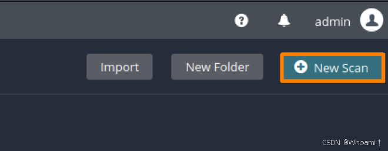

<font style="color:rgb(51, 51, 51);">2.选择</font>**<font style="color:rgb(51, 51, 51);"><基本网络扫描></font>**<font style="color:rgb(51, 51, 51);">模版</font>

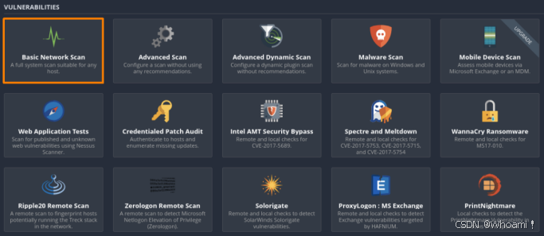

<font style="color:rgb(51, 51, 51);">会呈现扫描配置设置屏幕，其中包含：基本、发现、评估、报告和高级设置。</font>

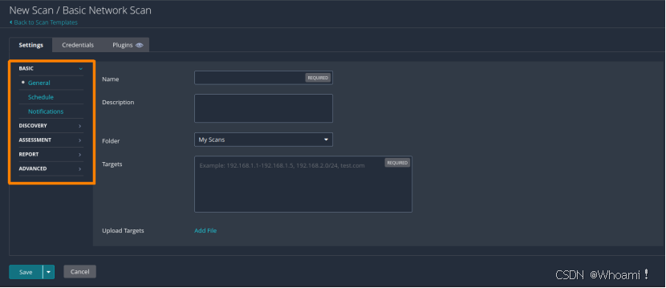

***

#### **<font style="color:rgb(79, 79, 79);">1.2.3.2 添加扫描目标</font>**

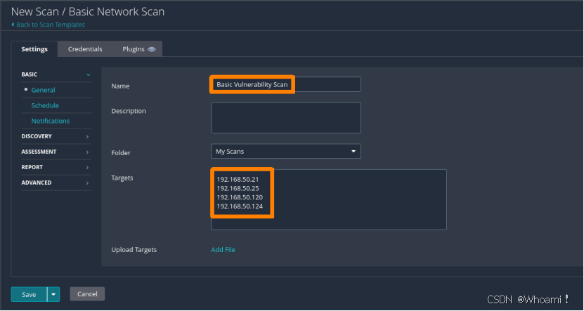

**<font style="color:rgb(51, 51, 51);">必需参数</font>**

1. **扫描名称**\
   → 示例：选择<code><font style="color:rgb(199, 37, 78);background-color:rgb(245, 245, 245);">"</font></code>Basec Network Scan<code><font style="color:rgb(199, 37, 78);background-color:rgb(245, 245, 245);">"</font></code>模版
2. **目标列表**\
   → 示例：<code><font style="color:rgb(199, 37, 78);background-color:rgb(245, 245, 245);">192.168.1.20, 192.168.1.21, 192.168.1.22, 192.168.1.23</font></code>
3. **支持的目标格式**：

```java
192.168.1.100 ← 单个IP
192.168.1.1-50 ← IP范围
web.example.com ← 域名
192.168.1.0/24 ← CIDR网段
192.168.1.5,10.0.0.8 ← 逗号分隔列表
```

***

#### **<font style="color:rgb(79, 79, 79);">1.2.3.3 扫描设置优化</font>**

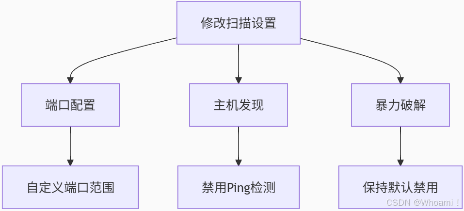

**<font style="color:rgb(51, 51, 51);">1. 设置要扫描的端口</font>**

**<font style="color:rgb(51, 51, 51);">操作路径</font>**<font style="color:rgb(51, 51, 51);">：\ </font><code><font style="color:rgb(199, 37, 78);background-color:rgb(245, 245, 245);">Settings---DISCOVERY</font></code><font style="color:rgb(51, 51, 51);"> → </font><code><font style="color:rgb(199, 37, 78);background-color:rgb(245, 245, 245);">端口类型</font></code><font style="color:rgb(51, 51, 51);"> → </font><code>**<font style="color:rgb(199, 37, 78);background-color:rgb(245, 245, 245);">自定义Custom（根据需要也可选择其他选项）</font>**</code>

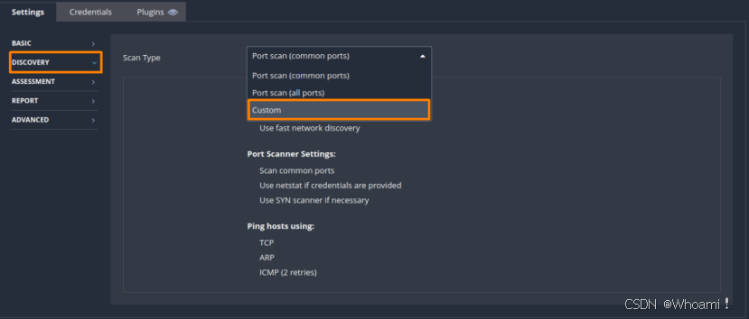

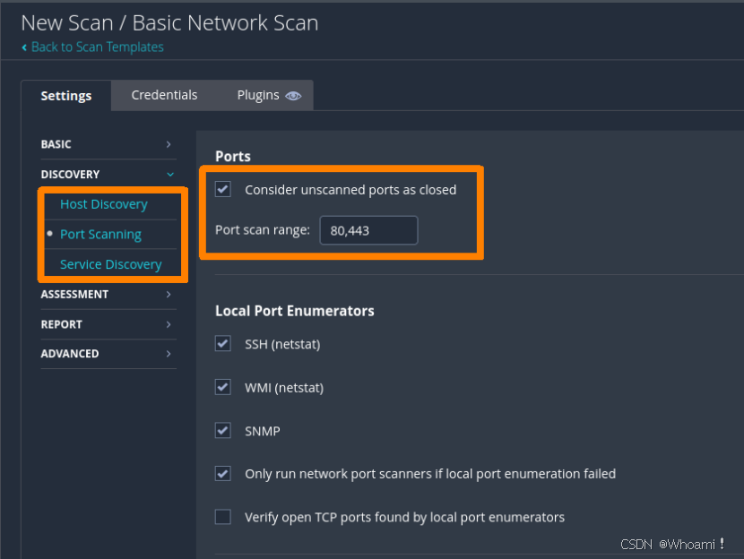

| **<font style="color:rgb(34, 34, 34);">配置项</font>** | **<font style="color:rgb(34, 34, 34);">默认值</font>** | **<font style="color:rgb(34, 34, 34);">演示设置</font>** | **<font style="color:rgb(34, 34, 34);">影响说明</font>** |
| :--- | :--- | :--- | :--- |
| <font style="color:rgb(79, 79, 79);">TCP端口范围</font> | <font style="color:rgb(79, 79, 79);">常见端口列表</font> | **<font style="color:rgb(79, 79, 79);">80,443</font>** | <font style="color:rgb(79, 79, 79);">仅扫描Web服务端口</font> |
| <font style="color:rgb(79, 79, 79);">UDP端口扫描</font> | <font style="color:rgb(79, 79, 79);">❌</font><font style="color:rgb(79, 79, 79);"> 禁用</font> | <font style="color:rgb(79, 79, 79);">❌</font><font style="color:rgb(79, 79, 79);"> 禁用</font> | <font style="color:rgb(79, 79, 79);">避免时间消耗+结果不可靠</font> |
| <font style="color:rgb(79, 79, 79);">未扫描端口处理</font> | <font style="color:rgb(79, 79, 79);">未知状态</font> | <font style="color:rgb(79, 79, 79);">✅</font><font style="color:rgb(79, 79, 79);"> </font>**<font style="color:rgb(79, 79, 79);">视为关闭</font>** | <font style="color:rgb(79, 79, 79);">明确忽略其他端口</font> |

*<font style="background-color:rgb(240, 247, 255);">⚠️</font>****<font style="background-color:rgb(240, 247, 255);"> </font>******<font style="background-color:rgb(240, 247, 255);">温馨提示：</font>***

***<font style="background-color:rgb(240, 247, 255);">1.UDP扫描警告</font>**\_\_<font style="background-color:rgb(240, 247, 255);">：启用会使扫描时间增加3-5倍，且开放/过滤状态难以区分，误报率高。</font>*

***<font style="background-color:rgb(240, 247, 255);">2.</font>***<code>_<font style="color:rgb(199, 37, 78);background-color:rgb(245, 245, 245);">"</font>_</code>*<font style="background-color:rgb(240, 247, 255);">Basec Network Scan</font>*<code>_<font style="color:rgb(199, 37, 78);background-color:rgb(245, 245, 245);">"</font>_</code>*<font style="background-color:rgb(240, 247, 255);">模版的默认设置不会扫描UDP端口，若需要进行UDP端口扫描，需要手动配置。</font>*

***

**<font style="color:rgb(51, 51, 51);">2. 禁止主机发现</font>**

**<font style="color:rgb(51, 51, 51);">操作路径</font>**<font style="color:rgb(51, 51, 51);">：\ </font><code><font style="color:rgb(199, 37, 78);background-color:rgb(245, 245, 245);">Settings---DISCOVERY---Host Discovery---Remote Host Ping---Ping the remote host---OFF</font></code>

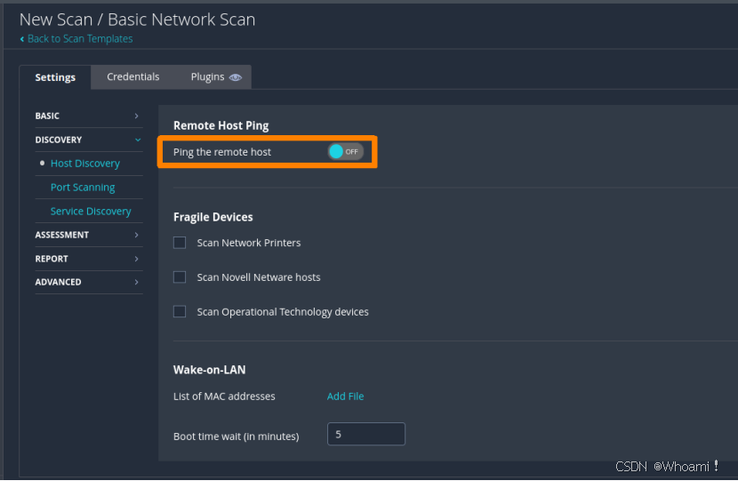

| **<font style="color:rgb(34, 34, 34);">模式</font>** | **<font style="color:rgb(34, 34, 34);">响应速度</font>** | **<font style="color:rgb(34, 34, 34);">网络噪音</font>** | **<font style="color:rgb(34, 34, 34);">适用场景</font>** |
| :--- | :--- | :--- | :--- |
| **<font style="color:rgb(79, 79, 79);">默认Ping检测</font>** | <font style="color:rgb(79, 79, 79);">较慢</font> | <font style="color:rgb(79, 79, 79);">较高</font> | <font style="color:rgb(79, 79, 79);">未知主机状态</font> |
| **<font style="color:rgb(79, 79, 79);">✅</font>\*\*\*\*<font style="color:rgb(79, 79, 79);"> 禁用Ping</font>** | <font style="color:rgb(79, 79, 79);">⚡</font><font style="color:rgb(79, 79, 79);"> 快速</font> | <font style="color:rgb(79, 79, 79);">🔇</font><font style="color:rgb(79, 79, 79);"> 极低</font> | **<font style="color:rgb(79, 79, 79);">已知在线主机</font>** |

*<font style="background-color:rgb(240, 247, 255);">✅</font>****<font style="background-color:rgb(240, 247, 255);">优势</font>****<font style="background-color:rgb(240, 247, 255);">：\ </font>**<font style="background-color:rgb(240, 247, 255);">• 节省30%扫描时间\ </font>**<font style="background-color:rgb(240, 247, 255);">• 减少被防御系统检测概率</font>*

***

**<font style="color:rgb(51, 51, 51);">3. 禁用用户暴力破解</font>**

**<font style="color:rgb(51, 51, 51);">操作路径</font>**<font style="color:rgb(51, 51, 51);">：\ </font><code><font style="color:rgb(199, 37, 78);background-color:rgb(245, 245, 245);">Settings---评估ASSESSMENT</font></code><font style="color:rgb(51, 51, 51);"> → </font><code><font style="color:rgb(199, 37, 78);background-color:rgb(245, 245, 245);">暴力破解</font></code><font style="color:rgb(51, 51, 51);"> → </font>**<font style="color:rgb(51, 51, 51);">保持默认禁用（默认就是禁用的）\ </font>****<font style="color:rgb(51, 51, 51);">❌</font>****<font style="color:rgb(51, 51, 51);"> 若没有配置任何认证凭据→ 扫描模式：以非身份验证运行</font>**

| **<font style="color:rgb(34, 34, 34);">配置状态</font>** | **<font style="color:rgb(34, 34, 34);">认证扫描</font>** | **<font style="color:rgb(34, 34, 34);">攻击痕迹</font>** | **<font style="color:rgb(34, 34, 34);">账户风险</font>** |
| :--- | :--- | :--- | :--- |
| <font style="color:rgb(79, 79, 79);">启用</font> | <font style="color:rgb(79, 79, 79);">✅</font><font style="color:rgb(79, 79, 79);"> 深度检测</font> | <font style="color:rgb(79, 79, 79);">🚩</font><font style="color:rgb(79, 79, 79);"> 高可见性</font> | <font style="color:rgb(79, 79, 79);">🔓</font><font style="color:rgb(79, 79, 79);"> 可能锁定账户</font> |
| **<font style="color:rgb(79, 79, 79);">✅</font>\*\*\*\*<font style="color:rgb(79, 79, 79);"> 禁用</font>** | <font style="color:rgb(79, 79, 79);">❌</font><font style="color:rgb(79, 79, 79);"> 仅表面漏洞</font> | <font style="color:rgb(79, 79, 79);">🟢</font><font style="color:rgb(79, 79, 79);"> 低可见性</font> | <font style="color:rgb(79, 79, 79);">🔒</font><font style="color:rgb(79, 79, 79);"> 无账户风险</font> |

*<font style="background-color:rgb(240, 247, 255);">⚠️</font>**<font style="background-color:rgb(240, 247, 255);"> </font>****<font style="background-color:rgb(240, 247, 255);">注意事项</font>****<font style="background-color:rgb(240, 247, 255);">：\ </font>**<font style="background-color:rgb(240, 247, 255);">即使禁用暴力破解，非认证扫描仍会产生显著网络流量。</font>*

***

<font style="color:rgb(51, 51, 51);">📊</font><font style="color:rgb(51, 51, 51);"> </font>**<font style="color:rgb(51, 51, 51);">配置对比表</font>**

| **<font style="color:rgb(34, 34, 34);">功能模块</font>** | **<font style="color:rgb(34, 34, 34);">默认配置</font>** | **<font style="color:rgb(34, 34, 34);">演示优化配置</font>** | **<font style="color:rgb(34, 34, 34);">优化效果</font>** |
| :--- | :--- | :--- | :--- |
| **<font style="color:rgb(79, 79, 79);">端口扫描</font>** | <font style="color:rgb(79, 79, 79);">200+常见端口</font> | **<font style="color:rgb(79, 79, 79);">仅TCP 80/443</font>** | <font style="color:rgb(79, 79, 79);">⏱️</font><font style="color:rgb(79, 79, 79);"> 扫描速度↑ 300%</font> |
| **<font style="color:rgb(79, 79, 79);">主机发现</font>** | <font style="color:rgb(79, 79, 79);">Ping检测启用</font> | **<font style="color:rgb(79, 79, 79);">Ping检测关闭</font>** | <font style="color:rgb(79, 79, 79);">🔇</font><font style="color:rgb(79, 79, 79);"> 隐蔽性↑ </font><font style="color:rgb(79, 79, 79);">⏱️</font><font style="color:rgb(79, 79, 79);"> 速度↑ 30%</font> |
| **<font style="color:rgb(79, 79, 79);">暴力破解</font>** | <font style="color:rgb(79, 79, 79);">禁用</font> | **<font style="color:rgb(79, 79, 79);">保持禁用</font>** | <font style="color:rgb(79, 79, 79);">🔒</font><font style="color:rgb(79, 79, 79);"> 安全风险↓</font> |
| **<font style="color:rgb(79, 79, 79);">UDP扫描</font>** | <font style="color:rgb(79, 79, 79);">禁用</font> | **<font style="color:rgb(79, 79, 79);">保持禁用</font>** | <font style="color:rgb(79, 79, 79);">⏱️</font><font style="color:rgb(79, 79, 79);"> 避免时间浪费</font> |

*<font style="background-color:rgb(240, 247, 255);">💡</font>**<font style="background-color:rgb(240, 247, 255);"> </font>****<font style="background-color:rgb(240, 247, 255);">专业建议</font>**\_\_<font style="background-color:rgb(240, 247, 255);">：对关键服务器(如域控制器)禁用暴力破解，避免生产环境事故</font>*

***

#### **<font style="color:rgb(79, 79, 79);">1.2.3.4 启动扫描</font>**


**<font style="color:rgb(51, 51, 51);">1. 启动操作</font>**

* **路径**：\ <code><font style="color:rgb(199, 37, 78);background-color:rgb(245, 245, 245);">保存按钮</font></code> → <code>**<font style="color:rgb(199, 37, 78);background-color:rgb(245, 245, 245);">下拉箭头</font>**</code> → 选择<code><font style="color:rgb(199, 37, 78);background-color:rgb(245, 245, 245);">启动（Launch）</font></code>
* **位置**：扫描配置页面右下角\
  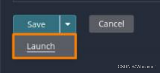

**<font style="color:rgb(51, 51, 51);">2. 状态监控</font>**

| **<font style="color:rgb(34, 34, 34);">状态</font>** | **<font style="color:rgb(34, 34, 34);">仪表板显示</font>** | **<font style="color:rgb(34, 34, 34);">可用操作</font>** | **<font style="color:rgb(34, 34, 34);">下一步</font>** |
| :--- | :--- | :--- | :--- |
| **<font style="color:rgb(79, 79, 79);">运行中</font>** | <font style="color:rgb(79, 79, 79);">• 动态进度条   </font><font style="color:rgb(79, 79, 79);">• "Running"标签</font> | <font style="color:rgb(79, 79, 79);">⏸️</font><font style="color:rgb(79, 79, 79);"> 暂停   </font><font style="color:rgb(79, 79, 79);">⏹️</font><font style="color:rgb(79, 79, 79);"> 停止</font> | <font style="color:rgb(79, 79, 79);">实时查看日志</font> |
| **<font style="color:rgb(79, 79, 79);">已完成</font>** | <font style="color:rgb(79, 79, 79);">• 100%进度条   </font><font style="color:rgb(79, 79, 79);">• "Completed"标签</font> | <font style="color:rgb(79, 79, 79);">📊</font><font style="color:rgb(79, 79, 79);"> 查看报告   </font><font style="color:rgb(79, 79, 79);">📥</font><font style="color:rgb(79, 79, 79);"> 导出结果</font> | <font style="color:rgb(79, 79, 79);">分析漏洞</font> |

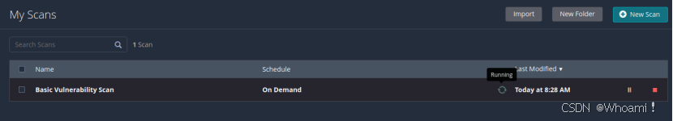

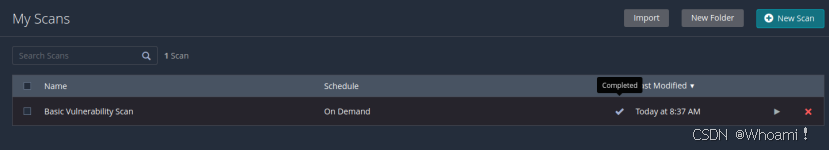

*<font style="background-color:rgb(240, 247, 255);">💡</font>**<font style="background-color:rgb(240, 247, 255);"> </font>****<font style="background-color:rgb(240, 247, 255);">首次扫描提示</font>****<font style="background-color:rgb(240, 247, 255);">：\ </font>**<font style="background-color:rgb(240, 247, 255);">基础扫描(4主机+2端口)约需 </font>****<font style="background-color:rgb(240, 247, 255);">5-15分钟</font>****<font style="background-color:rgb(240, 247, 255);">，扫描时长取决于：\ </font>**<font style="background-color:rgb(240, 247, 255);">• 网络延迟 </font>**<font style="background-color:rgb(240, 247, 255);">⏱️</font>**<font style="background-color:rgb(240, 247, 255);">\ </font>**<font style="background-color:rgb(240, 247, 255);">• 目标响应速度 </font>**<font style="background-color:rgb(240, 247, 255);">💻</font>**<font style="background-color:rgb(240, 247, 255);">\ </font>**<font style="background-color:rgb(240, 247, 255);">• 插件加载量 </font>**<font style="background-color:rgb(240, 247, 255);">🔌</font>*

***

### **<font style="color:rgb(79, 79, 79);">1.2.4 分析扫描结果</font>**

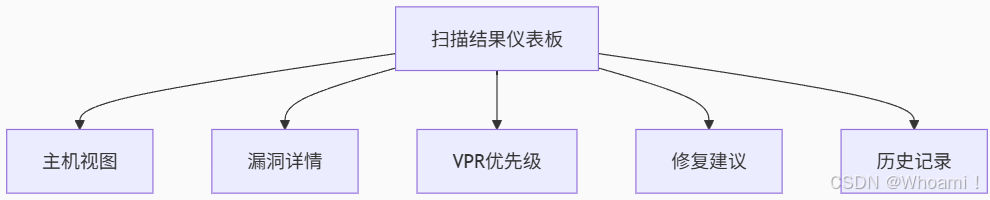

#### **<font style="color:rgb(79, 79, 79);">1.2.4.1 漏洞结果分析流程</font>**

**<font style="color:rgb(51, 51, 51);">1. 主机概览视图</font>**

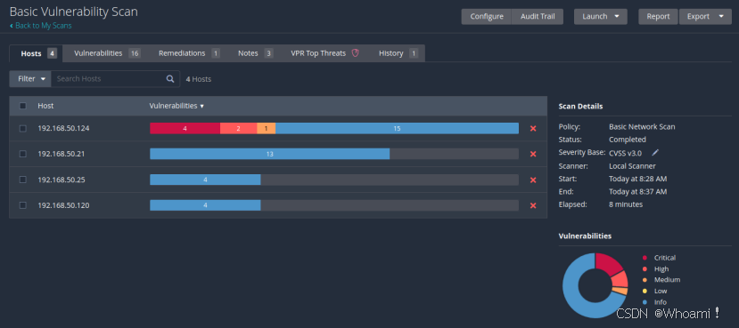

| **<font style="color:rgb(34, 34, 34);">组件</font>** | **<font style="color:rgb(34, 34, 34);">功能说明</font>** | **<font style="color:rgb(34, 34, 34);">关键信息</font>** |
| :--- | :--- | :--- |
| **<font style="color:rgb(79, 79, 79);">主机列表</font>** | <font style="color:rgb(79, 79, 79);">显示所有扫描目标</font> | <font style="color:rgb(79, 79, 79);">• IP地址   </font><font style="color:rgb(79, 79, 79);">• 主机名   </font><font style="color:rgb(79, 79, 79);">• 漏洞统计</font> |
| **<font style="color:rgb(79, 79, 79);">安全状态图</font>** | <font style="color:rgb(79, 79, 79);">可视化漏洞分布</font> | <font style="color:rgb(79, 79, 79);">• 危急/高危漏洞比例   </font><font style="color:rgb(79, 79, 79);">• 漏洞类型分布</font> |
| **<font style="color:rgb(79, 79, 79);">摘要面板</font>** | <font style="color:rgb(79, 79, 79);">扫描概况</font> | <font style="color:rgb(79, 79, 79);">• 扫描时间   </font><font style="color:rgb(79, 79, 79);">• 插件版本   </font><font style="color:rgb(79, 79, 79);">• 目标数量</font> |

*<font style="background-color:rgb(240, 247, 255);">🔍</font>**<font style="background-color:rgb(240, 247, 255);"> </font>****<font style="background-color:rgb(240, 247, 255);">操作</font>**\_\_<font style="background-color:rgb(240, 247, 255);">：点击主机IP → 进入该主机漏洞明细</font>*

**<font style="color:rgb(51, 51, 51);">2. 漏洞详情分析</font>**

**<font style="color:rgb(51, 51, 51);">①让我们点击</font>\*\*\*\*<font style="color:rgb(51, 51, 51);"> </font>**[**<font style="color:rgb(102, 102, 102);">192.168.50.124</font>**](https://mars-coder.cn/blog/192.168.50.124)**<font style="color:rgb(51, 51, 51);">的条目查看明细：</font>**

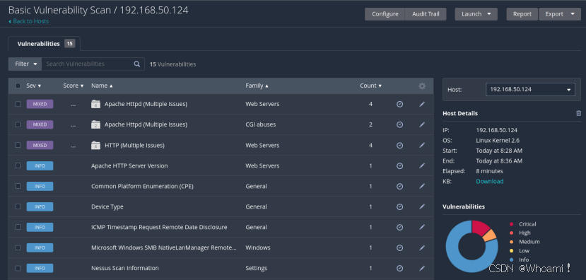

* **查看分组漏洞**（标记为"MIXED"）
  * 示例：<code><font style="color:rgb(199, 37, 78);background-color:rgb(245, 245, 245);">Apache Httpd (Multiple Issues)</font></code>
  * 显示：影响范围和漏洞数量

**<font style="color:rgb(51, 51, 51);">②点击Apache Httpd ( Multiple Issues)，它在 Family列下被列为Web Servers。</font>**

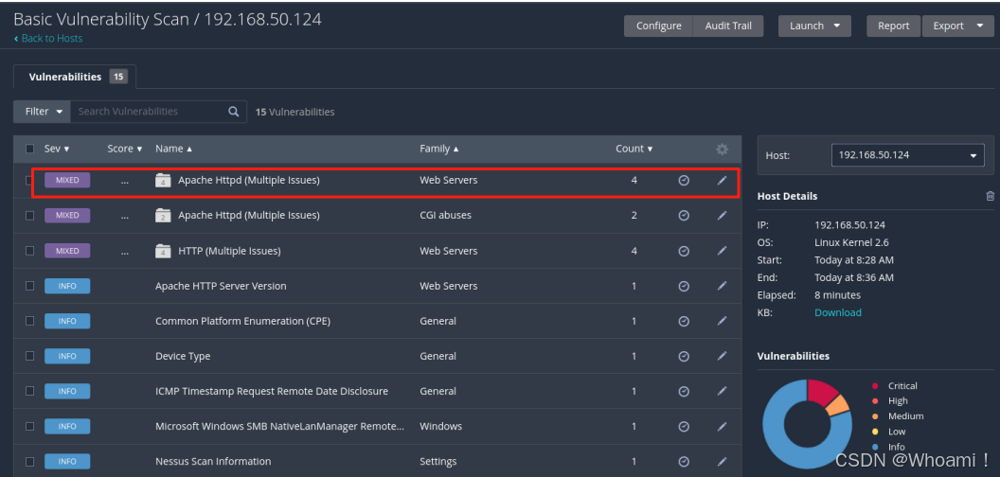

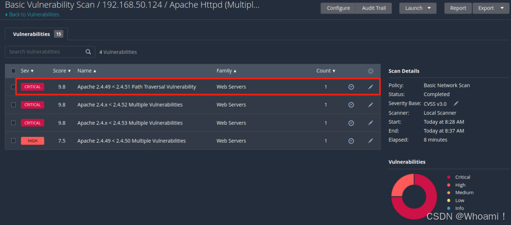

**<font style="color:rgb(51, 51, 51);">③点击Apache 2.4.49 < 2.4.51路径遍历漏洞，查看具体明细。</font>**

<font style="color:rgb(51, 51, 51);">每个发现都包含有关漏洞本身的大量信息，以及检测到它的插件。此外，还可以获得有关相关风险、利用状态和其他参考的大量信息。</font>

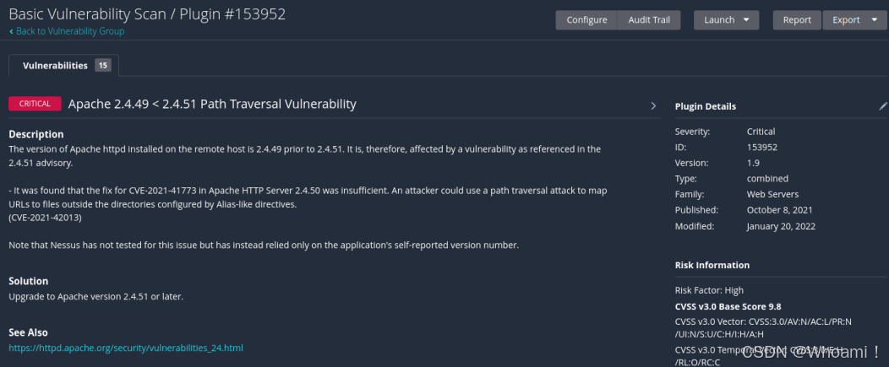

**<font style="color:rgb(51, 51, 51);">3. VPR优先级评级</font>**

<font style="color:rgb(51, 51, 51);"></font><font style="color:rgb(51, 51, 51);"> </font>**<font style="color:rgb(51, 51, 51);">VPR (Vulnerability Priority Rating)：\ </font>\*\*\*\*<font style="color:rgb(51, 51, 51);"> </font>**<font style="color:rgb(51, 51, 51);">虽然分析单个目标的发现会提供大量详细信息，但是希望获得所有目标中最重要的漏洞的概览。为此，Nessus提供了一个名为</font>**<font style="color:rgb(51, 51, 51);">VPRTop Threats</font>**<font style="color:rgb(51, 51, 51);">的功能，按优先级排序展示扫描中最重要的漏洞。它基于</font>**<font style="color:rgb(51, 51, 51);">Vulnerability Priority Rating (VPR)</font>**<font style="color:rgb(51, 51, 51);">，列出了前十个关键漏洞。</font>


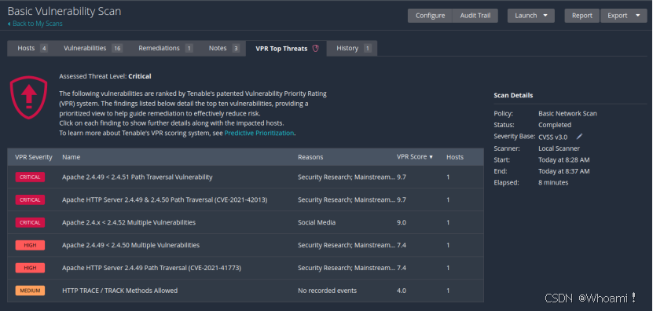

**<font style="color:rgb(51, 51, 51);">特点</font>**<font style="color:rgb(51, 51, 51);">：</font>

* 自动生成前10名关键漏洞
* 评分依据：可利用性+影响范围+威胁情报
* 示例显示6个漏洞（实际扫描结果较少时）

*<font style="background-color:rgb(240, 247, 255);">ℹ️</font>**<font style="background-color:rgb(240, 247, 255);"> </font>****<font style="background-color:rgb(240, 247, 255);">版本差异</font>**\_\_<font style="background-color:rgb(240, 247, 255);">：旧版可能无此标签，但每个漏洞仍含VPR值</font>*

**<font style="color:rgb(51, 51, 51);">4. 获取修复建议</font>**

**<font style="color:rgb(51, 51, 51);">修复信息位置</font>**<font style="color:rgb(51, 51, 51);">：</font>

* 每个漏洞详情页底部
* "Remediation"或"解决方案"区块

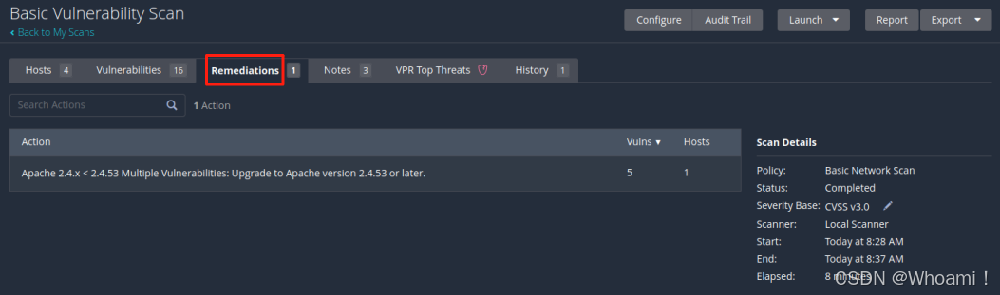

```java
1. **升级方案**  
   ✅ 安装Apache 2.4.51+版本  
   🔗 [官方下载链接](https://httpd.apache.org)


临时缓解

❌ 禁用mod_proxy模块

⚠️ 影响功能：反向代理服务


验证方法

httpd -v | grep "2.4.5[1-9]"</code></pre>
```

<code>**<font style="background-color:rgb(245, 245, 245);">5. 历史</font>**</code>

<font style="background-color:rgb(245, 245, 245);">此页面列出了使用此配置的所有漏洞扫描，使用它来查看或比较以前扫描的结果。</font>

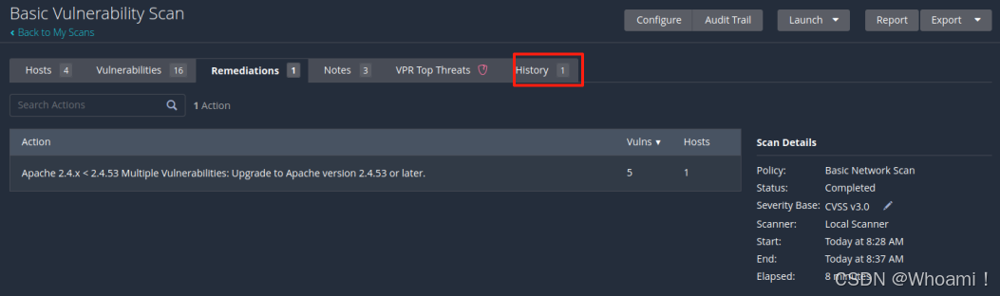

***

#### **<font style="color:rgb(79, 79, 79);background-color:rgb(245, 245, 245);">1.2.4.2 生成漏扫PDF报告</font>**

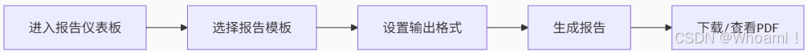

**<font style="background-color:rgb(245, 245, 245);">1. 报告生成路径</font>**

**<font style="background-color:rgb(245, 245, 245);">操作步骤</font>**<font style="background-color:rgb(245, 245, 245);">：</font>

* <font style="background-color:rgb(245, 245, 245);">扫描结果页 → 点击 </font><code>**<font style="color:rgb(199, 37, 78);background-color:rgb(245, 245, 245);">报告</font>**</code><font style="background-color:rgb(245, 245, 245);"> 按钮</font>
* <font style="background-color:rgb(245, 245, 245);">选择模板 → </font><code>**<font style="color:rgb(199, 37, 78);background-color:rgb(245, 245, 245);">按主机分组的详细漏洞</font>**</code>
* <font style="background-color:rgb(245, 245, 245);">设置格式 → </font><code>**<font style="color:rgb(199, 37, 78);background-color:rgb(245, 245, 245);">PDF</font>**</code>
* <font style="background-color:rgb(245, 245, 245);">点击 </font><code>**<font style="color:rgb(199, 37, 78);background-color:rgb(245, 245, 245);">生成报告</font>**</code>

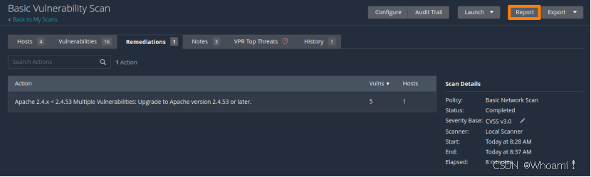

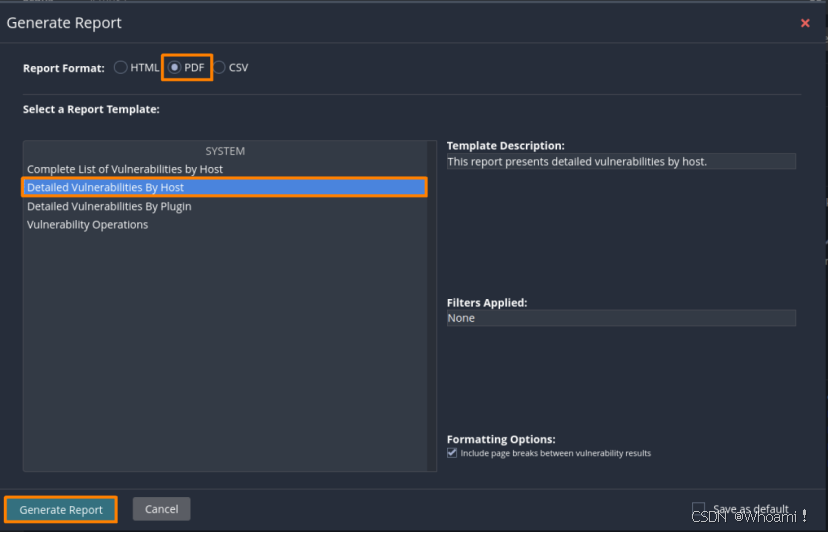

**<font style="background-color:rgb(245, 245, 245);">2. 核心报告模板对比</font>**

| **<font style="color:rgb(34, 34, 34);background-color:rgb(245, 245, 245);">模板类型</font>** | **<font style="color:rgb(34, 34, 34);background-color:rgb(245, 245, 245);">内容重点</font>** | **<font style="color:rgb(34, 34, 34);background-color:rgb(245, 245, 245);">适用场景</font>** | **<font style="color:rgb(34, 34, 34);background-color:rgb(245, 245, 245);">示例输出</font>** |
| :--- | :--- | :--- | :--- |
| **<font style="color:rgb(79, 79, 79);background-color:rgb(245, 245, 245);">详细漏洞按主机分组</font>** | <font style="color:rgb(79, 79, 79);background-color:rgb(245, 245, 245);">• 每主机完整漏洞明细   </font><font style="color:rgb(79, 79, 79);background-color:rgb(245, 245, 245);">• 含修复建议</font> | <font style="color:rgb(79, 79, 79);background-color:rgb(245, 245, 245);">深度分析</font> | <font style="color:rgb(79, 79, 79);background-color:rgb(245, 245, 245);">\[主机1]   </font><font style="color:rgb(79, 79, 79);background-color:rgb(245, 245, 245);">- 漏洞A详情   </font><font style="color:rgb(79, 79, 79);background-color:rgb(245, 245, 245);">- 漏洞B详情</font> |
| **<font style="color:rgb(79, 79, 79);background-color:rgb(245, 245, 245);">按主机完整漏洞</font>** | <font style="color:rgb(79, 79, 79);background-color:rgb(245, 245, 245);">• 主机漏洞摘要   </font><font style="color:rgb(79, 79, 79);background-color:rgb(245, 245, 245);">• 严重等级统计</font> | <font style="color:rgb(79, 79, 79);background-color:rgb(245, 245, 245);">快速概览</font> | <font style="color:rgb(79, 79, 79);background-color:rgb(245, 245, 245);">\[主机1]   </font><font style="color:rgb(79, 79, 79);background-color:rgb(245, 245, 245);">危急：3 高危：5</font> |
| **<font style="color:rgb(79, 79, 79);background-color:rgb(245, 245, 245);">合规审计报告</font>** | <font style="color:rgb(79, 79, 79);background-color:rgb(245, 245, 245);">• 策略符合性检查   </font><font style="color:rgb(79, 79, 79);background-color:rgb(245, 245, 245);">• 合规差距分析</font> | <font style="color:rgb(79, 79, 79);background-color:rgb(245, 245, 245);">合规审计</font> | <font style="color:rgb(79, 79, 79);background-color:rgb(245, 245, 245);">PCI DSS：82%符合</font> |
| **<font style="color:rgb(79, 79, 79);background-color:rgb(245, 245, 245);">执行摘要</font>** | <font style="color:rgb(79, 79, 79);background-color:rgb(245, 245, 245);">• 关键风险排名   </font><font style="color:rgb(79, 79, 79);background-color:rgb(245, 245, 245);">• 修复优先级</font> | <font style="color:rgb(79, 79, 79);background-color:rgb(245, 245, 245);">管理层汇报</font> | <font style="color:rgb(79, 79, 79);background-color:rgb(245, 245, 245);">Top 5 危急漏洞</font> |

*<font style="background-color:rgb(240, 247, 255);">💡</font>**<font style="background-color:rgb(240, 247, 255);"> 专业提示：</font>****<font style="background-color:rgb(240, 247, 255);">详细漏洞按主机分组</font>**\_\_<font style="background-color:rgb(240, 247, 255);">模板最适合技术团队进行修复</font>*

***

## **<font style="color:rgb(79, 79, 79);background-color:rgb(245, 245, 245);">1.3 Nessus漏洞扫描（进阶功能）</font>**

### <font style="color:rgb(34, 34, 34);background-color:rgb(245, 245, 245);">1.3.1 执行经过身份验证的漏洞扫描</font>

<font style="background-color:rgb(245, 245, 245);">向Nessus</font>**<font style="background-color:rgb(245, 245, 245);">提供凭据</font>**<font style="background-color:rgb(245, 245, 245);">执行</font>**<u><font style="background-color:rgb(245, 245, 245);">经过身份验证</font></u>**<font style="background-color:rgb(245, 245, 245);">的</font>**<font style="background-color:rgb(245, 245, 245);">漏洞扫描：\ </font>**<font style="background-color:rgb(245, 245, 245);">能提供更详细的信息，减少误报。\ </font><font style="background-color:rgb(245, 245, 245);">增加网络流量，在系统上产生噪音，如日志条目和AV通知。</font>

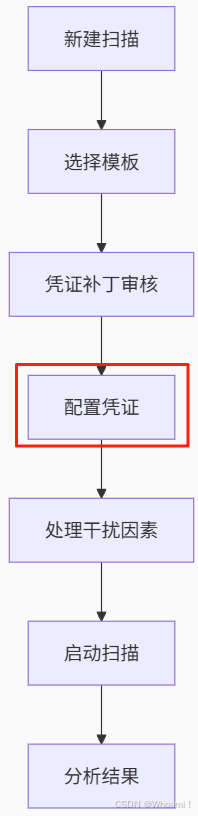

***

#### **<font style="color:rgb(79, 79, 79);background-color:rgb(245, 245, 245);">1.3.1.1 扫描模板选择</font>**

<font style="background-color:rgb(245, 245, 245);">首先，在Nessus仪表板上点击“New Scan”；</font>

<font style="background-color:rgb(245, 245, 245);">然后，选择扫描模版“</font>**<font style="background-color:rgb(245, 245, 245);">凭证补丁审核</font>**<font style="background-color:rgb(245, 245, 245);">” Credentialed Patch Audit。</font>

<font style="background-color:rgb(245, 245, 245);">再次，选择模版后，为扫描提供一个名称、设置扫描目标IP等。</font>

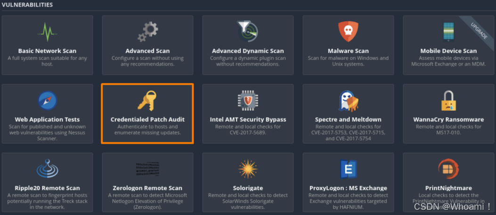

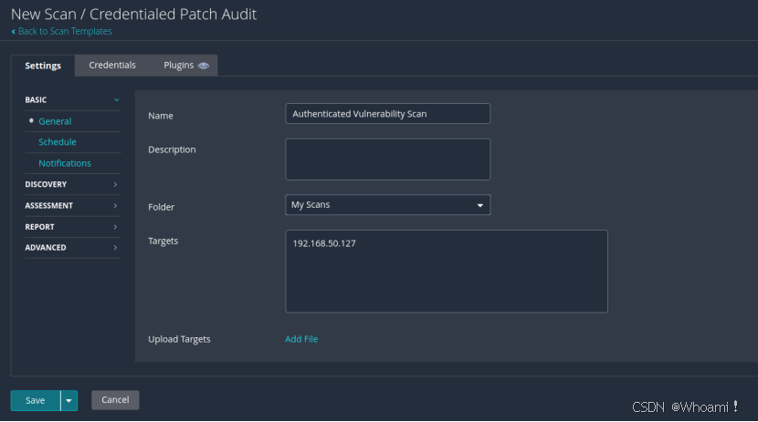

| **<font style="color:rgb(34, 34, 34);background-color:rgb(245, 245, 245);">模板类型对比</font>** | **<font style="color:rgb(34, 34, 34);background-color:rgb(245, 245, 245);">检测重点</font>** | **<font style="color:rgb(34, 34, 34);background-color:rgb(245, 245, 245);">认证优势</font>** | **<font style="color:rgb(34, 34, 34);background-color:rgb(245, 245, 245);">适用场景</font>** |
| :--- | :--- | :--- | :--- |
| **<font style="color:rgb(79, 79, 79);background-color:rgb(245, 245, 245);">凭证补丁审核</font>** | <font style="color:rgb(79, 79, 79);background-color:rgb(245, 245, 245);">• 缺失系统补丁   </font><font style="color:rgb(79, 79, 79);background-color:rgb(245, 245, 245);">• 过时应用漏洞</font> | <font style="color:rgb(79, 79, 79);background-color:rgb(245, 245, 245);">✅</font><font style="color:rgb(79, 79, 79);background-color:rgb(245, 245, 245);"> 减少50%误报</font> | <font style="color:rgb(79, 79, 79);background-color:rgb(245, 245, 245);">内部安全审计</font> |
| <font style="color:rgb(79, 79, 79);background-color:rgb(245, 245, 245);">基本网络扫描+凭证</font> | <font style="color:rgb(79, 79, 79);background-color:rgb(245, 245, 245);">全面漏洞检测</font> | <font style="color:rgb(79, 79, 79);background-color:rgb(245, 245, 245);">✅</font><font style="color:rgb(79, 79, 79);background-color:rgb(245, 245, 245);"> 深度系统检查</font> | <font style="color:rgb(79, 79, 79);background-color:rgb(245, 245, 245);">渗透测试</font> |
| <font style="color:rgb(79, 79, 79);background-color:rgb(245, 245, 245);">高级动态扫描+凭证</font> | <font style="color:rgb(79, 79, 79);background-color:rgb(245, 245, 245);">智能漏洞匹配</font> | <font style="color:rgb(79, 79, 79);background-color:rgb(245, 245, 245);">✅</font><font style="color:rgb(79, 79, 79);background-color:rgb(245, 245, 245);"> 高效资源利用</font> | <font style="color:rgb(79, 79, 79);background-color:rgb(245, 245, 245);">大型网络</font> |

*<font style="background-color:rgb(240, 247, 255);">💡</font>**<font style="background-color:rgb(240, 247, 255);"> </font>****<font style="background-color:rgb(240, 247, 255);">首选模板</font>**\_\_<font style="background-color:rgb(240, 247, 255);">：</font>*<code>_<font style="color:rgb(199, 37, 78);background-color:rgb(245, 245, 245);">凭证补丁审核</font>_</code>*<font style="background-color:rgb(240, 247, 255);">（预配置为对本地目标执行安全检查）</font>*

***

#### **<font style="color:rgb(79, 79, 79);background-color:rgb(245, 245, 245);">1.3.1.2 凭证配置流程</font>**

**<font style="background-color:rgb(245, 245, 245);">1.Linux/macOS配置</font>**


```java
认证协议: SSH
认证方式: 密码
用户名: offsec
密码: lab
提权方式: sudo
sudo用户: root
sudo密码: lab
```

<code>**<font style="background-color:rgb(245, 245, 245);">2.Windows配置</font>**</code>

<font style="background-color:rgb(245, 245, 245);">在Windows上也可以使用</font>**<font style="background-color:rgb(245, 245, 245);">SSH</font>**<font style="background-color:rgb(245, 245, 245);">，但大多数情况下，使用</font>**<font style="background-color:rgb(245, 245, 245);">服务器消息块（SMB）</font>**<font style="background-color:rgb(245, 245, 245);">和</font>**<font style="background-color:rgb(245, 245, 245);">Windows管理工具（WMI）</font>**<font style="background-color:rgb(245, 245, 245);">对Windows目标执行经过身份验证的漏洞扫描。\ </font><font style="background-color:rgb(245, 245, 245);">这两种方法都允许使用：</font>**<font style="background-color:rgb(245, 245, 245);">本地</font>**<font style="background-color:rgb(245, 245, 245);">或</font>**<font style="background-color:rgb(245, 245, 245);">域帐户</font>**<font style="background-color:rgb(245, 245, 245);">的不同的身份验证选项。</font>

**<font style="background-color:rgb(245, 245, 245);">配置路径</font>**<font style="background-color:rgb(245, 245, 245);">：</font>

* <font style="background-color:rgb(245, 245, 245);">扫描配置 → </font><code><font style="color:rgb(199, 37, 78);background-color:rgb(245, 245, 245);">凭证</font></code><font style="background-color:rgb(245, 245, 245);">选项卡</font>
* <font style="background-color:rgb(245, 245, 245);">选择主机认证类别</font>
* <font style="background-color:rgb(245, 245, 245);">填写认证信息</font>

<font style="background-color:rgb(245, 245, 245);">⚠️</font><font style="background-color:rgb(245, 245, 245);"> </font>**<font style="background-color:rgb(245, 245, 245);">认证扫描干扰因素处理</font>**

| **<font style="color:rgb(34, 34, 34);background-color:rgb(245, 245, 245);">干扰源</font>** | **<font style="color:rgb(34, 34, 34);background-color:rgb(245, 245, 245);">影响</font>** | **<font style="color:rgb(34, 34, 34);background-color:rgb(245, 245, 245);">解决方案</font>** |
| :--- | :--- | :--- |
| **<font style="color:rgb(79, 79, 79);background-color:rgb(245, 245, 245);">防火墙</font>** | <font style="color:rgb(79, 79, 79);background-color:rgb(245, 245, 245);">阻断扫描连接</font> | <font style="color:rgb(79, 79, 79);background-color:rgb(245, 245, 245);">• 添加扫描器IP白名单   </font><font style="color:rgb(79, 79, 79);background-color:rgb(245, 245, 245);">• 临时开放139/445端口</font> |
| **<font style="color:rgb(79, 79, 79);background-color:rgb(245, 245, 245);">杀毒软件</font>** | <font style="color:rgb(79, 79, 79);background-color:rgb(245, 245, 245);">终止扫描进程</font> | <font style="color:rgb(79, 79, 79);background-color:rgb(245, 245, 245);">• 添加Nessus进程例外   </font><font style="color:rgb(79, 79, 79);background-color:rgb(245, 245, 245);">• 临时禁用实时防护</font> |
| **<font style="color:rgb(79, 79, 79);background-color:rgb(245, 245, 245);">UAC(User Account Control)</font>** | <font style="color:rgb(79, 79, 79);background-color:rgb(245, 245, 245);">限制权限提升</font> | <font style="color:rgb(79, 79, 79);background-color:rgb(245, 245, 245);">• 注册表禁用UAC   </font><font style="color:rgb(79, 79, 79);background-color:rgb(245, 245, 245);">• 使用域管理员账户</font> |
| **<font style="color:rgb(79, 79, 79);background-color:rgb(245, 245, 245);">日志监控</font>** | <font style="color:rgb(79, 79, 79);background-color:rgb(245, 245, 245);">触发安全告警</font> | <font style="color:rgb(79, 79, 79);background-color:rgb(245, 245, 245);">• 协调维护窗口   </font><font style="color:rgb(79, 79, 79);background-color:rgb(245, 245, 245);">• 提前报备操作</font> |

*<font style="background-color:rgb(240, 247, 255);">🔒</font>**<font style="background-color:rgb(240, 247, 255);"> </font>****<font style="background-color:rgb(240, 247, 255);">安全建议</font>**\_\_<font style="background-color:rgb(240, 247, 255);">：扫描后立即恢复安全配置</font>*

***

#### **<font style="color:rgb(79, 79, 79);background-color:rgb(245, 245, 245);">1.3.1.3 分析漏扫结果</font>**

**<font style="background-color:rgb(245, 245, 245);">1.取消分组视图</font>**

**<font style="background-color:rgb(245, 245, 245);">操作路径</font>**<font style="background-color:rgb(245, 245, 245);">：</font>

```java
结果页 → 齿轮图标 → 禁用分组（Didable Groups）
```

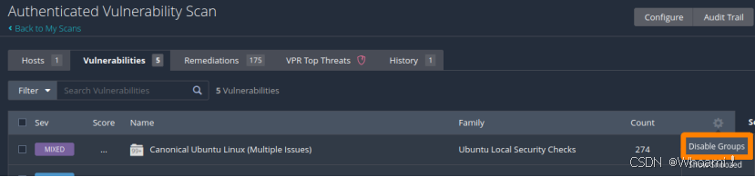

<font style="background-color:rgb(245, 245, 245);">禁用分组之后，每个发现的漏洞都会逐条列出，之前是分组在MIXED中。</font>

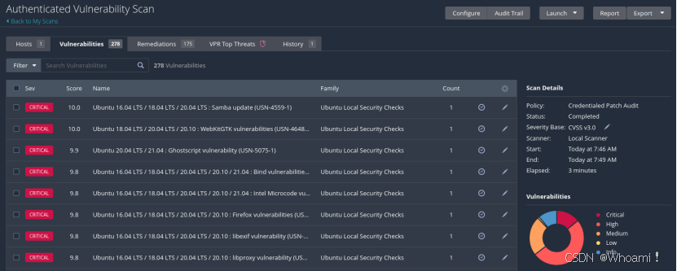

**<font style="background-color:rgb(245, 245, 245);">2.示例分析（Ubuntu本地安全检查）</font>**

<font style="background-color:rgb(245, 245, 245);"></font><font style="background-color:rgb(245, 245, 245);"> </font>**<font style="background-color:rgb(245, 245, 245);">名称列</font>**<font style="background-color:rgb(245, 245, 245);">提供了易受攻击的Ubuntu版本和简要描述，以及漏洞的补丁编号。列表还包含本地暴露应用程序的漏洞数据，例如</font>**<font style="background-color:rgb(245, 245, 245);">Firefox</font>**<font style="background-color:rgb(245, 245, 245);">或</font>**<font style="background-color:rgb(245, 245, 245);">cURL</font>**<font style="background-color:rgb(245, 245, 245);">。</font>

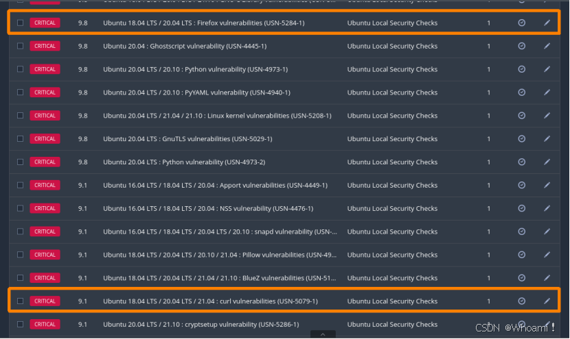

**<font style="background-color:rgb(245, 245, 245);">3.认证扫描最佳实践</font>**

* **<font style="background-color:rgb(245, 245, 245);">凭证管理</font>**<font style="background-color:rgb(245, 245, 245);">：</font>


* **<font style="background-color:rgb(245, 245, 245);">时间窗口</font>**<font style="background-color:rgb(245, 245, 245);">：</font>
  * <font style="background-color:rgb(245, 245, 245);">避开业务高峰时段</font>
  * <font style="background-color:rgb(245, 245, 245);">设置扫描速度限制</font>

*<font style="background-color:rgb(240, 247, 255);">📌</font>**<font style="background-color:rgb(240, 247, 255);"> </font>****<font style="background-color:rgb(240, 247, 255);">注意</font>**\_\_<font style="background-color:rgb(240, 247, 255);">：认证扫描会产生大量系统日志，需提前清理日志空间</font>*

***

### <font style="color:rgb(34, 34, 34);background-color:rgb(245, 245, 245);">1.3.2 使用</font>**<font style="color:rgb(79, 79, 79);background-color:rgb(245, 245, 245);">Nessus插件精准检测</font>**

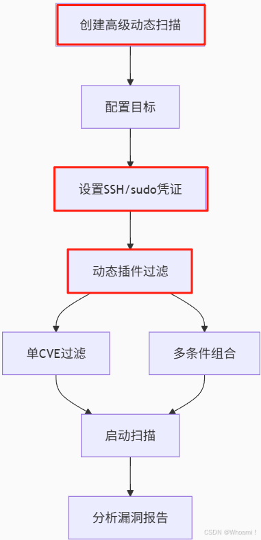

<font style="background-color:rgb(245, 245, 245);">以下示例针对 </font>**<font style="background-color:rgb(245, 245, 245);">CVE-2021-3156</font>**<font style="background-color:rgb(245, 245, 245);"> 使用</font>**<font style="background-color:rgb(245, 245, 245);">Nessus插件进行精准检测。</font>**<font style="background-color:rgb(245, 245, 245);"> CVE-2021-3156 是一个</font>**<font style="background-color:rgb(245, 245, 245);">本地权限提升漏洞</font>**<font style="background-color:rgb(245, 245, 245);">，允许非特权用户获得 </font>**<font style="background-color:rgb(245, 245, 245);">root</font>**<font style="background-color:rgb(245, 245, 245);"> 权限。</font>

* **<font style="background-color:rgb(245, 245, 245);">核心功能：</font>**<font style="background-color:rgb(245, 245, 245);"> Nessus 默认运行大量插件，但支持通过设置</font>**<font style="background-color:rgb(245, 245, 245);">插件过滤器</font>**<font style="background-color:rgb(245, 245, 245);">来快速运行</font>**<font style="background-color:rgb(245, 245, 245);">单个插件</font>**<font style="background-color:rgb(245, 245, 245);">。</font>
* **<font style="background-color:rgb(245, 245, 245);">用途：</font>**<font style="background-color:rgb(245, 245, 245);"> 此功能用于</font>**<font style="background-color:rgb(245, 245, 245);">验证先前发现</font>**<font style="background-color:rgb(245, 245, 245);">或</font>**<font style="background-color:rgb(245, 245, 245);">快速扫描特定漏洞</font>**<font style="background-color:rgb(245, 245, 245);">。</font>

#### **<font style="color:rgb(79, 79, 79);background-color:rgb(245, 245, 245);">1.3.2.1 创建高级动态扫描</font>**

| **<font style="color:rgb(34, 34, 34);background-color:rgb(245, 245, 245);">顺序</font>** | **<font style="color:rgb(34, 34, 34);background-color:rgb(245, 245, 245);">配置项</font>** | **<font style="color:rgb(34, 34, 34);background-color:rgb(245, 245, 245);">示例值</font>** | **<font style="color:rgb(34, 34, 34);background-color:rgb(245, 245, 245);">说明</font>** |
| :--- | :--- | :--- | :--- |
| <font style="color:rgb(79, 79, 79);background-color:rgb(245, 245, 245);">1</font> | <font style="color:rgb(79, 79, 79);background-color:rgb(245, 245, 245);">模板选择</font> | <font style="color:rgb(79, 79, 79);background-color:rgb(245, 245, 245);">高级动态扫描 模版</font> | <font style="color:rgb(79, 79, 79);background-color:rgb(245, 245, 245);">智能插件匹配</font> |
| <font style="color:rgb(79, 79, 79);background-color:rgb(245, 245, 245);">2</font> | <font style="color:rgb(79, 79, 79);background-color:rgb(245, 245, 245);">扫描名称</font> | <font style="color:rgb(79, 79, 79);background-color:rgb(245, 245, 245);">CVE-2021-3156专项检测</font> | <font style="color:rgb(79, 79, 79);background-color:rgb(245, 245, 245);">明确检测目标</font> |
| <font style="color:rgb(79, 79, 79);background-color:rgb(245, 245, 245);">3</font> | <font style="color:rgb(79, 79, 79);background-color:rgb(245, 245, 245);">目标IP</font> | <font style="color:rgb(79, 79, 79);background-color:rgb(245, 245, 245);">192.168.50.127 (DESKTOP)</font> | <font style="color:rgb(79, 79, 79);background-color:rgb(245, 245, 245);">精准定位主机</font> |
| <font style="color:rgb(79, 79, 79);background-color:rgb(245, 245, 245);">4</font> | <font style="color:rgb(79, 79, 79);background-color:rgb(245, 245, 245);">认证方式</font> | <font style="color:rgb(79, 79, 79);background-color:rgb(245, 245, 245);">SSH + sudo提权</font> | <font style="color:rgb(79, 79, 79);background-color:rgb(245, 245, 245);">深度系统访问</font> |

*<font style="background-color:rgb(240, 247, 255);">🔐</font>****<font style="background-color:rgb(240, 247, 255);"> </font>******<font style="background-color:rgb(240, 247, 255);">凭证配置：</font>**\_\_<font style="background-color:rgb(240, 247, 255);">用户</font>*<code>_<font style="color:rgb(199, 37, 78);background-color:rgb(245, 245, 245);">offsec</font>_</code>*<font style="background-color:rgb(240, 247, 255);"> 密码</font>*<code>_<font style="color:rgb(199, 37, 78);background-color:rgb(245, 245, 245);">lab</font>_</code>*<font style="background-color:rgb(240, 247, 255);">，sudo用户</font>*<code>_<font style="color:rgb(199, 37, 78);background-color:rgb(245, 245, 245);">root</font>_</code>

<font style="background-color:rgb(245, 245, 245);">以下为具体配置界面：</font>

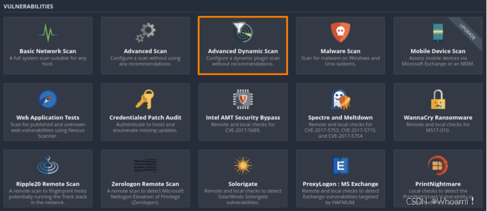

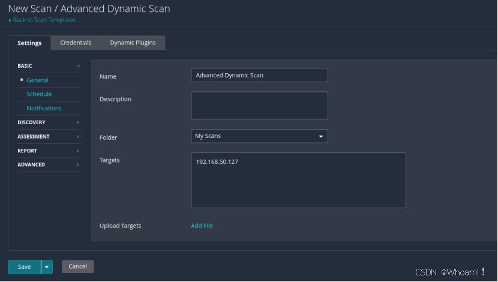

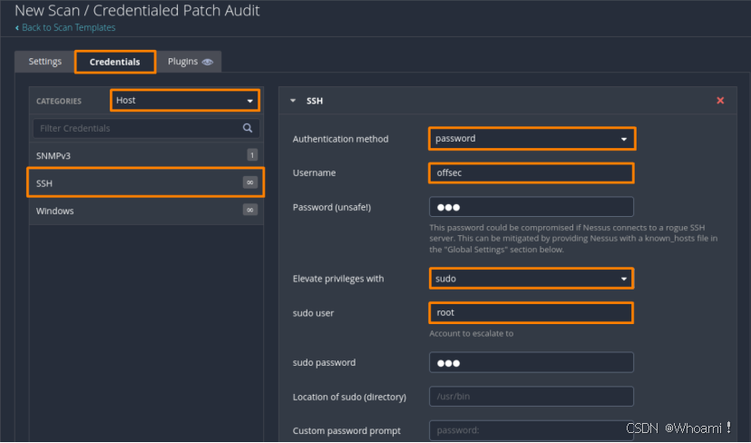

***

#### **<font style="color:rgb(79, 79, 79);background-color:rgb(245, 245, 245);">1.3.2.2 使用单一插件过滤器</font>**


**<font style="background-color:rgb(245, 245, 245);">高级动态扫描：</font>**<font style="background-color:rgb(245, 245, 245);">允许使用</font>**<font style="background-color:rgb(245, 245, 245);">过滤器，</font>**<font style="background-color:rgb(245, 245, 245);">而不是启用或禁用组或单个插件。</font>

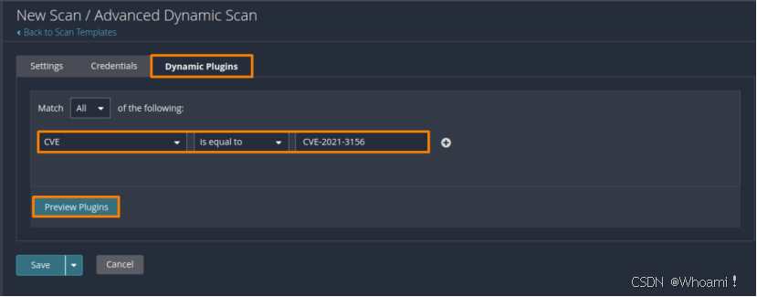

**<font style="background-color:rgb(245, 245, 245);">执行效果</font>**<font style="background-color:rgb(245, 245, 245);">：</font>

* <font style="background-color:rgb(245, 245, 245);">⏱️</font><font style="background-color:rgb(245, 245, 245);"> 预览耗时：2-5分钟（依赖库规模）</font>
* <font style="background-color:rgb(245, 245, 245);">📋</font><font style="background-color:rgb(245, 245, 245);"> 输出：匹配的插件家族列表</font>
* <font style="background-color:rgb(245, 245, 245);">💡</font><font style="background-color:rgb(245, 245, 245);"> 优势：快速定位特定漏洞检测能力</font>

<font style="background-color:rgb(245, 245, 245);">最后，点击“开始扫描”，等待结果。</font>


***

#### **<font style="color:rgb(79, 79, 79);background-color:rgb(245, 245, 245);">1.3.2.3 多过滤器组合</font>**

* **<font style="background-color:rgb(245, 245, 245);">功能核心：</font>**<font style="background-color:rgb(245, 245, 245);"> 动态插件过滤器支持</font>**<font style="background-color:rgb(245, 245, 245);">组合多个过滤器</font>**<font style="background-color:rgb(245, 245, 245);">；</font>
* **<font style="background-color:rgb(245, 245, 245);">应用场景：</font>**<font style="background-color:rgb(245, 245, 245);"> 示例中通过添加</font>**<font style="background-color:rgb(245, 245, 245);">第二个过滤器</font>**<font style="background-color:rgb(245, 245, 245);">指定</font>**<font style="background-color:rgb(245, 245, 245);">Ubuntu Linux插件家族</font>**<font style="background-color:rgb(245, 245, 245);">，缩小扫描范围；</font>
* **<font style="background-color:rgb(245, 245, 245);">操作方式：</font>**<font style="background-color:rgb(245, 245, 245);"> 通过点击现有过滤器旁边的</font>**<font style="background-color:rgb(245, 245, 245);">加号按钮</font>**<font style="background-color:rgb(245, 245, 245);">添加新过滤器。</font>

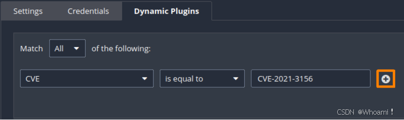

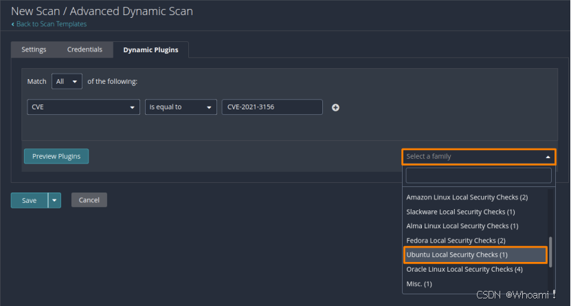

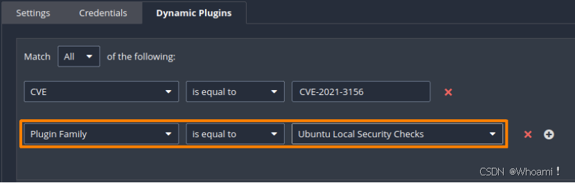

<font style="background-color:rgb(245, 245, 245);">最后，点击“开始扫描”，等待结果。</font>


***

#### **<font style="color:rgb(79, 79, 79);background-color:rgb(245, 245, 245);">1.3.2.4 扫描结果分析</font>**

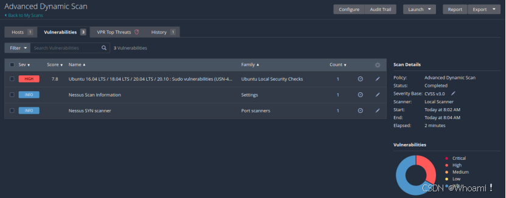

<font style="background-color:rgb(245, 245, 245);">上图中列出了一个严重程度为高的发现，这是由</font>**<font style="background-color:rgb(245, 245, 245);">指定的插件</font>**<font style="background-color:rgb(245, 245, 245);">发现的，使用了我们的动态插件过滤器。下图显示了该发现的详细信息，确认目标确实存在CVE-2021-3156的漏洞。</font>

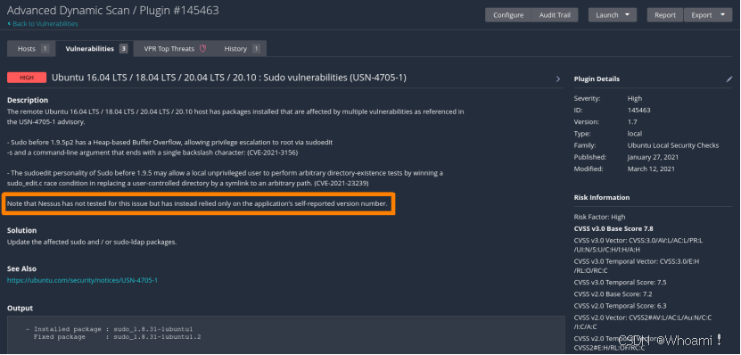

<font style="background-color:rgb(245, 245, 245);">📌</font><font style="background-color:rgb(245, 245, 245);"> </font>**<font style="background-color:rgb(245, 245, 245);">插件使用最佳实践</font>**

**<font style="background-color:rgb(245, 245, 245);">适用场景对比</font>**

| **<font style="color:rgb(34, 34, 34);background-color:rgb(245, 245, 245);">场景</font>** | **<font style="color:rgb(34, 34, 34);background-color:rgb(245, 245, 245);">推荐方法</font>** | **<font style="color:rgb(34, 34, 34);background-color:rgb(245, 245, 245);">优势</font>** |
| :--- | :--- | :--- |
| <font style="color:rgb(79, 79, 79);background-color:rgb(245, 245, 245);">漏洞验证</font> | <font style="color:rgb(79, 79, 79);background-color:rgb(245, 245, 245);">单CVE过滤</font> | <font style="color:rgb(79, 79, 79);background-color:rgb(245, 245, 245);">精准快速</font> |
| <font style="color:rgb(79, 79, 79);background-color:rgb(245, 245, 245);">系统普查</font> | <font style="color:rgb(79, 79, 79);background-color:rgb(245, 245, 245);">多条件组合</font> | <font style="color:rgb(79, 79, 79);background-color:rgb(245, 245, 245);">减少误报</font> |
| <font style="color:rgb(79, 79, 79);background-color:rgb(245, 245, 245);">合规审计</font> | <font style="color:rgb(79, 79, 79);background-color:rgb(245, 245, 245);">插件族过滤</font> | <font style="color:rgb(79, 79, 79);background-color:rgb(245, 245, 245);">批量检测</font> |

*<font style="background-color:rgb(240, 247, 255);">💡</font>**<font style="background-color:rgb(240, 247, 255);"> </font>****<font style="background-color:rgb(240, 247, 255);">专业提示</font>**\_\_<font style="background-color:rgb(240, 247, 255);">：对关键漏洞创建永久过滤模板，文件名标注CVE编号便于追溯。</font>*


> 更新: 2025-11-19 15:01:58  
> 原文: <https://www.yuque.com/lixinsi/yzypfx/upxae1ggfdy3nk5k>