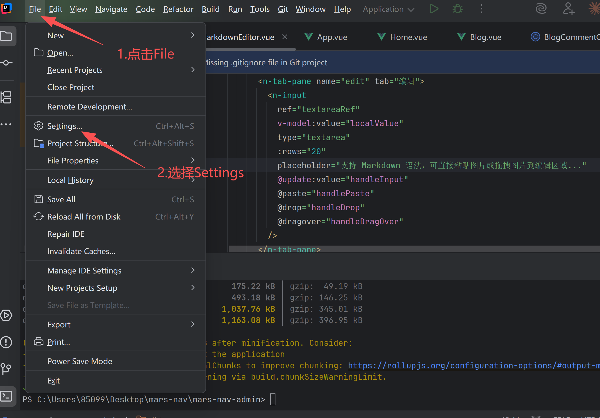
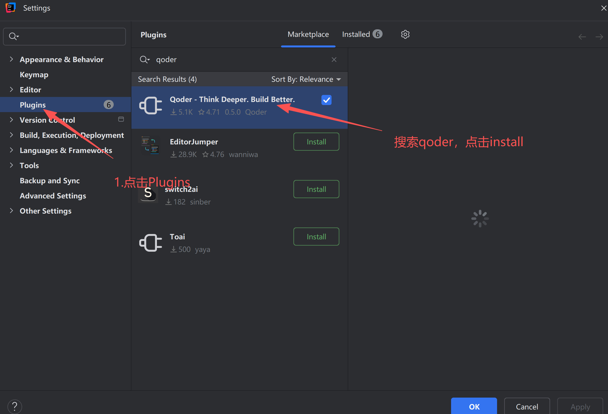

# 阿里 Qoder AI 编程插件 IDEA 安装教程

## 1.产品介绍
阿里 Qoder 是一款面向 Java 开发者的 AI 编程插件，集成了代码生成、注释生成、单测生成、代码重构、模型调用等功能，可显著提升企业级开发效率。本教程将介绍如何在 IntelliJ IDEA 中安装、配置和使用 Qoder 插件。

## 2.官网地址
直接访问地址：[https://qoder.com/](https://qoder.com/)

## 3.产品价格
我的天价格pro价格才2美元 14快钱一个月，还不赶快冲兄弟们  

## 4. 安装插件
1. 打开：File → Settings → Plugins

1. 搜索：Qoder

1. 点击 Install
2. 重启 IDEA

> 更新: 2025-11-19 14:57:52  
> 原文: <https://www.yuque.com/lixinsi/yzypfx/vbouuer49h6vduyv>