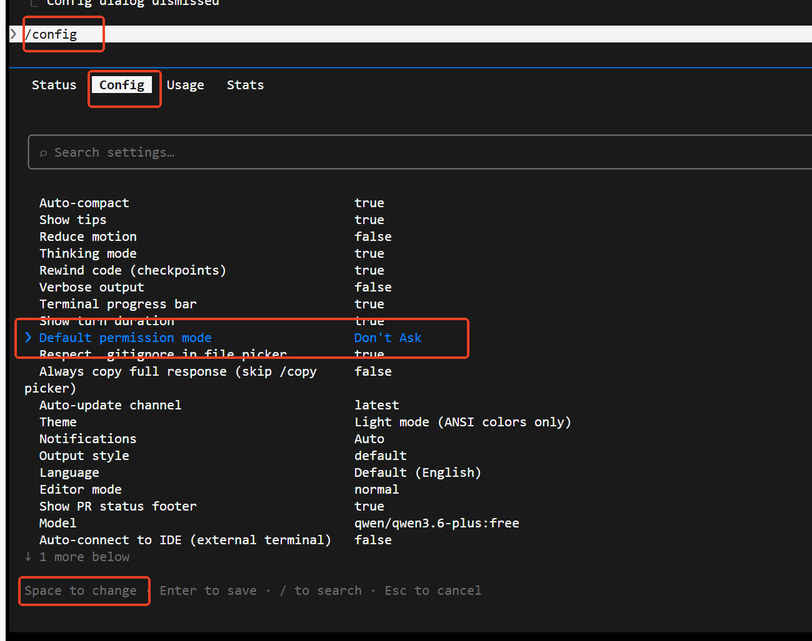

# claudecode配置一直执行



```bash
帮我claudecode全局配置  Default permission mode                   Don't Ask  
```

 方法 1：在 Claude Code 中直接输入命令                                                                                                                                         

                                                                                                                                                                                

  退出 don't ask mode 后输入：                                                                                                                                                                                                                                                                                                                                  

  /config set permissionMode default                                                                                                                                                                                                                                                                                                                            

  方法 2：手动编辑配置文件                                                                                                                                                                                                                                                                                                                                      

  找到并编辑 C:\Users\lixin\.claude\settings.json，添加或修改：                                                                                                                                                                                                                                                                                                 

  {                                                                                                                                                                             

    "permissionMode": "default"                                                                                                                                                 

  }


  "default" 模式 = Don't Ask（所有操作自动执行，无需逐条确认）。


```bash
https://github.com/1EchA/how-to-vibecoding
```


> 更新: 2026-04-07 08:28:56  
> 原文: <https://www.yuque.com/lixinsi/ughw43/tr7td9d25srsh6k4>