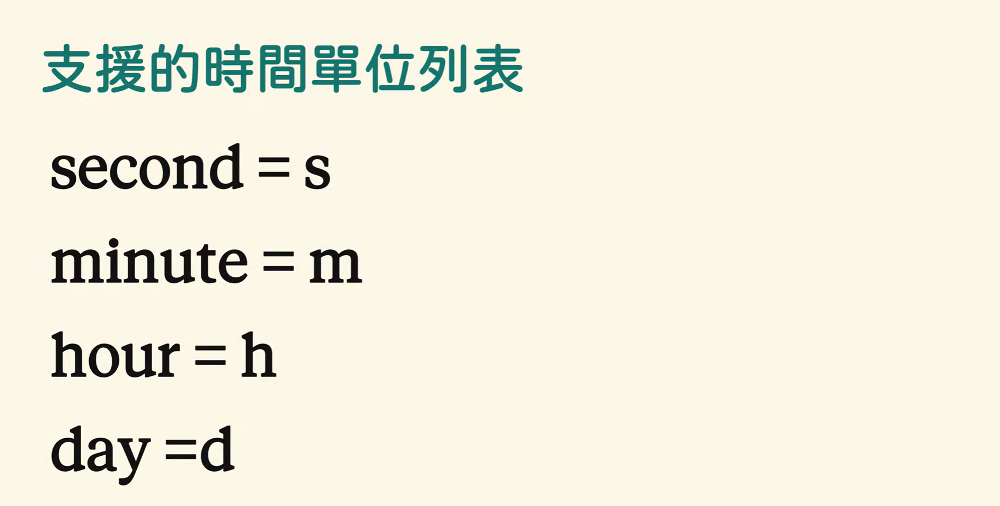

# loop配置

### loop 使用
### 指令
```bash
 /loop 10m 帮我看一下    
 45分钟后跑npm run dev看看有没有过
 2个小时后跑npm run build看看有没有过

 我现在有什么排程任务  
 帮我看看现在有什么定时任务 
```




> 更新: 2026-04-07 10:03:24  
> 原文: <https://www.yuque.com/lixinsi/ughw43/nb55ztyy12as475l>