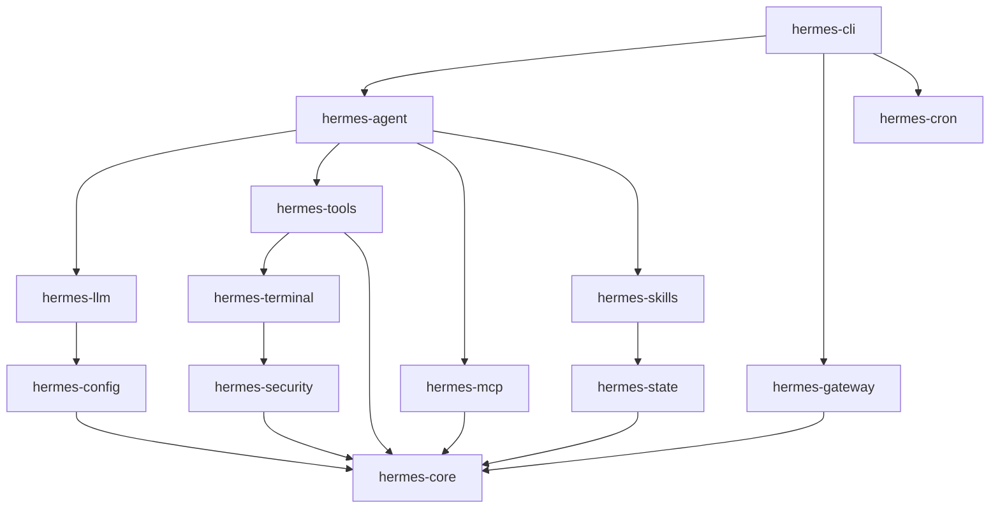

# 重构hermes-agent rust版本

```bash
收到！看来你的 **ImageToPro (CLIP Interrogator)** 项目已经完美收官，所有核心组件（后端、扩展、模型、文档）均已就绪且状态健康。🎉

既然你之前对 **用 Rust 重写 AI Agent 框架** 表现出浓厚的兴趣，结合当前这个已完成的 Python 项目，我有以下几个建议供你参考：

### 1. 保持现状，立即投入使用
如果你现在的目标是**快速出成果**或**交付使用**，那么当前的 Python 版本已经非常完善：
*   ✅ **离线可用**：模型已本地化，无需担心网络延迟。
*   ✅ **架构清晰**：有完整的 `CLAUDE.md` 和架构文档，便于后续维护。
*   ✅ **即开即用**：`quickstart.py` 和 `start.bat` 让启动变得极其简单。
*   **建议**：直接运行 `python quickstart.py` 开始体验或进行实际的图片标注工作。

### 2. 进阶挑战：性能瓶颈分析与 Rust 重构预演
如果你想将这个成熟的项目作为**下一个 Rust 重构的练手对象**（类似之前的 hermes-agent），我们可以先做一个“非侵入式”的性能评估：

*   **冷启动速度**：Python 加载 BLIP/CLIP 模型通常需要几秒到十几秒。Rust (通过 `candle` 或 `burn` 框架) 能否将其压缩到毫秒级？
*   **并发推理**：当前 WebSocket 服务在处理多张图片并发请求时，是否受限于 Python 的 GIL？Rust 的异步运行时是否能带来线性提升？
*   **内存占用**：Python 进程常驻内存较大，Rust 编译后的二进制文件是否能将 footprint 降低 50% 以上？

**如果你感兴趣，我可以帮你制定一个《ImageToPro Rust 重构路线图》，重点包括：**
*   如何用 Rust 的 `candle-transformers` 替换 Python 的 `transformers` 加载模型。
*   如何保留现有的 WebSocket 协议，仅替换后端计算引擎。
*   如何将 Chrome 扩展与新的 Rust 后端无缝对接。

### 3. 功能扩展
在现有架构基础上，是否需要增加新功能？
*   **批量处理模式**：支持上传文件夹，自动排队处理所有图片。
*   **自定义词库**：允许用户上传自己的标签集合，提高标注准确率。
*   **API 封装**：除了 WebSocket，提供一个 RESTful API 供其他程序调用。

**你现在想做什么？**
*   🚀 **A. 直接启动服务器**，开始使用工具。
*   💡 **B. 探讨 Rust 重构可行性**，看看能不能把这个也变成高性能二进制应用。
*   🛠️ **C. 增加新功能**，优化现有的工作流。
*   📝 **D. 生成一份发布说明 (Release Notes)**，方便分享给团队成员或用户。

请告诉我你的选择！
```

````bash
这是一份为您定制的 **Hermes-RS 重构开发文档**。

这份文档基于您提供的架构设计、技术选型以及核心痛点分析整理而成，旨在作为项目的“宪法”和开发指南，确保后续开发严格遵循 Rust 的最佳实践（Idiomatic Rust），并维持高性能、高安全性的目标。

---

# Hermes-RS: 高性能自进化 AI Agent 框架重构文档

**版本**: 1.0.0  
**状态**: 初始设计/开发中  
**作者**: [您的名字]  
**日期**: 2026-04-02  

## 1. 项目愿景与背景 (Vision & Context)

### 1.1 背景
Hermes-Agent (Python版) 是一个功能强大的自进化 AI Agent 框架，拥有近 20.7k Star。然而，其 Python 实现存在显著的工程化瓶颈：
*   **性能低下**: 冷启动慢 (3-5s)，内存占用高 (>200MB)。
*   **并发模型复杂**: `asyncio` 与 `threading` 混合导致严重的 sync/async 桥接地狱。
*   **类型不安全**: 缺乏编译时检查，运行时错误频发。
*   **部署困难**: 依赖链复杂 (Python env, pip, Node.js for MCP)。

### 1.2 目标
使用 **Rust** 全量重写 Hermes-Agent，命名为 **Hermes-RS**。
*   **极致性能**: 毫秒级启动，低内存 footprint (<20MB idle)，单二进制文件分发。
*   **类型安全**: 利用 Rust 类型系统消除运行时错误，通过 Trait 系统实现高度抽象。
*   **模块化架构**: 拆分为 13 个 Crate，实现关注点分离和增量编译优化。
*   **零迁移成本**: 完全兼容原版 YAML/.env 配置格式。

---

## 2. 架构设计 (Architecture)

### 2.1 模块拓扑 (Module Topology)
项目采用 **DAG (有向无环图)** 依赖结构，严禁循环依赖。所有 Crate 位于 `crates/` 目录下。

```text
hermes-rs/
├── Cargo.toml          # Workspace 定义
├── crates/
│   ├── hermes-core/        # [基础] 共享类型定义 (Message, ToolCall, Platform, Error)
│   ├── hermes-config/      # [配置] YAML/.env/SOUL.md 加载与合并逻辑
│   ├── hermes-security/    # [安全] 注入扫描、Env 过滤、Path 防护
│   ├── hermes-state/       # [状态] SQLite + FTS5 持久化与搜索
│   ├── hermes-llm/         # [接口] LLM Client Trait 及 OpenAI/Anthropic 实现
│   ├── hermes-terminal/    # [执行] TerminalBackend Trait (Local/Docker)
│   ├── hermes-skills/      # [技能] SKILL.md 解析、CRUD、自进化逻辑
│   ├── hermes-tools/       # [工具] ToolHandler Trait 注册表及内置工具
│   ├── hermes-mcp/         # [协议] MCP Client (stdio/JSON-RPC)
│   ├── hermes-agent/       # [核心] Agent Loop, Context Management, Orchestration
│   ├── hermes-gateway/     # [网关] PlatformAdapter Trait 及多平台适配器
│   ├── hermes-cron/        # [调度] 定时任务调度器
│   └── hermes-cli/         # [入口] CLI UI (Clap + TUI)
````

### 2.2 依赖关系图 (Dependency Graph)



### 2.3 核心设计原则

1. **Trait-Based Polymorphism**: 所有可扩展组件必须通过 Trait定义接口。
2. **Async-First**: 整个应用运行在单一 `tokio` Runtime 上，禁止阻塞主线程。
3. **Error Propagation**: 库 Crate 使用 `thiserror`，应用 Crate 使用 `anyhow`。
4. **Zero-Copy Serialization**: 尽可能使用 `serde` 的高效特性，避免不必要的克隆。

***

## 3. 核心技术栈 (Tech Stack)

| 组件 | 选型 | 理由 |
| :--- | :--- | :--- |
| **Async Runtime** | `tokio` | 生态最成熟，性能最优，社区标准。 |
| **HTTP Client** | `reqwest` | 原生支持 SSE Streaming，TLS 支持完善。 |
| **Serialization** | `serde`, `serde_json`, `serde_yaml` | Rust 序列化事实标准，零拷贝反序列化支持。 |
| **Database** | `rusqlite` (bundled) | 零外部依赖，嵌入式 SQLite，支持 FTS5。 |
| **Error Handling** | `thiserror` (Lib), `anyhow` (App) | 标准化错误处理链路。 |
| **CLI Parsing** | `clap` (derive) declarative | 类型安全的命令行参数解析。 |
| **Logging** | `tracing` + `tracing-subscriber` | 结构化日志，异步友好，性能极高。 |
| **Docker API** | `bollard` | 直接调用 Docker Engine API，无需 CLI 依赖。 |
| **Concurrency** | `tokio::sync::mpsc`, `JoinSet` | 高效的消息传递和任务并行管理。 |

***

## 4. 核心抽象层详细设计 (Core Abstractions)

### 4.1 LlmClient (LLM 交互抽象)

解决 Python 版本中复杂的 API分支判断问题。

```rust
// crates/hermes-llm/src/lib.rs
use async_trait::async_trait;
use hermes_core::{CompletionRequest, CompletionResponse, StreamDelta};
use tokio::sync::mpsc;

#[async_trait]
pub trait LlmClient: Send + Sync {
    /// 非流式完成
    async fn complete(&self, req: &CompletionRequest) -> Result<CompletionResponse, LlmError>;
    
    /// 流式完成
    async fn stream(
        &self, 
        req: &CompletionRequest,
        tx: mpsc::Sender<StreamDelta>
    ) -> Result<CompletionResponse, LlmError>;
}

// 实现示例: OpenAiClient, AnthropicClient 等分别实现此 Trait
```

### 4.2 ToolHandler (工具执行抽象)

支持静态注册（编译时已知）和动态注册（MCP发现）。

```rust
// crates/hermes-tools/src/lib.rs
use async_trait::async_trait;
use serde_json::Value;
use hermes_core::ToolContext;

#[async_trait]
pub trait ToolHandler: Send + Sync {
    fn name(&self) -> &str;
    fn description(&self) -> &str;
    fn parameters_schema(&self) -> Value; // JSON Schema
    
    async fn execute(&self, args: Value, ctx: &ToolContext) -> Result<String, ToolError>;
}

// Registry 内部使用 RwLock<HashMap<String, Box<dyn ToolHandler>>>
```

### 4.3 TerminalBackend (执行环境抽象)

统一本地执行和容器执行接口，增强安全性。

```rust
// crates/hermes-terminal/src/lib.rs
use async_trait::async_trait;
use std::time::Duration;
use hermes_core::ExecResult;

#[async_trait]
pub trait TerminalBackend: Send + Sync {
    async fn execute(
        &self, 
        cmd: &str, 
        cwd: Option<&str>,
        timeout: Option<Duration>,
        env_whitelist: Option<Vec<String>> // 安全增强
    ) -> Result<ExecResult, TerminalError>;
    
    async fn cleanup(&self) -> Result<(), TerminalError>;
}
```

### 4.4 PlatformAdapter (消息平台抽象)

新增平台只需实现此 Trait，无需修改核心逻辑。

```rust
// crates/hermes-gateway/src/lib.rs
use async_trait::async_trait;
use hermes_core::{Platform, MessageHandler, SendResult};

#[async_trait]
pub trait PlatformAdapter: Send + Sync {
    fn platform(&self) -> Platform;
    
    async fn connect(&mut self) -> Result<(), GatewayError>;
    
    async fn send(
        &self, 
        chat_id: &str, 
        content: &str,
        reply_to: Option<&str>
    ) -> Result<SendResult, GatewayError>;
    
    fn set_message_handler(&mut self, handler: MessageHandler);
}
```

***

## 5. 关键模块实现规范

### 5.1 hermes-config: 配置加载策略

* **优先级**: 环境变量 > 项目本地 `.hermes/config.yaml` > 全局 `~/.hermes/config.yaml` > 默认值。
* **兼容性**: 结构体字段需标记 `#[serde(default)]` 以兼容旧配置或残缺配置。
* **人格加载**: 自动读取项目根目录下的 `SOUL.md` 并注入到 System Prompt模板中。

### 5.2 hermes-security: 编译时与运行时安全

* **路径遍历防护**: 在 `TerminalBackend` 执行前，强制校验 `cwd` 是否在允许的沙箱目录内。
* **环境变量过滤**: 默认阻断所有环境变量注入，除非显式在白名单中声明。
* **Prompt 注入扫描**: 在发送给 LLM 之前，对用户输入进行正则匹配扫描（可选配置）。

### 5.3 hermes-state: 持久化与搜索

* **Schema**: 使用 Rusqlite 管理会话历史、技能元数据。
* **FTS5**: 启用 SQLite FTS5扩展，支持对历史对话和技能描述进行全文检索。
* **Migration**: 内置简单的版本迁移逻辑，确保数据库结构升级平滑。

### 5.4 hermes-agent: 核心循环

* **Context Window Management**: 实现滑动窗口或摘要压缩策略，防止 Token 溢出。
* **Parallel Tool Execution**: 使用 `tokio::task::JoinSet` 并行执行无依赖关系的工具调用。
* **Self-Evolution**: 监听任务完成信号，触发 `hermes-skills` 模块生成新的 \`SKILL.md。

***

## 6. 开发工作流与规范 (Workflow)

### 6.1 代码风格

* 遵循 `rustfmt` 默认配置。
* 遵循 `clippy` 所有警告 (`cargo clippy -- -D warnings`)。
* 所有公共 API 必须有文档注释 (`///`)。

### 6.2 错误处理

* **Lib Crates**: 定义具体的 Error Enum，实现 `std::error::Error`。
* **App Crates**: 使用 `anyhow::Result` 进行透传，仅在边界处转换为具体错误响应。
* **禁止 unwrap()**: 在生产代码中严禁使用 `unwrap()` 或 `expect()`，必须使用 `?` 或匹配处理。

### 6.3 测试策略

* **Unit Tests**: 每个 Crate 内部包含单元测试，覆盖核心逻辑。
* **Integration Tests**: `tests/` 目录下存放端到端测试，模拟 LLM 响应（Mock）。
* **Benchmark**: 使用 `criterion` 对关键路径（如序列化工具调用、SQLite查询）进行基准测试。

### 6.4 构建与发布

* **Cross-Compilation**: 使用 `cross` 或 `cargo-zigbuild` 构建 Linux/macOS/Windows 静态二进制文件。
* **Feature Flags**:
  * `telegram`: 启用 Telegram 适配器。
  * `discord`: 启用 Discord 适配器。
  * `docker`: 启用 Docker backend。
  * 默认只开启核心功能，按需编译减小体积。

***

## 7. 迁移指南 (Migration Guide for Users)

由于实现了**零迁移成本配置兼容**，用户只需替换二进制文件：

1. 备份原有的 `~/.hermes/` 目录。
2. 下载 `hermes-rs` 二进制文件。
3. 运行 `hermes-rs init` (如果需要初始化新结构，否则直接复用)。
4. 原有 `config.yaml` 无需修改即可直接运行。

**注意**: Python 版本的自定义 Python 脚本工具需要重写为 Rust 内置工具或通过 MCP 服务器暴露。

***

## 8. 路线图 (Roadmap)

* **Phase 1: Core Foundation**
  * \[x] 搭建 Workspace 和 13 个 Crate 骨架。
  * \[ ] 实现 `hermes-core` 类型定义。
  * \[ ] 实现 `hermes-config` 加载逻辑。
  * \[ ] 实现 `hermes-llm` OpenAI 兼容接口。

* **Phase 2: Execution & Tools**
  * \[ ] 实现 `hermes-terminal` (Local + Docker)。
  * \[ ] 实现 `hermes-tools` 注册表及基础工具。
  * \[ ] 实现 `hermes-security` 防护层。

* **Phase 3: Agent Loop & State**
  * \[ ] 实现 `hermes-state` SQLite 后端。
  * \[ ] 实现 `hermes-agent` 核心循环与上下文管理。
  * \[ ] 实现 `hermes-skills` 自进化逻辑。

* **Phase 4: Gateway & CLI**
  * \[ ] 实现 `hermes-gateway` (Telegram, Discord)。
  * \[ ] 实现 `hermes-mcp` 客户端。
  * \[ ] 实现 `hermes-cli` 交互式界面。
  * \[ ] 端到端集成测试与性能调优。

***

## 9. 附录：性能对比预期

| 指标 | Python Hermes | Rust Hermes (Target) | 提升倍数/效果 |
| :--- | :--- | :--- | :--- |
| **Binary Size** | ~200MB (venv) | ~25MB (static) | **8x smaller** |
| **Cold Start** | 3-5 seconds | < 100 ms | **50x faster** |
| **Memory (Idle)** | > 200 MB | < 15 MB | **13x less** |
| **Type Safety** | Runtime (Optional) | Compile-time | **100% Safe** |
| **Concurrency** | Complex/GIL limited | Native Async/Parallel | **High Throughput** |

***

*文档结束*

```
```


> 更新: 2026-04-02 15:58:30  
> 原文: <https://www.yuque.com/lixinsi/ughw43/xkdgscw96bdshhpu>