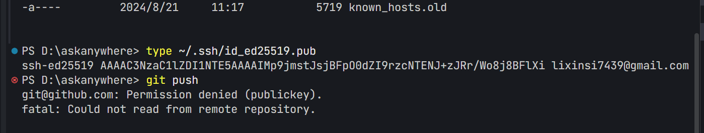
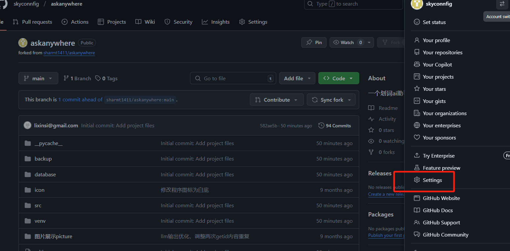
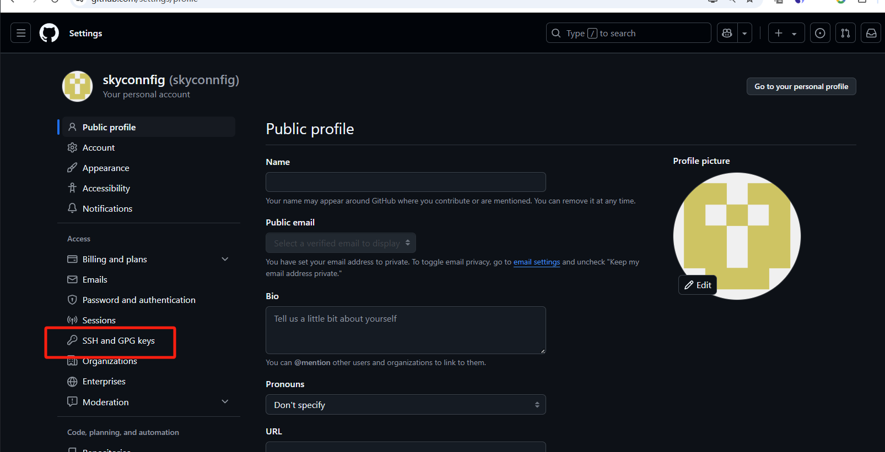
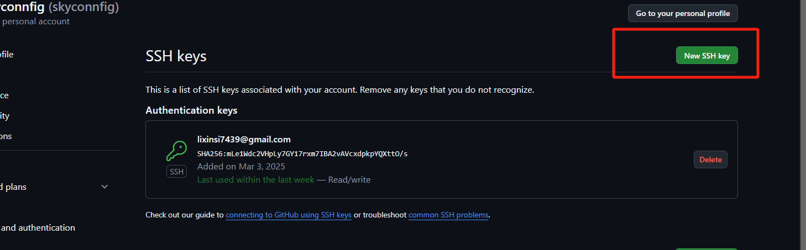
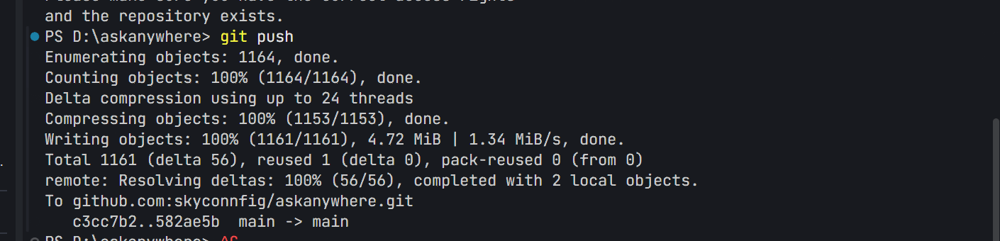

# git推送代码vscode

### 检查到.git目录结构完整，现在尝试重新初始化Git仓库以修复COMMIT_EDITMSG文件访问问题。
```xml
askanywhere\.git
```

### 检查到.git目录结构完整，现在尝试重新初始化Git仓库以修复COMMIT_EDITMSG文件访问问题。
```xml
git init
```

### 重新初始化Git仓库后，我们需要添加并提交一个初始化文件，以确保Git仓库正常工作
```xml
git add .
```

### 现在我们需要创建一个初始提交，这将生成一个新的COMMIT_EDITMSG文件。
```xml
git commit -m Initial commit: Add project files
```

### 修正Git提交命令的格式，确保提交信息被正确引用。
```xml
git commit -m "Initial commit: Add project files"
```

### 检查Git的SSL配置和远程仓库URL设置，以解决SSL连接错误。
```xml
git config --global http.sslBackend openssl
```

### 配置Git的SSL验证设置，尝试解决SSL连接问题。
```xml
git config --global http.sslVerify false
```

### 检测到SSH密钥认证失败，需要生成并配置SSH密钥以进行Git认证。
```xml
ssh-keygen -t ed25519 -C "lixinsi7439@gmail.com"
```

### 检测到SSH认证失败，需要检查现有的SSH密钥配置。
```xml
ls -l ~/.ssh
```

### 检测到已存在SSH密钥，需要将公钥添加到GitHub账户中以启用SSH认证。
```xml
type ~/.ssh/id_ed25519.pub
```



### 登入 github 账户:lixinsi7439@gmail.com 密码：Aa@#4520







```xml
ssh-ed25519 AAAAC3NzaC1lZDI1NTE5AAAAIMp9jmstJsjBFpO0dZI9rzcNTENJ+zJRr/Wo8j8BFlXi lixinsi7439@gmail.com
```

### 复制进去执行 git push



> 更新: 2025-03-03 16:51:28  
> 原文: <https://www.yuque.com/lixinsi/rq9o4s/kdggc0hevzupgz3m>