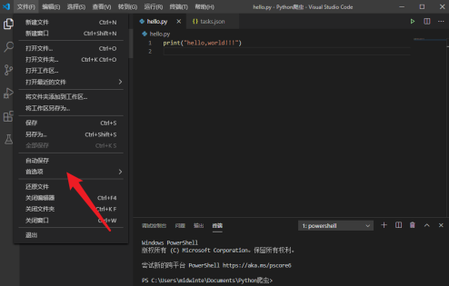
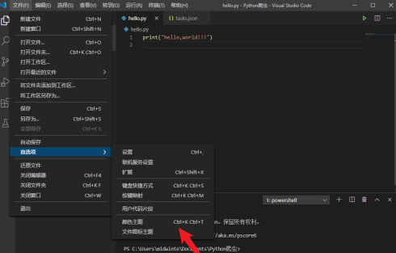
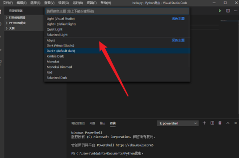
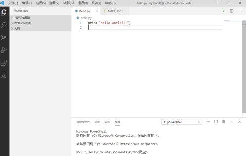
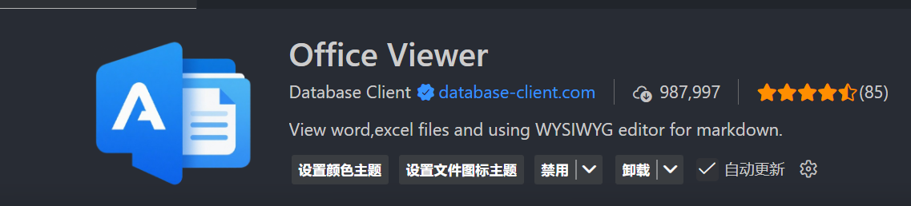
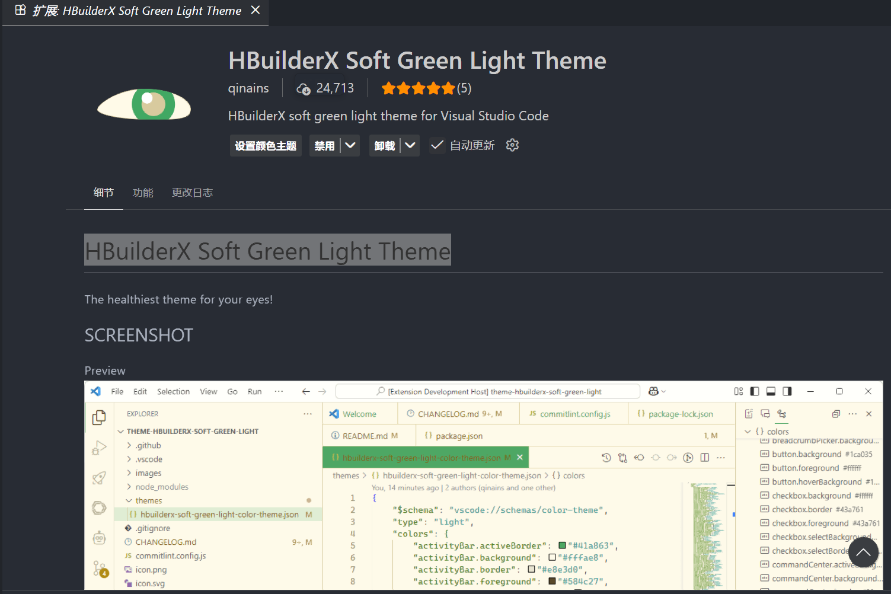
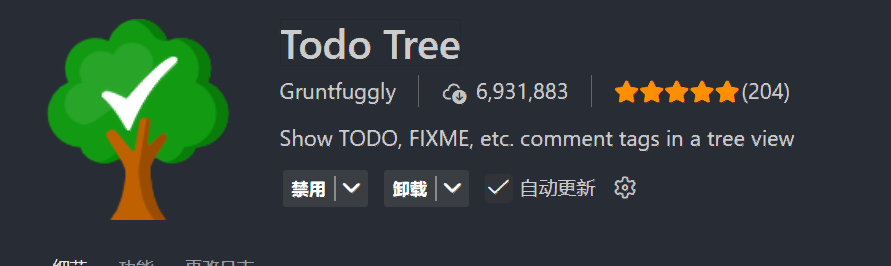
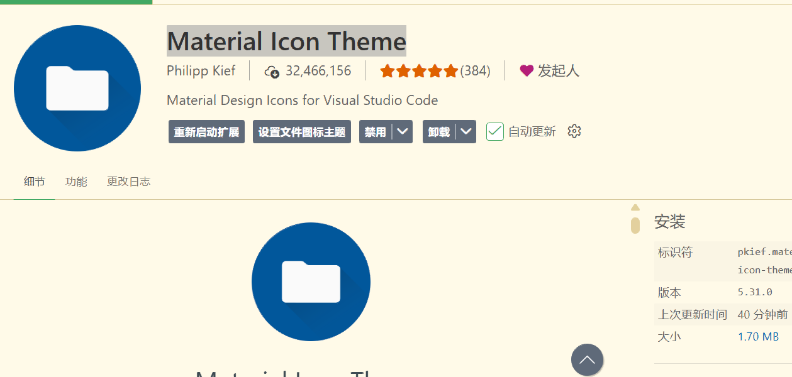
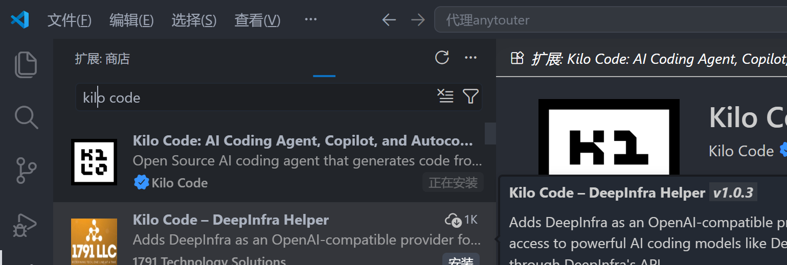

# vscode使用以及好用的插件

## 一.vscode换皮肤

Vscode是一款免费开源、高效的代码编辑器，是目前在前端开发中最常使用到的一种软件开发工具。有小伙伴知道Vscode怎么更换主题吗，这里小编就给大家详细介绍一下Vscode更换主题的方法，大家感兴趣的话可以来看一看。

**更换方法：**

1、双击打开软件，点击左上角的"文件"选项，选择下方选项列表中的"首选项"。

2、再点击其中的"颜色主题"选项。

3、在给出的选项窗口中选择想要更换的主题就可以了。

4、这样主题就更换成功了。

### 插件 Office Viewer
支持 execl,word,ppt,pdf 预览

### 插件画图**Draw.io Integration**

### 插件
# HBuilderX Soft Green Light Theme

### 插件**Todo Tree**
标记括号

### 插件**Material Icon Theme 文件夹区分**

### pencil 插件
### kilo code

> 更新: 2026-04-19 16:02:01  
> 原文: <https://www.yuque.com/lixinsi/rq9o4s/onblp9kxmrdg91vv>