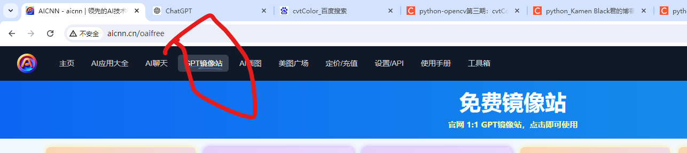
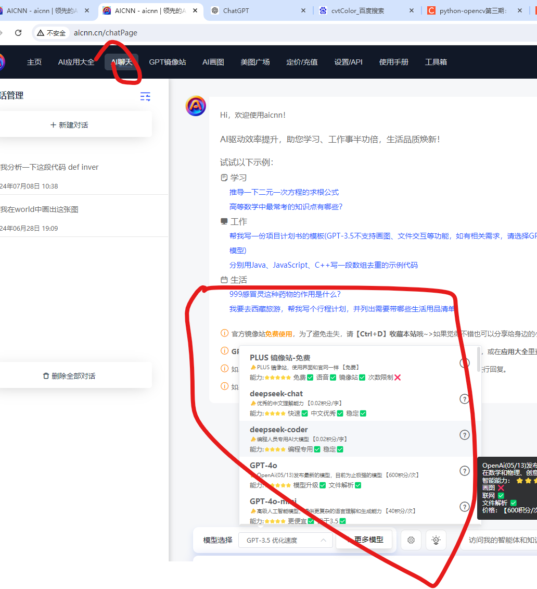

# 2024年7月26学习网址记录

#### Chatgpt：[https://aicnn.cn/loginPage?aff=7WjGU5GFuB](https://aicnn.cn/loginPage?aff=7WjGU5GFuB)

[https://huggingface.co/login](https://huggingface.co/login)

huggiingface 账号：lixinsi7439@gmail.com

密码：Aa@#4520

GPT 爬虫

作用把网址转化为 json 格式对大模型进行数据投喂。

[https://github.com/BuilderIO/gpt-crawler](https://github.com/BuilderIO/gpt-crawler)

参考链接：[https://www.youtube.com/watch?v=wJIEGskhDEI](https://www.youtube.com/watch?v=wJIEGskhDEI)

结构化解析

[https://github.com/adithya-s-k/omniparse](https://github.com/adithya-s-k/omniparse)

 langchatchat Windows 部署

[https://www.freedidi.com/11919.html](https://www.freedidi.com/11919.html)

# Unsloth + Llama 3 本机微调大模型指南 | 安全快速训练个性化模型
[https://www.youtube.com/watch?v=ZQIPnSiiwKw](https://www.youtube.com/watch?v=ZQIPnSiiwKw)

金融大模型

[https://github.com/FudanDISC/DISC-FinLLM](https://github.com/FudanDISC/DISC-FinLLM)

金融 

# Fin-Eva Version 1.0 金融领域中文语言专业数据评测集
[https://github.com/alipay/financial_evaluation_dataset/tree/main](https://github.com/alipay/financial_evaluation_dataset/tree/main)

大模型合集

[https://github.com/HqWu-HITCS/Awesome-Chinese-LLM](https://github.com/HqWu-HITCS/Awesome-Chinese-LLM)

> 更新: 2024-07-28 23:51:25  
> 原文: <https://www.yuque.com/lixinsi/oexq6o/aq6wqxr2lyhsq24c>