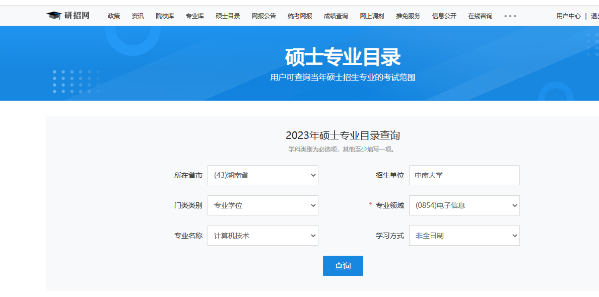
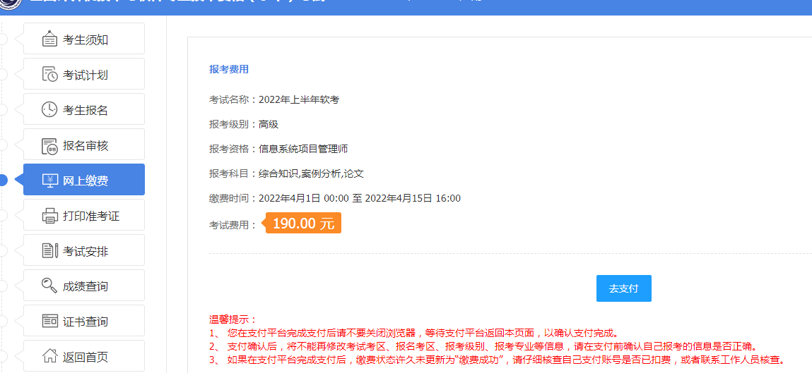
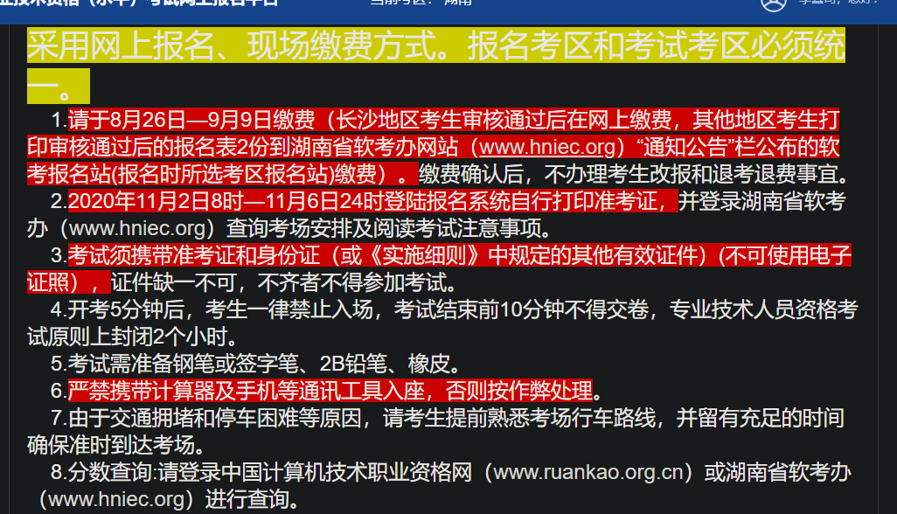
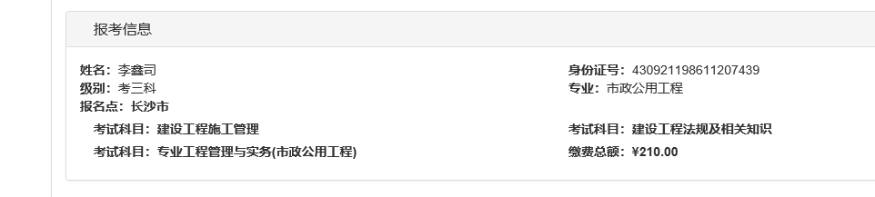
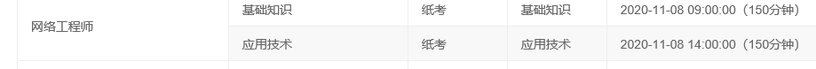
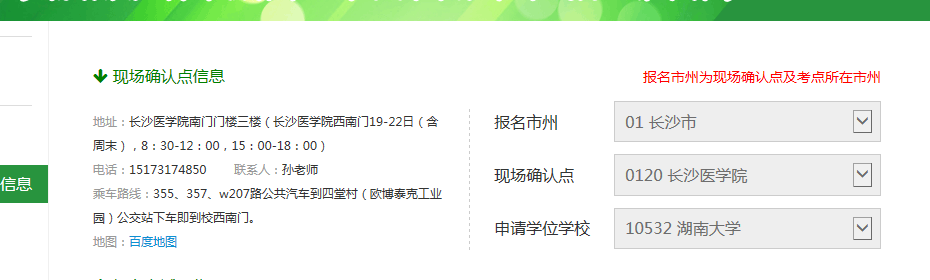
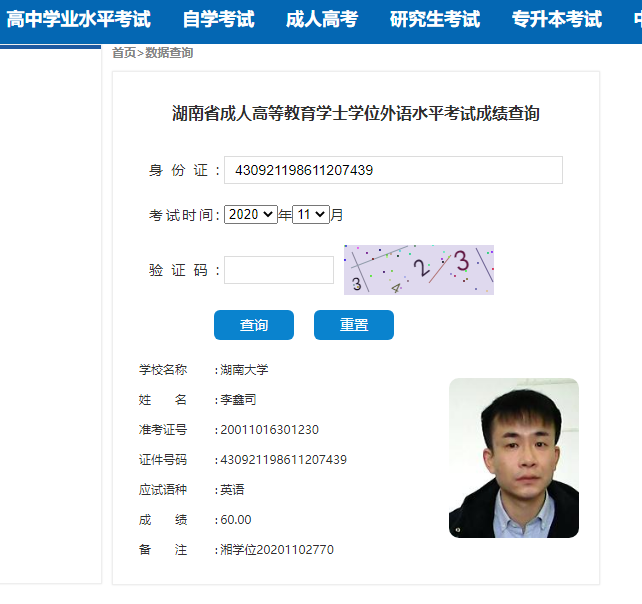
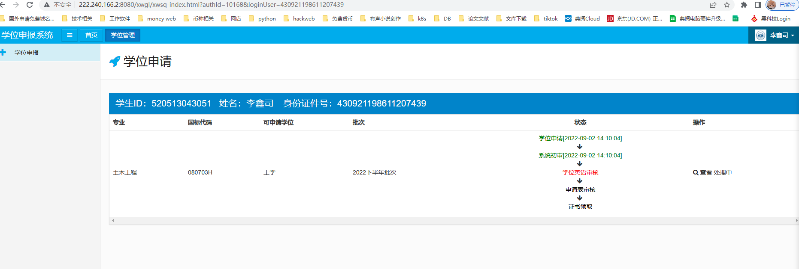

# 考试必备

## 软考
+ 账号：lixinsi@hotmail.com 密码：Lxs19861019      
+ <font style="color:#494949;">学号：520513043051</font>
+ [软考报名地址](http://bm.ruankao.org.cn/report/index)
+ <font style="color:#494949;">用户名:17352804520</font>
+ <font style="color:#494949;">密码:Aa@#4520</font>
+ [https://www.kdocs.cn/l/ckMfyE1OGXJC](https://www.kdocs.cn/l/ckMfyE1OGXJC)


## 硕士考试
+ <font style="color:#494949;">学信网登入地址：</font>[https://account.chsi.com.cn/account/account!show.action](https://account.chsi.com.cn/account/account!show.action)
+ 账号：17352804520
+ 密码：Aa@#4520





[二建报名地址](http://es.skight.com/ExamGroup/86/202012/Query.es)[](http://es.skight.com/ExamGroup/86/202012/Query.es)

<font style="color:#494949;">用户名:15386477439</font>

<font style="color:#494949;">报考序号：046265</font>





<font style="color:#494949;"></font>

[英语四级报名地址](http://cz.hneao.cn/xwwy)

<font style="color:#494949;">用户名：Lixinsi</font>

<font style="color:#494949;">密码：lxs19861019</font>

<font style="color:#494949;">报名信息已提交，请于2020年9月19日~22日-2020年09月22日17时携带有效身份证件前往现场确认点办理确认手续</font>





<font style="color:#494949;">Google账号和密码</font>

lixinsi7439@gmail.com

LIXINSI123

<font style="color:#494949;"></font>


<font style="color:#494949;"></font>

<font style="color:#494949;"></font>

<font style="color:#494949;">全国人事网报考</font>

[中国人事考试网](http://zp.cpta.com.cn/gwyexam/stulogin/input.htm)<font style="color:#494949;"></font>

<font style="color:#494949;">账号：lixinsi</font>

<font style="color:#494949;">密码：Lxs19861019</font>

查看学问申请

[http://222.240.166.2:8080/](http://222.240.166.2:8080/)

账号：430921198611207439

密码：207439




```plain
环球软考【中项】2025年11月
https://pan.quark.cn/s/4e993b120051
建国软考【中项】2025年11月--8月17日夸克上新
https://pan.quark.cn/s/06ab25c1a070
江山软考【中项】2025年11月
https://pan.quark.cn/s/c8f2aae0171c 
https://pan.baidu.com/s/1qnjYrsbGINYpk0K_7C0CRg?pwd=1234
羽依软考【中项】2025年11月--8月17日夸克上新
https://pan.quark.cn/s/faf5fda96aa5
https://pan.baidu.com/s/1uJwy3_wI0qZcZNOwkfOC1w?pwd=1234
马军软考【中项】2025年11月--8月17日更新
https://pan.quark.cn/s/f2ee2ab8103a
野人软考【中项】2025年11月--8月17日夸克更新
https://pan.quark.cn/s/ce73c9716ffa
https://pan.baidu.com/s/1K7KbP37YUiUcp5_E-uTp3A?pwd=1234 
郑房新软考【中项】2025年11月--7月21日更新
https://pan.baidu.com/s/1ioCkSJYU6pXC4bVfHAHGrA?pwd=1234
黄富财(黄大仙)软考【中项】24年11月 
https://pan.quark.cn/s/c981bdf0554a  
乐凯软考【中项】24年11月 
https://pan.quark.cn/s/a0981b1cdb17  
环球软考【中项】2024年11月  https://pan.baidu.com/s/1ltcJ_AEhQ12PqWr4jrNjlQ?pwd=6666 
----------系规-----------
环球王建平(阿诺)软考【系规】2025年11月
https://pan.quark.cn/s/e7b9eb9539b3
王建平(阿诺)软考【系规】2025年11月
https://pan.quark.cn/s/95819d31a3c6 
https://pan.baidu.com/s/1psn6e32jaUCAkPTHCaClNA?pwd=543c
蜗牛软考【系规】2025年11月--8月17日更新
https://pan.quark.cn/s/1a0576307348
江山软考【系规】2025年11月--8月17日更新
https://pan.quark.cn/s/a4173370a69d 
郑房新软考【系规】2025年11月--8月15日夸克更新
https://pan.quark.cn/s/7ab8eb198c43 
https://pan.baidu.com/s/183A10IXyV1wTkN4jPhZbZA?pwd=1234
----------网规、系分、架构-------
Summer软考【网规】2024年11月
https://pan.quark.cn/s/b20bde0a63ad
文老师软考【系分】2025年5月（还有51CTO）
https://pan.baidu.com/s/1FWQXBQaOS3eNqXtbyFGVcQ?pwd=ydp2
王勇软考【架构】2024年11月
https://pan.quark.cn/s/44ed5defa285
---------------高项­­------------------
环球软考【高项】2025年5月（无忧班） https://pan.quark.cn/s/898ac3d2549c 
环球软考【高项】2025年5月（尊享班） https://pan.quark.cn/s/547a933eaedb 
乐凯软考【高项】2025年5月 https://pan.quark.cn/s/888d2db91c93 
夏天软考【高项】2025年5月 https://pan.quark.cn/s/5fe9f182c946 
江山软考【高项】2025年5月 https://pan.quark.cn/s/30e03c4f22be 
马军软考【高项】2025年5月 https://pan.quark.cn/s/3eccf7c1c8c8 
野人软考【高项】2025年5月 https://pan.quark.cn/s/6d69bf3bb26f 
蜗牛老师【高项】2025年5月 https://pan.quark.cn/s/e8bc5b6f0028 
更多软考资源，请点击下方链接
https://www.kdocs.cn/l/ckMfyE1OGXJC
英语学习资源
https://www.kdocs.cn/l/cdBUKcZh5Ptz
---环球阿诺系规已上新、江山系规金色考点、建国中项上新---
```


> 更新: 2025-08-27 09:30:37  
> 原文: <https://www.yuque.com/lixinsi/oexq6o/wocd1e>