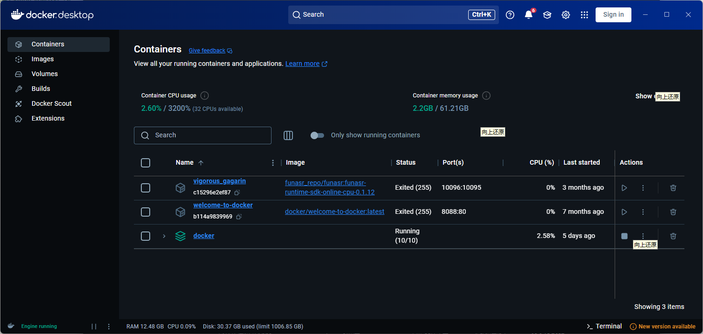

# .net human后台

# CLAUDE.md

此文件为 Claude Code (claude.ai/code) 提供使用此代码库代码的指导。

## 项目概述

这是一个基于 C# .NET 8.0 的语音交互应用程序，实现了一个语音交互系统，其主要功能如下：

* 基于 WebSocket 的通信，用于实时数据交换
* 集成多个大型语言模型 (LLM)，包括 VolcEngine/DouBao 和 Coze
* 多个文本转语音 (TTS) 引擎，包括火山 (VolcEngine)、KeLong、Coze 和其他免费替代方案
* 通过 FunASR 服务实现语音识别功能
* 使用 NAudio 和 FFmpeg 进行音频处理

## 架构

该应用程序采用模块化架构，包含以下主要组件：

1. **通信层**：处理 WebSocket 连接和数据交换
2. **LLM 层**：与各种语言模型接口，用于自然语言处理
3. **TTS 层**：使用多个引擎将文本响应转换为语音
4. **音频处理**：使用 FFmpeg 进行音频格式转换

## 关键类

* `SocketCommunication`：处理 WebSocket 连接的主要服务器类
* `WebSocketClientDisponseData`：管理各个客户端连接和数据流
* `LLM.LLM`：VolcEngine/DouBao LLM 的主要实现
* `TTS.TTS`：处理文本转语音合成，支持多种引擎
* `AccessToken`：管理 VolcEngine 服务的身份验证令牌

## 常见开发任务

### 构建项目

```bash
dotnet build
```

### 运行应用程序

```bash
dotnet run
```

### Linux 发布

```bash
dotnet publish -c Release -r linux-x64 --self-contained false
```

### 容器化部署

该应用程序包含一个用于容器化的 Dockerfile：

```bash
docker build -t humanvoice-bg .
docker run -p 19465:19465 humanvoice-bg
```

## 配置

该应用程序需要 `Config` 目录中的几个配置文件：

* `DouBaoLLM.json`：LLM API 密钥和模型配置
* `HuoShanTTSConfig.json`：TTS 服务凭据
* `GuiJi.json`：GuiJi VLM 的配置

## 依赖项

主要外部依赖项包括：

* Azure.AI.OpenAI
* Microsoft.CognitiveServices.Speech
* 用于音频处理的 NAudio 和 NAudio.Lame.CrossPlatform
* 用于音频格式转换的 FFmpeg
* 用于 JSON 序列化的 Newtonsoft.Json

## 网络配置

该应用程序在 `/recognition` 端点的 19465 端口上监听 WebSocket 连接。

## 音频处理

该应用程序使用 FFmpeg 进行各种音频格式（MP3、WAV）之间的转换，标准采样率为 16000 Hz。

```sql
用户说话 → FunASR 转文字 → Ollama 大模型思考回答 → IndexTTS 合成语音 → 播放给用户
```

```sql
FunASR语音转文字功能分析与改进方案                                                                               │ │
│ │                                                                                                                  │ │
│ │ 现有FunASR实现分析                                                                                               │ │
│ │                                                                                                                  │ │
│ │ 项目中已集成FunASR语音识别功能：                                                                                 │ │
│ │                                                                                                                  │ │
│ │ 当前实现特点：                                                                                                   │ │
│ │ - 使用WebSocket连接到固定服务器：ws://117.72.11.94:10095/                                                        │ │
│ │ - 支持实时流式语音识别（2pass模式）                                                                              │ │
│ │ - 配置包含热词支持：{"你好":20,"小卿":70,"hello world":40}                                                       │ │
│ │ - 无需API Key，直连自建FunASR服务                                                                                │ │
│ │ - 支持音频分块处理和实时响应                                                                                     │ │
│ │                                                                                                                  │ │
│ │ 存在问题：                                                                                                       │ │
│ │ 1. 依赖固定服务器地址，存在单点故障风险                                                                          │ │
│ │ 2. 无认证机制，无法控制访问权限                                                                                  │ │
│ │ 3. 服务稳定性和负载能力未知                                                                                      │ │
│ │ 4. 无法灵活配置不同的识别引擎
```

```sql
 推荐的API Key方案                                                                                                │ │
│ │                                                                                                                  │ │
│ │ 1. 阿里云智能语音 (推荐)                                                                                         │ │
│ │                                                                                                                  │ │
│ │ - 优势: 中文识别准确率高，支持实时流式识别                                                                       │ │
│ │ - API: 智能语音交互服务                                                                                          │ │
│ │ - 认证: AccessKey + SecretKey                                                                                    │ │
│ │ - 特性: 支持热词、方言识别、标点符号                                                                             │ │
│ │                                                                                                                  │ │
│ │ 2. 百度语音识别API                                                                                               │ │
│ │                                                                                                                  │ │
│ │ - 优势: 成熟稳定，支持多种音频格式                                                                               │ │
│ │ - API: 百度AI开放平台语音识别                                                                                    │ │
│ │ - 认证: API Key + Secret Key                                                                                     │ │
│ │ - 特性: 支持长语音、实时识别                                                                                     │ │
│ │                                                                                                                  │ │
│ │ 3. 腾讯云语音识别                                                                                                │ │
│ │                                                                                                                  │ │
│ │ - 优势: 高并发处理能力                                                                                           │ │
│ │ - API: 一句话识别/实时语音识别                                                                                   │ │
│ │ - 认证: SecretId + SecretKey                                                                                     │ │
│ │ - 特性: 支持多语言、自定义词库                                                                                   │ │
│ │                                                                                                                  │ │
│ │ 4. 微软Azure语音服务                                                                                             │ │
│ │                                                                                                                  │ │
│ │ - 优势: 全球化支持，多语言识别                                                                                   │ │
│ │ - API: Azure Cognitive Services Speech                                                                           │ │
│ │ - 认证: API Key + Region                                                                                         │ │
│ │ - 特性: 高精度识别，支持自定义模型
```

### indextts 文字转语音部署vllm版本


### 拉取 indextts2

```plain
docker pull aicompdev/indextts2:0.1
```

### funasr 语音识别这个有Windows版本



```plain
sudo docker run -p 10096:10095 -it --privileged=true \
  -v $PWD/funasr-runtime-resources/models:/workspace/models \
  registry.cn-hangzhou.aliyuncs.com/funasr_repo/funasr:funasr-runtime-sdk-online-cpu-0.1.12
```

```plain
│ Here is Claude's plan:                                                                                                                                                                                          │
│ ╭─────────────────────────────────────────────────────────────────────────────────────────────────────────────────────────────────────────────────────────────────────────────────────────────────────────────╮ │
│ │ 当前项目待完成任务分析                                                                                                                                                                                      │ │
│ │                                                                                                                                                                                                             │ │
│ │ 根据对项目代码的分析，以下是当前项目中可能需要完成的任务：                                                                                                                                                  │ │
│ │                                                                                                                                                                                                             │ │
│ │ 1. 配置文件完善                                                                                                                                                                                             │ │
│ │                                                                                                                                                                                                             │ │
│ │ - 需要完善各种配置文件（DouBaoLLM.json、GuiJi.json、HuoShanTTSConfig.json、Ollama.json）中的API密钥和参数设置                                                                                               │ │
│ │                                                                                                                                                                                                             │ │
│ │ 2. 功能实现完善                                                                                                                                                                                             │ │
│ │                                                                                                                                                                                                             │ │
│ │ - 语音识别模块：                                                                                                                                                                                            │ │
│ │   - Baidu、Tencent、Azure语音识别提供商尚未实现                                                                                                                                                             │ │
│ │   - Aliyun语音识别实现需要完善                                                                                                                                                                              │ │
│ │ - 大语言模型（LLM）模块：                                                                                                                                                                                   │ │
│ │   - CozeLLM类尚未实现                                                                                                                                                                                       │ │
│ │   - 需要完善各LLM提供者的错误处理机制                                                                                                                                                                       │ │
│ │ - TTS模块：                                                                                                                                                                                                 │ │
│ │   - 需要优化IndexTTSVLLM的音频处理逻辑                                                                                                                                                                      │ │
│ │   - 完善各种TTS提供商的错误处理机制                                                                                                                                                                         │ │
│ │                                                                                                                                                                                                             │ │
│ │ 3. 代码质量改进                                                                                                                                                                                             │ │
│ │                                                                                                                                                                                                             │ │
│ │ - 添加缺失的注释和文档                                                                                                                                                                                      │ │
│ │ - 优化异常处理机制                                                                                                                                                                                          │ │
│ │ - 统一代码风格和命名规范                                                                                                                                                                                    │ │
│ │ - 完善日志记录功能                                                                                                                                                                                          │ │
│ │                                                                                                                                                                                                             │ │
│ │ 4. 测试和部署                                                                                                                                                                                               │ │
│ │                                                                                                                                                                                                             │ │
│ │ - 编写单元测试和集成测试                                                                                                                                                                                    │ │
│ │ - 完善Docker部署配置                                                                                                                                                                                        │ │
│ │ - 优化性能和资源管理                                                                                                                                                                                        │ │
│ │                                                                                                                                                                                                             │ │
│ │ 5. 网络和安全                                                                                                                                                                                               │ │
│ │                                                                                                                                                                                                             │ │
│ │ - 完善WebSocket连接的安全性                                                                                                                                                                                 │ │
│ │ - 添加请求验证和防护机制                                                                                                                                                                                    │ │
│ │ - 优化错误处理和连接管理
```

### 设置本地连接信任

```plain
netsh http add urlacl url=http://+:8080/  user=Everyone
```


> 更新: 2025-09-19 10:20:34  
> 原文: <https://www.yuque.com/lixinsi/ynhoz5/owg5gq29pisudrfb>