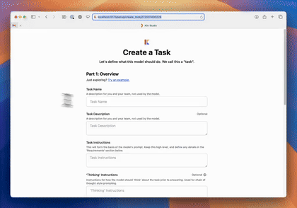
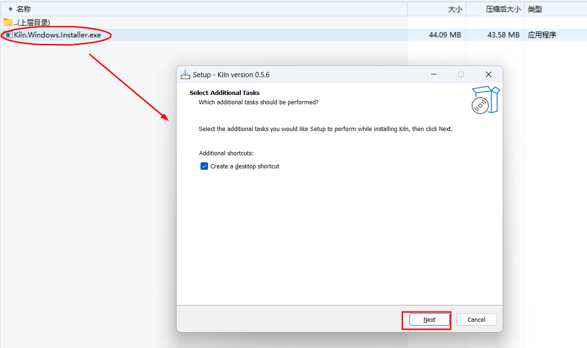
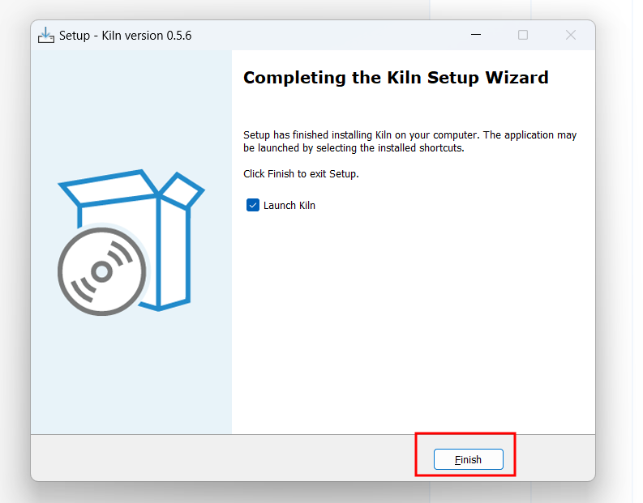
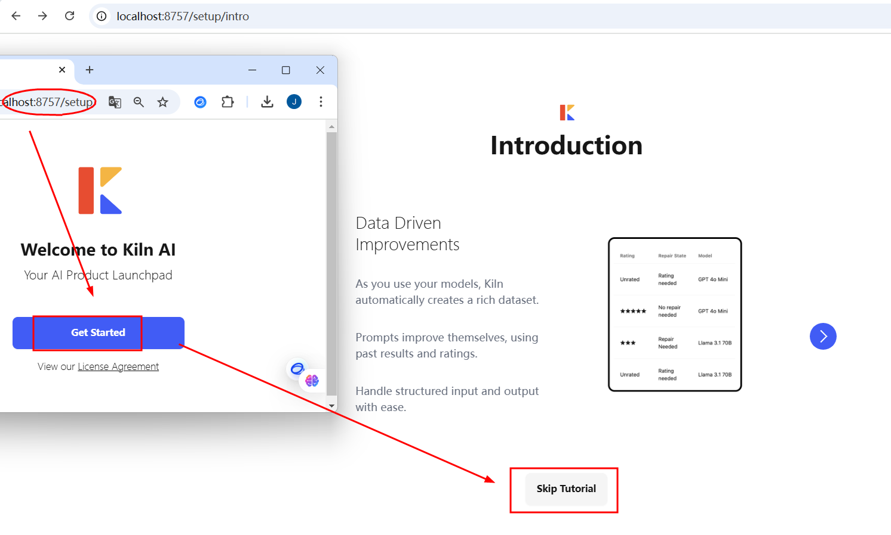
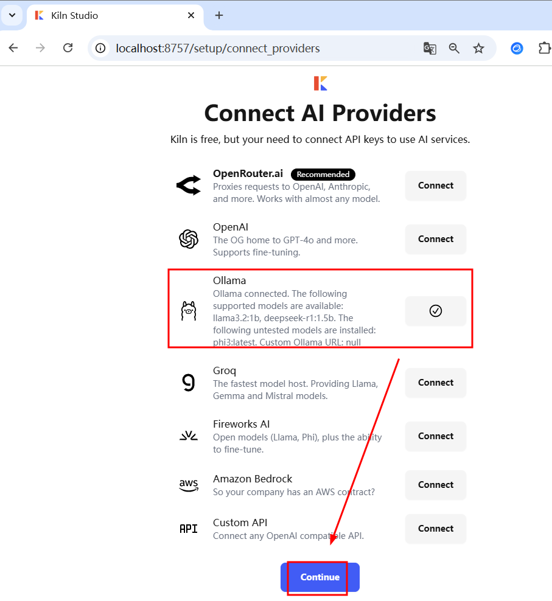
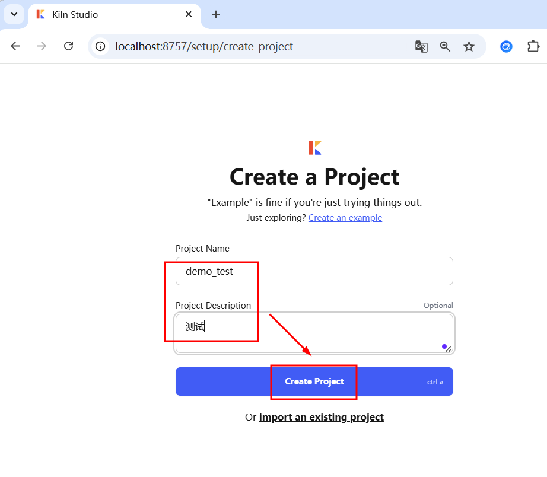

# LLMs之dataset/FT：Kiln-AI(快速AI原型制作/数据集协作/模型微调工具)的简介、安装和使用方法、案例应用之详细攻略

[https://github.com/Kiln-AI/Kiln](https://github.com/Kiln-AI/Kiln)


LLMs之dataset/FT：Kiln-AI(快速AI原型制作/数据集协作/模型微调工具)的简介、安装和使用方法、案例应用之详细攻略


2024年10月发布，Kiln是一款简易工具，用于微调大型语言模型 (LLM)、生成合成数据以及协作构建数据集。它旨在简化 AI 原型设计和数据集协作流程，让技术和非技术团队都能轻松参与。Kiln 提供直观的桌面应用程序和开源的 Python 库及 API，支持多种模型和提供商。

总而言之，Kiln 是一款功能强大且易于使用的工具，它简化了大型语言模型的微调、合成数据的生成以及数据集的协作过程，为 AI 开发者和团队提供了高效的解决方案。



GitHub地址：GitHub - Kiln-AI/Kiln: The easiest tool for fine-tuning LLM models, synthetic data generation, and collaborating on datasets.

开源地址：[https://github.com/Kiln-AI/Kiln](https://github.com/Kiln-AI/Kiln)

官方文档：Welcome to Kiln AI | Kiln AI Docs

[https://docs.getkiln.ai/](https://docs.getkiln.ai/)


1、特点

>> 直观的桌面应用：跨平台兼容，提供适用于 Windows、MacOS 和 Linux 的一键式应用程序，设计简洁易用，适用于AI初学者至专家。

>> 零代码微调：无需编写代码即可微调 Llama、GPT4o 和 Mixtral 等模型，并自动进行模型的无服务器部署。

>> 合成数据生成：使用交互式可视化工具生成训练数据。

>> 团队协作：基于 Git 的版本控制，方便团队成员（包括 QA、PM 和领域专家）协作处理结构化数据（例如，示例、提示、评分、反馈、问题等）。

>> 提示生成：自动根据数据生成提示，包括思维链、少样本和多样本等多种类型。

>> 广泛的模型和提供商支持：支持通过 Ollama、OpenAI、OpenRouter、Fireworks、Groq、AWS 或任何兼容 OpenAI 的 API 使用任何模型。

>> 开源库和 API：提供 MIT 开源的 Python 库和 OpenAPI REST API。

>> 隐私优先：Kiln 无法访问用户数据，用户可以自备 API 密钥或使用 Ollama 本地运行。

>> 结构化数据：构建使用 JSON 的 AI 任务。

>> 免费使用：桌面应用和 Python 库均免费提供。

>> 一键设置：无需Docker、终端或依赖。


2、主要功能：零代码微调、可视化工具生成合成数据、团队协作

Kiln AI是一款简便易用的工具，主要功能如下：

>> 微调：支持Llama、GPT4o和Mixtral的零代码微调，自动无服务器部署模型。

>> 生成合成数据：利用交互式可视化工具生成训练数据。

>> 团队协作：为AI数据集提供基于Git的版本控制，直观的用户界面便于与质量保证、项目管理专家和领域专家在结构化数据（如示例、提示、评分、反馈、问题等）上进行协作。


Kiln的安装和使用方法

1、安装

T1、桌面应用安装

Kiln 的桌面应用完全免费，可在 MacOS、Windows 和 Linux 系统上使用。 下载地址在 GitHub 页面上提供，但具体链接未在提供的文本中显示。


步骤1：下载应用

下载并安装软件，确保选择正确的版本（Windows、Linux、适用于Apple Silicon的Mac、适用于Intel的Mac）。

地址：Release Kiln Desktop - v0.11.1 · Kiln-AI/Kiln · GitHub


步骤2：安装应用

macOS：打开.dmg文件，将应用拖拽至“应用程序”目录。

Windows：双击安装程序，按照指南完成安装。

Linux：保存应用，并在终端中启动。






步骤3：启动应用

根据指引创建项目、创建任务，并连接到Ollama、OpenAI、OpenRouter等AI提供商。


打开软件→点击Get Started→Skip→Continue→选择Connect AI Providers→填写Project Name和Project Description










步骤4：生成合成数据+一键微调

LLMs之dataset/FT：采用Kiln AI工具实现微调图文教程—定义任务和目标→使用合成数据生成工具生成训练数据→选择要微调的模型→启动训练任务→部署和运行模型

[https://yunyaniu.blog.csdn.net/article/details/145562147](https://yunyaniu.blog.csdn.net/article/details/145562147)


T2、Python 库安装

Kiln 的开源 Python 库允许用户将 Kiln 数据集集成到自己的工作流程中，构建微调模型，在 Jupyter Notebook 中使用 Kiln，构建自定义工具等等。


```powershell
pip install kiln-ai
```

2、使用方法—基于Kiln数据模型

Kiln数据模型设计用于组织和管理与机器学习相关的任务数据。它以JSON格式存储项目数据，使得用户能够高效地加载、操作和验证数据。以下是对Kiln数据模型的详细说明及其使用方法。

Kiln项目本质上是一个包含多个文件的目录（大多数是.kiln扩展名的JSON文件），这些文件描述了与项目相关的任务、执行情况以及其他相关数据。Kiln的设计考虑了多个因素，如：


Git兼容性：Kiln项目文件夹设计易于与Git协作，文件名使用唯一的ID来避免冲突，使得多个人可以并行工作。文件大小较小，便于使用标准的diff工具进行比较。

JSON格式：Kiln项目使用JSON格式存储数据，便于使用常见工具（如pandas、polars等）加载和处理数据。

Kiln Python库：Kiln提供了Python库，使用该库可以轻松与Kiln数据集交互。库内置了数据验证，推荐用户通过该库加载和操作数据集，而非直接操作JSON文件。

Kiln数据模型包含多个核心概念和实体，主要包括以下几类：


项目（Project）：一个Kiln项目包含多个相关的任务，组织和管理这些任务。

任务（Task）：一个任务是Kiln中的最小单元，包含了具体的任务信息，如提示指令、输入/输出数据格式（Schema）以及任务要求等。

任务运行（TaskRun）：任务的一个执行实例，包含了任务的输入、输出和人工评分信息。

数据集拆分（DatasetSplit）：一个任务运行的冻结集合，通常按训练集、验证集和测试集划分。

微调（Finetune）：用于追踪在特定任务数据上的模型微调配置和状态。

Kiln数据模型提供了一个简单而强大的框架来组织、管理和操作任务数据。通过使用Kiln Python库，你可以轻松地加载、验证和处理数据，避免了直接操作JSON格式数据时可能发生的错误。Kiln的设计充分考虑了与Git的兼容性、与数据工具（如pandas）的兼容性，以及数据验证，确保数据的正确性和一致性。


(1)、加载项目

在Kiln中加载一个项目非常简单，只需通过Python代码加载.kiln文件：此代码可以帮助你查看项目中的任务及每个任务的数据集规模。


```powershell
from kiln_ai.datamodel import Project
 
# 加载项目文件
project = Project.load_from_file("path/to/your/project.kiln")
print("项目名称: ", project.name, " - 描述: ", project.description)
 
# 列出项目中的所有任务及其数据集大小
tasks = project.tasks()
for task in tasks:
    print("任务名称: ", task.name, " - 描述: ", task.description)
    print("数据集总大小:", len(task.runs()))
```

(2)、将数据集加载到Kiln任务中

如果你已有一个数据集，可以将其导入到Kiln项目中。Kiln会验证数据的输入输出格式，并确保数据符合任务定义的要求。


纯文本输入/输出：确保任务定义中未设置output_json_schema和input_json_schema。

JSON格式输入/输出：确保任务定义中设置了有效的JSON schema，并且每个数据点符合该schema。

下面是一个简单的示例，演示如何将数据集加载到Kiln任务中：


```powershell
import kiln_ai
import kiln_ai.datamodel
 
# 加载任务
task_path = "/Users/youruser/Kiln Projects/test project/tasks/632780983478 - Joke Generator/task.kiln"
task = kiln_ai.datamodel.Task.load_from_file(task_path)
 
# 为每个数据项添加数据
item = kiln_ai.datamodel.TaskRun(
    parent=task,
    input='{"topic": "AI"}',
    output=kiln_ai.datamodel.TaskOutput(
        output='{"setup": "What is AI?", "punchline": "content_here"}',
    ),
)
item.save_to_file()
print("已保存数据项到文件: ", item.path)
```

(3)、复杂的任务数据加载

除了基础数据加载外，Kiln还支持设置更复杂的任务数据。例如，可以指定数据来源（如人工或合成数据），设置数据的创建者属性，甚至对输出进行评分。以下是一个更复杂的示例：


```powershell
item = kiln_ai.datamodel.TaskRun(
    parent=task,
    input='{"topic": "AI"}',
    input_source=kiln_ai.datamodel.DataSource(
        type=kiln_ai.datamodel.DataSourceType.human,
        properties={"created_by": "John Doe"},
    ),
    output=kiln_ai.datamodel.TaskOutput(
        output='{"setup": "What is AI?", "punchline": "content_here"}',
        source=kiln_ai.datamodel.DataSource(
            type=kiln_ai.datamodel.DataSourceType.human,
            properties={"created_by": "Jane Doe"},
        ),
        rating=kiln_ai.datamodel.TaskOutputRating(score=5, type="five_star"),
    ),
)
item.save_to_file()
print("已保存数据项到文件: ", item.path)
```

(4)、在笔记本或项目中使用Kiln数据集

你可以将Kiln数据集加载到一个Jupyter笔记本或其他Python项目中，常见的做法是将其转换为pandas数据框架。以下是一个示例：


```powershell
import kiln_ai
import kiln_ai.datamodel
 
# 加载任务
task_path = "/Users/youruser/Kiln Projects/test project/tasks/632780983478 - Joke Generator/task.kiln"
task = kiln_ai.datamodel.Task.load_from_file(task_path)
 
# 获取任务运行数据
runs = task.runs()
for run in runs:
    print(f"输入: {run.input}")
    print(f"输出: {run.output.output}")
 
print(f"任务运行总数: {len(runs)}")
```

(5)、在Pandas中使用Kiln数据集

如果你希望在pandas中使用Kiln数据集，可以通过以下代码将Kiln任务中的数据转换为DataFrame：该代码将Kiln任务中的所有运行数据加载到一个pandas数据框架中，可以进一步进行数据分析。


```powershell
import glob
import json
import pandas as pd
from pathlib import Path
 
task_dir = "/Users/youruser/Kiln Projects/test project/tasks/632780983478 - Joke Generator"
dataitem_glob = task_dir + "/runs/*/task_run.kiln"
 
# 加载所有数据项
dfs = []
for file in glob.glob(dataitem_glob):
    js = json.loads(Path(file).read_text())
 
    # 将数据转换为DataFrame
    df = pd.DataFrame([{
        "input": js["input"],
        "output": js["output"]["output"],
    }])
 
    dfs.append(df)
```

 

# 合并所有DataFrame

```powershell
final_df = pd.concat(dfs, ignore_index=True)
print(final_df)
```

Kiln的案例应用

快速原型设计

Kiln 简化了尝试各种方法并进行比较的过程，无需编写代码即可快速迭代，从而提升模型质量和性能。支持各种提示技术（基本、少样本、多样本、修复和反馈）、思维链，以及多种模型（GPT、Llama、Claude、Gemini、Mistral、Gemma、Phi）。


跨技术和非技术团队协作

Kiln 作为协作工具，连接了领域专家和技术团队。领域专家可以使用直观的桌面应用生成结构化数据集和评分，而数据科学家可以使用 UI 或 Python 库来使用这些数据集。QA 和 PM 可以更早地发现问题，并帮助生成修复模型所需的数据集内容。


构建高质量 AI 产品

Kiln 帮助用户创建数据集，捕获构建高质量模型所需的输入、输出、人工评分、反馈和修复。数据集随着使用而增长，自动提高模型质量。


                        

原文链接：[https://blog.csdn.net/qq_41185868/article/details/145561246](https://blog.csdn.net/qq_41185868/article/details/145561246)


> 更新: 2025-02-20 08:40:09  
> 原文: <https://www.yuque.com/lixinsi/ynhoz5/uwo618xm43qg7el8>