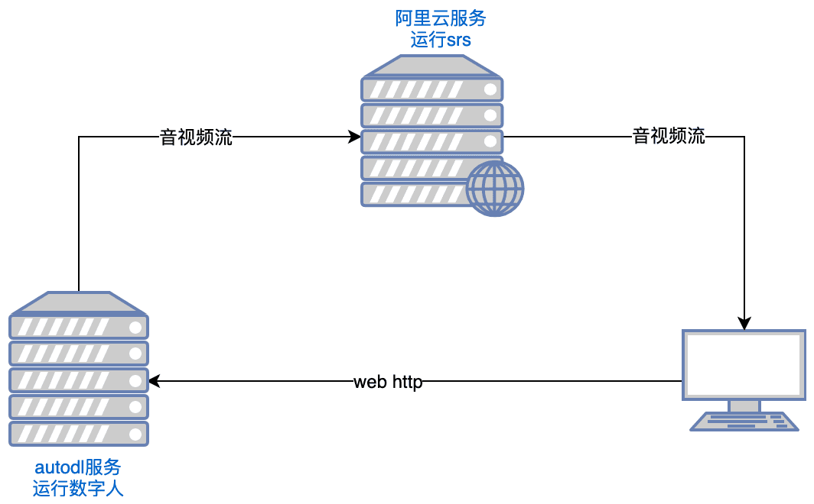

# LiveTalking：开源实时互动数字人直播系统，实现音视频同步对话

# [LiveTalking：开源实时互动数字人直播系统，实现音视频同步对话](https://www.aisharenet.com/en/livetalking/)

<font style="color:rgb(153, 153, 153);">2025-01-14</font><font style="color:rgb(153, 153, 153);"> </font><font style="color:rgb(153, 153, 153);">来源：</font>[LiveTalking](https://github.com/lipku/LiveTalking)<font style="color:rgb(153, 153, 153);"> </font><font style="color:rgb(153, 153, 153);">分类.</font><font style="color:rgb(153, 153, 153);"> </font>[AI工具](https://www.aisharenet.com/en/tool/)

## <font style="color:rgb(51, 51, 51);">总体介绍</font>

<font style="color:rgb(51, 51, 51);">LiveTalking 是一个开源的实时交互数字人系统，致力于打造高品质的数字人直播解决方案。项目采用 Apache 2.0 开源协议，集成了多项前沿技术，包括 ER-NeRF 渲染、实时音视频流处理、口型同步等。系统支持实时数字人渲染与交互，可用于直播、在线教育、客服等多种场景。项目在 GitHub 上已获得超过 4300 个 star 和 600 个分支，展现出强大的社区影响力。LiveTalking 尤其注重实时性与交互体验，通过集成 AIGC 技术为用户提供了完整的数字人开发框架。项目持续更新维护，并有完备的文档支持，是构建数字人应用的理想选择。</font>



<font style="color:rgb(51, 51, 51);"></font>

## <font style="color:rgb(51, 51, 51);">函数列表</font>

* <font style="color:rgb(51, 51, 51);">支持多种数字人模型：</font>[ernerf](https://www.aisharenet.com/en/er-nerfgoujiangaoai/)<font style="color:rgb(51, 51, 51);">、</font>[musetalk](https://www.aisharenet.com/en/musev/)<font style="color:rgb(51, 51, 51);">、</font>[wav2lip](https://www.aisharenet.com/en/wav2lip/)<font style="color:rgb(51, 51, 51);">、</font>[Ultralight-Digital-Human](https://www.aisharenet.com/en/ultralight-digital-human/)
* <font style="color:rgb(51, 51, 51);">同步音频和视频对话</font>
* <font style="color:rgb(51, 51, 51);">支持声音克隆</font>
* <font style="color:rgb(51, 51, 51);">支持数字化的人发表言论却被打断</font>
* <font style="color:rgb(51, 51, 51);">支持全身视频拼接</font>
* <font style="color:rgb(51, 51, 51);">支持 RTMP 和 WebRTC 推送流</font>
* <font style="color:rgb(51, 51, 51);">支持视频调度：不发言时播放自定义视频</font>
* <font style="color:rgb(51, 51, 51);">支持多并发</font>

<font style="color:rgb(51, 51, 51);"></font>

## <font style="color:rgb(51, 51, 51);">使用帮助</font>

### <font style="color:rgb(51, 51, 51);">1.安装过程</font>

1. **<font style="color:rgb(51, 51, 51);">环境要求</font>**<font style="color:rgb(51, 51, 51);"> ：Ubuntu 20.04、Python 3.10、Pytorch 1.12、CUDA 11.3</font>
2. **<font style="color:rgb(51, 51, 51);">安装依赖项</font>**<font style="color:rgb(51, 51, 51);"> ::</font>

*<font style="color:rgb(187, 187, 187) !important;background-color:rgb(58, 59, 50);"></font>*<font style="color:rgb(187, 187, 187) !important;background-color:rgb(58, 59, 50);">复制</font>*<font style="color:rgb(187, 187, 187) !important;background-color:rgb(58, 59, 50);"></font>*<font style="color:rgb(187, 187, 187) !important;background-color:rgb(58, 59, 50);">复制</font>*<font style="color:rgb(187, 187, 187) !important;background-color:rgb(58, 59, 50);"></font>*<font style="color:rgb(187, 187, 187) !important;background-color:rgb(58, 59, 50);">复制</font>*<font style="color:rgb(187, 187, 187) !important;background-color:rgb(58, 59, 50);"></font>*<font style="color:rgb(187, 187, 187) !important;background-color:rgb(58, 59, 50);">复制</font>*<font style="color:rgb(187, 187, 187) !important;background-color:rgb(58, 59, 50);"></font>*<font style="color:rgb(187, 187, 187) !important;background-color:rgb(58, 59, 50);">复制</font>*<font style="color:rgb(187, 187, 187) !important;background-color:rgb(58, 59, 50);"></font>*<font style="color:rgb(187, 187, 187) !important;background-color:rgb(58, 59, 50);">复制</font>*<font style="color:rgb(187, 187, 187) !important;background-color:rgb(58, 59, 50);"></font>*<font style="color:rgb(187, 187, 187) !important;background-color:rgb(58, 59, 50);">复制</font>

*<font style="color:rgb(187, 187, 187) !important;background-color:rgb(58, 59, 50);"></font>*<font style="color:rgb(187, 187, 187) !important;background-color:rgb(58, 59, 50);">复制</font>

```plain
conda create -n nerfstream python=3.10
conda activate nerfstream
conda install pytorch==1.12.1 torchvision==0.13.1 cudatoolkit=11.3 -c pytorch
pip install -r requirements.txt
```

<font style="color:rgb(51, 51, 51);">如果不训练.ernerf</font>[模型](https://www.aisharenet.com/en/er-nerfgoujiangaoai/)<font style="color:rgb(51, 51, 51);">，则不需要安装以下库：</font>

*<font style="color:rgb(187, 187, 187) !important;background-color:rgb(58, 59, 50);"></font>*<font style="color:rgb(187, 187, 187) !important;background-color:rgb(58, 59, 50);">复制</font>*<font style="color:rgb(187, 187, 187) !important;background-color:rgb(58, 59, 50);"></font>*<font style="color:rgb(187, 187, 187) !important;background-color:rgb(58, 59, 50);">复制</font>*<font style="color:rgb(187, 187, 187) !important;background-color:rgb(58, 59, 50);"></font>*<font style="color:rgb(187, 187, 187) !important;background-color:rgb(58, 59, 50);">复制</font>*<font style="color:rgb(187, 187, 187) !important;background-color:rgb(58, 59, 50);"></font>*<font style="color:rgb(187, 187, 187) !important;background-color:rgb(58, 59, 50);">复制</font>*<font style="color:rgb(187, 187, 187) !important;background-color:rgb(58, 59, 50);"></font>*<font style="color:rgb(187, 187, 187) !important;background-color:rgb(58, 59, 50);">复制</font>*<font style="color:rgb(187, 187, 187) !important;background-color:rgb(58, 59, 50);"></font>*<font style="color:rgb(187, 187, 187) !important;background-color:rgb(58, 59, 50);">复制</font>

*<font style="color:rgb(187, 187, 187) !important;background-color:rgb(58, 59, 50);"></font>*<font style="color:rgb(187, 187, 187) !important;background-color:rgb(58, 59, 50);">复制</font>

```plain
pip install "git+https://github.com/facebookresearch/pytorch3d.git"
pip install tensorflow-gpu==2.8.0
pip install --upgrade "protobuf<=3.20.1"
```

### <font style="color:rgb(51, 51, 51);">2. 快速入门</font>

1. **<font style="color:rgb(51, 51, 51);">运行 SRS</font>**<font style="color:rgb(51, 51, 51);"> </font><font style="color:rgb(51, 51, 51);"> ::</font>

*<font style="color:rgb(187, 187, 187) !important;background-color:rgb(58, 59, 50);"></font>*<font style="color:rgb(187, 187, 187) !important;background-color:rgb(58, 59, 50);">复制</font>*<font style="color:rgb(187, 187, 187) !important;background-color:rgb(58, 59, 50);"></font>*<font style="color:rgb(187, 187, 187) !important;background-color:rgb(58, 59, 50);">复制</font>*<font style="color:rgb(187, 187, 187) !important;background-color:rgb(58, 59, 50);"></font>*<font style="color:rgb(187, 187, 187) !important;background-color:rgb(58, 59, 50);">复制</font>*<font style="color:rgb(187, 187, 187) !important;background-color:rgb(58, 59, 50);"></font>*<font style="color:rgb(187, 187, 187) !important;background-color:rgb(58, 59, 50);">复制</font>*<font style="color:rgb(187, 187, 187) !important;background-color:rgb(58, 59, 50);"></font>*<font style="color:rgb(187, 187, 187) !important;background-color:rgb(58, 59, 50);">复制</font>

*<font style="color:rgb(187, 187, 187) !important;background-color:rgb(58, 59, 50);"></font>*<font style="color:rgb(187, 187, 187) !important;background-color:rgb(58, 59, 50);">复制</font>

```plain
export CANDIDATE=''
docker run --rm --env CANDIDATE=$CANDIDATE -p 1935:1935 -p 8080:8080 -p 1985:1985 -p 8000:8000/udp registry.cn-hangzhou.aliyuncs.com/ossrs/ srs:5 objs/srs -c conf/rtc.conf
```

<font style="color:rgb(51, 51, 51);">注意：服务器需要开放端口tcp:8000,8010,1985；udp:8000</font>

1. **<font style="color:rgb(51, 51, 51);">推出数字人</font>**<font style="color:rgb(51, 51, 51);"> ::</font>

*<font style="color:rgb(187, 187, 187) !important;background-color:rgb(58, 59, 50);"></font>*<font style="color:rgb(187, 187, 187) !important;background-color:rgb(58, 59, 50);">复制</font>*<font style="color:rgb(187, 187, 187) !important;background-color:rgb(58, 59, 50);"></font>*<font style="color:rgb(187, 187, 187) !important;background-color:rgb(58, 59, 50);">复制</font>*<font style="color:rgb(187, 187, 187) !important;background-color:rgb(58, 59, 50);"></font>*<font style="color:rgb(187, 187, 187) !important;background-color:rgb(58, 59, 50);">复制</font>*<font style="color:rgb(187, 187, 187) !important;background-color:rgb(58, 59, 50);"></font>*<font style="color:rgb(187, 187, 187) !important;background-color:rgb(58, 59, 50);">复制</font>

*<font style="color:rgb(187, 187, 187) !important;background-color:rgb(58, 59, 50);"></font>*<font style="color:rgb(187, 187, 187) !important;background-color:rgb(58, 59, 50);">复制</font>

```plain
python app.py
```

<font style="color:rgb(51, 51, 51);">如果无法访问 Huggingface，请在运行之前执行它：</font>

*<font style="color:rgb(187, 187, 187) !important;background-color:rgb(58, 59, 50);"></font>*<font style="color:rgb(187, 187, 187) !important;background-color:rgb(58, 59, 50);">复制</font>*<font style="color:rgb(187, 187, 187) !important;background-color:rgb(58, 59, 50);"></font>*<font style="color:rgb(187, 187, 187) !important;background-color:rgb(58, 59, 50);">复制</font>*<font style="color:rgb(187, 187, 187) !important;background-color:rgb(58, 59, 50);"></font>*<font style="color:rgb(187, 187, 187) !important;background-color:rgb(58, 59, 50);">复制</font>

*<font style="color:rgb(187, 187, 187) !important;background-color:rgb(58, 59, 50);"></font>*<font style="color:rgb(187, 187, 187) !important;background-color:rgb(58, 59, 50);">复制</font>

```plain
export HF_ENDPOINT=https://hf-mirror.com
```

<font style="color:rgb(51, 51, 51);">用浏览器打开 </font><code><font style="color:rgb(215, 104, 33);">http://serverip:8010/rtcpushapi.html</font></code><font style="color:rgb(51, 51, 51);">，在文本框中输入任意文字，提交，数字人就会播报这段文字。</font>

**<font style="color:rgb(51, 51, 51);">更多使用说明</font>**

* **<font style="color:rgb(51, 51, 51);">Docker运行</font>**<font style="color:rgb(51, 51, 51);"> ：不需要前面的安装，直接运行就可以了：</font>

*<font style="color:rgb(187, 187, 187) !important;background-color:rgb(58, 59, 50);"></font>*<font style="color:rgb(187, 187, 187) !important;background-color:rgb(58, 59, 50);">复制</font>*<font style="color:rgb(187, 187, 187) !important;background-color:rgb(58, 59, 50);"></font>*<font style="color:rgb(187, 187, 187) !important;background-color:rgb(58, 59, 50);">复制</font>

*<font style="color:rgb(187, 187, 187) !important;background-color:rgb(58, 59, 50);"></font>*<font style="color:rgb(187, 187, 187) !important;background-color:rgb(58, 59, 50);">复制</font>

```plain
docker run --gpus all -it --network=host --rm registry.cn-beijing.aliyuncs.com/codewithgpu2/lipku-metahuman-stream:vjo1Y6NJ3N
```

<font style="color:rgb(51, 51, 51);">代码在 </font><code><font style="color:rgb(215, 104, 33);">/root/metahuman-stream</font></code><font style="color:rgb(51, 51, 51);">之前 的</font><code><font style="color:rgb(215, 104, 33);">git pull</font></code><font style="color:rgb(51, 51, 51);"> Pull最新代码，然后按照步骤2和3执行命令。</font>

* **<font style="color:rgb(51, 51, 51);">镜像使用</font>**<font style="color:rgb(51, 51, 51);"> ::</font>
  * <font style="color:rgb(51, 51, 51);">autodl 图片：</font>[autodl 教程](https://www.codewithgpu.com/i/lipku/metahuman-stream/base)
  * <font style="color:rgb(51, 51, 51);">ucloud 镜像：</font>[ucloud 教程](https://www.compshare.cn/images-detail?ImageID=compshareImage-16ktl2kxwjef\&ImageType=Community\&referral_code=3XW3852OBmnD089hMMrtuU\&ytag=lipku_github)
* **<font style="color:rgb(51, 51, 51);">常见问题</font>**<font style="color:rgb(51, 51, 51);"> ：Linux CUDA 环境搭建可以参考这篇文章：</font>[参考文章](https://zhuanlan.zhihu.com/p/674972886)

### <font style="color:rgb(51, 51, 51);">3.配置说明</font>

1. <font style="color:rgb(51, 51, 51);">系统配置</font>

* <font style="color:rgb(51, 51, 51);">编辑config.yaml文件，设置基本参数</font>
* <font style="color:rgb(51, 51, 51);">配置摄像头和音频设备</font>
* <font style="color:rgb(51, 51, 51);">设置AI模型参数和路径</font>
* <font style="color:rgb(51, 51, 51);">配置直播推流参数</font>

1. <font style="color:rgb(51, 51, 51);">数字人体模型准备</font>

* <font style="color:rgb(51, 51, 51);">支持导入自定义3D模型</font>
* <font style="color:rgb(51, 51, 51);">可以使用预先构建的示例模型</font>
* <font style="color:rgb(51, 51, 51);">支持MetaHuman模型导入</font>

### <font style="color:rgb(51, 51, 51);">主要功能</font>

* **<font style="color:rgb(51, 51, 51);">实时音视频同步对话</font>**<font style="color:rgb(51, 51, 51);">::</font>
  1. <font style="color:rgb(51, 51, 51);">选择数字化仪型号：在配置页面中选择合适的数字化仪型号（例如ernerf、musetalk等）。</font>
  2. <font style="color:rgb(51, 51, 51);">音/视频传输方式选择：根据需求选择合适的音/视频传输方式（例如WebRTC、RTMP等）。</font>
  3. <font style="color:rgb(51, 51, 51);">开始通话：开始音视频传输，实现实时音视频同步通话。</font>
* **<font style="color:rgb(51, 51, 51);">数字人体模型切换</font>**<font style="color:rgb(51, 51, 51);">::</font>
  1. <font style="color:rgb(51, 51, 51);">进入设置页面：在项目运行页面，点击设置按钮，进入设置页面。</font>
  2. <font style="color:rgb(51, 51, 51);">选择新模型：在设置页面中选择新的数码宝贝模型并保存设置。</font>
  3. <font style="color:rgb(51, 51, 51);">重新启动项目：重新启动项目以应用新的模型配置。</font>
* **<font style="color:rgb(51, 51, 51);">音视频参数调整</font>**<font style="color:rgb(51, 51, 51);">::</font>
  1. <font style="color:rgb(51, 51, 51);">进入参数设置页面：在项目运行页面，点击参数设置按钮，进入参数设置页面。</font>
  2. <font style="color:rgb(51, 51, 51);">调整参数：根据需要调整音视频参数（如分辨率、帧率等）。</font>
  3. <font style="color:rgb(51, 51, 51);">保存并应用：保存设置并应用新的参数配置。</font>


> 更新: 2025-02-22 16:36:39  
> 原文: <https://www.yuque.com/lixinsi/ynhoz5/nyiklzgwo22lpggi>