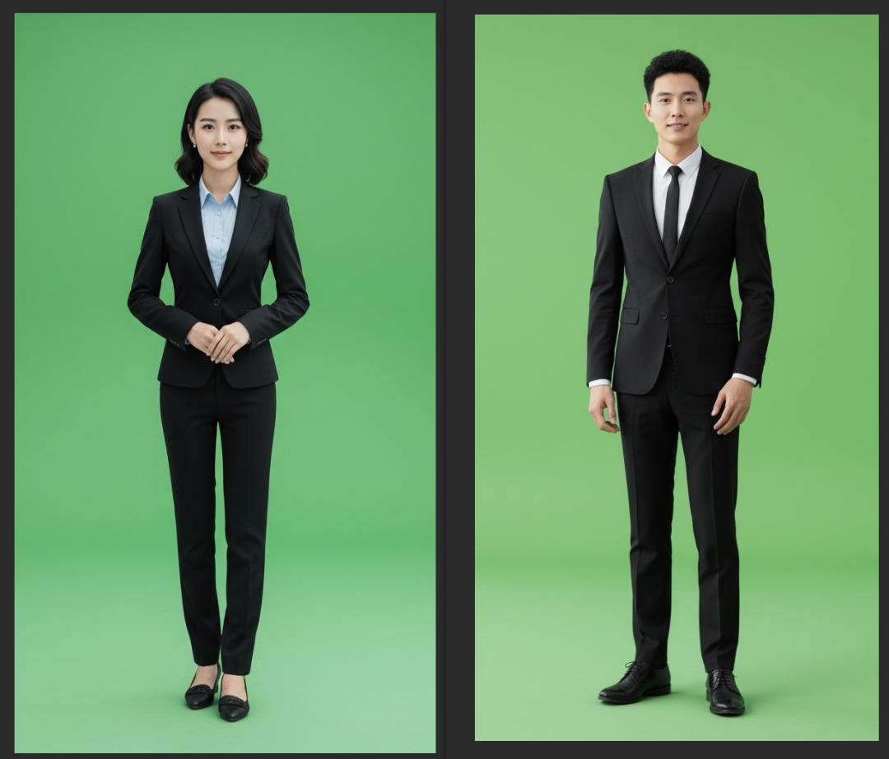
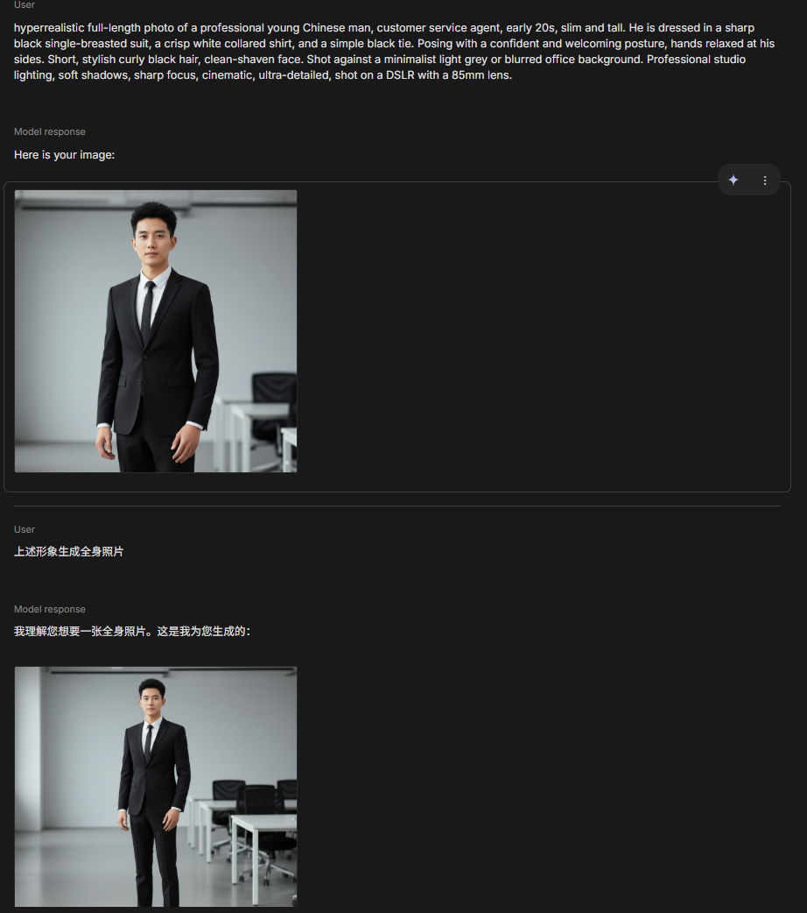
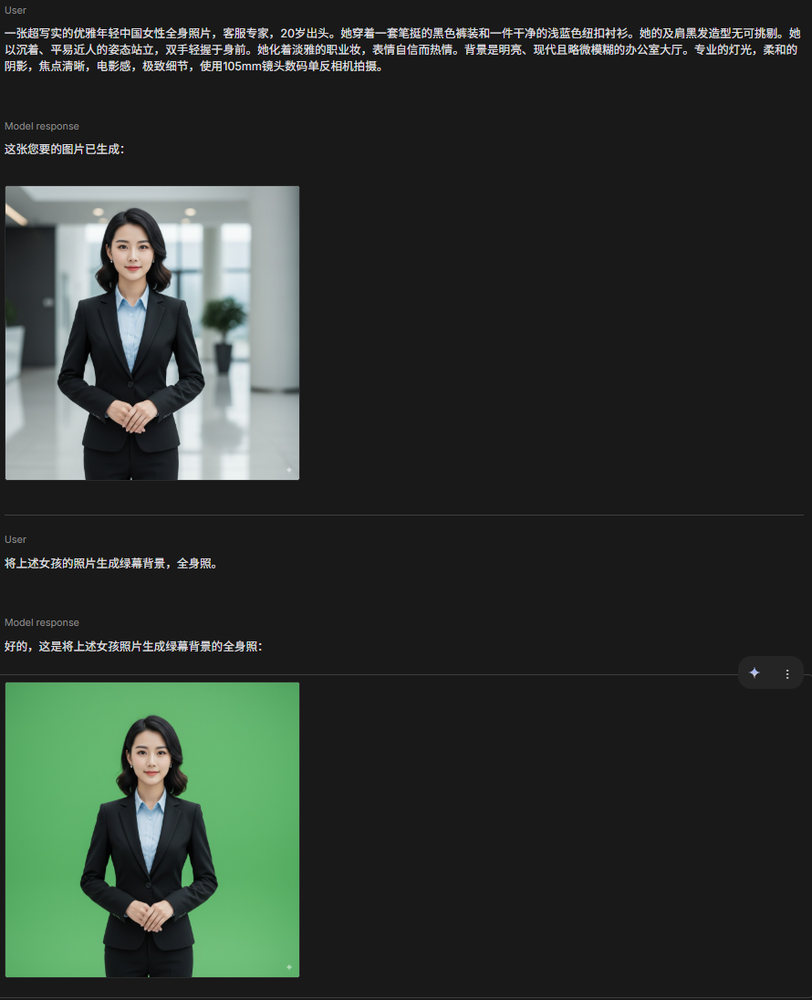
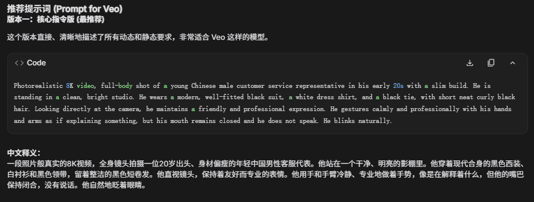
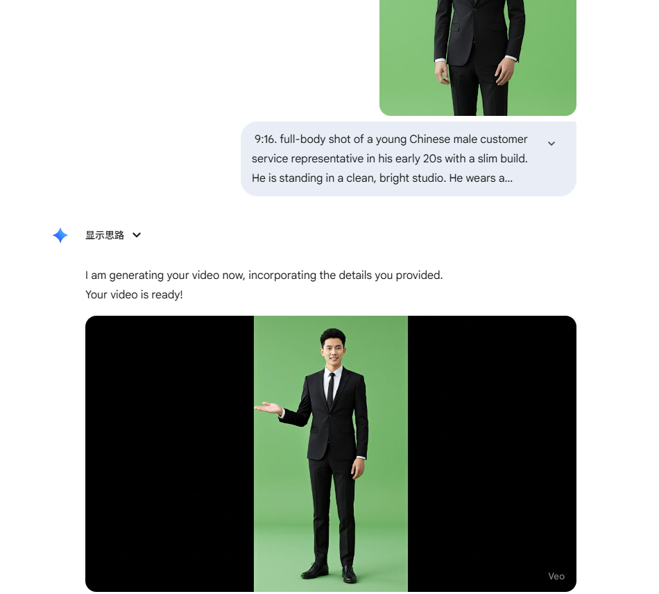
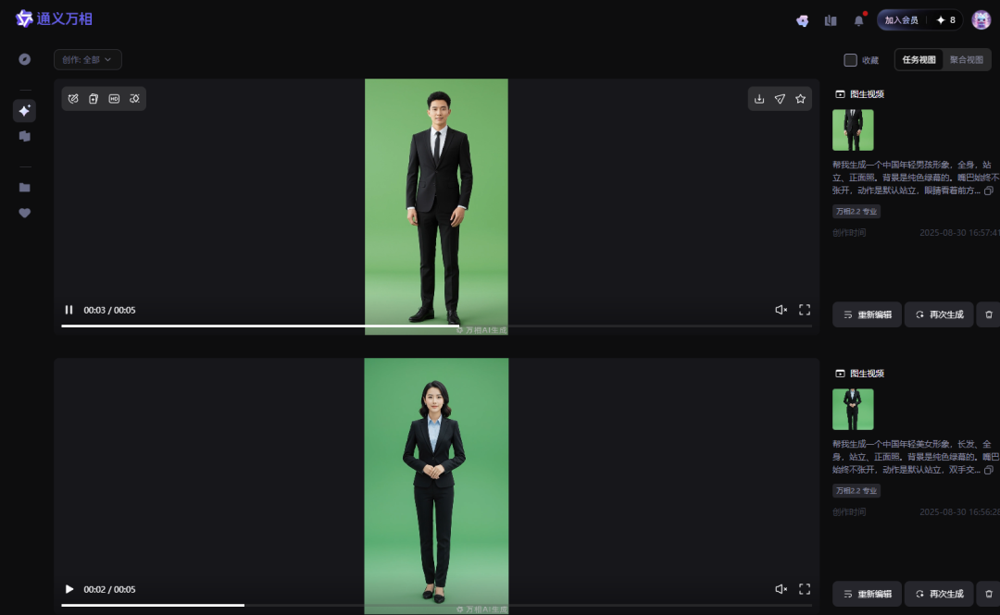

# Nano Banana爆火后我用它生成了满意的的2D数字人效果

上周Google正式将Nano Banana放到aistudio中后，各大网站全是它的炫酷效果。Nano Banana就是给人一种真实的感觉，所以第一时间我就想到生成我的2D数字人素材。

之前的素材存在的问题：模糊、不能全身、不能自定义动作、发型、服装，头部摆动太厉害。但现在有了Nano Banana，这些都不是问题了。



**目前效果：**

，时长06:26

**目前生成2D数字人素材工作流：**

[**https://gemini.google.com/app/300b8ffb381b53f0**](https://gemini.google.com/app/300b8ffb381b53f0)

**<font style="color:#00d5ff;">1. 先用Gemini 2.5 Pro生成</font>****<font style="color:#00d5ff;">Nano Banana的英文</font>****<font style="color:#00d5ff;">提示词：</font>**

```plain
A full body portrait of a young Chinese male customer service representative, in his 10s, slim build, wearing a modern well-fitted black suit, white dress shirt, and a black tie. He has short, neat curly black hair and a friendly professional expression, looking at the camera. Clean bright studio background, photorealistic, high detail, 8K.
```

中文释义：

一张超写实的年轻中国职业男性全身照片，客服人员，20岁出头，身材修长。他穿着一套笔挺的黑色单排扣西装、一件干净的白领衬衫和一条简约的黑领带。他以自信和欢迎的姿态站立，双手在身侧放松。时尚的黑色短卷发，面部干净无胡须。背景为极简的浅灰色或模糊的办公室背景。专业的影棚灯光，柔和的阴影，焦点清晰，电影感，极致细节，使用85mm镜头数码单反相机拍摄。

```plain
Hyperrealistic full-length photo of an elegant young Chinese woman, customer service professional, early 20s. She is dressed in a sharp black pantsuit and a crisp light-blue button-up shirt. Her shoulder-length black hair is styled immaculately. Posing with a poised and approachable posture, hands gently clasped in front. She wears light, professional makeup and has a confident, welcoming expression. Shot against a bright, modern, and slightly blurred office lobby background. Professional lighting, soft shadows, sharp focus, cinematic, ultra-detailed, shot on a DSLR with a 105mm lens.
```

中文释义：

一张超写实的优雅年轻中国女性全身照片，客服专家，20岁出头。她穿着一套笔挺的黑色裤装和一件干净的浅蓝色纽扣衬衫。她的及肩黑发造型无可挑剔。她以沉着、平易近人的姿态站立，双手轻握于身前。她化着淡雅的职业妆，表情自信而热情。背景是明亮、现代且略微模糊的办公室大厅。专业的灯光，柔和的阴影，焦点清晰，电影感，极致细节，使用105mm镜头数码单反相机拍摄。

  
[https://nanobanana.ai/generator](https://nanobanana.ai/generator)

**<font style="color:#00d5ff;">2. 切换到Nano Banana，输入提示词，一步步按要求修改。</font>**





**<font style="color:#00d5ff;">3.  再用</font>****<font style="color:#00d5ff;">Gemini 2.5 Pro生成Veo 3的提示词：</font>**



  




但veo3无法生成9:16的视频，这个时候还是需要借用一下tongyi.ailiyun.com来生成一下。



虽然目前已经是绿幕背景，但为了代码处理方便，还是需要把背景处理成（0,255,0）的颜色值。

这个时候需要用到工具：

https://huggingface.co/spaces/amirgame197/Remove-Video-Background

还有除水印工具：

https://unwatermark.ai/video-watermark-remover/


> 更新: 2025-09-04 14:15:34  
> 原文: <https://www.yuque.com/lixinsi/ynhoz5/fvpuz4ist8tiyhv1>