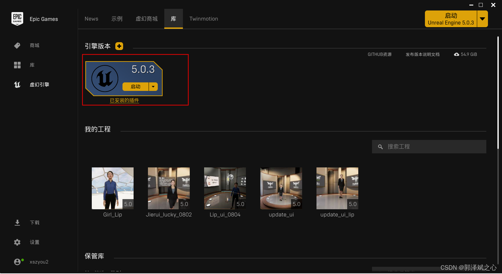
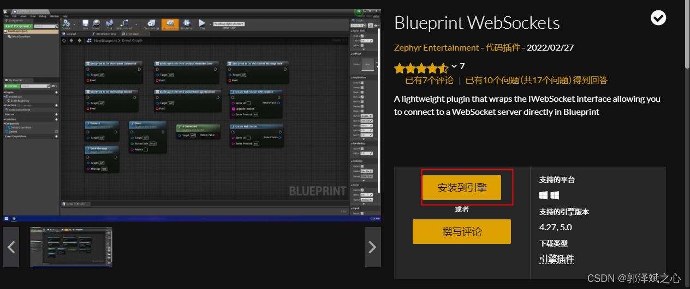
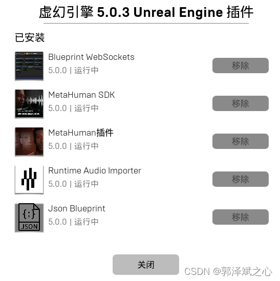
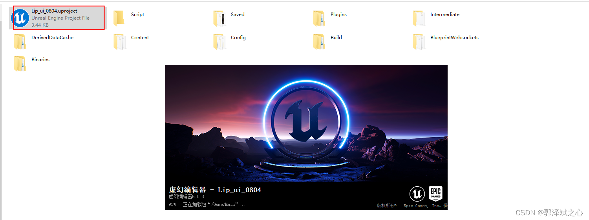
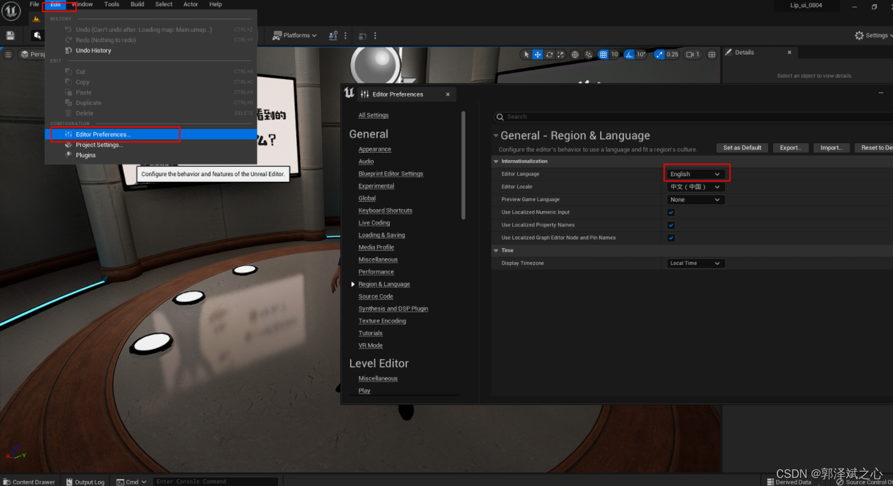
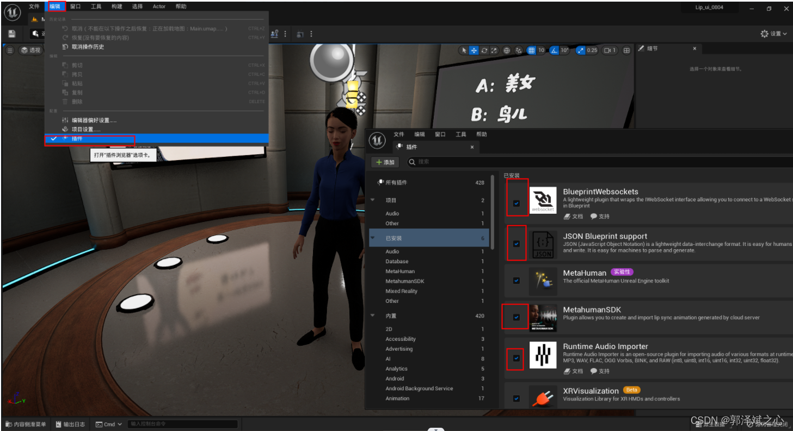
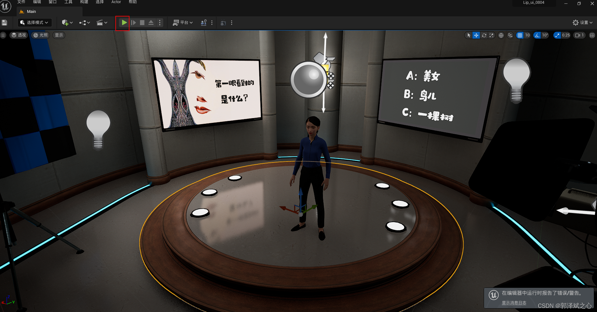

# UE数字人语音交互（UE数字人系统教程）

[非常全面的数字人解决方案(含源码)](https://blog.csdn.net/aa84758481/article/details/124758727)

## Fay-UE5[数字人](https://so.csdn.net/so/search?q=%E6%95%B0%E5%AD%97%E4%BA%BA&spm=1001.2101.3001.7020)工程导入
#### 1、工程下载：[xszyou/fay-ue5: 可对接fay数字人的ue5工程 (github.com)](https://github.com/xszyou/fay-ue5)
[https://github.com/xszyou/fay-ue5](https://github.com/xszyou/fay-ue5)

#### 2、ue5下载安装：[Unreal Engine 5](https://www.unrealengine.com/en-US/unreal-engine-5)
[https://www.unrealengine.com/en-US/unreal-engine-5](https://www.unrealengine.com/en-US/unreal-engine-5)

  

#### 3、ue5插件安装  

####   

依次安装以下几个插件  

#### 4、双击运行工程  

#### 5、切换中文  

#### 6、检查插件已启用  

#### 7、测试运行  

> 更新: 2024-11-28 15:52:46  
> 原文: <https://www.yuque.com/lixinsi/ynhoz5/zfz891dm2cwhez6s>