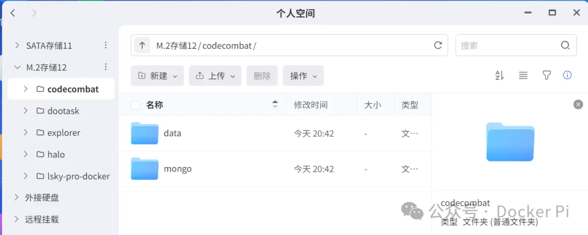
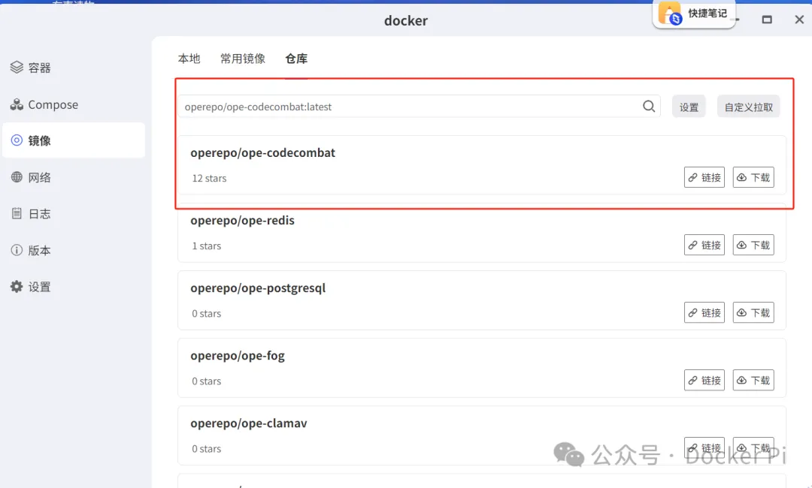
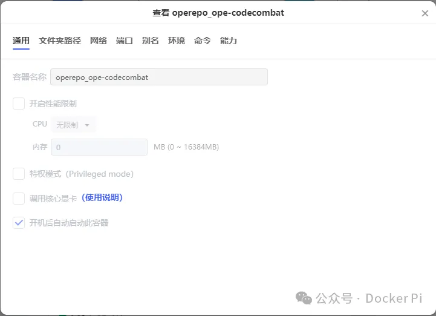
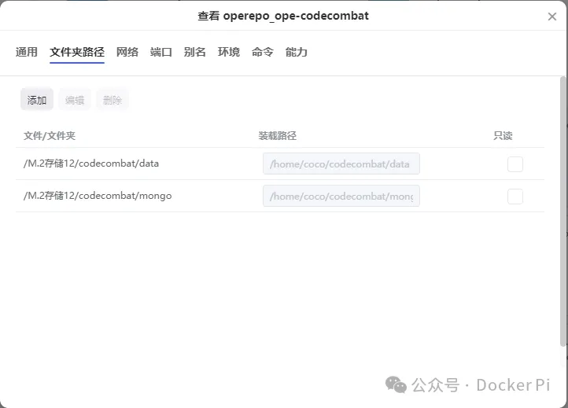
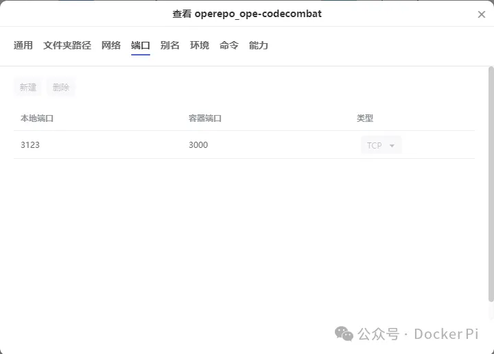
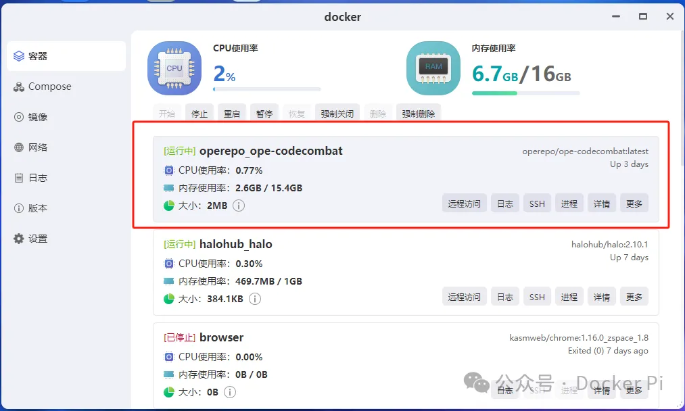
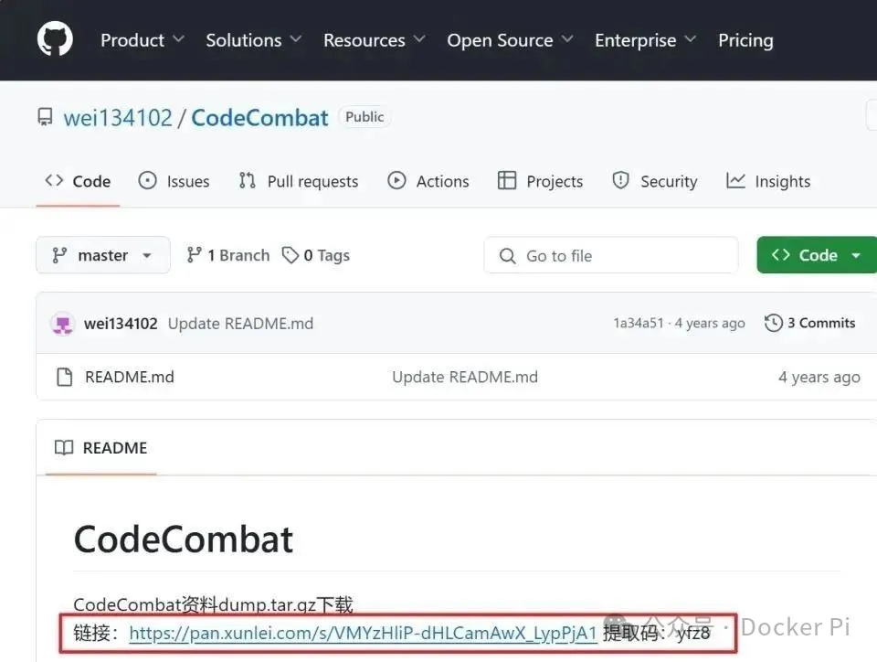
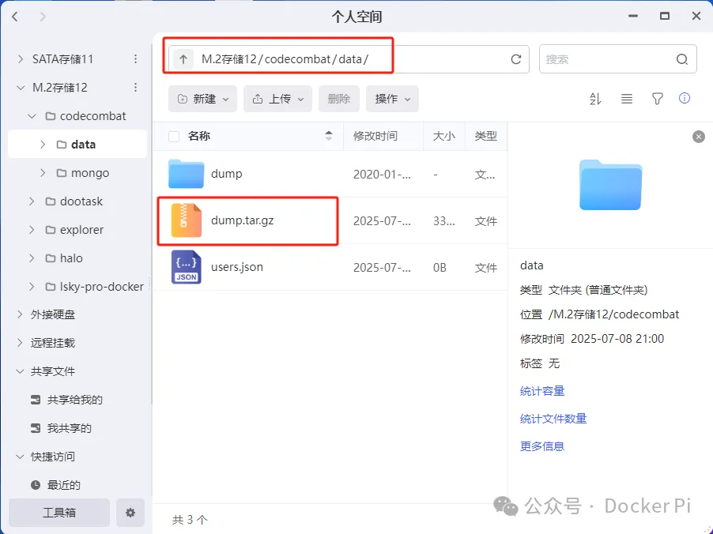
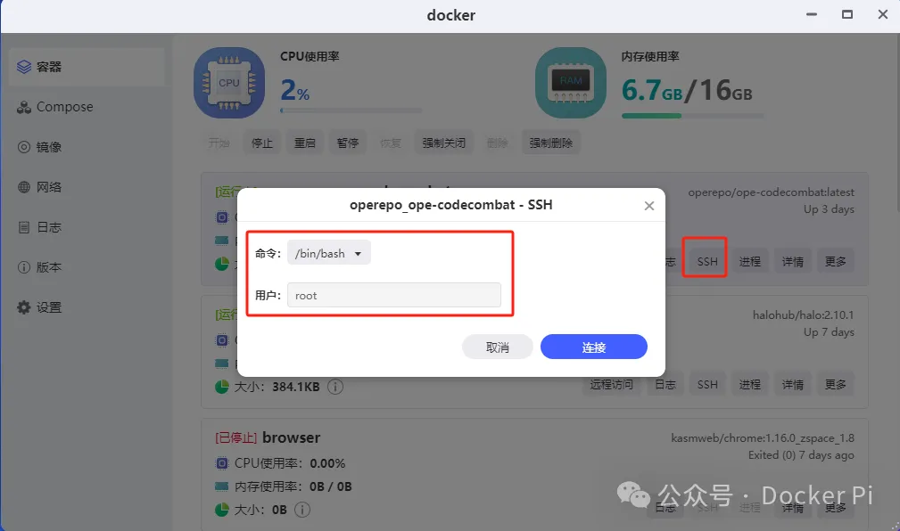
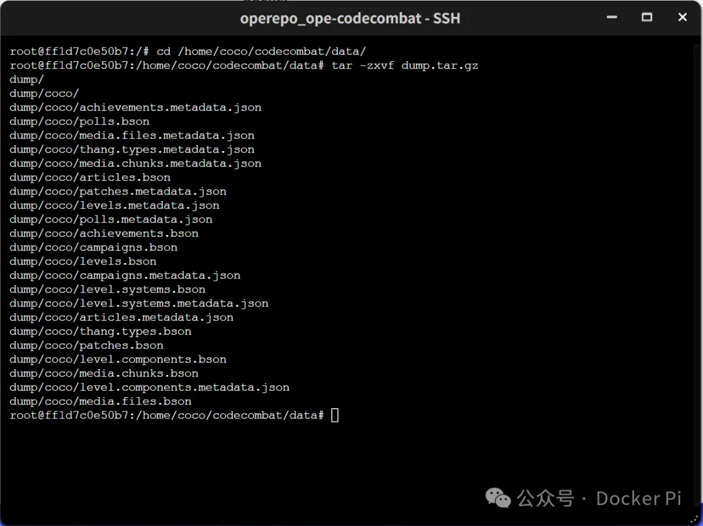

# Ubuntu安装codecombat

### 1.安装 nodejs 环境之前（删除原来的 nodejs）
```sql
# 下载 Node.js v18.18.2
wget https://npmmirror.com/mirrors/node/v18.18.2/node-v18.18.2-linux-x64.tar.xz

# 解压
tar -xvf node-v18.18.2-linux-x64.tar.xz

# 移动到 /usr/local
sudo mv node-v18.18.2-linux-x64 /usr/local/node

# 创建软链接
sudo ln -sf /usr/local/node/bin/node /usr/local/bin/node
sudo ln -sf /usr/local/node/bin/npm /usr/local/bin/npm
```

### 删除原来的 node 命令
```sql
sudo rm /usr/bin/node
sudo rm /usr/bin/npm
sudo rm /usr/bin/npx
sudo rm /usr/bin/node /usr/bin/npm /usr/bin/npx 2>/dev/null || true
```

### 创建正确的软连接
```sql
# 删除旧的 node 命令
sudo rm /usr/bin/node /usr/bin/npm /usr/bin/npx 2>/dev/null || true

# 重新创建软链接（指向新版本）
sudo ln -sf /usr/local/node/bin/node /usr/bin/node
sudo ln -sf /usr/local/node/bin/npm /usr/bin/npm
sudo ln -sf /usr/local/node/bin/npx /usr/bin/npx
```

### 2.安装飞致云
### 服务器账号
```sql
curl -sSL https://resource.fit2cloud.com/1panel/package/quick_start.sh -o quick_start.sh && sudo bash quick_start.sh

```


```sql

[1Panel 2025-09-09 15:32:36 install Log]: 外部地址:  http://114.55.99.34:19093/42a67d2644
[1Panel 2025-09-09 15:32:36 install Log]: 内部地址:  http://172.16.109.241:19093/42a67d2644
[1Panel 2025-09-09 15:32:36 install Log]: 面板用户:  admin
[1Panel 2025-09-09 15:32:36 install Log]: 面板密码:  fa67950215
```

# 【有趣的Docker】CodeCombat编程游戏
<font style="color:rgb(255, 255, 255);background-color:rgb(0, 209, 0);">CodeCombat</font>

<font style="color:rgb(25, 27, 31);">CodeCombat是一款开源的闯关游戏，通过游戏化的方式教授编程，用户在游戏中扮演角色，通过编写代码来解决问题、完成任务和击败敌人，从而逐步学习编程语言。</font><font style="color:rgb(25, 27, 31);">它结合了互动性和趣味性，使得学习编程变得更加有趣，</font><font style="color:rgb(25, 27, 31);">特别适合初学者和学生，玩家在游戏中不仅可以学习编程基础，还能面对算法、数据结构等更高级的概念。</font>

**美中不足的是不支持C或C++**，可能对初学者而言，最实用的就是Python的学习了。


  


<font style="color:rgb(255, 255, 255);background-color:rgb(0, 209, 0);">环境</font>

<font style="color:rgba(0, 0, 0, 0.9);">为了便于跨平台与外部使用，可以将其部署在服务器上或者NAS上。</font>

<font style="color:rgba(0, 0, 0, 0.9);">本文的部署环境为极空间NAS。</font>

<font style="color:rgb(25, 27, 31);">  
</font>

<font style="color:rgb(255, 255, 255);background-color:rgb(0, 209, 0);">镜像拉取</font>

<font style="color:rgb(25, 27, 31);">在极空间的高速硬盘下新建“codecombat”文件夹，然后在“codecombat”文件夹下闯将mongo，data两个子文件夹。</font>



<font style="color:rgba(0, 0, 0, 0.9);">然后在极空间的Docker镜像仓库中搜索镜像operepo/ope-codecombat”并“下载”。</font>



完成后在“本地镜像”中找到它，直接双击镜像开始部署容器。

【基本设置】这里，容器名称自己可以随意修改，取消勾选“启用性能限制”。



【文件夹路径】这里，手动添加以下映射关系：

./Docker/codecombat/data:/home/coco/codecombat/data # 冒号前面映射新建的“data”子文件夹

./Docker/codecombat/mongo:/home/coco/codecombat/mongo # 冒号前面映射新建的“mongo”子文件夹



【端口】这里保证本地端口不冲突即可。其它就没什么设置了，点击“应用”完成容器的创建。



### 运行镜像
```sql
docker run -d -p 3000:3000 --name codecombat operepo/ope-codecombat
```

### 文件拷贝 上传文件
```plain
scp D:\daima\LXShuman\codecombat.zip root@123.123.123.123:/data/codecombat
```

```sql
docker cp /home/coco/codecombat/data/dump.tar.gz codecombat:/home/coco/codecombat/data/
```

```sql
docker run -d \
  -p 3000:3000 \
  --name codecombat \
  -e DOMAIN="114.55.99.34:3000" \
  -e BASE_URL="http://114.55.99.34:3000" \
  operepo/ope-codecombat
```


```sql
# 先停掉旧容器
docker stop codecombat
docker rm codecombat

# 重新运行，覆盖环境变量
docker run -d \
  -p 3000:3000 \
  --name codecombat \
  -e DOMAIN="114.55.99.34:3000" \
  -e BASE_URL="http://114.55.99.34:3000" \
  -e OAUTH_REDIRECT_URI="http://114.55.99.34:3000/account/migrate.htm" \
  -e FORCE_SSL=false \
  operepo/ope-codecombat
```

```sql
/root/codecombat
```


```sql
MONGO_URL=mongodb://localhost:27017/coco \
SESSION_SECRET=b36dd9fd1bfcdc10c32a080eb2a5a42ddd5deb3f9a397f08d936f4cc6286669e \
PORT=3000 \
npm start
```

### 加载镜像
```plain
# 方法1：使用输入重定向
docker load < codecombat.tar

# 方法2：使用 -i 参数
docker load -i codecombat.tar

```

```plain
/data/codecombat/data

```

### 修复跨域问题
```sql
/root/codecombat/app/views/core/CreateAccountModal/
```

完成以上之后会看到容器显示“运行中”，但是工作还未完成。



<font style="color:rgb(255, 255, 255);background-color:rgb(0, 209, 0);">替换dump.tar.gz</font>

<font style="color:rgb(25, 27, 31);">接着打开网址“</font><font style="color:rgb(25, 27, 31);">https://</font><font style="color:rgb(25, 27, 31);">github.com/wei134102/Co</font><font style="color:rgb(25, 27, 31);">deCombat</font><font style="color:rgb(25, 27, 31);">”,根据提示下载dump.tar.gz这个文件。</font><font style="color:rgb(25, 27, 31);">  
</font>



<font style="color:rgb(25, 27, 31);">接着打开前面创建的“codecombat”文件夹中的“data”子文件夹，可以看</font><font style="color:rgb(25, 27, 31);">到里面也有一个dump.tar.gz文件，直接将它删除，将下载的dump.tar.gz文件移动或复制到该文件夹（data）内即可，或直接覆盖替换。</font>



<font style="color:rgb(25, 27, 31);">完成以上步骤之后，点击codecombat容器下面的“SSH”进入终端。</font>

<font style="color:rgb(25, 27, 31);">命令选择“/bin/bash”，用户默认“root”，点“连接”。</font>



<font style="color:rgb(25, 27, 31);">来到SSH终端界面，</font>**<font style="color:rgb(25, 27, 31);">依次</font>**<font style="color:rgb(25, 27, 31);">输入以下命令：</font>

cd /home/coco/codecombat/data/ # 进入容器内部data文件夹tar -zxvf dump.tar.gz # 解压dump.tar.gz文件



<font style="color:rgb(25, 27, 31);">接着同样是</font>**<font style="color:rgb(25, 27, 31);">依次</font>**<font style="color:rgb(25, 27, 31);">输入以下命令：</font>

cd /home/coco/codecombat/data # 进入容器内部data文件夹cd /home/coco # 进入容器内部coco文件夹./codecombat/bin/coco-mongodb && sh start.sh # 运行mongodb数据库，然后执行start.sh脚本

<font style="color:rgb(25, 27, 31);">等到出现上图所示的“done”标识的时候，（这个时候可能done底下还会有一些运行的内容，不用管），关闭SSH终端，这个项目才算是正式部署完成了。</font>

<font style="color:#ffffff;background-color:#00d100;">运行与注册账号</font>

<font style="color:rgb(25, 27, 31);">现在通过浏览器打开【极空间本地IP:端口号】打开CodeCombat。项目原生支持简体中文，点击“注册”。</font>

注册页面选择“注册独立账号”。

生日这里一定记得选择成人日期，建议直接1990年以前。

然后输入账号需要的邮箱、用户名，以及密码。用户名需记住，稍后会用到。

直接点“开玩”玩游戏。

<font style="color:#ffffff;background-color:#00d100;">解锁全部关卡</font>


<font style="color:rgb(25, 27, 31);">和前面一样，也是进入容器的SSH终端，依次输入以下命令：</font>

mongo # 打开mongo数据库use coco # 使用coco数据库

<font style="color:rgb(25, 27, 31);">最后输入以下命令并回车：</font>

```plain
db.users.update({'name':'你设置的用户名'},{$set:{'earned.gems':9999999, permissions:["godmode","admin"]}},true,false);
```

<font style="color:rgb(25, 27, 31);">  
</font>

+ <font style="color:rgb(25, 27, 31);">再次进入游戏，可以看到所有地图均已解锁，且左下角的蓝宝石直接加到最满。</font>

随便点击一个地图就能直接开始玩了。

解锁所有关卡以后就可以玩全部的关卡，但也有一个不好的地方，因为解锁关卡就相当于已经通关，一些关卡前的提示就没有了。


> 更新: 2025-09-10 16:35:10  
> 原文: <https://www.yuque.com/lixinsi/ynhoz5/pwig5ezpq60rodsm>