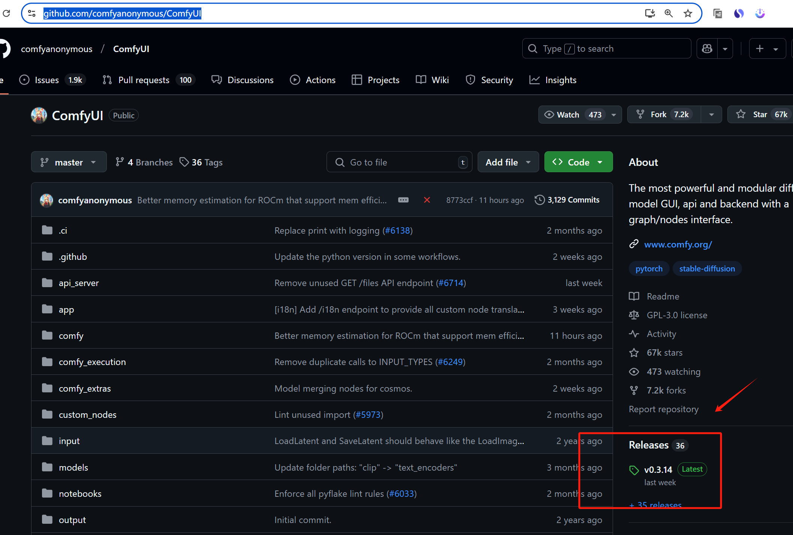
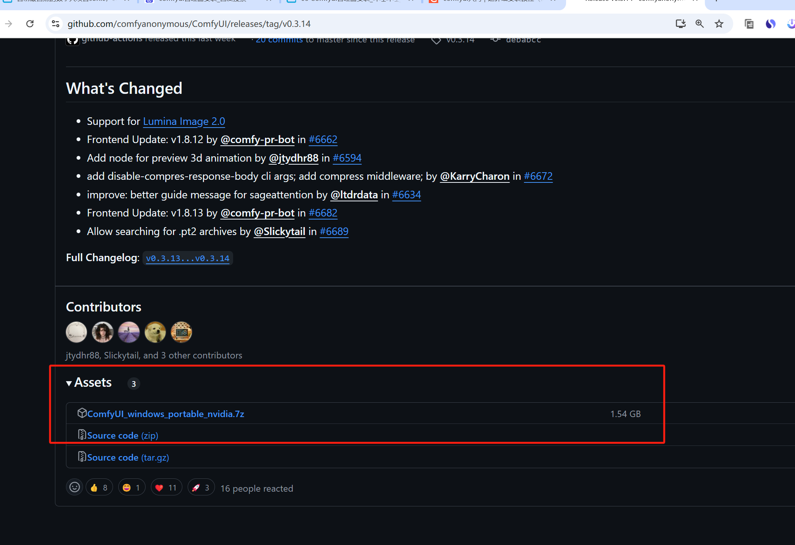
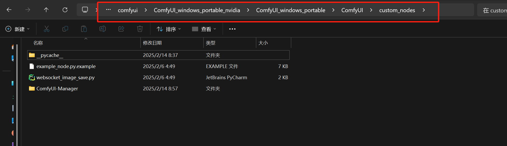
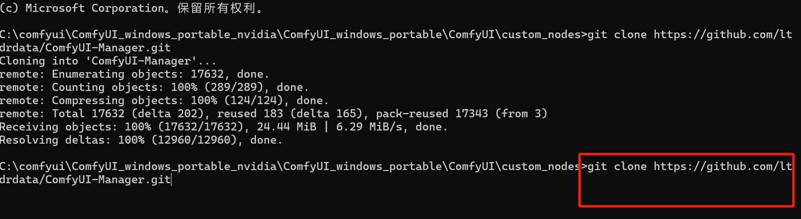
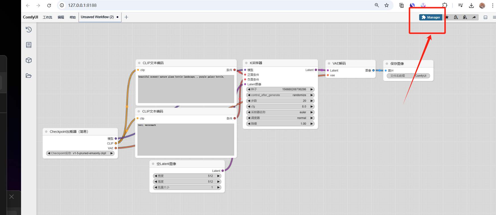
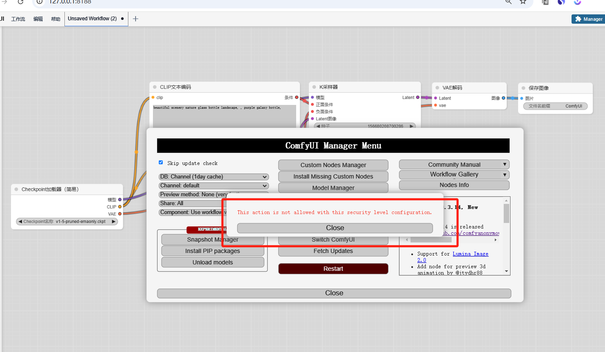
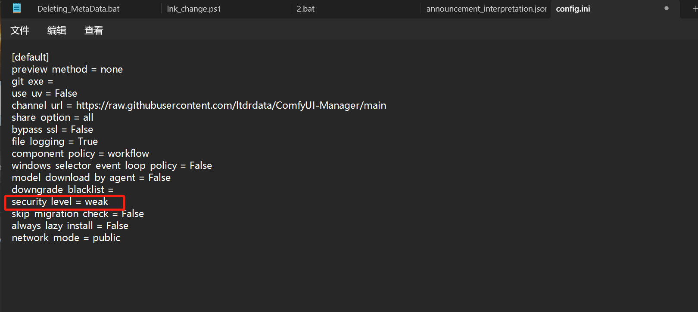
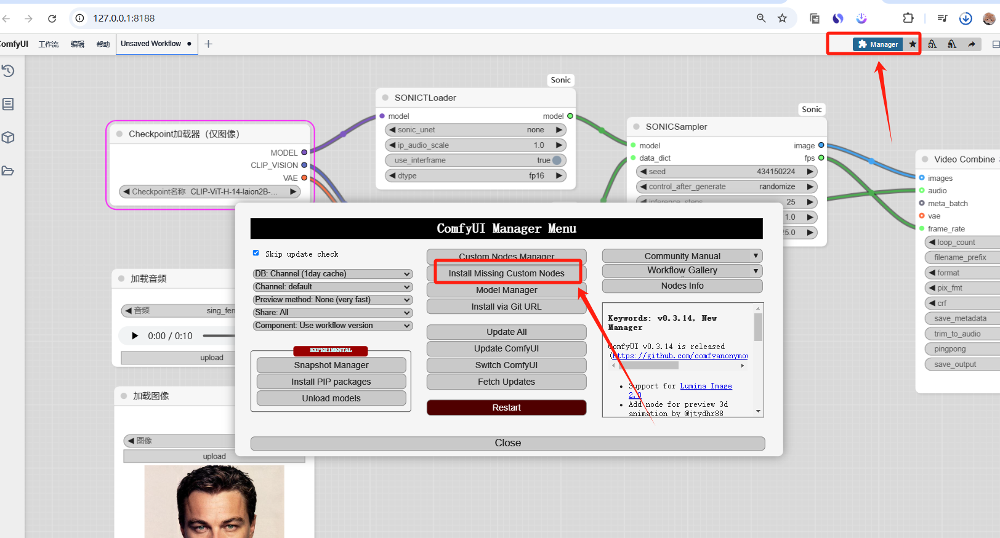
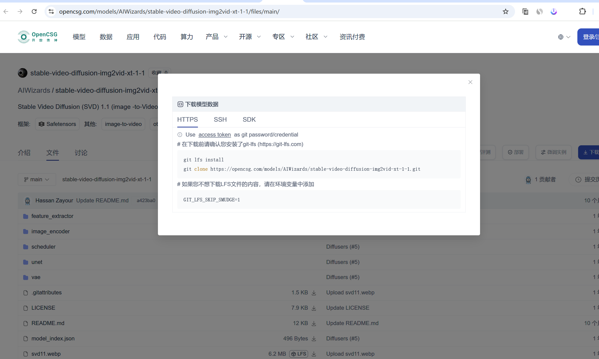

# comfyui and sonic安装

### 1.在官网下载 comfyui
下载地址：[https://github.com/comfyanonymous/ComfyUI](https://github.com/comfyanonymous/ComfyUI)

[https://www.youtube.com/watch?v=h1SpUqMXCo4](https://www.youtube.com/watch?v=h1SpUqMXCo4)





### 2.下载 comfyui 后安装 comfyui 管理器
在 comfyui 路径

```powershell
C:\comfyui\ComfyUI_windows_portable_nvidia\ComfyUI_windows_portable\ComfyUI\custom_nodes
```



执行 git 命令

```powershell
git clone https://github.com/ltdrdata/ComfyUI-Manager.git
```





### 3.重新启动 comfyui



### 4.github clone 显示克隆报错，找到 config.ini 文件


config.ini 文件

```powershell
C:\comfyui\ComfyUI_windows_portable_nvidia\ComfyUI_windows_portable\ComfyUI\user\default\ComfyUI-Manager
```



```powershell
安全策略
编辑config.ini文件：添加security_level = <LEVEL>

strong
不允许high和middle级别风险功能
normal
不允许high级别风险功能
middle级别风险功能可用
normal-
如果指定并且不以以下方式开头，则不允许high级别风险功能--listen127.
middle级别风险功能可用
weak
所有功能均可用
high风险特征级别

Install via git url，pip install
安装未在 中注册的自定义节点default channel。
修复自定义节点
middle风险特征级别

卸载/更新
安装在中注册的自定义节点default channel。
恢复/删除快照
重启
low风险特征级别

更新 ComfyUI
```

### 5.管理下载 git 后安装目录
```powershell
C:\comfyui\ComfyUI_windows_portable_nvidia\ComfyUI_windows_portable\ComfyUI\custom_nodes
```

执行 克隆项目

```powershell
git clone https://github.com/smthemex/ComfyUI_Sonic.git
```

### 6.报错解决
```powershell
首先安装ComfyUI-VideoHelperSuite：
打开ComfyUI
点击"Custom Nodes Manager"按钮
在搜索栏中输入"ComfyUI-VideoHelperSuite"
安装该包
然后安装ComfyUI_Sonic：
同样在Custom Nodes Manager中
搜索"ComfyUI_Sonic"并安装
```

### 7.节点报红


更新后重启 comfyUI

### 8.国内模型下载
下载网址：[https://opencsg.com/models/AIWizards/stable-video-diffusion-img2vid-xt-1-1/files/main/](https://opencsg.com/models/AIWizards/stable-video-diffusion-img2vid-xt-1-1/files/main/)

1.安装git-lfs-windows-v3.6.1

2.克隆

```powershell
git lfs install
git clone https://opencsg.com/models/AIWizards/stable-video-diffusion-img2vid-xt-1-1.git

```




### 9.制作好的工作流路径
```powershell
C:\comfyui\ComfyUI_windows_portable\ComfyUI\user\default\workflows
```


> 更新: 2025-02-22 16:13:04  
> 原文: <https://www.yuque.com/lixinsi/ynhoz5/gtr0ztqw818pzu1n>