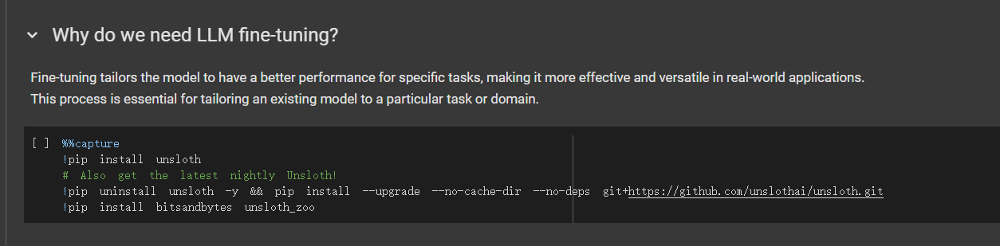
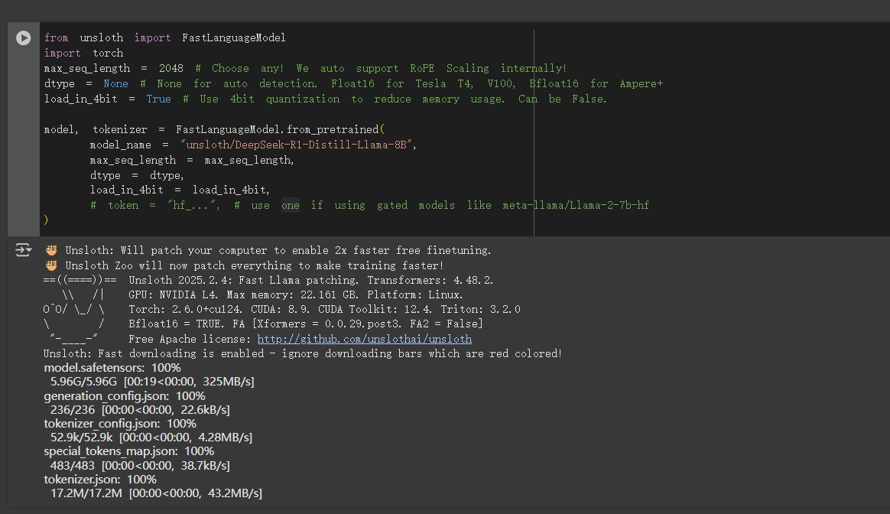

# 微调医疗模型（问答模型）

# Unsloth Fine-tuning DeepSeek R1 Distilled Llama 8B

In this notebook, it will demonstrate how to finetune `DeepSeek-R1-Distill-Llama-8B` with Unsloth, using a medical dataset.

***

keyboard\_arrow\_down

## Why do we need LLM fine-tuning?

Fine-tuning tailors the model to have a better performance for specific tasks, making it more effective and versatile in real-world applications. This process is essential for tailoring an existing model to a particular task or domain.

```python
%%capture
!pip install unsloth
# Also get the latest nightly Unsloth!
!pip uninstall unsloth -y && pip install --upgrade --no-cache-dir --no-deps git+https://github.com/unslothai/unsloth.git
!pip install bitsandbytes unsloth_zoo
```



## <font style="color:#000000;background-color:#FFFFFF;">Choose a Base Model</font>

1. <font style="color:#000000;background-color:#FFFFFF;">Choose a model that aligns with your usecase</font>
2. <font style="color:#000000;background-color:#FFFFFF;">Assess your storage, compute capacity and dataset</font>
3. <font style="color:#000000;background-color:#FFFFFF;">Select a Model and Parameters</font>
4. <font style="color:#000000;background-color:#FFFFFF;">Choose Between Base and Instruct Models</font>

```python
from unsloth import FastLanguageModel
import torch
max_seq_length = 2048 # Choose any! We auto support RoPE Scaling internally!
dtype = None # None for auto detection. Float16 for Tesla T4, V100, Bfloat16 for Ampere+
load_in_4bit = True # Use 4bit quantization to reduce memory usage. Can be False.

model, tokenizer = FastLanguageModel.from_pretrained(
    model_name = "unsloth/DeepSeek-R1-Distill-Llama-8B",
    max_seq_length = max_seq_length,
    dtype = dtype,
    load_in_4bit = load_in_4bit,
    # token = "hf_...", # use one if using gated models like meta-llama/Llama-2-7b-hf
)
```



## <font style="color:#000000;background-color:#FFFFFF;">Inference before fine-tuning</font>

```python
prompt_style = """Below is an instruction that describes a task, paired with an input that provides further context.
Write a response that appropriately completes the request.
Before answering, think carefully about the question and create a step-by-step chain of thoughts to ensure a logical and accurate response.

### Instruction:
You are a medical expert with advanced knowledge in clinical reasoning, diagnostics, and treatment planning.
Please answer the following medical question.

### Question:
{}

### Response:
<think>{}"""
```

```python
question = "一个患有急性阑尾炎的病人已经发病5天，腹痛稍有减轻但仍然发热，在体检时发现右下腹有压痛的包块，此时应如何处理？"


FastLanguageModel.for_inference(model)
inputs = tokenizer([prompt_style.format(question, "")], return_tensors="pt").to("cuda")

outputs = model.generate(
    input_ids=inputs.input_ids,
    attention_mask=inputs.attention_mask,
    max_new_tokens=1200,
    use_cache=True,
)
response = tokenizer.batch_decode(outputs)
print(response[0].split("### Response:")[1])
```

<font style="color:#000000;background-color:#FFFFFF;"><think> 好，我现在要处理一个急性阑尾炎患者的情况。患者已经发病5天，腹痛稍有减轻但仍然发热。在体检时，发现右下腹有压痛的包块。这提示可能有复发性阑尾炎。 首先，复发性阑尾炎的典型症状是持续的右下腹痛，发热，且有包块。需要进行腹部超声检查，确定包块的性质。超声可以帮助排除其他如腺体炎、胰腺炎等。 如果超声显示包块是实质性的，特别是如果有增强环或复合结节，可能需要进行穿刺检查，排除积液或其他感染情况。 如果包块是虚实相间，伴随发热，可能需要抗生素治疗，以防止感染性疾病。 如果病情稳定，可以考虑保守治疗，如口服药物，如氨基丁三醇或吡罗红，配合抗生素治疗，控制炎症。 如果包块体积较大，影响功能，或者伴随发热加重，可能需要手术，切除阑尾，通常是阑尾切除术。 总之，根据超声的结果，决定是否需要穿刺检查，选择合适的治疗方案，确保病情得到控制。 </think> 针对急性阑尾炎患者右下腹压痛包块的情况，建议以下步骤： 1. **腹部超声检查**：确定包块性质，如实质性或虚实相间，评估是否有增强环或复合结节。 2. **穿刺检查**：若包块实质性，进行穿刺检查，排除积液或感染。 3. **病情评估**：根据超声结果，决定是否需要抗生素治疗。 4. **保守治疗**：考虑使用氨基丁三醇或吡罗红，配合抗生素，控制炎症。 5. **手术评估**：若包块大或功能受损，考虑阑尾切除术。 建议在专业医生指导下进行诊断和治疗，以确保病情得到适当管理。<｜end▁of▁sentence｜></font>

<font style="color:#000000;background-color:#FFFFFF;"></font>

## Prepare Dataset

A medical dataset [https://huggingface.co/datasets/FreedomIntelligence/medical-o1-reasoning-SFT/](https://www.google.com/url?q=https%3A%2F%2Fhuggingface.co%2Fdatasets%2FFreedomIntelligence%2Fmedical-o1-reasoning-SFT%2F) will be used to train the selected model.

***

<font style="color:rgb(227, 227, 227);background-color:rgb(30, 30, 30);">  
</font>

```python
train_prompt_style = """Below is an instruction that describes a task, paired with an input that provides further context.
Write a response that appropriately completes the request.
Before answering, think carefully about the question and create a step-by-step chain of thoughts to ensure a logical and accurate response.

### Instruction:
You are a medical expert with advanced knowledge in clinical reasoning, diagnostics, and treatment planning.
Please answer the following medical question.

### Question:
{}

### Response:
<think>
{}
</think>
{}"""
```

### <font style="color:#000000;background-color:#FFFFFF;">Important Notice</font>

<font style="color:#000000;background-color:#FFFFFF;">It's crucial to add the EOS (End of Sequence) token at the end of each training dataset entry, otherwise you may encounter infinite generations.</font>

```python
EOS_TOKEN = tokenizer.eos_token  # Must add EOS_TOKEN


def formatting_prompts_func(examples):
    inputs = examples["Question"]
    cots = examples["Complex_CoT"]
    outputs = examples["Response"]
    texts = []
    for input, cot, output in zip(inputs, cots, outputs):
        text = train_prompt_style.format(input, cot, output) + EOS_TOKEN
        texts.append(text)
    return {
        "text": texts,
    }
```

```python
from datasets import load_dataset
dataset = load_dataset("FreedomIntelligence/medical-o1-reasoning-SFT", 'zh', split = "train[0:500]", trust_remote_code=True)
print(dataset.column_names)
```

<font style="color:#000000;background-color:#FFFFFF;">README.md: 100%</font>

<font style="color:#000000;"> 1.25k/1.25k \[00:00<00:00, 107kB/s]</font>

<font style="color:#000000;">medical\_o1\_sft\_Chinese.json: 100%</font>

<font style="color:#000000;"> 64.8M/64.8M \[00:00<00:00, 37.3MB/s]</font>

<font style="color:#000000;">Generating train split: 100%</font>

<font style="color:#000000;"> 24772/24772 \[00:01<00:00, 22576.55 examples/s]</font>

<font style="color:#000000;">\['Question', 'Complex\_CoT', 'Response']</font>

<font style="color:#000000;"></font>

<font style="color:#000000;">For </font><code><font style="color:#000000;">Ollama</font></code><font style="color:#000000;"> and </font><code><font style="color:#000000;">llama.cpp</font></code><font style="color:#000000;"> to function like a custom </font><code><font style="color:#000000;">ChatGPT</font></code><font style="color:#000000;"> Chatbot, we must only have 2 columns - an </font><code><font style="color:#000000;">instruction</font></code><font style="color:#000000;"> and an </font><code><font style="color:#000000;">output</font></code><font style="color:#000000;"> column. We need to transform the dataset into proper structure.</font>

```python
dataset = dataset.map(formatting_prompts_func, batched = True)
dataset["text"][0]
```

<font style="color:#000000;">Map: 100%</font>

<font style="color:#000000;"> 500/500 \[00:00<00:00, 16186.85 examples/s]</font>

<font style="color:#000000;">'Below is an instruction that describes a task, paired with an input that provides further context.\nWrite a response that appropriately completes the request.\nBefore answering, think carefully about the question and create a step-by-step chain of thoughts to ensure a logical and accurate response.\n\n### Instruction:\nYou are a medical expert with advanced knowledge in clinical reasoning, diagnostics, and treatment planning.\nPlease answer the following medical question.\n\n### Question:\n根据描述，一个1岁的孩子在夏季头皮出现多处小结节，长期不愈合，且现在疮大如梅，溃破流脓，口不收敛，头皮下有空洞，患处皮肤增厚。这种病症在中医中诊断为什么病？\n\n### Response:\n<think>\n这个小孩子在夏天头皮上长了些小结节，一直都没好，后来变成了脓包，流了好多脓。想想夏天那么热，可能和湿热有关。才一岁的小孩，免疫力本来就不强，夏天的湿热没准就侵袭了身体。\n\n用中医的角度来看，出现小结节、再加上长期不愈合，这些症状让我想到了头疮。小孩子最容易得这些皮肤病，主要因为湿热在体表郁结。\n\n但再看看，头皮下还有空洞，这可能不止是简单的头疮。看起来病情挺严重的，也许是脓肿没治好。这样的情况中医中有时候叫做禿疮或者湿疮，也可能是另一种情况。\n\n等一下，头皮上的空洞和皮肤增厚更像是疾病已经深入到头皮下，这是不是说明有可能是流注或瘰疬？这些名字常描述头部或颈部的严重感染，特别是有化脓不愈合，又形成通道或空洞的情况。\n\n仔细想想，我怎么感觉这些症状更贴近瘰疬的表现？尤其考虑到孩子的年纪和夏天发生的季节性因素，湿热可能是主因，但可能也有火毒或者痰湿造成的滞留。\n\n回到基本的</font>

<font style="color:#000000;"></font>

## Train the model

Now let's use Huggingface TRL's `SFTTrainer`.

***

```python
model = FastLanguageModel.get_peft_model(
    model,
    r = 16, # Choose any number > 0 ! Suggested 8, 16, 32, 64, 128
    target_modules = ["q_proj", "k_proj", "v_proj", "o_proj",
                      "gate_proj", "up_proj", "down_proj",],
    lora_alpha = 16,
    lora_dropout = 0, # Supports any, but = 0 is optimized
    bias = "none",    # Supports any, but = "none" is optimized
    # [NEW] "unsloth" uses 30% less VRAM, fits 2x larger batch sizes!
    use_gradient_checkpointing = "unsloth", # True or "unsloth" for very long context
    random_state = 3407,
    use_rslora = False,  # We support rank stabilized LoRA
    loftq_config = None, # And LoftQ
```

<font style="color:#000000;">Unsloth 2025.2.4 patched 32 layers with 32 QKV layers, 32 O layers and 32 MLP layers.</font>

```python
from trl import SFTTrainer
from transformers import TrainingArguments
from unsloth import is_bfloat16_supported
trainer = SFTTrainer(
    model = model,
    tokenizer = tokenizer,
    train_dataset = dataset,
    dataset_text_field = "text",
    max_seq_length = max_seq_length,
    dataset_num_proc = 2,
    packing = False, # Can make training 5x faster for short sequences.
    args = TrainingArguments(
        per_device_train_batch_size = 2,
        gradient_accumulation_steps = 4,
        warmup_steps = 5,
        max_steps = 60,
        # num_train_epochs = 1, # For longer training runs!
        learning_rate = 2e-4,
        fp16 = not is_bfloat16_supported(),
        bf16 = is_bfloat16_supported(),
        logging_steps = 1,
        optim = "adamw_8bit",
        weight_decay = 0.01,
        lr_scheduler_type = "linear",
        seed = 3407,
        output_dir = "outputs",
        report_to = "none", # Use this for WandB etc
    ),
)
```

<font style="color:#000000;">Map (num\_proc=2): 100%</font>

<font style="color:#000000;"> 500/500 \[00:01<00:00, 319.99 examples/s]</font>

```python
trainer_stats = trainer.train()
```

```plain
==((====))==  Unsloth - 2x faster free finetuning | Num GPUs = 1
   \\   /|    Num examples = 500 | Num Epochs = 1
O^O/ \_/ \    Batch size per device = 2 | Gradient Accumulation steps = 4
\        /    Total batch size = 8 | Total steps = 60
 "-____-"     Number of trainable parameters = 41,943,040
```

<font style="color:rgb(227, 227, 227);background-color:rgb(56, 56, 56);"> \[60/60 08:54, Epoch 0/1]</font>

<font style="color:rgb(227, 227, 227);background-color:rgb(56, 56, 56);"></font>

| **<font style="color:rgb(227, 227, 227);">Step</font>** | **<font style="color:rgb(227, 227, 227);">Training Loss</font>** |
| --- | --- |
| <font style="color:rgb(227, 227, 227);">1</font> | <font style="color:rgb(227, 227, 227);">2.275200</font> |
| <font style="color:rgb(227, 227, 227);">2</font> | <font style="color:rgb(227, 227, 227);">2.349100</font> |
| <font style="color:rgb(227, 227, 227);">3</font> | <font style="color:rgb(227, 227, 227);">2.295600</font> |
| <font style="color:rgb(227, 227, 227);">4</font> | <font style="color:rgb(227, 227, 227);">2.167500</font> |
| <font style="color:rgb(227, 227, 227);">5</font> | <font style="color:rgb(227, 227, 227);">2.077200</font> |
| <font style="color:rgb(227, 227, 227);">6</font> | <font style="color:rgb(227, 227, 227);">2.044300</font> |
| <font style="color:rgb(227, 227, 227);">7</font> | <font style="color:rgb(227, 227, 227);">2.155500</font> |
| <font style="color:rgb(227, 227, 227);">8</font> | <font style="color:rgb(227, 227, 227);">1.924500</font> |
| <font style="color:rgb(227, 227, 227);">9</font> | <font style="color:rgb(227, 227, 227);">1.985600</font> |
| <font style="color:rgb(227, 227, 227);">10</font> | <font style="color:rgb(227, 227, 227);">1.879300</font> |
| <font style="color:rgb(227, 227, 227);">11</font> | <font style="color:rgb(227, 227, 227);">1.763000</font> |
| <font style="color:rgb(227, 227, 227);">12</font> | <font style="color:rgb(227, 227, 227);">1.613500</font> |
| <font style="color:rgb(227, 227, 227);">13</font> | <font style="color:rgb(227, 227, 227);">1.678600</font> |
| <font style="color:rgb(227, 227, 227);">14</font> | <font style="color:rgb(227, 227, 227);">1.685600</font> |
| <font style="color:rgb(227, 227, 227);">15</font> | <font style="color:rgb(227, 227, 227);">1.630600</font> |
| <font style="color:rgb(227, 227, 227);">16</font> | <font style="color:rgb(227, 227, 227);">1.563800</font> |
| <font style="color:rgb(227, 227, 227);">17</font> | <font style="color:rgb(227, 227, 227);">1.705800</font> |
| <font style="color:rgb(227, 227, 227);">18</font> | <font style="color:rgb(227, 227, 227);">1.711900</font> |
| <font style="color:rgb(227, 227, 227);">19</font> | <font style="color:rgb(227, 227, 227);">1.544200</font> |
| <font style="color:rgb(227, 227, 227);">20</font> | <font style="color:rgb(227, 227, 227);">1.607000</font> |
| <font style="color:rgb(227, 227, 227);">21</font> | <font style="color:rgb(227, 227, 227);">1.604400</font> |
| <font style="color:rgb(227, 227, 227);">22</font> | <font style="color:rgb(227, 227, 227);">1.585500</font> |
| <font style="color:rgb(227, 227, 227);">23</font> | <font style="color:rgb(227, 227, 227);">1.564400</font> |
| <font style="color:rgb(227, 227, 227);">24</font> | <font style="color:rgb(227, 227, 227);">1.594800</font> |
| <font style="color:rgb(227, 227, 227);">25</font> | <font style="color:rgb(227, 227, 227);">1.669000</font> |
| <font style="color:rgb(227, 227, 227);">26</font> | <font style="color:rgb(227, 227, 227);">1.628400</font> |
| <font style="color:rgb(227, 227, 227);">27</font> | <font style="color:rgb(227, 227, 227);">1.641300</font> |
| <font style="color:rgb(227, 227, 227);">28</font> | <font style="color:rgb(227, 227, 227);">1.473600</font> |
| <font style="color:rgb(227, 227, 227);">29</font> | <font style="color:rgb(227, 227, 227);">1.613700</font> |
| <font style="color:rgb(227, 227, 227);">30</font> | <font style="color:rgb(227, 227, 227);">1.745600</font> |
| <font style="color:rgb(227, 227, 227);">31</font> | <font style="color:rgb(227, 227, 227);">1.649100</font> |
| <font style="color:rgb(227, 227, 227);">32</font> | <font style="color:rgb(227, 227, 227);">1.590800</font> |
| <font style="color:rgb(227, 227, 227);">33</font> | <font style="color:rgb(227, 227, 227);">1.551200</font> |
| <font style="color:rgb(227, 227, 227);">34</font> | <font style="color:rgb(227, 227, 227);">1.576100</font> |
| <font style="color:rgb(227, 227, 227);">35</font> | <font style="color:rgb(227, 227, 227);">1.567600</font> |
| <font style="color:rgb(227, 227, 227);">36</font> | <font style="color:rgb(227, 227, 227);">1.583100</font> |
| <font style="color:rgb(227, 227, 227);">37</font> | <font style="color:rgb(227, 227, 227);">1.712200</font> |
| <font style="color:rgb(227, 227, 227);">38</font> | <font style="color:rgb(227, 227, 227);">1.438300</font> |
| <font style="color:rgb(227, 227, 227);">39</font> | <font style="color:rgb(227, 227, 227);">1.600900</font> |
| <font style="color:rgb(227, 227, 227);">40</font> | <font style="color:rgb(227, 227, 227);">1.496900</font> |
| <font style="color:rgb(227, 227, 227);">41</font> | <font style="color:rgb(227, 227, 227);">1.624100</font> |
| <font style="color:rgb(227, 227, 227);">42</font> | <font style="color:rgb(227, 227, 227);">1.441300</font> |
| <font style="color:rgb(227, 227, 227);">43</font> | <font style="color:rgb(227, 227, 227);">1.608900</font> |
| <font style="color:rgb(227, 227, 227);">44</font> | <font style="color:rgb(227, 227, 227);">1.404400</font> |
| <font style="color:rgb(227, 227, 227);">45</font> | <font style="color:rgb(227, 227, 227);">1.697600</font> |
| <font style="color:rgb(227, 227, 227);">46</font> | <font style="color:rgb(227, 227, 227);">1.576600</font> |
| <font style="color:rgb(227, 227, 227);">47</font> | <font style="color:rgb(227, 227, 227);">1.630500</font> |
| <font style="color:rgb(227, 227, 227);">48</font> | <font style="color:rgb(227, 227, 227);">1.494800</font> |
| <font style="color:rgb(227, 227, 227);">49</font> | <font style="color:rgb(227, 227, 227);">1.484500</font> |
| <font style="color:rgb(227, 227, 227);">50</font> | <font style="color:rgb(227, 227, 227);">1.582000</font> |
| <font style="color:rgb(227, 227, 227);">51</font> | <font style="color:rgb(227, 227, 227);">1.435800</font> |
| <font style="color:rgb(227, 227, 227);">52</font> | <font style="color:rgb(227, 227, 227);">1.532900</font> |
| <font style="color:rgb(227, 227, 227);">53</font> | <font style="color:rgb(227, 227, 227);">1.461500</font> |
| <font style="color:rgb(227, 227, 227);">54</font> | <font style="color:rgb(227, 227, 227);">1.692900</font> |
| <font style="color:rgb(227, 227, 227);">55</font> | <font style="color:rgb(227, 227, 227);">1.634200</font> |
| <font style="color:rgb(227, 227, 227);">56</font> | <font style="color:rgb(227, 227, 227);">1.486200</font> |
| <font style="color:rgb(227, 227, 227);">57</font> | <font style="color:rgb(227, 227, 227);">1.510000</font> |
| <font style="color:rgb(227, 227, 227);">58</font> | <font style="color:rgb(227, 227, 227);">1.558800</font> |
| <font style="color:rgb(227, 227, 227);">59</font> | <font style="color:rgb(227, 227, 227);">1.487100</font> |
| <font style="color:rgb(227, 227, 227);">60</font> | <font style="color:rgb(227, 227, 227);">1.592900</font> |

## <font style="color:#000000;">Inference after fine-tuning</font>

<font style="color:#000000;">Let's inference with same question again and see the difference.</font>

```python
print(question)
```

<font style="color:#000000;">一个患有急性阑尾炎的病人已经发病5天，腹痛稍有减轻但仍然发热，在体检时发现右下腹有压痛的包块，此时应如何处理？</font>

```python
FastLanguageModel.for_inference(model)  # Unsloth has 2x faster inference!
inputs = tokenizer([prompt_style.format(question, "")], return_tensors="pt").to("cuda")

outputs = model.generate(
    input_ids=inputs.input_ids,
    attention_mask=inputs.attention_mask,
    max_new_tokens=1200,
    use_cache=True,
)
response = tokenizer.batch_decode(outputs)
print(response[0].split("### Response:")[1])
```

<font style="color:#000000;"> <think> 这个病人已经有五天的急性阑尾炎了，虽然他的腹痛稍微好了一点，但他还是发烧的。听说在右下腹部发现了一个压痛的包块，这让我有点担心。 首先，我想到了急性阑尾炎的典型症状，包括右下腹痛、发热、腹泻、发热和腹部压痛。这个包块的存在似乎说明病情有些进展，可能已经形成了一个外痔。 我记得急性阑尾炎的治疗通常是针对炎症的控制和支持治疗，包括抗生素、解热药和镇痛药。这些药物可以帮助缓解症状，但对于病情的急性阶段来说，这些可能不够。 然后，我想到急性阑尾炎的病情有可能发展成急性阑尾炎的外痔，这种情况需要更积极的处理。包块的存在可能意味着炎症已经扩散到了阑尾周围，形成了一个外痔。 在这种情况下，我认为最有效的治疗方法是使用抗生素和解热药来控制炎症，同时通过外科手术来处理外痔。手术可以清除炎症，减少病情恶化的风险。 最后，我想到了在急性阶段进行手术的可能性。虽然这可能增加了手术并发症的风险，但如果没有及时处理，病情可能会进一步恶化，甚至导致严重的并发症。 综上所述，我认为在这种情况下，应当立即进行外科手术来处理外痔，以降低病情恶化的风险。 </think> 在这种情况下，病人已经发病5天，虽然腹痛有所缓解，但仍然发热，并且在右下腹部有压痛的包块。根据这些症状，可能已经形成了急性阑尾炎的外痔。因此，建议立即进行外科手术处理，以清除外痔，减少病情恶化的风险。<｜end▁of▁sentence｜></font>

<font style="color:rgb(227, 227, 227);background-color:rgb(56, 56, 56);"></font>

## Upload Model to HuggingFace

Now, let's save our finetuned model and upload it to HuggingFace.

***

keyboard\_arrow\_down

### Save the fine-tuned model to GGUF format

Choose the llama.cpp's GGUF format we prefer by setting the corresponding `if` to `True`.

```python
from google.colab import userdata

HUGGINGFACE_TOKEN = userdata.get('HUGGINGFACE_TOKEN')
```

```python
# Save to 8bit Q8_0
if True: model.save_pretrained_gguf("model", tokenizer,)

# Save to 16bit GGUF
if False: model.save_pretrained_gguf("model_f16", tokenizer, quantization_method = "f16")

# Save to q4_k_m GGUF
if False: model.save_pretrained_gguf("model", tokenizer, quantization_method = "q4_k_m")
```

### Push the model to HuggingFace

***

Create a model type repository for your model if you haven't done so.

```python
from huggingface_hub import create_repo
create_repo("wyang14/medical-model", token=HUGGINGFACE_TOKEN, exist_ok=True)
```

<font style="color:rgb(227, 227, 227);background-color:rgb(56, 56, 56);">Re</font><font style="color:#000000;">poUrl('</font>[<font style="color:#000000;">https://huggingface.co/wyang14/medical-model</font>](https://huggingface.co/wyang14/medical-model)<font style="color:#000000;">', endpoint='</font>[<font style="color:#000000;">https://huggingface.co</font>](https://huggingface.co/)<font style="color:#000000;">', repo\_type='model', repo\_id='wyang14/medical-model')</font>

```python
model.push_to_hub_gguf("wyang14/medical-model", tokenizer, token = HUGGINGFACE_TOKEN)
```


> 更新: 2025-02-28 15:36:53  
> 原文: <https://www.yuque.com/lixinsi/ynhoz5/ebe3t93gvxzduoat>