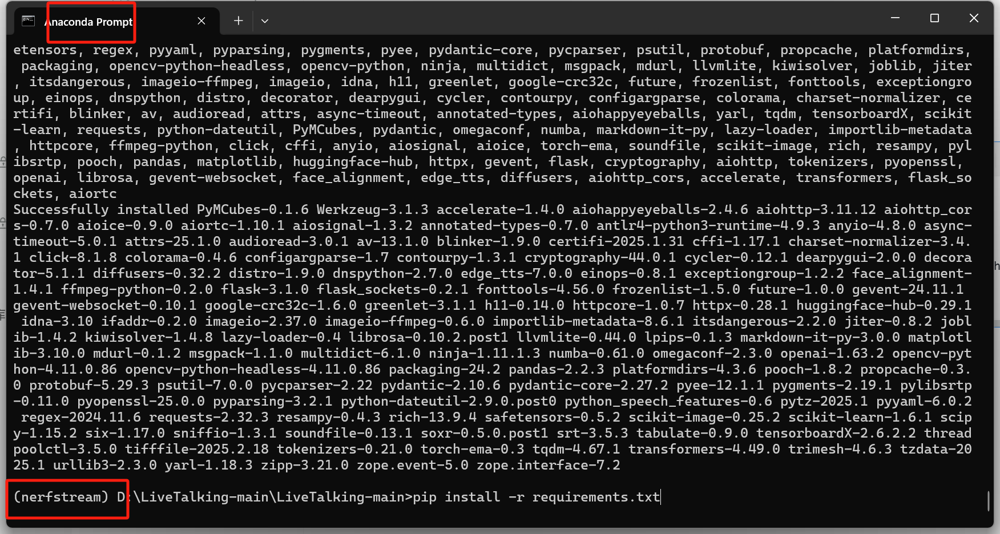

# 数字人LiveTalking

### 开源地址

<https://github.com/lipku/LiveTalking>

<https://github.com/antgroup/echomimic_v2>

```plain
conda activate livetalking 
```

```plain
python app.py --model wav2lip --transport webrtc --avatar_id wav2lip256_avatar1
```

SOLO Builder

参考了 1 个上下文

看到您遇到了SSL证书信任问题导致curl下载失败。让我为您提供几种替代解决方案：

## 解决方案1：使用PowerShell下载（推荐）

在PowerShell中执行以下命令：

```plain
# 进入web目录
cd web

# 使用PowerShell下载，忽略SSL证书验证
[System.Net.ServicePointManager]
::ServerCertificateValidationCallback
 = {$true}
Invoke-WebRequest -Uri "https://cdn.
sockjs.org/sockjs-0.3.4.min.js" 
-OutFile "sockjs-0.3.4.min.js"
```

## 解决方案2：手动创建SockJS文件

如果下载仍然失败，请在 web 目录下创建 sockjs-0.3.4.min.js 文件，内容如下：

```plain
/*! SockJS client v0.3.4 http://
sockjs.org/ */
/* 简化版本 - 基本WebSocket功能 */
(function() {
    var SockJS = function(url, 
    protocols, options) {
        if (!(this instanceof 
        SockJS)) {
            return new SockJS(url, 
            protocols, options);
        }
        
        var self = this;
        this.url = url;
        this.readyState = SockJS.
        CONNECTING;
        
        // 尝试使用原生WebSocket
        try {
            var wsUrl = url.replace(/
            ^http/, 'ws');
            this._ws = new WebSocket
            (wsUrl);
            
            this._ws.onopen = 
            function(e) {
                self.readyState = 
                SockJS.OPEN;
                if (self.onopen) 
                self.onopen(e);
            };
            
            this._ws.onmessage = 
            function(e) {
                if (self.onmessage) 
                self.onmessage(e);
            };
            
            this._ws.onclose = 
            function(e) {
                self.readyState = 
                SockJS.CLOSED;
                if (self.onclose) 
                self.onclose(e);
            };
            
            this._ws.onerror = 
            function(e) {
                if (self.onerror) 
                self.onerror(e);
            };
        } catch (e) {
            setTimeout(function() {
                self.readyState = 
                SockJS.CLOSED;
                if (self.onclose) 
                self.onclose({code: 
                1006, reason: 
                'WebSocket not 
                supported'});
            }, 0);
        }
    };
    
    SockJS.CONNECTING = 0;
    SockJS.OPEN = 1;
    SockJS.CLOSING = 2;
    SockJS.CLOSED = 3;
    
    SockJS.prototype.send = function
    (data) {
        if (this._ws && this.
        readyState === SockJS.OPEN) {
            this._ws.send(data);
        }
    };
    
    SockJS.prototype.close = function
    (code, reason) {
        if (this._ws) {
            this._ws.close(code, 
            reason);
        }
    };
    
    // 导出到全局
    if (typeof window !== 
    'undefined') {
        window.SockJS = SockJS;
    } else if (typeof module !== 
    'undefined' && module.exports) {
        module.exports = SockJS;
    }
})();
```

## 解决方案3：修改HTML文件移除SockJS依赖

如果项目实际上不需要SockJS，可以直接修改HTML文件：

### 修改 web/webrtcapi-asr.html

找到第52行：

```plain
<script type="text/javascript" 
src="http://cdn.sockjs.org/sockjs-0.
3.4.js"></script>

```

将其注释掉或删除：

```plain
<!-- <script type="text/javascript" 
src="http://cdn.sockjs.org/sockjs-0.
3.4.js"></script> -->
```

### 修改 web/webrtc.html

同样处理第47行的SockJS引用。

## 推荐步骤

```plain
  a. 首先尝试解决方案1 （PowerShell下载）
2. 
  a. 如果失败，使用解决方案2 （手动创建文件）
3. 
  a. 然后修改HTML文件引用 ：
  ○ 将 src="http://cdn.sockjs.org/sockjs-0.3.4.js"
  ○ 改为 src="sockjs-0.3.4.min.js"
4. 
  a. 重启应用并测试
这样就能解决CDN资源加载失败的问题，让应用正常运行。
```

帮我检查LiveTalking水印和标识

我需要搜索LiveTalking项目中的水印和标识相关内容，包括可能的logo、品牌标识、版权信息等。

在工作区搜索 'LiveTalking水印、标识、logo、品牌标识、版权信息、watermark相关内容'

我找到了LiveTalking项目中关于水印和标识的重要信息。现在让我搜索更多相关的前端文件和配置，看看具体的水印实现。

在工作区搜索 '前端页面中的水印显示、logo图片、品牌标识显示、版权声明、LiveTalking标识的具体实现代码'

我已经找到了LiveTalking项目中水印和标识的相关信息。现在让我查看web目录下的其他HTML文件，看看是否还有更多的水印实现。

web\webrtcapi-asr.html 1 - 50

让我检查项目中是否有专门的logo或图片文件，以及查看更多关于水印实现的代码。

在工作区搜索 'LiveTalking|logo|watermark|水印|标识'

现在让我查看具体的水印实现代码，特别是basereal.py中的水印添加逻辑。

basereal.py 360 - 380

让我查看其他文件中的水印实现，特别是wav2lip和musetalk相关的文件。

wav2lip\genavatar.py 35 - 45

genavatar\_musetalk.py 35 - 45

让我检查web目录下是否有任何logo图片文件或其他水印相关的资源文件。

LiveTalking\web

# LiveTalking 水印和标识检查报告

经过全面检查，我发现了LiveTalking项目中的水印和标识相关配置：

## 🏷️ 主要水印实现

### 1. 视频帧水印

LiveTalking在多个关键位置添加了"LiveTalking"文字水印：

```plain
核心实现位置：
● basereal.py (第368行)
● wav2lip\genavatar.py (第39行)
● genavatar_musetalk.py (第37行)
● ultralight\genavatar.py (第107行)
水印样式：
cv2.putText(combine_frame, 
"LiveTalking", (10, 20), cv2.
FONT_HERSHEY_SIMPLEX, 0.3, (128,128,
128), 1)
● 位置：左上角 (10, 20)
● 字体：FONT_HERSHEY_SIMPLEX
● 大小：0.3
● 颜色：灰色 (128,128,128)
● 线条粗细：1
```

### 1.<font style="color:rgb(34, 34, 38);">Windows11 部署 LiveTalking 项目过程以及坑点</font>

```python
conda create -n nerfstream python=3.10

conda activate nerfstream

pip3 install torch torchvision torchaudio --index-url https://download.pytorch.org/whl/cu124

pip install -r requirements.txt
```



这个 Docker 命令用于启动一个 **SRS（Simple Realtime Server）流媒体服务器**容器，并配置其支持 WebRTC 等实时通信功能。以下是逐部分解释：

***

### 1. 基础命令

```bash
docker run --rm
```

* `docker run`: 启动一个新的容器。
* `--rm`: 容器停止后自动删除（避免残留容器，适合测试环境）。

***

### 2. 环境变量

```bash
--env CANDIDATE=$CANDIDATE
```

* **作用**: 将宿主机的环境变量 `CANDIDATE` 传递给容器。
* **用途**: 通常用于 WebRTC 的 ICE 候选地址（如服务器的公网 IP 或 NAT 穿透地址）。在 SRS 的 `rtc.conf` 配置文件中，可能通过 `${CANDIDATE}` 引用该变量，确保 WebRTC 能正确建立连接。

***

### 3. 端口映射

```bash
-p 1935:1935      # RTMP 协议（默认端口）
-p 8080:8080      # HTTP API/管理界面、HLS 或 FLV 拉流
-p 1985:1985      # HTTP API 端口（如服务器状态、控制接口）
-p 8000:8000/udp  # WebRTC/SRT 数据传输（UDP 协议）
```

* **关键端口**:
  * **1935**: RTMP 推流/拉流（传统直播协议）。
  * **8000/udp**: WebRTC 数据传输必须的 UDP 端口。
  * **8080**: 管理后台或 HTTP-FLV/HLS 流访问。

***

### 4. 镜像

```bash
registry.cn-hangzhou.aliyuncs.com/ossrs/srs:5
```

* **来源**: 阿里云镜像仓库的 SRS 官方镜像。
* **版本**: 标签 `5` 代表 SRS 5.x 版本（支持 WebRTC、SRT 等现代协议）。

***

### 5. 容器内启动命令

```bash
objs/srs -c conf/rtc.conf
```

* `objs/srs`: 运行 SRS 可执行文件（编译后的二进制路径）。
* `-c conf/rtc.conf`: 指定配置文件为 `rtc.conf`，该配置默认启用 WebRTC 相关功能。

***

### 整体作用

此命令启动了一个**支持 WebRTC 的流媒体服务器**，适用于：

1. **浏览器推拉 WebRTC 流**。
2. **传统 RTMP 推流**（如 OBS）并转换为 WebRTC。
3. 通过 HTTP API（8080/1985 端口）管理服务器或监控状态。

***

### 注意事项

1. **宿主机的 **`CANDIDATE`** 变量**:
   * 必须提前设置（如 `export CANDIDATE=你的公网IP`），否则 WebRTC 可能无法跨网络连接。
   * 本地测试可设为内网 IP（如 `export CANDIDATE=192.168.1.100`）。
2. **端口冲突**:
   * 确保宿主机端口（如 1935、8080）未被占用。
3. \*\*配置文件 \*\*`rtc.conf`:
   * 可在 SRS 官方文档中查看默认配置，或挂载自定义配置（通过 `-v` 卷挂载）。

***

### 示例用法

1. **设置环境变量并启动**:

```bash
export CANDIDATE=你的公网IP
docker run --rm --env CANDIDATE=$CANDIDATE -p 1935:1935 -p 8080:8080 -p 1985:1985 -p 8000:8000/udp registry.cn-hangzhou.aliyuncs.com/ossrs/srs:5 objs/srs -c conf/rtc.conf
```

2. **推流测试**:
   * **WebRTC 推流**: 浏览器访问 `http://宿主机IP:8080/players/rtc_publisher.html`。
   * **RTMP 推流**: OBS 推流到 `rtmp://宿主机IP:1935/live/流名称`。
3. **播放流**:
   * **WebRTC 播放**: 访问 `http://宿主机IP:8080/players/rtc_player.html`。
   * **HTTP-FLV**: `http://宿主机IP:8080/live/流名称.flv`。

* 你在运行 Docker 命令时遇到了 **端口 8080 被占用** 的问题。以下是详细分析和解决方案：

***

### **问题原因**

错误信息显示：

```bash
docker: Error response from daemon: Ports are not available: exposing port TCP 0.0.0.0:8080 -> 127.0.0.1:0: listen tcp 0.0.0.0:8080: bind: An attempt was made to access a socket in a way forbidden by its access permissions.
```

这表示 **宿主机的 8080 端口已被其他进程占用**，Docker 无法绑定该端口。

***

### **解决方案**

#### 1. 检查端口占用并释放

**步骤：**

1. **查找占用 8080 端口的进程**：

```bash
netstat -ano | findstr :8080
```

```
- 输出示例：
```

```plain
TCP    0.0.0.0:8080     0.0.0.0:0    LISTENING   12345
```

```
- 最后一列 `12345` 是进程 PID。
```

2\. **终止占用进程**：

```bash
taskkill /F /PID 12345
```

***

#### 2. 更换宿主机端口映射

如果无法终止占用进程，可以修改 Docker 命令，将宿主机的其他端口（如 `8081`）映射到容器的 `8080` 端口：

```bash
docker run -p 1935:1935 -p 8081:8080 -p 1985:1985 -p 8000:8000/udp registry.cn-hangzhou.aliyuncs.com/ossrs/srs:5 objs/srs -c conf/rtc.conf
```

* 此时通过 `http://宿主机IP:8081` 访问管理界面。

***

#### 3. 以管理员权限运行

某些系统可能限制普通用户绑定端口。尝试 **以管理员身份运行命令提示符**：

1. 右键点击 `CMD` 或 `PowerShell`，选择 **以管理员身份运行**。
2. 重新执行 Docker 命令。

***

#### 4. 检查 Docker 容器冲突

确保没有其他 Docker 容器正在占用端口：

1. **列出所有容器**：

```bash
docker ps -a
```

2. **停止冲突容器**：

```bash
docker stop 容器ID
docker rm 容器ID
```

***

#### 5. 重启 Docker 服务

临时性端口冲突可能是 Docker 服务状态异常导致的：

1. 重启 Docker Desktop。
2. 或者命令行重启服务：

```bash
net stop com.docker.service
net start com.docker.service
```

***

### **验证是否解决**

重新运行 Docker 命令后，访问 `http://localhost:8080`，如果能看到 SRS 管理界面，则说明成功。

***

### **附加说明**

* 如果使用 **公司或学校电脑**，可能有防火墙或组策略限制端口访问，需联系 IT 部门。
* 若需保留 `8080` 端口，必须彻底关闭占用该端口的进程（如 IIS、Jenkins、其他 Docker 容器等）。

***

通过以上步骤，应该能解决端口占用问题。如果仍有问题，请提供执行 `netstat -ano | findstr :8080` 的输出结果。

针对你持续遇到的端口 8080 占用问题，以下是分步排查和解决方案：

***

### **1. 确认端口占用情况（终极验证）**

在管理员权限的 PowerShell 或 CMD 中执行：

```powershell
# 查看 8080 端口占用详情（包括隐藏进程）
netstat -ano | findstr :8080

# 查看占用进程的名称和路径
tasklist /FI "PID eq 你的PID" 
```

* 如果输出结果为空，说明端口未被占用，可能是 **Docker 或系统级保留端口问题**。
* 如果仍有进程占用，但无法终止，继续下一步。

***

### **2. 彻底关闭 Hyper-V 保留端口**

Windows 的 Hyper-V 或 WSL 会保留部分端口范围，导致 Docker 无法使用。通过以下命令释放端口：

```powershell
# 查看当前排除的端口范围
netsh int ipv4 show excludedportrange protocol=tcp

# 临时关闭 Hyper-V（会关闭 WSL 和虚拟机）
dism.exe /Online /Disable-Feature:Microsoft-Hyper-V

# 重启系统后，再次运行 Docker 命令
```

> 💡 注意：关闭 Hyper-V 会影响 WSL 和虚拟机，建议执行后重启系统再测试。如果解决问题，可调整排除端口范围：[微软官方文档](https://docs.microsoft.com/en-us/windows/wsl/wsl-config#configure-global-options-with-wslconfig)。

***

### **3. 更换 Docker 端口映射为高位端口**

将宿主机端口从 `8080` 改为 `18080`（或其他 1024 以上的端口）：

```bash
docker run -p 1935:1935 -p 18080:8080 -p 1985:1985 -p 8000:8000/udp registry.cn-hangzhou.aliyuncs.com/ossrs/srs:5 objs/srs -c conf/rtc.conf
```

* 通过 `http://localhost:18080` 访问管理界面。

***

### **4. 检查 Docker 镜像名称拼写**

你提供的命令中存在镜像地址拼写错误：

```diff
- registry.cn-hangzhou.allyuncs.com/ossrs/srs:5
+ registry.cn-hangzhou.aliyuncs.com/ossrs/srs:5
```

* `allyuncs.com`\*\* → 正确应为 \*\*`aliyuncs.com`（阿里云镜像仓库地址）。
* 修正后重新运行命令：

```bash
docker run -p 1935:1935 -p 8080:8080 -p 1985:1985 -p 8000:8000/udp registry.cn-hangzhou.aliyuncs.com/ossrs/srs:5 objs/srs -c conf/rtc.conf
```

***

### **5. 终极解决方案：重启系统**

某些系统级端口占用（如 Windows 更新服务）可能在重启后自动释放：

1. 保存工作并重启电脑。
2. **开机后第一时间运行 Docker 命令**，避免其他软件抢占端口。

***

### **6. 检查防病毒软件或防火墙**

部分安全软件会拦截端口访问：

1. 临时禁用防火墙：

```powershell
netsh advfirewall set allprofiles state off
```

2. 暂时退出防病毒软件（如 360、火绒等）。
3. 重新运行 Docker 命令测试。

***

### **7. 重置 Docker 网络**

如果 Docker 网络配置异常，可重置虚拟网络：

```bash
# 停止 Docker 服务
net stop com.docker.service

# 清理 Docker 网络
docker network prune -f

# 重启 Docker 服务
net start com.docker.service
```

***

### **问题总结**

| 可能性 | 解决方案 | 优先级 |
| --- | --- | --- |
| 拼写错误 | 修正镜像地址 | ⭐⭐⭐ |
| Hyper-V 保留端口 | 关闭 Hyper-V 或调整排除端口范围 | ⭐⭐ |
| 系统级占用 | 重启后第一时间运行 Docker | ⭐⭐⭐ |
| 安全软件拦截 | 临时禁用防火墙和杀毒软件 | ⭐⭐ |

***

请按以上步骤逐一尝试，若问题仍未解决，请提供以下信息：

1. 执行 `netstat -ano | findstr :8080` 的输出截图。
2. 执行 `netsh int ipv4 show excludedportrange protocol=tcp` 的结果。
3. 是否在 **公司/学校网络** 下运行（可能存在端口管控）？


> 更新: 2025-08-14 11:09:41  
> 原文: <https://www.yuque.com/lixinsi/ynhoz5/lb9m52ha52gqyc9n>