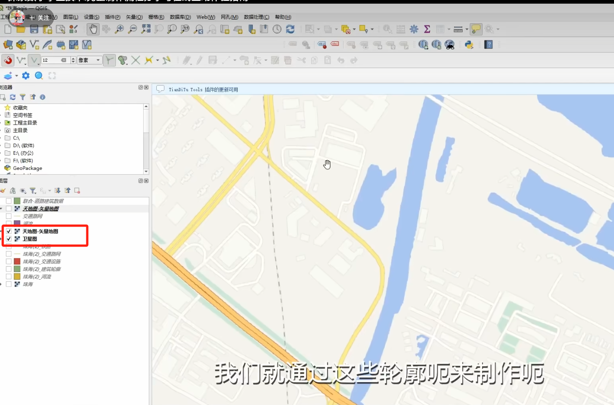
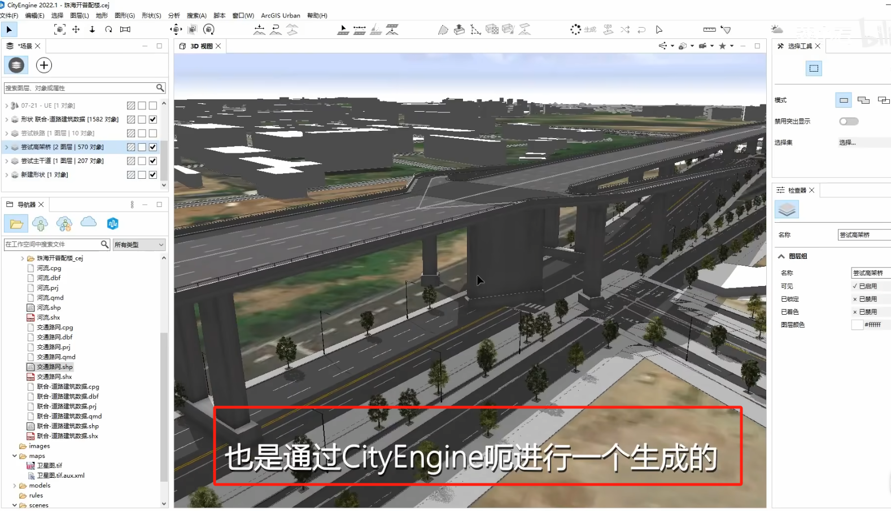
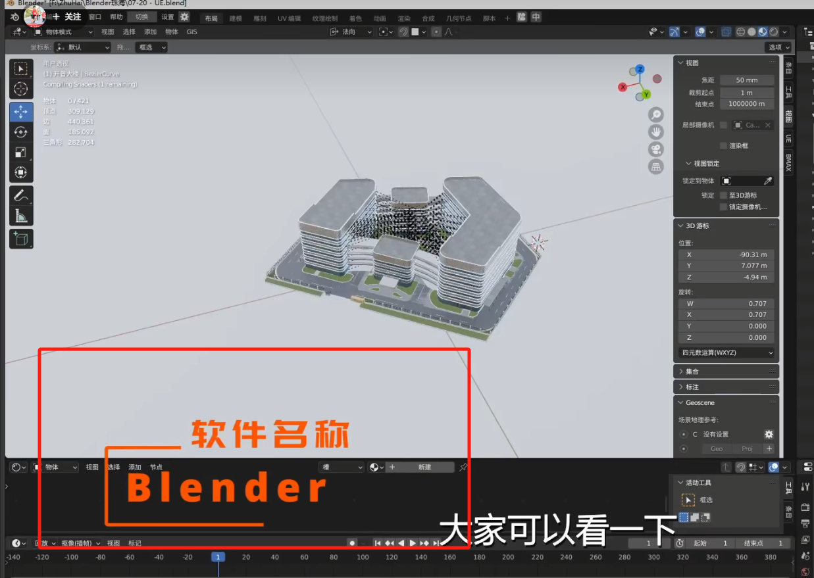
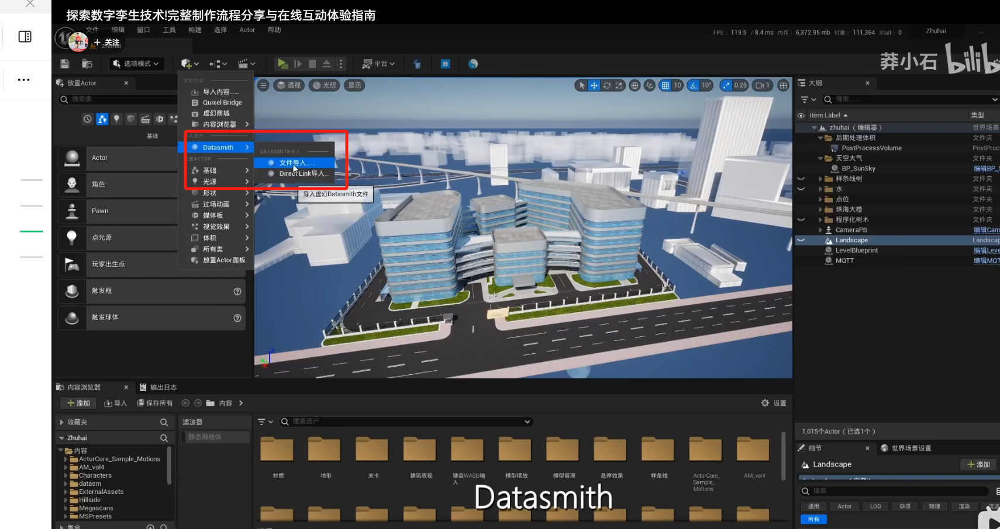
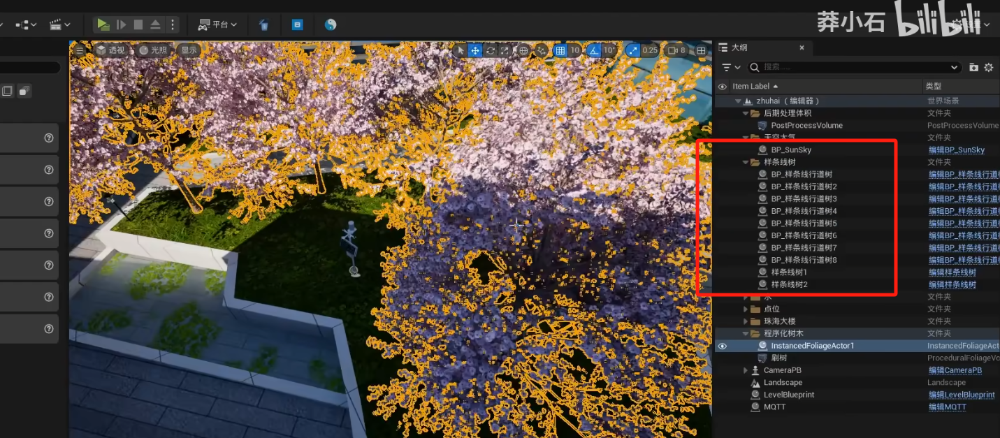
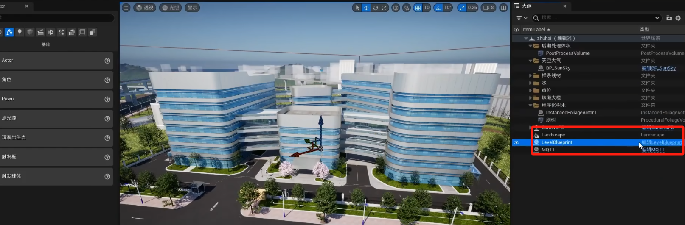
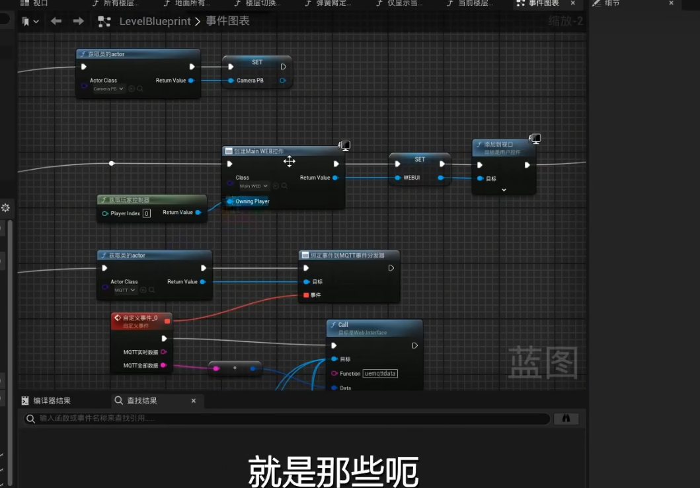
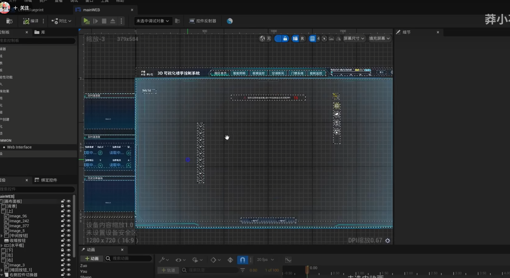
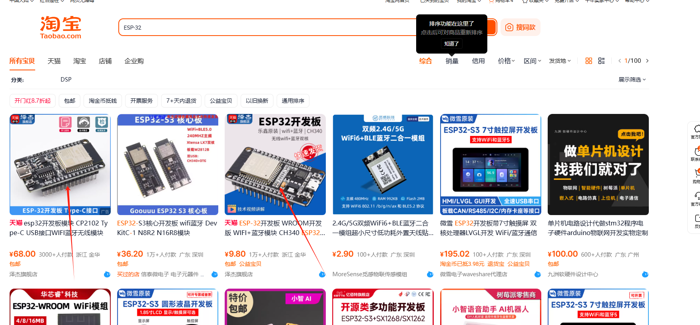

# 数字孪生制作

### 1.获取地理信息，包括河流，楼房，用 Qgis 软件安装天地图插件获取数据

### 2.生成高度，配楼用 cityengine 软件

### 3.生成好后导入到 Blender 里面，用航拍机周边所有的模型全部扫描下来，然后 3d 建模。在导入到 Blender

### 4.在 Blender 里面使用 datasmit 导进去。刚刚到进入就是这样

### 5.树木是应用样条线行道树素材。

### 6.制作蓝图节点

### 7.UI 组件 UN 虚拟引擎

### 物联网MQTT,Modbus可以了解一下

物联网中的 **MQTT**（Message Queuing Telemetry Transport）是一种轻量级的通信协议，专为低带宽、高延迟或不稳定网络环境下的物联网设备设计。它基于**发布-订阅（Pub-Sub）模式**，支持设备间的异步通信，广泛应用于传感器数据采集、远程监控、智能家居等领域。

***

### **MQTT 的核心特点**

1. **轻量级**
   * 协议头小（最小仅2字节），适合资源受限的物联网设备（如传感器、单片机）。
   * 传输效率高，节省网络带宽和电力。
2. **发布-订阅模式**
   * 设备（客户端）通过主题（Topic）发布或订阅消息，无需直接通信。
   * **解耦性**：发布者和订阅者不需要知道彼此的存在，仅通过 Broker 交互。
3. **低带宽和低功耗**
   * 支持短连接（如 HTTP 的长连接会消耗更多资源），适合电池供电的设备。
4. **可靠的消息传输**
   * 提供 3 种 **QoS（Quality of Service）** 级别：
     * **QoS 0**：最多一次（可能丢失消息）。
     * **QoS 1**：至少一次（确保送达，但可能重复）。
     * **QoS 2**：恰好一次（严格确保消息不重复且必达）。

***

### **MQTT 的基本架构**

1. **Broker（代理服务器）**
   * 核心组件，负责接收和转发消息。
   * 常用 Broker：Mosquitto、EMQX、HiveMQ、AWS IoT Core。
2. **Client（客户端）**
   * 发布者（Publisher）：发送消息到特定 Topic。
   * 订阅者（Subscriber）：订阅感兴趣的 Topic 以接收消息。
3. **Topic（主题）**
   * 分层结构，用 <code>/</code> 分隔（如 <code>home/livingroom/temperature</code>）。
   * 支持通配符：<code>+</code> 表示单层通配，<code>#</code> 表示多层通配（如 <code>home/+/status</code>）。
4. **Message（消息）**
   * 包含主题（Topic）、负载（Payload）、QoS、保留标志（Retain）等属性。

***

### **MQTT 协议版本**

* **MQTT 3.1.1**：广泛使用的版本，兼容性好。
* **MQTT 5.0**：新增功能如会话过期、原因码、共享订阅等，优化了性能和扩展性。

***

### **典型应用场景**

1. **智能家居**
   * 传感器（温度、湿度）发布数据到 Broker，手机 App 订阅并显示。
2. **工业物联网（IIoT）**
   * 工厂设备状态监控，实时告警推送。
3. **车联网**
   * 车辆上报 GPS 数据，云端订阅并分析。
4. **环境监测**
   * 远程气象站通过 MQTT 传输数据到服务器。

### ESP-32

> 更新: 2025-02-11 08:52:26  
> 原文: <https://www.yuque.com/lixinsi/ynhoz5/tr07ggxsnlig4e7c>