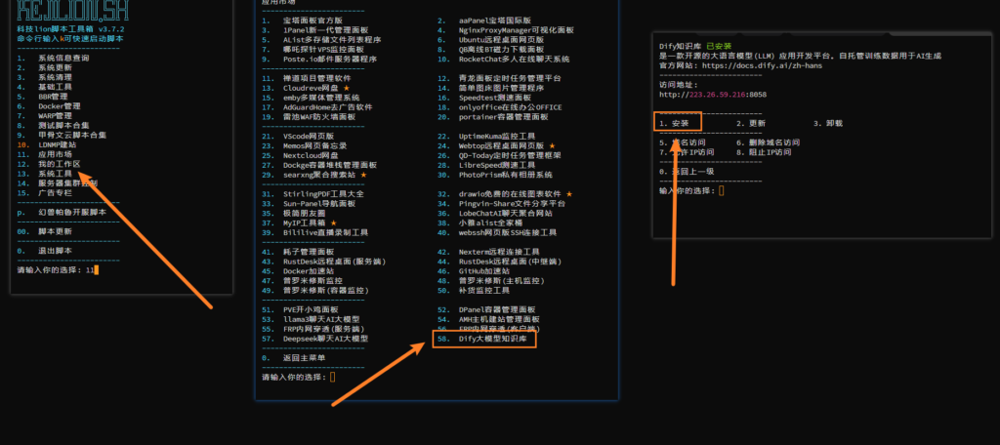
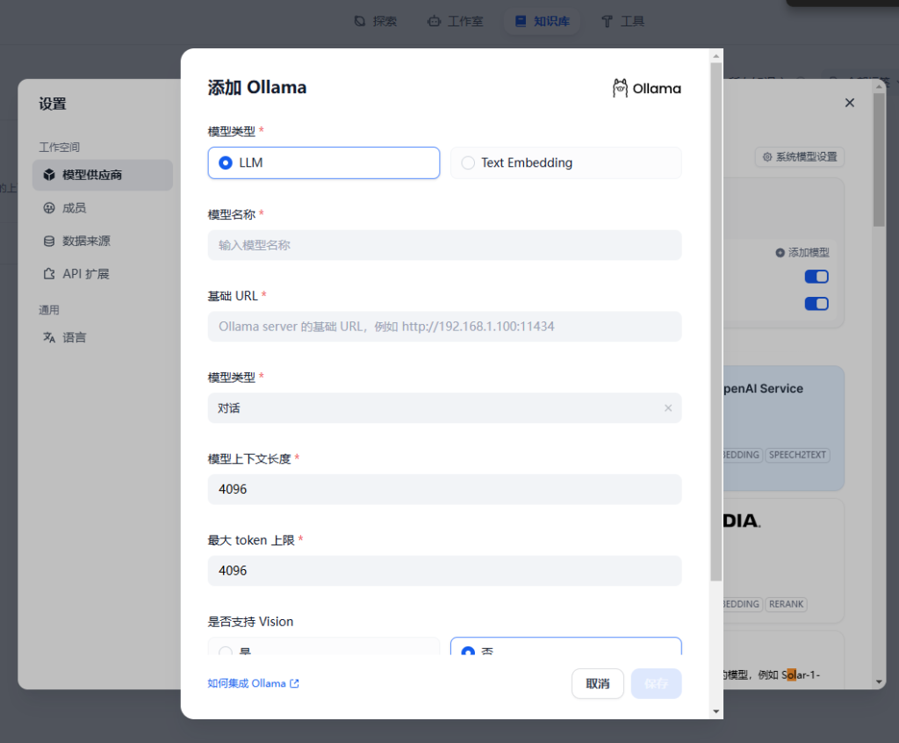
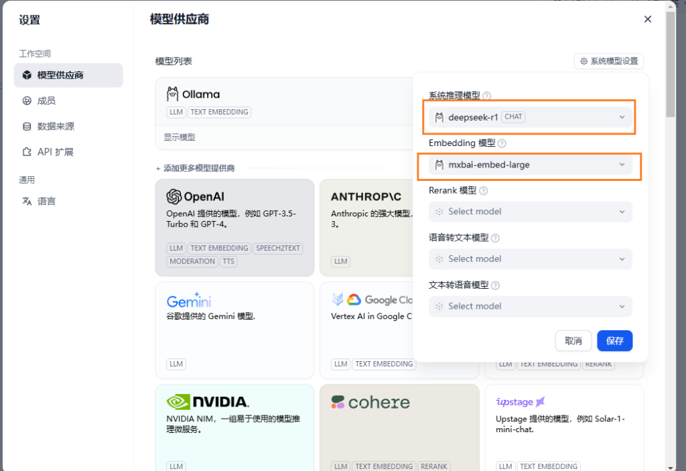

# 部署Dify知识库对接DeepSeek本地大模型

<font style="color:rgb(78, 83, 88);">Dify 是一个用于构建 AI 应用程序的开源平台。我们将后端即服务和 LLMOps 相结合，以简化生成式 AI 解决方案的开发，让开发人员和非技术创新者都可以使用它。</font>

<font style="color:rgb(78, 83, 88);">用自己的知识库训练数据结合AI大模型产出更为贴合业务的成果，\ </font>

### <font style="color:rgb(78, 83, 88);">在服务器上部署Dify知识库</font>

<font style="color:rgb(78, 83, 88);">docker网络架构问题，Dify建议服务器上搞方便。我用的</font>[莱卡云香港CN2GIA的云服务器](https://www.lcayun.com/aff/ZEXUQBIM)<font style="color:rgb(78, 83, 88);">搭建的，优惠地址如下：</font>

<https://www.lcayun.com/aff/ZEXUQBIM>

<font style="color:rgb(78, 83, 88);">  
</font>

<font style="color:rgb(78, 83, 88);">手动部署，部署后在80端口访问这是官方默认的，可以自己进入</font><code><font style="color:rgb(199, 37, 78);background-color:rgb(249, 242, 244);">.env</font></code><font style="color:rgb(78, 83, 88);">修改暴露端口。</font>

```python
mkdir -p /home/docker/
cd /home/docker/
git clone https://github.com/langgenius/dify.git
cd dify/docker
cp .env.example .env
docker compose up -d
```

<font style="color:rgb(78, 83, 88);">  
</font>

<font style="color:rgb(78, 83, 88);">自动部署，不喜欢手动部署可以用kejilion脚本进行自动化部署，我已经集成到脚本里面了。会暴露在8058端口上，适合后期反向代理成域名使用。</font>

<font style="color:rgb(78, 83, 88);">科技lion脚本获取地址：</font>[https://kejilion.sh](https://kejilion.sh/)



<font style="color:rgb(78, 83, 88);">  
</font><font style="color:rgb(78, 83, 88);">搭建好，进入网页设置初始管理员邮箱密码。先放着我们先装本地大模型。</font>

<font style="color:rgb(78, 83, 88);">  
</font>

### <font style="color:rgb(78, 83, 88);">在本地安装deepseek</font>

<font style="color:rgb(78, 83, 88);">先把deepseek装好看这篇文章，为啥deepseek在本地部署，因为本地算力比服务器强多了，有N卡更适合。</font>

<font style="color:rgb(78, 83, 88);">  
</font>

<font style="color:rgb(78, 83, 88);">Ollama本机跑默认只能本机访问，内网穿透直接403了。我找了很多资料最后发现要调整变量重启电脑，这样就可以内网被访问或者通过内网穿透暴露在外网，供dify使用。</font>

<font style="color:rgb(78, 83, 88);">在Windows中CMD终端输入如下命令重启电脑。</font>

```python
setx OLLAMA_HOST "0.0.0.0:11434"
```

<font style="color:rgb(78, 83, 88);">  
</font>

<font style="color:rgb(78, 83, 88);">除了安装deepseek-r1大模型还要嵌入式文本向量大模型，同样是通过Ollama进行安装。</font>

```python
ollama pull nomic-embed-text
```

<font style="color:rgb(78, 83, 88);">  
</font>

### <font style="color:rgb(78, 83, 88);">deepseek内网穿透到公网</font>

<font style="color:rgb(78, 83, 88);">将本地的11434暴露到公网的任意可用的端口，内网穿透方法，看视频。</font>

<font style="color:rgb(78, 83, 88);">b站视频</font>

<https://www.bilibili.com/video/BV1yMw6e2EwL?t=0.1>

<font style="color:rgb(78, 83, 88);">图文教学</font>

<font style="color:rgb(78, 83, 88);">之前分享的全部用上了，知识的完美整合。</font>

<font style="color:rgb(78, 83, 88);">  
</font>[https://blog.kejilion.pro/frp/](https://blog.kejilion.pro/frp/)

### <font style="color:rgb(78, 83, 88);">Dify对接deepseek</font>

<font style="color:rgb(78, 83, 88);">回到Dify网页到设置里添加模型，先对接deepseek-r1大模型再对接Embedding 模型。</font>






> 更新: 2025-02-27 11:51:33  
> 原文: <https://www.yuque.com/lixinsi/ynhoz5/duguhm8zwwktg28k>