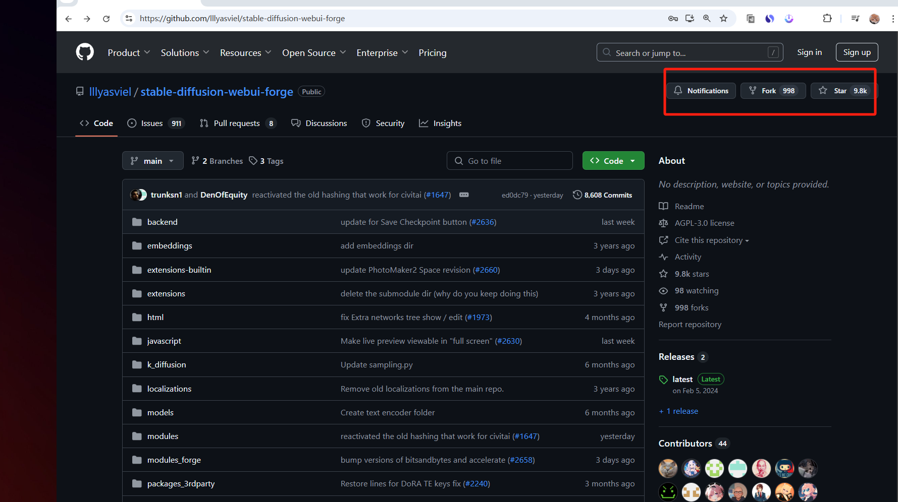
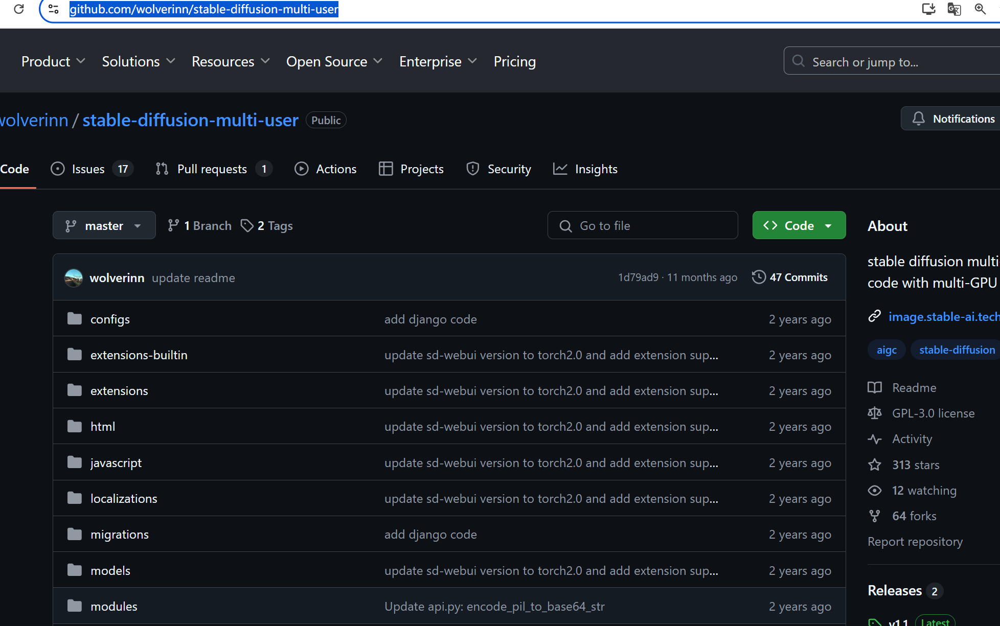

# 部署支持自动扩缩容的Stable Diffusion服务，提供出可以在线并发调用的API，根据请求人数自动扩缩容。使用高性能的sd-webui-forge项目；支持随时更换checkpoint、Lora等；支持多种插件如adetailer、roop等。

### 1.开源网址：[https://github.com/lllyasviel/stable-diffusion-webui-forge](https://github.com/lllyasviel/stable-diffusion-webui-forge)
### 2.开源网址：[https://github.com/wolverinn/stable-diffusion-multi-user](https://github.com/wolverinn/stable-diffusion-multi-user)
 部署

> 更新: 2025-02-18 13:56:08  
> 原文: <https://www.yuque.com/lixinsi/ynhoz5/swwcnazy8vgnalf0>