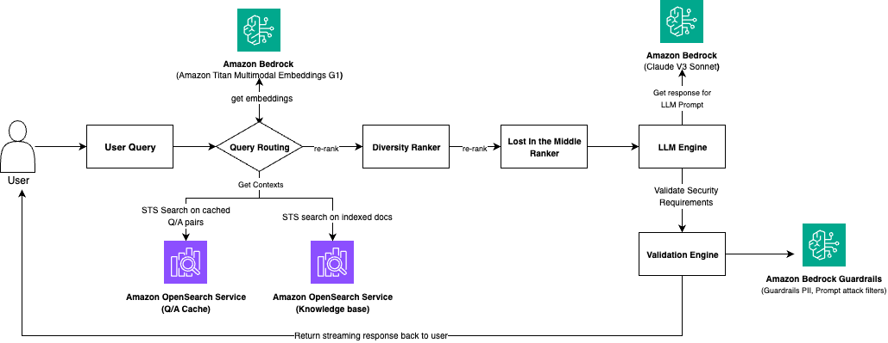
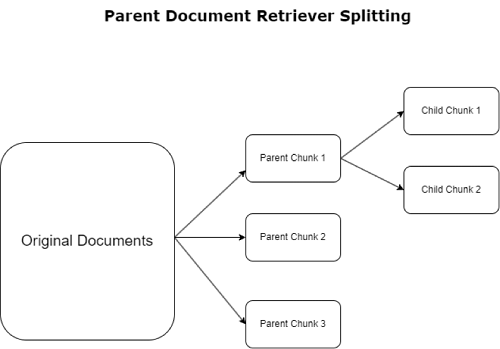

# 金融ai助手提示

# <font style="color:rgb(35, 47, 62);">Amazon Finance Automation 如何使用 Amazon Bedrock 构建生成式 AI 问答聊天助手</font>

<font style="color:rgb(51, 51, 51);">如今，亚马逊金融业务中的应付账款 (AP) 和应收账款 (AR) 分析师通过电子邮件、案例、内部工具或电话接收客户的查询。当出现查询时，分析师必须参与一个耗时的过程，联系主题专家 (SME)，并查看包含与查询相关的标准操作程序 (SOP) 的多个政策文件。这种来回沟通过程通常需要数小时到数天的时间，主要是因为分析师（尤其是新员工）无法立即获得必要的信息。他们花费数小时咨询 SME 并审查大量政策文件。</font>

<font style="color:rgb(51, 51, 51);">为了应对这一挑战，Amazon Finance Automation在</font>[<font style="color:rgb(9, 114, 211);">Amazon Bedrock上开发了一个基于</font>](https://aws.amazon.com/bedrock/)[<font style="color:rgb(9, 114, 211);">大型语言模型</font>](https://aws.amazon.com/what-is/large-language-model/)<font style="color:rgb(51, 51, 51);">(LLM) 的问答聊天助手</font><font style="color:rgb(51, 51, 51);">。该解决方案使分析师能够快速检索客户查询的答案，并在同一通信线程内生成快速响应。因此，它大大减少了解决客户查询所需的时间。</font>

<font style="color:rgb(51, 51, 51);">在这篇文章中，我们分享了 Amazon Finance Automation 如何使用 Amazon Bedrock 构建这个</font>[<font style="color:rgb(9, 114, 211);">生成式 AI</font>](https://aws.amazon.com/generative-ai/)<font style="color:rgb(51, 51, 51);">问答聊天助手。</font>

## <font style="color:rgb(51, 51, 51);">解决方案概述</font>

<font style="color:rgb(51, 51, 51);">该解决方案基于在 Amazon Bedrock 上运行的</font>[<font style="color:rgb(9, 114, 211);">检索增强生成</font>](https://aws.amazon.com/what-is/retrieval-augmented-generation/)<font style="color:rgb(51, 51, 51);">(RAG) 管道，如下图所示。当用户提交查询时，RAG 首先从知识库中检索相关文档，然后使用 LLM 从检索到的文档生成响应。</font>



<font style="color:rgb(51, 51, 51);">该解决方案由以下关键组件组成：</font>

1. **<font style="color:rgb(51, 51, 51);">知识库</font>**<font style="color:rgb(51, 51, 51);">– 我们使用</font>[<font style="color:rgb(9, 114, 211);">Amazon OpenSearch Service</font>](https://aws.amazon.com/opensearch-service/)<font style="color:rgb(51, 51, 51);">作为嵌入文档的向量存储。为了进行绩效评估，我们处理并将多个 Amazon 财务政策文档索引到知识库中。另外，</font>[<font style="color:rgb(9, 114, 211);">Amazon Bedrock Knowledge Bases</font>](https://aws.amazon.com/bedrock/knowledge-bases/)<font style="color:rgb(51, 51, 51);">为端到端 RAG 工作流提供完全托管的支持。我们计划迁移到 Amazon Bedrock Knowledge Bases，以消除集群管理并为我们的管道增加可扩展性。</font>
2. **<font style="color:rgb(51, 51, 51);">嵌入模型</font>**<font style="color:rgb(51, 51, 51);">– 在撰写本文时，我们在 Amazon Bedrock 上使用</font>[<font style="color:rgb(9, 114, 211);">Amazon Titan Multimodal Embeddings G1</font>](https://docs.aws.amazon.com/bedrock/latest/userguide/titan-multiemb-models.html)<font style="color:rgb(51, 51, 51);">模型。该模型在 Amazon 的大型独特数据集和语料库上进行了预训练，根据我们的比较分析，其准确度高于或可与市场上的其他嵌入模型相媲美。</font>
3. **<font style="color:rgb(51, 51, 51);">生成器模型</font>**<font style="color:rgb(51, 51, 51);">——我们使用了Amazon Bedrock 提供的</font>[<font style="color:rgb(9, 114, 211);">基础模型</font>](https://aws.amazon.com/what-is/foundation-models/)<font style="color:rgb(51, 51, 51);">(FM)，因为它具有快速提供高度准确答案的均衡能力。</font>
4. **<font style="color:rgb(51, 51, 51);">多样性排序器</font>**<font style="color:rgb(51, 51, 51);">——负责重新排列从向量索引获得的结果，以避免对任何特定文档或部分产生偏差或偏见。</font>
5. **<font style="color:rgb(51, 51, 51);">迷失在中间排名者</font>**<font style="color:rgb(51, 51, 51);">——它负责有效地将最相关的结果分配到提示的顶部和底部，从而最大限度地发挥提示内容的影响力。</font>
6. **<font style="color:rgb(51, 51, 51);">护栏</font>**<font style="color:rgb(51, 51, 51);">– 我们使用</font>[<font style="color:rgb(9, 114, 211);">Amazon Bedrock 护栏</font>](https://aws.amazon.com/bedrock/guardrails/)<font style="color:rgb(51, 51, 51);">来检测个人身份信息 (PII) 并防止提示注入攻击。</font>
7. **<font style="color:rgb(51, 51, 51);">验证引擎</font>**<font style="color:rgb(51, 51, 51);">– 从响应中删除 PII，并检查生成的答案是否与检索到的上下文相符。如果不一致，它会返回硬编码的“我不知道”响应，以防止产生幻觉。</font>
8. **<font style="color:rgb(51, 51, 51);">聊天助手 UI – 我们使用</font>**[<font style="color:rgb(9, 114, 211);">Streamlit</font>](https://streamlit.io/)<font style="color:rgb(51, 51, 51);">开发了 UI ，这是一个用于</font>[<font style="color:rgb(9, 114, 211);">机器学习</font>](https://aws.amazon.com/ai/machine-learning/)<font style="color:rgb(51, 51, 51);">(ML) 用例的</font><font style="color:rgb(51, 51, 51);">基于 Web 的应用程序开发的开源 Python 库。</font>

## <font style="color:rgb(51, 51, 51);">评估 RAG 性能</font>

<font style="color:rgb(51, 51, 51);">聊天助手的准确性是亚马逊金融运营最关键的性能指标。在构建聊天助手的第一个版本后，我们通过向聊天助手提交问题来测量机器人响应的准确性。SME 手动逐一评估 RAG 响应，发现只有 49% 的响应是正确的。这远远低于预期，解决方案需要改进。</font>

<font style="color:rgb(51, 51, 51);">然而，手动评估 RAG 并不可持续——它需要财务运营和工程团队花费数小时的努力。因此，我们采用了以下自动化绩效评估方法：</font>

* <font style="color:rgb(51, 51, 51);">准备测试数据——我们构建了一个包含三个数据字段的测试数据集：</font>
  * <code><font style="color:rgb(192, 57, 43);background-color:rgb(247, 247, 247);">question</font></code><font style="color:rgb(51, 51, 51);">– 这包括来自政策文件的 100 个问题，其答案来自各种来源，例如政策文件和工程 SOP，涵盖嵌入式表格和图像等复杂文本格式。</font>
  * <code><font style="color:rgb(192, 57, 43);background-color:rgb(247, 247, 247);">expected_answer</font></code><font style="color:rgb(51, 51, 51);">– 这些是由亚马逊财务运营中小企业手动标记的答案。</font>
  * <code><font style="color:rgb(192, 57, 43);background-color:rgb(247, 247, 247);">generated_answer</font></code><font style="color:rgb(51, 51, 51);">– 这是机器人生成的答案。</font>
* **<font style="color:rgb(51, 51, 51);">NLP 分数</font>**<font style="color:rgb(51, 51, 51);">– 我们使用测试数据集来计算</font>[<font style="color:rgb(9, 114, 211);">ROUGE</font>](https://en.wikipedia.org/wiki/ROUGE_\(metric\))<font style="color:rgb(51, 51, 51);">分数和</font>[<font style="color:rgb(9, 114, 211);">METEOR</font>](https://en.wikipedia.org/wiki/METEOR)<font style="color:rgb(51, 51, 51);">分数。由于这些分数仅使用单词匹配算法，而忽略了文本的语义，因此它们与 SME 分数不一致。根据我们的分析，与人工评估相比，差异约为 30%。</font>
* **<font style="color:rgb(51, 51, 51);">基于 LLM 的分数</font>**<font style="color:rgb(51, 51, 51);">– 我们使用 Amazon Bedrock 提供的 FM 对 RAG 性能进行评分。我们设计了专门的 LLM 提示，通过将生成的答案与预期答案进行比较来评估 RAG 性能。我们生成了一组基于 LLM 的指标，包括准确性、可接受性和事实性，以及代表评估推理的引用。与人工分析相比，这种方法的方差约为 5%，因此我们决定坚持这种评估方法。如果您的 RAG 系统建立在 Amazon Bedrock 知识库上，您可以使用新的</font>[<font style="color:rgb(9, 114, 211);">RAG 评估 Amazon Bedrock 知识库</font>](https://aws.amazon.com/bedrock/evaluations)<font style="color:rgb(51, 51, 51);">工具来评估检索或检索和生成功能，并以 LLM 作为评判者。它提供检索评估指标，例如上下文相关性和上下文覆盖率。它还提供检索和生成评估指标，例如正确性、完整性和有用性，以及负责任的 AI 指标，例如有害性和拒绝回答。</font>

## <font style="color:rgb(51, 51, 51);">提高RAG管道的准确性</font>

<font style="color:rgb(51, 51, 51);">基于上述评估技术，我们重点关注 RAG 流程中的以下领域，以提高整体准确性。</font>

### <font style="color:rgb(51, 51, 51);">添加文档语义分块，将准确率从 49% 提高到 64%</font>

<font style="color:rgb(51, 51, 51);">在诊断 RAG 管道中的错误响应后，我们发现 14% 的不准确性是由于发送到 LLM 的上下文不完整造成的。这些不完整的上下文最初是由基于固定块大小（例如 512 个标记或 384 个单词）的分割算法生成的，该算法不考虑章节和段落等文档边界。</font>

<font style="color:rgb(51, 51, 51);">为了解决这个问题，我们使用 QUILL 编辑器、Amazon Titan 文本嵌入和 OpenSearch 服务设计了一种新的文档分割方法，具体步骤如下：</font>

1. <font style="color:rgb(51, 51, 51);">使用 QUILL 编辑器将非结构化文本转换为结构化 HTML 文档。这样，HTML 文档保留了将内容划分为逻辑块的文档格式。</font>
2. <font style="color:rgb(51, 51, 51);">识别HTML文档的逻辑结构，并根据HTML标签插入分隔字符串，实现文档分割。</font>
3. <font style="color:rgb(51, 51, 51);">使用嵌入模型生成文档块的语义向量表示。</font>
4. <font style="color:rgb(51, 51, 51);">根据章节中的重要关键词分配标签，以识别章节之间的逻辑边界。</font>
5. <font style="color:rgb(51, 51, 51);">将分词文档的嵌入向量插入到开放搜索服务向量存储中。</font>

<font style="color:rgb(51, 51, 51);">下图说明了文档检索器拆分工作流程。</font>



<font style="color:rgb(51, 51, 51);">在处理文件时，我们遵循特定的规则：</font>

* <font style="color:rgb(51, 51, 51);">精确提取文档某一部分的开始和结束</font>
* <font style="color:rgb(51, 51, 51);">提取版块标题并将其与版块内容准确配对</font>
* <font style="color:rgb(51, 51, 51);">根据各部分的重要关键词分配标签</font>
* <font style="color:rgb(51, 51, 51);">在索引时保留策略中的 markdown 信息</font>
* <font style="color:rgb(51, 51, 51);">在初始版本中从处理中排除图像和表格</font>

<font style="color:rgb(51, 51, 51);">通过这种方法，我们可以将 RAG 准确率从 49% 提高到 64%。</font>

### <font style="color:rgb(51, 51, 51);">使用快速工程将准确率从 64% 提高到 76%</font>

<font style="color:rgb(51, 51, 51);">提示工程是提高 LLM 性能的关键技术。我们从我们的项目中了解到，没有一种万能的提示工程方法；设计特定于任务的提示是一种最佳实践。我们采用了以下方法来提高提示到 RAG 生成器的有效性：</font>

* <font style="color:rgb(51, 51, 51);">在约 14% 的案例中，我们发现 LLM 即使在未从 RAG 中检索到相关背景的情况下也会产生反应，从而导致幻觉。在这种情况下，我们设计了提示，并要求 LLM 在未提供相关背景的情况下不要产生任何反应。</font>
* <font style="color:rgb(51, 51, 51);">在约 13% 的案例中，我们收到用户反馈，称 LLM 的回复太简短，缺乏完整的背景信息。我们设计了提示，鼓励 LLM 提供更全面的信息。</font>
* <font style="color:rgb(51, 51, 51);">我们设计了提示，以便能够为用户生成简洁而详细的答案。</font>
* <font style="color:rgb(51, 51, 51);">我们使用 LLM 提示来生成引文，以正确引用我们用于生成答案的来源。在 UI 中，引文以超链接的形式列在 LLM 响应后面，用户可以使用这些引文来验证 LLM 的表现。</font>
* <font style="color:rgb(51, 51, 51);">我们改进了提示，以引入更好的思路链（CoT）推理：</font>
  * <font style="color:rgb(51, 51, 51);">LLM 的独特之处在于使用内部生成的推理，这有助于提高性能并使响应与人类的连贯性保持一致。由于提示质量、推理请求和模型固有功能之间的这种相互作用，我们可以优化性能。</font>
  * <font style="color:rgb(51, 51, 51);">鼓励 CoT 推理促使 LLM 考虑谈话的背景，从而不太容易产生幻觉。</font>
  * <font style="color:rgb(51, 51, 51);">通过在既定背景的基础上，模型更有可能生成符合对话叙述逻辑的回应，从而减少提供不准确或幻觉答案的机会。</font>
  * <font style="color:rgb(51, 51, 51);">我们添加了以前回答过的问题的例子，为 LLM 建立了模式，鼓励 CoT。</font>

<font style="color:rgb(51, 51, 51);">然后，我们使用 Amazon Bedrock 提供的 FM 的元提示来制作满足上述要求的提示。</font>

<font style="color:rgb(51, 51, 51);">以下示例是生成快速摘要和详细答案的提示：</font>

```plain
你是一个人工智能助手，根据提供的文本上下文帮助回答问题。我将给你一些文件中的段落，然后是一个问题。你的任务是仅使用给定上下文中的信息为问题提供最佳答案。这里是上下文：{}这里是问题：{}仔细考虑如何使用上下文来回答问题。< thinkingprocess >仔细阅读所提供的上下文和分析哪些信息containsIdentify关键信息的上下文相关的回答questionDetermine如果上下文提供了足够的信息来回答这个问题satisfactorilyIf不是,只是状态”我不知道,我没有完整的上下文需要回答这个问题“如果是这样,answerExpand合成相关的信息到一个简明的总结成一个更详细的回答,如果你没有足够的上下文来回答这个问题，你可以用下面的格式来回答：我不知道，我没有完整的上下文来回答这个问题。如果你确实有足够的背景来回答这个问题，你可以用以下格式提供你的回答：####快速总结：你的简洁的1-2句话总结在这里。####详细答案：您的扩展答案在这里，使用Markdown格式，如**粗体**，*斜体*和项目符号，以提高可读性。请记住，最终目标是仅使用所提供的上下文为问题提供信息丰富，清晰且可读的答案。让我们开始吧!
```

<font style="color:rgb(51, 51, 51);">以下示例是根据生成的答案和检索到的上下文生成引文的提示：</font>

```xml
你是一个人工智能助手，专门将生成的答案归因于所提供文档中的特定部分。您的任务是确定给定文档中的哪些部分最有可能用于生成所提供的答案。如果你找不到精确的匹配，建议与答案内容密切相关的部分。下面是要分析的生成的答案：<generated_回答> < /{}生成_下面是各种文档中需要考虑的部分：<sections>{}</sections>请仔细阅读生成的答案和提供的部分。在下面的scratchpad空间中，头脑风暴和推理哪些部分与答案最相关：<scratchpad></scratchpad>在确定相关部分后，以以下格式提供您的输出：**文档名称：** <文档名称> \n**文档链接：** <文档链接> \n**相关部分：** \n<部分名称1><部分名称2><部分名称3>不要在您的最终输出中包含任何额外的解释或推理。只需以上述指定的格式列出文档名称、链接和相关章节名称。助理:
```

<font style="color:rgb(51, 51, 51);">通过实施及时的工程方法，我们将 RAG 准确率从 64% 提高到了 76%。</font>

### <font style="color:rgb(51, 51, 51);">使用 Amazon Titan 文本嵌入模型将准确率从 76% 提高到 86%</font>

<font style="color:rgb(51, 51, 51);">实施文档分割方法后，我们仍然看到检索到的上下文的相关性得分较低（55-65%），并且超过 50% 的情况不正确的上下文位于前列。这表明仍有改进空间。</font>

<font style="color:rgb(51, 51, 51);">我们尝试了多种嵌入模型，包括第一方和第三方模型。例如，与其他顶级嵌入模型（如 all-mpnet-base-v2）相比，上下文嵌入模型（如 bge-base-en-v1.5）在上下文检索方面表现更好。我们发现，使用 Amazon Titan Embeddings G1 模型可将检索到的上下文的可能性从大约 55–65% 提高到 75–80%，并且 80% 的检索到的上下文的排名比以前更高。</font>

<font style="color:rgb(51, 51, 51);">最后，通过采用</font>[<font style="color:rgb(9, 114, 211);">Amazon Titan Text Embeddings G1</font>](https://docs.aws.amazon.com/bedrock/latest/userguide/titan-embedding-models.html)<font style="color:rgb(51, 51, 51);">模型，我们将整体准确率从 76% 提高到了 86%。</font>

## <font style="color:rgb(51, 51, 51);">结论</font>

<font style="color:rgb(51, 51, 51);">我们在为 Amazon Finance Automation 开发生成式 AI 问答聊天助手方面取得了显著进展，方法是使用 Amazon Bedrock 上的 RAG 管道和 LLM。通过持续评估和迭代改进，我们解决了幻觉、文档提取问题和上下文检索不准确的挑战。我们的结果表明，RAG 准确率从 49% 显著提高到 86%。</font>

<font style="color:rgb(51, 51, 51);">您可以跟随我们的历程并采用类似的解决方案来解决 RAG 应用程序中的挑战并提高整体性能。</font>


> 更新: 2025-03-01 18:19:11  
> 原文: <https://www.yuque.com/lixinsi/ynhoz5/zunih1rcggziineh>