# 非常全面的数字人解决方案(含源码)

### unity3D 开源项目数字人
开源地址:[https://github.com/LKZMuZiLi/human](https://github.com/LKZMuZiLi/human)

## github
[TheRamU/Fay: 语音互动，直播自动带货 虚拟数字人 (github.com)](https://github.com/TheRamU/Fay)

## gitee
[fay: 这是一个数字人项目，包含python内核及ue数字人模型，可以用于做数字助理及自动直播，又或者作为你的应用入口也很帅 (gitee.com)](https://gitee.com/xszyou/fay)

## 2022.10.27
补充mac上的安装办法：[(34条消息) Fay数字人开源项目在mac 上的安装办法_郭泽斌之心的博客-CSDN博客](https://blog.csdn.net/aa84758481/article/details/127551258)

## **一、实际****应用案例**
**抖音虚拟主播**

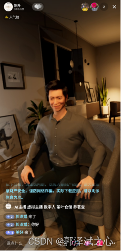

**人机****交****互**

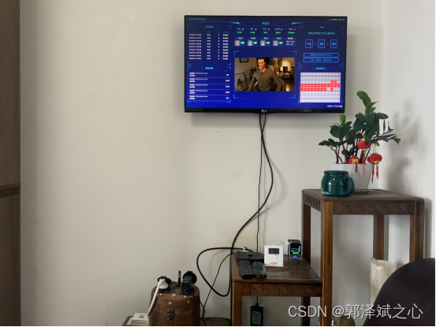

**数字站桶人**

## **二、数字人是什么**
首先我先给数字人重新做一个定义：“把人数字化，以行人的职责”。怎么理解呢？我举两个例子就清楚了。第一个是现在直播带货，主播成本越来越高，我们的数字人能否代替主播24小时自动带货呢？这里数字化的是主播的形象、声音、性格特质，以及商品的知识。另一个是，一些客服或者售前情景，所做的工作也是重复度非常高，我们能否交给数字人去完成呢？这里就简单多了，只需要把知识库给数字化，就是我们常说的Q&A。

“把人数字化”这个说得有些笼统，具体来说是把人的那些方面可以数字化呢？

1. 三维人物：信息的传输需要载体，把三维人物形象作为载体可以融入语音、文字、动作、情绪等信息传输通道，远比单纯的语音或文字的承载量大得多。
2. 语言：你的数字人会说什么内容，以怎么样的声音说话，用的是粤语还是国语。
3. 形象表情动作：一个数字人单纯的只会与人沟通还不够，还需要能够做出不同的表情动作。不竟，人类沟通70%的内容是通过非语言传达的，数字化的过程中我们又怎会错过条重要的信息通道呢。
4. 情绪：情绪可以附加在语言和表情动作里，让信息传输的带宽更大。
5. 环境模型：数字人向你展示的时候是在大厅，还是在房间，在户外。然后数字人的周围有些什么，这都可以衬托出不同的氛围。

我们再来说说，一个数字人如何行人的职责。比如，在展厅里，不能让解说员24小时站在展品前面等着游客来询问，更不能循环播放着一个段音视频。但数字人可以，只需要一个显示屏即可。若你办的是一个云展厅、元宇宙，就更是如此了。

## 三、数字人可以解决什么问题
数字时代，数字产品泛滥，[互联网](https://edu.csdn.net/cloud/pm_summit?utm_source=blogglc&spm=1001.2101.3001.7020)平台多不胜数。那个这个数字人就是你在不同的电子产品、不同平台上的分身，代替你行人的职责。除了文章开头说的三个案例外，至少还可以用于：

1. 电子导游；
2. 电子解说员；
3. 虚拟老师；
4. 售前、售后客服；
5. 前台指引。

## 四、这个数字人怎么实现
我们以直播带货为例，为了方便理解，首先说明的是我们对直播场景做过分析，发现了如下逻辑：

接下来我来就可以来具体操作了：

### 1、建立行为模型
这会直接影响到数字人接受外部刺激（大数多情况下是，用户说的话，在直播场景下也有粉丝关注送爱心等情况）之后的情绪变化，以及响应的方式和程度。你可能会想，为什么需要建行为模型呢？举个例子你就明白了。你可以设计了一个逻辑，粉丝点赞时，主播非常开心地感谢粉丝，粉丝骂主播时，主播表现出愤怒。你在直播时，有一个粉丝点赞了，另一个粉丝同时在骂主播，你的数字人该作出怎么样的反应呢？这个只是简单的例子，实际情况复杂得多。也有人，说这是算法和AI的区别。这有一定的道理，但说法不严紧,这个话题就不在此展开了。我们在直播场景下，试过以下这两种方式建立性格模型：

+ 学习真实主播的性格

我们只需要把目标主播的直播给录制下来，提取样本数据，然后训练一个从粉丝的不同刺激的组合，到主播的不同响应方式的多元逻辑回归的数学模型参数即可。

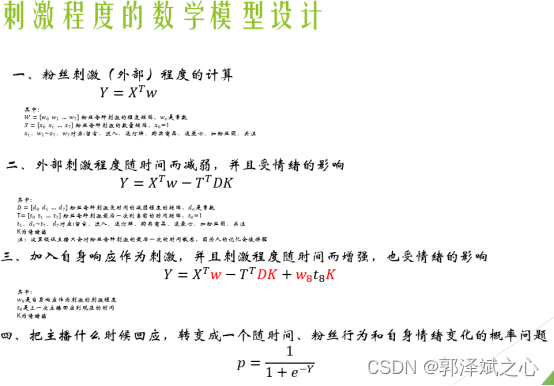

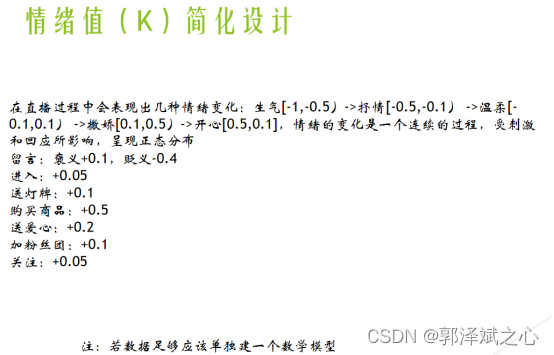

+ 人为调节各刺激的影响程度

把现有主播的性格模型数字化，这种方式缺憾也十分明显，就是你无法快速调节其性格特质。想要人为调节，你也可以参考以下方试：

我们做了一个“数字人控制器”的客户端，可以手动调节行为模型的参数。想体验参考的话，也可以私下跟我联系（qq467665317），我把代码发你。

### 2、人物模型、场景载入引擎
人物模型的选择大体上可以是二次元和超写实。场景的选择就很多，可以是户内户外，坐着站着。再配合其它物体就可以把整个氛围衬托出来，比如：沙发可以表现出舒适放松；显示屏可以不违和的插入[广告](https://edu.csdn.net/cloud/pm_summit?utm_source=blogglc&spm=1001.2101.3001.7020)信息。

我们对比了多个引擎技术之后，最终选择UE4作为模型的驱动引擎。主要有以下几点原因：首先UE4不像live2d那样，出来的是假三维的纸片人；其次，UE4里对现实世界的光照、材质、重量等物理属性都存在一一映射，可以非常全面地还原一个真实场景。这里提醒一下，在三维的世界里，有两条工具线：一个是引擎，用于驱动三维模型按照你的逻辑运作；一个是建模工具，比如maya。但通常这两类工具都会互相融合、相互交叉。

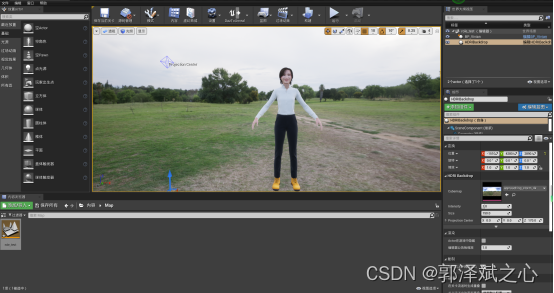

二次元的模型建立可以使用daz studio(偶然机会获得了120G资源，有需要加我qq467665317),非常简单。可以非常方便选选择人的各个组成部分，比如：身驱、头发、脸型、眼睛等，然后组合成一个你想要的形象。

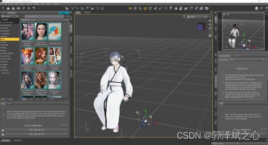

至于超写实的模型就可以使用metahuman了。metahuman说白了其实就是一个云端版本的ue,优点是集成了大量真人扫描的高精度组件，可以非常方便地调节出一个欧美真人。对，你无看错，是欧美的。官方的解释是，由于疫情原因，还未对亚洲人进行扫描。在虚拟主播这个案例上实际我们就是用metahuman的。

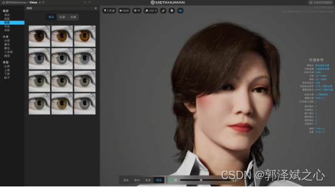

在直播带货案例里，我们把模型导入到ue4，我们给模型在ue4里预设了四个动作（站着、站着说话、坐着、坐着说话），三个表情（平静、开发、愤怒），三个镜头（全局、近矩说话、看显示器播放商品展示）。

当数字人的心情激动（开心和愤怒）是站着的，其余时候是坐着的，表情也做对应的变化。说话的时候就会做更多的肢体动作了，唇是根据说话的发音驱动同步化的。当主播在介绍商品时切换到显示器镜头，可以形象的看到商品效果（针对每个商品建模的成本太高）。当主播在与粉丝互动时切换到近矩镜头，方便观看主播的表情动作。其实这两个镜头主播都在说话，当主播说话结束后就切换回全局镜头，让观众感受整个环境。

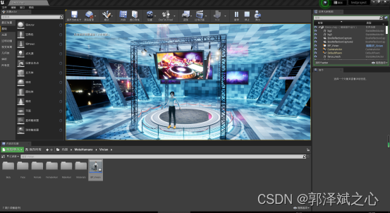

### 3、行为模型驱动UE引擎里的三维模型
UE4大多情况下应该是用于游戏开发和影视制作的，要想使用上文第1点说的行为模型逻辑去控制UE里的三维模型，网上可以参考的资源非常少。咨询过常年从事三维模型制作的专家，给出可以参考的答案是把逻辑输出模拟成键盘操作，UE再依据键盘输入来驱动三维模型作出变化。（键盘操作？这是把数字人做成游戏吧？）当然，这种方式我们肯定接受不了，因为这样无办法做复杂的数据传输。几经折腾之后，我们在UE商城里找到一个websocket蓝图插件，与行为模型实现websocket通讯。

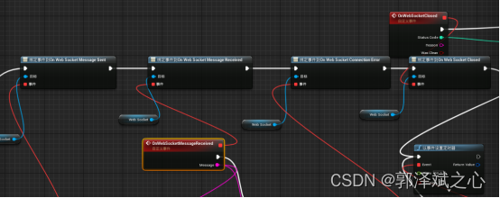

### 4、接通刺激输入
其实在直播带货这个案例里，我们使用的是抖音，刺激是非常有限的，粉丝在你的直播间里能做的事情就是这么点，进来、关注、点赞、刷礼物、购买商品，或者打段文字。在这里，我们需要获取直播间上的这些信息。我们测试过网络上主流的方法“抓包然后解码”，这种方法太麻烦，而且离开抖音这个平台之后，就很难再使用这个办法。所以我们最后使用的方案是，用selenium驱动chrome浏览器内核加载直播间https链接，获取浏览器上的内容。我们再把这个内容推送给上面所说的“行为模型”。这样方法将会极大地方便以后做平台的迁移。

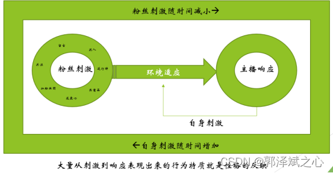

### 5、接入输出通道
在这个案例里，我们是要把行为模型驱动UE里三维模型的变化和数字人主播说的音频，通过视频流的形式输出到抖音直播平台。这个我们使用抖音直播伴侣，可以直接上线直播，同时又可以使用抖音上很多玩法。这里特别强调一下，我们测试过讯飞、阿里云、百度、亚马讯和微软的语音合成，只有微软是直接提供带情绪的合成。

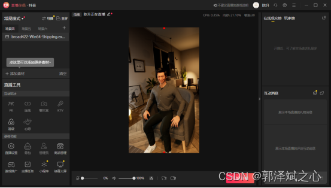

## 五、挑战
1、怎么样把人行为、认知、情绪数字化？

如果你要设计一个模型，把人的东西都数字化下来，以目前的水平还没有人能够做到。但你锁定在某一特定的情景，只要稍加分析，你就会发现，这其实并不难。

2、UE4的功能非常强大、非常多，你遇到的任何一个问题都不少于三个解决办法，如果你没有这块的工作经验，你就得一个个去试。其间我就翻阅了7本书，无数B站上的视频教程。其间解决了诸如：websocket通讯、表情动作、唇形同步、光线控制、头身分离、蓝图通讯等问题。

3、Metahuman的模型导入本地ue后要做很多适应性的调节。若要使用ue商城里的动作，还需要做骨络重定向等操作。由于metahuman自带蓝图，咱们还需要调整原蓝图的逻辑，以兼容我们的行为模型的要求。那怕是怎么控制表情，对于我们来说还是有挑战的。

4、抖音本身不提供直播的数据接口，故要获取直播间的互动数据，就得花些工夫了。

5、语音合成没有你想像中的成熟。若要做情绪语音集的训练，成本会很高。还好，有微软的云端服务。（经验总结：别太相信国内企业广告上说的）

> 更新: 2025-02-20 12:27:11  
> 原文: <https://www.yuque.com/lixinsi/ynhoz5/runulyeik9hy5bgt>