# Lumion 仿真软件

| Lumion 是一款3D渲染三维场景设计软件，可以以闪电般的速度创建令人惊叹的图像、视频和360全景图。主要用于建筑、景观、规划的效果图、动画的设计制作，以视频或图像形式可视化具有逼真背景和惊人艺术感的CAD模型，并支持从sketchup以及autodesk等产品中导入模型。  | | | |
| --- | --- | --- | --- |
| 软件：Lumion | | 版本：10.0 |
| 语言：简体中文    | | 大小：17.2G |
| 安装环境：Windows7及以上，32/64位操作系统 | | | |
| 硬件要求：CPU@2.5+GHz，内存@16G(或更高) | | | |
| 迅雷云盘下载链接（复制到浏览器打开）： https://pan.xunlei.com/s/VNtWB1KnKjmT0Lgxvnsj49XjA1?pwd=yndn# | | | |
| [[下载方法]：点击查看如何「下载软件」？](https://mp.weixin.qq.com/mp/appmsgalbum?__biz=MzkzMTA5NjM4NA==&action=getalbum&album_id=3408458246812647428#wechat_redirect) [[常见问题]：点击查看管家「帮助中心」！](https://mp.weixin.qq.com/mp/appmsgalbum?__biz=MzkzMTA5NjM4NA==&action=getalbum&album_id=3408456133957173251#wechat_redirect) [[更多软件]：点击查看最新「软件目录」！](https://mp.weixin.qq.com/mp/appmsgalbum?__biz=MzkzMTA5NjM4NA==&action=getalbum&album_id=3408453120416858121#wechat_redirect) | | | |

  

  

  

  

1.鼠标右键【Lumion Pro v10.0.0】压缩包（win11及以上系统需先点击“显示更多选项”）选择【解压到Lumion Pro v10.0.0】。

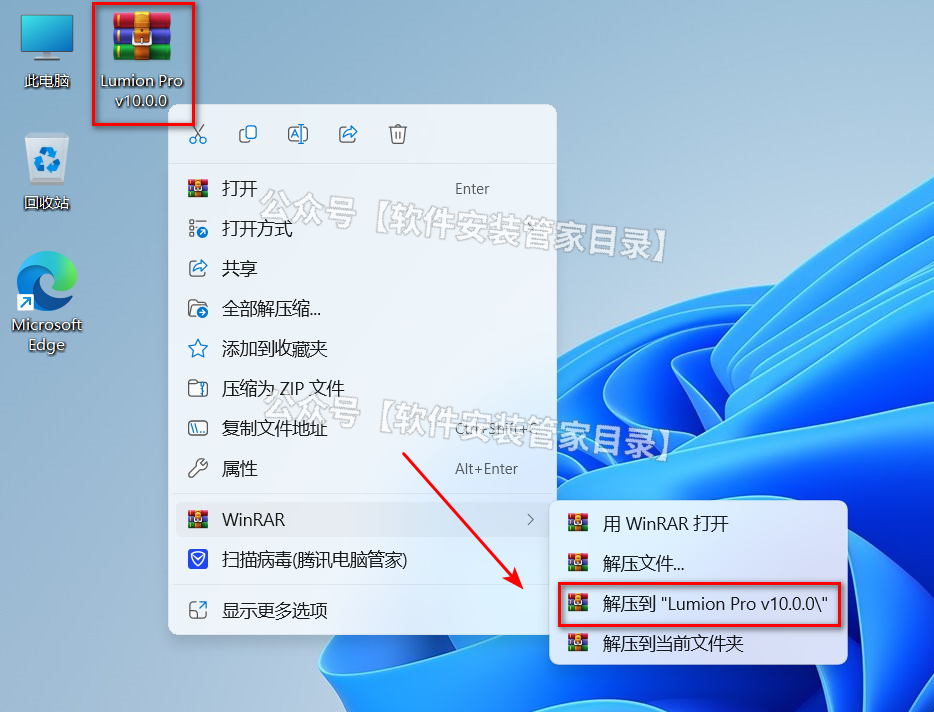

2.打开解压后的【Lumion Pro v10.0.0】文件夹，双击打开【Lumion Pro v10.0.0】文件夹。

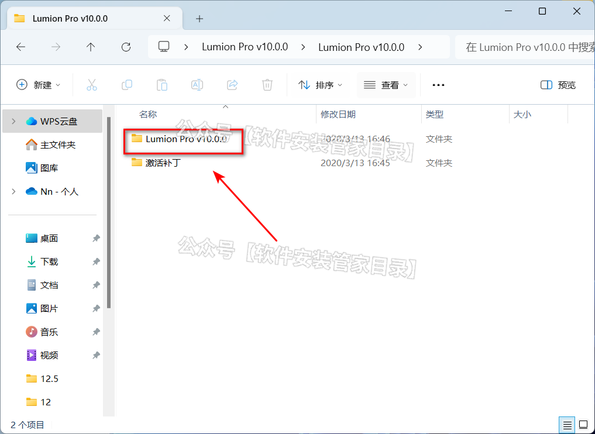

3.鼠标右键【Lumion_10_0_LUM10PRO.exe】，选择【以管理员身份运行】。

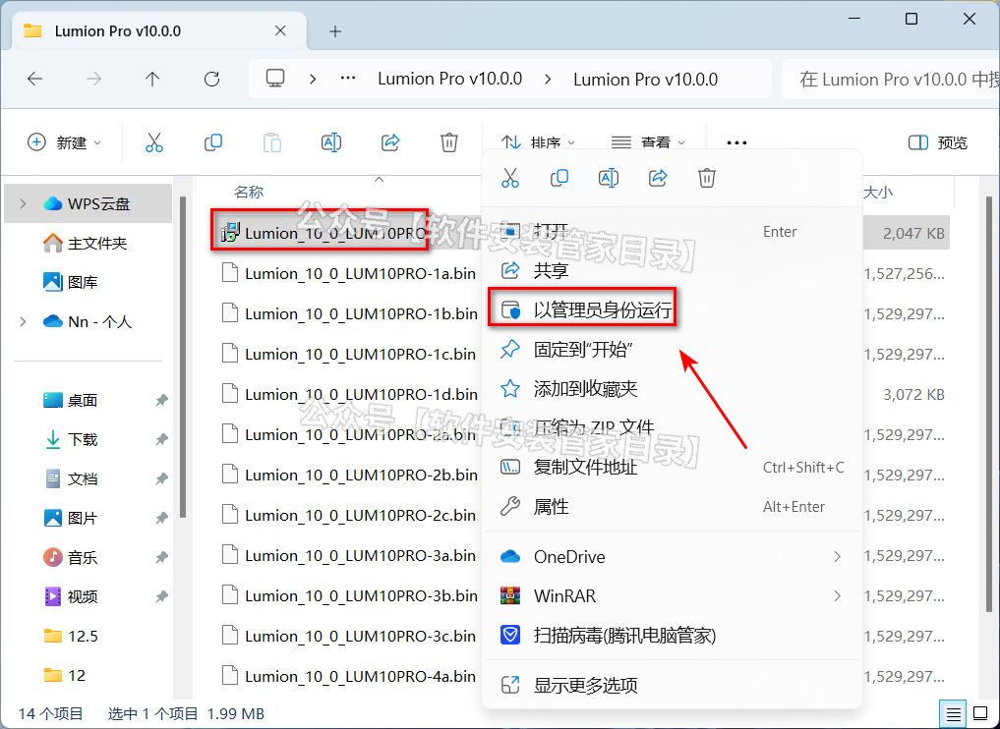

4.点击【Browse】选择软件安装位置，例如在D盘新建一个“Lumion10.0”文件夹（注意：软件安装路径中，文件夹名称不能带有中文），点击【Next】。

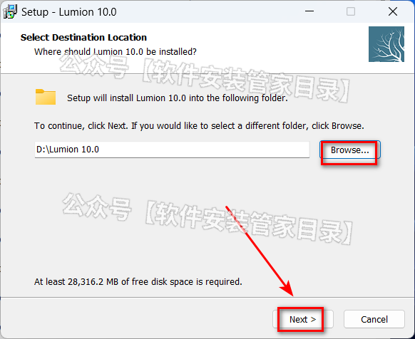

5.点击【Next】。

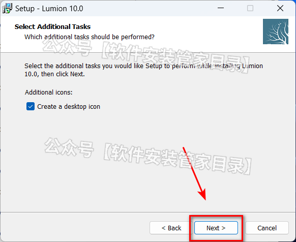

6.点击【Install】 。

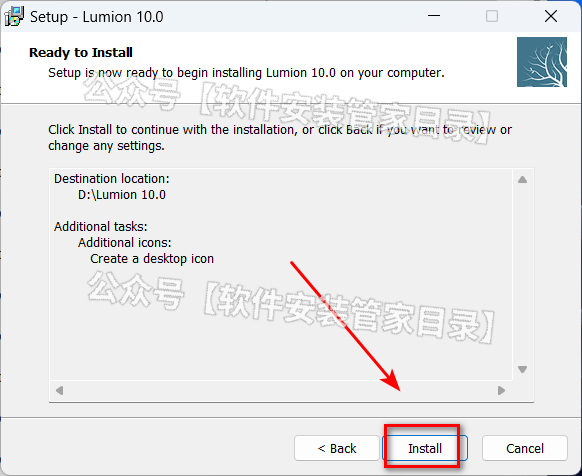

7.软件安装中......

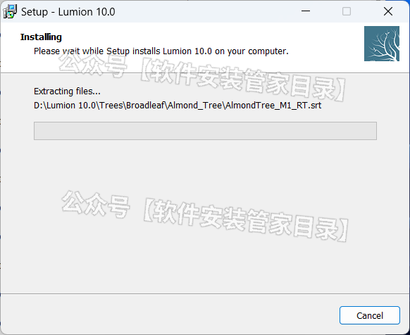

8.安装完成，点击【Finish】。

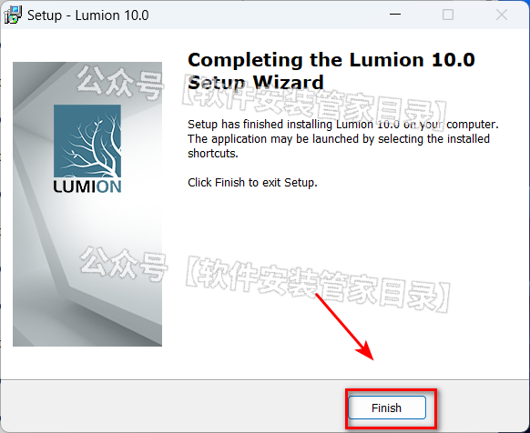

9.打开此文件夹路径：【C:\Windows\System32\drivers\etc】。

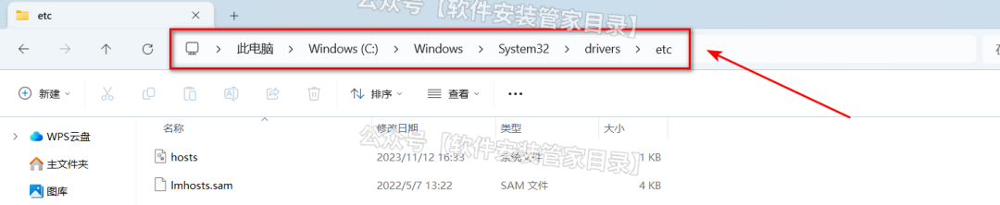

10.①鼠标右键【hosts】；②选择【打开方式】；③选择【记事本】；④点击【确定】。

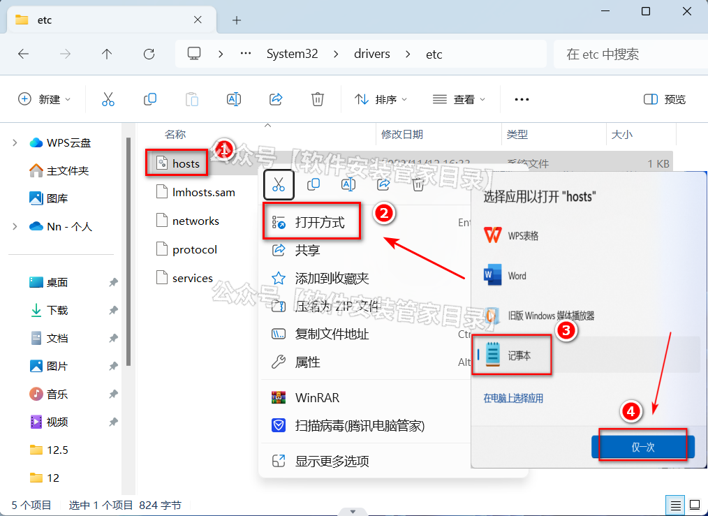

11.将

127.0.0.1 backup.lumion3d.net

127.0.0.1 license.lumion3d.net

127.0.0.1 license.lumiontech.net

复制到【hosts】记事本末，点击【文件】选择【保存】。

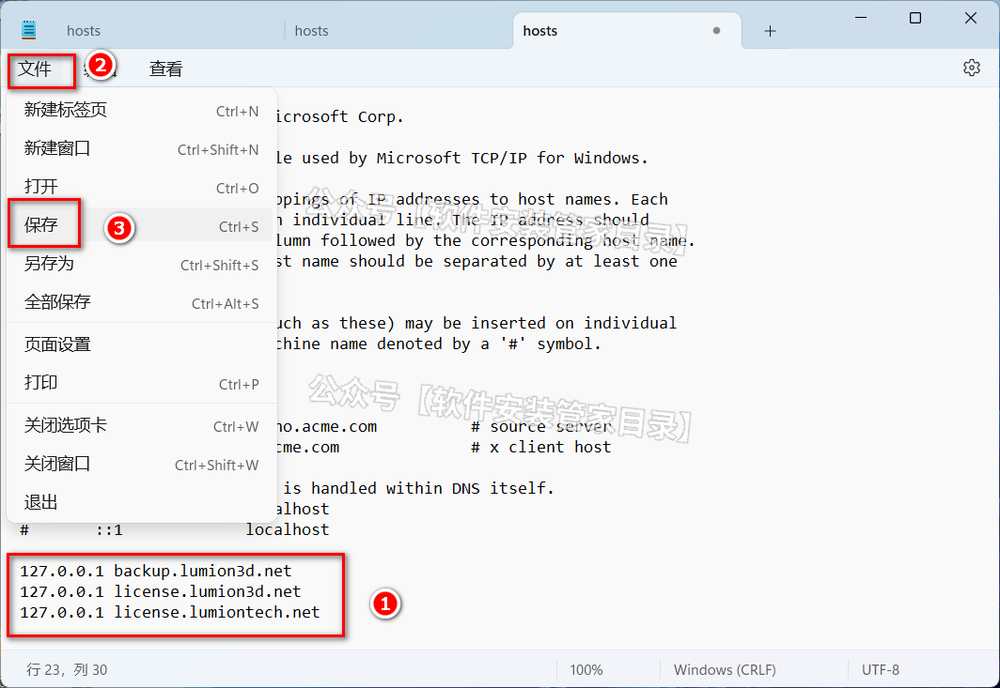

12.打开【步骤1】中，安装包解压后的【Lumion Pro v10.0.0】文件夹，双击打开【激活补丁】文件夹。

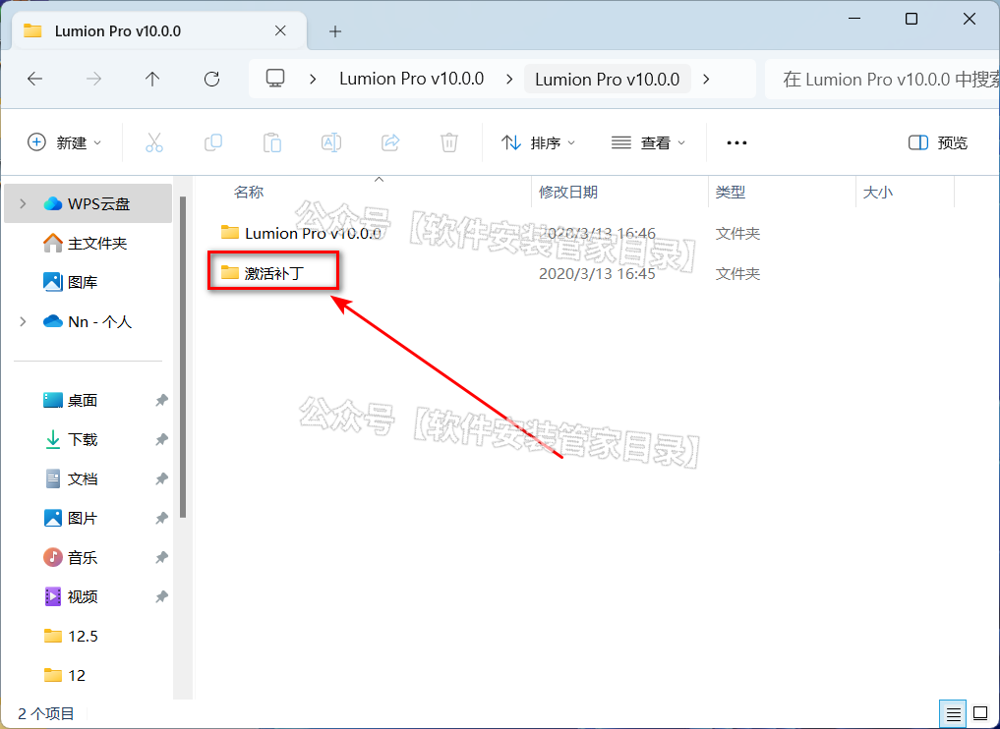

13.全选文件夹中的2个文件，鼠标右键选择【复制】。

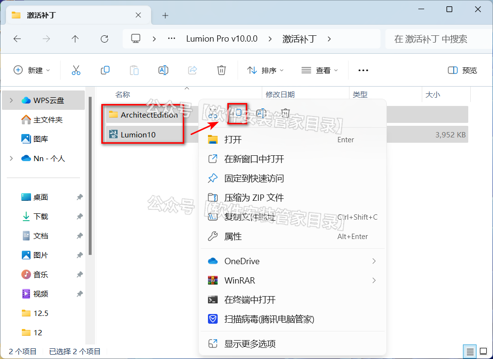

14.鼠标右键桌面【Lumion10.0.0】图标，选择【打开文件所在位置】。

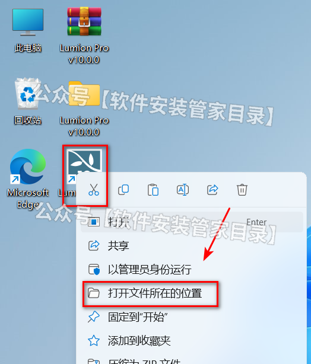

15.在文件夹空白处，鼠标右键选择【粘贴】。

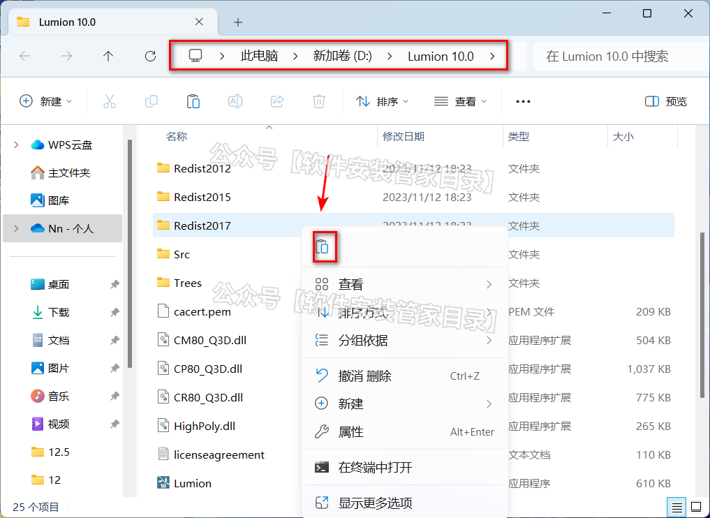

16.点击【替换目标中的文件】。

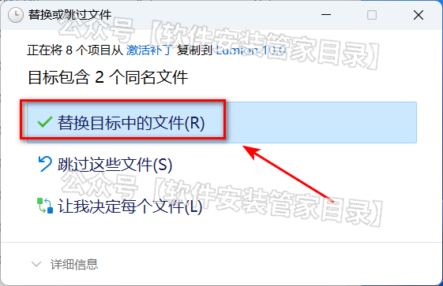

17.鼠标右键【Lumion10】，选择【以管理员身份运行】。

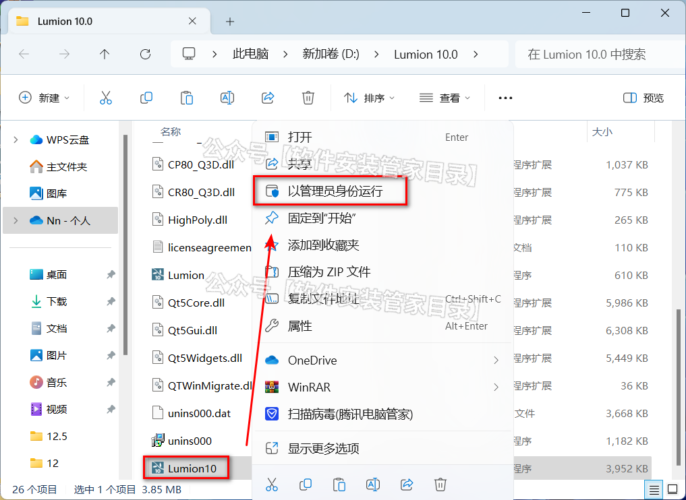

18.点击【启动】。

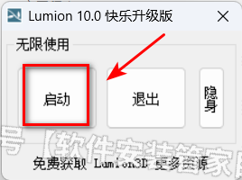

19.点击【Agree】。

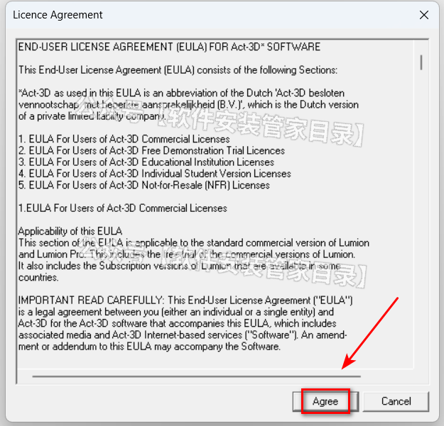

20.点击【无】。

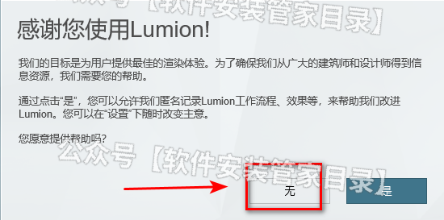

21.点击【进入系统】。

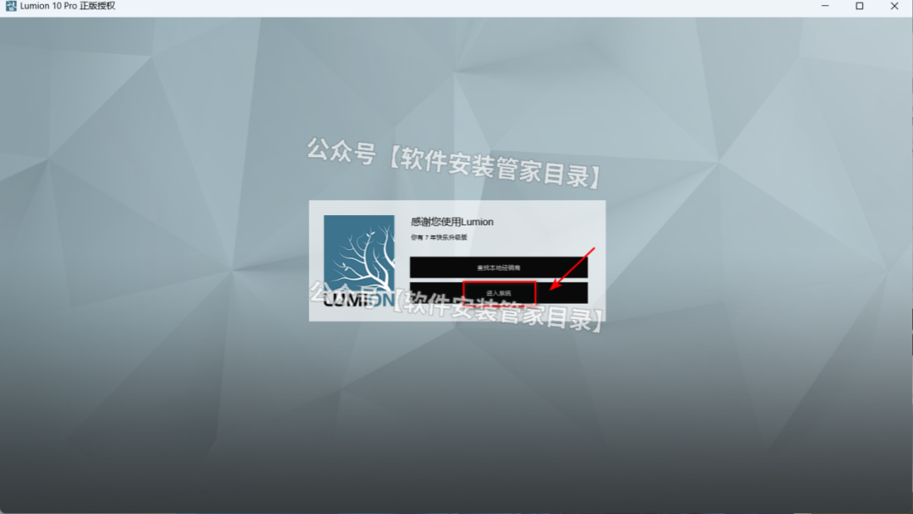

22.软件安装成功。

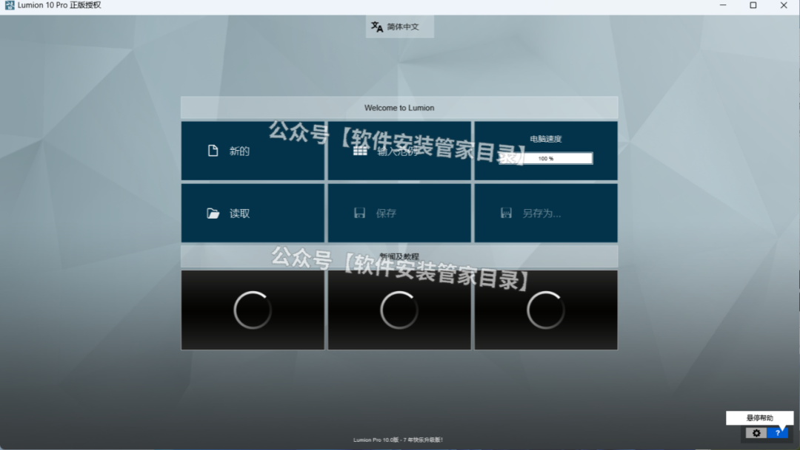

> 更新: 2025-05-07 08:14:59  
> 原文: <https://www.yuque.com/lixinsi/oyzgnh/zhsoxr4nwbkpz6fk>