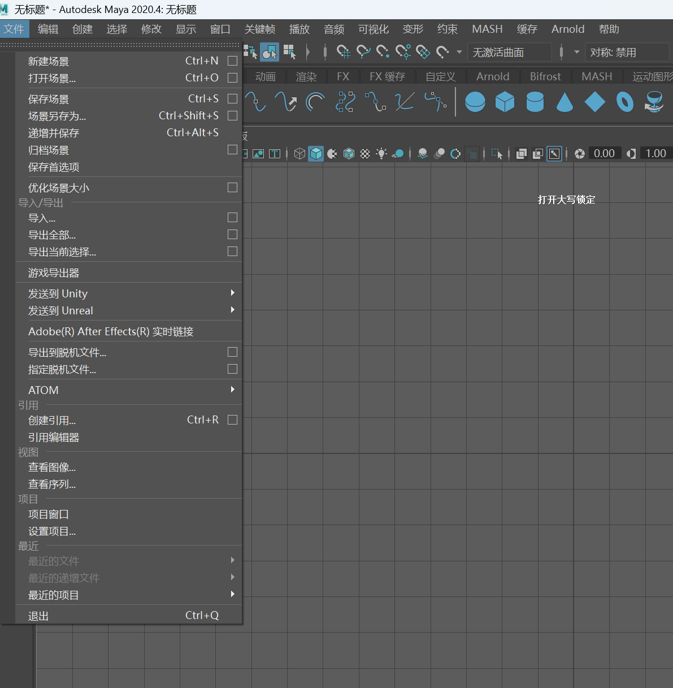
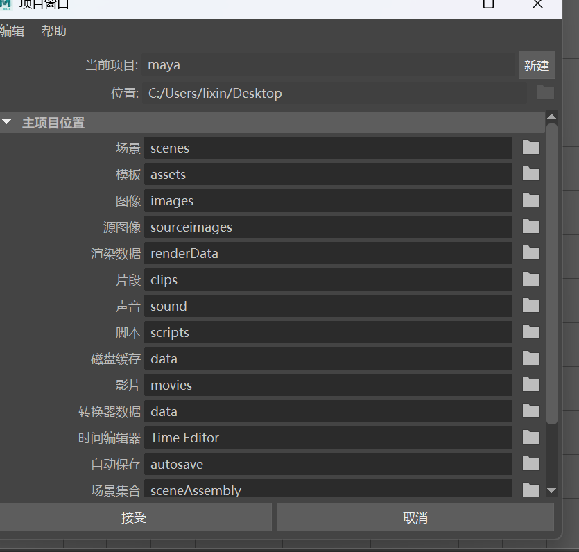
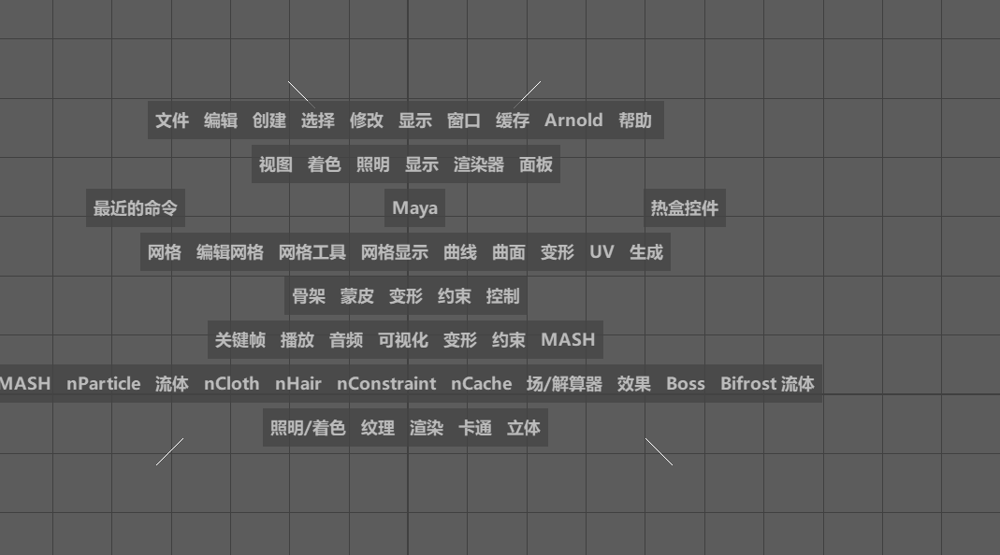

# MAYA自学

### 1.必学技巧 maya 制作动画分类创建项目需要良好的分类习惯，文件一般保存在 sencens 场景文件

### 2.创建引用压缩文件，模型必须没有动画没有设置帧，可以减少文件大校
### 3.必须记住的快捷键
#### W:移动坐标
#### E:旋转坐标
#### R:挤压，拉升坐标
#### 
#### S：选定设置帧数
#### 第一帧率设置一下手动 s
#### 
#### Space 空格键：按一次（同步四屏幕视角）
#### Space 再按一次：返回单一视角
#### 长按 Space

#### 移动屏幕视角
长按 alt+长按鼠标左键：旋转屏幕视角

长按 alt+长按鼠标右键：缩放屏幕视角

> 更新: 2025-05-27 17:13:30  
> 原文: <https://www.yuque.com/lixinsi/oyzgnh/at3thpsefv2u4ogm>