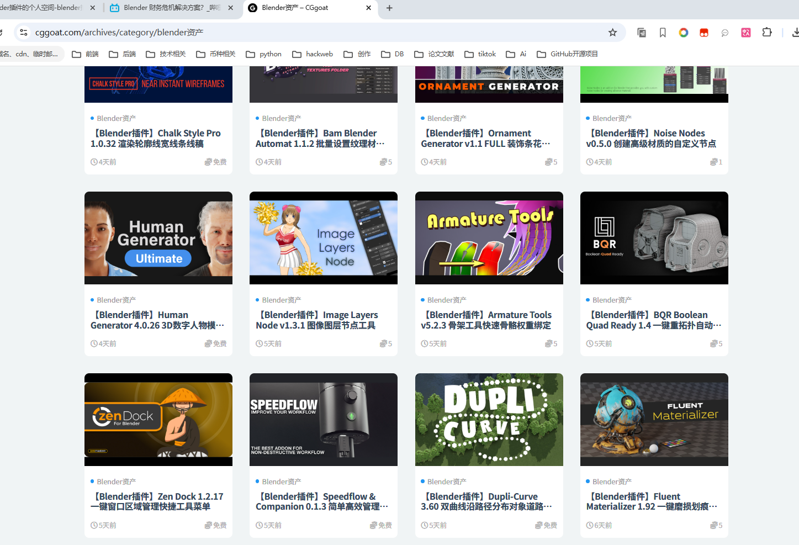

# blender插件下载汽车骨架下载

[https://www.cggoat.com/archives/category/blender%e8%b5%84%e4%ba%a7](https://www.cggoat.com/archives/category/blender%e8%b5%84%e4%ba%a7)

### 2.插件下载
[https://www.gfxcamp.com/human-generator-v1/](https://www.gfxcamp.com/human-generator-v1/)

[https://www.gfxcamp.com/launch-control-auto-car-rig/](https://www.gfxcamp.com/launch-control-auto-car-rig/)

### 汽车骨架下载
[https://carla.readthedocs.io/en/latest/tuto_A_add_vehicle/](https://carla.readthedocs.io/en/latest/tuto_A_add_vehicle/)

> 更新: 2025-05-15 11:37:52  
> 原文: <https://www.yuque.com/lixinsi/oyzgnh/vt3mfar9fauzsenv>