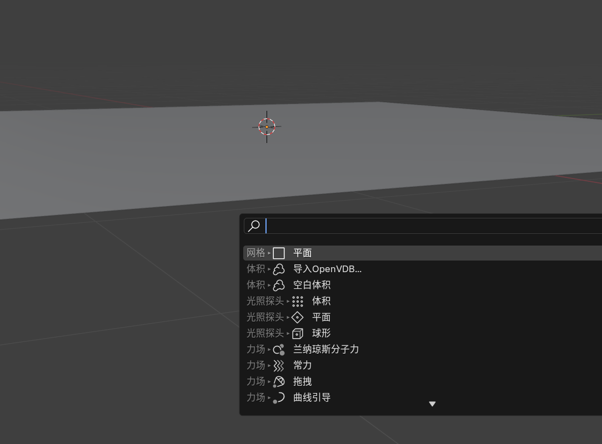
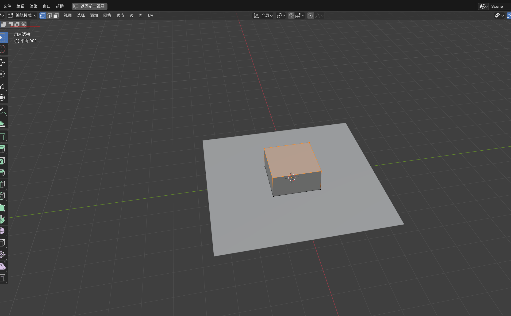
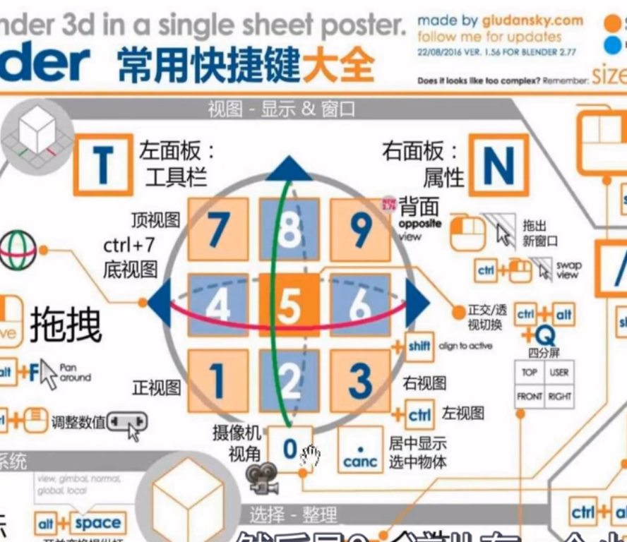
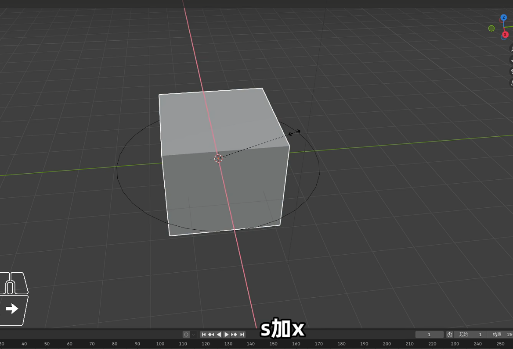
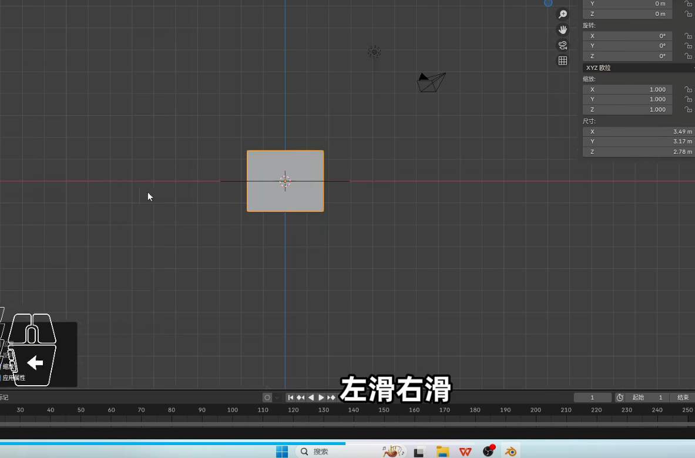
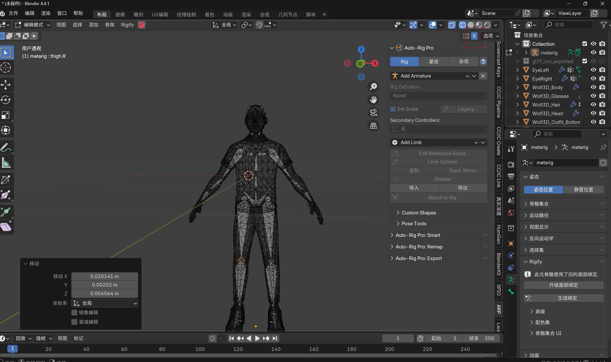

# blender自学

通过网盘分享的文件：Blender教程全套视频课程3D建模渲染动画制作自学零基础入门到

链接: [https://pan.baidu.com/s/1Nt3fOK6b6phBkLBwYxqIFQ?pwd=42hp](https://pan.baidu.com/s/1Nt3fOK6b6phBkLBwYxqIFQ?pwd=42hp) 提取码: 42hp

感谢您的惠顾!

亲【十字评加+2张图片】截图发送客服并回复数字【999】即可领取~【5+豪礼】

### 1.创建新建平面，选中物体 s 键放大，+8 放大 8 倍
```dockerfile
shift+A快捷键新建平面
```




### 2.挤出操作
新建平面后，编辑模式选中物体，按 E 挤出操作



### 3.T 和 N 是面板调出。


### 4.移动物体以及删除物体 G 键删除物体 X 或者 delete
### 5.物体模式 向上移动 G+Z 或者 G+S 放大，s+z 是 y 轴缩放 s+x
### x 轴缩放



### 6.正交视图鼠标滚轮+alt 滑动


### 骨骼快捷键旋转 R


### 骨骼编辑 在编辑模式下面，打开镜像 S 可以调整骨骼旋转，G 可以调整骨骼位置，物体模型 G 可以调整 人物位置


### 增长率效果播放使用插件


> 更新: 2025-05-19 20:59:38  
> 原文: <https://www.yuque.com/lixinsi/oyzgnh/yxu6y3h8qhmuwh4s>