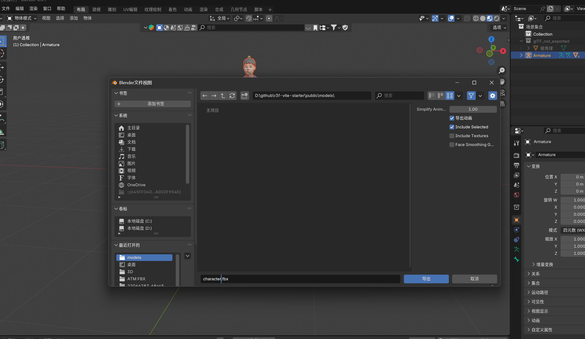

# 唇形同步开源

### 视频教程
[https://www.youtube.com/watch?v=pGMKIyALcK0](https://www.youtube.com/watch?v=pGMKIyALcK0)

[https://demo.readyplayer.me/avatar?id=681eb20eaad099d5099d781a](https://demo.readyplayer.me/avatar?id=681eb20eaad099d5099d781a)


### 初始化开源项目地址
[https://github.com/wass08/r3f-vite-starter](https://github.com/wass08/r3f-vite-starter)

### 人物模型生成网址
[https://demo.readyplayer.me/avatar?id=681eb20eaad099d5099d781a](https://demo.readyplayer.me/avatar?id=681eb20eaad099d5099d781a)


### 人物动画走路网址
[https://www.mixamo.com/#/](https://www.mixamo.com/#/)

### 组件化模型转 json
```json
npx gltfjsx@6.5.3 D:\github\r3f-vite-starter\public\models\681eb70f55fa435d149f6b7c.glb
```

### 在 blender 里面导出 fbx 格式人物模型


```json
帮我阅读当前项目我想用React Three Fiber加载场景模型youzheng.glb以及人物模型D:\github\vite\3d\public\681eb70f55fa435d149f6b7c.glb人物，模型可以使用第一人称视角在场景里面走动并且可以用键盘wasd按键进行行走按照30年前端程序员给我写好中文注释以及核心代码注释
```


> 更新: 2025-05-10 14:08:56  
> 原文: <https://www.yuque.com/lixinsi/oyzgnh/wkhbhl79ln40r0pp>