# 基于AI的一整套3D动画工作流，我的3D数字人再也不用手K动画了

周末发现一个很有用的网站，几乎涵盖了3D数字人一整套动画工作流，可以极大地简化目前3D数字人的工作量。

https://getcartwheel.com/home

功能一：文字生成人物动画

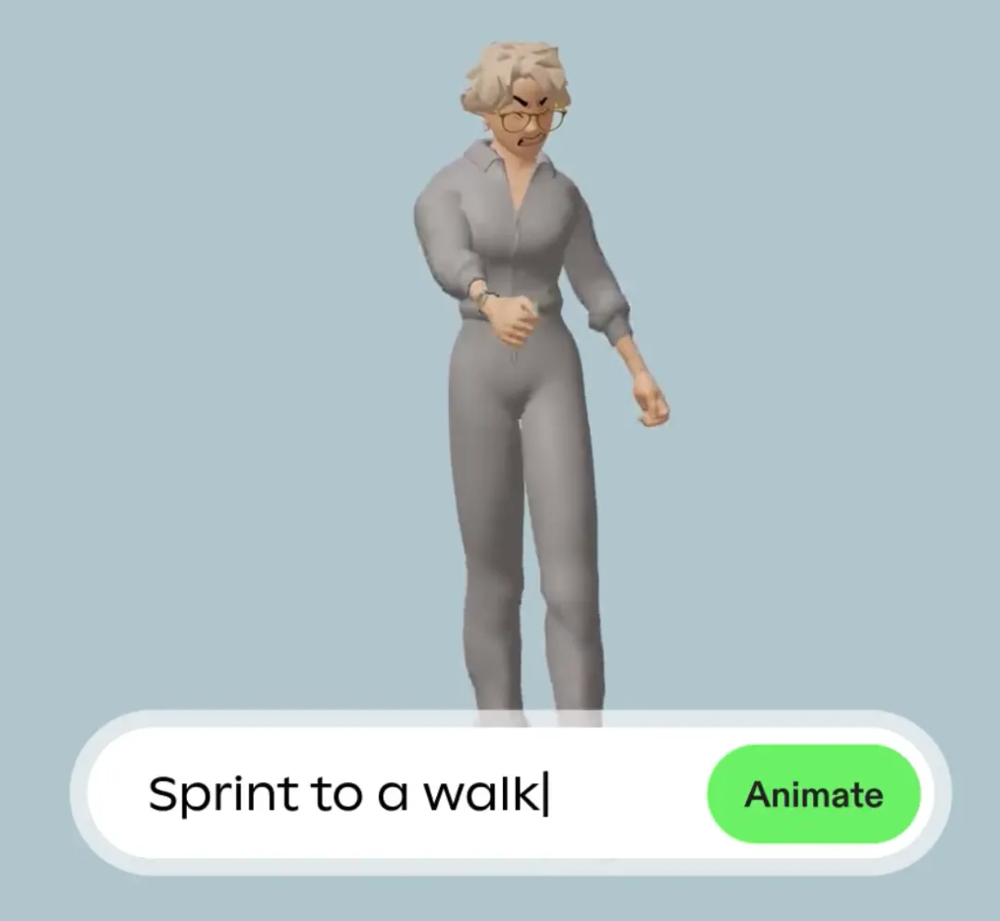

功能二：视频提取人物动画

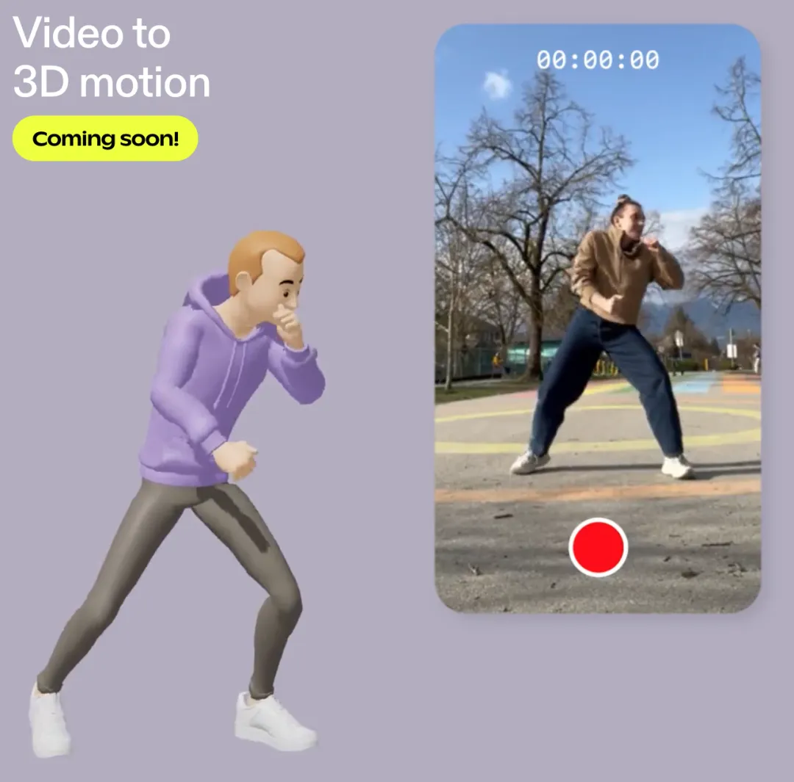

功能三： 非常丰富的动画库，比mixamo更多动作

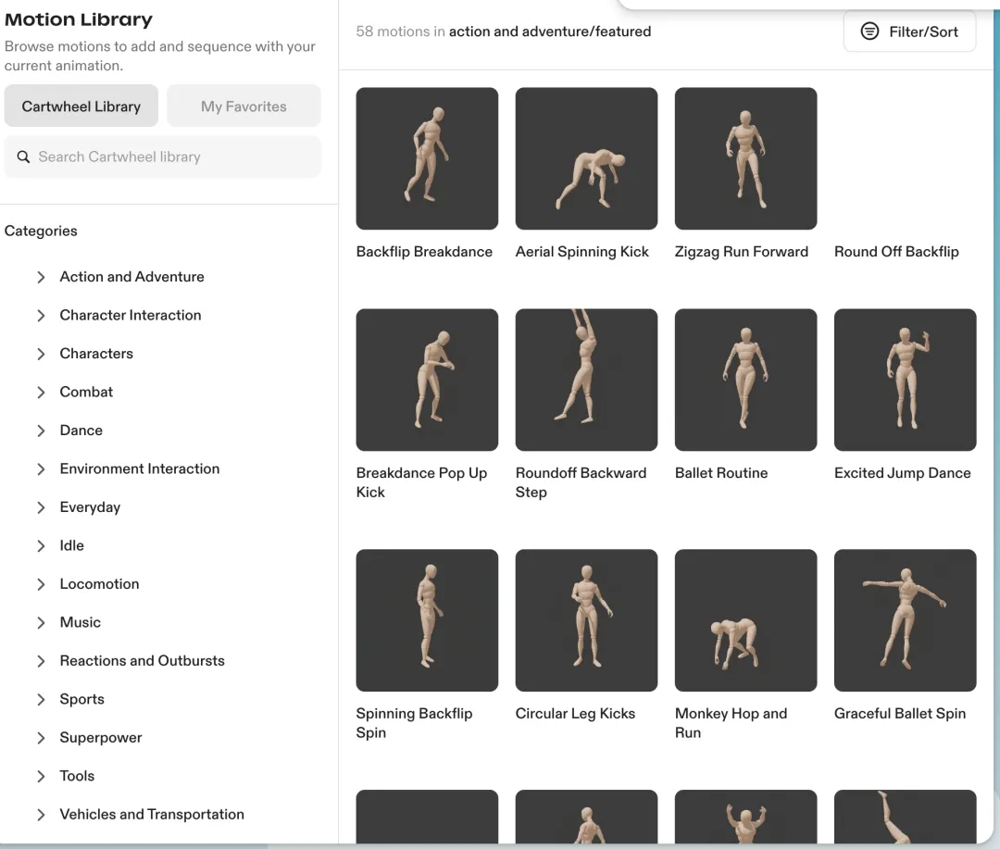

  

功能四： 多个动作之间平滑过渡

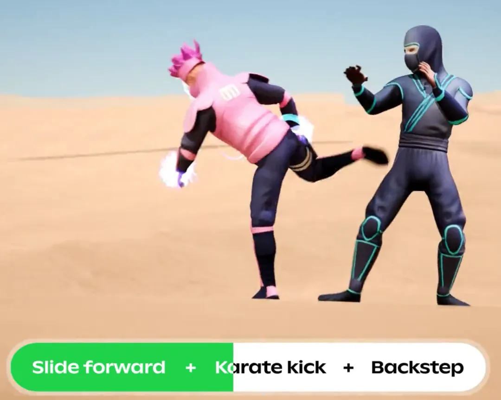

  

功能五：用文本和图片生成3D模型，自带绑定动作

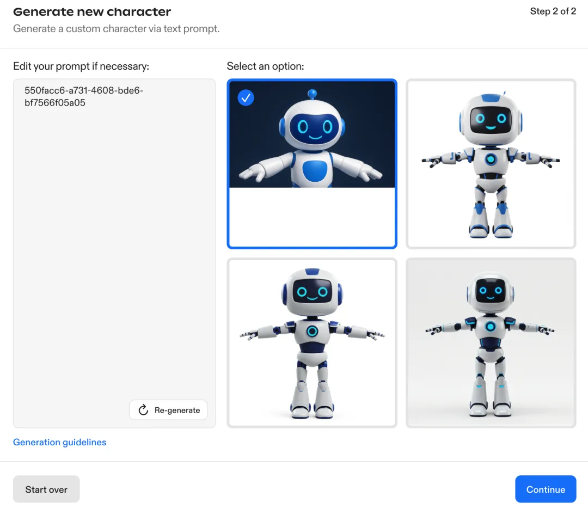

  

功能六： 上传自己的3D模型，自动绑定

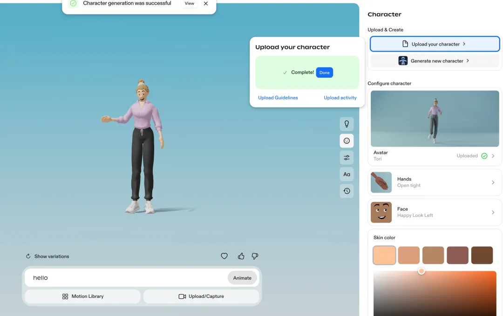

  

功能七： 可编辑的动画

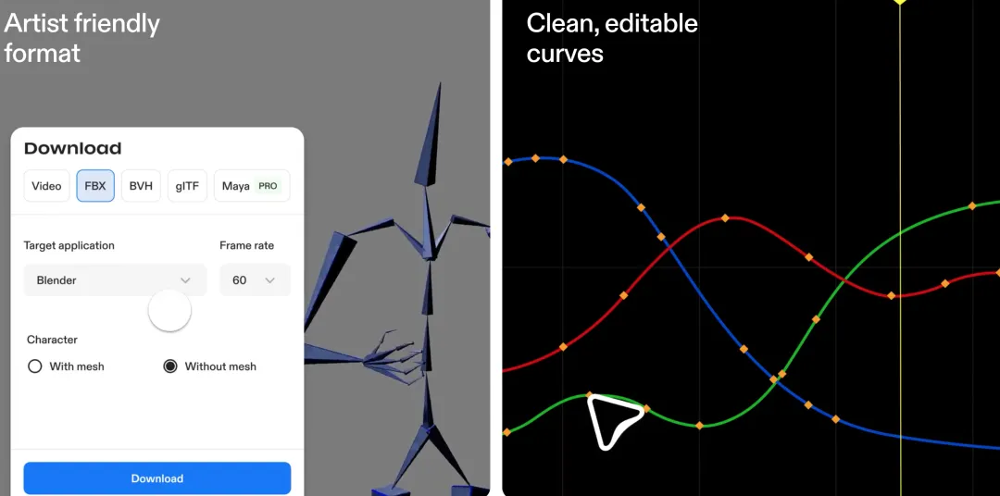

  

功能八： AI自动绑定自带建模软件中需要手动做的事情

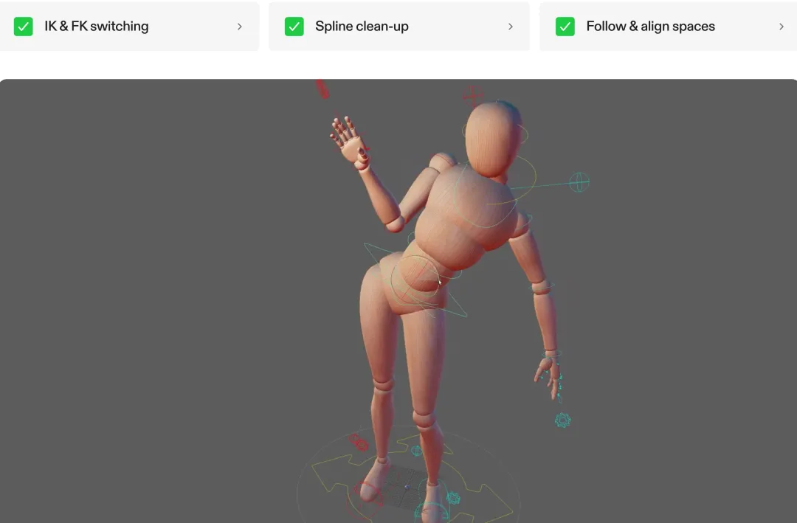

  

我如何免费获取它的动作文件：

1. 打开https://studio.getcartwheel.com/

输入想要的动作指令，系统会从动作库里推荐想要的动作或者用AI生成。目前动作库里已经非常多了，我直接拿过来改改就行。

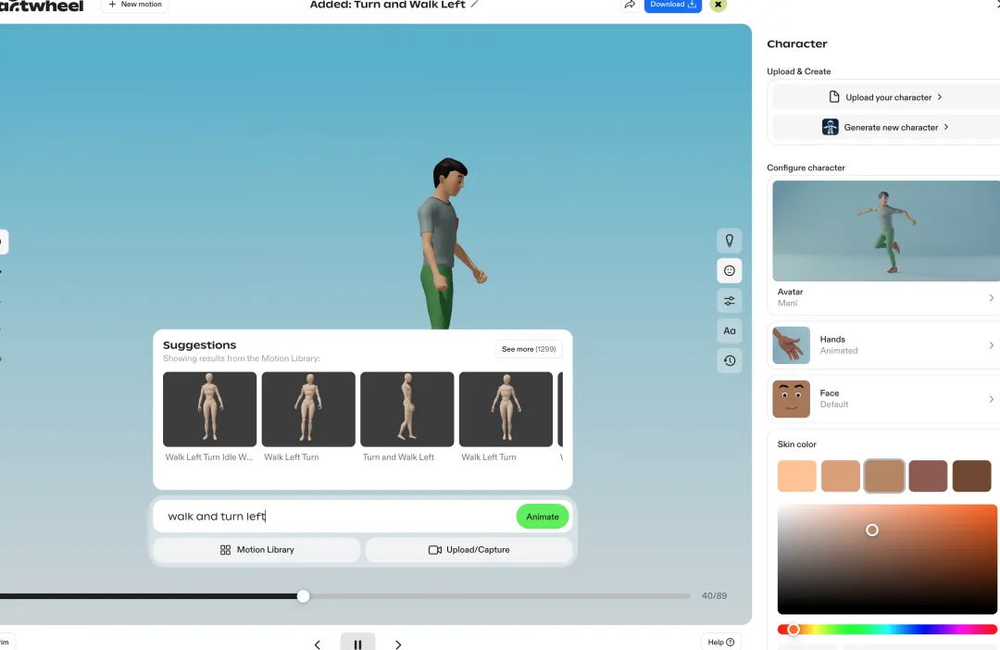

  

2.  选择动作库中的一个动作后，会在浏览器里出来一个output.bvh的文件，这个就是所选的动作文件，这样可以直接绕过积分限制。

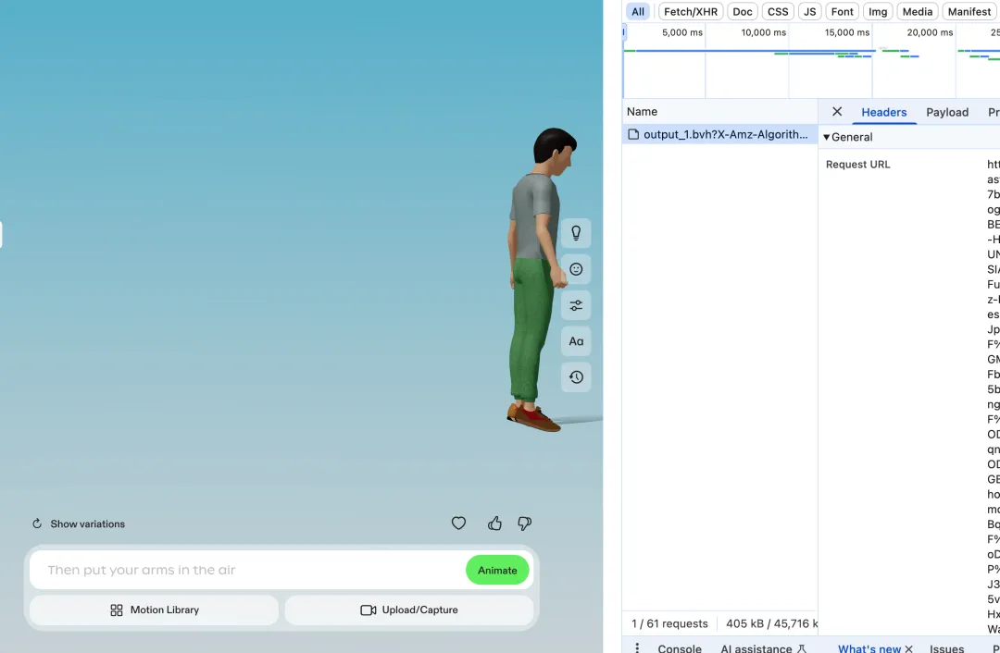

3. 将刚才的output.bvh导入blender中，可以看到它骨骼的命名跟mixamo可以完全对应上

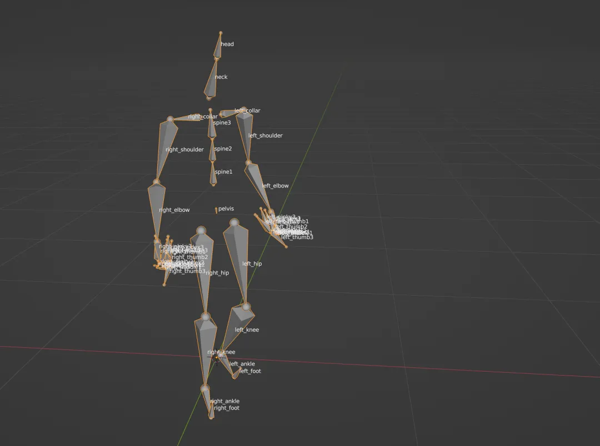

4. 接下来我们只要将动作文件和绑定好的模型做一个 regard映射一下就可以了。

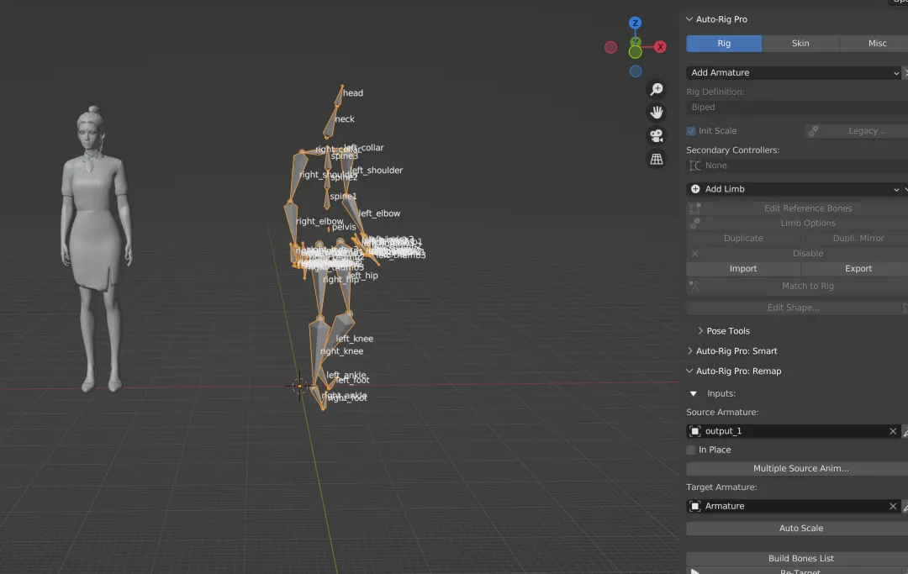

> 更新: 2025-06-09 20:19:44  
> 原文: <https://www.yuque.com/lixinsi/oyzgnh/tmxgo3ucs7kammit>