# 小米su7 or 保时捷怎么选？使用 Three 实现 3D 汽车展示平台比比看

[https://www.ewbang.com/community/article/details/1000127924.html](https://www.ewbang.com/community/article/details/1000127924.html)

### <font style="color:rgb(51, 51, 51);">前言</font>
<font style="color:rgb(86, 101, 115);">Threejs 可以实现特别多炫酷的 3D 效果，作为当下极度内卷的前端时代的前端 er，需要不断的提升自己，但是苦于 Three 的高质量资料较少，学起来有几分困难。</font>

<font style="color:rgb(86, 101, 115);">从去年最开始写 Threejs 专栏开始，就想写一个汽车展示平台，一直没能够很完善的实现，这次在 AI 的协助下，写一个 su7 和保时捷的展示&对比平台，咱们就来较个真，看看到底咋好看？</font>

<font style="color:rgb(86, 101, 115);">通过本文，你能学到：</font>

+ <font style="color:rgb(51, 51, 51);">打造一个 SU7 和 保时捷的 3D 展示平台</font>
    - <font style="color:rgb(51, 51, 51);">初始化 Three 项目的必备要素</font>
    - <font style="color:rgb(51, 51, 51);">Three 开发常用辅助手段</font>
    - <font style="color:rgb(51, 51, 51);">如何下载、加载和预览模型</font>
    - <font style="color:rgb(51, 51, 51);">如何实现颜色、贴膜的替换</font>
    - <font style="color:rgb(51, 51, 51);">实现动画效果</font>
+ <font style="color:rgb(51, 51, 51);">学习如何使用 MarsCode 和豆包进行辅助编程</font>

<font style="color:rgb(86, 101, 115);">观看本文前，推荐先阅读：</font>Threejs 从入门到实战<font style="color:rgb(86, 101, 115);">专栏，建立起对 Three 的基本概念</font>

### <font style="color:rgb(51, 51, 51);">准备工作</font>
<font style="color:rgb(86, 101, 115);">在实现一个 3D 展示平台之前，首先需要一些准备工作</font>

#### <font style="color:rgb(51, 51, 51);">获取模型</font>
<font style="color:rgb(86, 101, 115);">这里比较推荐</font><font style="color:rgb(86, 101, 115);"> </font>sketchfab<font style="color:rgb(86, 101, 115);">，从里面下载一下，su7 的模型比较多， porsche_taycan 模型相对少一些，而且还不够精美</font>

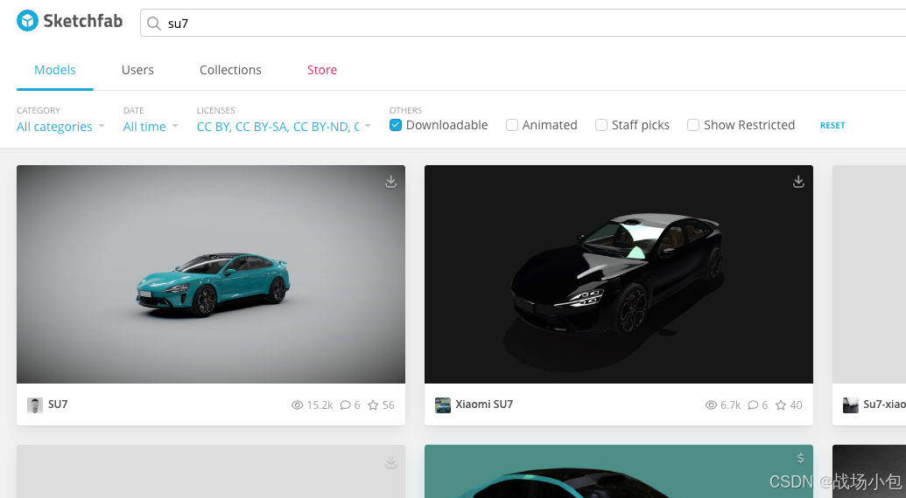

<font style="color:rgb(86, 101, 115);">其他 3D 模型获取方式：</font>free3d<font style="color:rgb(86, 101, 115);"> </font>cgmodel<font style="color:rgb(86, 101, 115);"> </font>cgtrade<font style="color:rgb(86, 101, 115);"> </font><font style="color:rgb(86, 101, 115);">…</font>

<font style="color:rgb(86, 101, 115);">模型有很多种格式，本文选用 GLTF 格式，根据扩展名可以分为两种</font>

+ <font style="color:rgb(119, 119, 119);">gltf: gltf 格式文件没有被压缩，会附带额外的 bin 数据文件，在文本编辑器中容易阅读，方便进行调试。</font>
+ <font style="color:rgb(119, 119, 119);">glb: 所有数据都包含在二进制文件中，文件小，推荐使用，</font>**<font style="color:rgb(119, 119, 119);">本文选用</font>**

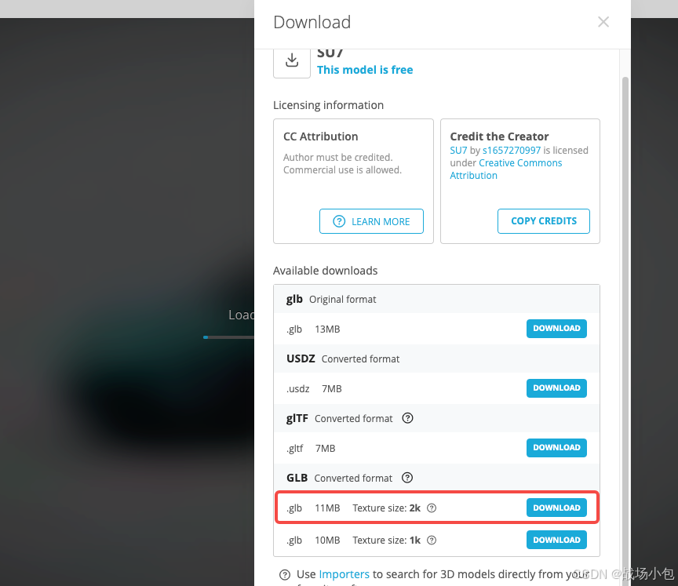

#### <font style="color:rgb(51, 51, 51);">创建项目</font>
<font style="color:rgb(86, 101, 115);">建议使用 vue 或者 react 进行实现，避免引入 Threejs 有一堆莫名其妙的问题。</font>

```plain
// 创建项目
npm create vite@latest
// 安装依赖
npm i
// 安装three.js
npm i --save-dev three
// 启动项目
npm run dev
```

#### <font style="color:rgb(51, 51, 51);">搭建 Three 项目</font>
<font style="color:rgb(86, 101, 115);">搭建一个基础的 Three 演示代码，Threejs 中存在核心三要素</font>

+ <font style="color:rgb(51, 51, 51);">scene：渲染物体的场景</font>
+ <font style="color:rgb(51, 51, 51);">camera：相机，决定场景中哪些部分能看到</font>
+ <font style="color:rgb(51, 51, 51);">renderer：渲染器，将场景渲染到画布 canvas 上  
</font><font style="color:rgb(51, 51, 51);">这部分可以参考官方的案例</font><font style="color:rgb(51, 51, 51);"> </font>Creating a scene<font style="color:rgb(51, 51, 51);">，也可以直接使用 MarsCode 生成一份。</font>

<font style="color:rgb(86, 101, 115);">输入：</font>**<font style="color:rgb(86, 101, 115);">在本仓库的基础上，使用 vue 写一个 threejs 演示代码</font>**<font style="color:rgb(86, 101, 115);">。由于当前为 vue 仓库，输入指令限定一下范围，避免生成原生 javascript 代码</font>

```html
<template>
  <div id="container"></div>
</template>

<script>
import * as THREE from "three";

export default {
  name: "ThreejsDemo",
  mounted() {
    this.initThreejs();
  },
  methods: {
    initThreejs() {
      const width = window.innerWidth;
      const height = window.innerHeight;

      const scene = new THREE.Scene();
      const camera = new THREE.PerspectiveCamera(75, width / height, 0.1, 1000);
      const renderer = new THREE.WebGLRenderer();

      renderer.setSize(width, height);
      document.getElementById("container").appendChild(renderer.domElement);

      const geometry = new THREE.BoxGeometry();
      const material = new THREE.MeshBasicMaterial({ color: 0x00ff00 });
      const cube = new THREE.Mesh(geometry, material);

      scene.add(cube);

      camera.position.z = 5;

      const animate = () => {
        requestAnimationFrame(animate);

        cube.rotation.x += 0.01;
        cube.rotation.y += 0.01;

        renderer.render(scene, camera);
      };

      animate();
    },
  },
};
</script>

<style>
#container {
  width: 100%;
  height: 100%;
}
</style>
```

<font style="color:rgb(86, 101, 115);">重新运行程序，就可以实现一个转动的绿色正方体。另外，我比较习惯将 scene、renderer、camera 等变量定义为全局变量，方便后续使用，这里按需使用。</font>

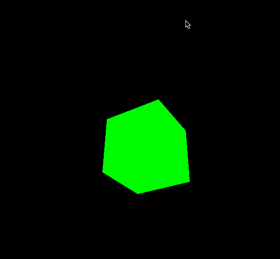

<font style="color:rgb(86, 101, 115);">在 Threejs 开发中，在开发的过程中，官方提供的某些辅助功能，非常方便，这里也添加一下，简单的建议还是使用 MarsCode 直接生成就好。</font>

<font style="color:rgb(86, 101, 115);">输入：</font>**<font style="color:rgb(86, 101, 115);">添加轨道控制器 control 和辅助线和窗口自适应</font>**

```plain
import { OrbitControls } from "three/examples/jsm/controls/OrbitControls";

initThree() {
    // 创建坐标辅助线
    const axesHelper = new THREE.AxesHelper(5);
    scene.add(axesHelper);
    // 创建轨道控制器
    controls = new OrbitControls(camera, renderer.domElement);
    // 窗口自适应
    window.addEventListener("resize", () => {
        const width = window.innerWidth / 2;
        const height = window.innerHeight;

        camera.aspect = width / height;

        camera.updateProjectionMatrix();

        renderer.setSize(width, height);
    });
}
```

+ <font style="color:rgb(51, 51, 51);">轨道控制器：允许用户通过鼠标操作来控制相机，实现围绕场景中的目标物体进行旋转、缩放和平移。通俗来讲就是一个可以控制相机的工具。</font>
+ <font style="color:rgb(51, 51, 51);">坐标辅助线：可以创建一个坐标系，注意轴的颜色，黄色代表 X 轴，绿色代表 Y 轴，蓝色代表 Z 轴，不小心就被坑了，将 Z 轴和 Y 轴混淆</font>
+ <font style="color:rgb(51, 51, 51);">窗口自适应</font>

<font style="color:rgb(86, 101, 115);">有可能还有一些更深层次的辅助需求，比如想看相机的位置，那可以启用</font>**<font style="color:rgb(86, 101, 115);">相机位置指示器</font>**

```plain
// 创建相机位置指示器
cameraHelper = new THREE.CameraHelper(camera);
scene.add(cameraHelper);
```

<font style="color:rgb(86, 101, 115);">据我体验，只是在页面中多了一个灰色的坐标系，交叉点是相机指向的方向，目前没有感觉出什么用。</font>

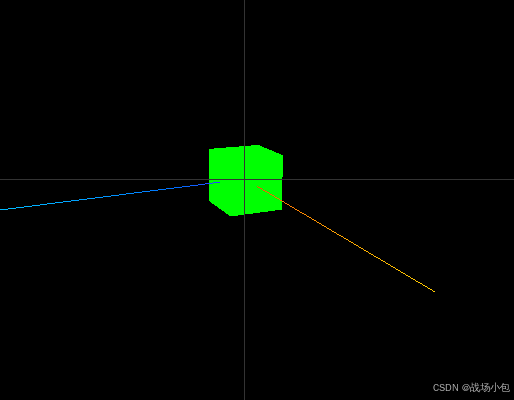

<font style="color:rgb(86, 101, 115);">想获取相机的位置，因为在后续操作中，可以根据相机的位置进行一些复杂交互。</font>

<font style="color:rgb(86, 101, 115);">输入：</font>**<font style="color:rgb(86, 101, 115);">能不能渲染出相机的位置，并可视化渲染的区域。</font>**

<font style="color:rgb(86, 101, 115);">此次 MarsCode 没有给出满意的结果啊，反复问了几次都没有成功，依旧推荐 CameraHelper，遇到这种情形，不要头铁，换一种描述来做：</font>

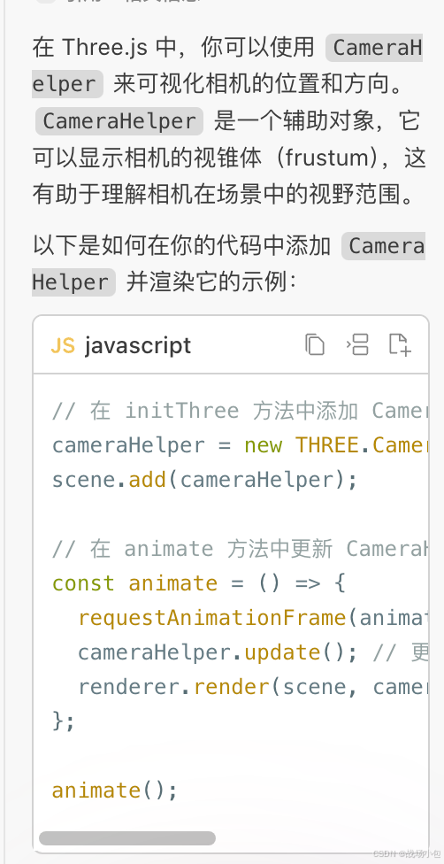

<font style="color:rgb(86, 101, 115);">输入：</font>**<font style="color:rgb(86, 101, 115);">尝试通过一个物体来模拟相机的位置</font>**

<font style="color:rgb(86, 101, 115);">MarsCode 生成的代码如下：</font>

```plain
camera.position.z = 5;

const markerGeometry = new THREE.SphereGeometry(0.1, 16, 16);
const markerMaterial = new THREE.MeshBasicMaterial({ color: 0xff0000 });
marker = new THREE.Mesh(markerGeometry, markerMaterial);
// 将标记物体的位置设置为相机的位置
marker.position.copy(camera.position);
// 将标记物体添加到场景
scene.add(marker);

const animate = () => {
  requestAnimationFrame(animate);

  // 更新标记物体的位置为相机的位置
  marker.position.copy(camera.position);
  cube.rotation.x += 0.01;
  cube.rotation.y += 0.01;

  renderer.render(scene, camera);
};
```

<font style="color:rgb(86, 101, 115);">非常有创意的实现方式，相当于在场景中创建了一个物体，物体的位置和相机重合，从而实现相机的可视化，注意物体的创建要在相机设定位置之后。而且，要删除掉 animate 中的 marker.position.copy(camera.position); 否则看不到物体。这也提醒了，使用 MarsCode 生成的代码，可能需要根据场景做一些动态调整。</font>

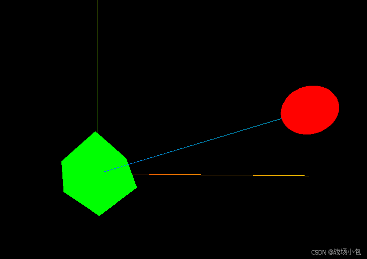

<font style="color:rgb(86, 101, 115);">到这里基本工作就完成了，下面开始核心部分开发。</font>

### <font style="color:rgb(51, 51, 51);">核心开发</font>
<font style="color:rgb(86, 101, 115);">要实现一个 su7 vs 保时捷的 3D 汽车展示平台，要实现以下内容</font>

+ <font style="color:rgb(51, 51, 51);">加载 glb 模型</font>
+ <font style="color:rgb(51, 51, 51);">渲染展示场景</font>
+ <font style="color:rgb(51, 51, 51);">添加灯光</font>
+ <font style="color:rgb(51, 51, 51);">车体颜色修改</font>
+ <font style="color:rgb(51, 51, 51);">车体贴膜修改</font>
+ <font style="color:rgb(51, 51, 51);">场景切换</font>
+ <font style="color:rgb(51, 51, 51);">更多功能…</font>

<font style="color:rgb(86, 101, 115);">定义一个 Car 类，用于实例汽车。推荐借助 MarsCode 实现一个基础，然后再手动进行完善</font>

```plain
// 定义 Car 类
import * as THREE from "three";

export default class Car {
  constructor(model, scene, camera, controls, color, name) {
    this.model = model;
    this.scene = scene;
    this.camera = camera;
    this.controls = controls;
    this.color = color;

    // 初始化方法
    this.init();
  }

  init() {
    // 将汽车模型添加到场景中
    this.scene.add(this.model);
  }
  // 修改颜色
  changeColor(color) {}
  // 修改粗糙度
  changeRoughness(roughness) {}
  // 修改金属度
  changeMetalness(metalness) {}
}
```

#### <font style="color:rgb(51, 51, 51);">加载模型</font>
<font style="color:rgb(86, 101, 115);">使用 MarsCode 帮助写一段加载 glb 模型的方法：</font>**<font style="color:rgb(86, 101, 115);">定义一个 GLTF 模型加载的函数</font>**

```plain
// 引入 Three.js 和 GLTF 加载器
import * as THREE from "three";
import { GLTFLoader } from "three/examples/jsm/loaders/GLTFLoader";

export default {
  name: "GLTFModelViewer",
  data() {
    return {
      model: null,
    };
  },
  methods: {
    loadGLTFModel() {
      const loader = new GLTFLoader();
      loader.load(
        // 模型文件的路径
        "/path/to/your/model.gltf",
        // 加载成功后的回调函数
        (gltf) => {
          this.model = gltf.scene;
          this.scene.add(this.model);
        },
        // 加载过程中的回调函数
        (xhr) => {
          console.log((xhr.loaded / xhr.total) * 100 + "% loaded");
        },
        // 加载失败后的回调函数
        (error) => {
          console.error(error);
        }
      );
    },
  },
  mounted() {
    this.loadGLTFModel();
  },
};
```

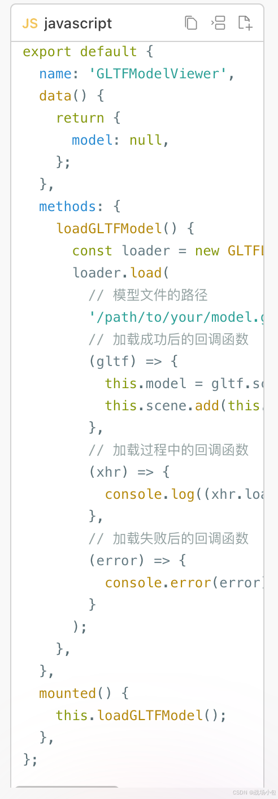

<font style="color:rgb(86, 101, 115);">MarsCode 写的太完善了，给简化一下</font>

```plain
import { GLTFLoader } from "three/examples/jsm/loaders/GLTFLoader";
import Car from "../model/Car";

export default {
  mounted() {
    this.initThree();
    this.loadModel();
  },
  methods: {
    loadModel() {
      this.loader = new GLTFLoader();
      // 分别传入两个汽车模型的 path
      this.loader.load(this.modelPath, (gltf) => {
        this.car = new Car(gltf.scene, scene, camera, controls, this.carColor); // 传递初始颜色
      });
    },
  },
};
```

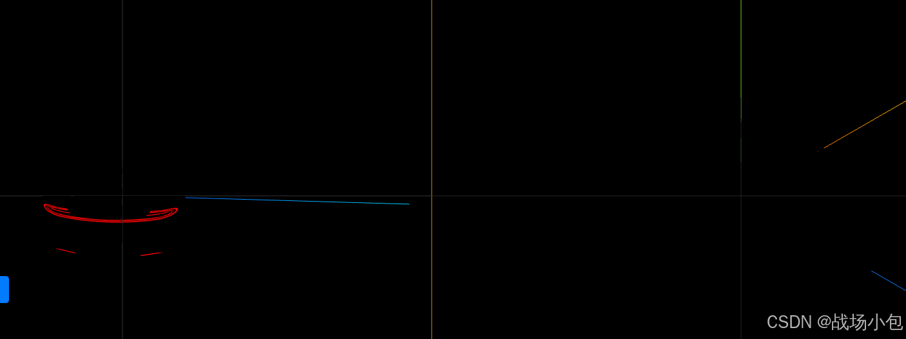

<font style="color:rgb(86, 101, 115);">保时捷模型完全看不到，小米 su7 只能模模煳煳的看到一些轮廓。</font>

<font style="color:rgb(86, 101, 115);">代码开发中遇到未知的情形，还是推荐多问一些 MarsCode 或者豆包，问题是：</font>**<font style="color:rgb(86, 101, 115);">需要设定光源才能实现预览</font>**

#### <font style="color:rgb(51, 51, 51);">添加光源</font>
<font style="color:rgb(86, 101, 115);">输入：</font>**<font style="color:rgb(86, 101, 115);">期望添加来自一个四面八方的光源</font>**

```plain
const ambientLight = new THREE.AmbientLight(0xffffff, 0.5);
scene.add(ambientLight);

const directionalLight = new THREE.DirectionalLight(0xffffff, 0.8);
directionalLight.position.set(1, 1, 1);
scene.add(directionalLight);

const directionalLight2 = new THREE.DirectionalLight(0xffffff, 0.8);
directionalLight2.position.set(-1, -1, -1);
scene.add(directionalLight2);

const directionalLight3 = new THREE.DirectionalLight(0xffffff, 0.8);
directionalLight3.position.set(-1, 1, -1);
scene.add(directionalLight3);

const directionalLight4 = new THREE.DirectionalLight(0xffffff, 0.8);
directionalLight4.position.set(1, -1, 1);
scene.add(directionalLight4);
```

<font style="color:rgb(86, 101, 115);">使用了一组四个方向的平行光 DirectionalLight 和一个环境光 AmbientLight，就可以成功看到 su7 和保时捷了</font>

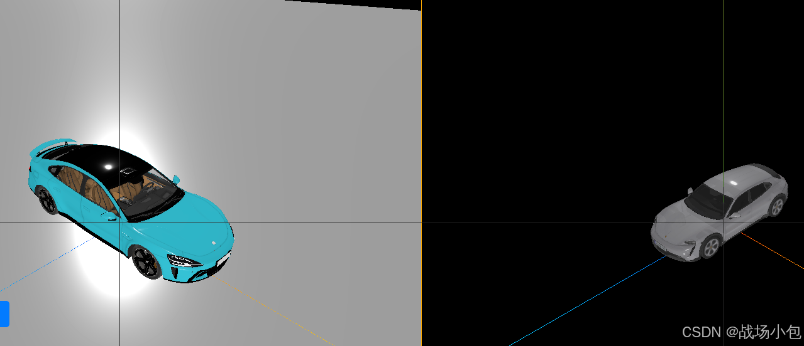

#### <font style="color:rgb(51, 51, 51);">调整模型清晰度</font>
<font style="color:rgb(86, 101, 115);">两个车有点偏像素风，非常模煳，继续询问一下 MarsCode</font>

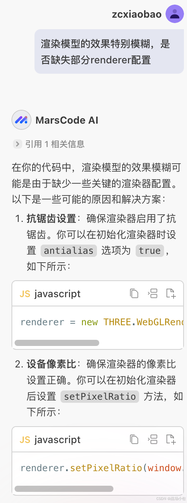

<font style="color:rgb(86, 101, 115);">设定一下抗锯齿和设备像素比</font>

```plain
renderer = new THREE.WebGLRenderer({ antialias: true });
renderer.setPixelRatio(window.devicePixelRatio);
```

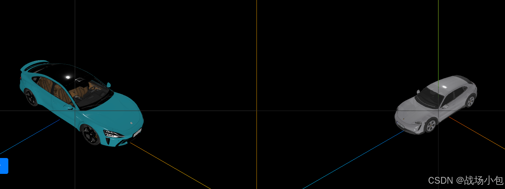

<font style="color:rgb(86, 101, 115);">相较于 su7，保时捷显得有点小，这种情况修改一下相机位置，拉紧一些保时捷的相机，拉远一些 su7 的。</font>

```plain
// su7
camera.position.set(5, 5, 5);
// 保时捷
camera.position.set(-3, 3, 3);
```

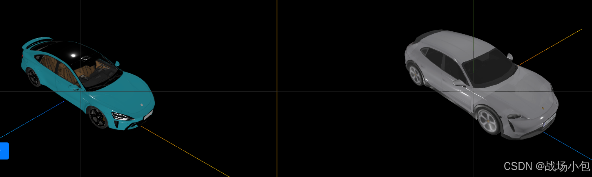

#### <font style="color:rgb(51, 51, 51);">添加背景</font>
<font style="color:rgb(86, 101, 115);">输入：</font>**<font style="color:rgb(86, 101, 115);">现在需要生成一个具有科技感的背景用于汽车模型的展示</font>**

<font style="color:rgb(86, 101, 115);">上面给出的 prompt 就有些过于笼统了，导致这里和 MarsCode 拉扯了一会，后续补充了多组进一步提示，才实现展示背景。</font>

```plain
createBackground() {
  // 创建背景网格
  const geometry = new THREE.PlaneGeometry(100, 100);

  // 使用 MeshPhysicalMaterial 实现金属效果
  const material = new THREE.MeshPhysicalMaterial({
    color: 0xcccccc, // 起始颜色：浅灰色
    metalness: 0.5, // 金属度
    roughness: 0.2, // 粗糙度
    envMapIntensity: 1.0, // 环境贴图强度
  });

  // 加载环境贴图
  // const loader = new THREE.CubeTextureLoader();
  // const envMap = loader.load([
  //   'path_to_positive_x.jpg',
  //   'path_to_negative_x.jpg',
  //   'path_to_positive_y.jpg',
  //   'path_to_negative_y.jpg',
  //   'path_to_positive_z.jpg',
  //   'path_to_negative_z.jpg',
  // ]);

  // 将环境贴图应用到材质上
  // material.envMap = envMap;

  const plane = new THREE.Mesh(geometry, material);
  plane.rotation.x = -Math.PI / 2;
  scene.add(plane);

  // 增加环境光的强度
  const ambientLight = new THREE.AmbientLight(0xffffff, 1.5); // 增加到1.5
  scene.add(ambientLight);

  // 调整光源位置和强度
  const directionalLight = new THREE.DirectionalLight(0xffffff, 0.5);
  directionalLight.position.set(1, 1, 1);
  scene.add(directionalLight);

  const directionalLight2 = new THREE.DirectionalLight(0xffffff, 0.5);
  directionalLight2.position.set(-1, -1, -1);
  scene.add(directionalLight2);

  const directionalLight3 = new THREE.DirectionalLight(0xffffff, 0.5);
  directionalLight3.position.set(-1, 1, -1);
  scene.add(directionalLight3);

  const directionalLight4 = new THREE.DirectionalLight(0xffffff, 0.5);
  directionalLight4.position.set(1, -1, 1);
  scene.add(directionalLight4);
},
```

<font style="color:rgb(86, 101, 115);">推荐使用环境贴图，一时没有找到合适的，就没有添加，本质上就是创建一个平面，使用 MeshPhysicalMaterial 进行渲染，效果如下：</font>

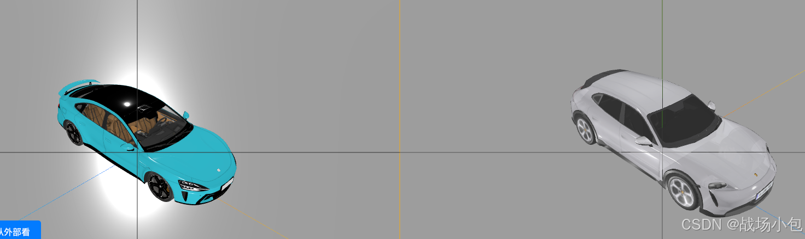

<font style="color:rgb(86, 101, 115);">环境贴图获取方式 MarsCode 也提供了一些，有需要可以参考一下</font>

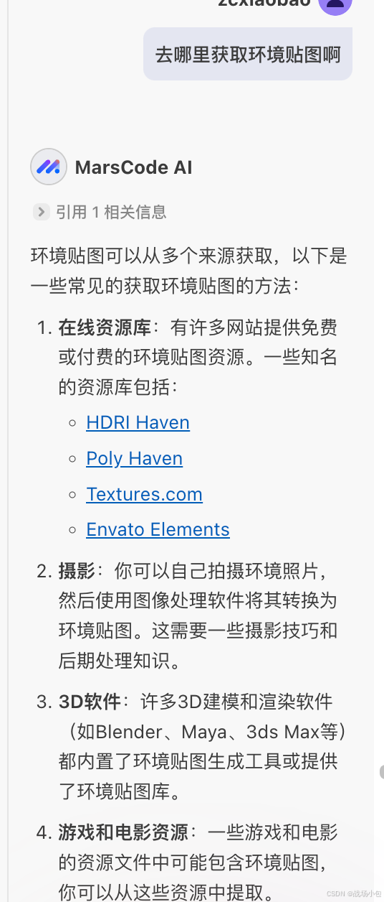

#### <font style="color:rgb(51, 51, 51);">颜色修改</font>
<font style="color:rgb(86, 101, 115);">车颜色可以说就相当于 QQ 飞车的皮肤，好看的颜色，那简直炫酷极了。</font>

<font style="color:rgb(86, 101, 115);">输入：</font>**<font style="color:rgb(86, 101, 115);">定义一串颜色选择按钮，点击相应按钮，汽车模型颜色替换为该颜色</font>**

```plain
// Car.js
class Car {
  // ...
  changeColor(color) {
    this.color = color;
    this.model.material.color.set(color); // 更新颜色
  }
}

// Car.vue

export default {
  //...
  methods: {
    changeCarColor(color) {
      this.carColor = color;
      // 更新汽车模型的颜色
      this.car.changeColor(color);
    },
  },
};
```

<font style="color:rgb(86, 101, 115);">上述实现是存在问题的，</font>**<font style="color:rgb(86, 101, 115);">this.model.material.color.set(color)</font>**<font style="color:rgb(86, 101, 115);"> </font><font style="color:rgb(86, 101, 115);">抛出了错误。</font>

<font style="color:rgb(86, 101, 115);">既然 MarsCode 没有给出解决方案，先尝试一下豆包：</font>**<font style="color:rgb(86, 101, 115);">现在在开发一个 three 汽车展示程序，已经成功加载了 glb 模型，如何实现模型的颜色变换</font>**

<font style="color:rgb(86, 101, 115);">豆包给出了一种非常彻底的实现方式：</font>

```plain
// 假设model是加载后的glb模型
model.traverse((child) => {
  if (child.isMesh) {
    // 获取网格的材质
    const material = child.material;
    // 设置新的颜色，这里以红色为例（0xff0000是红色的十六进制表示）
    material.color.set(0xff0000);
  }
});
```

<font style="color:rgb(86, 101, 115);">由于只有 Mesh 节点支持颜色修改，遍历汽车模型的所有子节点，如果为 Mesh 节点，替换颜色。</font>

<font style="color:rgb(86, 101, 115);">颜色的替换实现了，现实世界中不可能整车是一个颜色吧，可以沿着豆包提供的思路进行思考：</font>**<font style="color:rgb(86, 101, 115);">是否有方法可以只修改其中某几个部分的颜色？</font>**

<font style="color:rgb(86, 101, 115);">在遍历的过程中，可以打印一下各个子 Mesh 节点，可以获取到汽车模型的各个组成部分，每个 Mesh 都存在 name 属性，通过 name 进行进一步约束，实现局部的颜色替换。</font>

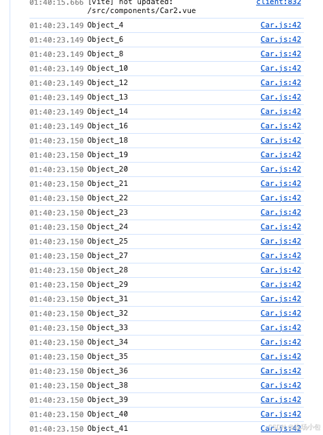

<font style="color:rgb(86, 101, 115);">新的问题来了，如何获取车身的 name 那，总不能挨着去尝试吧？Threejs 非常任性的提供了一个在线编辑平台，支持各类模型的导入，同时可以详细的看到模型的组成。</font>

<font style="color:rgb(86, 101, 115);">在线编辑平台：</font>https://threejs.org/editor/

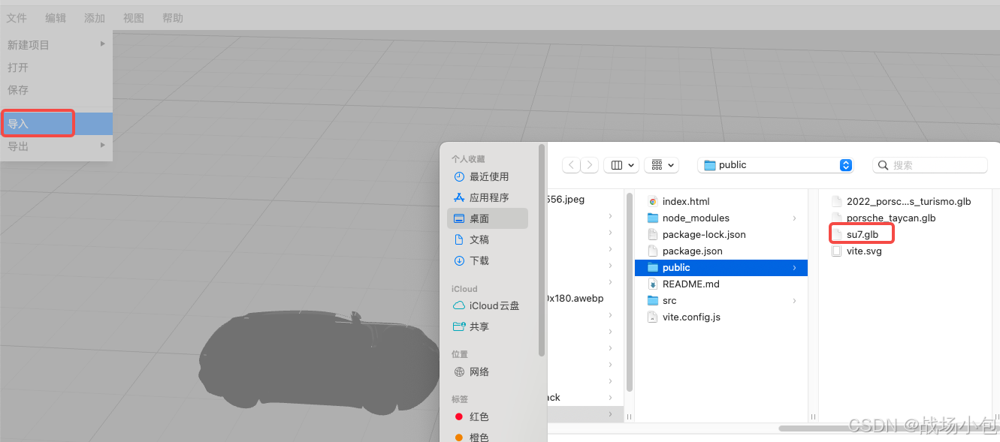

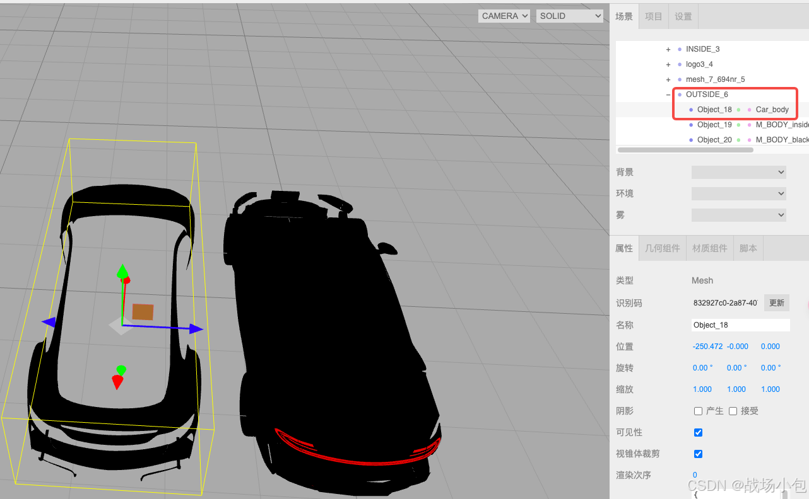

<font style="color:rgb(86, 101, 115);">以小米 su7 为例，选中车身，右侧场景部分展示详细信息，其中有一个 Car_body，操作箭头，可以将该部分从汽车整体中拉出。  
</font><font style="color:rgb(86, 101, 115);">Car_body 即车身，也就是需要替换颜色的部分，但是注意该部分的名字叫 Object_18。同样方法获取保时捷的车身 name 为 Body_Textures_Body_1_0。</font>

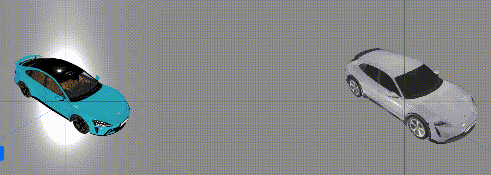

<font style="color:rgb(86, 101, 115);">下面附上使用的颜色数组</font>

```plain
const color= [
{
  name: '土豪金',
  color: '#ff9900',
  isSelected: true,
},
{
  name: '传奇黑',
  color: '#343a40',
  isSelected: false,
},
{
  name: '海蓝',
  color: '#409EFF',
  isSelected: false,
},
{
  name: '玫瑰紫',
  color: '#6600ff',
  isSelected: false,
},
{
  name: '银灰色',
  color: '#DCDFE6',
  isSelected: false,
}
],
```

#### <font style="color:rgb(51, 51, 51);">贴膜替换</font>
<font style="color:rgb(86, 101, 115);">贴膜替换本质上与颜色替换相同，只不过修改的是材质的金属度和粗糙度，因此借助 MarsCode 生成一组修改粗糙度和金属度的按钮。</font>

<font style="color:rgb(86, 101, 115);">输入：</font>**<font style="color:rgb(86, 101, 115);">类比颜色变换，生成一组按钮来控制汽车模型的金属度和粗糙度变换</font>**

<font style="color:rgb(86, 101, 115);">生成的核心代码：</font>

```plain
<button
  v-for="(metalness, index) in metalnesses"
  :key="metalness.name"
  :style="{ backgroundColor: metalness.color, left: index * 100 + 'px' }"
  @click="changeCarMetalness(metalness.value)"
>
  {{ metalness.name }}
</button>
<button
  v-for="(roughness, index) in roughnesses"
  :key="roughness.name"
  :style="{ backgroundColor: roughness.color, left: index * 100 + 'px' }"
  @click="changeCarRoughness(roughness.value)"
>
  {{ roughness.name }}
</button>
```

```plain
{
metalnesses: [
    {
      name: '低金属度',
      value: 0.2,
      color: '#888888',
    },
    {
      name: '中金属度',
      value: 0.5,
      color: '#aaaaaa',
    },
    {
      name: '高金属度',
      value: 0.8,
      color: '#cccccc',
    },
  ],
  roughnesses: [
    {
      name: '低粗糙度',
      value: 0.2,
      color: '#888888',
    },
    {
      name: '中粗糙度',
      value: 0.5,
      color: '#aaaaaa',
    },
    {
      name: '高粗糙度',
      value: 0.8,
      color: '#cccccc',
    },
  ],
}
```

<font style="color:rgb(86, 101, 115);">按钮的只渲染了 left 位置，没有写 bottom 会发生重合，手动调整一下。</font>

<font style="color:rgb(86, 101, 115);">其实代码遗漏了修改 Car 的金属度和粗糙度的代码，进一步交互一下：</font>**<font style="color:rgb(86, 101, 115);">在 Car.js 中如何修改模型的粗糙度和金属度</font>**

```plain
// 假设你已经导入了必要的Three.js模块
import * as THREE from 'three';

// 在Car类中添加方法来更改粗糙度和金属度
changeRoughness(roughness) {
  this.model.traverse((child) => {
    if (child.isMesh) {
      const material = child.material;
      if (material instanceof THREE.MeshStandardMaterial || material instanceof THREE.MeshPhysicalMaterial) {
        material.roughness = roughness;
      }
    }
  });
}

changeMetalness(metalness) {
  this.model.traverse((child) => {
    if (child.isMesh) {
      const material = child.material;
      if (material instanceof THREE.MeshStandardMaterial || material instanceof THREE.MeshPhysicalMaterial) {
        material.metalness = metalness;
      }
    }
  });
}
```

<font style="color:rgb(86, 101, 115);">根据 color 部分的实现，可以添加上 name 的约束，避免修改整体汽车模型的粗糙度和金属度。</font>

<font style="color:rgb(86, 101, 115);">到这里，就可以实现基于粗糙度、金属度和颜色来实现车身的多种变化，具体效果如下：</font>

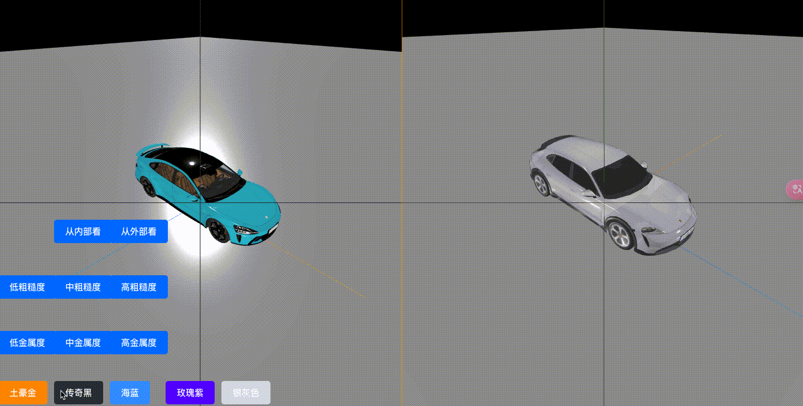

#### <font style="color:rgb(51, 51, 51);">驾驶位视角</font>
<font style="color:rgb(86, 101, 115);">最后实现一个复杂的效果，动态平滑切换到主驾驶位置，具体原理见下图：</font>

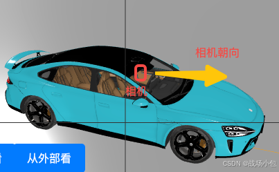

<font style="color:rgb(86, 101, 115);">可以想象一下驾车时候的感觉，然后将人的感觉转变成相机即可，也就是将相机位置固定在主驾驶处，相机朝向外面。</font>

<font style="color:rgb(86, 101, 115);">这一部分比较难通过 MarsCode 来实现，除非描述清楚具体的车辆位置、大小，这有些繁琐，只需要 MarsCode 提供大致怎么写，再陆续调整就行。</font>

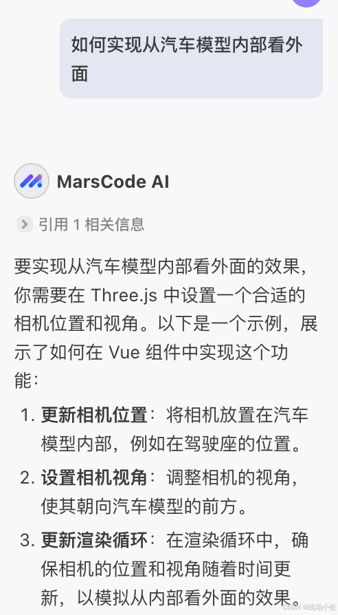

**<font style="color:rgb(86, 101, 115);">定义一个从内部看的函数，当该函数触发时，调整相机位置和指向</font>**

```plain
viewFromInside() {
  camera.position.set(-0.2, 0.9, -0.6);
  // 设置主驾驶视角目标点，假设看向汽车前方中心位置，比如(0.5, 0, 0.8)
  const targetPoint = new THREE.Vector3(2.8, 1.2, -0.4);
  camera.lookAt(targetPoint);
}
```

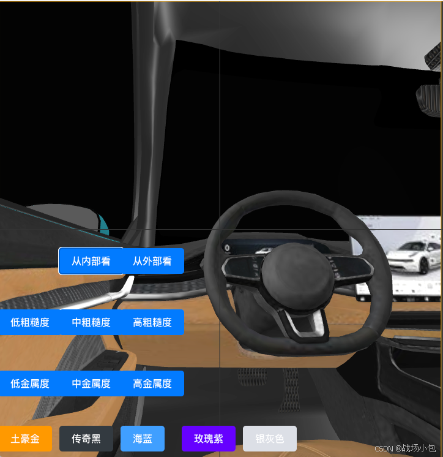

<font style="color:rgb(86, 101, 115);">视角的转换非常突然，尝试添加一下动画效果，更圆滑的实现转变。动画也没必要重复造轮子，询问一下</font>

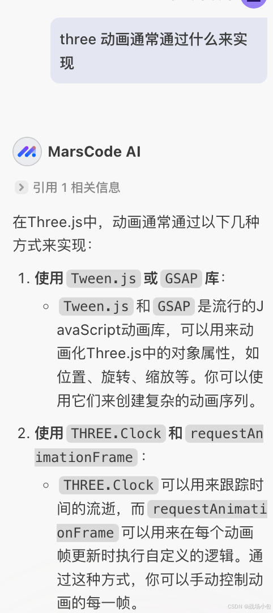

<font style="color:rgb(86, 101, 115);">gsap，一定注意时 gsap，总是习惯打成 gasp。</font>

<font style="color:rgb(86, 101, 115);">需要动态的修改相机的位置和相机的朝向，相机的位置可以通过 camera.position 修改，lookAt 是个瞬间操作，无法通过动画来实现。</font>

<font style="color:rgb(86, 101, 115);">输入：</font>**<font style="color:rgb(86, 101, 115);">现在需要实现一个从汽车模型外部到内部的 gsap 动画切换效果，在修改 camera.position 的同时，同步修改相机指向的位置，这里需要怎么实现</font>**

```plain
// 假设你已经导入了必要的Three.js模块和GSAP库
import * as THREE from 'three';
import gsap from 'gsap';

// 在Car类中添加方法来实现视角切换动画
viewFromOutsideToInside() {
  // 设置初始相机位置和目标点（外部视角）
  const initialCameraPosition = new THREE.Vector3(-5, 5, 5);
  const initialTargetPoint = new THREE.Vector3(0, 0, 0);

  // 设置最终相机位置和目标点（内部视角）
  const finalCameraPosition = new THREE.Vector3(-0.2, 0.9, -0.6);
  const finalTargetPoint = new THREE.Vector3(2.8, 1.2, -0.4);

  // 使用GSAP的to方法来动画相机位置
  gsap.to(camera.position, {
    x: finalCameraPosition.x,
    y: finalCameraPosition.y,
    z: finalCameraPosition.z,
    duration: 2,
    ease: 'power2.inOut',
    onUpdate: () => {
      // 在动画过程中更新相机的目标点
      camera.lookAt(initialTargetPoint.lerp(finalTargetPoint, gsap.utils.clamp(0, 1, gsap.getProperty(camera.position, 'x') / finalCameraPosition.x)));
    }
  });
}
```

<font style="color:rgb(86, 101, 115);">效果很奇怪，跟预想的不同，尝试调整一下</font>

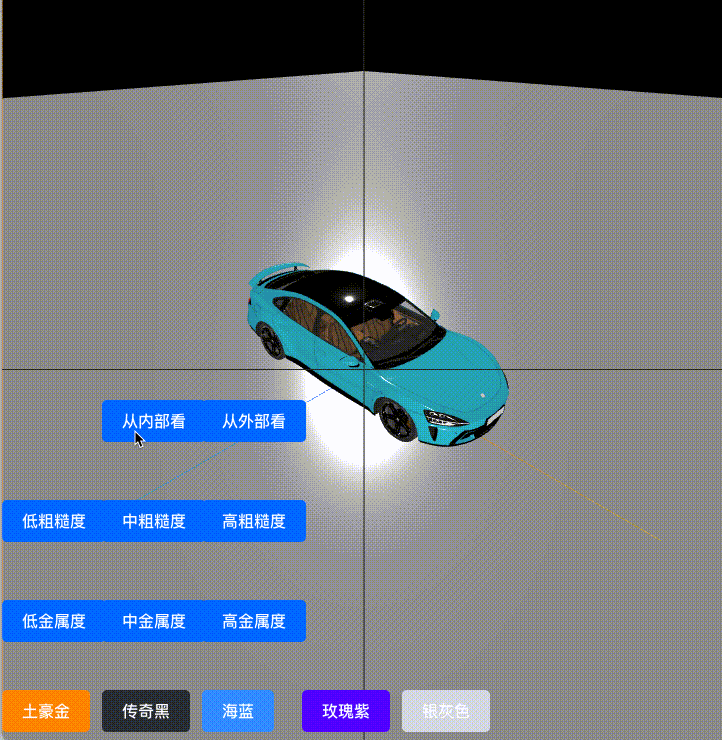

<font style="color:rgb(86, 101, 115);">当时尝试了很多提示词，都没能实现比较满意的效果，主要不知道如何描述所需场景。</font>

<font style="color:rgb(86, 101, 115);">后面问了豆包，OrbitControls 是用于围绕目标对象进行旋转、缩放和平移操作，存在一个 target 属性，定义了相机围绕点。动态地改变 target 属性的值，可以实现相机焦点的平滑转移。</font>

<font style="color:rgb(86, 101, 115);">那么将原来的 lookAt 位置设置为 target 的位置，就能实现相机位置修改的同时，围绕点也在旋转，代码如下：</font>

```plain
viewFromInside() {
  // 设置相机位置到汽车内部
  gsap.to(camera.position, {
    x: -0.2,
    y: 0.9,
    z: -0.4,
    duration: 2,
    ease: "power2.inOut",
    onUpdate: () => {
      // 在动画过程中更新相机的视角
      camera.lookAt(controls.target);
    },
  });

  gsap.to(controls.target, {
    x: 2.8,
    y: 0.9,
    z: -0.4,
    duration: 2,
    ease: "power2.inOut",
  });
},
```

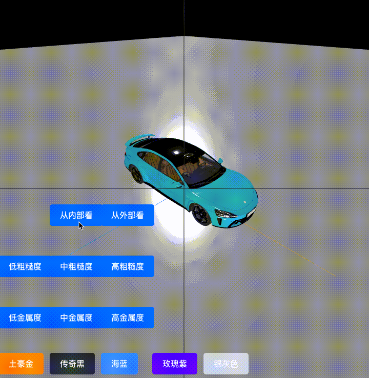

#### <font style="color:rgb(51, 51, 51);">更多操作</font>
<font style="color:rgb(86, 101, 115);">上面实践了模型内部的遍历 traverse，通过 isMesh 和 name 锁定车身，借助 gsap 实现动画效果，这几个操作任意组合，能实现各式各样的效果。</font>

<font style="color:rgb(86, 101, 115);">例如去</font><font style="color:rgb(86, 101, 115);"> </font>https://threejs.org/editor/<font style="color:rgb(86, 101, 115);"> </font><font style="color:rgb(86, 101, 115);">定位到车门所在 Mesh 为 Object_52。</font>

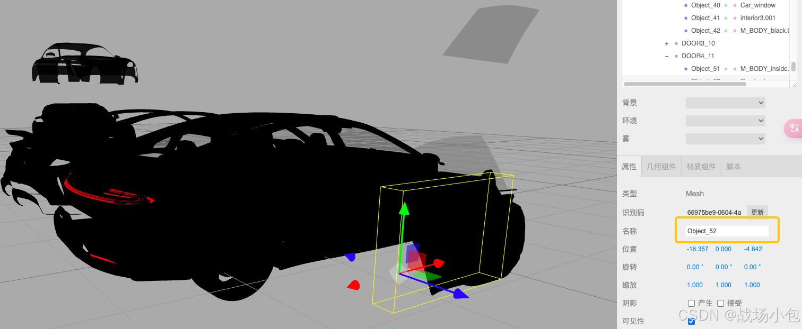

<font style="color:rgb(86, 101, 115);">添加一个按钮，点击按钮时，旋转车门</font>

```plain
openCarDoor() {
  this.model.traverse((child) => {
    if (child.isMesh && child.name === 'Object_52') {
      gsap.to(child.rotation, {
        x: -Math.PI / 4,
        y: -Math.PI / 4,
        duration: 1,
        ease: 'power2.out'
      });
    }
  })
}
```

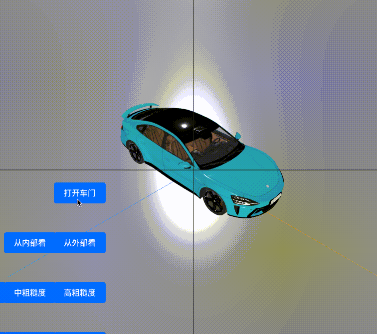

<font style="color:rgb(86, 101, 115);">诸如此类，整个模型就可以随意折腾了。</font>

### <font style="color:rgb(51, 51, 51);">总结</font>
<font style="color:rgb(86, 101, 115);">本文实现了一个 su7 & 保时捷模型的展示，包括背景、颜色、金属度、粗糙度、视角切换等，从中可以吸收到非常多</font>

+ <font style="color:rgb(51, 51, 51);">初始化一个 Threejs 项目必备因素：scene、camera、renderer、animate、自适应、抗锯齿 antialias、设备像素比</font>
+ <font style="color:rgb(51, 51, 51);">辅助手段：轨道控制器 OrbitControls、坐标辅助线 AxesHelper、相机位置指示器 CameraHelper（通过渲染物体来模拟）</font>
+ <font style="color:rgb(51, 51, 51);">通过</font>sketchfab<font style="color:rgb(51, 51, 51);">下载模型和加载模型</font>

```plain
loadModel() {
  this.loader = new GLTFLoader();
  this.loader.load(this.modelPath, (gltf) => {
    // xxx
  });
},
```

+ 在线预览模型<font style="color:rgb(51, 51, 51);">，查看模型组成部分</font>
+ <font style="color:rgb(51, 51, 51);">实现颜色、金属度、粗糙度改变</font>
+ <font style="color:rgb(51, 51, 51);">借助 gsap 实现各类动画</font>

<font style="color:rgb(86, 101, 115);">另外，还是要反复提到 MarsCode 和豆包，作为开发的辅助，还是非常nice的，尤其是对于一些简单代码逻辑和开发所遇问题，是解答利器。</font>

<font style="color:rgb(86, 101, 115);">用好这两个东西，还是存在一定的难度，需求描述一定要清晰，步骤分解合理，循序渐进的进行描述</font>


> 更新: 2025-05-02 07:15:29  
> 原文: <https://www.yuque.com/lixinsi/oyzgnh/bzuur0ok2hn0pale>