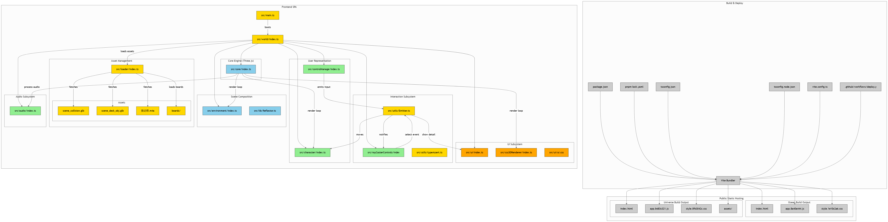

# 数字展览馆

### 
[https://github.com/Steve245270533/gallery](https://github.com/Steve245270533/gallery)

# AI Characters in Web Browser using ThreeJS and Reallusion Character Creator | Convai 3JS Tutorial
[https://www.youtube.com/watch?v=5tYyeXPo5vg](https://www.youtube.com/watch?v=5tYyeXPo5vg)

> 更新: 2025-05-03 23:38:14  
> 原文: <https://www.yuque.com/lixinsi/oyzgnh/tgr4rpy9y5cfqlb5>