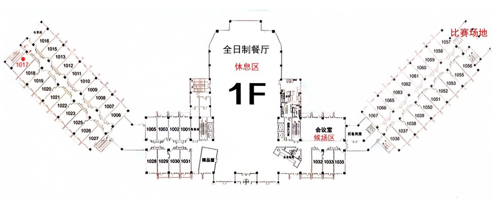
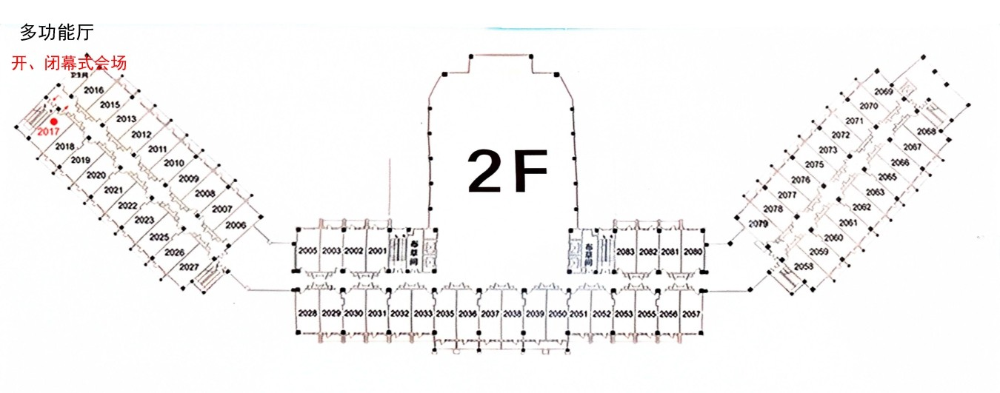
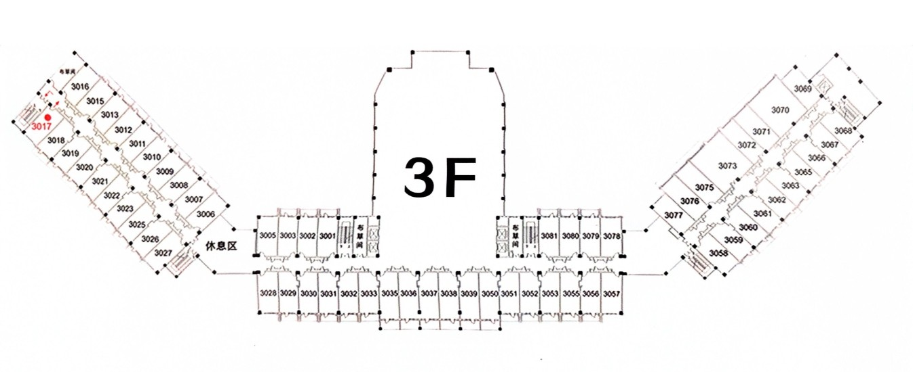
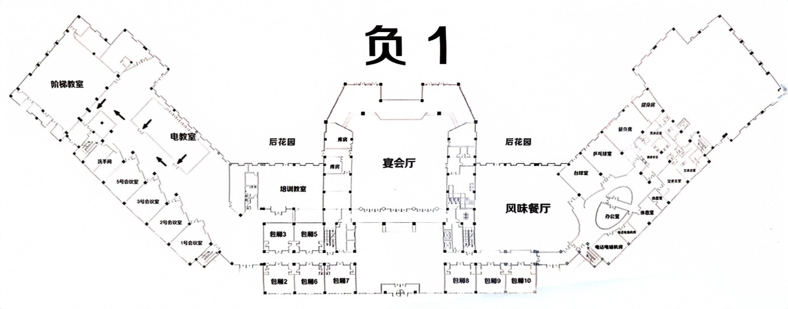
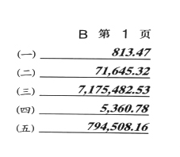
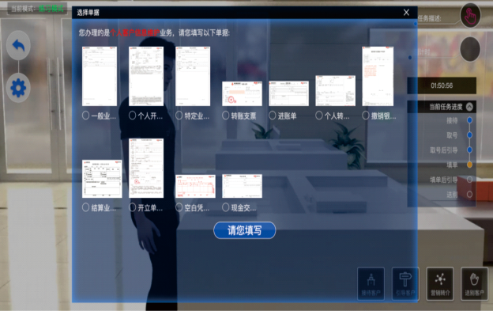

# 全国农信银行机构第二届职业技能大赛

大赛指南

[参赛须知	01](#_TOC_250016)

| 01 |
| ---: |
| 02 |
| 03 |
| 04 |
| 05 |
| 06 |
| 07 |
| 08 |
| 09 |
| 10 |
| 11 |
| 12 |
| 13 |
| 14 |
| 15 |
| 16 |
| 17 |
| 18 |

[大赛日程	02](#_TOC_250015)

[场地示意图	03](#_TOC_250014)

[赛场座位图	05](#_TOC_250013)

[大赛规则	06](#_TOC_250012)

[成绩计算与排名方法	12](#_TOC_250011)

[领队名单	13](#_TOC_250010)

[教练名单	14](#_TOC_250009)

[零售业务参赛选手名单	15](#_TOC_250008)

[对公业务参赛选手名单	17](#_TOC_250007)

[手工识假参赛选手名单	19](#_TOC_250006)

[传票算参赛选手名单	21](#_TOC_250005)

[厅堂服务参赛选手名单	23](#_TOC_250004)

[各参赛队联系员名单	25](#_TOC_250003)

[大赛组委会	26](#_TOC_250002)

[用餐安排	30](#_TOC_250001)

[天气预报	30](#_TOC_250000)

新疆农村信用社简介	31

**NO.1**

# 参赛须知

一、各参赛单位人员应于2023年10月11日下午16：00前到新疆区联社培训中心一层报到处报到，并领取比赛资料。

二、比赛时间：2023年10月12日（周四）-10月13日（周五）三、比赛地点：新疆区联社培训中心

四、参赛人员：每支参赛代表队组成成员共12人，其中领队1人、教练1人、选手10人。

五、各参赛代表队参赛选手应文明礼貌、遵守纪律、听从指挥、服从裁判，赛出风格，赛出水平。

六、所有参会人员须持组委会制作的证件方可进入赛场，不得携带个人手提包、挎包、背包等进入赛场。七、参赛选手应着正装或工装，佩戴统一的参赛证并持有效身份证件参加比赛。参赛选手座次凭抽签决  定，并按有关要求在指定位置就坐。 选手应根据检录要求按时在赛场入口处进行检录，进入赛场后须对号

入座，无故延时者视同弃赛。

八、比赛期间，赛场要保持肃静，严禁在赛场使用手机，工作人员不得随意走动，自觉维护良好的赛场秩序。场外人员不得大声喧哗，应将手机设置静音状态。未经总裁判长同意，一律不得进入赛场拍照、摄像等；对经批准进入赛场的禁止使用闪光灯和摄像灯。

九、竞赛过程中，如有疑问，参赛选手应举手示意，工作人员按照相关要求及时予以答疑。确因计算机软件或硬件故障致使操作无法进行，经确认同意后予以启动备用计算机。选手如对裁判工作有异议，应举手示意，由总裁判长帮助解决，参赛代表队若对赛事有异议，须由领队按规程提出书面申诉。竞赛裁判组调查后予以回复，不得当场质问或吵闹妨碍比赛正常进行。

十、参赛选手不得携带与竞赛无关的电子设备、通讯设备及其他相关资料与用品。不得以任何方式作弊，一经发现取消参赛资格并通报批评。

十一、会议期间请严格遵守中央八项规定精神，不得私下聚餐。严格落实中央和国家金融监督管理总局勤俭办会要求，不得铺张浪费。

### -01-

**NO.2**

# 大赛日程

| 日期 | 时间 | | 内容 | 地点 | 参加人员 |
| --- | --- | --- | --- | --- | --- |
| 2023年10 月11 日 | 下午 | 16:00-18:00 | 预备会 | 负一层 1 号会议室 | 教练、裁判 |
| | | 19:00-21:30 | 选手熟悉赛场 | 一层主赛场 | 全体选手 |
| 2023 年10 月12 日 | 上午 | 09:30-10:15 | 开幕式 | 二楼多功能厅（主会场）负一楼阶梯教室（分会场） | 全体人员 |
| | | 10:30 -11:10 | 零售业务竞赛 | 一层主赛场 | 该项参赛选手 |
| | | 11:20-12:00 | 对公业务竞赛 | 一层主赛场 | 该项参赛选手 |
| | | 11:00-12:00 （平行会） | 闭门会 | 负一层 1 号会议室 | 领队 |
| | 下午 | 14:20-17:50 | 理论考试 | 一层主赛场 | 全体选手 |
| 2023年10 月13 日 | 上午 | 10:00 -11:10 | 手工识假竞赛 | 一层主赛场 | 该项参赛选手 |
| | | 11:00-12:00 | 传票算竞赛 | 一层主赛场 | 该项参赛选手 |
| | | 12:10 -13:20 | 厅堂服务竞赛 | 一层主赛场 | 该项参赛选手 |
| | 下午 | 14:00-15:00 | 闭幕式彩排 | 二楼多功能厅 | 相关人员 |
| | | 15:00-16:00 | 闭幕式 | 二楼多功能厅（主会场）负一楼阶梯教）室（分会场） | 全体人员 |
| 备注：实际比赛安排若与计划比赛日程不一致，以总裁判长现场指令为准 | | | | | |

### -02-

**NO.3**

# 场地示意图

##### 1楼	前台、客房
##### 比赛场地、候场区、休息区
##### 2楼	客房
##### 开、闭幕式会场

### -03-

##### 3楼	客房
##### 负1楼	分会场、训练场地、预备会会议室 领队、教练、工作人员、选手用餐区

训练场地

预备会会议室闭门会会议室

采访间

### -04-

**NO.4**

# 赛场座位图

## 01	02
出口

## 06	07
## 03	04	05

## 08	09	10

## 11	12	13	14	15

## 16	17	18	19	20

## 21	22	23	24	25

## 26	27	28	29	30

## 31	32	33	34	35

## 36	37	38	39	40

## 41	42	43	44	45
入口

## 46

工作用机

47

工作用机

48

工作用机

备用机

工作用机

备用机

工作用机

### -05-

**NO.5**

##### 一、理论考试
# 大赛规则

1. 竞赛分值：100分。

1. 竞赛时间：30分钟。
2. 评分标准：比赛环节成绩评定由系统自动评分，题型为单选题、多选题、判断题，共160道考题，其中单选80题（每题0.5分）、多选40题（每题1分）、判断40题（每题0.5分）,多选题答案少选、多选或选错均不计分。竞赛提前完成的可得奖励分（在全部正确的基础上，每提前1秒奖励0.01分）。比赛中若出现分数相同者，以提交时间靠前者排名靠前。
3. 项目任务：主要考核民法典、中国人民银行法、商业银行法、银行业监督管理办法等相关法条，以及反洗钱管理、司法查冻扣管理、现金管理、账户管理和支付结算管理等基础知识。结合相关文件形成理论考试题库，正式比赛中理论考试题目从理论考试题库中随机抽取。
4. 操作流程：
5. 选手提前进入考场，按照提前发放的选手账号和密码登录竞赛平台，点击理论考试图标后，系统进入倒计时界面；
6. 倒计时为“0”时自行开始答题；
7. 提前完成的选手可以提前“提交”。比赛时间到，系统会自动“提交”。

##### 二、零售业务赛项
1. 竞赛分值：100分。
2. 竞赛时间：30分钟。
3. 评分标准：竞赛环节成绩评定由计算机系统自动评分，在全部正确的基础上，每提前提交1秒奖励0.01分，分数相同者根据系统采集的提交时间决定，提交时间靠前则排名在前。
4. 项目任务：零售业务操作包括通用业务、借记卡业务、储蓄业务、个人贷款业务、信用卡业务和农信银支付业务等。具体如下表所示：

| **序号** | **竞赛任务** | **具体内容** |
| --- | --- | --- |
| 1 | 通用业务 | 凭证出库、换存单、密码修改、凭证挂失与解挂、账户销户、凭证入库、现金入库 |
| 2 | 储蓄业务 | 客户管理、普通活期、零存整取、整存零取、存本取息、通知存款 |
| 3 | 借记卡业务 | 客户管理、借记卡活期、借记卡整存整取、借记卡零存整取、借记卡定活两便、借记卡通知存款 |
| 4 | 个人贷款业务 | 个人贷款合同维护、个人贷款发放、提前全部还款 |
| 5 | 信用卡业务 | 激活信用卡、柜面缴款、预借现金 |
| 6 | 支付结算业务 | 汇兑来账、汇兑往账 |
| 7 | 农信银支付业务 | 个人账户通存、个人账户通兑、电子汇兑、银行汇票 |

### -06-

1. 操作流程：
2. 选手提前进入考场，按照提前发放的选手账号和密码登录竞赛系统，点击零售业务图标后，系统进入倒计时界面。
3. 倒计时为“0”时，开始根据赛题进行零售业务操作。
4. 提前完成的选手可以提前“提交”。比赛时间到，系统将自动“提交”。

##### 三、对公业务赛项
1. 竞赛分值：100分。
2. 竞赛时间：30分钟。
3. 评分标准：竞赛环节成绩评定由系统自动评分，在全部正确的基础上，每提前提交1秒奖励0.01分，分数相同者根据系统采集的提交时间决定，提交时间靠前则排名靠前。
4. 项目任务：对公业务操作包括对公贷款业务、公司存款业务、结算业务、联行业务、代理业务、农信银支付业务等。具体如下表所示：

| **序号** | **竞赛任务** | **具体内容** |
| --- | --- | --- |
| 1 | 通用业务 | 凭证出库、支票出售、支票挂失与解挂、凭证入库、现金入库 |
| 2 | 公司存款业务 | 新开公司客户号、新开公司存款账户、现金存款、现金取款、新 开户现金存款、新开户转账存款、部分提取转账 |
| 3 | 贷款综合业务 | 新增贷款合同、贷款发放、部分还贷、贷款展期 |
| 4 | 票据业务 | 银行承兑汇票承兑、银行承兑汇票注销、银行承兑汇票到期付款 |
| 5 | 支付结算业务 | 同城提出代付、同城提出代收、汇兑来账、汇兑往账 |
| 6 | 代理业务 | 代理合同管理、代理批量管理、批量托收、批量托付 |
| 7 | 农信银支付业务 | 对公账户通存、电子汇兑、银行汇票 |

1. 操作流程：
2. 选手提前进入考场，按照提前发放的选手账号和密码登录竞赛系统，点击对公业务图标后，系统进入倒计时界面。
3. 倒计时为“0”时，开始根据赛题进行对公业务操作。
4. 提前完成的选手可以提前“提交”。比赛时间到，系统将自动“提交”。

###### 四、手工识假赛项
1. 竞赛分值：100分。
2. 竞赛时间：5分钟。
3. 竞赛任务：识假、点钞、扎把、盖章。
4. 评分标准：
5. 本项目由现场裁判按规则进行评分。现场评分分数相同者，根据系统采集提交时间决定排名顺序，提交时间靠前则排名靠前；

### -07-

1. 每挑错一张假币扣10分，漏挑一张假币扣10分；
2. 现钞清点错误的，每把扣5分；
3. 未捆扎或捆扎不符合要求的每把扣1分。扎把位置在现钞二分之一或三分之一处，扎把方式不限。捆扎不符合要求分为三种情况：一是散把或能自然抽张；二是扎把过紧呈船型；三是成把券未墩齐，露头部分上下错开超过5毫米。
4. 未盖章或盖章不符合要求的每把扣1分。印章必须盖在扎把腰条侧面（任一侧面均可）。盖章不符合要求分为两种情况：一是盖章未盖在指定位置；二是盖章不清晰，不能分辨文字内容。
5. 点钞指法不符合要求的，每把扣10分。参赛选手采用单指单张指法进行点钞，不准串用单指双张、单指多张、多指多张等指法等。
6. 比赛不计负分，分数扣完为止，负分计为“0”分。
7. 竞赛流程：
8. 选手提前进入考场，按照提前发放的选手账号和密码登录竞赛平台，点击手工识假点钞赛项图标后，系统进入倒计时界面。期间，选手要将竞赛用钞从密封袋取出并放置于固定位置，但不得抓钞。剩余时间可以做摆放用具、裁剪腰条等准备工作。
9. 倒计时为“0”时，选手方可开始识假操作；倒计时未结束提前拿取现钞的，按照作弊处理，本项目记“0”分。
10. 参赛选手在5分钟内，从500张散把真钞和10-15张假币中，将假币全部挑剔出放置于桌面上。
11. 在挑剔假币的同时，选手需对剩余现金真钞进行整点，每100张进行重新扎把、盖章。
12. 如选手在比赛结束前认为已经挑出所有假币并完成清点、扎把、记数、盖章程序的，可以提前点击“提交”。比赛时间到，系统将自动“提交”。
13. “提交”后选手应立即举手并终止比赛，不得再接触现金，否则算违规操作，本项目记“0”分。
14. 提前完成比赛，识假、点钞完全正确的选手，每提前1秒加0.1分，最高加分值为20分；若出现任何扣分点，提前完成比赛节省的时间不加分。
15. 比赛结束后，裁判现场评分并填写“成绩确认单”，经选手、裁判双方签字确认后，交裁判组汇总。
16. 注意事项：
17. 参赛选手在开赛前10分钟统一入场，对号入座。
18. 本次竞赛除项目规则规定的自备用品外，参赛选手不得自行携带钞条盒、防滑贴等用品，不得携带与竞赛无关的电子设备、通讯设备及其他相关资料，一经发现取消其比赛资格。

###### 五、传票算赛项
1. 竞赛分值：100分。
2. 竞赛时间：10分钟。
3. 评分标准：该项目采用计算机系统自动评分，按正确答案数计分，选手每提交一组正确数字可得5分，提交  不正确的则不得分；竞赛提前完成的选手可得奖励分（在全部正确的基础上，每提前1秒奖励0.01分），分数相同  者根据系统采集的提交时间决定，提交时间靠前则排名靠前。传票算赛项选手拥有2次机会，取得分高的计入排名。比赛禁止选手心算累加后录入数据，一经发现选手成绩按0分计算。
4. 项目任务：汇总票据数值、录入汇总票据数值、提交结果。
5. 传票说明：

练习和比赛使用五行式百张传票（手写体），共十本，编号分别为(A)、(B)、(C)、(D)、(E)、(F)、(G)、(H)、(I)、(J)。每张传票上各印有编号为（一）、（二）、（三）、（四）、（五）的五排4-9位数字；传票右上角字符表示传票本编号及其页码。传票样式如图所示：

### -08-

操作流程

    1. 选手提前进入考场，按照提前发放的选手账号和密码登录竞赛平台，点击传票算赛项图标后，系统进入倒计时界面。
    2. 倒计时结束后，系统随机在十本传票中选择四本，每本选择页码连续的20页，每本传票连续20页排序号相同的数字为一组，共20组数。选手10分钟翻打20组数（将每组20个数字相加），并按“凭证汇总结果 提交表”指定的传票编号和页码顺序将每组数字计算结果填入表中提交。选手无需填写千分位号和小数点， 计算结果小数点后数字为“ 0” 时需  要补“0”。竞赛平台中“凭证汇总结果提交表” 样式如下（ 比赛时的 编号和页码范围由系统随机指定）：

| 编号和页码范围 | 数字顺序号 | 汇总结果 | | | | | | | | |
| --- | --- | --- | --- | --- | --- | --- | --- | --- | --- | --- |
| (E)第 80-99 页 | （一） | | | | | | | | | |
| | （二） | | | | | | | | | |
| | （三） | | | | | | | | | |
| | （四） | | | | | | | | | |
| | （五） | | | | | | | | | |
| (G)第 2-21 页 | （一） | | | | | | | | | |
| | （二） | | | | | | | | | |
| | （三） | | | | | | | | | |
| | （四） | | | | | | | | | |
| | （五） | | | | | | | | | |
| (H)第 62-81 页 | （一） | | | | | | | | | |
| | （二） | | | | | | | | | |
| | （三） | | | | | | | | | |
| | （四） | | | | | | | | | |
| | （五） | | | | | | | | | |
| (J)第 10-29 页 | （一） | | | | | | | | | |
| | （二） | | | | | | | | | |
| | （三） | | | | | | | | | |
| | （四） | | | | | | | | | |
| | （五） | | | | | | | | | |

1. 提前完成的选手可以提前“提交”。比赛时间到，系统将自动“提交”。

六、厅堂服务

1. 竞赛分值：100分。
2. 竞赛时间：60分钟。
3. 评分标准：知识竞赛在技术公司提供的平台上完成，成绩由系统自动评分。分数相同者，以用时短者排名靠前。
4. 项目任务：包含客户引导与分流、客户问询处理、单据填写、假币鉴别、残/污损币的兑换、异议及投诉处理、签名与盖章、营销转介等日常厅堂服务业务技能知识。

### -09-

1. 操作流程：
2. 选手按照比赛前发放的用户名和密码登陆系统，选择对应内容考试，图标至倒计时界面。
3. 倒计时为“0”时自行开始业务操作；
4. 提前完成的选手可以提前“提交”。比赛时间到，系统将自动“提交”。 6.操作系统界面

1. 竞赛考核任务说明（样题）

任务1：客户分流与引导

任务说明：两个客户一起进入厅堂，一个存款 1 万，一个存款 6.85 万，大堂经理根据厅堂客流情况及业务情况完成引导分流。

任务2：客户询问/服务处理

任务说明：客户提出质询问题，询问存款 68500 元需要带身份证吗？ 根据你所掌握的知识完成接待处理。任务3：单据填写与审核

任务说明：客户来网点办理个人开户业务。根据客户提出的需要办理的具体业务，选择合适的单据进行正确填写。

### -10-

任务4：柜员资料收取

任务说明：客户来网点办理个人开户业务，根据客户的具体业务描述，选择合适的单据、证件、介质及其他需提交的材料。

任务5：残/污损币的兑换

任务说明：客户来网点办理个人现金存款业务，收取的客户残损币与污损币的现金，根据你的学习进行金额兑换。

任务6：假币的鉴别

任务说明：柜员办理现金存款时收取到 3 张疑似假币，根据你的学习进行真假币的鉴别。任务7：异议及投诉处理

任务说明：正值中午休息时间，柜口减少，客户前面只有4 人，但是有人插队，于是客户在现场与插队的人吵起来了，作为大堂经理请你妥善处理。

任务8：签名与盖章

任务说明：客户填写单据后未签字给大堂经理审查，作为大堂经理，你能否正确引导客户签名。任务9：营销转介

任务说明：客户办理完成大额存款业务后，如何根据客户的实际情况进行营销转介。任务10：有权机关查冻扣处理

任务说明：市人民法院两名工作人员来我行办理有权机关查冻扣，大堂经理该如何提前预处理。任务11：客户情绪安抚

任务说明：当客户排队过久时，出现焦急、不耐烦的心态，厅堂人员合理安抚。任务12：上门服务

任务说明：客户出车祸，在家休养无法来网点办理业务，根据客户所面临的实际困难情况，提供便利的上门服务。

任务13：应急处理预案

任务说明：根据厅堂服务过程中可能遇到的紧急情况，如停电、火灾、抢劫，提供正确的应急预案。任务14：代客操作

任务说明：当遇到客户要求你代为操作某项业务时，能够正确判断该业务可否代理并妥善处理。任务15：风险识别

任务说明：当遇到不明客户神情怪异、举止不当，疑似伪冒办理业务，能否快速识别并妥善解决。

### -11-

**NO.6**

# 成绩计算与排名方法

##### 一、个人单项比赛排名方法

    1. 选手个人单项排名按成绩由高到低依次排列，成绩相同名次并列（个人单项不得出现并列第一名，需加赛最终决出胜负）。零售业务、对公业务、手工识假、传票算、厅堂服务单项排名单独计算，不与理论考试挂钩。
    2. 单项名次并列，下一名次按单项名次并列个数往后顺延，如：有两个并列第二名，则没有第三名，下一名为第四名，依此类推。
    3. 出现以下情况，如单项比赛失误、缺席、弃权、严重犯规被当场取消比赛成绩或事后经仲裁委员会裁定取消成绩的，该选手在该单项得分按0分计算。

##### 二、团体成绩排名方法

1. 团体成绩排名根据各代表队选手理论考试、零售业务、对公业务、手工识假、传票算、厅堂服务人均排名之和计算。排名之和少者在前。各赛项人均排名计算方法：理论考试人均排名为应参赛选手排名之和除以10；零售业务、对公业务、手工识假、传票算、厅堂服务赛项人均排名为各赛项应参赛选手排名之和除以2。如某赛项存有缺赛选手，缺赛选手排名按照“该赛项实际参赛人数+1”计算。
2. 如果两队或多队团体总分相同， 按取得单项名次靠前的个数排出名次，如：A、B两队团体总分相同，取得单项第一名多者名次排前；若取得单项第一名个数相同，则取得单项第二名多者名次排前，依此类推，直至排出团体名次。

### -12-

**NO.7**

# 领队名单

| 序号 | 参赛队 | 领队姓名 | 领队职务 |
| --- | --- | --- | --- |
| 1 | 河北 | 王河山 | 河北省联社党委副书记、副理事长 |
| 2 | 山西 | 马志宝 | 山西省联社工会主席 |
| 3 | 内蒙古 | 牛草宽 | 内蒙古区联社工会主席 |
| 4 | 吉林 | 陈亚洲 | 吉林省联社党委委员、副主任 |
| 5 | 江苏 | 谢 冰 | 江苏省联社运营管理部副总经理（正总经理级） |
| 6 | 浙江 | 周黎明 | 浙江农商联合银行党委委员、副行长 |
| 7 | 安徽 | 朱道荣 | 安徽省联社运行管理部总经理 |
| 8 | 江西 | 赵淑军 | 江西省联社党群工作部副主任、团委书记 |
| 9 | 河南 | 徐暖心 | 河南省联社运营服务部总经理 |
| 10 | 湖北 | 李维林 | 湖北省联社党委委员、副主任 |
| 11 | 湖南 | 王文芳 | 湖南省联社党委委员、副主任 |
| 12 | 广东 | 吴为民 | 广东省联社党委委员、副主任 |
| 13 | 广西 | 马 戌 | 广西区联社机关工会副主席 |
| 14 | 海南 | 严 辉 | 海南省联社工会主席 |
| 15 | 四川 | 贺 艳 | 四川省联社会计运营部副总经理 |
| 16 | 贵州 | 蒋继琼 | 贵州省联社运营管理部副总经理 |
| 17 | 云南 | 段 炜 | 云南省联社主任助理 |
| 18 | 陕西 | 鲁怡然 | 陕西省联社党委副书记 |
| 19 | 甘肃 | 周  | 甘肃省联社党委副书记、监事长、工会主席 |
| 20 | 青海 | 刘惠香 | 青海省联社运营管理部总经理 |
| 21 | 宁夏黄河 | 黄永革 | 宁夏黄河农商银行党委副书记、工会主席 |
| 22 | 新疆 | 王雨默 | 新疆区联社党委委员、副主任 |
| 23 | 陕西秦农 | 曹敏杰 | 陕西秦农农商银行工会主席 |
| 24 | 天津滨海 | 靳立明 | 天津滨海农商银行监事长 |

### -13-

**NO.8**

# 教练名单

| 序号 | 参赛队 | 领队姓名 | 领队职务 |
| --- | --- | --- | --- |
| 1 | 河北 | 石艳蕊 | 河北省联社培训中心主任 |
| 2 | 山西 | 陈隽恩 | 山西省联社运营管理部部长 |
| 3 | 内蒙古 | 赵学军 | 内蒙古自治区农村信用社联合社运营管理部总经理 |
| 4 | 吉林 | 张双双 | 吉林省联社运营管理部副总经理 |
| 5 | 江苏 | 郁 婷 | 江苏省联社运营管理部现金管理岗 |
| 6 | 浙江 | 赵 晖 | 浙江农商联合银行运营管理部总经理 |
| 7 | 安徽 | 方 华 | 安徽省联社运行管理部高级业务经理、综合科科长 |
| 8 | 江西 | 谢 譓 | 江西省联社党群工作群团服务科资深专员 |
| 9 | 河南 | 王迪迪 | 河南省联社运营服务部职员 |
| 10 | 湖北 | 罗德芬 | 湖北鄂州农商行运营服务部总经理 |
| 11 | 湖南 | 陈萍萍 | 湖南省联社运营管理部总经理 |
| 12 | 广东 | 黄 勇 | 广东佛山农商银行党委委员、监事长 |
| 13 | 广西 | 王春丽 | 广西区联社机关工会办科长 |
| 14 | 海南 | 许论池 | 海南省联社工会副主席 |
| 15 | 四川 | 李小军 | 四川省联社会计运营部网点管理科科长 |
| 16 | 贵州 | 程 诚 | 贵州省联社宣传群工部四级资深经理 |
| 17 | 云南 | 宋文斌 | 云南省联社运行管理部总经理 |
| 18 | 陕西 | 赵小成 | 陕西省联社会计运营部总经理 |
| 19 | 甘肃 | 王新刚 | 甘肃省联社工会副主席 |
| 20 | 青海 | 李清娟 | 青海省联社运营管理部综合岗 |
| 21 | 宁夏黄河 | 谢锦萍 | 宁夏黄河农村商业银行运行管理部副总经理 |
| 22 | 新疆 | 陶 钧 | 新疆农村信用社运营总监、运管管理部总经理 |
| 23 | 陕西秦农 | 张项赟 | 陕西秦农农商银行总行工会办公室主任 |
| 24 | 天津滨海 | 刘 强 | 天津滨海农商银行运营管理部总经理助理 |

### -14-

**NO.9**

# 零售业务参赛选手名单

| 序号 | 参赛队 | 选手姓名 | 选手职务 |
| --- | --- | --- | --- |
| 1 | 河北 | 董会静 | 唐山农商银行丰南支行柜员 |
| | | 李 昱 | 石家庄审计中心无极联社科员 |
| 2 | 山西 | 郭栋炜 | 山西黎城农商银行西井支行运营主管 |
| | | 郑森颢 | 长治潞州农商银行襄垣支行运营主管 |
| 3 | 内蒙古 | 赵 静 | 土左旗联社把什支行柜员 |
| | | 刘秀英 | 翁牛特农商银行解放营子支行委派会计 |
| 4 | 吉林 | 刘海彤 | 长春发展农商行光复路支行柜员 |
| | | 侯宇丹 | 长春发展农商行大经路支行柜员 |
| 5 | 江苏 | 韩 宇 | 沭阳农商行支行行长助理 |
| | | 赵宇阳 | 泗阳农商行柜员 |
| 6 | 浙江 | 吴 菁 | 东阳农商银行委派运营主管 |
| | | 陈宁宁 | 甬城农商银行大堂经理 |
| 7 | 安徽 | 李孟珺 | 太和农村商业银行主管会计 |
| | | 汪耀恒 | 屯溪农村商业银行客户经理 |
| 8 | 江西 | 李竹青 | 九江农商银行综合柜员 |
| | | 刘 苗 | 瑞金农商银行运营主管 |
| 9 | 河南 | 郑 亚 | 济源农商银行客户经理 |
| | | 高晓晓 | 清丰农商银行运营主管 |
| 10 | 湖北 | 杨 潇 | 鄂州农商银行红莲湖开发区支行柜员 |
| | | 谈雅兰 | 咸宁龙潭支行运营主管 |
| 11 | 湖南 | 彭 咪 | 长沙农商行柜员 |
| | | 钟小玲 | 星沙农商行柜员 |
| 12 | 广东 | 俞舒婷 | 佛山农商银行综合柜员 |
| | | 谭思琪 | 佛山农商银行集中作业中心业务授权岗 |

### -15-

| 序号 | 参赛队 | 选手姓名 | 选手职务 |
| --- | --- | --- | --- |
| 13 | 广西 | 黄映映 | 广西钦州市区农村信用合作联社镇中分社分社负责人 |
| | | 谢舒敏 | 广西南宁市区农村信用合作联社综合柜员 |
| 14 | 海南 | 陈 婷 | 会计 |
| | | 徐瑞程 | 综合柜员 |
| 15 | 四川 | 鲁 敏 | 凉山农商银行、运维岗 |
| | | 苏 芹 | 广汉农商银行、营业部综合柜员 |
| 16 | 贵州 | 陈跃跃 | 乌当农商银行碧海支行柜员 |
| | | 罗寒涛 | 黎平农商银行龙额支行客户经理 |
| 17 | 云南 | 刘成巧 | 麻栗坡农商行 |
| | | 张美娣 | 古城农商行 |
| 18 | 陕西 | 张 娇 | 凤祥农商行财务部科员 |
| | | 栾成杰 | 子长农商行网点会计主管 |
| 19 | 甘肃 | 张卫蓉 | 敦煌农商行员工 |
| | | 张晨宇 | 皋兰联社综合柜员 |
| 20 | 青海 | 童淑容 | 西宁农商银行营业部 |
| | | 李秀芳 | 大通农商银行东柳支行 |
| 21 | 宁夏黄河 | 王 蕾 | 平罗农村商业银行综合柜员 |
| | | 刘 茹 | 中卫农村商业银行会计主管 |
| 22 | 新疆 | 刘怡雯 | 昌吉农商银行 |
| | | 周丽娟 | 霍城农商银行 |
| 23 | 陕西秦农 | 包婉婷 | 未央支行桃园北路支行副行长 |
| | | 陈沙沙 | 莲湖支行北关支行综合柜员 |
| 24 | 天津滨海 | 武俊彦 | 天津滨海农商银行津南小站支行综合柜员 |
| | | 韩 瑞 | 天津滨海农商银行大港支行综合柜员 |

### -16-

**NO.10**

# 对公业务参赛选手名单

| 序号 | 参赛队 | 选手姓名 | 选手职务 |
| --- | --- | --- | --- |
| 1 | 河北 | 张世超 | 邢台审计中心临城农商银行支行行长 |
| | | 王雅丽 | 衡水审计中心景州农商银行客户经理 |
| 2 | 山西 | 裴东东 | 长治漳泽农商银行富村支行综合柜员 |
| | | 王 静 | 山西黎城农商银行营业部综合柜员 |
| 3 | 内蒙古 | 代 冉 | 林西农商银行业务管理部科员 |
| | | 薛 莉 | 元宝山农商银行营业部柜员 |
| 4 | 吉林 | 孙伟学 | 长春农商行内审部现场稽核岗 |
| | | 王瑞雪 | 长春发展农商行计划财务部科员 |
| 5 | 江苏 | 陈 帅 | 泗阳农商行柜员 |
| | | 潘岩松 | 宜兴农商行柜员 |
| 6 | 浙江 | 申屠佳佳 | 东阳农商银行委派运营主管 |
| | | 王凯丽 | 嵊州农商银行综合柜员 |
| 7 | 安徽 | 刘瑞敏 | 太和农村商业银行主管会计 |
| | | 刘梓晨 | 药都农村商业银行综合柜员 |
| 8 | 江西 | 任若嘉 | 宜丰农商银行客户经理 |
| | | 董 婷 | 九江农商银行审计部科员 |
| 9 | 河南 | 肖珊珊 | 新安农商银行支行副行长 |
| | | 杜君利 | 商都农商银行支行副行长 |
| 10 | 湖北 | 彭 肯 | 鄂州农商银行城东支行综合柜员 |
| | | 周 婧 | 鄂州农商银行城南支行综合柜员 |
| 11 | 湖南 | 许湘玮 | 株洲农商行柜员 |
| | | 刘 帅 | 星沙农商行柜员 |
| 12 | 广东 | 江 瑜 | 佛山农商银行集中作业中心业务审核岗 |
| | | 陈羽琪 | 佛山农商银行综合柜员 |

### -17-

| 序号 | 参赛队 | 选手姓名 | 选手职务 |
| --- | --- | --- | --- |
| 13 | 广西 | 凌铭泽 | 广西百色右江农合行客户经理 |
| | | 符敬青 | 广西北海市区农村信用合作联社法律合规部副总经理 |
| 14 | 海南 | 段志伟 | 综合柜员 |
| | | 黄国强 | 乡村振兴部客户经理 |
| 15 | 四川 | 张 慧 | 渠县农商银行、网点综合柜员 |
| | | 谢 臻 | 乐山农商银行、网点负责人 |
| 16 | 贵州 | 江中友 | 修文农商银行会展城支行柜员 |
| | | 刘凤君 | 开阳农信联社营业部会计 |
| 17 | 云南 | 康海韵 | 盘龙区联社 |
| | | 张 豪 | 呈贡区联社 |
| 18 | 陕西 | 王浩浩 | 吴堡农商行保卫部科员 |
| | | 吴昊波 | 渭城农商行网点会计主管 |
| 19 | 甘肃 | 杨媛媛 | 环县联社员工 |
| | | 刘 元 | 会宁农商行运营主管 |
| 20 | 青海 | 郭 旭 | 西宁农商银行团结桥支行 |
| | | 张 惠 | 刚察农商银行计划财务部 |
| 21 | 宁夏黄河 | 肖 杨 | 吴忠农村商业银行综合柜员 |
| | | 孟 芬 | 中卫农村商业银行综合柜员 |
| 22 | 新疆 | 邓 悦 | 天山农商银行 |
| | | 和珂珂 | 北屯农商银行 |
| 23 | 陕西秦农 | 刘怡然 | 雁塔支行综合管理部员工 |
| | | 黄 婧 | 高陵支行营业室副主任兼运营经理 |
| 24 | 天津滨海 | 张乐乐 | 天津滨海农商银行北辰双街支行综合柜员 |
| | | 左加健 | 天津滨海农商银行太平支行综合柜员 |

### -18-

**NO. 1**

# 手工识假参赛选手名单

| 序号 | 参赛队 | 选手姓名 | 选手职务 |
| --- | :--- | --- | --- |
| 1 | 河北 | 刘岚昆 | 唐山审计中心迁安农商银行柜员 |
| | | 贾卫华 | 衡水审计中心枣强农商银行柜员 |
| 2 | 山西 | 牛俊妍 | 山西永济农商银行郭李支行综合柜员 |
| | | 杨 俪 | 山西襄垣农商银行五阳分理处主任 |
| 3 | 内蒙古 | 王慧杰 | 科尔沁区联社审计部员工 |
| | | 余 洋 | 宁城农商银行头道营子支行柜员 |
| 4 | 吉林 | 刘美玲 | 长春农商行南阳路支行大堂主管 |
| | | 刘淑珍 | 延边农商行小营支行柜员 |
| 5 | 江苏 | 范 阳 | 南通农商行办事员 |
| | | 王慧敏 | 南通农商行柜员 |
| 6 | 浙江 | 张丽娜 | 杭州联合农商银行服务经理 |
| | | 李观祥 | 杭州联合农商银行服务经理 |
| 7 | 安徽 | 李全全 | 颍淮农商行运营管理部业务员 |
| | | 张贝贝 | 和县农商银行综合柜员 |
| 8 | 江西 | 姚 鹏 | 高安农商银行客户经理 |
| | | 欧阳巧园 | 安远农商银行客户经理 |
| 9 | 河南 | 何李娜 | 郑州农商银行运营主管 |
| | | 王 冰 | 洛阳农商银行综合柜员 |
| 10 | 湖北 | 张 楠 | 恩施农商行施州支行综合柜员 |
| | | 梁正铭 | 恩施农商行金桂支行客户经理 |
| 11 | 湖南 | 欧 燕 | 汉寿农商行柜员 |
| | | 龙 宇 | 长沙农商行柜面经理 |
| 12 | 广东 | 陈颖仪 | 佛山农商银行综合柜员 |
| | | 李洲良 | 佛山农商银行二级支行行长 |

### -19-

| 序号 | 参赛队 | 选手姓名 | 选手职务 |
| --- | :--- | --- | --- |
| 13 | 广西 | 李丽丽 | 广西融安农商行长安支行副行长 |
| | | 唐文燕 | 广西武鸣联社公司机构金融部副经理 |
| 14 | 海南 | 李宪稷 | 财务管理部副经理 |
| | | 颜惠芳 | 综合柜员 |
| 15 | 四川 | 艾薛岭 | 乐山农商银行、网点负责人 |
| | | 李婷婷 | 宣汉农商银行、网点综合柜员 |
| 16 | 贵州 | 杨 梅 | 贵阳农商银行龙王支行主办会计 |
| | | 宋 肖 | 遵义农商银行三岔支行会计 |
| 17 | 云南 | 杨姝琼 | 盘龙区联社 |
| | | 张格非 | 西山区联社 |
| 18 | 陕西 | 于 斌 | 汉阴农商行网点主任 |
| | | 杨瑞瑞 | 黄龙联社网点会计主管 |
| 19 | 甘肃 | 刘 阳 | 高台农商行运营主管 |
| | | 彭 桃 | 兰州农商行运营主管 |
| 20 | 青海 | 徐菊兰 | 海东农商银行市场营销部 |
| | | 王海兰 | 化隆农商银行群科新区支行 |
| 21 | 宁夏黄河 | 高 瑞 | 黄河农村商业银行会计主管 |
| | | 吴珊珊 | 黄河农村商业银行综合柜员 |
| 22 | 新疆 | 张斯瑶 | 昌吉农商银行 |
| | | 代雷馨 | 天山农商银行 |
| 23 | 陕西秦农 | 尚依菲 | 阎良支行胜利街支行综合柜员 |
| | | 侯冰冰 | 鄠邑支行营业室综合柜员 |
| 24 | 天津滨海 | 王 楠 | 天津滨海农商银行津南八里台支行综合柜员 |
| | | 张 萌 | 天津滨海农商银行营城支行综合柜员 |

### -20-

**NO.12**

# 传票算参赛选手名单

| 序号 | 参赛队 | 选手姓名 | 选手职务 |
| --- | :--- | --- | --- |
| 1 | 河北 | 李茂辕 | 唐山农商银行科员 |
| | | 王佳琦 | 承德审计中心平泉联社科员 |
| 2 | 山西 | 张 敏 | 山西侯马农商银行金源支行综合柜员 |
| | | 贾琦卉 | 山西潞城农商银行兴隆支行副行长 |
| 3 | 内蒙古 | 梁欢欢 | 宁城农商银行金融市场部科员 |
| | | 武丽丽 | 库伦农商银行审计部副经理 |
| 4 | 吉林 | 李 聪 | 九台农商行吉林大路支行会计主管 |
| | | 盛 杰 | 长春发展农商行营业部运营主管 |
| 5 | 江苏 | 刘文琦 | 泗阳农商行运营部总经理助理 |
| | | 王文佳 | 江阴农商行柜员 |
| 6 | 浙江 | 吴闪云 | 东阳农商银行委派运营主管 |
| | | 石子祥 | 永康农商银行综合柜员 |
| 7 | 安徽 | 张景灵 | 太湖农商行运行管理部业务员 |
| | | 边梦雨 | 药都农村商业银行综合柜员 |
| 8 | 江西 | 陈 向 | 南昌农商银行运营主管 |
| | | 胡毅娟 | 定南农商银行综合柜员 |
| 9 | 河南 | 王晓鹏 | 汝阳农商银行部门经理 |
| | | 李静静 | 济源农商银行综合柜员 |
| 10 | 湖北 | 汪 蕾 | 崇阳农商行运营服务部反洗钱专员 |
| | | 祝 宇 | 鄂州农商银行集中授权中心员工 |
| 11 | 湖南 | 谢荞羽 | 长沙农商行柜员 |
| | | 王洁玲 | 沅江农商行委派会计 |
| 12 | 广东 | 罗洁慧 | 佛山农商银行综合业务岗 |
| | | 胡燕琴 | 佛山农商银行社区营销总监 |

### -21-

| 序号 | 参赛队 | 选手姓名 | 选手职务 |
| :--- | :--- | --- | --- |
| 13 | 广西 | 韦 婷 | 广西南宁市区农村信用合作联社财会监督员 |
| | | 卢歆颜 | 广西隆安农商行财务会计部会计员 |
| 14 | 海南 | 王文雪 | 综合柜员 |
| | | 吴雪娇 | 综合柜员 |
| 15 | 四川 | 胡 利 | 资阳农商银行、网点负责人 |
| | | 胡 骥 | 丹棱农商银行、客户经理 |
| 16 | 贵州 | 王 瑜 | 盘县农信联社响水信用社客户经理 |
| | | 覃 轲 | 花溪农商银行石板支行主办会计 |
| 17 | 云南 | 许艳敏 | 安宁市联社 |
| | | 明 羽 | 思茅农商行 |
| 18 | 陕西 | 张敬洋 | 蒲城联社网点副主任 |
| | | 拓 莹 | 子洲农商行网点会计主管 |
| 19 | 甘肃 | 李 强 | 武都农合行综合柜员 |
| | | 安 娜 | 兰州农商行员工 |
| 20 | 青海 | 郭婷婷 | 西宁农商银行东部市场支行 |
| | | 林永珠 | 刚察农商银行计划财务部 |
| 21 | 宁夏黄河 | 陶燕妮 | 中卫农村商业银行会计主管 |
| | | 马 瑞 | 灵武农村商业银行副总经理 |
| 22 | 新疆 | 艾思琪 | 天山农商银行 |
| | | 徐华骏 | 库尔勒农商银行 |
| 23 | 陕西秦农 | 索 倩 | 航天支行杨庄支行运营经理 |
| | | 张 萍 | 临潼支行纸李支行运营经理 |
| 24 | 天津滨海 | 冯 清 | 天津滨海农商银行解放路支行综合柜员 |
| | | 纪萌萌 | 天津滨海农商银行和平支行运营管理岗 |

### -22-

**NO.13**

# 厅堂服务参赛选手名单

| 序号 | 参赛队 | 选手姓名 | 选手职务 |
| --- | :--- | --- | --- |
| 1 | 河北 | 刘玉苓 | 沧州审计中心献县联社委派会计 |
| | | 董乐明 | 邢台农商银行委派会计 |
| 2 | 山西 | 李 茹 | 晋城农商银行北城支行客户经理 |
| | | 申 杨 | 山西黎城农商银行营业部大堂经理 |
| 3 | 内蒙古 | 王彩霞 | 商都县联社办公室副主任 |
| | | 张 瑜 | 科左后旗联社新风信用社柜员 |
| 4 | 吉林 | 杨 帆 | 长春发展农商行前进大街支行运营主管 |
| | | 于俊卓 | 长春发展农商行营业部柜员 |
| 5 | 江苏 | 吴一凡 | 宜兴农商行运营主管 |
| | | 邱 钰 | 南通农商行运营主管 |
| 6 | 浙江 | 陆巧玲 | 东阳农商银行综合柜员 |
| | | 周 韡 | 杭州联合农商银行运营助理 |
| 7 | 安徽 | 王凯莉 | 颍淮农村商业银行大堂经理 |
| | | 曹春霞 | 安庆农村商业银行内勤主任 |
| 8 | 江西 | 邓丽丽 | 新余农商银行运营主管 |
| | | 李 霞 | 宜丰农商银行信贷管理部科员 |
| 9 | 河南 | 古安然 | 方城农信联社运营主管 |
| | | 张 芳 | 获嘉农商银行支行副行长 |
| 10 | 湖北 | 王杉根 | 鄂州农商银行葛洪支行综合柜员 |
| | | 匡宏扬 | 鄂州农商银行鄂城区支行综合柜员 |
| 11 | 湖南 | 杨 楠 | 桃源农商行合规运营部员工 |
| | | 刘 茜 | 株洲珠江农商行天台路支行行长助理 |
| 12 | 广东 | 何淑琳 | 佛山农商银行非金融业务管理岗 |
| | | 陈燕婷 | 佛山农商银行综合柜员 |

### -23-

| 序号 | 参赛队 | 选手姓名 | 选手职务 |
| --- | :--- | --- | --- |
| 13 | 广西 | 罗华荣 | 广西武鸣联社三农部副经理 |
| | | 陈丽羽 | 广西邕宁联社柜员 |
| 14 | 海南 | 王尉玲 | 综合柜员 |
| | | 王路妹 | 综合柜员 |
| 15 | 四川 | 李汶昱 | 凉山农商银行、营业部综合柜员 |
| | | 赵雪鸿 | 达州农商银行、授权岗 |
| 16 | 贵州 | 卢慧玲 | 贵阳农商银行蒲江支行柜员 |
| | | 王 玲 | 安龙农商银行桥支行会计运营主管 |
| 17 | 云南 | 王 颖 | 盘龙区联社 |
| | | 谷雨霖 | 宜良县联社 |
| 18 | 陕西 | 曹 静 | 蒲城联社网点会计主管 |
| | | 高铭霞 | 榆林农商行网点会计主管 |
| 19 | 甘肃 | 张 丹 | 省联社客服中心副经理 |
| | | 段玉鹏 | 靖远农商银行运营主管 |
| 20 | 青海 | 马明义 | 西宁农商银行东部市场支行 |
| | | 李彩霞 | 湟源农商银行市场营销部 |
| 21 | 宁夏黄河 | 周 丹 | 灵武农村商业银行会计主管 |
| | | 苏虹虹 | 同心农村商业银行会计主管 |
| 22 | 新疆 | 李懿萱 | 昌吉农商银行 |
| | | 赵雨薇 | 吉木萨尔农商银行 |
| 23 | 陕西秦农 | 赵 彤 | 临潼支行人民西路支行综合柜员 |
| | | 余亚楠 | 临潼支行何寨支行综合柜员 |
| 24 | 天津滨海 | 李 菲 | 天津滨海农商银行广开支行综合柜员 |
| | | 侯卉芃 | 天津滨海农商银行和平贵阳路支行综合柜员 |

### -24-

**NO.14**

# 各参赛队联系员名单

| 序号 | 参赛队 | 姓名 | 职务 | 电话 |
| --- | --- | --- | --- | --- |
| 1 | 河北 | 荆 志 | 培训中心员工 | 19803116088 |
| 2 | 山西 | 李 霞 | 山西省联社运营管理部主任科员 | 18503516900 |
| 3 | 内蒙古 | 李东峰 | 运营管理部主管 | 18686059331 |
| 4 | 吉林 | 张双双 | 省联社运营管理部副总经理 | 18686500390 |
| 5 | 江苏 | 郁 婷 | 江苏省联社运营管理部现金管理岗 | 13770504830 |
| 6 | 浙江 | 张羽中 | 运营管理部业务主管 | 18334337500 |
| 7 | 安徽 | 方 华 | 安徽省联社运行管理部高级业务经理、综合科科 | 13637079399 |
| 8 | 江西 | 谢 譓 | 长 省联社党群工作群团服务科资深专员 | 18079795927 |
| 9 | 河南 | 王迪迪 | 运营服务部职员 | 18538278557 |
| 10 | 湖北 | 李智勇 | 省联社运营服务部综合室经理 | 18672755996 |
| 11 | 湖南 | 裴荣锋 | 运营管理部 | 13574118533 |
| 12 | 广东 | 文栽禾 | 佛山农商银行工会办公室主任 | 13929910754 |
| 13 | 广西 | 王春丽 | 机关工会办科长 | 13877165997 |
| 14 | 海南 | 李 新 | 工会主管 | 13307623785 |
| 15 | 四川 | 李小军 | 会计运营部网点管理科科长 | 13438123879 |
| 16 | 贵州 | 杨 柳 | 运营管理部业务骨干 | 15685286618 |
| 17 | 云南 | 杨 荔 | 省联社运行管理部 | 13987637299 |
| 18 | 陕西 | 徐 新 | 陕西省联社会计运营部 | 15829200875 |
| 19 | 甘肃 | 安 娜 | 兰州农商行员工 | 17789618871 |
| 20 | 青海 | 李清娟 | 青海省联社运营管理部综合岗 | 18697198399 |
| 21 | 宁夏黄河 | 谢锦萍 | 黄河农村商业银行运行管理部副总经理 | 13895490228 |
| 22 | 新疆 | 盛 梅 | 新疆农村信用社运营管理部业务副经理 | 18935991717 |
| 23 | 陕西秦农 | 马明燕 | 秦农银行总行工会办公室员工 | 13609281698 |
| 24 | 天津滨海 | 田丽香 | 天津滨海农商银行运营管理部团队经理 | 15102206936 |

### -25-

**NO.15**

# 大赛组委会

## 大赛组委会

主 任： 朱进元	中国农村金融杂志社党委书记、社长

中国银保传媒党委书记、董事长中农金30人论坛主席

轮值主任： 郑育峰 新疆区联社党委书记

副 主 任： 刘翔玲 中国农村金融杂志社党委委员、副总编辑申 琪 中国金融工委全国委员会经济技术部部长白雪原 新疆区联社党委副书记、主任

王河山 河北省联社党委副书记、副理事长段 炜 云南省联社主任助理

鲁怡然 陕西省联社党委副书记

周 㼆 甘肃省联社党委副书记、监事长、工会主席黄永革 宁夏黄河农商银行党委副书记、工会主席 陈亚洲 吉林省联社党委委员、副主任

周黎明 浙江农商联合银行党委委员、副行长李维林 湖北省联社党委委员、副主任

王文芳 湖南省联社党委委员、副主任吴为民 广东省联社党委委员、副主任靳立明 天津滨海农商银行监事长

马志宝 山西省联社工会主席 牛草宽 内蒙古区联社工会主席严 辉 海南省联社工会主席

曹敏杰 陕西秦农农商银行工会主席委	员： 胡晓宁 中国农村金融杂志社顾问

王  汉 中国农村金融杂志社30人论坛办公室主任

谢 冰 江苏省联社运营管理部副总经理（ 正总经理级）朱道荣 安徽省联社运行管理部总经理

徐暖心 河南省联社运营服务部总经理刘惠香 青海省联社运营管理部总经理

赵淑军 江西省联社党群工作部副主任、团委书记马 戌 广西区联社机关工会副主席

贺 艳 四川省联社会计运营部副总经理蒋继琼 贵州省联社运营管理部副总经理

### -26-

## 大赛仲裁委员会
| 主 | 任： 刘翔玲 | 中国农村金融杂志社党委委员、副总编辑 |
| :--- | ---: | :--- |
| | 王雨默 | 新疆区联社党委委员、副主任 |
| 副主 | 任： 胡晓宁 | 中国农村金融杂志社顾问 |
| | 周黎明 | 浙江农商联合银行党委委员、副行长 |
| | 吴为民 | 广东省联社党委委员、副主任 |
| | 王彦楠 | 云南省联社首席信息官 |
| 委 | 员： 陶  钧 | 新疆区联社运营总监、运管管理部总经理 |
| | 陈隽恩 | 山西省联社运营管理部部长 |
| | 谢 冰 | 江苏省联社运营管理部副总经理（ 正总经理级） |
| | 朱道荣 | 安徽省联社运行管理部总经理 |
| | 徐暖心 | 河南省联社运营服务部总经理 |

## 大赛组委会办公室
主  任： 胡晓宁	中国农村金融杂志社顾问

王雨默	新疆区联社党委委员、副主任

副主任： 王 汉	 中国农村金融杂志社30人论坛办公室主任 谭海燕	中国农村金融杂志社30人论坛办公室副主任陶 钧	 新疆区联社运营总监、运营管理部总经理 王彦军	 新疆区联社工会主席

李江峰	新疆区联社群众工作部总经理

田 戈	新疆区联社办公室（ 党委办公室宣传部、理事会办公室） 主任夏华东	 新疆区联社计划财会部总经理

董朝辉	新疆区联社审计部总经理

周 军	新疆区联社安全保卫部总经理王 魁	 新疆区联社科技部总经理

王海勇	新疆区联社培训管理部（ 后勤服务中心） 总经理

#### 裁判组
总 裁 判 长： 胡晓宁	中国农村金融杂志社顾问

副总裁判长： 罗 嘉	深圳典阅管理科技咨询有限公司市场部总监裁 判 员： 肖龙飞 河北省联社培训中心员工

### -27-

李成玉 山西省联社工会办公室

李东峰 内蒙古区联社运营管理部主管 张双双 吉林省联社运营管理部副总经理

郁 婷 江苏省联社运营管理部现金管理岗 赵 晖 浙江农商联合银行运营管理部总经理王庆体 安徽颍东农商银行副行长

谢 譓 江西省联社党群工作群团服务科资深专员裴淑敏 河南省联社运营服务部

罗德芬 湖北鄂州农商银行运营服务部总经理裴荣锋 湖南省联社运营管理部

李钻英 广东佛山农商银行运营管理部副总经理马 戌 广西区联社机关工会副主席

许论池 海南省联社工会副主席

李小军 四川省联社会计运营部网点管理科科长杨 柳 贵州省联社运营管理部业务骨干

杨	荔 云南省联社运行管理部

杨梦妮 陕西省澄城县联社网点副主任 李 强 甘肃武都农村合作银行综合柜员李清娟 青海省联社运营管理部综合岗

谢锦萍 宁夏黄河农商银行运行管理部副总经理盛 梅 新疆区联社运营管理部业务副经理

保 洋 陕西秦农农商银行运营管理部数字转型项目办员工刘 强 天津滨海农商银行运营管理部总经理助理

#### 技术保障组
组	长： 王 魁 新疆区联社科技部总经理

罗 嘉 深圳典阅管理科技咨询有限公司市场部总监副 组 长： 张智勇 新疆区联社科技部总经理助理

周 坤 深圳典阅管理科技咨询有限公司技术经理

成	员： 欧阳旭东 中国农村金融杂志社30人论坛办公室高级经理胡永祥 新疆区联社科技部业务副经理

成后剑 新疆区联社科技部员工 陈友军 新疆区联社科技部员工 马小博 新疆区联社社科技部员工

李鑫司 深圳典阅管理科技咨询有限公司

### -28-

#### 会务组
周祖峰 深圳典阅管理科技咨询有限公司陈建武 深圳典阅管理科技咨询有限公司龙鹏飞 深圳典阅管理科技咨询有限公司

组 长： 王	汉 中国农村金融杂志社30人论坛办公室主任

田	戈 新疆区联社办公室（ 党委办公室宣传部、理事会办公室） 主任副组长： 谭海燕 中国农村金融杂志社30人论坛办公室副主任

周  军 新疆区联社安全保卫部总经理

刘大为 新疆区联社办公室（ 党委办公室 宣传部、理事会办公室） 副主任成 员： 汪佳蕊 中国农村金融杂志社30人论坛办公室高级经理

高晓晴 中国农村金融杂志社30人论坛办公室主管

李新辉 新疆区联社运营管理部副总经理

尼加提· 买买提 新疆区联社群众工作部副总经理

克尤木 新疆区联社培训管理部（ 后勤服务中心） 副总经理

吴国勋 新疆区联社办公室（ 党委办公室 宣传部、理事会办公室） 业务副经理饶 强 新疆区联社办公室（ 党委办公室 宣传部、理事会办公室） 业务副经理范丽艳 新疆区联社运营管理部专业技术二级

盛 梅 新疆区联社运营管理部业务副经理陈	响 新疆区联社运营管理部业务副经理

沙娜娃· 海尼 新疆区联社运营管理部业务副经理银戈旭 新疆区联社运营管理部业务副经理

丁	旭 新疆区联社运营管理部业务副经理汪倬谊 新疆区联社运营管理部员工

陈 颖 新疆区联社群众工作部业务经理郭新芸 新疆区联社群众工作部业务经理孙启勇 新疆区联社群众工作部业务经理雷志忠 新疆区联社安全保卫部业务经理雷鹏军 新疆区联社安全保卫部业务经理

夏红岩 新疆天山农商银行运营管理部副总经理

高怀安 新疆区联社培训管理部（ 后勤服务中心） 专业技术四级纪 爽 新疆区联社培训管理部（ 后勤服务中心） 业务副经理

### -29-

**NO.16**

# 用餐安排

早餐:07:30-09:30午餐:12:30-14:30晚餐:18:30-20:30

负一楼宴会厅（参赛选手用餐区）

负一楼风味餐厅（领队、教练、各省市工作人员用餐区）

**NO.17**

# 天气预报

10月11日：晴 26℃-9℃

10月12日：晴 21℃-9℃

10月13日：小雨 18℃-4℃

### -30-

**NO.18	**新疆农村信用社简介

#### 新疆农村信用社在全疆共有83家行社、1208个营业网点及9123个普惠金融服务站，是新疆网点最多、金融服务覆盖最广、市场份额最大的金融机构。
#### 截至2023年6月末，新疆农村信用社资产总额6672亿元，其中各项贷款余额4327亿元，各项存款余额5307亿元。资产规模、存贷款市场份额、经营利润、税收贡献度及对实体经济、民营企业、小微企业的支持力度连续多年位居全区银行业首位。
#### “十四五”期间，新疆农村信用社将统筹推进改革、化险和经营工作，做到质量、效益、速度三者平衡发展，努力建设成为服务乡村振兴的主办银行、支持小微企业和民营经济的主要银行、服务地方经济发展和“八大产业集群”建设的主力银行，对自治区经济社会发展的贡献和支撑起到更加重要的作用。

### -31-

### -32-

中国农村金融杂志社视频号

中国银行保险报官方微信号

中国银行保险报视频号

新疆农信微信订阅号

中国农村金融杂志社官方微信号

新疆农信微信服务号

> 更新: 2025-07-13 09:17:30  
> 原文: <https://www.yuque.com/lixinsi/zxlv4e/yv7ygpb16osidxzm>