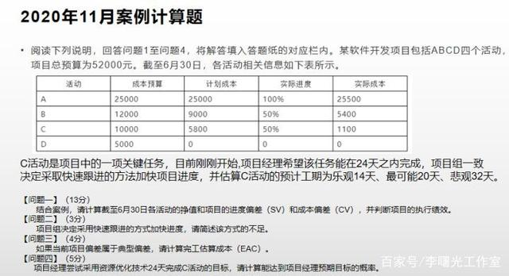
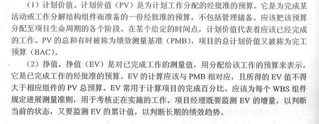
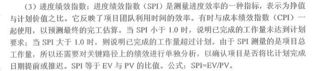

# 案例



```markdown
sv进度偏差
cv成本偏差
spi（进度绩效指数）大于或者小于或者等于          进度超前、落后、与计划相符
pv是计划是预算
ev是挣值
```



               


> 更新: 2025-06-27 10:01:19  
> 原文: <https://www.yuque.com/lixinsi/ygk31p/copmgf>