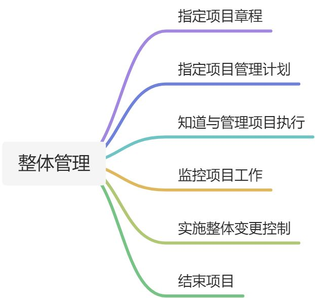

# 论文范文

# 1.整体管理11
## 摘要
2016年5月，我作为项目经理参与了某医院的医院信息系统管理项目的建设，该项目总投资人民币600万元整，建设工期为1年，通过该项目的建设，帮助医院实现了全方位，全对象，全过程的总体目标，实现了医院办公的无纸化，无片化。该系统以财务信息，病人信息，物资信息为主线，通过对信息的搜集，存储，传递，统计，分析，综合查询，报表输出和信息共享，为医院领导及各部门管理人员提供了全面，精确地各种数据，本系统包括6大板块，门诊管理系统，住院管理系统，药房管理系统，药库管理系统，院长查询系统和系统管理系统，本项目于2017年5月通过了业主方的验收，赢得了客户好评，本文以该项目为列，结合本人项目经验，讨论信息系统项目建设中的整体管理，主要从一下几个方面进行阐述：制定项目章程，编制项目管理计划，指导与管理项目执行，监控项目工作，变更管理，项目收尾。

```markdown
xx年xx日期，我作为项目经理参与了xx信息化项目的建设，该项目总投资xx万元，建设工期为x年，通过该项目
的建设，帮助xx实现了全方位，全对象，全过程的总体目标，实现了xx办公的无纸化，无片化，信息化。该系统
以财务信息，病人信息，物资信息为主线，通过对信息系统的搜集，存储，传递，统计，分析，综合查询，报表
输出和信息共享，为医院领导及各部门管理人员提供了全面，精准的各种数据，本系统包括6大板块，门诊管理
系统，住院管理系统，药房管理系统，药库管理系统，院长查询系统和系统管理系统，本项目于xx年月日通过了
业务的验收，赢得了业主的一致好评，本文通过该项目位列，结合作者的项目经验，讨论信息系统项目在建设中
的整体管理，主要从以下几个方面进行阐述：制定项目章程，编制项目管理计划，指导与管理项目执行，监控项
工作，变更管理以及项目收尾。
```


## 智慧国土空间一张图
摘要：

2017年3月，我作为项目经理参与了xx市智慧国土一张图与自然资源数据库项目的建设。该项目总投资共1100万，建设工期为一年，通过该项目的建设，为科学规划、合理利用土地、规范国土资源管理工作，提升社会服务水平等方面提供了强有力的支持，进一步提高了城市管理决策的科学化，信息化水平。该项目与2018年9月通过了业务方的验收，赢得了用户的一致好评，本文结合作者的实际经验，以该项目为列，讨论信息系统项目建设过程中的整体管理，主要从如下几个方面进行阐述：：制定项目章程，制定项目管理计划，指导与管理项目执行，监控项目工作，实施整体变更控制，结束项目。



正文：

2017年3月，我作为项目经理参与了xx市智慧国土图一张图和自然资源数据库项目的建设，该项目总投资1100万，建设工期为1年半，通过该项目的建设，实现了该市国土资源管理工作的科学化、信息化，为科学国画、合理利用土地、规范国土资源管理工作，提高社会服务水平等方面提供了强有力的支持，有效助推国土图资源管理步入智慧时代。该系统采用基于j2ee的B/S三层架构技术和Javascript地图应用平台，讲用户界面，业务逻辑，数据资源进行分离，以oracle数据库为支撑，综合运用ETL、数据仓库、OLAP、数据挖掘等商业只能技术，在数据仓库基础上，依照管理业务模型，实现管理知识提取、聚合，系统通过统一门户管理平台对前台客户端进行整合，并实现用户的“单点登入（sso）”功能。该系统包括自然资源数据库的建设，国土资源‘一张图’数据中心建设，国土资源电子政务平台，国土资源综合业务监管平台建设，国土资源动态执法监察平台建设，国土资源共享服务平台建设，国土资源微信平台建设，国土资源会议协商平台建设等八大建设任务，以构建国土资源在线管理，办理。监管和服务的一站式工作平台，建成资源共享、上下联动、安全稳定、覆盖全局的智慧国土信息平台，满足各业务科室的实际应用。

由于被项目的顺利上线涉及到业务的考核，因此。在本项目中，整体管理尤为重要，在本项目中，我作为项目经理除了对其余管理领域进行恪尽职守的管理外，特别对整体管理从如下几个方面进行了管理。

1.制定项目章程

项目发起人发布了项目章程，项目章程是正式批准项目的文件，这是标志着该项目正式·


> 更新: 2025-06-27 10:01:38  
> 原文: <https://www.yuque.com/lixinsi/ygk31p/yowan3>